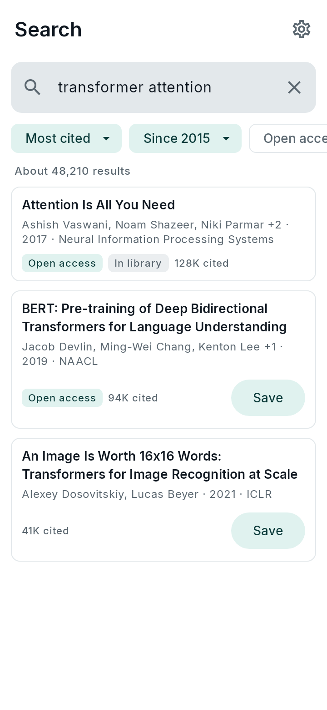
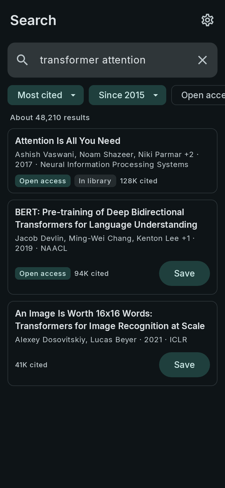
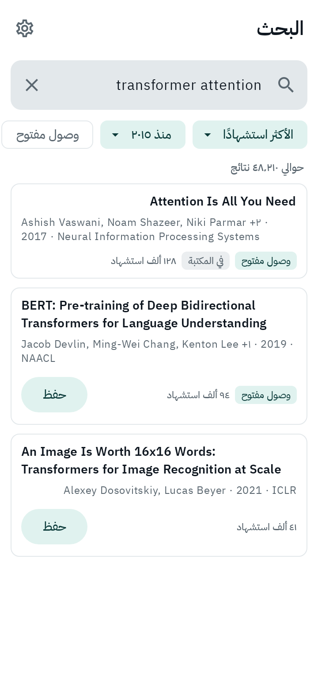
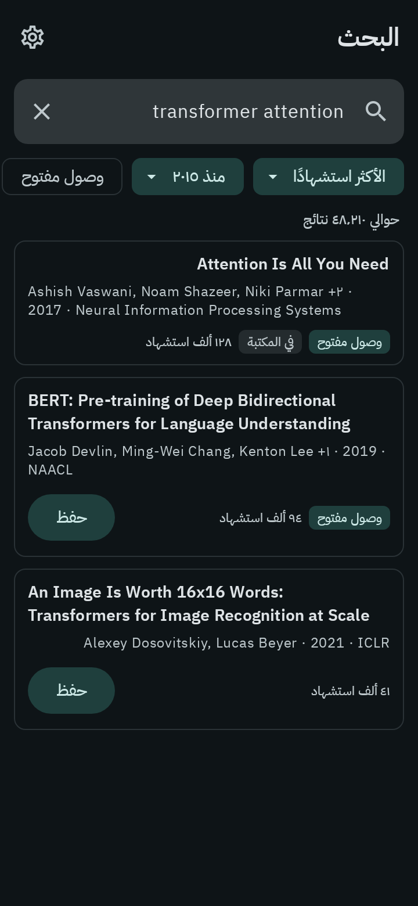
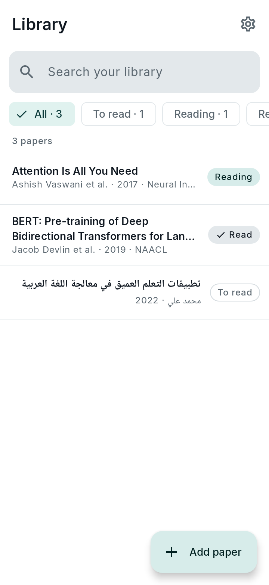
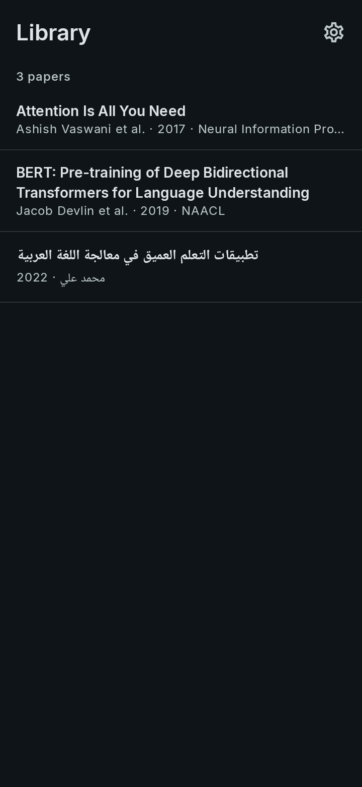
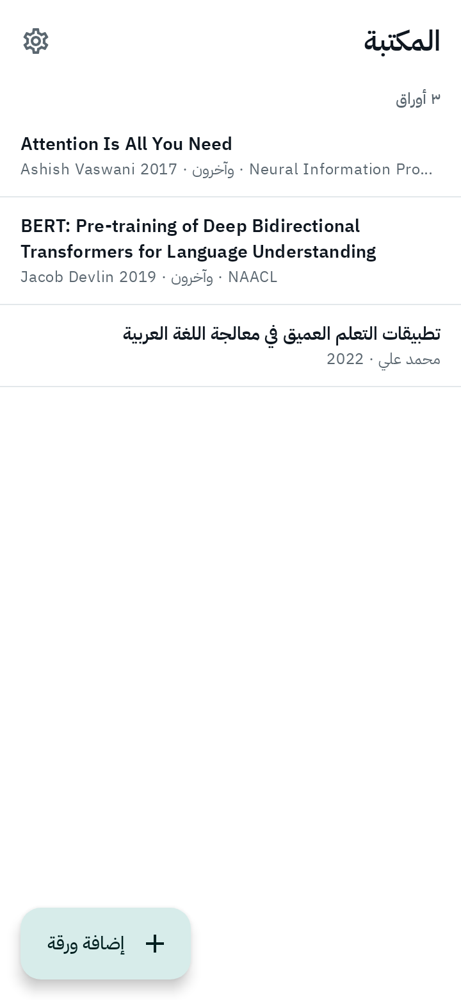
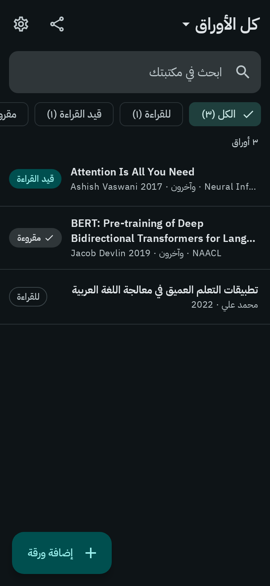
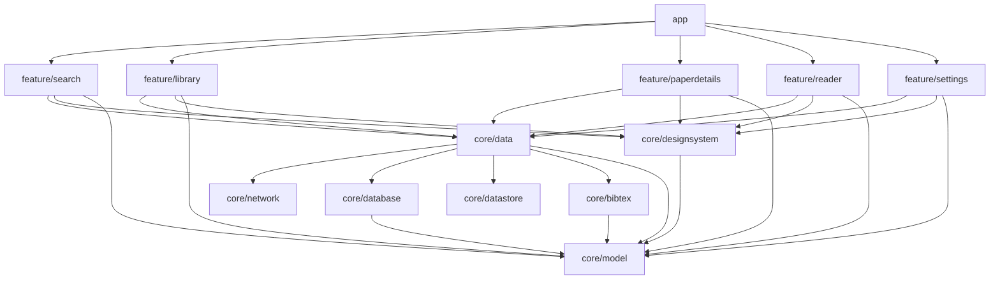

# Hashiya · حاشية

Hashiya helps master's and PhD students manage their research, from finding a paper to writing the literature review. The name is the Arabic *ḥāshiya*: the commentary scholars wrote in the margins of books.

**Discover → Save → Read → Extract → Compare → Cite**

## Screenshots

| English | English (dark) | العربية | العربية (داكن) |
|---|---|---|---|
|  |  |  |  |
|  |  |  |  |

These images are the app's screenshot-test baselines, so they always match the code.

## Features

- Search the [OpenAlex](https://openalex.org) catalog of scholarly works with sort (relevance, most cited, newest), year and open-access filters.
- Add a specific paper by pasting a DOI, arXiv ID or link into Search, with the "Add paper" button, or by sharing a page from the browser; the paper's preview opens before you save it.
- Preview a paper's abstract, authors and citations, then save it to an offline library.
- Search your library offline by words from a paper's title, authors, abstract or venue (Arabic search ignores tashkeel and letter variants), and track each paper as To read, Reading or Read with status filters and counts.
- Open a saved paper's details (every author, the full abstract and the DOI link) and write structured notes: Summary, Research question, Method, Key findings, Limitations and My thoughts. Notes save as you type and are searchable from the Library.
- Download a paper's open-access PDF, or attach your own from the device or a cloud drive, and read it in the app offline: smooth scrolling and zoom, the paper's notes in a sheet over the page, and the last page remembered. Settings shows the space PDFs use and can delete downloaded ones.
- Group saved papers into collections and filter the Library by collection. Export a collection, or the whole library, as a `.bib` file for Overleaf or LaTeX, with entry types and cite keys that stay the same from one export to the next, or copy one paper's BibTeX from its details.
- Swipe to remove from the library, with Undo.
- Full English and Arabic support, including right-to-left layouts and per-app language.
- Light and dark themes; navigation rail on tablets and foldables.

## Architecture



- **Features** see only repository interfaces from `core/data`, so every ViewModel is tested with fakes.
- **Leaf modules** (`network`, `database`, `datastore`) never see each other; `core/data` maps their types to `core/model`.
- **Convention plugins** in `build-logic` keep each module's build file to a few lines.

Kotlin · Jetpack Compose · Material 3 · Navigation (type-safe) · Hilt · Room · Paging 3 · DataStore · Retrofit + kotlinx.serialization · Coroutines/Flow

## Getting started

1. Open the project in Android Studio (JDK 21, Android SDK Platform 37).
2. Optional: add an OpenAlex API key to `local.properties`:
   ```properties
   OPENALEX_API_KEY=your-key-here
   ```
   Without it, requests are sent without a key at OpenAlex's lower free limits. Users can also enter their own key in Settings.
3. Run the `app` configuration.

## Testing

```bash
./gradlew testDebugUnitTest :core:model:test :core:bibtex:test   # unit, Robolectric UI and screenshot tests
./gradlew spotlessCheck lintDebug                                 # formatting and lint
bash scripts/record-screenshots-on-linux.sh                       # re-record screenshot baselines after an intended UI change
```

Screenshot baselines are recorded on CI's Linux runners, which are the source of truth; CI verifies every push against them.

## iOS

A native SwiftUI app with the features of sub-projects 1 to 5 lives in [`ios/`](ios/README.md): OpenAlex search with filters, adding a paper by DOI, arXiv ID or link, a Share Extension that saves the paper of a shared page, the preview sheet, the offline Library with full-text search and reading status, a details screen for each saved paper with notes that save themselves and are searchable, collections that filter the Library, a `.bib` export for Overleaf and Copy BibTeX on Details, and Settings, in English and Arabic, with Liquid Glass on iOS 26. Its Xcode project is generated with XcodeGen; see [`ios/README.md`](ios/README.md) for setup, tests and snapshot baselines.

## Roadmap

1. ✅ Foundation + OpenAlex search
2. ✅ Add by DOI / arXiv ID and Android Share
3. ✅ Library: full-text search and reading status
4. ✅ Paper details and structured notes
5. ✅ Collections and BibTeX export
6. ✅ PDFs: attach or download open-access versions
