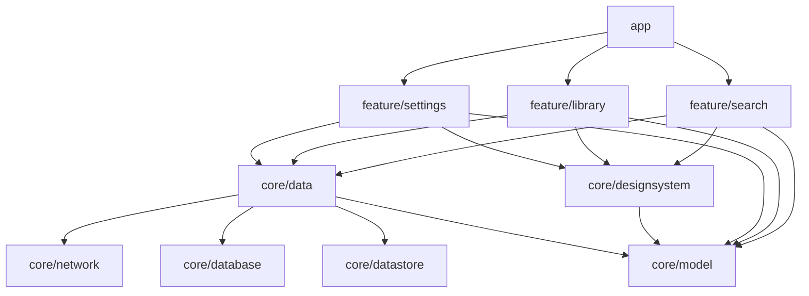

# Foundation + OpenAlex Search Implementation Plan

> **For agentic workers:** REQUIRED SUB-SKILL: Use superpowers:subagent-driven-development (recommended) or superpowers:executing-plans to implement this plan task-by-task. Steps use checkbox (`- [ ]`) syntax for tracking.

**Goal:** Turn the Android Studio template into a modular, tested Hashiya app where a user can search OpenAlex with filters, preview a paper, save it to an offline library, override the API key, and use the app in English or Arabic.

**Architecture:** Now in Android–style modules: `build-logic` convention plugins; leaf modules `core/network` (Retrofit), `core/database` (Room), `core/datastore` (DataStore); `core/data` owns repositories and all DTO/entity → model mapping; `core/model` is pure Kotlin; `core/designsystem` holds the theme and shared components; three feature modules (`search`, `library`, `settings`) depend only on `core/data`, `core/model`, `core/designsystem`; `app` wires navigation and Hilt. Each ViewModel exposes `StateFlow` UI state; the database is the single source of truth for "saved".

**Tech Stack:** Kotlin 2.4.20, AGP 9.2.1 (built-in Kotlin), Gradle 9.4.1, Jetpack Compose (BOM 2026.09.00) + Material 3, Navigation Compose 2.10.2 (type-safe routes), Hilt 2.60.1 + KSP 2.3.12, Room 2.8.5, Paging 3.5.1, DataStore 1.2.1, Retrofit 3.0.0 + OkHttp 5.5.0 + kotlinx.serialization 1.11.0, AppCompat 1.8.0 (per-app language), JUnit 4, Robolectric 4.17, Roborazzi 1.75.0, Turbine 1.2.1, MockWebServer 3, Spotless + ktlint 1.8.0, GitHub Actions.

**Spec:** `docs/superpowers/specs/2026-09-27-foundation-openalex-search-design.md`

## Global Constraints

- Base package `com.etatech.hashiya`; module namespaces `com.etatech.hashiya.core.<name>` and `com.etatech.hashiya.feature.<name>`.
- `compileSdk = 37`, `targetSdk = 36`, `minSdk = 24`. Java/Kotlin bytecode target 17. Gradle daemon JDK 21 (already set in `gradle/gradle-daemon-jvm.properties`). Install SDK Platform 37 once: `~/Library/Android/sdk/cmdline-tools/latest/bin/sdkmanager "platforms;android-37.0"`.
- Every dependency and plugin version lives in `gradle/libs.versions.toml`. No version strings in module build files.
- KSP only. `kapt` is not allowed anywhere.
- Modules do **not** apply `org.jetbrains.kotlin.android` (AGP 9 compiles Kotlin itself).
- Dependency rules: `feature/*` → `core/data`, `core/model`, `core/designsystem` only. Features never depend on `core/network`, `core/database`, `core/datastore`, or on each other. `core/network`, `core/database`, `core/datastore` do not depend on each other or on `core/model`. `core/model` has no Android dependency.
- Every user-visible string lives in `res/values/strings.xml` **and** `res/values-ar/strings.xml` of the module that uses it (Lint's `MissingTranslation` enforces the pair). No user-visible string literals in composables. Brand-neutral data strings that must not be translated use `translatable="false"`.
- Layouts use start/end, never left/right. Paper content (titles, authors, abstracts, venues) uses `TextDirection.Content`. Direction-implying icons use `Icons.AutoMirrored`.
- Tests use hand-written fakes. No mocking libraries.
- Robolectric tests run at SDK 35: every module with Robolectric tests has `src/test/resources/robolectric.properties` containing `sdk=35` (SDK 36 fails under JDK 21 in Robolectric 4.17).
- Screenshot baselines live in `<module>/src/test/screenshots/` and are committed. **Linux is the source of truth:** baselines are recorded only by the CI `record-screenshots` job through `bash scripts/record-screenshots-on-linux.sh` (created in Task 10). Local `recordRoborazziDebug` output is for visual inspection and is never committed. Local `verifyRoborazziDebug` may report sub-pixel differences on macOS; CI's verify is the gate.
- Screenshot tests set locale and night mode with Robolectric qualifiers (`ScreenshotVariantRule`, applied before the compose rule), and every Arabic variant asserts that a known Arabic string is displayed, so a baseline can never silently record English text.
- Git: `origin` is the private repo `github.com/FadyFouad/Hashiya`. Work happens on branch `feat/foundation-openalex-search`; never commit to `main` directly.
- The OpenAlex API key is never logged, never placed in exception messages, and never committed. It is read from `local.properties` key `OPENALEX_API_KEY`; a missing key means requests are sent without `api_key` (OpenAlex accepts keyless requests at lower limits).
- Run `./gradlew spotlessApply` before every commit. Commit messages use a conventional prefix (`build:`, `feat:`, `test:`, `docs:`, `chore:`) and contain no AI attribution of any kind.

## Review Focus

1. **The same work appearing on two result pages** → search results are keyed by OpenAlex ID in the `LazyColumn` (for stable scroll position and item state), so a duplicate would give two items the same key and crash Compose; a reasonable user expects each paper once and no crash. The paging source drops works already returned. Pinned by `OpenAlexPagingSourceTest.dropsWorksAlreadyReturnedOnEarlierPages` (Task 8).
2. **Search text with Arabic script, quotes, commas, colons and `%`** → must reach OpenAlex exactly as typed, not truncated or double-encoded. Pinned by `OpenAlexDataSourceTest.encodesArabicAndPunctuationInSearchText` (Task 4).
3. **Custom year range typed with Arabic-Indic digits, out of range, or reversed** → Arabic digits are accepted; invalid ranges show an inline error and cannot be applied. Pinned by `YearRangeValidationTest` (Task 15).
4. **Undo after the same paper was saved again from Search** → must not crash or duplicate the paper. Pinned by `RoomLibraryRepositoryTest.restoreAfterPaperWasSavedAgainIsNoOp` (Task 8).
5. **Losing connection while scrolling** → already-loaded results stay; a footer offers Retry. Pinned by `SearchContentTest.appendErrorShowsRetryFooterAndKeepsResults` (Task 15).

---

## File Structure

```
gradle/libs.versions.toml                      all versions (rewritten in Task 1)
settings.gradle.kts                            includes build-logic and every module
build.gradle.kts                               root: plugins `apply false`, Spotless
.editorconfig                                  ktlint rules
.github/workflows/ci.yml                       CI
build-logic/
  settings.gradle.kts
  convention/build.gradle.kts
  convention/src/main/kotlin/
    ProjectExtensions.kt                       `libs` accessor, SDK constants, Kotlin JVM target
    AndroidApplicationConventionPlugin.kt      hashiya.android.application
    AndroidLibraryConventionPlugin.kt          hashiya.android.library
    AndroidComposeConventionPlugin.kt          hashiya.android.compose
    HiltConventionPlugin.kt                    hashiya.hilt
    AndroidRoomConventionPlugin.kt             hashiya.android.room
    AndroidScreenshotConventionPlugin.kt       hashiya.android.screenshot
    AndroidFeatureConventionPlugin.kt          hashiya.android.feature
    JvmLibraryConventionPlugin.kt              hashiya.jvm.library
core/model/          Paper, Author, SearchQuery/SearchSort/YearFilter, SearchError, normalizeDoi
core/network/        DTOs, OpenAlexJson, rebuildAbstract, OpenAlexApi, OpenAlexDataSource,
                     NetworkFailure/NetworkException, ApiKeyInterceptor/UserApiKeySource, Hilt modules
core/database/       PaperEntity, PaperAuthorEntity, PaperWithAuthors, PaperDao, HashiyaDatabase, Hilt module
core/datastore/      UserPreferencesDataSource, Hilt module
core/data/           mapping/, search/ (request + error mapping), paging/OpenAlexPagingSource,
                     repository/ (Search, Library, UserPreferences), DataStoreUserApiKeySource, di/
core/testing/        MainDispatcherRule, SamplePapers, fakes, screenshot helper
core/designsystem/   theme/ (Color, Type, Theme), font/, icon/HashiyaIcons, component/ (states, PaperCard,
                     StatusBadge, PaperPreview, PaperFormatting), strings en/ar
feature/settings/    AppLanguage, SettingsViewModel, SettingsScreen, navigation, strings
feature/library/     LibraryViewModel, LibraryScreen, navigation, strings
feature/search/      SearchQueryState, SearchUiState, SearchViewModel, SearchScreen + components, navigation, strings
app/                 HashiyaApplication, MainActivity, HashiyaApp (nav), locales_config, manifest
README.md
```

Task order follows the dependency graph: build system → model → leaves → data → testing → design system → features → app → README.

---
### Task 1: Build system — version catalog, convention plugins, Spotless, CI

**Files:**
- Modify: `gradle/libs.versions.toml` (full rewrite)
- Modify: `settings.gradle.kts`, `build.gradle.kts`, `app/build.gradle.kts`, `app/src/main/AndroidManifest.xml`
- Create: `build-logic/settings.gradle.kts`, `build-logic/convention/build.gradle.kts`, 9 files in `build-logic/convention/src/main/kotlin/`
- Create: `app/src/main/java/com/etatech/hashiya/HashiyaApplication.kt`
- Create: `.editorconfig`, `.github/workflows/ci.yml`
- Delete: `app/src/androidTest/` (no instrumented tests in this sub-project), `app/src/test/java/com/etatech/hashiya/ExampleUnitTest.kt`

**Interfaces:**
- Produces plugin IDs: `hashiya.android.application`, `hashiya.android.library`, `hashiya.android.compose`, `hashiya.hilt`, `hashiya.android.room`, `hashiya.android.screenshot`, `hashiya.android.feature`, `hashiya.jvm.library`.
- Produces catalog aliases used by every later task (exact names below).

- [ ] **Step 1: Install SDK Platform 37**

Run: `~/Library/Android/sdk/cmdline-tools/latest/bin/sdkmanager "platforms;android-37.0"`
Expected: finishes without error; `ls ~/Library/Android/sdk/platforms` lists `android-37.0`.

- [ ] **Step 2: Rewrite `gradle/libs.versions.toml`**

```toml
[versions]
agp = "9.2.1"
kotlin = "2.4.20"
ksp = "2.3.12"
hilt = "2.60.1"
androidxHilt = "1.4.0"
room = "2.8.5"
paging = "3.5.1"
navigation = "2.10.2"
lifecycle = "2.11.0"
datastore = "1.2.1"
appcompat = "1.8.0"
coreKtx = "1.19.1"
activityCompose = "1.13.0"
composeBom = "2026.09.00"
materialIconsExtended = "1.7.8"
retrofit = "3.0.0"
okhttp = "5.5.0"
kotlinxSerialization = "1.11.0"
kotlinxCoroutines = "1.11.0"
junit = "4.13.2"
androidxTestCore = "1.7.0"
turbine = "1.2.1"
robolectric = "4.17"
roborazzi = "1.75.0"
spotless = "8.10.3"
ktlint = "1.8.0"

[libraries]
androidx-core-ktx = { group = "androidx.core", name = "core-ktx", version.ref = "coreKtx" }
androidx-activity-compose = { group = "androidx.activity", name = "activity-compose", version.ref = "activityCompose" }
androidx-appcompat = { group = "androidx.appcompat", name = "appcompat", version.ref = "appcompat" }
androidx-compose-bom = { group = "androidx.compose", name = "compose-bom", version.ref = "composeBom" }
androidx-compose-ui = { group = "androidx.compose.ui", name = "ui" }
androidx-compose-ui-tooling = { group = "androidx.compose.ui", name = "ui-tooling" }
androidx-compose-ui-tooling-preview = { group = "androidx.compose.ui", name = "ui-tooling-preview" }
androidx-compose-ui-test-junit4 = { group = "androidx.compose.ui", name = "ui-test-junit4" }
androidx-compose-ui-test-manifest = { group = "androidx.compose.ui", name = "ui-test-manifest" }
androidx-compose-material3 = { group = "androidx.compose.material3", name = "material3" }
androidx-compose-material3-adaptive-navigation-suite = { group = "androidx.compose.material3", name = "material3-adaptive-navigation-suite" }
androidx-compose-material-icons-extended = { group = "androidx.compose.material", name = "material-icons-extended", version.ref = "materialIconsExtended" }
androidx-lifecycle-runtime-compose = { group = "androidx.lifecycle", name = "lifecycle-runtime-compose", version.ref = "lifecycle" }
androidx-lifecycle-viewmodel-compose = { group = "androidx.lifecycle", name = "lifecycle-viewmodel-compose", version.ref = "lifecycle" }
androidx-navigation-compose = { group = "androidx.navigation", name = "navigation-compose", version.ref = "navigation" }
androidx-hilt-lifecycle-viewmodel-compose = { group = "androidx.hilt", name = "hilt-lifecycle-viewmodel-compose", version.ref = "androidxHilt" }
hilt-android = { group = "com.google.dagger", name = "hilt-android", version.ref = "hilt" }
hilt-compiler = { group = "com.google.dagger", name = "hilt-compiler", version.ref = "hilt" }
hilt-android-testing = { group = "com.google.dagger", name = "hilt-android-testing", version.ref = "hilt" }
room-runtime = { group = "androidx.room", name = "room-runtime", version.ref = "room" }
room-ktx = { group = "androidx.room", name = "room-ktx", version.ref = "room" }
room-compiler = { group = "androidx.room", name = "room-compiler", version.ref = "room" }
androidx-paging-common = { group = "androidx.paging", name = "paging-common", version.ref = "paging" }
androidx-paging-compose = { group = "androidx.paging", name = "paging-compose", version.ref = "paging" }
androidx-paging-testing = { group = "androidx.paging", name = "paging-testing", version.ref = "paging" }
androidx-datastore-preferences = { group = "androidx.datastore", name = "datastore-preferences", version.ref = "datastore" }
retrofit = { group = "com.squareup.retrofit2", name = "retrofit", version.ref = "retrofit" }
retrofit-kotlinx-serialization = { group = "com.squareup.retrofit2", name = "converter-kotlinx-serialization", version.ref = "retrofit" }
okhttp = { group = "com.squareup.okhttp3", name = "okhttp", version.ref = "okhttp" }
okhttp-logging = { group = "com.squareup.okhttp3", name = "logging-interceptor", version.ref = "okhttp" }
okhttp-mockwebserver = { group = "com.squareup.okhttp3", name = "mockwebserver3", version.ref = "okhttp" }
kotlinx-serialization-json = { group = "org.jetbrains.kotlinx", name = "kotlinx-serialization-json", version.ref = "kotlinxSerialization" }
kotlinx-coroutines-core = { group = "org.jetbrains.kotlinx", name = "kotlinx-coroutines-core", version.ref = "kotlinxCoroutines" }
kotlinx-coroutines-test = { group = "org.jetbrains.kotlinx", name = "kotlinx-coroutines-test", version.ref = "kotlinxCoroutines" }
junit = { group = "junit", name = "junit", version.ref = "junit" }
androidx-test-core-ktx = { group = "androidx.test", name = "core-ktx", version.ref = "androidxTestCore" }
turbine = { group = "app.cash.turbine", name = "turbine", version.ref = "turbine" }
robolectric = { group = "org.robolectric", name = "robolectric", version.ref = "robolectric" }
roborazzi = { group = "io.github.takahirom.roborazzi", name = "roborazzi", version.ref = "roborazzi" }
roborazzi-compose = { group = "io.github.takahirom.roborazzi", name = "roborazzi-compose", version.ref = "roborazzi" }

# build-logic only
android-gradlePlugin = { group = "com.android.tools.build", name = "gradle", version.ref = "agp" }
kotlin-gradlePlugin = { group = "org.jetbrains.kotlin", name = "kotlin-gradle-plugin", version.ref = "kotlin" }
ksp-gradlePlugin = { group = "com.google.devtools.ksp", name = "com.google.devtools.ksp.gradle.plugin", version.ref = "ksp" }
room-gradlePlugin = { group = "androidx.room", name = "room-gradle-plugin", version.ref = "room" }

[plugins]
android-application = { id = "com.android.application", version.ref = "agp" }
android-library = { id = "com.android.library", version.ref = "agp" }
kotlin-jvm = { id = "org.jetbrains.kotlin.jvm", version.ref = "kotlin" }
kotlin-compose = { id = "org.jetbrains.kotlin.plugin.compose", version.ref = "kotlin" }
kotlin-serialization = { id = "org.jetbrains.kotlin.plugin.serialization", version.ref = "kotlin" }
ksp = { id = "com.google.devtools.ksp", version.ref = "ksp" }
hilt = { id = "com.google.dagger.hilt.android", version.ref = "hilt" }
room = { id = "androidx.room", version.ref = "room" }
roborazzi = { id = "io.github.takahirom.roborazzi", version.ref = "roborazzi" }
spotless = { id = "com.diffplug.spotless", version.ref = "spotless" }
```

- [ ] **Step 3: Create `build-logic`**

`build-logic/settings.gradle.kts`:
```kotlin
dependencyResolutionManagement {
    repositories {
        google()
        mavenCentral()
    }
    versionCatalogs {
        create("libs") {
            from(files("../gradle/libs.versions.toml"))
        }
    }
}

rootProject.name = "build-logic"
include(":convention")
```

`build-logic/convention/build.gradle.kts`:
```kotlin
plugins {
    `kotlin-dsl`
}

group = "com.etatech.hashiya.buildlogic"

dependencies {
    compileOnly(libs.android.gradlePlugin)
    compileOnly(libs.kotlin.gradlePlugin)
    compileOnly(libs.ksp.gradlePlugin)
    compileOnly(libs.room.gradlePlugin)
}

gradlePlugin {
    plugins {
        register("androidApplication") {
            id = "hashiya.android.application"
            implementationClass = "AndroidApplicationConventionPlugin"
        }
        register("androidLibrary") {
            id = "hashiya.android.library"
            implementationClass = "AndroidLibraryConventionPlugin"
        }
        register("androidCompose") {
            id = "hashiya.android.compose"
            implementationClass = "AndroidComposeConventionPlugin"
        }
        register("hilt") {
            id = "hashiya.hilt"
            implementationClass = "HiltConventionPlugin"
        }
        register("androidRoom") {
            id = "hashiya.android.room"
            implementationClass = "AndroidRoomConventionPlugin"
        }
        register("androidScreenshot") {
            id = "hashiya.android.screenshot"
            implementationClass = "AndroidScreenshotConventionPlugin"
        }
        register("androidFeature") {
            id = "hashiya.android.feature"
            implementationClass = "AndroidFeatureConventionPlugin"
        }
        register("jvmLibrary") {
            id = "hashiya.jvm.library"
            implementationClass = "JvmLibraryConventionPlugin"
        }
    }
}
```

`build-logic/convention/src/main/kotlin/ProjectExtensions.kt`:
```kotlin
import org.gradle.api.Project
import org.gradle.api.artifacts.MinimalExternalModuleDependency
import org.gradle.api.artifacts.VersionCatalog
import org.gradle.api.artifacts.VersionCatalogsExtension
import org.gradle.api.provider.Provider
import org.gradle.kotlin.dsl.configure
import org.gradle.kotlin.dsl.getByType
import org.jetbrains.kotlin.gradle.dsl.JvmTarget
import org.jetbrains.kotlin.gradle.dsl.KotlinAndroidProjectExtension

internal const val COMPILE_SDK = 37
internal const val TARGET_SDK = 36
internal const val MIN_SDK = 24

internal val Project.libs: VersionCatalog
    get() = extensions.getByType<VersionCatalogsExtension>().named("libs")

internal fun VersionCatalog.library(alias: String): Provider<MinimalExternalModuleDependency> = findLibrary(alias).get()

internal fun Project.configureKotlinAndroid() {
    extensions.configure<KotlinAndroidProjectExtension> {
        compilerOptions {
            jvmTarget.set(JvmTarget.JVM_17)
        }
    }
}
```

`build-logic/convention/src/main/kotlin/AndroidApplicationConventionPlugin.kt`:
```kotlin
import com.android.build.api.dsl.ApplicationExtension
import org.gradle.api.JavaVersion
import org.gradle.api.Plugin
import org.gradle.api.Project
import org.gradle.kotlin.dsl.configure

class AndroidApplicationConventionPlugin : Plugin<Project> {
    override fun apply(target: Project) = with(target) {
        pluginManager.apply("com.android.application")
        extensions.configure<ApplicationExtension> {
            compileSdk = COMPILE_SDK
            defaultConfig {
                minSdk = MIN_SDK
                targetSdk = TARGET_SDK
            }
            compileOptions {
                sourceCompatibility = JavaVersion.VERSION_17
                targetCompatibility = JavaVersion.VERSION_17
            }
            testOptions.unitTests.isIncludeAndroidResources = true
        }
        configureKotlinAndroid()
    }
}
```

`build-logic/convention/src/main/kotlin/AndroidLibraryConventionPlugin.kt`:
```kotlin
import com.android.build.api.dsl.LibraryExtension
import org.gradle.api.JavaVersion
import org.gradle.api.Plugin
import org.gradle.api.Project
import org.gradle.kotlin.dsl.configure

class AndroidLibraryConventionPlugin : Plugin<Project> {
    override fun apply(target: Project) = with(target) {
        pluginManager.apply("com.android.library")
        extensions.configure<LibraryExtension> {
            compileSdk = COMPILE_SDK
            defaultConfig.minSdk = MIN_SDK
            compileOptions {
                sourceCompatibility = JavaVersion.VERSION_17
                targetCompatibility = JavaVersion.VERSION_17
            }
            testOptions.unitTests.isIncludeAndroidResources = true
        }
        configureKotlinAndroid()
    }
}
```

`build-logic/convention/src/main/kotlin/AndroidComposeConventionPlugin.kt`:
```kotlin
import com.android.build.api.dsl.ApplicationExtension
import com.android.build.api.dsl.LibraryExtension
import org.gradle.api.Plugin
import org.gradle.api.Project
import org.gradle.kotlin.dsl.configure
import org.gradle.kotlin.dsl.dependencies

class AndroidComposeConventionPlugin : Plugin<Project> {
    override fun apply(target: Project) = with(target) {
        pluginManager.apply("org.jetbrains.kotlin.plugin.compose")
        pluginManager.withPlugin("com.android.application") {
            extensions.configure<ApplicationExtension> { buildFeatures.compose = true }
        }
        pluginManager.withPlugin("com.android.library") {
            extensions.configure<LibraryExtension> { buildFeatures.compose = true }
        }
        dependencies {
            val bom = platform(libs.library("androidx-compose-bom"))
            add("implementation", bom)
            add("testImplementation", bom)
            add("implementation", libs.library("androidx-compose-ui"))
            add("implementation", libs.library("androidx-compose-material3"))
            add("implementation", libs.library("androidx-compose-ui-tooling-preview"))
            add("debugImplementation", libs.library("androidx-compose-ui-tooling"))
        }
    }
}
```

`build-logic/convention/src/main/kotlin/HiltConventionPlugin.kt`:
```kotlin
import org.gradle.api.Plugin
import org.gradle.api.Project
import org.gradle.kotlin.dsl.dependencies

class HiltConventionPlugin : Plugin<Project> {
    override fun apply(target: Project) = with(target) {
        pluginManager.apply("com.google.devtools.ksp")
        pluginManager.apply("com.google.dagger.hilt.android")
        dependencies {
            add("implementation", libs.library("hilt-android"))
            add("ksp", libs.library("hilt-compiler"))
        }
    }
}
```

`build-logic/convention/src/main/kotlin/AndroidRoomConventionPlugin.kt`:
```kotlin
import androidx.room.gradle.RoomExtension
import org.gradle.api.Plugin
import org.gradle.api.Project
import org.gradle.kotlin.dsl.configure
import org.gradle.kotlin.dsl.dependencies

class AndroidRoomConventionPlugin : Plugin<Project> {
    override fun apply(target: Project) = with(target) {
        pluginManager.apply("com.google.devtools.ksp")
        pluginManager.apply("androidx.room")
        extensions.configure<RoomExtension> {
            schemaDirectory("$projectDir/schemas")
        }
        dependencies {
            add("implementation", libs.library("room-runtime"))
            add("implementation", libs.library("room-ktx"))
            add("ksp", libs.library("room-compiler"))
        }
    }
}
```

`build-logic/convention/src/main/kotlin/AndroidScreenshotConventionPlugin.kt`:
```kotlin
import org.gradle.api.Plugin
import org.gradle.api.Project
import org.gradle.kotlin.dsl.dependencies

/** Robolectric + Roborazzi screenshot and Compose UI tests on the JVM. */
class AndroidScreenshotConventionPlugin : Plugin<Project> {
    override fun apply(target: Project) = with(target) {
        pluginManager.apply("io.github.takahirom.roborazzi")
        dependencies {
            add("testImplementation", libs.library("robolectric"))
            add("testImplementation", libs.library("roborazzi"))
            add("testImplementation", libs.library("roborazzi-compose"))
            add("testImplementation", libs.library("androidx-compose-ui-test-junit4"))
            add("testImplementation", libs.library("androidx-test-core-ktx"))
            add("debugImplementation", libs.library("androidx-compose-ui-test-manifest"))
        }
    }
}
```

`build-logic/convention/src/main/kotlin/AndroidFeatureConventionPlugin.kt`:
```kotlin
import org.gradle.api.Plugin
import org.gradle.api.Project
import org.gradle.kotlin.dsl.dependencies

class AndroidFeatureConventionPlugin : Plugin<Project> {
    override fun apply(target: Project) = with(target) {
        pluginManager.apply("hashiya.android.library")
        pluginManager.apply("hashiya.android.compose")
        pluginManager.apply("hashiya.hilt")
        pluginManager.apply("hashiya.android.screenshot")
        pluginManager.apply("org.jetbrains.kotlin.plugin.serialization")
        dependencies {
            add("implementation", project(":core:data"))
            add("implementation", project(":core:model"))
            add("implementation", project(":core:designsystem"))
            add("implementation", libs.library("androidx-hilt-lifecycle-viewmodel-compose"))
            add("implementation", libs.library("androidx-lifecycle-runtime-compose"))
            add("implementation", libs.library("androidx-lifecycle-viewmodel-compose"))
            add("implementation", libs.library("androidx-navigation-compose"))
            add("implementation", libs.library("kotlinx-serialization-json"))
            add("testImplementation", project(":core:testing"))
        }
    }
}
```

`build-logic/convention/src/main/kotlin/JvmLibraryConventionPlugin.kt`:
```kotlin
import org.gradle.api.JavaVersion
import org.gradle.api.Plugin
import org.gradle.api.Project
import org.gradle.api.plugins.JavaPluginExtension
import org.gradle.kotlin.dsl.configure
import org.gradle.kotlin.dsl.dependencies
import org.jetbrains.kotlin.gradle.dsl.JvmTarget
import org.jetbrains.kotlin.gradle.dsl.KotlinJvmProjectExtension

class JvmLibraryConventionPlugin : Plugin<Project> {
    override fun apply(target: Project) = with(target) {
        pluginManager.apply("org.jetbrains.kotlin.jvm")
        extensions.configure<JavaPluginExtension> {
            sourceCompatibility = JavaVersion.VERSION_17
            targetCompatibility = JavaVersion.VERSION_17
        }
        extensions.configure<KotlinJvmProjectExtension> {
            compilerOptions.jvmTarget.set(JvmTarget.JVM_17)
        }
        dependencies {
            add("testImplementation", libs.library("junit"))
        }
    }
}
```

- [ ] **Step 4: Update root build files**

`settings.gradle.kts` (replace the whole file):
```kotlin
pluginManagement {
    includeBuild("build-logic")
    repositories {
        google {
            content {
                includeGroupByRegex("com\\.android.*")
                includeGroupByRegex("com\\.google.*")
                includeGroupByRegex("androidx.*")
            }
        }
        mavenCentral()
        gradlePluginPortal()
    }
}
plugins {
    id("org.gradle.toolchains.foojay-resolver-convention") version "1.0.0"
}
dependencyResolutionManagement {
    repositoriesMode.set(RepositoriesMode.FAIL_ON_PROJECT_REPOS)
    repositories {
        google()
        mavenCentral()
    }
}

rootProject.name = "Hashiya"
include(":app")
```

`build.gradle.kts` (replace the whole file):
```kotlin
plugins {
    alias(libs.plugins.android.application) apply false
    alias(libs.plugins.android.library) apply false
    alias(libs.plugins.kotlin.jvm) apply false
    alias(libs.plugins.kotlin.compose) apply false
    alias(libs.plugins.kotlin.serialization) apply false
    alias(libs.plugins.ksp) apply false
    alias(libs.plugins.hilt) apply false
    alias(libs.plugins.room) apply false
    alias(libs.plugins.roborazzi) apply false
    alias(libs.plugins.spotless)
}

spotless {
    kotlin {
        target("**/*.kt")
        targetExclude("**/build/**")
        ktlint(libs.versions.ktlint.get())
    }
    kotlinGradle {
        target("**/*.gradle.kts")
        targetExclude("**/build/**")
        ktlint(libs.versions.ktlint.get())
    }
}
```

`.editorconfig`:
```ini
root = true

[*.{kt,kts}]
ktlint_code_style = android_studio
max_line_length = 140
ktlint_function_naming_ignore_when_annotated_with = Composable
# Compose code uses PascalCase for icon, color and font vals (e.g. HashiyaIcons.Search).
ktlint_standard_property-naming = disabled
```

- [ ] **Step 5: Move `app` onto the conventions and add the Hilt application**

`app/build.gradle.kts` (replace the whole file):
```kotlin
plugins {
    id("hashiya.android.application")
    id("hashiya.android.compose")
    id("hashiya.hilt")
}

android {
    namespace = "com.etatech.hashiya"

    defaultConfig {
        applicationId = "com.etatech.hashiya"
        versionCode = 1
        versionName = "0.1.0"
    }

    buildTypes {
        release {
            optimization {
                enable = false
            }
        }
    }
}

dependencies {
    implementation(libs.androidx.core.ktx)
    implementation(libs.androidx.activity.compose)
}
```

`app/src/main/java/com/etatech/hashiya/HashiyaApplication.kt`:
```kotlin
package com.etatech.hashiya

import android.app.Application
import dagger.hilt.android.HiltAndroidApp

@HiltAndroidApp
class HashiyaApplication : Application()
```

In `app/src/main/AndroidManifest.xml`, add `android:name=".HashiyaApplication"` as the first attribute of `<application>`.

Delete the template tests:
```bash
rm -rf app/src/androidTest app/src/test/java/com/etatech/hashiya/ExampleUnitTest.kt
```

- [ ] **Step 6: Add CI**

`.github/workflows/ci.yml`:
```yaml
name: CI

on:
  push:

concurrency:
  group: ci-${{ github.ref }}
  cancel-in-progress: true

jobs:
  build:
    if: ${{ !startsWith(github.ref_name, 'record-screenshots/') }}
    runs-on: ubuntu-latest
    timeout-minutes: 45
    steps:
      - uses: actions/checkout@v7
      - uses: actions/setup-java@v6
        with:
          distribution: temurin
          java-version: 21
      - uses: gradle/actions/setup-gradle@v6
      - name: Check, build and test (screenshots verified against the Linux baselines)
        run: >-
          ./gradlew spotlessCheck assembleDebug testDebugUnitTest lintDebug
          -Proborazzi.test.verify=true --continue
      - name: Upload screenshot diffs
        if: failure()
        uses: actions/upload-artifact@v7
        with:
          name: screenshot-diffs
          path: "**/build/outputs/roborazzi"
          if-no-files-found: ignore

  # A push to record-screenshots/<anything> records the Roborazzi baselines on Linux, the source of truth.
  # scripts/record-screenshots-on-linux.sh (Task 10) drives this job and copies the result into the checkout.
  record-screenshots:
    if: ${{ startsWith(github.ref_name, 'record-screenshots/') }}
    runs-on: ubuntu-latest
    timeout-minutes: 45
    steps:
      - uses: actions/checkout@v7
      - uses: actions/setup-java@v6
        with:
          distribution: temurin
          java-version: 21
      - uses: gradle/actions/setup-gradle@v6
      - run: ./gradlew recordRoborazziDebug
      - uses: actions/upload-artifact@v7
        with:
          name: screenshot-baselines
          path: "**/src/test/screenshots"
```

The `-Proborazzi.test.verify=true` flag is harmless until the first screenshot tests exist (Task 10).

- [ ] **Step 7: Verify the build**

Run: `./gradlew spotlessApply && ./gradlew spotlessCheck :app:assembleDebug :app:lintDebug`
Expected: `BUILD SUCCESSFUL`. If `spotlessApply` reformats template files (`MainActivity.kt`, `ui/theme/*`), that is expected.

- [ ] **Step 8: Commit**

```bash
git add -A
git commit -m "build: add convention plugins, version catalog, Spotless and CI"
```

---

### Task 2: `core/model`

**Files:**
- Modify: `settings.gradle.kts` (add `include(":core:model")`), `.github/workflows/ci.yml`
- Create: `core/model/build.gradle.kts`
- Create: `core/model/src/main/kotlin/com/etatech/hashiya/core/model/Paper.kt`, `SearchQuery.kt`, `SearchError.kt`, `Doi.kt`
- Test: `core/model/src/test/kotlin/com/etatech/hashiya/core/model/DoiTest.kt`, `SearchQueryTest.kt`

**Interfaces:**
- Produces (package `com.etatech.hashiya.core.model`):
  - `data class Paper(openAlexId: String, doi: String?, title: String, authors: List<Author>, year: Int?, venue: String?, abstract: String?, citationCount: Int, isOpenAccess: Boolean, openAccessPdfUrl: String?)`
  - `data class Author(name: String, openAlexId: String?)`
  - `data class SearchQuery(text: String, sort: SearchSort = Relevance, years: YearFilter = AnyTime, openAccessOnly: Boolean = false)` with `val hasActiveFilters: Boolean`
  - `enum class SearchSort { Relevance, MostCited, Newest }`
  - `sealed interface YearFilter { AnyTime; Since(year: Int); Between(from: Int, to: Int) }`
  - `sealed interface SearchError { Offline; InvalidUserKey; RateLimited; ServiceUnavailable; Unexpected }`
  - `fun normalizeDoi(raw: String): String?`

- [ ] **Step 1: Register the module**

Append to `settings.gradle.kts`: `include(":core:model")`

`core/model/build.gradle.kts`:
```kotlin
plugins {
    id("hashiya.jvm.library")
}
```

- [ ] **Step 2: Write the failing tests**

`core/model/src/test/kotlin/com/etatech/hashiya/core/model/DoiTest.kt`:
```kotlin
package com.etatech.hashiya.core.model

import org.junit.Assert.assertEquals
import org.junit.Assert.assertNull
import org.junit.Test

class DoiTest {
    @Test
    fun stripsDoiOrgUrlAndLowercases() {
        assertEquals("10.48550/arxiv.1706.03762", normalizeDoi("https://doi.org/10.48550/arXiv.1706.03762"))
    }

    @Test
    fun stripsOtherKnownPrefixes() {
        assertEquals("10.1000/xyz", normalizeDoi("http://dx.doi.org/10.1000/XYZ"))
        assertEquals("10.1000/xyz", normalizeDoi("doi:10.1000/xyz"))
    }

    @Test
    fun trimsWhitespace() {
        assertEquals("10.1000/xyz", normalizeDoi("  10.1000/xyz \n"))
    }

    @Test
    fun keepsBareDoi() {
        assertEquals("10.1000/xyz", normalizeDoi("10.1000/xyz"))
    }

    @Test
    fun rejectsValuesThatAreNotDois() {
        assertNull(normalizeDoi(""))
        assertNull(normalizeDoi("https://example.com/paper"))
        assertNull(normalizeDoi("10.1000"))
    }
}
```

`core/model/src/test/kotlin/com/etatech/hashiya/core/model/SearchQueryTest.kt`:
```kotlin
package com.etatech.hashiya.core.model

import org.junit.Assert.assertFalse
import org.junit.Assert.assertThrows
import org.junit.Assert.assertTrue
import org.junit.Test

class SearchQueryTest {
    @Test
    fun betweenRejectsReversedRange() {
        assertThrows(IllegalArgumentException::class.java) { YearFilter.Between(2021, 2020) }
    }

    @Test
    fun betweenAcceptsSingleYear() {
        YearFilter.Between(2020, 2020)
    }

    @Test
    fun sortIsNotAFilter() {
        assertFalse(SearchQuery("bert", sort = SearchSort.MostCited).hasActiveFilters)
    }

    @Test
    fun yearAndOpenAccessAreFilters() {
        assertTrue(SearchQuery("bert", years = YearFilter.Since(2020)).hasActiveFilters)
        assertTrue(SearchQuery("bert", openAccessOnly = true).hasActiveFilters)
    }
}
```

- [ ] **Step 3: Run tests to verify they fail**

Run: `./gradlew :core:model:test`
Expected: FAIL — compilation errors `Unresolved reference: normalizeDoi`, `YearFilter`, `SearchQuery`.

- [ ] **Step 4: Implement the model**

`core/model/src/main/kotlin/com/etatech/hashiya/core/model/Paper.kt`:
```kotlin
package com.etatech.hashiya.core.model

/** A research paper. [title] is empty when the source has none; the UI shows a localized "Untitled". */
data class Paper(
    val openAlexId: String,
    val doi: String?,
    val title: String,
    val authors: List<Author>,
    val year: Int?,
    val venue: String?,
    val abstract: String?,
    val citationCount: Int,
    val isOpenAccess: Boolean,
    val openAccessPdfUrl: String?,
)

data class Author(
    val name: String,
    val openAlexId: String?,
)
```

`core/model/src/main/kotlin/com/etatech/hashiya/core/model/SearchQuery.kt`:
```kotlin
package com.etatech.hashiya.core.model

data class SearchQuery(
    val text: String,
    val sort: SearchSort = SearchSort.Relevance,
    val years: YearFilter = YearFilter.AnyTime,
    val openAccessOnly: Boolean = false,
) {
    val hasActiveFilters: Boolean
        get() = years != YearFilter.AnyTime || openAccessOnly
}

enum class SearchSort { Relevance, MostCited, Newest }

sealed interface YearFilter {
    data object AnyTime : YearFilter

    data class Since(val year: Int) : YearFilter

    data class Between(val from: Int, val to: Int) : YearFilter {
        init {
            require(from <= to) { "from ($from) must not be after to ($to)" }
        }
    }
}
```

`core/model/src/main/kotlin/com/etatech/hashiya/core/model/SearchError.kt`:
```kotlin
package com.etatech.hashiya.core.model

sealed interface SearchError {
    data object Offline : SearchError
    data object InvalidUserKey : SearchError
    data object RateLimited : SearchError
    data object ServiceUnavailable : SearchError
    data object Unexpected : SearchError
}
```

`core/model/src/main/kotlin/com/etatech/hashiya/core/model/Doi.kt`:
```kotlin
package com.etatech.hashiya.core.model

private val DOI_PREFIXES = listOf(
    "https://doi.org/",
    "http://doi.org/",
    "https://dx.doi.org/",
    "http://dx.doi.org/",
    "doi:",
)

/** Returns the DOI in canonical form (`10.xxxx/yyy`, lowercase, no URL prefix), or null if [raw] is not a DOI. */
fun normalizeDoi(raw: String): String? {
    var value = raw.trim().lowercase()
    DOI_PREFIXES.firstOrNull { value.startsWith(it) }?.let { prefix ->
        value = value.removePrefix(prefix).trim()
    }
    return value.takeIf { it.startsWith("10.") && it.contains('/') }
}
```

- [ ] **Step 5: Run tests to verify they pass**

Run: `./gradlew :core:model:test`
Expected: `BUILD SUCCESSFUL`, 9 tests passed.

- [ ] **Step 6: Run the JVM tests in CI**

In `.github/workflows/ci.yml`, change the build job's run step to:
```yaml
        run: >-
          ./gradlew spotlessCheck assembleDebug testDebugUnitTest :core:model:test lintDebug
          -Proborazzi.test.verify=true --continue
```

- [ ] **Step 7: Commit**

```bash
./gradlew spotlessApply
git add -A
git commit -m "feat: add core model types and DOI normalization"
```

---
### Task 3: `core/network` — OpenAlex response models and abstract rebuilding

**Files:**
- Modify: `settings.gradle.kts` (add `include(":core:network")`)
- Create: `core/network/build.gradle.kts`
- Create: `core/network/src/main/java/com/etatech/hashiya/core/network/model/NetworkWorks.kt`
- Create: `core/network/src/main/java/com/etatech/hashiya/core/network/OpenAlexJson.kt`
- Create: `core/network/src/main/java/com/etatech/hashiya/core/network/model/AbstractRebuilder.kt`
- Test: `core/network/src/test/resources/works_page.json`
- Test: `core/network/src/test/java/com/etatech/hashiya/core/network/TestFixtures.kt`
- Test: `core/network/src/test/java/com/etatech/hashiya/core/network/model/OpenAlexParsingTest.kt`, `AbstractRebuilderTest.kt`

**Interfaces:**
- Produces (package `com.etatech.hashiya.core.network.model`, all public so `core/data` can map them):
  - `NetworkWorksResponse(meta: NetworkMeta, results: List<NetworkWork>)`
  - `NetworkMeta(count: Long, nextCursor: String?)`
  - `NetworkWork(id: String, doi: String?, displayName: String?, publicationYear: Int?, primaryLocation: NetworkLocation?, authorships: List<NetworkAuthorship>, citedByCount: Int, openAccess: NetworkOpenAccess?, bestOaLocation: NetworkLocation?, abstractInvertedIndex: Map<String, List<Int>>?)` — every parameter except `id` has a default.
  - `NetworkLocation(source: NetworkSource?, pdfUrl: String?)`, `NetworkSource(displayName: String?)`, `NetworkAuthorship(author: NetworkAuthor)`, `NetworkAuthor(id: String?, displayName: String?)`, `NetworkOpenAccess(isOa: Boolean)`
  - `fun rebuildAbstract(index: Map<String, List<Int>>?): String?`
- Produces (package `com.etatech.hashiya.core.network`): `internal val OpenAlexJson: Json`

- [ ] **Step 1: Register the module**

Append to `settings.gradle.kts`: `include(":core:network")`

`core/network/build.gradle.kts`:
```kotlin
import java.util.Properties

plugins {
    id("hashiya.android.library")
    id("hashiya.hilt")
    alias(libs.plugins.kotlin.serialization)
}

android {
    namespace = "com.etatech.hashiya.core.network"

    buildFeatures {
        buildConfig = true
    }

    defaultConfig {
        val localProperties = Properties()
        val localPropertiesFile = rootProject.file("local.properties")
        if (localPropertiesFile.exists()) {
            localPropertiesFile.inputStream().use(localProperties::load)
        }
        val apiKey = localProperties.getProperty("OPENALEX_API_KEY", "")
        buildConfigField("String", "OPENALEX_API_KEY", "\"$apiKey\"")
    }
}

dependencies {
    api(libs.kotlinx.serialization.json)
    api(libs.kotlinx.coroutines.core)
    implementation(libs.retrofit)
    implementation(libs.retrofit.kotlinx.serialization)
    implementation(libs.okhttp)
    implementation(libs.okhttp.logging)

    testImplementation(libs.junit)
    testImplementation(libs.kotlinx.coroutines.test)
    testImplementation(libs.okhttp.mockwebserver)
}
```

- [ ] **Step 2: Add the test fixture (shape copied from a live OpenAlex response)**

`core/network/src/test/resources/works_page.json`:
```json
{
  "meta": {
    "count": 48210,
    "db_response_time_ms": 146,
    "page": null,
    "per_page": 25,
    "next_cursor": "IlsxMDAuMCwgJ1czMTc3ODI4OTA5J10i",
    "cost_usd": 0.001
  },
  "results": [
    {
      "id": "https://openalex.org/W2626778328",
      "doi": "https://doi.org/10.48550/arXiv.1706.03762",
      "display_name": "Attention Is All You Need",
      "publication_year": 2017,
      "primary_location": {
        "is_oa": true,
        "pdf_url": "https://arxiv.org/pdf/1706.03762",
        "source": { "id": "https://openalex.org/S4306420609", "display_name": "Neural Information Processing Systems", "type": "conference" }
      },
      "authorships": [
        { "author_position": "first", "author": { "id": "https://openalex.org/A5103024730", "display_name": "Ashish Vaswani" } },
        { "author_position": "middle", "author": { "id": "https://openalex.org/A5021878400", "display_name": "Noam Shazeer" } },
        { "author_position": "last", "author": { "id": null, "display_name": "Illia Polosukhin" } }
      ],
      "cited_by_count": 128412,
      "open_access": { "is_oa": true, "oa_status": "green", "oa_url": "https://arxiv.org/pdf/1706.03762" },
      "best_oa_location": { "is_oa": true, "pdf_url": "https://arxiv.org/pdf/1706.03762", "source": null },
      "abstract_inverted_index": { "The": [0], "dominant": [1], "sequence": [2], "transduction": [3], "models": [4], "are": [5], "based": [6], "on": [7], "attention.": [8] }
    },
    {
      "id": "https://openalex.org/W4385245566",
      "doi": null,
      "display_name": null,
      "publication_year": null,
      "primary_location": { "is_oa": false, "pdf_url": null, "source": null },
      "authorships": [],
      "cited_by_count": null,
      "open_access": { "is_oa": false, "oa_status": "closed", "oa_url": null },
      "best_oa_location": null,
      "abstract_inverted_index": null
    }
  ]
}
```

`core/network/src/test/java/com/etatech/hashiya/core/network/TestFixtures.kt`:
```kotlin
package com.etatech.hashiya.core.network

internal fun readFixture(name: String): String =
    requireNotNull(TestFixtures::class.java.classLoader?.getResource(name)) { "Missing fixture $name" }.readText()

private object TestFixtures
```

- [ ] **Step 3: Write the failing tests**

`core/network/src/test/java/com/etatech/hashiya/core/network/model/OpenAlexParsingTest.kt`:
```kotlin
package com.etatech.hashiya.core.network.model

import com.etatech.hashiya.core.network.OpenAlexJson
import com.etatech.hashiya.core.network.readFixture
import org.junit.Assert.assertEquals
import org.junit.Assert.assertFalse
import org.junit.Assert.assertNull
import org.junit.Assert.assertTrue
import org.junit.Test

class OpenAlexParsingTest {
    private val response = OpenAlexJson.decodeFromString<NetworkWorksResponse>(readFixture("works_page.json"))

    @Test
    fun parsesMeta() {
        assertEquals(48210L, response.meta.count)
        assertEquals("IlsxMDAuMCwgJ1czMTc3ODI4OTA5J10i", response.meta.nextCursor)
        assertEquals(2, response.results.size)
    }

    @Test
    fun parsesCompleteWork() {
        val work = response.results[0]
        assertEquals("https://openalex.org/W2626778328", work.id)
        assertEquals("https://doi.org/10.48550/arXiv.1706.03762", work.doi)
        assertEquals("Attention Is All You Need", work.displayName)
        assertEquals(2017, work.publicationYear)
        assertEquals("Neural Information Processing Systems", work.primaryLocation?.source?.displayName)
        assertEquals(listOf("Ashish Vaswani", "Noam Shazeer", "Illia Polosukhin"), work.authorships.map { it.author.displayName })
        assertNull(work.authorships[2].author.id)
        assertEquals(128412, work.citedByCount)
        assertTrue(work.openAccess!!.isOa)
        assertEquals("https://arxiv.org/pdf/1706.03762", work.bestOaLocation?.pdfUrl)
        assertEquals(listOf(1), work.abstractInvertedIndex?.get("dominant"))
    }

    @Test
    fun toleratesNullsInSparseWork() {
        val work = response.results[1]
        assertNull(work.doi)
        assertNull(work.displayName)
        assertNull(work.publicationYear)
        assertNull(work.primaryLocation?.source)
        assertTrue(work.authorships.isEmpty())
        assertEquals(0, work.citedByCount)
        assertFalse(work.openAccess!!.isOa)
        assertNull(work.bestOaLocation)
        assertNull(work.abstractInvertedIndex)
    }
}
```

`core/network/src/test/java/com/etatech/hashiya/core/network/model/AbstractRebuilderTest.kt`:
```kotlin
package com.etatech.hashiya.core.network.model

import org.junit.Assert.assertEquals
import org.junit.Assert.assertNull
import org.junit.Test

class AbstractRebuilderTest {
    @Test
    fun placesWordsByPosition() {
        val index = mapOf("world" to listOf(1), "Hello" to listOf(0))
        assertEquals("Hello world", rebuildAbstract(index))
    }

    @Test
    fun repeatsWordsThatAppearAtSeveralPositions() {
        val index = mapOf("the" to listOf(0, 3), "cat" to listOf(1), "saw" to listOf(2), "dog" to listOf(4))
        assertEquals("the cat saw the dog", rebuildAbstract(index))
    }

    @Test
    fun returnsNullWhenMissingOrEmpty() {
        assertNull(rebuildAbstract(null))
        assertNull(rebuildAbstract(emptyMap()))
    }
}
```

- [ ] **Step 4: Run tests to verify they fail**

Run: `./gradlew :core:network:testDebugUnitTest`
Expected: FAIL — `Unresolved reference: NetworkWorksResponse`, `OpenAlexJson`, `rebuildAbstract`.

- [ ] **Step 5: Implement**

`core/network/src/main/java/com/etatech/hashiya/core/network/model/NetworkWorks.kt`:
```kotlin
package com.etatech.hashiya.core.network.model

import kotlinx.serialization.SerialName
import kotlinx.serialization.Serializable

@Serializable
data class NetworkWorksResponse(
    val meta: NetworkMeta,
    val results: List<NetworkWork> = emptyList(),
)

@Serializable
data class NetworkMeta(
    val count: Long = 0,
    @SerialName("next_cursor") val nextCursor: String? = null,
)

@Serializable
data class NetworkWork(
    val id: String,
    val doi: String? = null,
    @SerialName("display_name") val displayName: String? = null,
    @SerialName("publication_year") val publicationYear: Int? = null,
    @SerialName("primary_location") val primaryLocation: NetworkLocation? = null,
    val authorships: List<NetworkAuthorship> = emptyList(),
    @SerialName("cited_by_count") val citedByCount: Int = 0,
    @SerialName("open_access") val openAccess: NetworkOpenAccess? = null,
    @SerialName("best_oa_location") val bestOaLocation: NetworkLocation? = null,
    @SerialName("abstract_inverted_index") val abstractInvertedIndex: Map<String, List<Int>>? = null,
)

@Serializable
data class NetworkLocation(
    val source: NetworkSource? = null,
    @SerialName("pdf_url") val pdfUrl: String? = null,
)

@Serializable
data class NetworkSource(
    @SerialName("display_name") val displayName: String? = null,
)

@Serializable
data class NetworkAuthorship(
    val author: NetworkAuthor,
)

@Serializable
data class NetworkAuthor(
    val id: String? = null,
    @SerialName("display_name") val displayName: String? = null,
)

@Serializable
data class NetworkOpenAccess(
    @SerialName("is_oa") val isOa: Boolean = false,
)
```

`core/network/src/main/java/com/etatech/hashiya/core/network/OpenAlexJson.kt`:
```kotlin
package com.etatech.hashiya.core.network

import kotlinx.serialization.json.Json

/** Tolerant decoder: OpenAlex adds fields often and returns null for many numeric fields. */
internal val OpenAlexJson = Json {
    ignoreUnknownKeys = true
    coerceInputValues = true
    explicitNulls = false
}
```

`core/network/src/main/java/com/etatech/hashiya/core/network/model/AbstractRebuilder.kt`:
```kotlin
package com.etatech.hashiya.core.network.model

/** OpenAlex ships abstracts as word → positions. Rebuilds the plain text, or null if there is none. */
fun rebuildAbstract(index: Map<String, List<Int>>?): String? {
    if (index.isNullOrEmpty()) return null
    return index
        .flatMap { (word, positions) -> positions.map { position -> position to word } }
        .sortedBy { it.first }
        .joinToString(" ") { it.second }
        .ifBlank { null }
}
```

- [ ] **Step 6: Run tests to verify they pass**

Run: `./gradlew :core:network:testDebugUnitTest`
Expected: `BUILD SUCCESSFUL`, 6 tests passed.

- [ ] **Step 7: Commit**

```bash
./gradlew spotlessApply
git add -A
git commit -m "feat: parse OpenAlex works responses and rebuild abstracts"
```

---

### Task 4: `core/network` — API client, API key handling, error classification

**Files:**
- Create in `core/network/src/main/java/com/etatech/hashiya/core/network/`: `OpenAlexApi.kt`, `WorksSearchRequest.kt`, `NetworkFailure.kt`, `ApiKey.kt`, `OpenAlexClient.kt`, `OpenAlexDataSource.kt`, `di/NetworkModule.kt`
- Test: `core/network/src/test/java/com/etatech/hashiya/core/network/OpenAlexDataSourceTest.kt`

**Interfaces:**
- Consumes: `NetworkWorksResponse`, `OpenAlexJson` (Task 3).
- Produces (package `com.etatech.hashiya.core.network`):
  - `data class WorksSearchRequest(search: String, filter: String?, sort: String?, cursor: String, perPage: Int)`
  - `interface OpenAlexDataSource { suspend fun searchWorks(request: WorksSearchRequest): NetworkWorksResponse }` — throws `NetworkException` on any failure.
  - `sealed interface NetworkFailure { Connectivity; Http(code: Int, usedUserKey: Boolean); MalformedResponse; Unknown }`
  - `class NetworkException(val failure: NetworkFailure, cause: Throwable?) : Exception`
  - `interface UserApiKeySource { val userKey: StateFlow<String?> }` — implemented by `core/data` (Task 8).
  - Hilt bindings: `OpenAlexDataSource` (singleton graph). Requires a `UserApiKeySource` binding from Task 8.

- [ ] **Step 1: Write the failing tests**

`core/network/src/test/java/com/etatech/hashiya/core/network/OpenAlexDataSourceTest.kt`:
```kotlin
package com.etatech.hashiya.core.network

import kotlinx.coroutines.flow.MutableStateFlow
import kotlinx.coroutines.flow.StateFlow
import kotlinx.coroutines.test.runTest
import mockwebserver3.MockResponse
import mockwebserver3.MockWebServer
import org.junit.After
import org.junit.Assert.assertEquals
import org.junit.Assert.assertFalse
import org.junit.Assert.assertNull
import org.junit.Assert.assertTrue
import org.junit.Assert.fail
import org.junit.Before
import org.junit.Test

class OpenAlexDataSourceTest {
    private val server = MockWebServer()
    private val storedUserKey = MutableStateFlow<String?>(null)
    private val keySource = object : UserApiKeySource {
        override val userKey: StateFlow<String?> = storedUserKey
    }
    private val logLines = mutableListOf<String>()

    private val request = WorksSearchRequest(
        search = "transformer attention",
        filter = "publication_year:>2016,is_oa:true",
        sort = "cited_by_count:desc",
        cursor = "*",
        perPage = 25,
    )

    @Before
    fun setUp() = server.start()

    @After
    fun tearDown() = server.close()

    private fun dataSource(builtInKey: String = "built-in-key"): OpenAlexDataSource {
        val client = buildOpenAlexOkHttpClient(keySource, builtInKey, logger = { logLines += it })
        return RetrofitOpenAlexDataSource(buildOpenAlexApi(server.url("/"), client))
    }

    private fun enqueue(code: Int, body: String = readFixture("works_page.json")) {
        server.enqueue(MockResponse.Builder().code(code).body(body).build())
    }

    private suspend fun failureOf(block: suspend () -> Unit): NetworkException {
        try {
            block()
        } catch (e: NetworkException) {
            return e
        }
        fail("Expected NetworkException")
        error("unreachable")
    }

    @Test
    fun sendsSearchParameters() = runTest {
        enqueue(200)
        val response = dataSource().searchWorks(request)

        val url = server.takeRequest().url
        assertEquals("/works", url.encodedPath)
        assertEquals("transformer attention", url.queryParameter("search"))
        assertEquals("publication_year:>2016,is_oa:true", url.queryParameter("filter"))
        assertEquals("cited_by_count:desc", url.queryParameter("sort"))
        assertEquals("25", url.queryParameter("per_page"))
        assertEquals("*", url.queryParameter("cursor"))
        assertEquals(WORK_FIELDS, url.queryParameter("select"))
        assertEquals(48210L, response.meta.count)
    }

    @Test
    fun omitsFilterAndSortWhenNull() = runTest {
        enqueue(200)
        dataSource().searchWorks(request.copy(filter = null, sort = null))

        val url = server.takeRequest().url
        assertNull(url.queryParameter("filter"))
        assertNull(url.queryParameter("sort"))
    }

    @Test
    fun encodesArabicAndPunctuationInSearchText() = runTest {
        val text = "تعلم الآلة: \"deep\", 100% & more"
        enqueue(200)
        dataSource().searchWorks(request.copy(search = text))

        assertEquals(text, server.takeRequest().url.queryParameter("search"))
    }

    @Test
    fun usesBuiltInKeyWhenUserHasNone() = runTest {
        enqueue(200)
        dataSource().searchWorks(request)

        assertEquals("built-in-key", server.takeRequest().url.queryParameter("api_key"))
    }

    @Test
    fun userKeyOverridesBuiltInKey() = runTest {
        storedUserKey.value = "user-key"
        enqueue(200)
        dataSource().searchWorks(request)

        assertEquals("user-key", server.takeRequest().url.queryParameter("api_key"))
    }

    @Test
    fun sendsNoKeyWhenNeitherKeyIsSet() = runTest {
        enqueue(200)
        dataSource(builtInKey = "").searchWorks(request)

        assertNull(server.takeRequest().url.queryParameter("api_key"))
    }

    @Test
    fun rejectedUserKeyIsReportedAsUserKeyFailure() = runTest {
        storedUserKey.value = "user-key"
        enqueue(401, "{}")

        val e = failureOf { dataSource().searchWorks(request) }
        assertEquals(NetworkFailure.Http(code = 401, usedUserKey = true), e.failure)
    }

    @Test
    fun rejectedBuiltInKeyIsNotBlamedOnTheUser() = runTest {
        enqueue(403, "{}")

        val e = failureOf { dataSource().searchWorks(request) }
        assertEquals(NetworkFailure.Http(code = 403, usedUserKey = false), e.failure)
    }

    @Test
    fun rateLimitIsReportedWithItsCode() = runTest {
        enqueue(429, "{}")

        val e = failureOf { dataSource().searchWorks(request) }
        assertEquals(NetworkFailure.Http(code = 429, usedUserKey = false), e.failure)
    }

    @Test
    fun unreadableBodyIsMalformedResponse() = runTest {
        enqueue(200, """{"unexpected": true}""")

        val e = failureOf { dataSource().searchWorks(request) }
        assertEquals(NetworkFailure.MalformedResponse, e.failure)
    }

    @Test
    fun unreachableServerIsConnectivityFailure() = runTest {
        val dataSource = dataSource()
        server.close()

        val e = failureOf { dataSource.searchWorks(request) }
        assertEquals(NetworkFailure.Connectivity, e.failure)
    }

    @Test
    fun apiKeyNeverAppearsInLogsOrErrors() = runTest {
        storedUserKey.value = "user-key-secret"
        enqueue(200)
        dataSource().searchWorks(request)
        enqueue(401, "{}")
        val e = failureOf { dataSource().searchWorks(request) }

        assertTrue(logLines.any { it.contains("/works") })
        assertFalse(logLines.any { it.contains("user-key-secret") })
        assertFalse("${e.message} ${e.cause?.message}".contains("user-key-secret"))
    }
}
```

- [ ] **Step 2: Run tests to verify they fail**

Run: `./gradlew :core:network:testDebugUnitTest --tests "*OpenAlexDataSourceTest"`
Expected: FAIL — `Unresolved reference: WorksSearchRequest`, `UserApiKeySource`, `buildOpenAlexOkHttpClient`.

- [ ] **Step 3: Implement**

`core/network/src/main/java/com/etatech/hashiya/core/network/WorksSearchRequest.kt`:
```kotlin
package com.etatech.hashiya.core.network

/** One page request to `GET /works`. Null [filter]/[sort] are left out of the URL. */
data class WorksSearchRequest(
    val search: String,
    val filter: String?,
    val sort: String?,
    val cursor: String,
    val perPage: Int,
)
```

`core/network/src/main/java/com/etatech/hashiya/core/network/OpenAlexApi.kt`:
```kotlin
package com.etatech.hashiya.core.network

import com.etatech.hashiya.core.network.model.NetworkWorksResponse
import retrofit2.http.GET
import retrofit2.http.Query

internal const val OPENALEX_BASE_URL = "https://api.openalex.org/"

internal const val WORK_FIELDS =
    "id,doi,display_name,publication_year,primary_location,authorships," +
        "cited_by_count,open_access,best_oa_location,abstract_inverted_index"

internal interface OpenAlexApi {
    @GET("works")
    suspend fun searchWorks(
        @Query("search") search: String,
        @Query("filter") filter: String?,
        @Query("sort") sort: String?,
        @Query("per_page") perPage: Int,
        @Query("cursor") cursor: String,
        @Query("select") select: String = WORK_FIELDS,
    ): NetworkWorksResponse
}
```

`core/network/src/main/java/com/etatech/hashiya/core/network/NetworkFailure.kt`:
```kotlin
package com.etatech.hashiya.core.network

import java.io.IOException
import kotlinx.serialization.SerializationException
import retrofit2.HttpException

sealed interface NetworkFailure {
    data object Connectivity : NetworkFailure

    /** [usedUserKey] tells whether the rejected request carried the user's own key. */
    data class Http(val code: Int, val usedUserKey: Boolean) : NetworkFailure

    data object MalformedResponse : NetworkFailure

    data object Unknown : NetworkFailure
}

/** Message is the failure only: never the URL, which carries the API key. */
class NetworkException(
    val failure: NetworkFailure,
    cause: Throwable? = null,
) : Exception(failure.toString(), cause)

internal fun Throwable.toNetworkException(): NetworkException = when (this) {
    is NetworkException -> this
    is HttpException -> NetworkException(
        NetworkFailure.Http(
            code = code(),
            usedUserKey = response()?.raw()?.request?.tag(ApiKeyKind::class.java) == ApiKeyKind.User,
        ),
        this,
    )
    is SerializationException -> NetworkException(NetworkFailure.MalformedResponse, this)
    is IOException -> NetworkException(NetworkFailure.Connectivity, this)
    else -> NetworkException(NetworkFailure.Unknown, this)
}
```

`core/network/src/main/java/com/etatech/hashiya/core/network/ApiKey.kt`:
```kotlin
package com.etatech.hashiya.core.network

import kotlinx.coroutines.flow.StateFlow
import okhttp3.Interceptor
import okhttp3.Response

internal const val API_KEY_PARAM = "api_key"

/** The user's own OpenAlex key, or null to use the built-in one. Implemented in `core/data`. */
interface UserApiKeySource {
    val userKey: StateFlow<String?>
}

internal enum class ApiKeyKind { User, BuiltIn }

/** Adds `api_key` to every request and tags the request with which kind of key was used. */
internal class ApiKeyInterceptor(
    private val userApiKeySource: UserApiKeySource,
    private val builtInKey: String,
) : Interceptor {
    override fun intercept(chain: Interceptor.Chain): Response {
        val userKey = userApiKeySource.userKey.value?.takeIf { it.isNotBlank() }
        val (key, kind) = if (userKey != null) userKey to ApiKeyKind.User else builtInKey to ApiKeyKind.BuiltIn
        val original = chain.request()
        val url = if (key.isBlank()) {
            original.url
        } else {
            original.url.newBuilder().addQueryParameter(API_KEY_PARAM, key).build()
        }
        val request = original.newBuilder()
            .url(url)
            .tag(ApiKeyKind::class.java, kind)
            .build()
        return chain.proceed(request)
    }
}
```

`core/network/src/main/java/com/etatech/hashiya/core/network/OpenAlexClient.kt`:
```kotlin
package com.etatech.hashiya.core.network

import java.util.concurrent.TimeUnit
import okhttp3.HttpUrl
import okhttp3.MediaType.Companion.toMediaType
import okhttp3.OkHttpClient
import okhttp3.logging.HttpLoggingInterceptor
import retrofit2.Retrofit
import retrofit2.converter.kotlinx.serialization.asConverterFactory

/** [logger] is null in release builds; when set, logs request lines with the API key redacted. */
internal fun buildOpenAlexOkHttpClient(
    userApiKeySource: UserApiKeySource,
    builtInKey: String,
    logger: HttpLoggingInterceptor.Logger?,
): OkHttpClient = OkHttpClient.Builder()
    .connectTimeout(10, TimeUnit.SECONDS)
    .readTimeout(20, TimeUnit.SECONDS)
    .addInterceptor(ApiKeyInterceptor(userApiKeySource, builtInKey))
    .apply {
        if (logger != null) {
            addInterceptor(
                HttpLoggingInterceptor(logger).apply {
                    level = HttpLoggingInterceptor.Level.BASIC
                    redactQueryParams(API_KEY_PARAM)
                },
            )
        }
    }
    .build()

internal fun buildOpenAlexApi(baseUrl: HttpUrl, client: OkHttpClient): OpenAlexApi = Retrofit.Builder()
    .baseUrl(baseUrl)
    .client(client)
    .addConverterFactory(OpenAlexJson.asConverterFactory("application/json".toMediaType()))
    .build()
    .create(OpenAlexApi::class.java)
```

`core/network/src/main/java/com/etatech/hashiya/core/network/OpenAlexDataSource.kt`:
```kotlin
package com.etatech.hashiya.core.network

import com.etatech.hashiya.core.network.model.NetworkWorksResponse
import javax.inject.Inject
import kotlin.coroutines.cancellation.CancellationException

interface OpenAlexDataSource {
    /** @throws NetworkException on any failure. */
    suspend fun searchWorks(request: WorksSearchRequest): NetworkWorksResponse
}

internal class RetrofitOpenAlexDataSource @Inject constructor(
    private val api: OpenAlexApi,
) : OpenAlexDataSource {
    override suspend fun searchWorks(request: WorksSearchRequest): NetworkWorksResponse = try {
        api.searchWorks(
            search = request.search,
            filter = request.filter,
            sort = request.sort,
            perPage = request.perPage,
            cursor = request.cursor,
        )
    } catch (e: CancellationException) {
        throw e
    } catch (e: Throwable) {
        throw e.toNetworkException()
    }
}
```

`core/network/src/main/java/com/etatech/hashiya/core/network/di/NetworkModule.kt`:
```kotlin
package com.etatech.hashiya.core.network.di

import com.etatech.hashiya.core.network.BuildConfig
import com.etatech.hashiya.core.network.OPENALEX_BASE_URL
import com.etatech.hashiya.core.network.OpenAlexApi
import com.etatech.hashiya.core.network.OpenAlexDataSource
import com.etatech.hashiya.core.network.RetrofitOpenAlexDataSource
import com.etatech.hashiya.core.network.UserApiKeySource
import com.etatech.hashiya.core.network.buildOpenAlexApi
import com.etatech.hashiya.core.network.buildOpenAlexOkHttpClient
import dagger.Binds
import dagger.Module
import dagger.Provides
import dagger.hilt.InstallIn
import dagger.hilt.components.SingletonComponent
import javax.inject.Singleton
import okhttp3.HttpUrl.Companion.toHttpUrl
import okhttp3.OkHttpClient
import okhttp3.logging.HttpLoggingInterceptor

@Module
@InstallIn(SingletonComponent::class)
internal object NetworkModule {
    @Provides
    @Singleton
    fun provideOkHttpClient(userApiKeySource: UserApiKeySource): OkHttpClient = buildOpenAlexOkHttpClient(
        userApiKeySource = userApiKeySource,
        builtInKey = BuildConfig.OPENALEX_API_KEY,
        logger = if (BuildConfig.DEBUG) HttpLoggingInterceptor.Logger.DEFAULT else null,
    )

    @Provides
    @Singleton
    fun provideOpenAlexApi(client: OkHttpClient): OpenAlexApi = buildOpenAlexApi(OPENALEX_BASE_URL.toHttpUrl(), client)
}

@Module
@InstallIn(SingletonComponent::class)
internal abstract class NetworkBindingsModule {
    @Binds
    abstract fun bindOpenAlexDataSource(impl: RetrofitOpenAlexDataSource): OpenAlexDataSource
}
```

- [ ] **Step 4: Run tests to verify they pass**

Run: `./gradlew :core:network:testDebugUnitTest`
Expected: `BUILD SUCCESSFUL`, 18 tests passed (6 from Task 3 + 12 new).

- [ ] **Step 5: Commit**

```bash
./gradlew spotlessApply
git add -A
git commit -m "feat: add OpenAlex client with API key handling and error classification"
```

---
### Task 5: `core/database` — Room database for saved papers

**Files:**
- Modify: `settings.gradle.kts` (add `include(":core:database")`)
- Create: `core/database/build.gradle.kts`
- Create in `core/database/src/main/java/com/etatech/hashiya/core/database/`: `model/PaperEntity.kt`, `model/PaperAuthorEntity.kt`, `model/PaperWithAuthors.kt`, `dao/PaperDao.kt`, `HashiyaDatabase.kt`, `di/DatabaseModule.kt`
- Create: `core/database/schemas/` (generated by the build; commit it)
- Test: `core/database/src/test/resources/robolectric.properties`
- Test: `core/database/src/test/java/com/etatech/hashiya/core/database/dao/PaperDaoTest.kt`

**Interfaces:**
- Produces (package `com.etatech.hashiya.core.database`):
  - `model.PaperEntity(id: String, openAlexId: String?, doi: String?, title: String, year: Int?, venue: String?, abstract: String?, citationCount: Int, isOpenAccess: Boolean, oaPdfUrl: String?, savedAt: Long)`
  - `model.PaperAuthorEntity(paperId: String, position: Int, name: String, openAlexAuthorId: String?)`
  - `model.PaperWithAuthors(paper: PaperEntity, authors: List<PaperAuthorEntity>)` — `authors` order is **not** guaranteed; callers sort by `position`.
  - `papers.open_alex_id` is unique; `papers.doi` has a **non-unique** index (two works may share a DOI).
  - `dao.PaperDao`: `observeSavedPapers(): Flow<List<PaperWithAuthors>>` (newest first), `observeSavedOpenAlexIds(): Flow<List<String>>`, `suspend getByOpenAlexId(id): PaperWithAuthors?`, `suspend insertPaperWithAuthors(paper, authors): Boolean` (false = already saved, nothing written), `suspend deleteByOpenAlexId(id): PaperWithAuthors?` (returns what was deleted).
  - `HashiyaDatabase` with `paperDao()`; Hilt provides `HashiyaDatabase` and `PaperDao`.

- [ ] **Step 1: Register the module**

Append to `settings.gradle.kts`: `include(":core:database")`

`core/database/build.gradle.kts`:
```kotlin
plugins {
    id("hashiya.android.library")
    id("hashiya.android.room")
    id("hashiya.hilt")
}

android {
    namespace = "com.etatech.hashiya.core.database"
}

dependencies {
    api(libs.kotlinx.coroutines.core)

    testImplementation(libs.junit)
    testImplementation(libs.kotlinx.coroutines.test)
    testImplementation(libs.robolectric)
    testImplementation(libs.androidx.test.core.ktx)
}
```

`core/database/src/test/resources/robolectric.properties`:
```properties
sdk=35
```

- [ ] **Step 2: Write the failing tests**

`core/database/src/test/java/com/etatech/hashiya/core/database/dao/PaperDaoTest.kt`:
```kotlin
package com.etatech.hashiya.core.database.dao

import androidx.room.Room
import androidx.test.core.app.ApplicationProvider
import com.etatech.hashiya.core.database.HashiyaDatabase
import com.etatech.hashiya.core.database.model.PaperAuthorEntity
import com.etatech.hashiya.core.database.model.PaperEntity
import kotlinx.coroutines.flow.first
import kotlinx.coroutines.test.runTest
import org.junit.After
import org.junit.Assert.assertEquals
import org.junit.Assert.assertFalse
import org.junit.Assert.assertNull
import org.junit.Assert.assertTrue
import org.junit.Before
import org.junit.Test
import org.junit.runner.RunWith
import org.robolectric.RobolectricTestRunner

@RunWith(RobolectricTestRunner::class)
class PaperDaoTest {
    private lateinit var db: HashiyaDatabase
    private lateinit var dao: PaperDao

    @Before
    fun setUp() {
        db = Room.inMemoryDatabaseBuilder(ApplicationProvider.getApplicationContext(), HashiyaDatabase::class.java)
            .allowMainThreadQueries()
            .build()
        dao = db.paperDao()
    }

    @After
    fun tearDown() = db.close()

    private fun paper(id: String, openAlexId: String, savedAt: Long, doi: String? = null) = PaperEntity(
        id = id,
        openAlexId = openAlexId,
        doi = doi,
        title = "Title $id",
        year = 2020,
        venue = "Venue",
        abstract = null,
        citationCount = 1,
        isOpenAccess = false,
        oaPdfUrl = null,
        savedAt = savedAt,
    )

    private fun authors(paperId: String, vararg names: String) =
        names.mapIndexed { index, name -> PaperAuthorEntity(paperId, index, name, null) }

    private fun authorRowCount(): Int = db.query("SELECT COUNT(*) FROM paper_authors", null).use {
        it.moveToFirst()
        it.getInt(0)
    }

    @Test
    fun savedPapersAreNewestFirst() = runTest {
        dao.insertPaperWithAuthors(paper("a", "W1", savedAt = 100), authors("a", "Ada"))
        dao.insertPaperWithAuthors(paper("b", "W2", savedAt = 200), authors("b", "Bo"))

        assertEquals(listOf("b", "a"), dao.observeSavedPapers().first().map { it.paper.id })
    }

    @Test
    fun keepsAuthorPositions() = runTest {
        dao.insertPaperWithAuthors(paper("a", "W1", 100), authors("a", "First", "Second", "Third"))

        val saved = dao.observeSavedPapers().first().single()
        assertEquals(listOf("First", "Second", "Third"), saved.authors.sortedBy { it.position }.map { it.name })
    }

    @Test
    fun savingAgainIsANoOp() = runTest {
        assertTrue(dao.insertPaperWithAuthors(paper("a", "W1", 100), authors("a", "Ada")))
        assertFalse(dao.insertPaperWithAuthors(paper("other-id", "W1", 999), authors("other-id", "Ada")))

        val saved = dao.observeSavedPapers().first()
        assertEquals(1, saved.size)
        assertEquals(100L, saved.single().paper.savedAt)
        assertEquals(1, authorRowCount())
    }

    @Test
    fun worksSharingADoiCanBothBeSaved() = runTest {
        assertTrue(dao.insertPaperWithAuthors(paper("a", "W1", 100, doi = "10.1000/xyz"), emptyList()))
        assertTrue(dao.insertPaperWithAuthors(paper("b", "W2", 200, doi = "10.1000/xyz"), emptyList()))

        assertEquals(setOf("W1", "W2"), dao.observeSavedOpenAlexIds().first().toSet())
    }

    @Test
    fun deletingReturnsRowAndCascadesToAuthors() = runTest {
        dao.insertPaperWithAuthors(paper("a", "W1", 100), authors("a", "Ada", "Bo"))

        val removed = dao.deleteByOpenAlexId("W1")

        assertEquals("a", removed?.paper?.id)
        assertEquals(2, removed?.authors?.size)
        assertTrue(dao.observeSavedPapers().first().isEmpty())
        assertEquals(0, authorRowCount())
    }

    @Test
    fun restoringDeletedRowKeepsIdAndSavedAt() = runTest {
        dao.insertPaperWithAuthors(paper("a", "W1", 100), authors("a", "Ada"))
        dao.insertPaperWithAuthors(paper("b", "W2", 200), authors("b", "Bo"))
        val removed = dao.deleteByOpenAlexId("W1")!!

        dao.insertPaperWithAuthors(removed.paper, removed.authors)

        val saved = dao.observeSavedPapers().first()
        assertEquals(listOf("b", "a"), saved.map { it.paper.id })
        assertEquals(100L, saved.last().paper.savedAt)
    }

    @Test
    fun deletingUnknownPaperReturnsNull() = runTest {
        assertNull(dao.deleteByOpenAlexId("missing"))
    }

    @Test
    fun observesSavedOpenAlexIds() = runTest {
        dao.insertPaperWithAuthors(paper("a", "W1", 100), emptyList())
        dao.insertPaperWithAuthors(paper("b", "W2", 200), emptyList())

        assertEquals(setOf("W1", "W2"), dao.observeSavedOpenAlexIds().first().toSet())
    }
}
```

- [ ] **Step 3: Run tests to verify they fail**

Run: `./gradlew :core:database:testDebugUnitTest`
Expected: FAIL — `Unresolved reference: HashiyaDatabase`, `PaperEntity`.

- [ ] **Step 4: Implement**

`core/database/src/main/java/com/etatech/hashiya/core/database/model/PaperEntity.kt`:
```kotlin
package com.etatech.hashiya.core.database.model

import androidx.room.ColumnInfo
import androidx.room.Entity
import androidx.room.Index
import androidx.room.PrimaryKey

@Entity(
    tableName = "papers",
    indices = [
        Index(value = ["open_alex_id"], unique = true),
        // Not unique: OpenAlex sometimes has several works (preprint, published version) with one DOI,
        // and each must be savable. Deduplication by DOI is a later sub-project's decision.
        Index(value = ["doi"]),
    ],
)
data class PaperEntity(
    @PrimaryKey val id: String,
    @ColumnInfo(name = "open_alex_id") val openAlexId: String?,
    val doi: String?,
    val title: String,
    val year: Int?,
    val venue: String?,
    val abstract: String?,
    @ColumnInfo(name = "citation_count") val citationCount: Int,
    @ColumnInfo(name = "is_open_access") val isOpenAccess: Boolean,
    @ColumnInfo(name = "oa_pdf_url") val oaPdfUrl: String?,
    @ColumnInfo(name = "saved_at") val savedAt: Long,
)
```

`core/database/src/main/java/com/etatech/hashiya/core/database/model/PaperAuthorEntity.kt`:
```kotlin
package com.etatech.hashiya.core.database.model

import androidx.room.ColumnInfo
import androidx.room.Entity
import androidx.room.ForeignKey

@Entity(
    tableName = "paper_authors",
    primaryKeys = ["paper_id", "position"],
    foreignKeys = [
        ForeignKey(
            entity = PaperEntity::class,
            parentColumns = ["id"],
            childColumns = ["paper_id"],
            onDelete = ForeignKey.CASCADE,
        ),
    ],
)
data class PaperAuthorEntity(
    @ColumnInfo(name = "paper_id") val paperId: String,
    val position: Int,
    val name: String,
    @ColumnInfo(name = "open_alex_author_id") val openAlexAuthorId: String?,
)
```

`core/database/src/main/java/com/etatech/hashiya/core/database/model/PaperWithAuthors.kt`:
```kotlin
package com.etatech.hashiya.core.database.model

import androidx.room.Embedded
import androidx.room.Relation

/** [authors] arrive in no particular order; sort by [PaperAuthorEntity.position]. */
data class PaperWithAuthors(
    @Embedded val paper: PaperEntity,
    @Relation(parentColumn = "id", entityColumn = "paper_id")
    val authors: List<PaperAuthorEntity>,
)
```

`core/database/src/main/java/com/etatech/hashiya/core/database/dao/PaperDao.kt`:
```kotlin
package com.etatech.hashiya.core.database.dao

import androidx.room.Dao
import androidx.room.Insert
import androidx.room.OnConflictStrategy
import androidx.room.Query
import androidx.room.Transaction
import com.etatech.hashiya.core.database.model.PaperAuthorEntity
import com.etatech.hashiya.core.database.model.PaperEntity
import com.etatech.hashiya.core.database.model.PaperWithAuthors
import kotlinx.coroutines.flow.Flow

@Dao
abstract class PaperDao {
    @Transaction
    @Query("SELECT * FROM papers ORDER BY saved_at DESC")
    abstract fun observeSavedPapers(): Flow<List<PaperWithAuthors>>

    @Query("SELECT open_alex_id FROM papers WHERE open_alex_id IS NOT NULL")
    abstract fun observeSavedOpenAlexIds(): Flow<List<String>>

    @Transaction
    @Query("SELECT * FROM papers WHERE open_alex_id = :openAlexId")
    abstract suspend fun getByOpenAlexId(openAlexId: String): PaperWithAuthors?

    @Insert(onConflict = OnConflictStrategy.IGNORE)
    abstract suspend fun insertPaper(paper: PaperEntity): Long

    @Insert
    abstract suspend fun insertAuthors(authors: List<PaperAuthorEntity>)

    @Query("DELETE FROM papers WHERE id = :id")
    abstract suspend fun deleteById(id: String)

    /** Writes the paper and its authors atomically. Returns false, writing nothing, if it is already saved. */
    @Transaction
    open suspend fun insertPaperWithAuthors(paper: PaperEntity, authors: List<PaperAuthorEntity>): Boolean {
        if (insertPaper(paper) == -1L) return false
        insertAuthors(authors)
        return true
    }

    /** Deletes the paper (authors cascade) and returns what was deleted, so it can be restored. */
    @Transaction
    open suspend fun deleteByOpenAlexId(openAlexId: String): PaperWithAuthors? {
        val existing = getByOpenAlexId(openAlexId) ?: return null
        deleteById(existing.paper.id)
        return existing
    }
}
```

`core/database/src/main/java/com/etatech/hashiya/core/database/HashiyaDatabase.kt`:
```kotlin
package com.etatech.hashiya.core.database

import androidx.room.Database
import androidx.room.RoomDatabase
import com.etatech.hashiya.core.database.dao.PaperDao
import com.etatech.hashiya.core.database.model.PaperAuthorEntity
import com.etatech.hashiya.core.database.model.PaperEntity

@Database(
    entities = [PaperEntity::class, PaperAuthorEntity::class],
    version = 1,
    exportSchema = true,
)
abstract class HashiyaDatabase : RoomDatabase() {
    abstract fun paperDao(): PaperDao
}
```

`core/database/src/main/java/com/etatech/hashiya/core/database/di/DatabaseModule.kt`:
```kotlin
package com.etatech.hashiya.core.database.di

import android.content.Context
import androidx.room.Room
import com.etatech.hashiya.core.database.HashiyaDatabase
import com.etatech.hashiya.core.database.dao.PaperDao
import dagger.Module
import dagger.Provides
import dagger.hilt.InstallIn
import dagger.hilt.android.qualifiers.ApplicationContext
import dagger.hilt.components.SingletonComponent
import javax.inject.Singleton

@Module
@InstallIn(SingletonComponent::class)
internal object DatabaseModule {
    @Provides
    @Singleton
    fun provideDatabase(@ApplicationContext context: Context): HashiyaDatabase =
        Room.databaseBuilder(context, HashiyaDatabase::class.java, "hashiya.db").build()

    @Provides
    fun providePaperDao(database: HashiyaDatabase): PaperDao = database.paperDao()
}
```

- [ ] **Step 5: Run tests to verify they pass**

Run: `./gradlew :core:database:testDebugUnitTest`
Expected: `BUILD SUCCESSFUL`, 8 tests passed. `core/database/schemas/com.etatech.hashiya.core.database.HashiyaDatabase/1.json` now exists.

- [ ] **Step 6: Commit**

```bash
./gradlew spotlessApply
git add -A
git commit -m "feat: add Room database for saved papers"
```

---

### Task 6: `core/datastore` — user API key preference

**Files:**
- Modify: `settings.gradle.kts` (add `include(":core:datastore")`)
- Create: `core/datastore/build.gradle.kts`
- Create: `core/datastore/src/main/java/com/etatech/hashiya/core/datastore/UserPreferencesDataSource.kt`, `di/DataStoreModule.kt`
- Test: `core/datastore/src/test/java/com/etatech/hashiya/core/datastore/UserPreferencesDataSourceTest.kt`

**Interfaces:**
- Produces: `class UserPreferencesDataSource @Inject constructor(dataStore: DataStore<Preferences>)` with `val userApiKey: Flow<String?>` and `suspend fun setUserApiKey(key: String?)` (trims; null/blank removes the key).

- [ ] **Step 1: Register the module**

Append to `settings.gradle.kts`: `include(":core:datastore")`

`core/datastore/build.gradle.kts`:
```kotlin
plugins {
    id("hashiya.android.library")
    id("hashiya.hilt")
}

android {
    namespace = "com.etatech.hashiya.core.datastore"
}

dependencies {
    api(libs.androidx.datastore.preferences)
    api(libs.kotlinx.coroutines.core)

    testImplementation(libs.junit)
    testImplementation(libs.kotlinx.coroutines.test)
}
```

- [ ] **Step 2: Write the failing tests**

`core/datastore/src/test/java/com/etatech/hashiya/core/datastore/UserPreferencesDataSourceTest.kt`:
```kotlin
package com.etatech.hashiya.core.datastore

import androidx.datastore.preferences.core.PreferenceDataStoreFactory
import java.io.File
import kotlinx.coroutines.flow.first
import kotlinx.coroutines.test.TestScope
import kotlinx.coroutines.test.runTest
import org.junit.Assert.assertEquals
import org.junit.Assert.assertNull
import org.junit.Rule
import org.junit.Test
import org.junit.rules.TemporaryFolder

class UserPreferencesDataSourceTest {
    @get:Rule
    val tmp = TemporaryFolder()

    private fun TestScope.dataSource() = UserPreferencesDataSource(
        PreferenceDataStoreFactory.create(
            scope = backgroundScope,
            produceFile = { File(tmp.root, "test.preferences_pb") },
        ),
    )

    @Test
    fun noKeyByDefault() = runTest {
        assertNull(dataSource().userApiKey.first())
    }

    @Test
    fun storesTrimmedKey() = runTest {
        val source = dataSource()
        source.setUserApiKey("  abc123 \n")
        assertEquals("abc123", source.userApiKey.first())
    }

    @Test
    fun blankKeyRemovesStoredKey() = runTest {
        val source = dataSource()
        source.setUserApiKey("abc123")
        source.setUserApiKey("   ")
        assertNull(source.userApiKey.first())
    }

    @Test
    fun nullRemovesStoredKey() = runTest {
        val source = dataSource()
        source.setUserApiKey("abc123")
        source.setUserApiKey(null)
        assertNull(source.userApiKey.first())
    }
}
```

- [ ] **Step 3: Run tests to verify they fail**

Run: `./gradlew :core:datastore:testDebugUnitTest`
Expected: FAIL — `Unresolved reference: UserPreferencesDataSource`.

- [ ] **Step 4: Implement**

`core/datastore/src/main/java/com/etatech/hashiya/core/datastore/UserPreferencesDataSource.kt`:
```kotlin
package com.etatech.hashiya.core.datastore

import androidx.datastore.core.DataStore
import androidx.datastore.preferences.core.Preferences
import androidx.datastore.preferences.core.edit
import androidx.datastore.preferences.core.stringPreferencesKey
import javax.inject.Inject
import kotlinx.coroutines.flow.Flow
import kotlinx.coroutines.flow.map

class UserPreferencesDataSource @Inject constructor(
    private val dataStore: DataStore<Preferences>,
) {
    /** The user's own OpenAlex key, or null when the built-in key should be used. */
    val userApiKey: Flow<String?> = dataStore.data.map { it[USER_API_KEY] }

    /** Stores [key] trimmed. Null or blank removes the stored key. */
    suspend fun setUserApiKey(key: String?) {
        val trimmed = key?.trim()
        dataStore.edit { preferences ->
            if (trimmed.isNullOrEmpty()) {
                preferences.remove(USER_API_KEY)
            } else {
                preferences[USER_API_KEY] = trimmed
            }
        }
    }

    private companion object {
        val USER_API_KEY = stringPreferencesKey("user_api_key")
    }
}
```

`core/datastore/src/main/java/com/etatech/hashiya/core/datastore/di/DataStoreModule.kt`:
```kotlin
package com.etatech.hashiya.core.datastore.di

import android.content.Context
import androidx.datastore.core.DataStore
import androidx.datastore.preferences.core.PreferenceDataStoreFactory
import androidx.datastore.preferences.core.Preferences
import androidx.datastore.preferences.preferencesDataStoreFile
import dagger.Module
import dagger.Provides
import dagger.hilt.InstallIn
import dagger.hilt.android.qualifiers.ApplicationContext
import dagger.hilt.components.SingletonComponent
import javax.inject.Singleton
import kotlinx.coroutines.CoroutineScope
import kotlinx.coroutines.Dispatchers
import kotlinx.coroutines.SupervisorJob

@Module
@InstallIn(SingletonComponent::class)
internal object DataStoreModule {
    @Provides
    @Singleton
    fun provideUserPreferencesDataStore(@ApplicationContext context: Context): DataStore<Preferences> =
        PreferenceDataStoreFactory.create(
            scope = CoroutineScope(SupervisorJob() + Dispatchers.IO),
            produceFile = { context.preferencesDataStoreFile("user_preferences") },
        )
}
```

- [ ] **Step 5: Run tests to verify they pass**

Run: `./gradlew :core:datastore:testDebugUnitTest`
Expected: `BUILD SUCCESSFUL`, 4 tests passed.

- [ ] **Step 6: Commit**

```bash
./gradlew spotlessApply
git add -A
git commit -m "feat: store the user's OpenAlex API key in DataStore"
```

---
### Task 7: `core/data` — mapping between network, database and model

**Files:**
- Modify: `settings.gradle.kts` (add `include(":core:data")`)
- Create: `core/data/build.gradle.kts`
- Create in `core/data/src/main/java/com/etatech/hashiya/core/data/`: `mapping/NetworkWorkMapping.kt`, `mapping/PaperEntityMapping.kt`, `search/SearchRequestMapping.kt`, `search/SearchErrorMapping.kt`
- Test in `core/data/src/test/java/com/etatech/hashiya/core/data/`: `mapping/NetworkWorkMappingTest.kt`, `mapping/PaperEntityMappingTest.kt`, `search/SearchRequestMappingTest.kt`, `search/SearchErrorMappingTest.kt`

**Interfaces:**
- Consumes: Task 2 model, Task 3/4 network types, Task 5 entities.
- Produces (all `internal` to `core/data`):
  - `fun NetworkWork.asPaper(): Paper`
  - `fun PaperWithAuthors.asPaper(): Paper`
  - `data class PaperEntities(paper: PaperEntity, authors: List<PaperAuthorEntity>)` and `fun Paper.asEntities(localId: String, savedAt: Long): PaperEntities`
  - `const val PAGE_SIZE = 25`, `const val FIRST_CURSOR = "*"`, `fun SearchQuery.toWorksSearchRequest(cursor: String): WorksSearchRequest`
  - `fun NetworkFailure.asSearchError(): SearchError`

- [ ] **Step 1: Register the module**

Append to `settings.gradle.kts`: `include(":core:data")`

`core/data/build.gradle.kts`:
```kotlin
plugins {
    id("hashiya.android.library")
    id("hashiya.hilt")
}

android {
    namespace = "com.etatech.hashiya.core.data"
}

dependencies {
    api(project(":core:model"))
    api(libs.androidx.paging.common)
    api(libs.kotlinx.coroutines.core)
    implementation(project(":core:network"))
    implementation(project(":core:database"))
    implementation(project(":core:datastore"))

    testImplementation(libs.junit)
    testImplementation(libs.kotlinx.coroutines.test)
    testImplementation(libs.androidx.paging.testing)
    testImplementation(libs.turbine)
    testImplementation(libs.robolectric)
    testImplementation(libs.androidx.test.core.ktx)
}
```

- [ ] **Step 2: Write the failing tests**

`core/data/src/test/java/com/etatech/hashiya/core/data/mapping/NetworkWorkMappingTest.kt`:
```kotlin
package com.etatech.hashiya.core.data.mapping

import com.etatech.hashiya.core.model.Author
import com.etatech.hashiya.core.network.model.NetworkAuthor
import com.etatech.hashiya.core.network.model.NetworkAuthorship
import com.etatech.hashiya.core.network.model.NetworkLocation
import com.etatech.hashiya.core.network.model.NetworkOpenAccess
import com.etatech.hashiya.core.network.model.NetworkSource
import com.etatech.hashiya.core.network.model.NetworkWork
import org.junit.Assert.assertEquals
import org.junit.Assert.assertFalse
import org.junit.Assert.assertNull
import org.junit.Assert.assertTrue
import org.junit.Test

class NetworkWorkMappingTest {
    @Test
    fun mapsCompleteWork() {
        val work = NetworkWork(
            id = "https://openalex.org/W2626778328",
            doi = "https://doi.org/10.48550/arXiv.1706.03762",
            displayName = "Attention Is All You Need",
            publicationYear = 2017,
            primaryLocation = NetworkLocation(source = NetworkSource("NeurIPS")),
            authorships = listOf(
                NetworkAuthorship(NetworkAuthor("https://openalex.org/A1", "Ashish Vaswani")),
                NetworkAuthorship(NetworkAuthor(null, "Noam Shazeer")),
            ),
            citedByCount = 128412,
            openAccess = NetworkOpenAccess(isOa = true),
            bestOaLocation = NetworkLocation(pdfUrl = "https://arxiv.org/pdf/1706.03762"),
            abstractInvertedIndex = mapOf("Hello" to listOf(0), "world" to listOf(1)),
        )

        val paper = work.asPaper()

        assertEquals("W2626778328", paper.openAlexId)
        assertEquals("10.48550/arxiv.1706.03762", paper.doi)
        assertEquals("Attention Is All You Need", paper.title)
        assertEquals(listOf(Author("Ashish Vaswani", "A1"), Author("Noam Shazeer", null)), paper.authors)
        assertEquals(2017, paper.year)
        assertEquals("NeurIPS", paper.venue)
        assertEquals("Hello world", paper.abstract)
        assertEquals(128412, paper.citationCount)
        assertTrue(paper.isOpenAccess)
        assertEquals("https://arxiv.org/pdf/1706.03762", paper.openAccessPdfUrl)
    }

    @Test
    fun mapsSparseWorkWithSafeDefaults() {
        val paper = NetworkWork(
            id = "https://openalex.org/W1",
            authorships = listOf(NetworkAuthorship(NetworkAuthor("https://openalex.org/A9", null))),
        ).asPaper()

        assertEquals("W1", paper.openAlexId)
        assertNull(paper.doi)
        assertEquals("", paper.title)
        assertTrue("authors without a name are dropped", paper.authors.isEmpty())
        assertNull(paper.year)
        assertNull(paper.venue)
        assertNull(paper.abstract)
        assertFalse(paper.isOpenAccess)
        assertNull(paper.openAccessPdfUrl)
    }

    @Test
    fun dropsInvalidDoi() {
        assertNull(NetworkWork(id = "https://openalex.org/W1", doi = "not-a-doi").asPaper().doi)
    }
}
```

`core/data/src/test/java/com/etatech/hashiya/core/data/mapping/PaperEntityMappingTest.kt`:
```kotlin
package com.etatech.hashiya.core.data.mapping

import com.etatech.hashiya.core.database.model.PaperAuthorEntity
import com.etatech.hashiya.core.database.model.PaperWithAuthors
import com.etatech.hashiya.core.model.Author
import com.etatech.hashiya.core.model.Paper
import org.junit.Assert.assertEquals
import org.junit.Test

class PaperEntityMappingTest {
    private val paper = Paper(
        openAlexId = "W1",
        doi = "10.1000/xyz",
        title = "Title",
        authors = listOf(Author("First", "A1"), Author("Second", null)),
        year = 2020,
        venue = "Venue",
        abstract = "Abstract",
        citationCount = 7,
        isOpenAccess = true,
        openAccessPdfUrl = "https://example.org/x.pdf",
    )

    @Test
    fun roundTripsThroughEntities() {
        val entities = paper.asEntities(localId = "local-1", savedAt = 42L)

        assertEquals("local-1", entities.paper.id)
        assertEquals(42L, entities.paper.savedAt)
        assertEquals(listOf(0, 1), entities.authors.map { it.position })
        assertEquals(paper, PaperWithAuthors(entities.paper, entities.authors).asPaper())
    }

    @Test
    fun sortsAuthorsByPositionWhenReading() {
        val entities = paper.asEntities(localId = "local-1", savedAt = 42L)
        val shuffled = PaperWithAuthors(entities.paper, entities.authors.reversed())

        assertEquals(listOf("First", "Second"), shuffled.asPaper().authors.map { it.name })
    }

    @Test
    fun authorEntitiesPointAtThePaper() {
        val authors: List<PaperAuthorEntity> = paper.asEntities(localId = "local-1", savedAt = 0).authors
        assertEquals(setOf("local-1"), authors.map { it.paperId }.toSet())
    }
}
```

`core/data/src/test/java/com/etatech/hashiya/core/data/search/SearchRequestMappingTest.kt`:
```kotlin
package com.etatech.hashiya.core.data.search

import com.etatech.hashiya.core.model.SearchQuery
import com.etatech.hashiya.core.model.SearchSort
import com.etatech.hashiya.core.model.YearFilter
import com.etatech.hashiya.core.network.WorksSearchRequest
import org.junit.Assert.assertEquals
import org.junit.Test

class SearchRequestMappingTest {
    @Test
    fun plainQueryHasNoFilterOrSort() {
        assertEquals(
            WorksSearchRequest(search = "bert", filter = null, sort = null, cursor = "*", perPage = 25),
            SearchQuery("  bert ").toWorksSearchRequest(FIRST_CURSOR),
        )
    }

    @Test
    fun mapsSortOptions() {
        assertEquals(null, SearchQuery("x", sort = SearchSort.Relevance).toWorksSearchRequest("*").sort)
        assertEquals("cited_by_count:desc", SearchQuery("x", sort = SearchSort.MostCited).toWorksSearchRequest("*").sort)
        assertEquals("publication_date:desc", SearchQuery("x", sort = SearchSort.Newest).toWorksSearchRequest("*").sort)
    }

    @Test
    fun sinceBecomesStrictlyGreaterThanPreviousYear() {
        assertEquals(
            "publication_year:>2019",
            SearchQuery("x", years = YearFilter.Since(2020)).toWorksSearchRequest("*").filter,
        )
    }

    @Test
    fun betweenBecomesRange() {
        assertEquals(
            "publication_year:2015-2020",
            SearchQuery("x", years = YearFilter.Between(2015, 2020)).toWorksSearchRequest("*").filter,
        )
    }

    @Test
    fun combinesYearAndOpenAccessFilters() {
        assertEquals(
            "publication_year:>2019,is_oa:true",
            SearchQuery("x", years = YearFilter.Since(2020), openAccessOnly = true).toWorksSearchRequest("*").filter,
        )
        assertEquals("is_oa:true", SearchQuery("x", openAccessOnly = true).toWorksSearchRequest("*").filter)
    }

    @Test
    fun passesCursorThrough() {
        assertEquals("abc", SearchQuery("x").toWorksSearchRequest("abc").cursor)
    }
}
```

`core/data/src/test/java/com/etatech/hashiya/core/data/search/SearchErrorMappingTest.kt`:
```kotlin
package com.etatech.hashiya.core.data.search

import com.etatech.hashiya.core.model.SearchError
import com.etatech.hashiya.core.network.NetworkFailure
import org.junit.Assert.assertEquals
import org.junit.Test

class SearchErrorMappingTest {
    @Test
    fun connectivityIsOffline() {
        assertEquals(SearchError.Offline, NetworkFailure.Connectivity.asSearchError())
    }

    @Test
    fun rejectedUserKeyIsInvalidUserKey() {
        assertEquals(SearchError.InvalidUserKey, NetworkFailure.Http(401, usedUserKey = true).asSearchError())
        assertEquals(SearchError.InvalidUserKey, NetworkFailure.Http(403, usedUserKey = true).asSearchError())
    }

    @Test
    fun rejectedBuiltInKeyIsServiceUnavailable() {
        assertEquals(SearchError.ServiceUnavailable, NetworkFailure.Http(401, usedUserKey = false).asSearchError())
    }

    @Test
    fun tooManyRequestsIsRateLimited() {
        assertEquals(SearchError.RateLimited, NetworkFailure.Http(429, usedUserKey = true).asSearchError())
    }

    @Test
    fun serverErrorsAreServiceUnavailable() {
        assertEquals(SearchError.ServiceUnavailable, NetworkFailure.Http(503, usedUserKey = false).asSearchError())
    }

    @Test
    fun everythingElseIsUnexpected() {
        assertEquals(SearchError.Unexpected, NetworkFailure.Http(400, usedUserKey = false).asSearchError())
        assertEquals(SearchError.Unexpected, NetworkFailure.MalformedResponse.asSearchError())
        assertEquals(SearchError.Unexpected, NetworkFailure.Unknown.asSearchError())
    }
}
```

- [ ] **Step 3: Run tests to verify they fail**

Run: `./gradlew :core:data:testDebugUnitTest`
Expected: FAIL — `Unresolved reference: asPaper`, `toWorksSearchRequest`, `asSearchError`.

- [ ] **Step 4: Implement**

`core/data/src/main/java/com/etatech/hashiya/core/data/mapping/NetworkWorkMapping.kt`:
```kotlin
package com.etatech.hashiya.core.data.mapping

import com.etatech.hashiya.core.model.Author
import com.etatech.hashiya.core.model.Paper
import com.etatech.hashiya.core.model.normalizeDoi
import com.etatech.hashiya.core.network.model.NetworkWork
import com.etatech.hashiya.core.network.model.rebuildAbstract

private const val OPENALEX_ID_PREFIX = "https://openalex.org/"

internal fun NetworkWork.asPaper(): Paper = Paper(
    openAlexId = id.removePrefix(OPENALEX_ID_PREFIX),
    doi = doi?.let(::normalizeDoi),
    title = displayName.orEmpty().trim(),
    authors = authorships.mapNotNull { authorship ->
        authorship.author.displayName?.takeIf { it.isNotBlank() }?.let { name ->
            Author(name = name, openAlexId = authorship.author.id?.removePrefix(OPENALEX_ID_PREFIX))
        }
    },
    year = publicationYear,
    venue = primaryLocation?.source?.displayName,
    abstract = rebuildAbstract(abstractInvertedIndex),
    citationCount = citedByCount,
    isOpenAccess = openAccess?.isOa ?: false,
    openAccessPdfUrl = bestOaLocation?.pdfUrl,
)
```

`core/data/src/main/java/com/etatech/hashiya/core/data/mapping/PaperEntityMapping.kt`:
```kotlin
package com.etatech.hashiya.core.data.mapping

import com.etatech.hashiya.core.database.model.PaperAuthorEntity
import com.etatech.hashiya.core.database.model.PaperEntity
import com.etatech.hashiya.core.database.model.PaperWithAuthors
import com.etatech.hashiya.core.model.Author
import com.etatech.hashiya.core.model.Paper

internal data class PaperEntities(
    val paper: PaperEntity,
    val authors: List<PaperAuthorEntity>,
)

internal fun Paper.asEntities(localId: String, savedAt: Long): PaperEntities = PaperEntities(
    paper = PaperEntity(
        id = localId,
        openAlexId = openAlexId,
        doi = doi,
        title = title,
        year = year,
        venue = venue,
        abstract = abstract,
        citationCount = citationCount,
        isOpenAccess = isOpenAccess,
        oaPdfUrl = openAccessPdfUrl,
        savedAt = savedAt,
    ),
    authors = authors.mapIndexed { index, author ->
        PaperAuthorEntity(paperId = localId, position = index, name = author.name, openAlexAuthorId = author.openAlexId)
    },
)

internal fun PaperWithAuthors.asPaper(): Paper = Paper(
    openAlexId = requireNotNull(paper.openAlexId) { "Papers without an OpenAlex ID are not supported yet" },
    doi = paper.doi,
    title = paper.title,
    authors = authors.sortedBy { it.position }.map { Author(it.name, it.openAlexAuthorId) },
    year = paper.year,
    venue = paper.venue,
    abstract = paper.abstract,
    citationCount = paper.citationCount,
    isOpenAccess = paper.isOpenAccess,
    openAccessPdfUrl = paper.oaPdfUrl,
)
```

`core/data/src/main/java/com/etatech/hashiya/core/data/search/SearchRequestMapping.kt`:
```kotlin
package com.etatech.hashiya.core.data.search

import com.etatech.hashiya.core.model.SearchQuery
import com.etatech.hashiya.core.model.SearchSort
import com.etatech.hashiya.core.model.YearFilter
import com.etatech.hashiya.core.network.WorksSearchRequest

internal const val PAGE_SIZE = 25
internal const val FIRST_CURSOR = "*"

internal fun SearchQuery.toWorksSearchRequest(cursor: String): WorksSearchRequest {
    val filters = buildList {
        when (val range = years) {
            YearFilter.AnyTime -> Unit
            is YearFilter.Since -> add("publication_year:>${range.year - 1}")
            is YearFilter.Between -> add("publication_year:${range.from}-${range.to}")
        }
        if (openAccessOnly) add("is_oa:true")
    }
    return WorksSearchRequest(
        search = text.trim(),
        filter = filters.joinToString(",").ifEmpty { null },
        sort = when (sort) {
            SearchSort.Relevance -> null
            SearchSort.MostCited -> "cited_by_count:desc"
            SearchSort.Newest -> "publication_date:desc"
        },
        cursor = cursor,
        perPage = PAGE_SIZE,
    )
}
```

`core/data/src/main/java/com/etatech/hashiya/core/data/search/SearchErrorMapping.kt`:
```kotlin
package com.etatech.hashiya.core.data.search

import com.etatech.hashiya.core.model.SearchError
import com.etatech.hashiya.core.network.NetworkFailure

internal fun NetworkFailure.asSearchError(): SearchError = when (this) {
    NetworkFailure.Connectivity -> SearchError.Offline
    is NetworkFailure.Http -> when (code) {
        401, 403 -> if (usedUserKey) SearchError.InvalidUserKey else SearchError.ServiceUnavailable
        429 -> SearchError.RateLimited
        in 500..599 -> SearchError.ServiceUnavailable
        else -> SearchError.Unexpected
    }
    NetworkFailure.MalformedResponse, NetworkFailure.Unknown -> SearchError.Unexpected
}
```

- [ ] **Step 5: Run tests to verify they pass**

Run: `./gradlew :core:data:testDebugUnitTest`
Expected: `BUILD SUCCESSFUL`, 18 tests passed.

- [ ] **Step 6: Commit**

```bash
./gradlew spotlessApply
git add -A
git commit -m "feat: map OpenAlex works, saved papers and search queries"
```

---

### Task 8: `core/data` — repositories, paging and dependency injection

**Files:**
- Create in `core/data/src/main/java/com/etatech/hashiya/core/data/`:
  `repository/SearchRepository.kt`, `paging/OpenAlexPagingSource.kt`, `repository/OpenAlexSearchRepository.kt`,
  `repository/LibraryRepository.kt`, `repository/RoomLibraryRepository.kt`,
  `repository/UserPreferencesRepository.kt`, `DataStoreUserApiKeySource.kt`, `di/DataModule.kt`, `di/CoroutineScopesModule.kt`
- Test in `core/data/src/test/`: `resources/robolectric.properties`,
  `java/com/etatech/hashiya/core/data/FakeOpenAlexDataSource.kt`, `paging/OpenAlexPagingSourceTest.kt`,
  `repository/OpenAlexSearchRepositoryTest.kt`, `repository/RoomLibraryRepositoryTest.kt`, `DataStoreUserApiKeySourceTest.kt`

**Interfaces:**
- Consumes: Task 7 mappers, `OpenAlexDataSource`/`NetworkException`/`UserApiKeySource` (Task 4), `PaperDao` (Task 5), `UserPreferencesDataSource` (Task 6).
- Produces (public, package `com.etatech.hashiya.core.data.repository` unless noted):
  - `interface SearchRepository { fun search(query: SearchQuery): SearchResults }`
  - `data class SearchResults(val papers: Flow<PagingData<Paper>>, val totalCount: StateFlow<Long?>)`
  - `class SearchException(val error: SearchError) : Exception` — carried inside `LoadState.Error`.
  - `interface LibraryRepository { fun observeSavedPapers(): Flow<List<Paper>>; fun observeSavedIds(): Flow<Set<String>>; suspend fun save(paper: Paper); suspend fun remove(openAlexId: String): RemovedPaper?; suspend fun restore(removed: RemovedPaper) }`
  - `data class RemovedPaper(val paper: Paper, val localId: String, val savedAt: Long)`
  - `interface UserPreferencesRepository { val userApiKey: Flow<String?>; suspend fun setUserApiKey(key: String?) }`
  - `com.etatech.hashiya.core.data.di.ApplicationScope` qualifier.
  - Hilt bindings for all three repositories and `UserApiKeySource`.

- [ ] **Step 1: Write the failing tests**

`core/data/src/test/resources/robolectric.properties`:
```properties
sdk=35
```

`core/data/src/test/java/com/etatech/hashiya/core/data/FakeOpenAlexDataSource.kt`:
```kotlin
package com.etatech.hashiya.core.data

import com.etatech.hashiya.core.network.NetworkException
import com.etatech.hashiya.core.network.NetworkFailure
import com.etatech.hashiya.core.network.OpenAlexDataSource
import com.etatech.hashiya.core.network.WorksSearchRequest
import com.etatech.hashiya.core.network.model.NetworkMeta
import com.etatech.hashiya.core.network.model.NetworkWork
import com.etatech.hashiya.core.network.model.NetworkWorksResponse

/** Returns queued responses in order and records every request. */
internal class FakeOpenAlexDataSource : OpenAlexDataSource {
    val requests = mutableListOf<WorksSearchRequest>()
    private val responses = ArrayDeque<Result<NetworkWorksResponse>>()

    fun enqueuePage(vararg ids: String, nextCursor: String?, count: Long = 100) {
        responses += Result.success(
            NetworkWorksResponse(
                meta = NetworkMeta(count = count, nextCursor = nextCursor),
                results = ids.map { NetworkWork(id = "https://openalex.org/$it", displayName = "Paper $it") },
            ),
        )
    }

    fun enqueueFailure(failure: NetworkFailure) {
        responses += Result.failure(NetworkException(failure))
    }

    override suspend fun searchWorks(request: WorksSearchRequest): NetworkWorksResponse {
        requests += request
        return responses.removeFirst().getOrThrow()
    }
}
```

`core/data/src/test/java/com/etatech/hashiya/core/data/paging/OpenAlexPagingSourceTest.kt`:
```kotlin
package com.etatech.hashiya.core.data.paging

import androidx.paging.PagingConfig
import androidx.paging.PagingSource.LoadResult
import androidx.paging.testing.TestPager
import com.etatech.hashiya.core.data.FakeOpenAlexDataSource
import com.etatech.hashiya.core.data.repository.SearchException
import com.etatech.hashiya.core.model.Paper
import com.etatech.hashiya.core.model.SearchError
import com.etatech.hashiya.core.model.SearchQuery
import com.etatech.hashiya.core.network.NetworkFailure
import kotlinx.coroutines.test.runTest
import org.junit.Assert.assertEquals
import org.junit.Assert.assertNull
import org.junit.Test

class OpenAlexPagingSourceTest {
    private val dataSource = FakeOpenAlexDataSource()
    private var reportedCount: Long? = null
    private val pager = TestPager(
        PagingConfig(pageSize = 25, initialLoadSize = 25, enablePlaceholders = false),
        OpenAlexPagingSource(SearchQuery("bert"), dataSource) { reportedCount = it },
    )

    private fun LoadResult<String, Paper>.page() = this as LoadResult.Page<String, Paper>

    @Test
    fun firstPageUsesStartCursorAndReportsTotal() = runTest {
        dataSource.enqueuePage("W1", "W2", nextCursor = "c2", count = 48210)

        val page = pager.refresh().page()

        assertEquals("*", dataSource.requests.single().cursor)
        assertEquals(listOf("W1", "W2"), page.data.map { it.openAlexId })
        assertEquals("c2", page.nextKey)
        assertEquals(48210L, reportedCount)
    }

    @Test
    fun appendUsesPreviousCursor() = runTest {
        dataSource.enqueuePage("W1", nextCursor = "c2")
        dataSource.enqueuePage("W2", nextCursor = "c3")

        pager.refresh()
        val page = pager.append()!!.page()

        assertEquals("c2", dataSource.requests[1].cursor)
        assertEquals(listOf("W2"), page.data.map { it.openAlexId })
    }

    @Test
    fun endsWhenThereIsNoNextCursor() = runTest {
        dataSource.enqueuePage("W1", nextCursor = null)
        assertNull(pager.refresh().page().nextKey)
    }

    @Test
    fun endsWhenAPageIsEmpty() = runTest {
        dataSource.enqueuePage(nextCursor = "c2")
        assertNull(pager.refresh().page().nextKey)
    }

    @Test
    fun dropsWorksAlreadyReturnedOnEarlierPages() = runTest {
        dataSource.enqueuePage("W1", "W2", nextCursor = "c2")
        dataSource.enqueuePage("W2", "W3", nextCursor = null)

        pager.refresh()
        val second = pager.append()!!.page()

        assertEquals(listOf("W3"), second.data.map { it.openAlexId })
    }

    @Test
    fun networkFailureBecomesSearchError() = runTest {
        dataSource.enqueueFailure(NetworkFailure.Connectivity)

        val result = pager.refresh() as LoadResult.Error
        assertEquals(SearchError.Offline, (result.throwable as SearchException).error)
    }
}
```

`core/data/src/test/java/com/etatech/hashiya/core/data/repository/OpenAlexSearchRepositoryTest.kt`:
```kotlin
package com.etatech.hashiya.core.data.repository

import androidx.paging.testing.asSnapshot
import com.etatech.hashiya.core.data.FakeOpenAlexDataSource
import com.etatech.hashiya.core.model.SearchQuery
import kotlinx.coroutines.test.runTest
import org.junit.Assert.assertEquals
import org.junit.Assert.assertNull
import org.junit.Test

class OpenAlexSearchRepositoryTest {
    private val dataSource = FakeOpenAlexDataSource()
    private val repository = OpenAlexSearchRepository(dataSource)

    @Test
    fun loadsFirstPageAndExposesTotalCount() = runTest {
        dataSource.enqueuePage("W1", "W2", nextCursor = null, count = 2)
        val results = repository.search(SearchQuery("bert"))

        assertNull(results.totalCount.value)
        assertEquals(listOf("W1", "W2"), results.papers.asSnapshot().map { it.openAlexId })
        assertEquals(2L, results.totalCount.value)
    }
}
```

`core/data/src/test/java/com/etatech/hashiya/core/data/repository/RoomLibraryRepositoryTest.kt`:
```kotlin
package com.etatech.hashiya.core.data.repository

import androidx.room.Room
import androidx.test.core.app.ApplicationProvider
import com.etatech.hashiya.core.database.HashiyaDatabase
import com.etatech.hashiya.core.model.Author
import com.etatech.hashiya.core.model.Paper
import kotlinx.coroutines.flow.first
import kotlinx.coroutines.test.runTest
import org.junit.After
import org.junit.Assert.assertEquals
import org.junit.Assert.assertNull
import org.junit.Before
import org.junit.Test
import org.junit.runner.RunWith
import org.robolectric.RobolectricTestRunner

@RunWith(RobolectricTestRunner::class)
class RoomLibraryRepositoryTest {
    private lateinit var db: HashiyaDatabase
    private lateinit var repository: RoomLibraryRepository
    private var clock = 0L
    private var idCounter = 0

    @Before
    fun setUp() {
        db = Room.inMemoryDatabaseBuilder(ApplicationProvider.getApplicationContext(), HashiyaDatabase::class.java)
            .allowMainThreadQueries()
            .build()
        repository = RoomLibraryRepository(db.paperDao(), now = { ++clock }, newId = { "local-${++idCounter}" })
    }

    @After
    fun tearDown() = db.close()

    private fun paper(id: String) = Paper(
        openAlexId = id,
        doi = null,
        title = "Paper $id",
        authors = listOf(Author("First", null), Author("Second", null)),
        year = 2020,
        venue = null,
        abstract = null,
        citationCount = 0,
        isOpenAccess = false,
        openAccessPdfUrl = null,
    )

    @Test
    fun savedPapersAreNewestFirstWithAuthorsInOrder() = runTest {
        repository.save(paper("W1"))
        repository.save(paper("W2"))

        val saved = repository.observeSavedPapers().first()
        assertEquals(listOf("W2", "W1"), saved.map { it.openAlexId })
        assertEquals(listOf("First", "Second"), saved.first().authors.map { it.name })
    }

    @Test
    fun observesSavedIds() = runTest {
        repository.save(paper("W1"))
        assertEquals(setOf("W1"), repository.observeSavedIds().first())
    }

    @Test
    fun savingTwiceKeepsOneCopy() = runTest {
        repository.save(paper("W1"))
        repository.save(paper("W1"))
        assertEquals(1, repository.observeSavedPapers().first().size)
    }

    @Test
    fun removeThenRestoreReturnsPaperToItsPosition() = runTest {
        repository.save(paper("W1"))
        repository.save(paper("W2"))
        repository.save(paper("W3"))

        val removed = repository.remove("W2")!!
        assertEquals(listOf("W3", "W1"), repository.observeSavedPapers().first().map { it.openAlexId })

        repository.restore(removed)
        assertEquals(listOf("W3", "W2", "W1"), repository.observeSavedPapers().first().map { it.openAlexId })
    }

    @Test
    fun restoreAfterPaperWasSavedAgainIsNoOp() = runTest {
        repository.save(paper("W1"))
        val removed = repository.remove("W1")!!
        repository.save(paper("W1"))

        repository.restore(removed)

        assertEquals(1, repository.observeSavedPapers().first().size)
    }

    @Test
    fun removingUnknownPaperReturnsNull() = runTest {
        assertNull(repository.remove("missing"))
    }

    @Test
    fun worksSharingADoiAreBothSaved() = runTest {
        repository.save(paper("W1").copy(doi = "10.1000/xyz"))
        repository.save(paper("W2").copy(doi = "10.1000/xyz"))

        assertEquals(setOf("W1", "W2"), repository.observeSavedIds().first())
    }
}
```

`core/data/src/test/java/com/etatech/hashiya/core/data/DataStoreUserApiKeySourceTest.kt`:
```kotlin
package com.etatech.hashiya.core.data

import androidx.datastore.preferences.core.PreferenceDataStoreFactory
import com.etatech.hashiya.core.datastore.UserPreferencesDataSource
import java.io.File
import kotlinx.coroutines.flow.first
import kotlinx.coroutines.test.runTest
import org.junit.Assert.assertEquals
import org.junit.Assert.assertNull
import org.junit.Rule
import org.junit.Test
import org.junit.rules.TemporaryFolder

class DataStoreUserApiKeySourceTest {
    @get:Rule
    val tmp = TemporaryFolder()

    @Test
    fun followsStoredKey() = runTest {
        val preferences = UserPreferencesDataSource(
            PreferenceDataStoreFactory.create(scope = backgroundScope, produceFile = { File(tmp.root, "p.preferences_pb") }),
        )
        val source = DataStoreUserApiKeySource(preferences, backgroundScope)

        assertNull(source.userKey.value)
        preferences.setUserApiKey("abc")
        assertEquals("abc", source.userKey.first { it == "abc" })
        preferences.setUserApiKey(null)
        assertNull(source.userKey.first { it == null })
    }
}
```

- [ ] **Step 2: Run tests to verify they fail**

Run: `./gradlew :core:data:testDebugUnitTest`
Expected: FAIL — `Unresolved reference: OpenAlexPagingSource`, `SearchException`, `OpenAlexSearchRepository`, `RoomLibraryRepository`, `DataStoreUserApiKeySource`.

- [ ] **Step 3: Implement the search side**

`core/data/src/main/java/com/etatech/hashiya/core/data/repository/SearchRepository.kt`:
```kotlin
package com.etatech.hashiya.core.data.repository

import androidx.paging.PagingData
import com.etatech.hashiya.core.model.Paper
import com.etatech.hashiya.core.model.SearchError
import com.etatech.hashiya.core.model.SearchQuery
import kotlinx.coroutines.flow.Flow
import kotlinx.coroutines.flow.StateFlow

interface SearchRepository {
    fun search(query: SearchQuery): SearchResults
}

/** [totalCount] is null until the first page has loaded. */
data class SearchResults(
    val papers: Flow<PagingData<Paper>>,
    val totalCount: StateFlow<Long?>,
)

/** Carried inside Paging's `LoadState.Error` so the UI can show the right message. */
class SearchException(val error: SearchError) : Exception(error.toString())
```

`core/data/src/main/java/com/etatech/hashiya/core/data/paging/OpenAlexPagingSource.kt`:
```kotlin
package com.etatech.hashiya.core.data.paging

import androidx.paging.PagingSource
import androidx.paging.PagingState
import com.etatech.hashiya.core.data.mapping.asPaper
import com.etatech.hashiya.core.data.repository.SearchException
import com.etatech.hashiya.core.data.search.FIRST_CURSOR
import com.etatech.hashiya.core.data.search.asSearchError
import com.etatech.hashiya.core.data.search.toWorksSearchRequest
import com.etatech.hashiya.core.model.Paper
import com.etatech.hashiya.core.model.SearchQuery
import com.etatech.hashiya.core.network.NetworkException
import com.etatech.hashiya.core.network.OpenAlexDataSource

/** Cursor-paged OpenAlex search. Drops works already returned on an earlier page. */
internal class OpenAlexPagingSource(
    private val query: SearchQuery,
    private val dataSource: OpenAlexDataSource,
    private val onTotalCount: (Long) -> Unit,
) : PagingSource<String, Paper>() {
    private val seenIds = mutableSetOf<String>()

    override suspend fun load(params: LoadParams<String>): LoadResult<String, Paper> = try {
        val response = dataSource.searchWorks(query.toWorksSearchRequest(params.key ?: FIRST_CURSOR))
        if (params.key == null) onTotalCount(response.meta.count)
        LoadResult.Page(
            data = response.results.map { it.asPaper() }.filter { seenIds.add(it.openAlexId) },
            prevKey = null,
            nextKey = response.meta.nextCursor?.takeIf { response.results.isNotEmpty() },
        )
    } catch (e: NetworkException) {
        LoadResult.Error(SearchException(e.failure.asSearchError()))
    }

    /** Cursors cannot be resumed mid-list, so a refresh always starts from the first page. */
    override fun getRefreshKey(state: PagingState<String, Paper>): String? = null
}
```

`core/data/src/main/java/com/etatech/hashiya/core/data/repository/OpenAlexSearchRepository.kt`:
```kotlin
package com.etatech.hashiya.core.data.repository

import androidx.paging.Pager
import androidx.paging.PagingConfig
import com.etatech.hashiya.core.data.paging.OpenAlexPagingSource
import com.etatech.hashiya.core.data.search.PAGE_SIZE
import com.etatech.hashiya.core.model.SearchQuery
import com.etatech.hashiya.core.network.OpenAlexDataSource
import javax.inject.Inject
import kotlinx.coroutines.flow.MutableStateFlow
import kotlinx.coroutines.flow.asStateFlow

internal class OpenAlexSearchRepository @Inject constructor(
    private val dataSource: OpenAlexDataSource,
) : SearchRepository {
    override fun search(query: SearchQuery): SearchResults {
        val totalCount = MutableStateFlow<Long?>(null)
        val pager = Pager(
            config = PagingConfig(pageSize = PAGE_SIZE, initialLoadSize = PAGE_SIZE, enablePlaceholders = false),
            pagingSourceFactory = { OpenAlexPagingSource(query, dataSource) { totalCount.value = it } },
        )
        return SearchResults(papers = pager.flow, totalCount = totalCount.asStateFlow())
    }
}
```

- [ ] **Step 4: Implement the library, preferences and key source**

`core/data/src/main/java/com/etatech/hashiya/core/data/repository/LibraryRepository.kt`:
```kotlin
package com.etatech.hashiya.core.data.repository

import com.etatech.hashiya.core.model.Paper
import kotlinx.coroutines.flow.Flow

interface LibraryRepository {
    /** Newest first. */
    fun observeSavedPapers(): Flow<List<Paper>>

    fun observeSavedIds(): Flow<Set<String>>

    /** Saving a paper that is already saved does nothing. */
    suspend fun save(paper: Paper)

    /** Returns what was removed, for Undo, or null if the paper was not saved. */
    suspend fun remove(openAlexId: String): RemovedPaper?

    /** Puts a removed paper back where it was. Does nothing if it has been saved again meanwhile. */
    suspend fun restore(removed: RemovedPaper)
}

data class RemovedPaper(
    val paper: Paper,
    val localId: String,
    val savedAt: Long,
)
```

`core/data/src/main/java/com/etatech/hashiya/core/data/repository/RoomLibraryRepository.kt`:
```kotlin
package com.etatech.hashiya.core.data.repository

import com.etatech.hashiya.core.data.mapping.asEntities
import com.etatech.hashiya.core.data.mapping.asPaper
import com.etatech.hashiya.core.database.dao.PaperDao
import com.etatech.hashiya.core.model.Paper
import java.util.UUID
import javax.inject.Inject
import kotlinx.coroutines.flow.Flow
import kotlinx.coroutines.flow.map

internal class RoomLibraryRepository(
    private val paperDao: PaperDao,
    private val now: () -> Long,
    private val newId: () -> String,
) : LibraryRepository {
    @Inject
    constructor(paperDao: PaperDao) : this(paperDao, System::currentTimeMillis, { UUID.randomUUID().toString() })

    override fun observeSavedPapers(): Flow<List<Paper>> =
        paperDao.observeSavedPapers().map { rows -> rows.map { it.asPaper() } }

    override fun observeSavedIds(): Flow<Set<String>> = paperDao.observeSavedOpenAlexIds().map { it.toSet() }

    override suspend fun save(paper: Paper) {
        val entities = paper.asEntities(localId = newId(), savedAt = now())
        paperDao.insertPaperWithAuthors(entities.paper, entities.authors)
    }

    override suspend fun remove(openAlexId: String): RemovedPaper? =
        paperDao.deleteByOpenAlexId(openAlexId)?.let { row ->
            RemovedPaper(paper = row.asPaper(), localId = row.paper.id, savedAt = row.paper.savedAt)
        }

    override suspend fun restore(removed: RemovedPaper) {
        val entities = removed.paper.asEntities(localId = removed.localId, savedAt = removed.savedAt)
        paperDao.insertPaperWithAuthors(entities.paper, entities.authors)
    }
}
```

`core/data/src/main/java/com/etatech/hashiya/core/data/repository/UserPreferencesRepository.kt`:
```kotlin
package com.etatech.hashiya.core.data.repository

import com.etatech.hashiya.core.datastore.UserPreferencesDataSource
import javax.inject.Inject
import kotlinx.coroutines.flow.Flow

interface UserPreferencesRepository {
    /** The user's own OpenAlex key, or null when the built-in key is used. */
    val userApiKey: Flow<String?>

    /** Trims [key]; null or blank reverts to the built-in key. */
    suspend fun setUserApiKey(key: String?)
}

internal class DataStoreUserPreferencesRepository @Inject constructor(
    private val dataSource: UserPreferencesDataSource,
) : UserPreferencesRepository {
    override val userApiKey: Flow<String?> = dataSource.userApiKey

    override suspend fun setUserApiKey(key: String?) = dataSource.setUserApiKey(key)
}
```

`core/data/src/main/java/com/etatech/hashiya/core/data/DataStoreUserApiKeySource.kt`:
```kotlin
package com.etatech.hashiya.core.data

import com.etatech.hashiya.core.data.di.ApplicationScope
import com.etatech.hashiya.core.datastore.UserPreferencesDataSource
import com.etatech.hashiya.core.network.UserApiKeySource
import javax.inject.Inject
import javax.inject.Singleton
import kotlinx.coroutines.CoroutineScope
import kotlinx.coroutines.flow.SharingStarted
import kotlinx.coroutines.flow.StateFlow
import kotlinx.coroutines.flow.stateIn

/** Keeps the stored key in memory so the network interceptor never blocks on disk. */
@Singleton
internal class DataStoreUserApiKeySource @Inject constructor(
    preferences: UserPreferencesDataSource,
    @ApplicationScope scope: CoroutineScope,
) : UserApiKeySource {
    override val userKey: StateFlow<String?> = preferences.userApiKey.stateIn(scope, SharingStarted.Eagerly, null)
}
```

`core/data/src/main/java/com/etatech/hashiya/core/data/di/CoroutineScopesModule.kt`:
```kotlin
package com.etatech.hashiya.core.data.di

import dagger.Module
import dagger.Provides
import dagger.hilt.InstallIn
import dagger.hilt.components.SingletonComponent
import javax.inject.Qualifier
import javax.inject.Singleton
import kotlinx.coroutines.CoroutineScope
import kotlinx.coroutines.Dispatchers
import kotlinx.coroutines.SupervisorJob

@Qualifier
@Retention(AnnotationRetention.BINARY)
annotation class ApplicationScope

@Module
@InstallIn(SingletonComponent::class)
internal object CoroutineScopesModule {
    @Provides
    @Singleton
    @ApplicationScope
    fun provideApplicationScope(): CoroutineScope = CoroutineScope(SupervisorJob() + Dispatchers.Default)
}
```

`core/data/src/main/java/com/etatech/hashiya/core/data/di/DataModule.kt`:
```kotlin
package com.etatech.hashiya.core.data.di

import com.etatech.hashiya.core.data.DataStoreUserApiKeySource
import com.etatech.hashiya.core.data.repository.DataStoreUserPreferencesRepository
import com.etatech.hashiya.core.data.repository.LibraryRepository
import com.etatech.hashiya.core.data.repository.OpenAlexSearchRepository
import com.etatech.hashiya.core.data.repository.RoomLibraryRepository
import com.etatech.hashiya.core.data.repository.SearchRepository
import com.etatech.hashiya.core.data.repository.UserPreferencesRepository
import com.etatech.hashiya.core.network.UserApiKeySource
import dagger.Binds
import dagger.Module
import dagger.hilt.InstallIn
import dagger.hilt.components.SingletonComponent

@Module
@InstallIn(SingletonComponent::class)
internal abstract class DataModule {
    @Binds
    abstract fun bindSearchRepository(impl: OpenAlexSearchRepository): SearchRepository

    @Binds
    abstract fun bindLibraryRepository(impl: RoomLibraryRepository): LibraryRepository

    @Binds
    abstract fun bindUserPreferencesRepository(impl: DataStoreUserPreferencesRepository): UserPreferencesRepository

    @Binds
    abstract fun bindUserApiKeySource(impl: DataStoreUserApiKeySource): UserApiKeySource
}
```

- [ ] **Step 5: Run tests to verify they pass**

Run: `./gradlew :core:data:testDebugUnitTest`
Expected: `BUILD SUCCESSFUL`, 33 tests passed (18 from Task 7 + 15 new).

- [ ] **Step 6: Commit**

```bash
./gradlew spotlessApply
git add -A
git commit -m "feat: add search, library and preferences repositories"
```

---
### Task 9: `core/testing` — fakes, sample data and test rules

**Files:**
- Modify: `settings.gradle.kts` (add `include(":core:testing")`)
- Create: `core/testing/build.gradle.kts`
- Create in `core/testing/src/main/java/com/etatech/hashiya/core/testing/`: `MainDispatcherRule.kt`, `SamplePapers.kt`, `FakeSearchRepository.kt`, `FakeLibraryRepository.kt`, `FakeUserPreferencesRepository.kt`
- Test: `core/testing/src/test/java/com/etatech/hashiya/core/testing/FakeLibraryRepositoryTest.kt`

**Interfaces:**
- Consumes: `SearchRepository`, `SearchResults`, `SearchException`, `LibraryRepository`, `RemovedPaper`, `UserPreferencesRepository` (Task 8).
- Produces (package `com.etatech.hashiya.core.testing`):
  - `class MainDispatcherRule(testDispatcher: TestDispatcher = UnconfinedTestDispatcher()) : TestWatcher`
  - `object SamplePapers { attention; bert; vit; arabicTitled; untitled; all: List<Paper> }`
  - `class FakeSearchRepository : SearchRepository` with `val queries: MutableList<SearchQuery>`, `var papers: List<Paper>`, `var totalCount: Long?`, `var error: SearchError?`
  - `class FakeLibraryRepository : LibraryRepository` with `var failOnSave: Boolean`
  - `class FakeUserPreferencesRepository : UserPreferencesRepository`

- [ ] **Step 1: Register the module**

Append to `settings.gradle.kts`: `include(":core:testing")`

`core/testing/build.gradle.kts`:
```kotlin
plugins {
    id("hashiya.android.library")
}

android {
    namespace = "com.etatech.hashiya.core.testing"
}

dependencies {
    api(project(":core:data"))
    api(project(":core:model"))
    api(libs.junit)
    api(libs.kotlinx.coroutines.test)
    api(libs.turbine)
    api(libs.androidx.paging.testing)
}
```

- [ ] **Step 2: Write the failing test**

`core/testing/src/test/java/com/etatech/hashiya/core/testing/FakeLibraryRepositoryTest.kt`:
```kotlin
package com.etatech.hashiya.core.testing

import kotlinx.coroutines.flow.first
import kotlinx.coroutines.test.runTest
import org.junit.Assert.assertEquals
import org.junit.Test

/** The fake must behave like the real repository, or feature tests prove nothing. */
class FakeLibraryRepositoryTest {
    private val repository = FakeLibraryRepository()

    @Test
    fun behavesLikeRoomRepository() = runTest {
        repository.save(SamplePapers.attention)
        repository.save(SamplePapers.bert)
        repository.save(SamplePapers.attention)
        assertEquals(listOf(SamplePapers.bert, SamplePapers.attention), repository.observeSavedPapers().first())

        val removed = repository.remove(SamplePapers.attention.openAlexId)!!
        repository.restore(removed)
        assertEquals(listOf(SamplePapers.bert, SamplePapers.attention), repository.observeSavedPapers().first())
        assertEquals(
            setOf(SamplePapers.attention.openAlexId, SamplePapers.bert.openAlexId),
            repository.observeSavedIds().first(),
        )
    }
}
```

- [ ] **Step 3: Run test to verify it fails**

Run: `./gradlew :core:testing:testDebugUnitTest`
Expected: FAIL — `Unresolved reference: FakeLibraryRepository`, `SamplePapers`.

- [ ] **Step 4: Implement**

`core/testing/src/main/java/com/etatech/hashiya/core/testing/MainDispatcherRule.kt`:
```kotlin
package com.etatech.hashiya.core.testing

import kotlinx.coroutines.Dispatchers
import kotlinx.coroutines.test.TestDispatcher
import kotlinx.coroutines.test.UnconfinedTestDispatcher
import kotlinx.coroutines.test.resetMain
import kotlinx.coroutines.test.setMain
import org.junit.rules.TestWatcher
import org.junit.runner.Description

/** Replaces Dispatchers.Main. `runTest` then shares this dispatcher's scheduler, so virtual time covers viewModelScope. */
class MainDispatcherRule(
    val testDispatcher: TestDispatcher = UnconfinedTestDispatcher(),
) : TestWatcher() {
    override fun starting(description: Description) = Dispatchers.setMain(testDispatcher)

    override fun finished(description: Description) = Dispatchers.resetMain()
}
```

`core/testing/src/main/java/com/etatech/hashiya/core/testing/SamplePapers.kt`:
```kotlin
package com.etatech.hashiya.core.testing

import com.etatech.hashiya.core.model.Author
import com.etatech.hashiya.core.model.Paper

object SamplePapers {
    val attention = Paper(
        openAlexId = "W2626778328",
        doi = "10.48550/arxiv.1706.03762",
        title = "Attention Is All You Need",
        authors = listOf(
            Author("Ashish Vaswani", "A5103024730"),
            Author("Noam Shazeer", "A5021878400"),
            Author("Niki Parmar", null),
            Author("Jakob Uszkoreit", null),
            Author("Llion Jones", null),
        ),
        year = 2017,
        venue = "Neural Information Processing Systems",
        abstract = "The dominant sequence transduction models are based on complex recurrent or convolutional " +
            "neural networks that include an encoder and a decoder. We propose a new simple network " +
            "architecture, the Transformer, based solely on attention mechanisms.",
        citationCount = 128412,
        isOpenAccess = true,
        openAccessPdfUrl = "https://arxiv.org/pdf/1706.03762",
    )

    val bert = Paper(
        openAlexId = "W2896457183",
        doi = "10.18653/v1/n19-1423",
        title = "BERT: Pre-training of Deep Bidirectional Transformers for Language Understanding",
        authors = listOf(
            Author("Jacob Devlin", null),
            Author("Ming-Wei Chang", null),
            Author("Kenton Lee", null),
            Author("Kristina Toutanova", null),
        ),
        year = 2019,
        venue = "NAACL",
        abstract = "We introduce a new language representation model called BERT, which stands for Bidirectional " +
            "Encoder Representations from Transformers.",
        citationCount = 94112,
        isOpenAccess = true,
        openAccessPdfUrl = null,
    )

    val vit = Paper(
        openAlexId = "W3094502228",
        doi = null,
        title = "An Image Is Worth 16x16 Words: Transformers for Image Recognition at Scale",
        authors = listOf(Author("Alexey Dosovitskiy", null), Author("Lucas Beyer", null)),
        year = 2021,
        venue = "ICLR",
        abstract = null,
        citationCount = 41230,
        isOpenAccess = false,
        openAccessPdfUrl = null,
    )

    /** Right-to-left paper content, to check mixed-direction layouts. */
    val arabicTitled = Paper(
        openAlexId = "W4000000001",
        doi = null,
        title = "تطبيقات التعلم العميق في معالجة اللغة العربية",
        authors = listOf(Author("محمد علي", null)),
        year = 2022,
        venue = null,
        abstract = null,
        citationCount = 12,
        isOpenAccess = false,
        openAccessPdfUrl = null,
    )

    /** A work with no title in OpenAlex. */
    val untitled = Paper(
        openAlexId = "W4000000002",
        doi = null,
        title = "",
        authors = emptyList(),
        year = null,
        venue = null,
        abstract = null,
        citationCount = 0,
        isOpenAccess = false,
        openAccessPdfUrl = null,
    )

    val all = listOf(attention, bert, vit)
}
```

`core/testing/src/main/java/com/etatech/hashiya/core/testing/FakeSearchRepository.kt`:
```kotlin
package com.etatech.hashiya.core.testing

import androidx.paging.LoadState
import androidx.paging.LoadStates
import androidx.paging.PagingData
import com.etatech.hashiya.core.data.repository.SearchException
import com.etatech.hashiya.core.data.repository.SearchRepository
import com.etatech.hashiya.core.data.repository.SearchResults
import com.etatech.hashiya.core.model.Paper
import com.etatech.hashiya.core.model.SearchError
import com.etatech.hashiya.core.model.SearchQuery
import kotlinx.coroutines.flow.MutableStateFlow
import kotlinx.coroutines.flow.flowOf

class FakeSearchRepository : SearchRepository {
    val queries = mutableListOf<SearchQuery>()
    var papers: List<Paper> = emptyList()
    var totalCount: Long? = null
    var error: SearchError? = null

    override fun search(query: SearchQuery): SearchResults {
        queries += query
        val currentError = error
        val data = if (currentError != null) {
            PagingData.empty<Paper>(
                LoadStates(
                    refresh = LoadState.Error(SearchException(currentError)),
                    prepend = LoadState.NotLoading(endOfPaginationReached = true),
                    append = LoadState.NotLoading(endOfPaginationReached = true),
                ),
            )
        } else {
            PagingData.from(papers)
        }
        return SearchResults(papers = flowOf(data), totalCount = MutableStateFlow(totalCount))
    }
}
```

`core/testing/src/main/java/com/etatech/hashiya/core/testing/FakeLibraryRepository.kt`:
```kotlin
package com.etatech.hashiya.core.testing

import com.etatech.hashiya.core.data.repository.LibraryRepository
import com.etatech.hashiya.core.data.repository.RemovedPaper
import com.etatech.hashiya.core.model.Paper
import java.io.IOException
import kotlinx.coroutines.flow.Flow
import kotlinx.coroutines.flow.MutableStateFlow
import kotlinx.coroutines.flow.map
import kotlinx.coroutines.flow.update

class FakeLibraryRepository : LibraryRepository {
    private val rows = MutableStateFlow<List<RemovedPaper>>(emptyList())
    private var clock = 0L

    /** When true, [save] throws like a failing disk would. */
    var failOnSave = false

    override fun observeSavedPapers(): Flow<List<Paper>> =
        rows.map { list -> list.sortedByDescending { it.savedAt }.map { it.paper } }

    override fun observeSavedIds(): Flow<Set<String>> = rows.map { list -> list.map { it.paper.openAlexId }.toSet() }

    override suspend fun save(paper: Paper) {
        if (failOnSave) throw IOException("disk full")
        if (isSaved(paper.openAlexId)) return
        rows.update { it + RemovedPaper(paper, localId = "local-${paper.openAlexId}", savedAt = ++clock) }
    }

    override suspend fun remove(openAlexId: String): RemovedPaper? {
        val row = rows.value.firstOrNull { it.paper.openAlexId == openAlexId } ?: return null
        rows.update { it - row }
        return row
    }

    override suspend fun restore(removed: RemovedPaper) {
        if (isSaved(removed.paper.openAlexId)) return
        rows.update { it + removed }
    }

    private fun isSaved(openAlexId: String) = rows.value.any { it.paper.openAlexId == openAlexId }
}
```

`core/testing/src/main/java/com/etatech/hashiya/core/testing/FakeUserPreferencesRepository.kt`:
```kotlin
package com.etatech.hashiya.core.testing

import com.etatech.hashiya.core.data.repository.UserPreferencesRepository
import kotlinx.coroutines.flow.MutableStateFlow
import kotlinx.coroutines.flow.StateFlow

class FakeUserPreferencesRepository(initialKey: String? = null) : UserPreferencesRepository {
    private val key = MutableStateFlow(initialKey)

    override val userApiKey: StateFlow<String?> = key

    override suspend fun setUserApiKey(key: String?) {
        this.key.value = key?.trim()?.takeIf { it.isNotEmpty() }
    }
}
```

- [ ] **Step 5: Run test to verify it passes**

Run: `./gradlew :core:testing:testDebugUnitTest`
Expected: `BUILD SUCCESSFUL`, 1 test passed.

- [ ] **Step 6: Commit**

```bash
./gradlew spotlessApply
git add -A
git commit -m "test: add shared fakes, sample papers and dispatcher rule"
```

---

### Task 10: `core/designsystem` — theme, fonts, icons, state components, screenshot testing

**Files:**
- Modify: `settings.gradle.kts` (add `include(":core:designsystem")`), `core/testing/build.gradle.kts`
- Create: `scripts/record-screenshots-on-linux.sh`
- Create: `core/designsystem/build.gradle.kts`
- Create: `core/designsystem/src/main/res/font/` (6 font files), `core/designsystem/licenses/` (2 license files)
- Create in `core/designsystem/src/main/java/com/etatech/hashiya/core/designsystem/`: `theme/Color.kt`, `theme/Type.kt`, `theme/Theme.kt`, `icon/HashiyaIcons.kt`, `component/MessageStates.kt`, `component/LoadingSkeleton.kt`
- Create: `core/testing/src/main/java/com/etatech/hashiya/core/testing/Screenshots.kt`
- Test in `core/designsystem/src/test/`: `resources/robolectric.properties`, `java/com/etatech/hashiya/core/designsystem/component/MessageStatesTest.kt`, `java/com/etatech/hashiya/core/designsystem/component/StatesScreenshotTest.kt`
- Test output: `core/designsystem/src/test/screenshots/*.png`

**Interfaces:**
- Produces (package `com.etatech.hashiya.core.designsystem`):
  - `theme.HashiyaTheme(darkTheme: Boolean = isSystemInDarkTheme(), content: @Composable () -> Unit)` — uses IBM Plex Sans Arabic when the current locale is Arabic, Inter otherwise.
  - `icon.HashiyaIcons` with `Library, Search, Settings, Back, Close, OpenInNew, Error, SearchOff, Delete, Visibility, VisibilityOff, Check, ArrowDropDown`
  - `component.EmptyState(icon: ImageVector, title: String, message: String, modifier: Modifier = Modifier, actionLabel: String? = null, onAction: () -> Unit = {})`
  - `component.ErrorState(title: String, message: String, actionLabel: String, onAction: () -> Unit, modifier: Modifier = Modifier)`
  - `component.LoadingSkeleton(modifier: Modifier = Modifier, rows: Int = 4)` with test tag `LOADING_SKELETON_TAG = "loading_skeleton"`
- Produces (package `com.etatech.hashiya.core.testing`):
  - `enum class ScreenshotVariant { EnglishLight, EnglishDark, ArabicLight, ArabicDark }` with `qualifiers`, `darkTheme`, `isArabic` and `companion fun parameters(): List<Array<Any>>`
  - `class ScreenshotVariantRule(variant: ScreenshotVariant) : TestWatcher` — use as `@get:Rule(order = 0)`, with the compose rule at `order = 1`
  - `const val PHONE_QUALIFIERS = "w360dp-h780dp-xhdpi"`
  - `fun ComposeContentTestRule.captureScreenshot(name: String, variant: ScreenshotVariant, arabicText: String, content: @Composable () -> Unit)` — asserts `arabicText` is shown in Arabic variants, then writes `src/test/screenshots/<name>-<variant>.png`.
- Produces: `scripts/record-screenshots-on-linux.sh` — records every module's baselines on CI Linux for the current commit and copies them into the checkout.

- [ ] **Step 1: Register the module and download the fonts**

Append to `settings.gradle.kts`: `include(":core:designsystem")`

```bash
FONT_DIR=core/designsystem/src/main/res/font
mkdir -p "$FONT_DIR" core/designsystem/licenses
curl -sSL -o /tmp/inter.zip https://github.com/rsms/inter/releases/download/v4.1/Inter-4.1.zip
unzip -p /tmp/inter.zip extras/ttf/Inter-Regular.ttf > "$FONT_DIR/inter_regular.ttf"
unzip -p /tmp/inter.zip extras/ttf/Inter-Medium.ttf > "$FONT_DIR/inter_medium.ttf"
unzip -p /tmp/inter.zip extras/ttf/Inter-SemiBold.ttf > "$FONT_DIR/inter_semibold.ttf"
unzip -p /tmp/inter.zip LICENSE.txt > core/designsystem/licenses/Inter-OFL.txt
BASE=https://raw.githubusercontent.com/google/fonts/main/ofl/ibmplexsansarabic
curl -sSL -o "$FONT_DIR/ibm_plex_sans_arabic_regular.ttf" "$BASE/IBMPlexSansArabic-Regular.ttf"
curl -sSL -o "$FONT_DIR/ibm_plex_sans_arabic_medium.ttf" "$BASE/IBMPlexSansArabic-Medium.ttf"
curl -sSL -o "$FONT_DIR/ibm_plex_sans_arabic_semibold.ttf" "$BASE/IBMPlexSansArabic-SemiBold.ttf"
curl -sSL -o core/designsystem/licenses/IBMPlexSansArabic-OFL.txt "$BASE/OFL.txt"
ls -la "$FONT_DIR"
```
Expected: six `.ttf` files, each larger than 100 KB.

`core/designsystem/build.gradle.kts`:
```kotlin
plugins {
    id("hashiya.android.library")
    id("hashiya.android.compose")
    id("hashiya.android.screenshot")
}

android {
    namespace = "com.etatech.hashiya.core.designsystem"
}

dependencies {
    api(project(":core:model"))
    api(libs.androidx.compose.material3)
    api(libs.androidx.compose.material.icons.extended)

    testImplementation(project(":core:testing"))
}
```

`core/designsystem/src/test/resources/robolectric.properties`:
```properties
sdk=35
```

- [ ] **Step 2: Add the screenshot helper to `core/testing`**

Replace `core/testing/build.gradle.kts`:
```kotlin
plugins {
    id("hashiya.android.library")
    id("hashiya.android.compose")
}

android {
    namespace = "com.etatech.hashiya.core.testing"
}

dependencies {
    api(project(":core:data"))
    api(project(":core:model"))
    api(libs.junit)
    api(libs.kotlinx.coroutines.test)
    api(libs.turbine)
    api(libs.androidx.paging.testing)
    api(libs.robolectric)
    api(libs.roborazzi)
    api(libs.roborazzi.compose)
    api(libs.androidx.compose.ui.test.junit4)
    implementation(project(":core:designsystem"))
}
```

`core/testing/src/main/java/com/etatech/hashiya/core/testing/Screenshots.kt`:
```kotlin
package com.etatech.hashiya.core.testing

import androidx.compose.foundation.layout.Box
import androidx.compose.material3.Surface
import androidx.compose.runtime.Composable
import androidx.compose.runtime.CompositionLocalProvider
import androidx.compose.ui.Modifier
import androidx.compose.ui.platform.LocalLayoutDirection
import androidx.compose.ui.platform.testTag
import androidx.compose.ui.test.junit4.ComposeContentTestRule
import androidx.compose.ui.test.onNodeWithTag
import androidx.compose.ui.test.onNodeWithText
import androidx.compose.ui.unit.LayoutDirection
import com.etatech.hashiya.core.designsystem.theme.HashiyaTheme
import com.github.takahirom.roborazzi.RoborazziOptions
import com.github.takahirom.roborazzi.captureRoboImage
import org.junit.rules.TestWatcher
import org.junit.runner.Description
import org.robolectric.RuntimeEnvironment

/** Default device for screen-level screenshots. Use with `@Config(qualifiers = PHONE_QUALIFIERS)`. */
const val PHONE_QUALIFIERS = "w360dp-h780dp-xhdpi"

private const val SCREENSHOT_TAG = "screenshot_root"

/** [qualifiers] are Robolectric qualifiers added on top of the class's `@Config` ones. */
enum class ScreenshotVariant(val qualifiers: String, val darkTheme: Boolean) {
    EnglishLight("+en", darkTheme = false),
    EnglishDark("+en-night", darkTheme = true),
    ArabicLight("+ar", darkTheme = false),
    ArabicDark("+ar-night", darkTheme = true),
    ;

    val isArabic: Boolean get() = qualifiers.startsWith("+ar")

    companion object {
        /** For `@ParameterizedRobolectricTestRunner.Parameters`. */
        @JvmStatic
        fun parameters(): List<Array<Any>> = entries.map { arrayOf(it) }
    }
}

/**
 * Applies the variant's locale and night mode as Robolectric qualifiers before the activity starts,
 * so resources resolve exactly as on a device. Declare it first:
 * `@get:Rule(order = 0) val variantRule = ScreenshotVariantRule(variant)` and the compose rule with `order = 1`.
 */
class ScreenshotVariantRule(private val variant: ScreenshotVariant) : TestWatcher() {
    override fun starting(description: Description) {
        RuntimeEnvironment.setQualifiers(variant.qualifiers)
    }
}

/**
 * Renders [content] in the Hashiya theme for [variant] and records or verifies
 * `src/test/screenshots/<name>-<variant>.png`.
 *
 * In Arabic variants, [arabicText] (a string the content shows in Arabic) must be on screen; this fails the test
 * instead of recording English text as an "Arabic" baseline.
 */
fun ComposeContentTestRule.captureScreenshot(
    name: String,
    variant: ScreenshotVariant,
    arabicText: String,
    content: @Composable () -> Unit,
) {
    setContent {
        // Forced so the direction does not depend on the test manifest's android:supportsRtl.
        val direction = if (variant.isArabic) LayoutDirection.Rtl else LayoutDirection.Ltr
        CompositionLocalProvider(LocalLayoutDirection provides direction) {
            HashiyaTheme(darkTheme = variant.darkTheme) {
                Box(Modifier.testTag(SCREENSHOT_TAG)) {
                    Surface { content() }
                }
            }
        }
    }
    if (variant.isArabic) {
        onNodeWithText(arabicText, substring = true, useUnmergedTree = true)
            .assertExists("Arabic variant did not render \"$arabicText\"; check the locale qualifiers")
    }
    onNodeWithTag(SCREENSHOT_TAG).captureRoboImage(
        filePath = "src/test/screenshots/$name-${variant.name}.png",
        roborazziOptions = RoborazziOptions(
            compareOptions = RoborazziOptions.CompareOptions(changeThreshold = 0.01f),
        ),
    )
}
```

- [ ] **Step 2b: Add the Linux recording script**

`scripts/record-screenshots-on-linux.sh`:
```bash
#!/usr/bin/env bash
# Records Roborazzi baselines on GitHub's Linux runners (the source of truth) for the current commit
# and copies them into this checkout. Needs `gh` logged in and the `origin` remote.
set -euo pipefail

cd "$(git rev-parse --show-toplevel)"
branch="record-screenshots/$(git rev-parse --short HEAD)"

git push --force --quiet origin "HEAD:refs/heads/$branch"
trap 'git push --quiet origin --delete "$branch" || true' EXIT

run_id=""
for _ in $(seq 1 60); do
  run_id=$(gh run list --branch "$branch" --workflow ci.yml --limit 1 --json databaseId --jq '.[0].databaseId // empty')
  [ -n "$run_id" ] && break
  sleep 5
done
[ -n "$run_id" ] || { echo "No CI run started for $branch" >&2; exit 1; }

gh run watch "$run_id" --exit-status --interval 30 > /dev/null

download_dir=$(mktemp -d)
gh run download "$run_id" --name screenshot-baselines --dir "$download_dir"
cp -R "$download_dir"/. .
echo "Baselines copied from run $run_id"
```

```bash
chmod +x scripts/record-screenshots-on-linux.sh
```

- [ ] **Step 3: Write the failing tests**

`core/designsystem/src/test/java/com/etatech/hashiya/core/designsystem/component/MessageStatesTest.kt`:
```kotlin
package com.etatech.hashiya.core.designsystem.component

import androidx.compose.ui.test.assertIsDisplayed
import androidx.compose.ui.test.junit4.createComposeRule
import androidx.compose.ui.test.onNodeWithText
import androidx.compose.ui.test.performClick
import com.etatech.hashiya.core.designsystem.icon.HashiyaIcons
import com.etatech.hashiya.core.designsystem.theme.HashiyaTheme
import org.junit.Assert.assertEquals
import org.junit.Rule
import org.junit.Test
import org.junit.runner.RunWith
import org.robolectric.RobolectricTestRunner

@RunWith(RobolectricTestRunner::class)
class MessageStatesTest {
    @get:Rule
    val composeRule = createComposeRule()

    @Test
    fun emptyStateActionInvokesCallback() {
        var clicks = 0
        composeRule.setContent {
            HashiyaTheme {
                EmptyState(HashiyaIcons.Library, "Nothing here", "Add something", actionLabel = "Go", onAction = { clicks++ })
            }
        }

        composeRule.onNodeWithText("Nothing here").assertIsDisplayed()
        composeRule.onNodeWithText("Go").performClick()
        assertEquals(1, clicks)
    }

    @Test
    fun emptyStateWithoutActionShowsNoButton() {
        composeRule.setContent {
            HashiyaTheme { EmptyState(HashiyaIcons.Library, "Nothing here", "Add something") }
        }

        composeRule.onNodeWithText("Go").assertDoesNotExist()
    }

    @Test
    fun errorStateActionInvokesCallback() {
        var clicks = 0
        composeRule.setContent {
            HashiyaTheme { ErrorState("Offline", "Check your connection", "Retry", onAction = { clicks++ }) }
        }

        composeRule.onNodeWithText("Retry").performClick()
        assertEquals(1, clicks)
    }
}
```

`core/designsystem/src/test/java/com/etatech/hashiya/core/designsystem/component/StatesScreenshotTest.kt`:
```kotlin
package com.etatech.hashiya.core.designsystem.component

import androidx.compose.foundation.layout.Column
import androidx.compose.foundation.layout.width
import androidx.compose.ui.Modifier
import androidx.compose.ui.test.junit4.createComposeRule
import androidx.compose.ui.unit.dp
import com.etatech.hashiya.core.designsystem.icon.HashiyaIcons
import com.etatech.hashiya.core.testing.PHONE_QUALIFIERS
import com.etatech.hashiya.core.testing.ScreenshotVariant
import com.etatech.hashiya.core.testing.ScreenshotVariantRule
import com.etatech.hashiya.core.testing.captureScreenshot
import org.junit.Rule
import org.junit.Test
import org.junit.runner.RunWith
import org.robolectric.ParameterizedRobolectricTestRunner
import org.robolectric.annotation.Config
import org.robolectric.annotation.GraphicsMode

/** The state components take their text from callers, so this test passes text in the variant's language. */
@RunWith(ParameterizedRobolectricTestRunner::class)
@GraphicsMode(GraphicsMode.Mode.NATIVE)
@Config(qualifiers = PHONE_QUALIFIERS)
class StatesScreenshotTest(private val variant: ScreenshotVariant) {
    @get:Rule(order = 0)
    val variantRule = ScreenshotVariantRule(variant)

    @get:Rule(order = 1)
    val composeRule = createComposeRule()

    private fun text(english: String, arabic: String) = if (variant.isArabic) arabic else english

    @Test
    fun states() = composeRule.captureScreenshot("states", variant, arabicText = "لا توجد أوراق محفوظة بعد") {
        Column(Modifier.width(360.dp)) {
            EmptyState(
                HashiyaIcons.Library,
                title = text("No saved papers yet", "لا توجد أوراق محفوظة بعد"),
                message = text("Papers you save appear here", "ستظهر هنا الأوراق التي تحفظها"),
                actionLabel = text("Go to Search", "الذهاب إلى البحث"),
            )
            ErrorState(
                title = text("Can't reach OpenAlex", "تعذّر الوصول إلى OpenAlex"),
                message = text("Check your connection.", "تحقق من اتصالك."),
                actionLabel = text("Retry", "إعادة المحاولة"),
                onAction = {},
            )
            LoadingSkeleton(rows = 2)
        }
    }

    companion object {
        @JvmStatic
        @ParameterizedRobolectricTestRunner.Parameters(name = "{0}")
        fun parameters() = ScreenshotVariant.parameters()
    }
}
```

- [ ] **Step 4: Run tests to verify they fail**

Run: `./gradlew :core:designsystem:testDebugUnitTest`
Expected: FAIL — `Unresolved reference: HashiyaTheme`, `HashiyaIcons`, `EmptyState`.

- [ ] **Step 5: Implement the theme**

`core/designsystem/src/main/java/com/etatech/hashiya/core/designsystem/theme/Color.kt`:
```kotlin
package com.etatech.hashiya.core.designsystem.theme

import androidx.compose.material3.darkColorScheme
import androidx.compose.material3.lightColorScheme
import androidx.compose.ui.graphics.Color

/** "Modern academic": neutral surfaces with one deep-teal brand color (#0B6E6E). */
internal val LightColors = lightColorScheme(
    primary = Color(0xFF0B6E6E),
    onPrimary = Color(0xFFFFFFFF),
    primaryContainer = Color(0xFFD7ECEA),
    onPrimaryContainer = Color(0xFF002020),
    secondary = Color(0xFF4A6362),
    onSecondary = Color(0xFFFFFFFF),
    secondaryContainer = Color(0xFFE0F2EF),
    onSecondaryContainer = Color(0xFF0B3B3A),
    tertiary = Color(0xFF4B607C),
    onTertiary = Color(0xFFFFFFFF),
    tertiaryContainer = Color(0xFFD3E4FF),
    onTertiaryContainer = Color(0xFF041C35),
    error = Color(0xFFBA1A1A),
    onError = Color(0xFFFFFFFF),
    errorContainer = Color(0xFFFFDAD6),
    onErrorContainer = Color(0xFF410002),
    background = Color(0xFFFFFFFF),
    onBackground = Color(0xFF0F1720),
    surface = Color(0xFFFFFFFF),
    onSurface = Color(0xFF0F1720),
    surfaceVariant = Color(0xFFF1F4F5),
    onSurfaceVariant = Color(0xFF5B6770),
    outline = Color(0xFFD5DBDF),
    outlineVariant = Color(0xFFE3E8EB),
    inverseSurface = Color(0xFF2B3238),
    inverseOnSurface = Color(0xFFEEF1F3),
    inversePrimary = Color(0xFF7FD4D2),
    surfaceContainerLowest = Color(0xFFFFFFFF),
    surfaceContainerLow = Color(0xFFF7F9FA),
    surfaceContainer = Color(0xFFF1F4F5),
    surfaceContainerHigh = Color(0xFFEBEEF0),
    surfaceContainerHighest = Color(0xFFE3E8EB),
)

internal val DarkColors = darkColorScheme(
    primary = Color(0xFF7FD4D2),
    onPrimary = Color(0xFF003737),
    primaryContainer = Color(0xFF004F4F),
    onPrimaryContainer = Color(0xFF9CF1EE),
    secondary = Color(0xFFB0CCCA),
    onSecondary = Color(0xFF1B3534),
    secondaryContainer = Color(0xFF1F3F3D),
    onSecondaryContainer = Color(0xFFCCE8E6),
    tertiary = Color(0xFFB3C8E8),
    onTertiary = Color(0xFF1C314B),
    tertiaryContainer = Color(0xFF334863),
    onTertiaryContainer = Color(0xFFD3E4FF),
    error = Color(0xFFFFB4AB),
    onError = Color(0xFF690005),
    errorContainer = Color(0xFF93000A),
    onErrorContainer = Color(0xFFFFDAD6),
    background = Color(0xFF0E1417),
    onBackground = Color(0xFFDEE3E6),
    surface = Color(0xFF0E1417),
    onSurface = Color(0xFFDEE3E6),
    surfaceVariant = Color(0xFF1A2124),
    onSurfaceVariant = Color(0xFFBEC8CC),
    outline = Color(0xFF3A4448),
    outlineVariant = Color(0xFF2A3236),
    inverseSurface = Color(0xFFDEE3E6),
    inverseOnSurface = Color(0xFF2B3235),
    inversePrimary = Color(0xFF0B6E6E),
    surfaceContainerLowest = Color(0xFF090F11),
    surfaceContainerLow = Color(0xFF161D20),
    surfaceContainer = Color(0xFF1A2124),
    surfaceContainerHigh = Color(0xFF242B2E),
    surfaceContainerHighest = Color(0xFF2F3639),
)
```

`core/designsystem/src/main/java/com/etatech/hashiya/core/designsystem/theme/Type.kt`:
```kotlin
package com.etatech.hashiya.core.designsystem.theme

import androidx.compose.material3.Typography
import androidx.compose.ui.text.font.Font
import androidx.compose.ui.text.font.FontFamily
import androidx.compose.ui.text.font.FontWeight
import com.etatech.hashiya.core.designsystem.R

internal val InterFamily = FontFamily(
    Font(R.font.inter_regular, FontWeight.Normal),
    Font(R.font.inter_medium, FontWeight.Medium),
    Font(R.font.inter_semibold, FontWeight.SemiBold),
)

/** Also contains Latin glyphs, so mixed Arabic/English text renders in one family. */
internal val PlexArabicFamily = FontFamily(
    Font(R.font.ibm_plex_sans_arabic_regular, FontWeight.Normal),
    Font(R.font.ibm_plex_sans_arabic_medium, FontWeight.Medium),
    Font(R.font.ibm_plex_sans_arabic_semibold, FontWeight.SemiBold),
)

internal fun hashiyaTypography(family: FontFamily): Typography {
    val base = Typography()
    return Typography(
        displayLarge = base.displayLarge.copy(fontFamily = family),
        displayMedium = base.displayMedium.copy(fontFamily = family),
        displaySmall = base.displaySmall.copy(fontFamily = family),
        headlineLarge = base.headlineLarge.copy(fontFamily = family, fontWeight = FontWeight.SemiBold),
        headlineMedium = base.headlineMedium.copy(fontFamily = family, fontWeight = FontWeight.SemiBold),
        headlineSmall = base.headlineSmall.copy(fontFamily = family, fontWeight = FontWeight.SemiBold),
        titleLarge = base.titleLarge.copy(fontFamily = family, fontWeight = FontWeight.SemiBold),
        titleMedium = base.titleMedium.copy(fontFamily = family, fontWeight = FontWeight.SemiBold),
        titleSmall = base.titleSmall.copy(fontFamily = family, fontWeight = FontWeight.SemiBold),
        bodyLarge = base.bodyLarge.copy(fontFamily = family),
        bodyMedium = base.bodyMedium.copy(fontFamily = family),
        bodySmall = base.bodySmall.copy(fontFamily = family),
        labelLarge = base.labelLarge.copy(fontFamily = family),
        labelMedium = base.labelMedium.copy(fontFamily = family),
        labelSmall = base.labelSmall.copy(fontFamily = family),
    )
}
```

`core/designsystem/src/main/java/com/etatech/hashiya/core/designsystem/theme/Theme.kt`:
```kotlin
package com.etatech.hashiya.core.designsystem.theme

import androidx.compose.foundation.isSystemInDarkTheme
import androidx.compose.material3.MaterialTheme
import androidx.compose.runtime.Composable
import androidx.compose.runtime.remember
import androidx.compose.ui.platform.LocalConfiguration

@Composable
fun HashiyaTheme(
    darkTheme: Boolean = isSystemInDarkTheme(),
    content: @Composable () -> Unit,
) {
    val isArabic = LocalConfiguration.current.locales[0].language == "ar"
    val typography = remember(isArabic) { hashiyaTypography(if (isArabic) PlexArabicFamily else InterFamily) }
    MaterialTheme(
        colorScheme = if (darkTheme) DarkColors else LightColors,
        typography = typography,
        content = content,
    )
}
```

- [ ] **Step 6: Implement icons and state components**

`core/designsystem/src/main/java/com/etatech/hashiya/core/designsystem/icon/HashiyaIcons.kt`:
```kotlin
package com.etatech.hashiya.core.designsystem.icon

import androidx.compose.material.icons.Icons
import androidx.compose.material.icons.automirrored.outlined.ArrowBack
import androidx.compose.material.icons.automirrored.outlined.LibraryBooks
import androidx.compose.material.icons.automirrored.outlined.OpenInNew
import androidx.compose.material.icons.outlined.ArrowDropDown
import androidx.compose.material.icons.outlined.Check
import androidx.compose.material.icons.outlined.Close
import androidx.compose.material.icons.outlined.Delete
import androidx.compose.material.icons.outlined.ErrorOutline
import androidx.compose.material.icons.outlined.Search
import androidx.compose.material.icons.outlined.SearchOff
import androidx.compose.material.icons.outlined.Settings
import androidx.compose.material.icons.outlined.Visibility
import androidx.compose.material.icons.outlined.VisibilityOff
import androidx.compose.ui.graphics.vector.ImageVector

/** The only place features get icons from, so the icon set stays consistent. */
object HashiyaIcons {
    val Library: ImageVector = Icons.AutoMirrored.Outlined.LibraryBooks
    val Search: ImageVector = Icons.Outlined.Search
    val Settings: ImageVector = Icons.Outlined.Settings
    val Back: ImageVector = Icons.AutoMirrored.Outlined.ArrowBack
    val Close: ImageVector = Icons.Outlined.Close
    val OpenInNew: ImageVector = Icons.AutoMirrored.Outlined.OpenInNew
    val Error: ImageVector = Icons.Outlined.ErrorOutline
    val SearchOff: ImageVector = Icons.Outlined.SearchOff
    val Delete: ImageVector = Icons.Outlined.Delete
    val Visibility: ImageVector = Icons.Outlined.Visibility
    val VisibilityOff: ImageVector = Icons.Outlined.VisibilityOff
    val Check: ImageVector = Icons.Outlined.Check
    val ArrowDropDown: ImageVector = Icons.Outlined.ArrowDropDown
}
```

`core/designsystem/src/main/java/com/etatech/hashiya/core/designsystem/component/MessageStates.kt`:
```kotlin
package com.etatech.hashiya.core.designsystem.component

import androidx.compose.foundation.layout.Arrangement
import androidx.compose.foundation.layout.Column
import androidx.compose.foundation.layout.Spacer
import androidx.compose.foundation.layout.fillMaxWidth
import androidx.compose.foundation.layout.height
import androidx.compose.foundation.layout.padding
import androidx.compose.foundation.layout.size
import androidx.compose.material3.Button
import androidx.compose.material3.Icon
import androidx.compose.material3.MaterialTheme
import androidx.compose.material3.Text
import androidx.compose.runtime.Composable
import androidx.compose.ui.Alignment
import androidx.compose.ui.Modifier
import androidx.compose.ui.graphics.vector.ImageVector
import androidx.compose.ui.text.style.TextAlign
import androidx.compose.ui.unit.dp
import com.etatech.hashiya.core.designsystem.icon.HashiyaIcons

@Composable
fun EmptyState(
    icon: ImageVector,
    title: String,
    message: String,
    modifier: Modifier = Modifier,
    actionLabel: String? = null,
    onAction: () -> Unit = {},
) {
    MessageLayout(icon, title, message, actionLabel, onAction, modifier)
}

@Composable
fun ErrorState(
    title: String,
    message: String,
    actionLabel: String,
    onAction: () -> Unit,
    modifier: Modifier = Modifier,
) {
    MessageLayout(HashiyaIcons.Error, title, message, actionLabel, onAction, modifier)
}

@Composable
private fun MessageLayout(
    icon: ImageVector,
    title: String,
    message: String,
    actionLabel: String?,
    onAction: () -> Unit,
    modifier: Modifier,
) {
    Column(
        modifier = modifier.fillMaxWidth().padding(horizontal = 32.dp, vertical = 48.dp),
        horizontalAlignment = Alignment.CenterHorizontally,
        verticalArrangement = Arrangement.Center,
    ) {
        Icon(icon, contentDescription = null, tint = MaterialTheme.colorScheme.primary, modifier = Modifier.size(40.dp))
        Spacer(Modifier.height(16.dp))
        Text(title, style = MaterialTheme.typography.titleMedium, textAlign = TextAlign.Center)
        Spacer(Modifier.height(4.dp))
        Text(
            message,
            style = MaterialTheme.typography.bodyMedium,
            color = MaterialTheme.colorScheme.onSurfaceVariant,
            textAlign = TextAlign.Center,
        )
        if (actionLabel != null) {
            Spacer(Modifier.height(20.dp))
            Button(onClick = onAction) { Text(actionLabel) }
        }
    }
}
```

`core/designsystem/src/main/java/com/etatech/hashiya/core/designsystem/component/LoadingSkeleton.kt`:
```kotlin
package com.etatech.hashiya.core.designsystem.component

import androidx.compose.foundation.background
import androidx.compose.foundation.border
import androidx.compose.foundation.layout.Box
import androidx.compose.foundation.layout.Column
import androidx.compose.foundation.layout.fillMaxWidth
import androidx.compose.foundation.layout.height
import androidx.compose.foundation.layout.padding
import androidx.compose.foundation.shape.RoundedCornerShape
import androidx.compose.material3.MaterialTheme
import androidx.compose.runtime.Composable
import androidx.compose.ui.Modifier
import androidx.compose.ui.platform.testTag
import androidx.compose.ui.unit.dp

const val LOADING_SKELETON_TAG = "loading_skeleton"

/** Static placeholder rows shaped like result cards. Not animated, so screenshots stay stable. */
@Composable
fun LoadingSkeleton(modifier: Modifier = Modifier, rows: Int = 4) {
    Column(modifier.testTag(LOADING_SKELETON_TAG).padding(horizontal = 12.dp)) {
        repeat(rows) {
            Column(
                Modifier
                    .padding(vertical = 6.dp)
                    .fillMaxWidth()
                    .border(1.dp, MaterialTheme.colorScheme.outlineVariant, RoundedCornerShape(10.dp))
                    .padding(12.dp),
            ) {
                SkeletonLine(0.85f)
                SkeletonLine(0.6f)
                SkeletonLine(0.35f)
            }
        }
    }
}

@Composable
private fun SkeletonLine(widthFraction: Float) {
    Box(
        Modifier
            .padding(vertical = 4.dp)
            .fillMaxWidth(widthFraction)
            .height(10.dp)
            .background(MaterialTheme.colorScheme.surfaceContainerHigh, RoundedCornerShape(5.dp)),
    )
}
```

- [ ] **Step 7: Run the tests and inspect the screenshots locally**

Run: `./gradlew :core:designsystem:testDebugUnitTest`
Expected: `BUILD SUCCESSFUL`, 7 tests passed (3 UI + 4 screenshot variants, including the Arabic-text assertions).

Run: `./gradlew :core:designsystem:recordRoborazziDebug` and open the four `core/designsystem/src/test/screenshots/states-*.png` files. Check: text is centered in every variant, Arabic variants show Arabic text in IBM Plex Sans Arabic, dark variants have the `#0E1417` background, and the skeleton rows are visible in both themes. Fix and re-run until they look right. These local images are for inspection only.

- [ ] **Step 8: Commit the code without the local screenshots**

```bash
./gradlew spotlessApply
git add -A -- . ':(exclude,glob)**/src/test/screenshots/**'
git commit -m "feat: add design system theme, fonts and state components with screenshot tests"
```

- [ ] **Step 9: Record the baselines on Linux and commit them**

Run (takes 10–15 minutes; use a long timeout or run it in the background): `bash scripts/record-screenshots-on-linux.sh`
Expected: ends with `Baselines copied from run <id>`; `git status` shows the four `states-*.png` files. Open `states-EnglishLight.png` and `states-ArabicDark.png` to confirm they match what you inspected in Step 7.

```bash
git add -- ':(glob)**/src/test/screenshots/**'
git commit -m "test: record design system screenshot baselines on Linux"
```

---
### Task 11: `core/designsystem` — paper card, status badge and preview

**Files:**
- Create in `core/designsystem/src/main/java/com/etatech/hashiya/core/designsystem/component/`: `PaperFormatting.kt`, `StatusBadge.kt`, `PaperCard.kt`, `PaperPreview.kt`
- Create: `core/designsystem/src/main/res/values/strings.xml`, `core/designsystem/src/main/res/values-ar/strings.xml`
- Test in `core/designsystem/src/test/java/com/etatech/hashiya/core/designsystem/component/`: `PaperFormattingTest.kt`, `PaperCardTest.kt`, `PaperPreviewTest.kt`, `PaperScreenshotTest.kt`

**Interfaces:**
- Consumes: `Paper`, `Author` (Task 2); `HashiyaTheme`, `HashiyaIcons` (Task 10); `SamplePapers`, `captureScreenshot` (Tasks 9–10, tests only).
- Produces (package `com.etatech.hashiya.core.designsystem.component`):
  - `data class AuthorSummary(names: String, remaining: Int)`; `fun summarizeAuthors(authors: List<Author>, max: Int = 3): AuthorSummary`
  - `fun compactCount(value: Int, locale: Locale): String`
  - `@Composable fun paperTitle(paper: Paper): String` (localized "Untitled" for blank titles)
  - `@Composable fun StatusBadge(text: String, kind: BadgeKind, modifier: Modifier = Modifier)`; `enum class BadgeKind { OpenAccess, InLibrary }`
  - `@Composable fun PaperCard(paper: Paper, inLibrary: Boolean, onClick: () -> Unit, onSave: () -> Unit, modifier: Modifier = Modifier)`
  - `@Composable fun PaperPreviewContent(paper: Paper, inLibrary: Boolean, onToggleSave: () -> Unit, onOpenDoi: (String) -> Unit, modifier: Modifier = Modifier)`
  - `@Composable fun PaperPreviewSheet(paper: Paper, inLibrary: Boolean, onDismiss: () -> Unit, onToggleSave: () -> Unit, onOpenDoi: (String) -> Unit)`

- [ ] **Step 1: Write the failing tests**

`core/designsystem/src/test/java/com/etatech/hashiya/core/designsystem/component/PaperFormattingTest.kt`:
```kotlin
package com.etatech.hashiya.core.designsystem.component

import com.etatech.hashiya.core.model.Author
import java.util.Locale
import org.junit.Assert.assertEquals
import org.junit.Test
import org.junit.runner.RunWith
import org.robolectric.RobolectricTestRunner

@RunWith(RobolectricTestRunner::class)
class PaperFormattingTest {
    private fun authors(vararg names: String) = names.map { Author(it, null) }

    @Test
    fun keepsShortAuthorListsWhole() {
        assertEquals(AuthorSummary("Ada, Bo", 0), summarizeAuthors(authors("Ada", "Bo")))
    }

    @Test
    fun countsAuthorsBeyondTheLimit() {
        assertEquals(AuthorSummary("A, B, C", 2), summarizeAuthors(authors("A", "B", "C", "D", "E")))
    }

    @Test
    fun emptyAuthorList() {
        assertEquals(AuthorSummary("", 0), summarizeAuthors(emptyList()))
    }

    @Test
    fun compactsLargeCounts() {
        assertEquals("128K", compactCount(128_412, Locale.ENGLISH))
        assertEquals("999", compactCount(999, Locale.ENGLISH))
    }
}
```

`core/designsystem/src/test/java/com/etatech/hashiya/core/designsystem/component/PaperCardTest.kt`:
```kotlin
package com.etatech.hashiya.core.designsystem.component

import androidx.compose.ui.test.assertIsDisplayed
import androidx.compose.ui.test.junit4.createComposeRule
import androidx.compose.ui.test.onNodeWithText
import androidx.compose.ui.test.performClick
import com.etatech.hashiya.core.designsystem.theme.HashiyaTheme
import com.etatech.hashiya.core.model.Paper
import com.etatech.hashiya.core.testing.SamplePapers
import org.junit.Assert.assertEquals
import org.junit.Rule
import org.junit.Test
import org.junit.runner.RunWith
import org.robolectric.RobolectricTestRunner

@RunWith(RobolectricTestRunner::class)
class PaperCardTest {
    @get:Rule
    val composeRule = createComposeRule()

    private var clicks = 0
    private var saves = 0

    private fun show(paper: Paper, inLibrary: Boolean) = composeRule.setContent {
        HashiyaTheme { PaperCard(paper, inLibrary, onClick = { clicks++ }, onSave = { saves++ }) }
    }

    @Test
    fun unsavedPaperOffersSave() {
        show(SamplePapers.bert, inLibrary = false)

        composeRule.onNodeWithText("Save").performClick()
        assertEquals(1, saves)
        composeRule.onNodeWithText("In library").assertDoesNotExist()
    }

    @Test
    fun savedPaperShowsBadgeInsteadOfSave() {
        show(SamplePapers.attention, inLibrary = true)

        composeRule.onNodeWithText("In library").assertIsDisplayed()
        composeRule.onNodeWithText("Save").assertDoesNotExist()
    }

    @Test
    fun showsMetadataLine() {
        show(SamplePapers.attention, inLibrary = false)

        composeRule.onNodeWithText(
            "Ashish Vaswani, Noam Shazeer, Niki Parmar +2 · 2017 · Neural Information Processing Systems",
        ).assertIsDisplayed()
        composeRule.onNodeWithText("128K cited").assertIsDisplayed()
        composeRule.onNodeWithText("Open access").assertIsDisplayed()
    }

    @Test
    fun blankTitleShowsUntitled() {
        show(SamplePapers.untitled, inLibrary = false)
        composeRule.onNodeWithText("Untitled").assertIsDisplayed()
    }

    @Test
    fun tappingCardInvokesOnClick() {
        show(SamplePapers.bert, inLibrary = false)

        composeRule.onNodeWithText(SamplePapers.bert.title).performClick()
        assertEquals(1, clicks)
    }
}
```

`core/designsystem/src/test/java/com/etatech/hashiya/core/designsystem/component/PaperPreviewTest.kt`:
```kotlin
package com.etatech.hashiya.core.designsystem.component

import androidx.compose.ui.test.assertIsDisplayed
import androidx.compose.ui.test.junit4.createComposeRule
import androidx.compose.ui.test.onNodeWithText
import androidx.compose.ui.test.performClick
import com.etatech.hashiya.core.designsystem.theme.HashiyaTheme
import com.etatech.hashiya.core.model.Paper
import com.etatech.hashiya.core.testing.SamplePapers
import org.junit.Assert.assertEquals
import org.junit.Rule
import org.junit.Test
import org.junit.runner.RunWith
import org.robolectric.RobolectricTestRunner

@RunWith(RobolectricTestRunner::class)
class PaperPreviewTest {
    @get:Rule
    val composeRule = createComposeRule()

    private var toggles = 0
    private val openedDois = mutableListOf<String>()

    private fun show(paper: Paper, inLibrary: Boolean) = composeRule.setContent {
        HashiyaTheme {
            PaperPreviewContent(paper, inLibrary, onToggleSave = { toggles++ }, onOpenDoi = { openedDois += it })
        }
    }

    @Test
    fun unsavedPaperOffersSaveToLibrary() {
        show(SamplePapers.bert, inLibrary = false)

        composeRule.onNodeWithText("Save to library").performClick()
        assertEquals(1, toggles)
    }

    @Test
    fun savedPaperOffersRemove() {
        show(SamplePapers.bert, inLibrary = true)
        composeRule.onNodeWithText("Remove from library").assertIsDisplayed()
    }

    @Test
    fun openDoiPassesTheDoi() {
        show(SamplePapers.bert, inLibrary = false)

        composeRule.onNodeWithText("Open DOI").performClick()
        assertEquals(listOf("10.18653/v1/n19-1423"), openedDois)
    }

    @Test
    fun hidesOpenDoiWithoutDoi() {
        show(SamplePapers.vit, inLibrary = false)
        composeRule.onNodeWithText("Open DOI").assertDoesNotExist()
    }

    @Test
    fun showsAllAuthorsAndFullCitationCount() {
        show(SamplePapers.attention, inLibrary = false)

        composeRule.onNodeWithText(
            "Ashish Vaswani, Noam Shazeer, Niki Parmar, Jakob Uszkoreit, Llion Jones",
        ).assertIsDisplayed()
        composeRule.onNodeWithText("Neural Information Processing Systems · 2017 · 128,412 citations").assertIsDisplayed()
        composeRule.onNodeWithText("Open access · PDF available").assertIsDisplayed()
    }

    @Test
    fun missingAbstractIsExplained() {
        show(SamplePapers.vit, inLibrary = false)
        composeRule.onNodeWithText("No abstract available").assertIsDisplayed()
    }
}
```

`core/designsystem/src/test/java/com/etatech/hashiya/core/designsystem/component/PaperScreenshotTest.kt`:
```kotlin
package com.etatech.hashiya.core.designsystem.component

import androidx.compose.foundation.layout.Column
import androidx.compose.foundation.layout.padding
import androidx.compose.foundation.layout.width
import androidx.compose.ui.Modifier
import androidx.compose.ui.test.junit4.createComposeRule
import androidx.compose.ui.unit.dp
import com.etatech.hashiya.core.testing.PHONE_QUALIFIERS
import com.etatech.hashiya.core.testing.SamplePapers
import com.etatech.hashiya.core.testing.ScreenshotVariant
import com.etatech.hashiya.core.testing.ScreenshotVariantRule
import com.etatech.hashiya.core.testing.captureScreenshot
import org.junit.Rule
import org.junit.Test
import org.junit.runner.RunWith
import org.robolectric.ParameterizedRobolectricTestRunner
import org.robolectric.annotation.Config
import org.robolectric.annotation.GraphicsMode

@RunWith(ParameterizedRobolectricTestRunner::class)
@GraphicsMode(GraphicsMode.Mode.NATIVE)
@Config(qualifiers = PHONE_QUALIFIERS)
class PaperScreenshotTest(private val variant: ScreenshotVariant) {
    @get:Rule(order = 0)
    val variantRule = ScreenshotVariantRule(variant)

    @get:Rule(order = 1)
    val composeRule = createComposeRule()

    @Test
    fun cards() = composeRule.captureScreenshot("paper_cards", variant, arabicText = "في المكتبة") {
        Column(Modifier.width(360.dp).padding(vertical = 6.dp)) {
            PaperCard(SamplePapers.attention, inLibrary = true, onClick = {}, onSave = {})
            PaperCard(SamplePapers.bert, inLibrary = false, onClick = {}, onSave = {})
            PaperCard(SamplePapers.arabicTitled, inLibrary = false, onClick = {}, onSave = {})
        }
    }

    @Test
    fun preview() = composeRule.captureScreenshot("paper_preview", variant, arabicText = "الملخص") {
        PaperPreviewContent(SamplePapers.bert, inLibrary = false, onToggleSave = {}, onOpenDoi = {}, modifier = Modifier.width(360.dp))
    }

    companion object {
        @JvmStatic
        @ParameterizedRobolectricTestRunner.Parameters(name = "{0}")
        fun parameters() = ScreenshotVariant.parameters()
    }
}
```

- [ ] **Step 2: Run tests to verify they fail**

Run: `./gradlew :core:designsystem:testDebugUnitTest`
Expected: FAIL — `Unresolved reference: summarizeAuthors`, `PaperCard`, `PaperPreviewContent`.

- [ ] **Step 3: Add strings**

`core/designsystem/src/main/res/values/strings.xml`:
```xml
<resources>
    <string name="designsystem_untitled">Untitled</string>
    <string name="designsystem_open_access">Open access</string>
    <string name="designsystem_open_access_pdf">Open access · PDF available</string>
    <string name="designsystem_in_library">In library</string>
    <string name="designsystem_save">Save</string>
    <string name="designsystem_cited_count">%1$s cited</string>
    <string name="designsystem_citations">%1$s citations</string>
    <string name="designsystem_authors_more">%1$s +%2$d</string>
    <string name="designsystem_abstract">Abstract</string>
    <string name="designsystem_no_abstract">No abstract available</string>
    <string name="designsystem_open_doi">Open DOI</string>
    <string name="designsystem_save_to_library">Save to library</string>
    <string name="designsystem_remove_from_library">Remove from library</string>
</resources>
```

`core/designsystem/src/main/res/values-ar/strings.xml`:
```xml
<resources>
    <string name="designsystem_untitled">بدون عنوان</string>
    <string name="designsystem_open_access">وصول مفتوح</string>
    <string name="designsystem_open_access_pdf">وصول مفتوح · ملف PDF متاح</string>
    <string name="designsystem_in_library">في المكتبة</string>
    <string name="designsystem_save">حفظ</string>
    <string name="designsystem_cited_count">%1$s استشهاد</string>
    <string name="designsystem_citations">%1$s استشهاد</string>
    <string name="designsystem_authors_more">%1$s +%2$d</string>
    <string name="designsystem_abstract">الملخص</string>
    <string name="designsystem_no_abstract">لا يوجد ملخص</string>
    <string name="designsystem_open_doi">فتح DOI</string>
    <string name="designsystem_save_to_library">حفظ في المكتبة</string>
    <string name="designsystem_remove_from_library">إزالة من المكتبة</string>
</resources>
```

- [ ] **Step 4: Implement formatting, badge, card and preview**

`core/designsystem/src/main/java/com/etatech/hashiya/core/designsystem/component/PaperFormatting.kt`:
```kotlin
package com.etatech.hashiya.core.designsystem.component

import android.icu.text.CompactDecimalFormat
import androidx.compose.runtime.Composable
import androidx.compose.ui.platform.LocalConfiguration
import androidx.compose.ui.res.stringResource
import com.etatech.hashiya.core.designsystem.R
import com.etatech.hashiya.core.model.Author
import com.etatech.hashiya.core.model.Paper
import java.text.NumberFormat
import java.util.Locale

data class AuthorSummary(val names: String, val remaining: Int)

fun summarizeAuthors(authors: List<Author>, max: Int = 3): AuthorSummary = AuthorSummary(
    names = authors.take(max).joinToString(", ") { it.name },
    remaining = (authors.size - max).coerceAtLeast(0),
)

/** "128K" in English; each locale's own short form elsewhere. */
fun compactCount(value: Int, locale: Locale): String =
    CompactDecimalFormat.getInstance(locale, CompactDecimalFormat.CompactStyle.SHORT).format(value.toLong())

@Composable
internal fun currentLocale(): Locale = LocalConfiguration.current.locales[0]

@Composable
internal fun fullCount(value: Int): String = NumberFormat.getInstance(currentLocale()).format(value)

@Composable
fun paperTitle(paper: Paper): String = paper.title.ifBlank { stringResource(R.string.designsystem_untitled) }

@Composable
internal fun authorsLine(authors: List<Author>): String {
    val summary = summarizeAuthors(authors)
    return if (summary.remaining == 0) {
        summary.names
    } else {
        stringResource(R.string.designsystem_authors_more, summary.names, summary.remaining)
    }
}
```

`core/designsystem/src/main/java/com/etatech/hashiya/core/designsystem/component/StatusBadge.kt`:
```kotlin
package com.etatech.hashiya.core.designsystem.component

import androidx.compose.foundation.background
import androidx.compose.foundation.layout.padding
import androidx.compose.foundation.shape.RoundedCornerShape
import androidx.compose.material3.MaterialTheme
import androidx.compose.material3.Text
import androidx.compose.runtime.Composable
import androidx.compose.ui.Modifier
import androidx.compose.ui.unit.dp

enum class BadgeKind { OpenAccess, InLibrary }

@Composable
fun StatusBadge(text: String, kind: BadgeKind, modifier: Modifier = Modifier) {
    val colors = MaterialTheme.colorScheme
    val (container, content) = when (kind) {
        BadgeKind.OpenAccess -> colors.secondaryContainer to colors.onSecondaryContainer
        BadgeKind.InLibrary -> colors.surfaceContainerHigh to colors.onSurfaceVariant
    }
    Text(
        text = text,
        style = MaterialTheme.typography.labelSmall,
        color = content,
        modifier = modifier
            .background(container, RoundedCornerShape(6.dp))
            .padding(horizontal = 7.dp, vertical = 2.dp),
    )
}
```

`core/designsystem/src/main/java/com/etatech/hashiya/core/designsystem/component/PaperCard.kt`:
```kotlin
package com.etatech.hashiya.core.designsystem.component

import androidx.compose.foundation.layout.Arrangement
import androidx.compose.foundation.layout.Column
import androidx.compose.foundation.layout.Row
import androidx.compose.foundation.layout.Spacer
import androidx.compose.foundation.layout.fillMaxWidth
import androidx.compose.foundation.layout.height
import androidx.compose.foundation.layout.padding
import androidx.compose.foundation.shape.RoundedCornerShape
import androidx.compose.material3.FilledTonalButton
import androidx.compose.material3.MaterialTheme
import androidx.compose.material3.OutlinedCard
import androidx.compose.material3.Text
import androidx.compose.runtime.Composable
import androidx.compose.ui.Alignment
import androidx.compose.ui.Modifier
import androidx.compose.ui.res.stringResource
import androidx.compose.ui.text.style.TextDirection
import androidx.compose.ui.text.style.TextOverflow
import androidx.compose.ui.unit.dp
import com.etatech.hashiya.core.designsystem.R
import com.etatech.hashiya.core.model.Paper

@Composable
fun PaperCard(
    paper: Paper,
    inLibrary: Boolean,
    onClick: () -> Unit,
    onSave: () -> Unit,
    modifier: Modifier = Modifier,
) {
    OutlinedCard(
        onClick = onClick,
        shape = RoundedCornerShape(10.dp),
        modifier = modifier.fillMaxWidth().padding(horizontal = 12.dp, vertical = 5.dp),
    ) {
        Column(Modifier.padding(horizontal = 12.dp, vertical = 10.dp)) {
            Text(
                text = paperTitle(paper),
                style = MaterialTheme.typography.titleSmall.copy(textDirection = TextDirection.Content),
                maxLines = 3,
                overflow = TextOverflow.Ellipsis,
            )
            Spacer(Modifier.height(4.dp))
            Text(
                text = listOfNotNull(
                    authorsLine(paper.authors).ifBlank { null },
                    paper.year?.toString(),
                    paper.venue,
                ).joinToString(" · "),
                style = MaterialTheme.typography.bodySmall.copy(textDirection = TextDirection.Content),
                color = MaterialTheme.colorScheme.onSurfaceVariant,
                maxLines = 2,
                overflow = TextOverflow.Ellipsis,
            )
            Spacer(Modifier.height(8.dp))
            Row(verticalAlignment = Alignment.CenterVertically, horizontalArrangement = Arrangement.spacedBy(6.dp)) {
                if (paper.isOpenAccess) {
                    StatusBadge(stringResource(R.string.designsystem_open_access), BadgeKind.OpenAccess)
                }
                if (inLibrary) {
                    StatusBadge(stringResource(R.string.designsystem_in_library), BadgeKind.InLibrary)
                }
                Text(
                    text = stringResource(R.string.designsystem_cited_count, compactCount(paper.citationCount, currentLocale())),
                    style = MaterialTheme.typography.labelSmall,
                    color = MaterialTheme.colorScheme.onSurfaceVariant,
                )
                Spacer(Modifier.weight(1f))
                if (!inLibrary) {
                    FilledTonalButton(onClick = onSave) {
                        Text(stringResource(R.string.designsystem_save))
                    }
                }
            }
        }
    }
}
```

`core/designsystem/src/main/java/com/etatech/hashiya/core/designsystem/component/PaperPreview.kt`:
```kotlin
package com.etatech.hashiya.core.designsystem.component

import androidx.compose.foundation.layout.Arrangement
import androidx.compose.foundation.layout.Column
import androidx.compose.foundation.layout.Row
import androidx.compose.foundation.layout.Spacer
import androidx.compose.foundation.layout.fillMaxWidth
import androidx.compose.foundation.layout.height
import androidx.compose.foundation.layout.padding
import androidx.compose.foundation.layout.size
import androidx.compose.foundation.layout.width
import androidx.compose.foundation.rememberScrollState
import androidx.compose.foundation.verticalScroll
import androidx.compose.material3.Button
import androidx.compose.material3.ExperimentalMaterial3Api
import androidx.compose.material3.Icon
import androidx.compose.material3.MaterialTheme
import androidx.compose.material3.ModalBottomSheet
import androidx.compose.material3.OutlinedButton
import androidx.compose.material3.Text
import androidx.compose.runtime.Composable
import androidx.compose.ui.Modifier
import androidx.compose.ui.res.stringResource
import androidx.compose.ui.text.style.TextDirection
import androidx.compose.ui.unit.dp
import com.etatech.hashiya.core.designsystem.R
import com.etatech.hashiya.core.designsystem.icon.HashiyaIcons
import com.etatech.hashiya.core.model.Paper

@OptIn(ExperimentalMaterial3Api::class)
@Composable
fun PaperPreviewSheet(
    paper: Paper,
    inLibrary: Boolean,
    onDismiss: () -> Unit,
    onToggleSave: () -> Unit,
    onOpenDoi: (String) -> Unit,
) {
    ModalBottomSheet(onDismissRequest = onDismiss) {
        PaperPreviewContent(paper, inLibrary, onToggleSave, onOpenDoi)
    }
}

/** The sheet's body, separate so it can be tested and screenshotted without a window. */
@Composable
fun PaperPreviewContent(
    paper: Paper,
    inLibrary: Boolean,
    onToggleSave: () -> Unit,
    onOpenDoi: (String) -> Unit,
    modifier: Modifier = Modifier,
) {
    val contentText = MaterialTheme.typography.bodyMedium.copy(textDirection = TextDirection.Content)
    Column(modifier.padding(start = 16.dp, end = 16.dp, bottom = 16.dp)) {
        Column(Modifier.weight(1f, fill = false).verticalScroll(rememberScrollState())) {
            Text(
                paperTitle(paper),
                style = MaterialTheme.typography.titleLarge.copy(textDirection = TextDirection.Content),
            )
            Spacer(Modifier.height(6.dp))
            if (paper.authors.isNotEmpty()) {
                Text(paper.authors.joinToString(", ") { it.name }, style = contentText)
                Spacer(Modifier.height(4.dp))
            }
            Text(
                listOfNotNull(
                    paper.venue,
                    paper.year?.toString(),
                    stringResource(R.string.designsystem_citations, fullCount(paper.citationCount)),
                ).joinToString(" · "),
                style = MaterialTheme.typography.bodySmall.copy(textDirection = TextDirection.Content),
                color = MaterialTheme.colorScheme.onSurfaceVariant,
            )
            if (paper.isOpenAccess) {
                Spacer(Modifier.height(8.dp))
                StatusBadge(
                    text = stringResource(
                        if (paper.openAccessPdfUrl != null) R.string.designsystem_open_access_pdf else R.string.designsystem_open_access,
                    ),
                    kind = BadgeKind.OpenAccess,
                )
            }
            Spacer(Modifier.height(16.dp))
            Text(
                stringResource(R.string.designsystem_abstract),
                style = MaterialTheme.typography.labelMedium,
                color = MaterialTheme.colorScheme.onSurfaceVariant,
            )
            Spacer(Modifier.height(4.dp))
            Text(
                paper.abstract ?: stringResource(R.string.designsystem_no_abstract),
                style = contentText,
                color = if (paper.abstract == null) MaterialTheme.colorScheme.onSurfaceVariant else MaterialTheme.colorScheme.onSurface,
            )
        }
        Spacer(Modifier.height(16.dp))
        Row(Modifier.fillMaxWidth(), horizontalArrangement = Arrangement.spacedBy(8.dp)) {
            paper.doi?.let { doi ->
                OutlinedButton(onClick = { onOpenDoi(doi) }, modifier = Modifier.weight(1f)) {
                    Text(stringResource(R.string.designsystem_open_doi))
                    Spacer(Modifier.width(6.dp))
                    Icon(HashiyaIcons.OpenInNew, contentDescription = null, modifier = Modifier.size(16.dp))
                }
            }
            Button(onClick = onToggleSave, modifier = Modifier.weight(1f)) {
                Text(
                    stringResource(
                        if (inLibrary) R.string.designsystem_remove_from_library else R.string.designsystem_save_to_library,
                    ),
                )
            }
        }
    }
}
```

- [ ] **Step 5: Run the tests and inspect the screenshots locally**

Run: `./gradlew :core:designsystem:testDebugUnitTest`
Expected: `BUILD SUCCESSFUL`, 30 tests passed (7 from Task 10 + 4 formatting + 5 card + 6 preview + 8 screenshot variants).

Run: `./gradlew :core:designsystem:recordRoborazziDebug` and open the new `paper_cards-*.png` and `paper_preview-*.png` files. Check: in Arabic variants the layout is mirrored (badges and Save on the opposite side) while English titles stay left-to-right; the Arabic-titled card reads right-to-left in every variant; the "In library" card has no Save button. These local images are for inspection only.

- [ ] **Step 6: Commit the code without the local screenshots**

```bash
./gradlew spotlessApply
git add -A -- . ':(exclude,glob)**/src/test/screenshots/**'
git commit -m "feat: add paper card, status badge and preview sheet"
```

- [ ] **Step 7: Record the baselines on Linux and commit them**

Run (takes 10–15 minutes; use a long timeout or run it in the background): `bash scripts/record-screenshots-on-linux.sh`
Expected: ends with `Baselines copied from run <id>`; `git status` shows the new `paper_cards-*.png` and `paper_preview-*.png` files and no changes to earlier baselines. Open one English and one Arabic image to confirm they match what you inspected.

```bash
git add -- ':(glob)**/src/test/screenshots/**'
git commit -m "test: record paper card and preview screenshot baselines on Linux"
```

---
### Task 12: `feature/settings` — API key override and language

**Files:**
- Modify: `settings.gradle.kts` (add `include(":feature:settings")`)
- Create: `feature/settings/build.gradle.kts`
- Create in `feature/settings/src/main/java/com/etatech/hashiya/feature/settings/`: `AppLanguage.kt`, `SettingsViewModel.kt`, `SettingsScreen.kt`, `navigation/SettingsNavigation.kt`
- Create: `feature/settings/src/main/res/values/strings.xml`, `feature/settings/src/main/res/values-ar/strings.xml`
- Test in `feature/settings/src/test/`: `resources/robolectric.properties`, `java/com/etatech/hashiya/feature/settings/AppLanguageTest.kt`, `FakeAppLanguageController.kt`, `SettingsViewModelTest.kt`, `SettingsContentTest.kt`, `SettingsScreenshotTest.kt`

**Interfaces:**
- Consumes: `UserPreferencesRepository` (Task 8), `FakeUserPreferencesRepository`, `MainDispatcherRule`, `captureScreenshot` (Tasks 9–10), `HashiyaIcons` (Task 10).
- Produces (package `com.etatech.hashiya.feature.settings`):
  - `enum class AppLanguage { System, English, Arabic }`, `interface AppLanguageController { fun current(): AppLanguage; fun set(language: AppLanguage) }`, `internal fun appLanguageFromTags(tags: String): AppLanguage`
  - `data class SettingsUiState(usingUserKey: Boolean = false, keyInput: String = "", language: AppLanguage = System)`
  - `navigation.SettingsRoute` (`@Serializable data object`), `fun NavController.navigateToSettings()`, `fun NavGraphBuilder.settingsScreen(onBack: () -> Unit)`

- [ ] **Step 1: Register the module**

Append to `settings.gradle.kts`: `include(":feature:settings")`

`feature/settings/build.gradle.kts`:
```kotlin
plugins {
    id("hashiya.android.feature")
}

android {
    namespace = "com.etatech.hashiya.feature.settings"
}

dependencies {
    implementation(libs.androidx.appcompat)
}
```

`feature/settings/src/test/resources/robolectric.properties`:
```properties
sdk=35
```

- [ ] **Step 2: Write the failing tests**

`feature/settings/src/test/java/com/etatech/hashiya/feature/settings/AppLanguageTest.kt`:
```kotlin
package com.etatech.hashiya.feature.settings

import org.junit.Assert.assertEquals
import org.junit.Test

class AppLanguageTest {
    @Test
    fun emptyTagsMeanSystem() = assertEquals(AppLanguage.System, appLanguageFromTags(""))

    @Test
    fun englishWithRegion() = assertEquals(AppLanguage.English, appLanguageFromTags("en-US"))

    @Test
    fun arabic() = assertEquals(AppLanguage.Arabic, appLanguageFromTags("ar"))

    @Test
    fun unsupportedLanguageFallsBackToSystem() = assertEquals(AppLanguage.System, appLanguageFromTags("fr-FR,en"))
}
```

`feature/settings/src/test/java/com/etatech/hashiya/feature/settings/FakeAppLanguageController.kt`:
```kotlin
package com.etatech.hashiya.feature.settings

class FakeAppLanguageController(var language: AppLanguage = AppLanguage.System) : AppLanguageController {
    override fun current(): AppLanguage = language

    override fun set(language: AppLanguage) {
        this.language = language
    }
}
```

`feature/settings/src/test/java/com/etatech/hashiya/feature/settings/SettingsViewModelTest.kt`:
```kotlin
package com.etatech.hashiya.feature.settings

import com.etatech.hashiya.core.testing.FakeUserPreferencesRepository
import com.etatech.hashiya.core.testing.MainDispatcherRule
import kotlinx.coroutines.flow.collect
import kotlinx.coroutines.launch
import kotlinx.coroutines.test.TestScope
import kotlinx.coroutines.test.UnconfinedTestDispatcher
import kotlinx.coroutines.test.runTest
import org.junit.Assert.assertEquals
import org.junit.Assert.assertFalse
import org.junit.Assert.assertNull
import org.junit.Assert.assertTrue
import org.junit.Rule
import org.junit.Test

class SettingsViewModelTest {
    @get:Rule
    val mainDispatcherRule = MainDispatcherRule()

    private val preferences = FakeUserPreferencesRepository()
    private val languageController = FakeAppLanguageController()

    private fun TestScope.viewModel(): SettingsViewModel {
        val viewModel = SettingsViewModel(preferences, languageController)
        backgroundScope.launch(UnconfinedTestDispatcher(testScheduler)) { viewModel.uiState.collect() }
        return viewModel
    }

    @Test
    fun startsOnBuiltInKey() = runTest {
        val state = viewModel().uiState.value
        assertFalse(state.usingUserKey)
        assertEquals("", state.keyInput)
        assertEquals(AppLanguage.System, state.language)
    }

    @Test
    fun showsStoredUserKey() = runTest {
        preferences.setUserApiKey("stored")
        val state = viewModel().uiState.value
        assertTrue(state.usingUserKey)
        assertEquals("stored", state.keyInput)
    }

    @Test
    fun savesTrimmedKey() = runTest {
        val viewModel = viewModel()
        viewModel.onKeyInputChange("  new-key ")
        viewModel.onSaveKey()

        assertEquals("new-key", preferences.userApiKey.value)
        assertTrue(viewModel.uiState.value.usingUserKey)
        assertEquals("new-key", viewModel.uiState.value.keyInput)
    }

    @Test
    fun savingBlankRevertsToBuiltIn() = runTest {
        preferences.setUserApiKey("stored")
        val viewModel = viewModel()
        viewModel.onKeyInputChange("   ")
        viewModel.onSaveKey()

        assertNull(preferences.userApiKey.value)
        assertFalse(viewModel.uiState.value.usingUserKey)
    }

    @Test
    fun resetRevertsToBuiltIn() = runTest {
        preferences.setUserApiKey("stored")
        val viewModel = viewModel()
        viewModel.onResetKey()

        assertNull(preferences.userApiKey.value)
        assertEquals("", viewModel.uiState.value.keyInput)
    }

    @Test
    fun selectingLanguageAppliesIt() = runTest {
        val viewModel = viewModel()
        viewModel.onLanguageSelected(AppLanguage.Arabic)

        assertEquals(AppLanguage.Arabic, languageController.language)
        assertEquals(AppLanguage.Arabic, viewModel.uiState.value.language)
    }
}
```

`feature/settings/src/test/java/com/etatech/hashiya/feature/settings/SettingsContentTest.kt`:
```kotlin
package com.etatech.hashiya.feature.settings

import androidx.compose.ui.test.assertIsDisplayed
import androidx.compose.ui.test.assertIsNotEnabled
import androidx.compose.ui.test.junit4.createComposeRule
import androidx.compose.ui.test.onNodeWithContentDescription
import androidx.compose.ui.test.onNodeWithText
import androidx.compose.ui.test.performClick
import com.etatech.hashiya.core.designsystem.theme.HashiyaTheme
import org.junit.Assert.assertEquals
import org.junit.Rule
import org.junit.Test
import org.junit.runner.RunWith
import org.robolectric.RobolectricTestRunner

@RunWith(RobolectricTestRunner::class)
class SettingsContentTest {
    @get:Rule
    val composeRule = createComposeRule()

    private val events = mutableListOf<String>()

    private fun show(state: SettingsUiState) = composeRule.setContent {
        HashiyaTheme {
            SettingsContent(
                uiState = state,
                onBack = { events += "back" },
                onKeyInputChange = { events += "input:$it" },
                onSaveKey = { events += "save" },
                onResetKey = { events += "reset" },
                onLanguageSelected = { events += "language:$it" },
            )
        }
    }

    @Test
    fun builtInKeyStatusAndResetDisabled() {
        show(SettingsUiState(usingUserKey = false))

        composeRule.onNodeWithText("Using built-in key").assertIsDisplayed()
        composeRule.onNodeWithText("Reset to built-in").assertIsNotEnabled()
    }

    @Test
    fun saveAndResetInvokeCallbacks() {
        show(SettingsUiState(usingUserKey = true, keyInput = "abc"))

        composeRule.onNodeWithText("Using your key").assertIsDisplayed()
        composeRule.onNodeWithText("Save").performClick()
        composeRule.onNodeWithText("Reset to built-in").performClick()
        assertEquals(listOf("save", "reset"), events)
    }

    @Test
    fun choosingArabicInvokesCallback() {
        show(SettingsUiState())

        composeRule.onNodeWithText("العربية").performClick()
        assertEquals(listOf("language:Arabic"), events)
    }

    @Test
    fun backInvokesCallback() {
        show(SettingsUiState())

        composeRule.onNodeWithContentDescription("Back").performClick()
        assertEquals(listOf("back"), events)
    }
}
```

`feature/settings/src/test/java/com/etatech/hashiya/feature/settings/SettingsScreenshotTest.kt`:
```kotlin
package com.etatech.hashiya.feature.settings

import androidx.compose.ui.test.junit4.createComposeRule
import com.etatech.hashiya.core.testing.PHONE_QUALIFIERS
import com.etatech.hashiya.core.testing.ScreenshotVariant
import com.etatech.hashiya.core.testing.ScreenshotVariantRule
import com.etatech.hashiya.core.testing.captureScreenshot
import org.junit.Rule
import org.junit.Test
import org.junit.runner.RunWith
import org.robolectric.ParameterizedRobolectricTestRunner
import org.robolectric.annotation.Config
import org.robolectric.annotation.GraphicsMode

@RunWith(ParameterizedRobolectricTestRunner::class)
@GraphicsMode(GraphicsMode.Mode.NATIVE)
@Config(qualifiers = PHONE_QUALIFIERS)
class SettingsScreenshotTest(private val variant: ScreenshotVariant) {
    @get:Rule(order = 0)
    val variantRule = ScreenshotVariantRule(variant)

    @get:Rule(order = 1)
    val composeRule = createComposeRule()

    @Test
    fun settings() = composeRule.captureScreenshot("settings", variant, arabicText = "الإعدادات") {
        SettingsContent(
            uiState = SettingsUiState(usingUserKey = true, keyInput = "my-openalex-key", language = AppLanguage.System),
            onBack = {},
            onKeyInputChange = {},
            onSaveKey = {},
            onResetKey = {},
            onLanguageSelected = {},
        )
    }

    companion object {
        @JvmStatic
        @ParameterizedRobolectricTestRunner.Parameters(name = "{0}")
        fun parameters() = ScreenshotVariant.parameters()
    }
}
```

- [ ] **Step 3: Run tests to verify they fail**

Run: `./gradlew :feature:settings:testDebugUnitTest`
Expected: FAIL — `Unresolved reference: AppLanguage`, `SettingsViewModel`, `SettingsContent`.

- [ ] **Step 4: Add strings**

`feature/settings/src/main/res/values/strings.xml`:
```xml
<resources>
    <string name="settings_title">Settings</string>
    <string name="settings_back">Back</string>
    <string name="settings_api_key_section">OpenAlex API key</string>
    <string name="settings_api_key_label">API key</string>
    <string name="settings_api_key_using_built_in">Using built-in key</string>
    <string name="settings_api_key_using_yours">Using your key</string>
    <string name="settings_api_key_show">Show key</string>
    <string name="settings_api_key_hide">Hide key</string>
    <string name="settings_save">Save</string>
    <string name="settings_reset">Reset to built-in</string>
    <string name="settings_language_section">Language</string>
    <string name="settings_language_system">System default</string>
    <string name="settings_language_english" translatable="false">English</string>
    <string name="settings_language_arabic" translatable="false">العربية</string>
</resources>
```

`feature/settings/src/main/res/values-ar/strings.xml`:
```xml
<resources>
    <string name="settings_title">الإعدادات</string>
    <string name="settings_back">رجوع</string>
    <string name="settings_api_key_section">مفتاح OpenAlex API</string>
    <string name="settings_api_key_label">مفتاح API</string>
    <string name="settings_api_key_using_built_in">يتم استخدام المفتاح المدمج</string>
    <string name="settings_api_key_using_yours">يتم استخدام مفتاحك</string>
    <string name="settings_api_key_show">إظهار المفتاح</string>
    <string name="settings_api_key_hide">إخفاء المفتاح</string>
    <string name="settings_save">حفظ</string>
    <string name="settings_reset">الرجوع إلى المفتاح المدمج</string>
    <string name="settings_language_section">اللغة</string>
    <string name="settings_language_system">لغة النظام</string>
</resources>
```

- [ ] **Step 5: Implement**

`feature/settings/src/main/java/com/etatech/hashiya/feature/settings/AppLanguage.kt`:
```kotlin
package com.etatech.hashiya.feature.settings

import androidx.appcompat.app.AppCompatDelegate
import androidx.core.os.LocaleListCompat
import dagger.Binds
import dagger.Module
import dagger.hilt.InstallIn
import dagger.hilt.components.SingletonComponent
import javax.inject.Inject

enum class AppLanguage { System, English, Arabic }

/** Wraps AppCompat's per-app language so the ViewModel can be tested without Android. */
interface AppLanguageController {
    fun current(): AppLanguage

    fun set(language: AppLanguage)
}

internal fun appLanguageFromTags(tags: String): AppLanguage =
    when (tags.substringBefore(',').substringBefore('-')) {
        "en" -> AppLanguage.English
        "ar" -> AppLanguage.Arabic
        else -> AppLanguage.System
    }

internal class AppCompatLanguageController @Inject constructor() : AppLanguageController {
    override fun current(): AppLanguage = appLanguageFromTags(AppCompatDelegate.getApplicationLocales().toLanguageTags())

    override fun set(language: AppLanguage) {
        val locales = when (language) {
            AppLanguage.System -> LocaleListCompat.getEmptyLocaleList()
            AppLanguage.English -> LocaleListCompat.forLanguageTags("en")
            AppLanguage.Arabic -> LocaleListCompat.forLanguageTags("ar")
        }
        AppCompatDelegate.setApplicationLocales(locales)
    }
}

@Module
@InstallIn(SingletonComponent::class)
internal abstract class AppLanguageModule {
    @Binds
    abstract fun bindAppLanguageController(impl: AppCompatLanguageController): AppLanguageController
}
```

`feature/settings/src/main/java/com/etatech/hashiya/feature/settings/SettingsViewModel.kt`:
```kotlin
package com.etatech.hashiya.feature.settings

import androidx.lifecycle.ViewModel
import androidx.lifecycle.viewModelScope
import com.etatech.hashiya.core.data.repository.UserPreferencesRepository
import dagger.hilt.android.lifecycle.HiltViewModel
import javax.inject.Inject
import kotlinx.coroutines.flow.MutableStateFlow
import kotlinx.coroutines.flow.SharingStarted
import kotlinx.coroutines.flow.StateFlow
import kotlinx.coroutines.flow.combine
import kotlinx.coroutines.flow.stateIn
import kotlinx.coroutines.launch

data class SettingsUiState(
    val usingUserKey: Boolean = false,
    val keyInput: String = "",
    val language: AppLanguage = AppLanguage.System,
)

@HiltViewModel
class SettingsViewModel @Inject constructor(
    private val preferences: UserPreferencesRepository,
    private val languageController: AppLanguageController,
) : ViewModel() {
    /** Null until the user edits the field; the stored key is shown until then. */
    private val editedKey = MutableStateFlow<String?>(null)
    private val language = MutableStateFlow(languageController.current())

    val uiState: StateFlow<SettingsUiState> = combine(preferences.userApiKey, editedKey, language) { stored, edited, lang ->
        SettingsUiState(usingUserKey = stored != null, keyInput = edited ?: stored.orEmpty(), language = lang)
    }.stateIn(viewModelScope, SharingStarted.WhileSubscribed(5_000), SettingsUiState(language = language.value))

    fun onKeyInputChange(value: String) {
        editedKey.value = value
    }

    fun onSaveKey() {
        val value = uiState.value.keyInput
        viewModelScope.launch {
            preferences.setUserApiKey(value)
            editedKey.value = null
        }
    }

    fun onResetKey() {
        viewModelScope.launch {
            preferences.setUserApiKey(null)
            editedKey.value = null
        }
    }

    fun onLanguageSelected(selected: AppLanguage) {
        languageController.set(selected)
        language.value = selected
    }
}
```

`feature/settings/src/main/java/com/etatech/hashiya/feature/settings/SettingsScreen.kt`:
```kotlin
package com.etatech.hashiya.feature.settings

import androidx.compose.foundation.layout.Arrangement
import androidx.compose.foundation.layout.Column
import androidx.compose.foundation.layout.Row
import androidx.compose.foundation.layout.Spacer
import androidx.compose.foundation.layout.fillMaxSize
import androidx.compose.foundation.layout.fillMaxWidth
import androidx.compose.foundation.layout.height
import androidx.compose.foundation.layout.padding
import androidx.compose.foundation.rememberScrollState
import androidx.compose.foundation.selection.selectable
import androidx.compose.foundation.selection.selectableGroup
import androidx.compose.foundation.verticalScroll
import androidx.compose.material3.Button
import androidx.compose.material3.ExperimentalMaterial3Api
import androidx.compose.material3.Icon
import androidx.compose.material3.IconButton
import androidx.compose.material3.MaterialTheme
import androidx.compose.material3.OutlinedTextField
import androidx.compose.material3.RadioButton
import androidx.compose.material3.Scaffold
import androidx.compose.material3.Text
import androidx.compose.material3.TextButton
import androidx.compose.material3.TopAppBar
import androidx.compose.runtime.Composable
import androidx.compose.runtime.getValue
import androidx.compose.runtime.mutableStateOf
import androidx.compose.runtime.saveable.rememberSaveable
import androidx.compose.runtime.setValue
import androidx.compose.ui.Alignment
import androidx.compose.ui.Modifier
import androidx.compose.ui.res.stringResource
import androidx.compose.ui.semantics.Role
import androidx.compose.ui.text.input.PasswordVisualTransformation
import androidx.compose.ui.text.input.VisualTransformation
import androidx.compose.ui.unit.dp
import androidx.hilt.lifecycle.viewmodel.compose.hiltViewModel
import androidx.lifecycle.compose.collectAsStateWithLifecycle
import com.etatech.hashiya.core.designsystem.icon.HashiyaIcons

@Composable
internal fun SettingsScreen(onBack: () -> Unit, viewModel: SettingsViewModel = hiltViewModel()) {
    val uiState by viewModel.uiState.collectAsStateWithLifecycle()
    SettingsContent(
        uiState = uiState,
        onBack = onBack,
        onKeyInputChange = viewModel::onKeyInputChange,
        onSaveKey = viewModel::onSaveKey,
        onResetKey = viewModel::onResetKey,
        onLanguageSelected = viewModel::onLanguageSelected,
    )
}

@OptIn(ExperimentalMaterial3Api::class)
@Composable
internal fun SettingsContent(
    uiState: SettingsUiState,
    onBack: () -> Unit,
    onKeyInputChange: (String) -> Unit,
    onSaveKey: () -> Unit,
    onResetKey: () -> Unit,
    onLanguageSelected: (AppLanguage) -> Unit,
    modifier: Modifier = Modifier,
) {
    var keyVisible by rememberSaveable { mutableStateOf(false) }
    Scaffold(
        modifier = modifier.fillMaxSize(),
        topBar = {
            TopAppBar(
                title = { Text(stringResource(R.string.settings_title)) },
                navigationIcon = {
                    IconButton(onClick = onBack) {
                        Icon(HashiyaIcons.Back, contentDescription = stringResource(R.string.settings_back))
                    }
                },
            )
        },
    ) { padding ->
        Column(
            Modifier
                .padding(padding)
                .verticalScroll(rememberScrollState())
                .padding(16.dp),
        ) {
            Text(stringResource(R.string.settings_api_key_section), style = MaterialTheme.typography.titleMedium)
            Spacer(Modifier.height(4.dp))
            Text(
                stringResource(
                    if (uiState.usingUserKey) R.string.settings_api_key_using_yours else R.string.settings_api_key_using_built_in,
                ),
                style = MaterialTheme.typography.bodyMedium,
                color = MaterialTheme.colorScheme.onSurfaceVariant,
            )
            Spacer(Modifier.height(12.dp))
            OutlinedTextField(
                value = uiState.keyInput,
                onValueChange = onKeyInputChange,
                label = { Text(stringResource(R.string.settings_api_key_label)) },
                singleLine = true,
                visualTransformation = if (keyVisible) VisualTransformation.None else PasswordVisualTransformation(),
                trailingIcon = {
                    IconButton(onClick = { keyVisible = !keyVisible }) {
                        Icon(
                            if (keyVisible) HashiyaIcons.VisibilityOff else HashiyaIcons.Visibility,
                            contentDescription = stringResource(
                                if (keyVisible) R.string.settings_api_key_hide else R.string.settings_api_key_show,
                            ),
                        )
                    }
                },
                modifier = Modifier.fillMaxWidth(),
            )
            Spacer(Modifier.height(12.dp))
            Row(horizontalArrangement = Arrangement.spacedBy(8.dp)) {
                Button(onClick = onSaveKey) { Text(stringResource(R.string.settings_save)) }
                TextButton(onClick = onResetKey, enabled = uiState.usingUserKey) {
                    Text(stringResource(R.string.settings_reset))
                }
            }
            Spacer(Modifier.height(32.dp))
            Text(stringResource(R.string.settings_language_section), style = MaterialTheme.typography.titleMedium)
            Spacer(Modifier.height(8.dp))
            Column(Modifier.selectableGroup()) {
                AppLanguage.entries.forEach { language ->
                    Row(
                        Modifier
                            .fillMaxWidth()
                            .selectable(
                                selected = uiState.language == language,
                                onClick = { onLanguageSelected(language) },
                                role = Role.RadioButton,
                            )
                            .padding(vertical = 8.dp),
                        verticalAlignment = Alignment.CenterVertically,
                    ) {
                        RadioButton(selected = uiState.language == language, onClick = null)
                        Text(languageLabel(language), modifier = Modifier.padding(start = 12.dp))
                    }
                }
            }
        }
    }
}

@Composable
private fun languageLabel(language: AppLanguage): String = stringResource(
    when (language) {
        AppLanguage.System -> R.string.settings_language_system
        AppLanguage.English -> R.string.settings_language_english
        AppLanguage.Arabic -> R.string.settings_language_arabic
    },
)
```

`feature/settings/src/main/java/com/etatech/hashiya/feature/settings/navigation/SettingsNavigation.kt`:
```kotlin
package com.etatech.hashiya.feature.settings.navigation

import androidx.navigation.NavController
import androidx.navigation.NavGraphBuilder
import androidx.navigation.compose.composable
import com.etatech.hashiya.feature.settings.SettingsScreen
import kotlinx.serialization.Serializable

@Serializable
data object SettingsRoute

fun NavController.navigateToSettings() = navigate(SettingsRoute)

fun NavGraphBuilder.settingsScreen(onBack: () -> Unit) {
    composable<SettingsRoute> { SettingsScreen(onBack = onBack) }
}
```

- [ ] **Step 6: Run the tests and inspect the screenshots locally**

Run: `./gradlew :feature:settings:testDebugUnitTest`
Expected: `BUILD SUCCESSFUL`, 18 tests passed (4 language + 6 ViewModel + 4 UI + 4 screenshot variants).

Run: `./gradlew :feature:settings:recordRoborazziDebug` and open the new `settings-*.png` files. Check the Arabic variants: the back arrow points right, the radio buttons are on the right, and "English"/"العربية" appear in their own scripts. These local images are for inspection only.

- [ ] **Step 7: Commit the code without the local screenshots**

```bash
./gradlew spotlessApply
git add -A -- . ':(exclude,glob)**/src/test/screenshots/**'
git commit -m "feat: add settings screen for API key and app language"
```

- [ ] **Step 8: Record the baselines on Linux and commit them**

Run (takes 10–15 minutes; use a long timeout or run it in the background): `bash scripts/record-screenshots-on-linux.sh`
Expected: ends with `Baselines copied from run <id>`; `git status` shows the new `settings-*.png` files and no changes to earlier baselines. Open one English and one Arabic image to confirm they match what you inspected.

```bash
git add -- ':(glob)**/src/test/screenshots/**'
git commit -m "test: record settings screenshot baselines on Linux"
```

---
### Task 13: `feature/library` — saved papers list with remove and Undo

**Files:**
- Modify: `settings.gradle.kts` (add `include(":feature:library")`)
- Create: `feature/library/build.gradle.kts`
- Create in `feature/library/src/main/java/com/etatech/hashiya/feature/library/`: `LibraryViewModel.kt`, `LibraryScreen.kt`, `navigation/LibraryNavigation.kt`
- Create: `feature/library/src/main/res/values/strings.xml`, `feature/library/src/main/res/values-ar/strings.xml`
- Test in `feature/library/src/test/`: `resources/robolectric.properties`, `java/com/etatech/hashiya/feature/library/LibraryViewModelTest.kt`, `LibraryContentTest.kt`, `LibraryScreenshotTest.kt`

**Interfaces:**
- Consumes: `LibraryRepository`, `RemovedPaper` (Task 8); `PaperPreviewSheet`, `EmptyState`, `paperTitle`, `HashiyaIcons` (Tasks 10–11); fakes (Task 9).
- Produces (package `com.etatech.hashiya.feature.library`):
  - `sealed interface LibraryUiState { Loading; Empty; Papers(papers: List<Paper>) }`
  - `internal fun LibraryContent(uiState, selectedPaper: Paper?, pendingUndo: RemovedPaper?, onPaperClick, onDismissPreview, onRemove, onUndo, onUndoDismissed, onGoToSearch, onOpenSettings, onOpenDoi, modifier)` — the undo snackbar is keyed on `pendingUndo`.
  - `navigation.LibraryRoute` (`@Serializable data object`), `fun NavController.navigateToLibrary(navOptions: NavOptions? = null)`, `fun NavGraphBuilder.libraryScreen(onGoToSearch: () -> Unit, onOpenSettings: () -> Unit)`

- [ ] **Step 1: Register the module**

Append to `settings.gradle.kts`: `include(":feature:library")`

`feature/library/build.gradle.kts`:
```kotlin
plugins {
    id("hashiya.android.feature")
}

android {
    namespace = "com.etatech.hashiya.feature.library"
}
```

`feature/library/src/test/resources/robolectric.properties`:
```properties
sdk=35
```

- [ ] **Step 2: Write the failing tests**

`feature/library/src/test/java/com/etatech/hashiya/feature/library/LibraryViewModelTest.kt`:
```kotlin
package com.etatech.hashiya.feature.library

import com.etatech.hashiya.core.testing.FakeLibraryRepository
import com.etatech.hashiya.core.testing.MainDispatcherRule
import com.etatech.hashiya.core.testing.SamplePapers
import kotlinx.coroutines.flow.collect
import kotlinx.coroutines.flow.first
import kotlinx.coroutines.launch
import kotlinx.coroutines.test.TestScope
import kotlinx.coroutines.test.UnconfinedTestDispatcher
import kotlinx.coroutines.test.runTest
import org.junit.Assert.assertEquals
import org.junit.Assert.assertNull
import org.junit.Rule
import org.junit.Test

class LibraryViewModelTest {
    @get:Rule
    val mainDispatcherRule = MainDispatcherRule()

    private val repository = FakeLibraryRepository()

    private fun TestScope.viewModel(): LibraryViewModel {
        val viewModel = LibraryViewModel(repository)
        backgroundScope.launch(UnconfinedTestDispatcher(testScheduler)) { viewModel.uiState.collect() }
        backgroundScope.launch(UnconfinedTestDispatcher(testScheduler)) { viewModel.selectedPaper.collect() }
        return viewModel
    }

    @Test
    fun emptyLibrary() = runTest {
        assertEquals(LibraryUiState.Empty, viewModel().uiState.value)
    }

    @Test
    fun listsPapersNewestFirst() = runTest {
        repository.save(SamplePapers.attention)
        repository.save(SamplePapers.bert)

        assertEquals(LibraryUiState.Papers(listOf(SamplePapers.bert, SamplePapers.attention)), viewModel().uiState.value)
    }

    @Test
    fun selectingAndDismissingPreview() = runTest {
        repository.save(SamplePapers.bert)
        val viewModel = viewModel()

        viewModel.onPaperClick(SamplePapers.bert)
        assertEquals(SamplePapers.bert, viewModel.selectedPaper.value)
        viewModel.onDismissPreview()
        assertNull(viewModel.selectedPaper.value)
    }

    @Test
    fun removingOffersUndoAndClosesPreview() = runTest {
        repository.save(SamplePapers.bert)
        val viewModel = viewModel()
        viewModel.onPaperClick(SamplePapers.bert)

        viewModel.onRemove(SamplePapers.bert)

        assertEquals(LibraryUiState.Empty, viewModel.uiState.value)
        assertEquals(SamplePapers.bert, viewModel.pendingUndo.value?.paper)
        assertNull(viewModel.selectedPaper.value)
    }

    @Test
    fun undoRestoresPaperInItsPlace() = runTest {
        repository.save(SamplePapers.attention)
        repository.save(SamplePapers.bert)
        repository.save(SamplePapers.vit)
        val viewModel = viewModel()

        viewModel.onRemove(SamplePapers.bert)
        viewModel.onUndoRemove()

        assertEquals(listOf(SamplePapers.vit, SamplePapers.bert, SamplePapers.attention), repository.observeSavedPapers().first())
        assertNull(viewModel.pendingUndo.value)
    }

    @Test
    fun twoQuickRemovalsKeepOnlyTheLatestForUndo() = runTest {
        repository.save(SamplePapers.attention)
        repository.save(SamplePapers.bert)
        val viewModel = viewModel()

        viewModel.onRemove(SamplePapers.attention)
        viewModel.onRemove(SamplePapers.bert)
        assertEquals(SamplePapers.bert, viewModel.pendingUndo.value?.paper)

        viewModel.onUndoRemove()
        assertEquals(listOf(SamplePapers.bert), repository.observeSavedPapers().first())
    }

    @Test
    fun dismissingUndoForgetsRemovedPaper() = runTest {
        repository.save(SamplePapers.bert)
        val viewModel = viewModel()
        viewModel.onRemove(SamplePapers.bert)

        viewModel.onUndoDismissed()

        assertNull(viewModel.pendingUndo.value)
        assertEquals(LibraryUiState.Empty, viewModel.uiState.value)
    }
}
```

`feature/library/src/test/java/com/etatech/hashiya/feature/library/LibraryContentTest.kt`:
```kotlin
package com.etatech.hashiya.feature.library

import androidx.compose.runtime.getValue
import androidx.compose.runtime.mutableStateOf
import androidx.compose.runtime.setValue
import androidx.compose.ui.test.assertIsDisplayed
import androidx.compose.ui.test.junit4.createComposeRule
import androidx.compose.ui.test.onNodeWithText
import androidx.compose.ui.test.performClick
import com.etatech.hashiya.core.data.repository.RemovedPaper
import com.etatech.hashiya.core.designsystem.theme.HashiyaTheme
import com.etatech.hashiya.core.model.Paper
import com.etatech.hashiya.core.testing.SamplePapers
import org.junit.Assert.assertEquals
import org.junit.Assert.assertFalse
import org.junit.Rule
import org.junit.Test
import org.junit.runner.RunWith
import org.robolectric.RobolectricTestRunner

@RunWith(RobolectricTestRunner::class)
class LibraryContentTest {
    @get:Rule
    val composeRule = createComposeRule()

    private val events = mutableListOf<String>()
    private val removedBert = RemovedPaper(SamplePapers.bert, localId = "local-1", savedAt = 1)
    private val removedVit = RemovedPaper(SamplePapers.vit, localId = "local-2", savedAt = 2)

    private fun show(state: LibraryUiState, pendingUndo: () -> RemovedPaper? = { null }) = composeRule.setContent {
        HashiyaTheme {
            LibraryContent(
                uiState = state,
                selectedPaper = null,
                pendingUndo = pendingUndo(),
                onPaperClick = { events += "open:${it.openAlexId}" },
                onDismissPreview = {},
                onRemove = { paper: Paper -> events += "remove:${paper.openAlexId}" },
                onUndo = { events += "undo" },
                onUndoDismissed = { events += "undoDismissed" },
                onGoToSearch = { events += "search" },
                onOpenSettings = { events += "settings" },
                onOpenDoi = {},
            )
        }
    }

    @Test
    fun emptyStateLeadsToSearch() {
        show(LibraryUiState.Empty)

        composeRule.onNodeWithText("No saved papers yet").assertIsDisplayed()
        composeRule.onNodeWithText("Go to Search").performClick()
        assertEquals(listOf("search"), events)
    }

    @Test
    fun listShowsCountTitlesAndShortAuthorLine() {
        show(LibraryUiState.Papers(listOf(SamplePapers.attention, SamplePapers.vit)))

        composeRule.onNodeWithText("2 papers").assertIsDisplayed()
        composeRule.onNodeWithText("Attention Is All You Need").assertIsDisplayed()
        composeRule.onNodeWithText("Ashish Vaswani et al. · 2017 · Neural Information Processing Systems").assertIsDisplayed()
    }

    @Test
    fun tappingRowOpensPreview() {
        show(LibraryUiState.Papers(listOf(SamplePapers.bert)))

        composeRule.onNodeWithText(SamplePapers.bert.title).performClick()
        assertEquals(listOf("open:${SamplePapers.bert.openAlexId}"), events)
    }

    @Test
    fun undoSnackbarActionInvokesUndo() {
        show(LibraryUiState.Empty, pendingUndo = { removedBert })

        composeRule.onNodeWithText("Removed from library").assertIsDisplayed()
        composeRule.onNodeWithText("Undo").performClick()
        composeRule.waitForIdle()
        assertEquals(listOf("undo"), events)
    }

    /** A second removal must get its own full snackbar, not the remainder of the first one's timeout. */
    @Test
    fun secondRemovalRestartsTheUndoSnackbar() {
        composeRule.mainClock.autoAdvance = false
        var pending by mutableStateOf<RemovedPaper?>(removedBert)
        show(LibraryUiState.Empty, pendingUndo = { pending })

        composeRule.mainClock.advanceTimeBy(3_000)
        composeRule.runOnIdle { pending = removedVit }
        // The first snackbar (4 s, short duration) would have timed out by now.
        composeRule.mainClock.advanceTimeBy(2_000)

        composeRule.onNodeWithText("Removed from library").assertExists()
        assertFalse("undoDismissed" in events)
        composeRule.onNodeWithText("Undo").performClick()
        composeRule.mainClock.advanceTimeBy(1_000)
        assertEquals(listOf("undo"), events)
    }
}
```

`feature/library/src/test/java/com/etatech/hashiya/feature/library/LibraryScreenshotTest.kt`:
```kotlin
package com.etatech.hashiya.feature.library

import androidx.compose.ui.test.junit4.createComposeRule
import com.etatech.hashiya.core.testing.PHONE_QUALIFIERS
import com.etatech.hashiya.core.testing.SamplePapers
import com.etatech.hashiya.core.testing.ScreenshotVariant
import com.etatech.hashiya.core.testing.ScreenshotVariantRule
import com.etatech.hashiya.core.testing.captureScreenshot
import org.junit.Rule
import org.junit.Test
import org.junit.runner.RunWith
import org.robolectric.ParameterizedRobolectricTestRunner
import org.robolectric.annotation.Config
import org.robolectric.annotation.GraphicsMode

@RunWith(ParameterizedRobolectricTestRunner::class)
@GraphicsMode(GraphicsMode.Mode.NATIVE)
@Config(qualifiers = PHONE_QUALIFIERS)
class LibraryScreenshotTest(private val variant: ScreenshotVariant) {
    @get:Rule(order = 0)
    val variantRule = ScreenshotVariantRule(variant)

    @get:Rule(order = 1)
    val composeRule = createComposeRule()

    private fun capture(name: String, state: LibraryUiState, arabicText: String) =
        composeRule.captureScreenshot(name, variant, arabicText) {
        LibraryContent(
            uiState = state,
            selectedPaper = null,
            pendingUndo = null,
            onPaperClick = {},
            onDismissPreview = {},
            onRemove = {},
            onUndo = {},
            onUndoDismissed = {},
            onGoToSearch = {},
            onOpenSettings = {},
            onOpenDoi = {},
        )
    }

    @Test
    fun empty() = capture("library_empty", LibraryUiState.Empty, arabicText = "لا توجد أوراق محفوظة بعد")

    @Test
    fun papers() = capture(
        "library_papers",
        LibraryUiState.Papers(listOf(SamplePapers.attention, SamplePapers.bert, SamplePapers.arabicTitled)),
        arabicText = "وآخرون",
    )

    companion object {
        @JvmStatic
        @ParameterizedRobolectricTestRunner.Parameters(name = "{0}")
        fun parameters() = ScreenshotVariant.parameters()
    }
}
```

- [ ] **Step 3: Run tests to verify they fail**

Run: `./gradlew :feature:library:testDebugUnitTest`
Expected: FAIL — `Unresolved reference: LibraryViewModel`, `LibraryUiState`, `LibraryContent`.

- [ ] **Step 4: Add strings**

`feature/library/src/main/res/values/strings.xml`:
```xml
<resources>
    <string name="library_title">Library</string>
    <string name="library_settings">Settings</string>
    <plurals name="library_paper_count">
        <item quantity="one">%1$d paper</item>
        <item quantity="other">%1$d papers</item>
    </plurals>
    <string name="library_empty_title">No saved papers yet</string>
    <string name="library_empty_message">Papers you save from Search will appear here</string>
    <string name="library_go_to_search">Go to Search</string>
    <string name="library_removed">Removed from library</string>
    <string name="library_undo">Undo</string>
    <string name="library_remove">Remove</string>
    <string name="library_et_al">%1$s et al.</string>
</resources>
```

`feature/library/src/main/res/values-ar/strings.xml`:
```xml
<resources>
    <string name="library_title">المكتبة</string>
    <string name="library_settings">الإعدادات</string>
    <plurals name="library_paper_count">
        <item quantity="zero">لا توجد أوراق</item>
        <item quantity="one">ورقة واحدة</item>
        <item quantity="two">ورقتان</item>
        <item quantity="few">%1$d أوراق</item>
        <item quantity="many">%1$d ورقة</item>
        <item quantity="other">%1$d ورقة</item>
    </plurals>
    <string name="library_empty_title">لا توجد أوراق محفوظة بعد</string>
    <string name="library_empty_message">ستظهر هنا الأوراق التي تحفظها من البحث</string>
    <string name="library_go_to_search">الذهاب إلى البحث</string>
    <string name="library_removed">تمت الإزالة من المكتبة</string>
    <string name="library_undo">تراجع</string>
    <string name="library_remove">إزالة</string>
    <string name="library_et_al">%1$s وآخرون</string>
</resources>
```

- [ ] **Step 5: Implement**

`feature/library/src/main/java/com/etatech/hashiya/feature/library/LibraryViewModel.kt`:
```kotlin
package com.etatech.hashiya.feature.library

import androidx.lifecycle.ViewModel
import androidx.lifecycle.viewModelScope
import com.etatech.hashiya.core.data.repository.LibraryRepository
import com.etatech.hashiya.core.data.repository.RemovedPaper
import com.etatech.hashiya.core.model.Paper
import dagger.hilt.android.lifecycle.HiltViewModel
import javax.inject.Inject
import kotlinx.coroutines.flow.MutableStateFlow
import kotlinx.coroutines.flow.SharingStarted
import kotlinx.coroutines.flow.StateFlow
import kotlinx.coroutines.flow.asStateFlow
import kotlinx.coroutines.flow.combine
import kotlinx.coroutines.flow.map
import kotlinx.coroutines.flow.stateIn
import kotlinx.coroutines.launch

sealed interface LibraryUiState {
    data object Loading : LibraryUiState
    data object Empty : LibraryUiState
    data class Papers(val papers: List<Paper>) : LibraryUiState
}

@HiltViewModel
class LibraryViewModel @Inject constructor(
    private val libraryRepository: LibraryRepository,
) : ViewModel() {
    private val savedPapers = libraryRepository.observeSavedPapers()

    val uiState: StateFlow<LibraryUiState> = savedPapers
        .map { papers -> if (papers.isEmpty()) LibraryUiState.Empty else LibraryUiState.Papers(papers) }
        .stateIn(viewModelScope, SharingStarted.WhileSubscribed(5_000), LibraryUiState.Loading)

    private val selectedId = MutableStateFlow<String?>(null)

    /** The paper shown in the preview sheet; clears itself if that paper is removed. */
    val selectedPaper: StateFlow<Paper?> = combine(savedPapers, selectedId) { papers, id ->
        papers.firstOrNull { it.openAlexId == id }
    }.stateIn(viewModelScope, SharingStarted.WhileSubscribed(5_000), null)

    private val _pendingUndo = MutableStateFlow<RemovedPaper?>(null)
    val pendingUndo: StateFlow<RemovedPaper?> = _pendingUndo.asStateFlow()

    fun onPaperClick(paper: Paper) {
        selectedId.value = paper.openAlexId
    }

    fun onDismissPreview() {
        selectedId.value = null
    }

    fun onRemove(paper: Paper) {
        selectedId.value = null
        viewModelScope.launch {
            _pendingUndo.value = libraryRepository.remove(paper.openAlexId)
        }
    }

    fun onUndoRemove() {
        val removed = _pendingUndo.value ?: return
        _pendingUndo.value = null
        viewModelScope.launch { libraryRepository.restore(removed) }
    }

    fun onUndoDismissed() {
        _pendingUndo.value = null
    }
}
```

`feature/library/src/main/java/com/etatech/hashiya/feature/library/LibraryScreen.kt`:
```kotlin
package com.etatech.hashiya.feature.library

import androidx.compose.foundation.background
import androidx.compose.foundation.clickable
import androidx.compose.foundation.layout.Box
import androidx.compose.foundation.layout.Column
import androidx.compose.foundation.layout.fillMaxSize
import androidx.compose.foundation.layout.fillMaxWidth
import androidx.compose.foundation.layout.padding
import androidx.compose.foundation.lazy.LazyColumn
import androidx.compose.foundation.lazy.items
import androidx.compose.material3.ExperimentalMaterial3Api
import androidx.compose.material3.HorizontalDivider
import androidx.compose.material3.Icon
import androidx.compose.material3.IconButton
import androidx.compose.material3.MaterialTheme
import androidx.compose.material3.Scaffold
import androidx.compose.material3.SnackbarDuration
import androidx.compose.material3.SnackbarHost
import androidx.compose.material3.SnackbarHostState
import androidx.compose.material3.SnackbarResult
import androidx.compose.material3.SwipeToDismissBox
import androidx.compose.material3.SwipeToDismissBoxValue
import androidx.compose.material3.Text
import androidx.compose.material3.TopAppBar
import androidx.compose.material3.rememberSwipeToDismissBoxState
import androidx.compose.runtime.Composable
import androidx.compose.runtime.LaunchedEffect
import androidx.compose.runtime.getValue
import androidx.compose.runtime.remember
import androidx.compose.ui.Alignment
import androidx.compose.ui.Modifier
import androidx.compose.ui.platform.LocalUriHandler
import androidx.compose.ui.res.pluralStringResource
import androidx.compose.ui.res.stringResource
import androidx.compose.ui.text.style.TextDirection
import androidx.compose.ui.text.style.TextOverflow
import androidx.compose.ui.unit.dp
import androidx.hilt.lifecycle.viewmodel.compose.hiltViewModel
import androidx.lifecycle.compose.collectAsStateWithLifecycle
import com.etatech.hashiya.core.data.repository.RemovedPaper
import com.etatech.hashiya.core.designsystem.component.EmptyState
import com.etatech.hashiya.core.designsystem.component.LoadingSkeleton
import com.etatech.hashiya.core.designsystem.component.PaperPreviewSheet
import com.etatech.hashiya.core.designsystem.component.paperTitle
import com.etatech.hashiya.core.designsystem.icon.HashiyaIcons
import com.etatech.hashiya.core.model.Paper

@Composable
internal fun LibraryScreen(
    onGoToSearch: () -> Unit,
    onOpenSettings: () -> Unit,
    viewModel: LibraryViewModel = hiltViewModel(),
) {
    val uiState by viewModel.uiState.collectAsStateWithLifecycle()
    val selectedPaper by viewModel.selectedPaper.collectAsStateWithLifecycle()
    val pendingUndo by viewModel.pendingUndo.collectAsStateWithLifecycle()
    val uriHandler = LocalUriHandler.current
    LibraryContent(
        uiState = uiState,
        selectedPaper = selectedPaper,
        pendingUndo = pendingUndo,
        onPaperClick = viewModel::onPaperClick,
        onDismissPreview = viewModel::onDismissPreview,
        onRemove = viewModel::onRemove,
        onUndo = viewModel::onUndoRemove,
        onUndoDismissed = viewModel::onUndoDismissed,
        onGoToSearch = onGoToSearch,
        onOpenSettings = onOpenSettings,
        onOpenDoi = { doi -> uriHandler.openUri("https://doi.org/$doi") },
    )
}

@OptIn(ExperimentalMaterial3Api::class)
@Composable
internal fun LibraryContent(
    uiState: LibraryUiState,
    selectedPaper: Paper?,
    pendingUndo: RemovedPaper?,
    onPaperClick: (Paper) -> Unit,
    onDismissPreview: () -> Unit,
    onRemove: (Paper) -> Unit,
    onUndo: () -> Unit,
    onUndoDismissed: () -> Unit,
    onGoToSearch: () -> Unit,
    onOpenSettings: () -> Unit,
    onOpenDoi: (String) -> Unit,
    modifier: Modifier = Modifier,
) {
    val snackbarHostState = remember { SnackbarHostState() }
    val removedMessage = stringResource(R.string.library_removed)
    val undoLabel = stringResource(R.string.library_undo)
    // Keyed on the removed paper: each removal restarts the snackbar with its own full timeout.
    LaunchedEffect(pendingUndo) {
        if (pendingUndo != null) {
            val result = snackbarHostState.showSnackbar(removedMessage, undoLabel, duration = SnackbarDuration.Short)
            if (result == SnackbarResult.ActionPerformed) onUndo() else onUndoDismissed()
        }
    }

    Scaffold(
        modifier = modifier.fillMaxSize(),
        topBar = {
            TopAppBar(
                title = { Text(stringResource(R.string.library_title)) },
                actions = {
                    IconButton(onClick = onOpenSettings) {
                        Icon(HashiyaIcons.Settings, contentDescription = stringResource(R.string.library_settings))
                    }
                },
            )
        },
        snackbarHost = { SnackbarHost(snackbarHostState) },
    ) { padding ->
        Box(Modifier.padding(padding)) {
            when (uiState) {
                LibraryUiState.Loading -> LoadingSkeleton()
                LibraryUiState.Empty -> EmptyState(
                    icon = HashiyaIcons.Library,
                    title = stringResource(R.string.library_empty_title),
                    message = stringResource(R.string.library_empty_message),
                    actionLabel = stringResource(R.string.library_go_to_search),
                    onAction = onGoToSearch,
                )
                is LibraryUiState.Papers -> PaperList(uiState.papers, onPaperClick, onRemove)
            }
        }
    }

    selectedPaper?.let { paper ->
        PaperPreviewSheet(
            paper = paper,
            inLibrary = true,
            onDismiss = onDismissPreview,
            onToggleSave = { onRemove(paper) },
            onOpenDoi = onOpenDoi,
        )
    }
}

@Composable
private fun PaperList(papers: List<Paper>, onPaperClick: (Paper) -> Unit, onRemove: (Paper) -> Unit) {
    LazyColumn(Modifier.fillMaxSize()) {
        item {
            Text(
                pluralStringResource(R.plurals.library_paper_count, papers.size, papers.size),
                style = MaterialTheme.typography.labelMedium,
                color = MaterialTheme.colorScheme.onSurfaceVariant,
                modifier = Modifier.padding(horizontal = 16.dp, vertical = 4.dp),
            )
        }
        items(papers, key = { it.openAlexId }) { paper ->
            SwipeToRemove(onRemove = { onRemove(paper) }) {
                LibraryRow(paper, onClick = { onPaperClick(paper) })
            }
            HorizontalDivider(color = MaterialTheme.colorScheme.outlineVariant)
        }
    }
}

@Composable
private fun SwipeToRemove(onRemove: () -> Unit, content: @Composable () -> Unit) {
    val state = rememberSwipeToDismissBoxState()
    SwipeToDismissBox(
        state = state,
        enableDismissFromStartToEnd = false,
        onDismiss = { value -> if (value == SwipeToDismissBoxValue.EndToStart) onRemove() },
        backgroundContent = {
            Box(
                Modifier
                    .fillMaxSize()
                    .background(MaterialTheme.colorScheme.errorContainer)
                    .padding(horizontal = 20.dp),
                contentAlignment = Alignment.CenterEnd,
            ) {
                Icon(
                    HashiyaIcons.Delete,
                    contentDescription = stringResource(R.string.library_remove),
                    tint = MaterialTheme.colorScheme.onErrorContainer,
                )
            }
        },
    ) { content() }
}

@Composable
private fun LibraryRow(paper: Paper, onClick: () -> Unit) {
    val firstAuthor = paper.authors.firstOrNull()?.name
    val authorText = when {
        firstAuthor == null -> null
        paper.authors.size == 1 -> firstAuthor
        else -> stringResource(R.string.library_et_al, firstAuthor)
    }
    Column(
        Modifier
            .fillMaxWidth()
            .background(MaterialTheme.colorScheme.surface)
            .clickable(onClick = onClick)
            .padding(horizontal = 16.dp, vertical = 12.dp),
    ) {
        Text(
            paperTitle(paper),
            style = MaterialTheme.typography.titleSmall.copy(textDirection = TextDirection.Content),
            maxLines = 2,
            overflow = TextOverflow.Ellipsis,
        )
        Text(
            listOfNotNull(authorText, paper.year?.toString(), paper.venue).joinToString(" · "),
            style = MaterialTheme.typography.bodySmall.copy(textDirection = TextDirection.Content),
            color = MaterialTheme.colorScheme.onSurfaceVariant,
            maxLines = 1,
            overflow = TextOverflow.Ellipsis,
        )
    }
}
```

`feature/library/src/main/java/com/etatech/hashiya/feature/library/navigation/LibraryNavigation.kt`:
```kotlin
package com.etatech.hashiya.feature.library.navigation

import androidx.navigation.NavController
import androidx.navigation.NavGraphBuilder
import androidx.navigation.NavOptions
import androidx.navigation.compose.composable
import com.etatech.hashiya.feature.library.LibraryScreen
import kotlinx.serialization.Serializable

@Serializable
data object LibraryRoute

fun NavController.navigateToLibrary(navOptions: NavOptions? = null) = navigate(LibraryRoute, navOptions)

fun NavGraphBuilder.libraryScreen(onGoToSearch: () -> Unit, onOpenSettings: () -> Unit) {
    composable<LibraryRoute> { LibraryScreen(onGoToSearch = onGoToSearch, onOpenSettings = onOpenSettings) }
}
```

- [ ] **Step 6: Run the tests and inspect the screenshots locally**

Run: `./gradlew :feature:library:testDebugUnitTest`
Expected: `BUILD SUCCESSFUL`, 20 tests passed (7 ViewModel + 5 UI + 8 screenshot variants).

Run: `./gradlew :feature:library:recordRoborazziDebug` and open the new `library_empty-*.png` and `library_papers-*.png` files. Check that the Arabic variants show "٣ أوراق" or "3 أوراق" (depending on the locale's digits), the gear icon sits at the left edge, and the Arabic-titled row reads right-to-left in every variant. These local images are for inspection only.

- [ ] **Step 7: Commit the code without the local screenshots**

```bash
./gradlew spotlessApply
git add -A -- . ':(exclude,glob)**/src/test/screenshots/**'
git commit -m "feat: add library screen with preview, swipe to remove and undo"
```

- [ ] **Step 8: Record the baselines on Linux and commit them**

Run (takes 10–15 minutes; use a long timeout or run it in the background): `bash scripts/record-screenshots-on-linux.sh`
Expected: ends with `Baselines copied from run <id>`; `git status` shows the new `library_empty-*.png` and `library_papers-*.png` files and no changes to earlier baselines. Open one English and one Arabic image to confirm they match what you inspected.

```bash
git add -- ':(glob)**/src/test/screenshots/**'
git commit -m "test: record library screenshot baselines on Linux"
```

---
### Task 14: `feature/search` — SearchViewModel

**Files:**
- Modify: `settings.gradle.kts` (add `include(":feature:search")`)
- Create: `feature/search/build.gradle.kts`
- Create in `feature/search/src/main/java/com/etatech/hashiya/feature/search/`: `SearchUiState.kt`, `SearchQueryState.kt`, `SearchViewModel.kt`
- Test in `feature/search/src/test/`: `resources/robolectric.properties`, `java/com/etatech/hashiya/feature/search/SearchViewModelTest.kt`

**Interfaces:**
- Consumes: `SearchRepository`, `SearchResults`, `LibraryRepository` (Task 8); `FakeSearchRepository`, `FakeLibraryRepository`, `MainDispatcherRule`, `SamplePapers` (Task 9).
- Produces (package `com.etatech.hashiya.feature.search`):
  - `data class SearchUiState(text, sort, years, openAccessOnly, isIdle, totalCount)` with `val hasActiveFilters`
  - `data class PaperItem(paper: Paper, inLibrary: Boolean)`
  - `enum class SearchMessage { SaveFailed }`
  - `internal const val DEBOUNCE_MS = 300L`
  - `SearchViewModel` with: `uiState: StateFlow<SearchUiState>`, `papers: Flow<PagingData<Paper>>` (cached, never re-mapped after `cachedIn`), `savedIds: StateFlow<Set<String>>` (the UI resolves "In library" per item), `selectedItem: StateFlow<PaperItem?>`, `message: StateFlow<SearchMessage?>`, and actions `onTextChange(String)`, `onSearchAction()`, `onSuggestion(String)`, `onSortChange(SearchSort)`, `onYearFilterChange(YearFilter)`, `onOpenAccessToggle()`, `onClearFilters()`, `onPaperClick(Paper)`, `onDismissPreview()`, `onToggleSave(PaperItem)`, `onMessageShown()`

- [ ] **Step 1: Register the module**

Append to `settings.gradle.kts`: `include(":feature:search")`

`feature/search/build.gradle.kts`:
```kotlin
plugins {
    id("hashiya.android.feature")
}

android {
    namespace = "com.etatech.hashiya.feature.search"
}

dependencies {
    implementation(libs.androidx.paging.compose)
}
```

`feature/search/src/test/resources/robolectric.properties`:
```properties
sdk=35
```

- [ ] **Step 2: Write the failing tests**

`feature/search/src/test/java/com/etatech/hashiya/feature/search/SearchViewModelTest.kt`:
```kotlin
package com.etatech.hashiya.feature.search

import androidx.lifecycle.SavedStateHandle
import androidx.paging.testing.asSnapshot
import com.etatech.hashiya.core.model.SearchQuery
import com.etatech.hashiya.core.model.SearchSort
import com.etatech.hashiya.core.model.YearFilter
import com.etatech.hashiya.core.testing.FakeLibraryRepository
import com.etatech.hashiya.core.testing.FakeSearchRepository
import com.etatech.hashiya.core.testing.MainDispatcherRule
import com.etatech.hashiya.core.testing.SamplePapers
import kotlinx.coroutines.flow.collect
import kotlinx.coroutines.flow.first
import kotlinx.coroutines.launch
import kotlinx.coroutines.test.StandardTestDispatcher
import kotlinx.coroutines.test.TestScope
import kotlinx.coroutines.test.UnconfinedTestDispatcher
import kotlinx.coroutines.test.advanceTimeBy
import kotlinx.coroutines.test.runCurrent
import kotlinx.coroutines.test.runTest
import org.junit.Assert.assertEquals
import org.junit.Assert.assertFalse
import org.junit.Assert.assertNull
import org.junit.Assert.assertTrue
import org.junit.Rule
import org.junit.Test

class SearchViewModelTest {
    @get:Rule
    val mainDispatcherRule = MainDispatcherRule(StandardTestDispatcher())

    private val searchRepository = FakeSearchRepository()
    private val libraryRepository = FakeLibraryRepository()
    private val savedStateHandle = SavedStateHandle()

    private fun TestScope.viewModel(handle: SavedStateHandle = savedStateHandle): SearchViewModel {
        val viewModel = SearchViewModel(handle, searchRepository, libraryRepository)
        backgroundScope.launch(UnconfinedTestDispatcher(testScheduler)) { viewModel.uiState.collect() }
        backgroundScope.launch(UnconfinedTestDispatcher(testScheduler)) { viewModel.selectedItem.collect() }
        backgroundScope.launch(UnconfinedTestDispatcher(testScheduler)) { viewModel.savedIds.collect() }
        runCurrent()
        return viewModel
    }

    @Test
    fun blankQueryIsIdleAndDoesNotSearch() = runTest {
        val viewModel = viewModel()

        assertTrue(viewModel.uiState.value.isIdle)
        assertTrue(searchRepository.queries.isEmpty())
    }

    @Test
    fun typingIsDebounced() = runTest {
        val viewModel = viewModel()
        viewModel.onTextChange("t")
        advanceTimeBy(100)
        viewModel.onTextChange("tra")
        advanceTimeBy(100)
        viewModel.onTextChange("transformer")

        advanceTimeBy(DEBOUNCE_MS - 1)
        assertTrue(searchRepository.queries.isEmpty())

        advanceTimeBy(2)
        assertEquals(listOf(SearchQuery("transformer")), searchRepository.queries)
        assertFalse(viewModel.uiState.value.isIdle)
    }

    @Test
    fun searchActionSkipsDebounce() = runTest {
        val viewModel = viewModel()
        viewModel.onTextChange("bert")
        viewModel.onSearchAction()
        runCurrent()

        assertEquals(listOf(SearchQuery("bert")), searchRepository.queries)
    }

    @Test
    fun trimsQueryText() = runTest {
        val viewModel = viewModel()
        viewModel.onTextChange("  bert  ")
        viewModel.onSearchAction()
        runCurrent()

        assertEquals("bert", searchRepository.queries.single().text)
        assertEquals("  bert  ", viewModel.uiState.value.text)
    }

    @Test
    fun filterChangesApplyImmediately() = runTest {
        val viewModel = viewModel()
        viewModel.onSuggestion("bert")
        runCurrent()

        viewModel.onSortChange(SearchSort.MostCited)
        runCurrent()
        viewModel.onYearFilterChange(YearFilter.Since(2020))
        runCurrent()
        viewModel.onOpenAccessToggle()
        runCurrent()

        assertEquals(
            listOf(
                SearchQuery("bert"),
                SearchQuery("bert", sort = SearchSort.MostCited),
                SearchQuery("bert", sort = SearchSort.MostCited, years = YearFilter.Since(2020)),
                SearchQuery("bert", sort = SearchSort.MostCited, years = YearFilter.Since(2020), openAccessOnly = true),
            ),
            searchRepository.queries,
        )
    }

    @Test
    fun clearFiltersKeepsSort() = runTest {
        val viewModel = viewModel()
        viewModel.onSuggestion("bert")
        viewModel.onSortChange(SearchSort.Newest)
        viewModel.onYearFilterChange(YearFilter.Between(2015, 2020))
        viewModel.onOpenAccessToggle()
        runCurrent()

        viewModel.onClearFilters()
        runCurrent()

        assertEquals(SearchQuery("bert", sort = SearchSort.Newest), searchRepository.queries.last())
        assertFalse(viewModel.uiState.value.hasActiveFilters)
    }

    @Test
    fun clearingTextReturnsToIdleImmediately() = runTest {
        val viewModel = viewModel()
        viewModel.onSuggestion("bert")
        runCurrent()

        viewModel.onTextChange("")
        runCurrent()

        assertTrue(viewModel.uiState.value.isIdle)
    }

    @Test
    fun exposesPapersAndSavedIdsSeparately() = runTest {
        searchRepository.papers = listOf(SamplePapers.attention, SamplePapers.bert)
        libraryRepository.save(SamplePapers.attention)
        val viewModel = viewModel()
        viewModel.onSuggestion("transformers")
        runCurrent()

        assertEquals(listOf(SamplePapers.attention, SamplePapers.bert), viewModel.papers.asSnapshot())
        assertEquals(setOf(SamplePapers.attention.openAlexId), viewModel.savedIds.value)
    }

    @Test
    fun savingUpdatesSavedIdsWithoutNewSearch() = runTest {
        searchRepository.papers = listOf(SamplePapers.bert)
        val viewModel = viewModel()
        viewModel.onSuggestion("bert")
        runCurrent()

        viewModel.onToggleSave(PaperItem(SamplePapers.bert, inLibrary = false))
        runCurrent()

        assertEquals(setOf(SamplePapers.bert.openAlexId), viewModel.savedIds.value)
        assertEquals(1, searchRepository.queries.size)
    }

    @Test
    fun toggleSaveSavesThenRemoves() = runTest {
        val viewModel = viewModel()

        viewModel.onToggleSave(PaperItem(SamplePapers.bert, inLibrary = false))
        runCurrent()
        assertEquals(listOf(SamplePapers.bert), libraryRepository.observeSavedPapers().first())

        viewModel.onToggleSave(PaperItem(SamplePapers.bert, inLibrary = true))
        runCurrent()
        assertTrue(libraryRepository.observeSavedPapers().first().isEmpty())
    }

    @Test
    fun saveFailureShowsMessageOnce() = runTest {
        libraryRepository.failOnSave = true
        val viewModel = viewModel()

        viewModel.onToggleSave(PaperItem(SamplePapers.bert, inLibrary = false))
        runCurrent()
        assertEquals(SearchMessage.SaveFailed, viewModel.message.value)

        viewModel.onMessageShown()
        assertNull(viewModel.message.value)
    }

    @Test
    fun selectedItemFollowsLibraryState() = runTest {
        val viewModel = viewModel()
        viewModel.onPaperClick(SamplePapers.bert)
        runCurrent()
        assertEquals(PaperItem(SamplePapers.bert, inLibrary = false), viewModel.selectedItem.value)

        libraryRepository.save(SamplePapers.bert)
        runCurrent()
        assertEquals(PaperItem(SamplePapers.bert, inLibrary = true), viewModel.selectedItem.value)

        viewModel.onDismissPreview()
        runCurrent()
        assertNull(viewModel.selectedItem.value)
    }

    @Test
    fun exposesTotalCount() = runTest {
        searchRepository.totalCount = 48210
        val viewModel = viewModel()
        viewModel.onSuggestion("bert")
        runCurrent()

        assertEquals(48210L, viewModel.uiState.value.totalCount)
    }

    @Test
    fun restoresQueryAfterProcessDeath() = runTest {
        val handle = SavedStateHandle(
            mapOf(
                "search_text" to "bert",
                "search_sort" to "MostCited",
                "search_year_kind" to "since",
                "search_year_from" to 2020,
                "search_oa" to true,
            ),
        )

        val viewModel = viewModel(handle)

        assertEquals(
            listOf(SearchQuery("bert", SearchSort.MostCited, YearFilter.Since(2020), openAccessOnly = true)),
            searchRepository.queries,
        )
        assertEquals("bert", viewModel.uiState.value.text)
    }

    @Test
    fun savesQueryForProcessDeath() = runTest {
        val viewModel = viewModel()
        viewModel.onTextChange("bert")
        viewModel.onYearFilterChange(YearFilter.Between(2015, 2020))
        viewModel.onOpenAccessToggle()
        runCurrent()

        assertEquals("bert", savedStateHandle.get<String>("search_text"))
        assertEquals("between", savedStateHandle.get<String>("search_year_kind"))
        assertEquals(2015, savedStateHandle.get<Int>("search_year_from"))
        assertEquals(2020, savedStateHandle.get<Int>("search_year_to"))
        assertEquals(true, savedStateHandle.get<Boolean>("search_oa"))
    }
}
```

- [ ] **Step 3: Run tests to verify they fail**

Run: `./gradlew :feature:search:testDebugUnitTest`
Expected: FAIL — `Unresolved reference: SearchViewModel`, `PaperItem`, `DEBOUNCE_MS`.

- [ ] **Step 4: Implement**

`feature/search/src/main/java/com/etatech/hashiya/feature/search/SearchUiState.kt`:
```kotlin
package com.etatech.hashiya.feature.search

import com.etatech.hashiya.core.model.Paper
import com.etatech.hashiya.core.model.SearchSort
import com.etatech.hashiya.core.model.YearFilter

/** [text] is exactly what is in the field; [isIdle] means no search is active (blank query). */
data class SearchUiState(
    val text: String = "",
    val sort: SearchSort = SearchSort.Relevance,
    val years: YearFilter = YearFilter.AnyTime,
    val openAccessOnly: Boolean = false,
    val isIdle: Boolean = true,
    val totalCount: Long? = null,
) {
    val hasActiveFilters: Boolean
        get() = years != YearFilter.AnyTime || openAccessOnly
}

data class PaperItem(val paper: Paper, val inLibrary: Boolean)

enum class SearchMessage { SaveFailed }
```

`feature/search/src/main/java/com/etatech/hashiya/feature/search/SearchQueryState.kt`:
```kotlin
package com.etatech.hashiya.feature.search

import androidx.lifecycle.SavedStateHandle
import com.etatech.hashiya.core.model.SearchQuery
import com.etatech.hashiya.core.model.SearchSort
import com.etatech.hashiya.core.model.YearFilter

private const val KEY_TEXT = "search_text"
private const val KEY_SORT = "search_sort"
private const val KEY_YEAR_KIND = "search_year_kind"
private const val KEY_YEAR_FROM = "search_year_from"
private const val KEY_YEAR_TO = "search_year_to"
private const val KEY_OPEN_ACCESS = "search_oa"
private const val YEAR_KIND_SINCE = "since"
private const val YEAR_KIND_BETWEEN = "between"

/** Reads the query stored by [writeSearchQuery]; anything missing or invalid falls back to defaults. */
internal fun SavedStateHandle.readSearchQuery(): SearchQuery {
    val from = get<Int>(KEY_YEAR_FROM)
    val to = get<Int>(KEY_YEAR_TO)
    val years = when (get<String>(KEY_YEAR_KIND)) {
        YEAR_KIND_SINCE -> from?.let { YearFilter.Since(it) }
        YEAR_KIND_BETWEEN -> if (from != null && to != null && from <= to) YearFilter.Between(from, to) else null
        else -> null
    } ?: YearFilter.AnyTime
    return SearchQuery(
        text = get<String>(KEY_TEXT).orEmpty(),
        sort = get<String>(KEY_SORT)?.let { name -> SearchSort.entries.firstOrNull { it.name == name } }
            ?: SearchSort.Relevance,
        years = years,
        openAccessOnly = get<Boolean>(KEY_OPEN_ACCESS) ?: false,
    )
}

internal fun SavedStateHandle.writeSearchQuery(query: SearchQuery) {
    this[KEY_TEXT] = query.text
    this[KEY_SORT] = query.sort.name
    this[KEY_OPEN_ACCESS] = query.openAccessOnly
    when (val years = query.years) {
        YearFilter.AnyTime -> {
            remove<String>(KEY_YEAR_KIND)
            remove<Int>(KEY_YEAR_FROM)
            remove<Int>(KEY_YEAR_TO)
        }
        is YearFilter.Since -> {
            this[KEY_YEAR_KIND] = YEAR_KIND_SINCE
            this[KEY_YEAR_FROM] = years.year
            remove<Int>(KEY_YEAR_TO)
        }
        is YearFilter.Between -> {
            this[KEY_YEAR_KIND] = YEAR_KIND_BETWEEN
            this[KEY_YEAR_FROM] = years.from
            this[KEY_YEAR_TO] = years.to
        }
    }
}
```

`feature/search/src/main/java/com/etatech/hashiya/feature/search/SearchViewModel.kt`:
```kotlin
package com.etatech.hashiya.feature.search

import androidx.lifecycle.SavedStateHandle
import androidx.lifecycle.ViewModel
import androidx.lifecycle.viewModelScope
import androidx.paging.PagingData
import androidx.paging.cachedIn
import com.etatech.hashiya.core.data.repository.LibraryRepository
import com.etatech.hashiya.core.data.repository.SearchRepository
import com.etatech.hashiya.core.data.repository.SearchResults
import com.etatech.hashiya.core.model.Paper
import com.etatech.hashiya.core.model.SearchQuery
import com.etatech.hashiya.core.model.SearchSort
import com.etatech.hashiya.core.model.YearFilter
import dagger.hilt.android.lifecycle.HiltViewModel
import javax.inject.Inject
import kotlin.coroutines.cancellation.CancellationException
import kotlinx.coroutines.ExperimentalCoroutinesApi
import kotlinx.coroutines.FlowPreview
import kotlinx.coroutines.flow.Flow
import kotlinx.coroutines.flow.MutableStateFlow
import kotlinx.coroutines.flow.SharingStarted
import kotlinx.coroutines.flow.StateFlow
import kotlinx.coroutines.flow.asStateFlow
import kotlinx.coroutines.flow.combine
import kotlinx.coroutines.flow.debounce
import kotlinx.coroutines.flow.distinctUntilChanged
import kotlinx.coroutines.flow.drop
import kotlinx.coroutines.flow.flatMapLatest
import kotlinx.coroutines.flow.flowOf
import kotlinx.coroutines.flow.map
import kotlinx.coroutines.flow.stateIn
import kotlinx.coroutines.flow.update
import kotlinx.coroutines.launch

internal const val DEBOUNCE_MS = 300L

@OptIn(FlowPreview::class, ExperimentalCoroutinesApi::class)
@HiltViewModel
class SearchViewModel @Inject constructor(
    private val savedStateHandle: SavedStateHandle,
    private val searchRepository: SearchRepository,
    private val libraryRepository: LibraryRepository,
) : ViewModel() {
    /** What the user sees: the field's text as typed plus the chip selections. */
    private val draft = MutableStateFlow(savedStateHandle.readSearchQuery())

    /** The text actually searched: set after the debounce, or immediately on IME search / suggestion / clear. */
    private val submittedText = MutableStateFlow(draft.value.text)

    init {
        viewModelScope.launch {
            draft.map { it.text }.distinctUntilChanged().drop(1).debounce(DEBOUNCE_MS).collect { submittedText.value = it }
        }
        viewModelScope.launch {
            draft.collect { savedStateHandle.writeSearchQuery(it) }
        }
    }

    private val activeQuery: StateFlow<SearchQuery?> = combine(draft, submittedText) { current, submitted ->
        submitted.trim().takeIf { it.isNotEmpty() }?.let { current.copy(text = it) }
    }.distinctUntilChanged().stateIn(viewModelScope, SharingStarted.Eagerly, null)

    private val results: StateFlow<SearchResults?> = activeQuery
        .map { query -> query?.let(searchRepository::search) }
        .stateIn(viewModelScope, SharingStarted.Eagerly, null)

    /** Cached per query. Library state is kept out of the paging stream so saving never re-maps cached pages. */
    val papers: Flow<PagingData<Paper>> = results
        .flatMapLatest { it?.papers ?: flowOf(PagingData.empty()) }
        .cachedIn(viewModelScope)

    /** OpenAlex IDs in the library; the UI combines this with each result to show "In library". */
    val savedIds: StateFlow<Set<String>> = libraryRepository.observeSavedIds()
        .stateIn(viewModelScope, SharingStarted.WhileSubscribed(5_000), emptySet())

    val uiState: StateFlow<SearchUiState> = combine(
        draft,
        activeQuery,
        results.flatMapLatest { it?.totalCount ?: flowOf(null) },
    ) { current, active, count ->
        current.toUiState(isIdle = active == null, totalCount = count)
    }.stateIn(
        viewModelScope,
        SharingStarted.WhileSubscribed(5_000),
        draft.value.toUiState(isIdle = draft.value.text.isBlank(), totalCount = null),
    )

    private val selectedPaper = MutableStateFlow<Paper?>(null)

    val selectedItem: StateFlow<PaperItem?> = combine(selectedPaper, savedIds) { paper, ids ->
        paper?.let { PaperItem(it, it.openAlexId in ids) }
    }.stateIn(viewModelScope, SharingStarted.WhileSubscribed(5_000), null)

    private val _message = MutableStateFlow<SearchMessage?>(null)
    val message: StateFlow<SearchMessage?> = _message.asStateFlow()

    fun onTextChange(text: String) {
        draft.update { it.copy(text = text) }
        if (text.isBlank()) submittedText.value = ""
    }

    fun onSearchAction() {
        submittedText.value = draft.value.text
    }

    fun onSuggestion(text: String) {
        draft.update { it.copy(text = text) }
        submittedText.value = text
    }

    fun onSortChange(sort: SearchSort) = draft.update { it.copy(sort = sort) }

    fun onYearFilterChange(years: YearFilter) = draft.update { it.copy(years = years) }

    fun onOpenAccessToggle() = draft.update { it.copy(openAccessOnly = !it.openAccessOnly) }

    fun onClearFilters() = draft.update { it.copy(years = YearFilter.AnyTime, openAccessOnly = false) }

    fun onPaperClick(paper: Paper) {
        selectedPaper.value = paper
    }

    fun onDismissPreview() {
        selectedPaper.value = null
    }

    fun onToggleSave(item: PaperItem) {
        viewModelScope.launch {
            try {
                if (item.inLibrary) {
                    libraryRepository.remove(item.paper.openAlexId)
                } else {
                    libraryRepository.save(item.paper)
                }
            } catch (e: CancellationException) {
                throw e
            } catch (e: Exception) {
                _message.value = SearchMessage.SaveFailed
            }
        }
    }

    fun onMessageShown() {
        _message.value = null
    }

    private fun SearchQuery.toUiState(isIdle: Boolean, totalCount: Long?) = SearchUiState(
        text = text,
        sort = sort,
        years = years,
        openAccessOnly = openAccessOnly,
        isIdle = isIdle,
        totalCount = totalCount,
    )
}
```

- [ ] **Step 5: Run tests to verify they pass**

Run: `./gradlew :feature:search:testDebugUnitTest`
Expected: `BUILD SUCCESSFUL`, 15 tests passed.

- [ ] **Step 6: Commit**

```bash
./gradlew spotlessApply
git add -A
git commit -m "feat: add search view model with debounce, filters and saved state"
```

---
### Task 15: `feature/search` — search screen, filter chips, year dialog and states

**Files:**
- Create in `feature/search/src/main/java/com/etatech/hashiya/feature/search/`: `YearRangeValidation.kt`, `SearchActions.kt`, `SearchScreen.kt`, `components/SearchField.kt`, `components/FilterChipRow.kt`, `components/YearRangeDialog.kt`, `components/SearchStates.kt`, `navigation/SearchNavigation.kt`
- Create: `feature/search/src/main/res/values/strings.xml`, `feature/search/src/main/res/values-ar/strings.xml`
- Test in `feature/search/src/test/java/com/etatech/hashiya/feature/search/`: `YearRangeValidationTest.kt`, `SearchContentTest.kt`, `SearchScreenshotTest.kt`

**Interfaces:**
- Consumes: `SearchViewModel`, `SearchUiState`, `PaperItem`, `SearchMessage` (Task 14); `SearchException` (Task 8); `PaperCard`, `PaperPreviewSheet`, `EmptyState`, `ErrorState`, `LoadingSkeleton`, `LOADING_SKELETON_TAG`, `HashiyaIcons` (Tasks 10–11).
- Produces (package `com.etatech.hashiya.feature.search`):
  - `internal sealed interface YearRangeValidation { Valid(range: YearFilter.Between); NotANumber; OutOfRange; FromAfterTo }`, `internal fun validateYearRange(from: String, to: String, currentYear: Int): YearRangeValidation`, `internal const val MIN_YEAR = 1900`
  - `internal data class SearchActions(...)` — one no-op-defaulted lambda per user action
  - `internal fun SearchContent(uiState, papers: LazyPagingItems<Paper>, savedIds: Set<String>, selectedItem, message, actions, modifier, currentYear)` — result items are keyed by OpenAlex ID; "In library" is `paper.openAlexId in savedIds`.
  - `navigation.SearchRoute` (`@Serializable data object`), `fun NavController.navigateToSearch(navOptions: NavOptions? = null)`, `fun NavGraphBuilder.searchScreen(onOpenSettings: () -> Unit)`

- [ ] **Step 1: Write the failing tests**

`feature/search/src/test/java/com/etatech/hashiya/feature/search/YearRangeValidationTest.kt`:
```kotlin
package com.etatech.hashiya.feature.search

import com.etatech.hashiya.core.model.YearFilter
import org.junit.Assert.assertEquals
import org.junit.Test

class YearRangeValidationTest {
    private val currentYear = 2026

    @Test
    fun acceptsValidRange() {
        assertEquals(
            YearRangeValidation.Valid(YearFilter.Between(2015, 2020)),
            validateYearRange("2015", " 2020 ", currentYear),
        )
    }

    @Test
    fun acceptsArabicIndicDigits() {
        assertEquals(
            YearRangeValidation.Valid(YearFilter.Between(2015, 2020)),
            validateYearRange("٢٠١٥", "٢٠٢٠", currentYear),
        )
    }

    @Test
    fun rejectsNonNumbers() {
        assertEquals(YearRangeValidation.NotANumber, validateYearRange("", "2020", currentYear))
        assertEquals(YearRangeValidation.NotANumber, validateYearRange("20x0", "2020", currentYear))
    }

    @Test
    fun rejectsYearsOutsideRange() {
        assertEquals(YearRangeValidation.OutOfRange, validateYearRange("1899", "2020", currentYear))
        assertEquals(YearRangeValidation.OutOfRange, validateYearRange("2020", "2027", currentYear))
    }

    @Test
    fun rejectsReversedRange() {
        assertEquals(YearRangeValidation.FromAfterTo, validateYearRange("2021", "2020", currentYear))
    }
}
```

`feature/search/src/test/java/com/etatech/hashiya/feature/search/SearchContentTest.kt`:
```kotlin
package com.etatech.hashiya.feature.search

import androidx.compose.ui.test.assertIsDisplayed
import androidx.compose.ui.test.junit4.createComposeRule
import androidx.compose.ui.test.onNodeWithTag
import androidx.compose.ui.test.onNodeWithText
import androidx.compose.ui.test.performClick
import androidx.compose.ui.test.performImeAction
import androidx.paging.LoadState
import androidx.paging.LoadStates
import androidx.paging.PagingData
import androidx.paging.compose.collectAsLazyPagingItems
import com.etatech.hashiya.core.data.repository.SearchException
import com.etatech.hashiya.core.designsystem.component.LOADING_SKELETON_TAG
import com.etatech.hashiya.core.designsystem.theme.HashiyaTheme
import com.etatech.hashiya.core.model.Paper
import com.etatech.hashiya.core.model.SearchError
import com.etatech.hashiya.core.model.SearchSort
import com.etatech.hashiya.core.model.YearFilter
import com.etatech.hashiya.core.testing.SamplePapers
import kotlinx.coroutines.flow.flowOf
import org.junit.Assert.assertEquals
import org.junit.Rule
import org.junit.Test
import org.junit.runner.RunWith
import org.robolectric.RobolectricTestRunner

@RunWith(RobolectricTestRunner::class)
class SearchContentTest {
    @get:Rule
    val composeRule = createComposeRule()

    private val events = mutableListOf<String>()

    private val actions = SearchActions(
        onSearchAction = { events += "search" },
        onSuggestion = { events += "suggestion:$it" },
        onSortChange = { events += "sort:$it" },
        onClearFilters = { events += "clearFilters" },
        onToggleSave = { events += "toggle:${it.paper.openAlexId}" },
        onOpenSettings = { events += "settings" },
    )

    private val searching = SearchUiState(text = "transformers", isIdle = false, totalCount = 48210)

    private fun show(uiState: SearchUiState, data: PagingData<Paper>, savedIds: Set<String> = emptySet()) = composeRule.setContent {
        HashiyaTheme {
            SearchContent(
                uiState = uiState,
                papers = flowOf(data).collectAsLazyPagingItems(),
                savedIds = savedIds,
                selectedItem = null,
                message = null,
                actions = actions,
                currentYear = 2026,
            )
        }
    }

    private fun states(refresh: LoadState, append: LoadState = LoadState.NotLoading(endOfPaginationReached = true)) =
        LoadStates(refresh = refresh, prepend = LoadState.NotLoading(endOfPaginationReached = true), append = append)

    private val results = PagingData.from(listOf(SamplePapers.attention, SamplePapers.bert))
    private val attentionSaved = setOf(SamplePapers.attention.openAlexId)

    @Test
    fun idleShowsSuggestions() {
        show(SearchUiState(), PagingData.empty())

        composeRule.onNodeWithText("Search OpenAlex").assertIsDisplayed()
        composeRule.onNodeWithText("large language models").performClick()
        assertEquals(listOf("suggestion:large language models"), events)
    }

    @Test
    fun imeSearchActionIsForwarded() {
        show(SearchUiState(text = "bert"), PagingData.empty())

        composeRule.onNodeWithTag(SEARCH_FIELD_TAG).performImeAction()
        assertEquals(listOf("search"), events)
    }

    @Test
    fun resultsShowCountAndCards() {
        show(searching, results, savedIds = attentionSaved)

        composeRule.onNodeWithText("About 48,210 results").assertIsDisplayed()
        composeRule.onNodeWithText(SamplePapers.attention.title).assertIsDisplayed()
        composeRule.onNodeWithText("Save").performClick()
        assertEquals(listOf("toggle:${SamplePapers.bert.openAlexId}"), events)
    }

    @Test
    fun loadingShowsSkeleton() {
        show(searching, PagingData.empty(states(refresh = LoadState.Loading)))
        composeRule.onNodeWithTag(LOADING_SKELETON_TAG).assertIsDisplayed()
    }

    @Test
    fun emptyResultsOfferClearFiltersOnlyWhenFiltered() {
        show(searching.copy(openAccessOnly = true), PagingData.empty(states(refresh = LoadState.NotLoading(false))))

        composeRule.onNodeWithText("No papers match").assertIsDisplayed()
        composeRule.onNodeWithText("Clear filters").performClick()
        assertEquals(listOf("clearFilters"), events)
    }

    @Test
    fun emptyResultsWithoutFiltersHaveNoClearButton() {
        show(searching, PagingData.empty(states(refresh = LoadState.NotLoading(false))))
        composeRule.onNodeWithText("Clear filters").assertDoesNotExist()
    }

    @Test
    fun offlineErrorOffersRetry() {
        show(searching, PagingData.empty(states(refresh = LoadState.Error(SearchException(SearchError.Offline)))))

        composeRule.onNodeWithText("Can't reach OpenAlex").assertIsDisplayed()
        composeRule.onNodeWithText("Retry").assertIsDisplayed()
    }

    @Test
    fun rejectedUserKeyOpensSettings() {
        show(searching, PagingData.empty(states(refresh = LoadState.Error(SearchException(SearchError.InvalidUserKey)))))

        composeRule.onNodeWithText("Your API key was rejected").assertIsDisplayed()
        composeRule.onNodeWithText("Open Settings").performClick()
        assertEquals(listOf("settings"), events)
    }

    @Test
    fun appendErrorShowsRetryFooterAndKeepsResults() {
        val data = PagingData.from(
            listOf(SamplePapers.bert),
            states(
                refresh = LoadState.NotLoading(endOfPaginationReached = false),
                append = LoadState.Error(SearchException(SearchError.Offline)),
            ),
        )
        show(searching, data)

        composeRule.onNodeWithText(SamplePapers.bert.title).assertIsDisplayed()
        composeRule.onNodeWithText("Couldn't load more results").assertIsDisplayed()
        composeRule.onNodeWithText("Retry").assertIsDisplayed()
    }

    @Test
    fun choosingSortFromMenu() {
        show(searching, results, savedIds = attentionSaved)

        composeRule.onNodeWithText("Relevance").performClick()
        composeRule.onNodeWithText("Most cited").performClick()
        assertEquals(listOf("sort:${SearchSort.MostCited}"), events)
    }

    @Test
    fun yearChipShowsActiveRange() {
        show(searching.copy(years = YearFilter.Between(2015, 2020)), results, savedIds = attentionSaved)
        composeRule.onNodeWithText("2015–2020").assertIsDisplayed()
    }
}
```

`feature/search/src/test/java/com/etatech/hashiya/feature/search/SearchScreenshotTest.kt`:
```kotlin
package com.etatech.hashiya.feature.search

import androidx.compose.ui.test.junit4.createComposeRule
import androidx.paging.LoadState
import androidx.paging.LoadStates
import androidx.paging.PagingData
import androidx.paging.compose.collectAsLazyPagingItems
import com.etatech.hashiya.core.data.repository.SearchException
import com.etatech.hashiya.core.model.Paper
import com.etatech.hashiya.core.model.SearchError
import com.etatech.hashiya.core.model.SearchSort
import com.etatech.hashiya.core.model.YearFilter
import com.etatech.hashiya.core.testing.PHONE_QUALIFIERS
import com.etatech.hashiya.core.testing.SamplePapers
import com.etatech.hashiya.core.testing.ScreenshotVariant
import com.etatech.hashiya.core.testing.ScreenshotVariantRule
import com.etatech.hashiya.core.testing.captureScreenshot
import kotlinx.coroutines.flow.flowOf
import org.junit.Rule
import org.junit.Test
import org.junit.runner.RunWith
import org.robolectric.ParameterizedRobolectricTestRunner
import org.robolectric.annotation.Config
import org.robolectric.annotation.GraphicsMode

@RunWith(ParameterizedRobolectricTestRunner::class)
@GraphicsMode(GraphicsMode.Mode.NATIVE)
@Config(qualifiers = PHONE_QUALIFIERS)
class SearchScreenshotTest(private val variant: ScreenshotVariant) {
    @get:Rule(order = 0)
    val variantRule = ScreenshotVariantRule(variant)

    @get:Rule(order = 1)
    val composeRule = createComposeRule()

    private val searching = SearchUiState(
        text = "transformer attention",
        sort = SearchSort.MostCited,
        years = YearFilter.Since(2015),
        isIdle = false,
        totalCount = 48210,
    )

    private fun loadStates(refresh: LoadState) = LoadStates(
        refresh = refresh,
        prepend = LoadState.NotLoading(endOfPaginationReached = true),
        append = LoadState.NotLoading(endOfPaginationReached = true),
    )

    private fun capture(
        name: String,
        uiState: SearchUiState,
        data: PagingData<Paper>,
        arabicText: String,
        savedIds: Set<String> = emptySet(),
    ) = composeRule.captureScreenshot(name, variant, arabicText) {
            SearchContent(
                uiState = uiState,
                papers = flowOf(data).collectAsLazyPagingItems(),
                savedIds = savedIds,
                selectedItem = null,
                message = null,
                actions = SearchActions(),
                currentYear = 2026,
            )
        }

    @Test
    fun idle() = capture("search_idle", SearchUiState(), PagingData.empty(), arabicText = "ابحث في OpenAlex")

    @Test
    fun loading() = capture(
        "search_loading",
        searching,
        PagingData.empty(loadStates(LoadState.Loading)),
        arabicText = "الأكثر استشهادًا",
    )

    @Test
    fun results() = capture(
        "search_results",
        searching,
        PagingData.from(listOf(SamplePapers.attention, SamplePapers.bert, SamplePapers.vit)),
        arabicText = "في المكتبة",
        savedIds = setOf(SamplePapers.attention.openAlexId),
    )

    @Test
    fun empty() = capture(
        "search_empty",
        searching.copy(openAccessOnly = true),
        PagingData.empty(loadStates(LoadState.NotLoading(endOfPaginationReached = false))),
        arabicText = "لا توجد أوراق مطابقة",
    )

    @Test
    fun offline() = capture(
        "search_offline",
        searching,
        PagingData.empty(loadStates(LoadState.Error(SearchException(SearchError.Offline)))),
        arabicText = "تعذّر الوصول إلى OpenAlex",
    )

    companion object {
        @JvmStatic
        @ParameterizedRobolectricTestRunner.Parameters(name = "{0}")
        fun parameters() = ScreenshotVariant.parameters()
    }
}
```

- [ ] **Step 2: Run tests to verify they fail**

Run: `./gradlew :feature:search:testDebugUnitTest`
Expected: FAIL — `Unresolved reference: validateYearRange`, `SearchActions`, `SearchContent`, `SEARCH_FIELD_TAG`.

- [ ] **Step 3: Add strings**

`feature/search/src/main/res/values/strings.xml`:
```xml
<resources>
    <string name="search_title">Search</string>
    <string name="search_settings">Settings</string>
    <string name="search_placeholder">Search papers</string>
    <string name="search_clear">Clear</string>
    <string name="search_sort_relevance">Relevance</string>
    <string name="search_sort_most_cited">Most cited</string>
    <string name="search_sort_newest">Newest</string>
    <string name="search_year_any">Any time</string>
    <string name="search_year_since">Since %1$d</string>
    <string name="search_year_between">%1$d–%2$d</string>
    <string name="search_year_custom">Custom range…</string>
    <string name="search_open_access">Open access</string>
    <plurals name="search_result_count">
        <item quantity="one">About %1$s result</item>
        <item quantity="other">About %1$s results</item>
    </plurals>
    <string name="search_idle_title">Search OpenAlex</string>
    <string name="search_idle_message">Find papers by title, keyword or author</string>
    <string name="search_suggestion_llm" translatable="false">large language models</string>
    <string name="search_suggestion_crispr" translatable="false">CRISPR</string>
    <string name="search_suggestion_climate" translatable="false">climate adaptation</string>
    <string name="search_empty_title">No papers match</string>
    <string name="search_empty_message">Try fewer words or turn off filters</string>
    <string name="search_clear_filters">Clear filters</string>
    <string name="search_error_offline_title">Can\'t reach OpenAlex</string>
    <string name="search_error_offline_message">Check your connection. Your library still works offline.</string>
    <string name="search_error_key_title">Your API key was rejected</string>
    <string name="search_error_key_message">Check the key in Settings, or reset to the built-in key.</string>
    <string name="search_error_unavailable_title">Search is unavailable right now</string>
    <string name="search_error_unavailable_message">Please try again in a moment.</string>
    <string name="search_error_rate_title">Too many requests</string>
    <string name="search_error_rate_message">Try again in a moment.</string>
    <string name="search_error_unexpected_title">Something went wrong</string>
    <string name="search_error_unexpected_message">Please try again.</string>
    <string name="search_retry">Retry</string>
    <string name="search_open_settings">Open Settings</string>
    <string name="search_append_error">Couldn\'t load more results</string>
    <string name="search_save_failed">Couldn\'t save the paper</string>
    <string name="search_year_dialog_title">Custom year range</string>
    <string name="search_year_from">From</string>
    <string name="search_year_to">To</string>
    <string name="search_year_error_number">Enter a year in both fields</string>
    <string name="search_year_error_range">Use years between %1$d and %2$d</string>
    <string name="search_year_error_order">The start year must not be after the end year</string>
    <string name="search_apply">Apply</string>
    <string name="search_cancel">Cancel</string>
</resources>
```

`feature/search/src/main/res/values-ar/strings.xml`:
```xml
<resources>
    <string name="search_title">البحث</string>
    <string name="search_settings">الإعدادات</string>
    <string name="search_placeholder">ابحث عن أوراق</string>
    <string name="search_clear">مسح</string>
    <string name="search_sort_relevance">الأكثر صلة</string>
    <string name="search_sort_most_cited">الأكثر استشهادًا</string>
    <string name="search_sort_newest">الأحدث</string>
    <string name="search_year_any">أي وقت</string>
    <string name="search_year_since">منذ %1$d</string>
    <string name="search_year_between">%1$d–%2$d</string>
    <string name="search_year_custom">نطاق مخصص…</string>
    <string name="search_open_access">وصول مفتوح</string>
    <plurals name="search_result_count">
        <item quantity="zero">لا توجد نتائج</item>
        <item quantity="one">نتيجة واحدة تقريبًا</item>
        <item quantity="two">نتيجتان تقريبًا</item>
        <item quantity="few">حوالي %1$s نتائج</item>
        <item quantity="many">حوالي %1$s نتيجة</item>
        <item quantity="other">حوالي %1$s نتيجة</item>
    </plurals>
    <string name="search_idle_title">ابحث في OpenAlex</string>
    <string name="search_idle_message">اعثر على الأوراق بالعنوان أو الكلمة المفتاحية أو المؤلف</string>
    <string name="search_empty_title">لا توجد أوراق مطابقة</string>
    <string name="search_empty_message">جرّب كلمات أقل أو أوقف عوامل التصفية</string>
    <string name="search_clear_filters">مسح عوامل التصفية</string>
    <string name="search_error_offline_title">تعذّر الوصول إلى OpenAlex</string>
    <string name="search_error_offline_message">تحقق من اتصالك. مكتبتك لا تزال تعمل دون اتصال.</string>
    <string name="search_error_key_title">تم رفض مفتاح API الخاص بك</string>
    <string name="search_error_key_message">تحقق من المفتاح في الإعدادات، أو ارجع إلى المفتاح المدمج.</string>
    <string name="search_error_unavailable_title">البحث غير متاح الآن</string>
    <string name="search_error_unavailable_message">يُرجى المحاولة مرة أخرى بعد قليل.</string>
    <string name="search_error_rate_title">طلبات كثيرة جدًا</string>
    <string name="search_error_rate_message">حاول مرة أخرى بعد قليل.</string>
    <string name="search_error_unexpected_title">حدث خطأ ما</string>
    <string name="search_error_unexpected_message">يُرجى المحاولة مرة أخرى.</string>
    <string name="search_retry">إعادة المحاولة</string>
    <string name="search_open_settings">فتح الإعدادات</string>
    <string name="search_append_error">تعذّر تحميل المزيد من النتائج</string>
    <string name="search_save_failed">تعذّر حفظ الورقة</string>
    <string name="search_year_dialog_title">نطاق سنوات مخصص</string>
    <string name="search_year_from">من</string>
    <string name="search_year_to">إلى</string>
    <string name="search_year_error_number">أدخل سنة في كلا الحقلين</string>
    <string name="search_year_error_range">استخدم سنوات بين %1$d و%2$d</string>
    <string name="search_year_error_order">يجب ألا تكون سنة البداية بعد سنة النهاية</string>
    <string name="search_apply">تطبيق</string>
    <string name="search_cancel">إلغاء</string>
</resources>
```

- [ ] **Step 4: Implement validation and the actions holder**

`feature/search/src/main/java/com/etatech/hashiya/feature/search/YearRangeValidation.kt`:
```kotlin
package com.etatech.hashiya.feature.search

import com.etatech.hashiya.core.model.YearFilter

internal const val MIN_YEAR = 1900

internal sealed interface YearRangeValidation {
    data class Valid(val range: YearFilter.Between) : YearRangeValidation
    data object NotANumber : YearRangeValidation
    data object OutOfRange : YearRangeValidation
    data object FromAfterTo : YearRangeValidation
}

/** Accepts any Unicode decimal digits, so Arabic-Indic input like "٢٠٢٠" works. */
internal fun validateYearRange(from: String, to: String, currentYear: Int): YearRangeValidation {
    val fromYear = from.trim().toIntOrNull()
    val toYear = to.trim().toIntOrNull()
    return when {
        fromYear == null || toYear == null -> YearRangeValidation.NotANumber
        fromYear !in MIN_YEAR..currentYear || toYear !in MIN_YEAR..currentYear -> YearRangeValidation.OutOfRange
        fromYear > toYear -> YearRangeValidation.FromAfterTo
        else -> YearRangeValidation.Valid(YearFilter.Between(fromYear, toYear))
    }
}
```

`feature/search/src/main/java/com/etatech/hashiya/feature/search/SearchActions.kt`:
```kotlin
package com.etatech.hashiya.feature.search

import com.etatech.hashiya.core.model.Paper
import com.etatech.hashiya.core.model.SearchSort
import com.etatech.hashiya.core.model.YearFilter

/** Every user action on the search screen. Defaults are no-ops so tests set only what they check. */
internal data class SearchActions(
    val onTextChange: (String) -> Unit = {},
    val onSearchAction: () -> Unit = {},
    val onSuggestion: (String) -> Unit = {},
    val onSortChange: (SearchSort) -> Unit = {},
    val onYearFilterChange: (YearFilter) -> Unit = {},
    val onOpenAccessToggle: () -> Unit = {},
    val onClearFilters: () -> Unit = {},
    val onPaperClick: (Paper) -> Unit = {},
    val onToggleSave: (PaperItem) -> Unit = {},
    val onDismissPreview: () -> Unit = {},
    val onOpenDoi: (String) -> Unit = {},
    val onOpenSettings: () -> Unit = {},
    val onMessageShown: () -> Unit = {},
)
```

- [ ] **Step 5: Implement the components**

`feature/search/src/main/java/com/etatech/hashiya/feature/search/components/SearchField.kt`:
```kotlin
package com.etatech.hashiya.feature.search.components

import androidx.compose.foundation.layout.fillMaxWidth
import androidx.compose.foundation.layout.padding
import androidx.compose.foundation.shape.RoundedCornerShape
import androidx.compose.foundation.text.KeyboardActions
import androidx.compose.foundation.text.KeyboardOptions
import androidx.compose.material3.Icon
import androidx.compose.material3.IconButton
import androidx.compose.material3.Text
import androidx.compose.material3.TextField
import androidx.compose.material3.TextFieldDefaults
import androidx.compose.runtime.Composable
import androidx.compose.ui.Modifier
import androidx.compose.ui.graphics.Color
import androidx.compose.ui.platform.LocalFocusManager
import androidx.compose.ui.platform.testTag
import androidx.compose.ui.res.stringResource
import androidx.compose.ui.text.input.ImeAction
import androidx.compose.ui.unit.dp
import com.etatech.hashiya.core.designsystem.icon.HashiyaIcons
import com.etatech.hashiya.feature.search.R

internal const val SEARCH_FIELD_TAG = "search_field"

@Composable
internal fun SearchField(
    text: String,
    onTextChange: (String) -> Unit,
    onSearchAction: () -> Unit,
    modifier: Modifier = Modifier,
) {
    val focusManager = LocalFocusManager.current
    TextField(
        value = text,
        onValueChange = onTextChange,
        placeholder = { Text(stringResource(R.string.search_placeholder)) },
        leadingIcon = { Icon(HashiyaIcons.Search, contentDescription = null) },
        trailingIcon = {
            if (text.isNotEmpty()) {
                IconButton(onClick = { onTextChange("") }) {
                    Icon(HashiyaIcons.Close, contentDescription = stringResource(R.string.search_clear))
                }
            }
        },
        singleLine = true,
        keyboardOptions = KeyboardOptions(imeAction = ImeAction.Search),
        keyboardActions = KeyboardActions(
            onSearch = {
                onSearchAction()
                focusManager.clearFocus()
            },
        ),
        shape = RoundedCornerShape(12.dp),
        colors = TextFieldDefaults.colors(
            focusedIndicatorColor = Color.Transparent,
            unfocusedIndicatorColor = Color.Transparent,
            disabledIndicatorColor = Color.Transparent,
        ),
        modifier = modifier
            .fillMaxWidth()
            .padding(horizontal = 12.dp, vertical = 4.dp)
            .testTag(SEARCH_FIELD_TAG),
    )
}
```

`feature/search/src/main/java/com/etatech/hashiya/feature/search/components/FilterChipRow.kt`:
```kotlin
package com.etatech.hashiya.feature.search.components

import androidx.compose.foundation.horizontalScroll
import androidx.compose.foundation.layout.Arrangement
import androidx.compose.foundation.layout.Box
import androidx.compose.foundation.layout.Row
import androidx.compose.foundation.layout.padding
import androidx.compose.foundation.layout.size
import androidx.compose.foundation.rememberScrollState
import androidx.compose.material3.DropdownMenu
import androidx.compose.material3.DropdownMenuItem
import androidx.compose.material3.FilterChip
import androidx.compose.material3.Icon
import androidx.compose.material3.Text
import androidx.compose.runtime.Composable
import androidx.compose.runtime.getValue
import androidx.compose.runtime.mutableStateOf
import androidx.compose.runtime.saveable.rememberSaveable
import androidx.compose.runtime.setValue
import androidx.compose.ui.Modifier
import androidx.compose.ui.res.stringResource
import androidx.compose.ui.unit.dp
import com.etatech.hashiya.core.designsystem.icon.HashiyaIcons
import com.etatech.hashiya.core.model.SearchSort
import com.etatech.hashiya.core.model.YearFilter
import com.etatech.hashiya.feature.search.R

private val YEAR_PRESETS = listOf(2024, 2020, 2015)

@Composable
internal fun FilterChipRow(
    sort: SearchSort,
    years: YearFilter,
    openAccessOnly: Boolean,
    currentYear: Int,
    onSortChange: (SearchSort) -> Unit,
    onYearFilterChange: (YearFilter) -> Unit,
    onOpenAccessToggle: () -> Unit,
    modifier: Modifier = Modifier,
) {
    var sortMenuOpen by rememberSaveable { mutableStateOf(false) }
    var yearMenuOpen by rememberSaveable { mutableStateOf(false) }
    var yearDialogOpen by rememberSaveable { mutableStateOf(false) }

    Row(
        modifier = modifier.horizontalScroll(rememberScrollState()).padding(horizontal = 12.dp),
        horizontalArrangement = Arrangement.spacedBy(8.dp),
    ) {
        Box {
            FilterChip(
                selected = sort != SearchSort.Relevance,
                onClick = { sortMenuOpen = true },
                label = { Text(sortLabel(sort)) },
                trailingIcon = { Icon(HashiyaIcons.ArrowDropDown, contentDescription = null, Modifier.size(18.dp)) },
            )
            DropdownMenu(expanded = sortMenuOpen, onDismissRequest = { sortMenuOpen = false }) {
                SearchSort.entries.forEach { option ->
                    DropdownMenuItem(
                        text = { Text(sortLabel(option)) },
                        onClick = {
                            sortMenuOpen = false
                            onSortChange(option)
                        },
                    )
                }
            }
        }
        Box {
            FilterChip(
                selected = years != YearFilter.AnyTime,
                onClick = { yearMenuOpen = true },
                label = { Text(yearLabel(years)) },
                trailingIcon = { Icon(HashiyaIcons.ArrowDropDown, contentDescription = null, Modifier.size(18.dp)) },
            )
            DropdownMenu(expanded = yearMenuOpen, onDismissRequest = { yearMenuOpen = false }) {
                (listOf<YearFilter>(YearFilter.AnyTime) + YEAR_PRESETS.map { YearFilter.Since(it) }).forEach { option ->
                    DropdownMenuItem(
                        text = { Text(yearLabel(option)) },
                        onClick = {
                            yearMenuOpen = false
                            onYearFilterChange(option)
                        },
                    )
                }
                DropdownMenuItem(
                    text = { Text(stringResource(R.string.search_year_custom)) },
                    onClick = {
                        yearMenuOpen = false
                        yearDialogOpen = true
                    },
                )
            }
        }
        FilterChip(
            selected = openAccessOnly,
            onClick = onOpenAccessToggle,
            label = { Text(stringResource(R.string.search_open_access)) },
            leadingIcon = if (openAccessOnly) {
                { Icon(HashiyaIcons.Check, contentDescription = null, Modifier.size(18.dp)) }
            } else {
                null
            },
        )
    }

    if (yearDialogOpen) {
        YearRangeDialog(
            initial = years as? YearFilter.Between,
            currentYear = currentYear,
            onConfirm = {
                yearDialogOpen = false
                onYearFilterChange(it)
            },
            onDismiss = { yearDialogOpen = false },
        )
    }
}

@Composable
private fun sortLabel(sort: SearchSort): String = stringResource(
    when (sort) {
        SearchSort.Relevance -> R.string.search_sort_relevance
        SearchSort.MostCited -> R.string.search_sort_most_cited
        SearchSort.Newest -> R.string.search_sort_newest
    },
)

@Composable
private fun yearLabel(years: YearFilter): String = when (years) {
    YearFilter.AnyTime -> stringResource(R.string.search_year_any)
    is YearFilter.Since -> stringResource(R.string.search_year_since, years.year)
    is YearFilter.Between -> stringResource(R.string.search_year_between, years.from, years.to)
}
```

`feature/search/src/main/java/com/etatech/hashiya/feature/search/components/YearRangeDialog.kt`:
```kotlin
package com.etatech.hashiya.feature.search.components

import androidx.compose.foundation.layout.Arrangement
import androidx.compose.foundation.layout.Column
import androidx.compose.foundation.layout.Row
import androidx.compose.foundation.text.KeyboardOptions
import androidx.compose.material3.AlertDialog
import androidx.compose.material3.MaterialTheme
import androidx.compose.material3.OutlinedTextField
import androidx.compose.material3.Text
import androidx.compose.material3.TextButton
import androidx.compose.runtime.Composable
import androidx.compose.runtime.getValue
import androidx.compose.runtime.mutableStateOf
import androidx.compose.runtime.saveable.rememberSaveable
import androidx.compose.runtime.setValue
import androidx.compose.ui.Modifier
import androidx.compose.ui.res.stringResource
import androidx.compose.ui.text.input.KeyboardType
import androidx.compose.ui.unit.dp
import com.etatech.hashiya.core.model.YearFilter
import com.etatech.hashiya.feature.search.MIN_YEAR
import com.etatech.hashiya.feature.search.R
import com.etatech.hashiya.feature.search.YearRangeValidation
import com.etatech.hashiya.feature.search.validateYearRange

@Composable
internal fun YearRangeDialog(
    initial: YearFilter.Between?,
    currentYear: Int,
    onConfirm: (YearFilter.Between) -> Unit,
    onDismiss: () -> Unit,
) {
    var from by rememberSaveable { mutableStateOf(initial?.from?.toString().orEmpty()) }
    var to by rememberSaveable { mutableStateOf(initial?.to?.toString().orEmpty()) }
    val validation = validateYearRange(from, to, currentYear)
    val bothFilled = from.isNotBlank() && to.isNotBlank()
    val error = when {
        !bothFilled -> null
        validation is YearRangeValidation.NotANumber -> stringResource(R.string.search_year_error_number)
        validation is YearRangeValidation.OutOfRange -> stringResource(R.string.search_year_error_range, MIN_YEAR, currentYear)
        validation is YearRangeValidation.FromAfterTo -> stringResource(R.string.search_year_error_order)
        else -> null
    }

    AlertDialog(
        onDismissRequest = onDismiss,
        title = { Text(stringResource(R.string.search_year_dialog_title)) },
        text = {
            Column {
                Row(horizontalArrangement = Arrangement.spacedBy(12.dp)) {
                    OutlinedTextField(
                        value = from,
                        onValueChange = { from = it },
                        label = { Text(stringResource(R.string.search_year_from)) },
                        singleLine = true,
                        isError = error != null,
                        keyboardOptions = KeyboardOptions(keyboardType = KeyboardType.Number),
                        modifier = Modifier.weight(1f),
                    )
                    OutlinedTextField(
                        value = to,
                        onValueChange = { to = it },
                        label = { Text(stringResource(R.string.search_year_to)) },
                        singleLine = true,
                        isError = error != null,
                        keyboardOptions = KeyboardOptions(keyboardType = KeyboardType.Number),
                        modifier = Modifier.weight(1f),
                    )
                }
                if (error != null) {
                    Text(error, color = MaterialTheme.colorScheme.error, style = MaterialTheme.typography.bodySmall)
                }
            }
        },
        confirmButton = {
            TextButton(
                onClick = { (validation as? YearRangeValidation.Valid)?.let { onConfirm(it.range) } },
                enabled = validation is YearRangeValidation.Valid,
            ) { Text(stringResource(R.string.search_apply)) }
        },
        dismissButton = {
            TextButton(onClick = onDismiss) { Text(stringResource(R.string.search_cancel)) }
        },
    )
}
```

`feature/search/src/main/java/com/etatech/hashiya/feature/search/components/SearchStates.kt`:
```kotlin
package com.etatech.hashiya.feature.search.components

import androidx.compose.foundation.layout.Arrangement
import androidx.compose.foundation.layout.Column
import androidx.compose.foundation.layout.ExperimentalLayoutApi
import androidx.compose.foundation.layout.FlowRow
import androidx.compose.foundation.layout.fillMaxWidth
import androidx.compose.foundation.layout.padding
import androidx.compose.material3.AssistChip
import androidx.compose.material3.Text
import androidx.compose.runtime.Composable
import androidx.compose.ui.Alignment
import androidx.compose.ui.Modifier
import androidx.compose.ui.res.stringResource
import androidx.compose.ui.unit.dp
import com.etatech.hashiya.core.designsystem.component.EmptyState
import com.etatech.hashiya.core.designsystem.component.ErrorState
import com.etatech.hashiya.core.designsystem.icon.HashiyaIcons
import com.etatech.hashiya.core.model.SearchError
import com.etatech.hashiya.feature.search.R

@OptIn(ExperimentalLayoutApi::class)
@Composable
internal fun IdleState(onSuggestion: (String) -> Unit, modifier: Modifier = Modifier) {
    val suggestions = listOf(
        stringResource(R.string.search_suggestion_llm),
        stringResource(R.string.search_suggestion_crispr),
        stringResource(R.string.search_suggestion_climate),
    )
    Column(modifier.fillMaxWidth(), horizontalAlignment = Alignment.CenterHorizontally) {
        EmptyState(
            icon = HashiyaIcons.Search,
            title = stringResource(R.string.search_idle_title),
            message = stringResource(R.string.search_idle_message),
        )
        FlowRow(
            horizontalArrangement = Arrangement.spacedBy(8.dp, Alignment.CenterHorizontally),
            modifier = Modifier.padding(horizontal = 24.dp),
        ) {
            suggestions.forEach { suggestion ->
                AssistChip(onClick = { onSuggestion(suggestion) }, label = { Text(suggestion) })
            }
        }
    }
}

@Composable
internal fun NoResultsState(showClearFilters: Boolean, onClearFilters: () -> Unit, modifier: Modifier = Modifier) {
    EmptyState(
        icon = HashiyaIcons.SearchOff,
        title = stringResource(R.string.search_empty_title),
        message = stringResource(R.string.search_empty_message),
        actionLabel = if (showClearFilters) stringResource(R.string.search_clear_filters) else null,
        onAction = onClearFilters,
        modifier = modifier,
    )
}

@Composable
internal fun SearchErrorState(
    error: SearchError,
    onRetry: () -> Unit,
    onOpenSettings: () -> Unit,
    modifier: Modifier = Modifier,
) {
    val (title, message) = when (error) {
        SearchError.Offline -> R.string.search_error_offline_title to R.string.search_error_offline_message
        SearchError.InvalidUserKey -> R.string.search_error_key_title to R.string.search_error_key_message
        SearchError.RateLimited -> R.string.search_error_rate_title to R.string.search_error_rate_message
        SearchError.ServiceUnavailable -> R.string.search_error_unavailable_title to R.string.search_error_unavailable_message
        SearchError.Unexpected -> R.string.search_error_unexpected_title to R.string.search_error_unexpected_message
    }
    val opensSettings = error == SearchError.InvalidUserKey
    ErrorState(
        title = stringResource(title),
        message = stringResource(message),
        actionLabel = stringResource(if (opensSettings) R.string.search_open_settings else R.string.search_retry),
        onAction = if (opensSettings) onOpenSettings else onRetry,
        modifier = modifier,
    )
}
```

- [ ] **Step 6: Implement the screen and navigation**

`feature/search/src/main/java/com/etatech/hashiya/feature/search/SearchScreen.kt`:
```kotlin
package com.etatech.hashiya.feature.search

import androidx.compose.foundation.layout.Arrangement
import androidx.compose.foundation.layout.Box
import androidx.compose.foundation.layout.Column
import androidx.compose.foundation.layout.Row
import androidx.compose.foundation.layout.fillMaxSize
import androidx.compose.foundation.layout.fillMaxWidth
import androidx.compose.foundation.layout.padding
import androidx.compose.foundation.lazy.LazyColumn
import androidx.compose.material3.CircularProgressIndicator
import androidx.compose.material3.ExperimentalMaterial3Api
import androidx.compose.material3.Icon
import androidx.compose.material3.IconButton
import androidx.compose.material3.MaterialTheme
import androidx.compose.material3.Scaffold
import androidx.compose.material3.SnackbarHost
import androidx.compose.material3.SnackbarHostState
import androidx.compose.material3.Text
import androidx.compose.material3.TextButton
import androidx.compose.material3.TopAppBar
import androidx.compose.runtime.Composable
import androidx.compose.runtime.LaunchedEffect
import androidx.compose.runtime.getValue
import androidx.compose.runtime.remember
import androidx.compose.ui.Alignment
import androidx.compose.ui.Modifier
import androidx.compose.ui.platform.LocalConfiguration
import androidx.compose.ui.platform.LocalUriHandler
import androidx.compose.ui.res.pluralStringResource
import androidx.compose.ui.res.stringResource
import androidx.compose.ui.unit.dp
import androidx.hilt.lifecycle.viewmodel.compose.hiltViewModel
import androidx.lifecycle.compose.collectAsStateWithLifecycle
import androidx.paging.LoadState
import androidx.paging.compose.LazyPagingItems
import androidx.paging.compose.collectAsLazyPagingItems
import androidx.paging.compose.itemKey
import com.etatech.hashiya.core.data.repository.SearchException
import com.etatech.hashiya.core.designsystem.component.LoadingSkeleton
import com.etatech.hashiya.core.designsystem.component.PaperCard
import com.etatech.hashiya.core.designsystem.component.PaperPreviewSheet
import com.etatech.hashiya.core.designsystem.icon.HashiyaIcons
import com.etatech.hashiya.core.model.Paper
import com.etatech.hashiya.core.model.SearchError
import com.etatech.hashiya.feature.search.components.FilterChipRow
import com.etatech.hashiya.feature.search.components.IdleState
import com.etatech.hashiya.feature.search.components.NoResultsState
import com.etatech.hashiya.feature.search.components.SearchErrorState
import com.etatech.hashiya.feature.search.components.SearchField
import java.text.NumberFormat
import java.util.Calendar

@Composable
internal fun SearchScreen(onOpenSettings: () -> Unit, viewModel: SearchViewModel = hiltViewModel()) {
    val uiState by viewModel.uiState.collectAsStateWithLifecycle()
    val selectedItem by viewModel.selectedItem.collectAsStateWithLifecycle()
    val message by viewModel.message.collectAsStateWithLifecycle()
    val savedIds by viewModel.savedIds.collectAsStateWithLifecycle()
    val papers = viewModel.papers.collectAsLazyPagingItems()
    val uriHandler = LocalUriHandler.current
    SearchContent(
        uiState = uiState,
        papers = papers,
        savedIds = savedIds,
        selectedItem = selectedItem,
        message = message,
        actions = SearchActions(
            onTextChange = viewModel::onTextChange,
            onSearchAction = viewModel::onSearchAction,
            onSuggestion = viewModel::onSuggestion,
            onSortChange = viewModel::onSortChange,
            onYearFilterChange = viewModel::onYearFilterChange,
            onOpenAccessToggle = viewModel::onOpenAccessToggle,
            onClearFilters = viewModel::onClearFilters,
            onPaperClick = viewModel::onPaperClick,
            onToggleSave = viewModel::onToggleSave,
            onDismissPreview = viewModel::onDismissPreview,
            onOpenDoi = { doi -> uriHandler.openUri("https://doi.org/$doi") },
            onOpenSettings = onOpenSettings,
            onMessageShown = viewModel::onMessageShown,
        ),
    )
}

@OptIn(ExperimentalMaterial3Api::class)
@Composable
internal fun SearchContent(
    uiState: SearchUiState,
    papers: LazyPagingItems<Paper>,
    savedIds: Set<String>,
    selectedItem: PaperItem?,
    message: SearchMessage?,
    actions: SearchActions,
    modifier: Modifier = Modifier,
    currentYear: Int = Calendar.getInstance().get(Calendar.YEAR),
) {
    val snackbarHostState = remember { SnackbarHostState() }
    val saveFailed = stringResource(R.string.search_save_failed)
    LaunchedEffect(message) {
        if (message == SearchMessage.SaveFailed) {
            snackbarHostState.showSnackbar(saveFailed)
            actions.onMessageShown()
        }
    }

    Scaffold(
        modifier = modifier.fillMaxSize(),
        topBar = {
            TopAppBar(
                title = { Text(stringResource(R.string.search_title)) },
                actions = {
                    IconButton(onClick = actions.onOpenSettings) {
                        Icon(HashiyaIcons.Settings, contentDescription = stringResource(R.string.search_settings))
                    }
                },
            )
        },
        snackbarHost = { SnackbarHost(snackbarHostState) },
    ) { padding ->
        Column(Modifier.padding(padding)) {
            SearchField(uiState.text, actions.onTextChange, actions.onSearchAction)
            FilterChipRow(
                sort = uiState.sort,
                years = uiState.years,
                openAccessOnly = uiState.openAccessOnly,
                currentYear = currentYear,
                onSortChange = actions.onSortChange,
                onYearFilterChange = actions.onYearFilterChange,
                onOpenAccessToggle = actions.onOpenAccessToggle,
            )
            Box(Modifier.fillMaxSize()) {
                SearchBody(uiState, papers, savedIds, actions)
            }
        }
    }

    selectedItem?.let { item ->
        PaperPreviewSheet(
            paper = item.paper,
            inLibrary = item.inLibrary,
            onDismiss = actions.onDismissPreview,
            onToggleSave = { actions.onToggleSave(item) },
            onOpenDoi = actions.onOpenDoi,
        )
    }
}

@Composable
private fun SearchBody(uiState: SearchUiState, papers: LazyPagingItems<Paper>, savedIds: Set<String>, actions: SearchActions) {
    val refresh = papers.loadState.refresh
    when {
        uiState.isIdle -> IdleState(actions.onSuggestion)
        papers.itemCount == 0 && refresh is LoadState.Loading -> LoadingSkeleton()
        papers.itemCount == 0 && refresh is LoadState.Error -> SearchErrorState(
            error = refresh.error.asSearchError(),
            onRetry = papers::retry,
            onOpenSettings = actions.onOpenSettings,
        )
        papers.itemCount == 0 && refresh is LoadState.NotLoading -> NoResultsState(
            showClearFilters = uiState.hasActiveFilters,
            onClearFilters = actions.onClearFilters,
        )
        else -> ResultsList(uiState.totalCount, papers, savedIds, actions)
    }
}

@Composable
private fun ResultsList(
    totalCount: Long?,
    papers: LazyPagingItems<Paper>,
    savedIds: Set<String>,
    actions: SearchActions,
) {
    val locale = LocalConfiguration.current.locales[0]
    LazyColumn(Modifier.fillMaxSize()) {
        if (totalCount != null) {
            item {
                Text(
                    pluralStringResource(
                        R.plurals.search_result_count,
                        totalCount.coerceAtMost(Int.MAX_VALUE.toLong()).toInt(),
                        NumberFormat.getInstance(locale).format(totalCount),
                    ),
                    style = MaterialTheme.typography.labelMedium,
                    color = MaterialTheme.colorScheme.onSurfaceVariant,
                    modifier = Modifier.padding(horizontal = 16.dp, vertical = 4.dp),
                )
            }
        }
        // Keys must be unique: the paging source drops works OpenAlex returns on more than one page.
        items(count = papers.itemCount, key = papers.itemKey { it.openAlexId }) { index ->
            papers[index]?.let { paper ->
                val item = PaperItem(paper, inLibrary = paper.openAlexId in savedIds)
                PaperCard(
                    paper = paper,
                    inLibrary = item.inLibrary,
                    onClick = { actions.onPaperClick(paper) },
                    onSave = { actions.onToggleSave(item) },
                )
            }
        }
        when (val append = papers.loadState.append) {
            is LoadState.Loading -> item {
                Box(Modifier.fillMaxWidth().padding(16.dp), contentAlignment = Alignment.Center) {
                    CircularProgressIndicator()
                }
            }
            is LoadState.Error -> item {
                Row(
                    Modifier.fillMaxWidth().padding(horizontal = 16.dp, vertical = 8.dp),
                    horizontalArrangement = Arrangement.SpaceBetween,
                    verticalAlignment = Alignment.CenterVertically,
                ) {
                    Text(stringResource(R.string.search_append_error), style = MaterialTheme.typography.bodyMedium)
                    TextButton(onClick = papers::retry) { Text(stringResource(R.string.search_retry)) }
                }
            }
            is LoadState.NotLoading -> Unit
        }
    }
}

private fun Throwable.asSearchError(): SearchError = (this as? SearchException)?.error ?: SearchError.Unexpected
```

`feature/search/src/main/java/com/etatech/hashiya/feature/search/navigation/SearchNavigation.kt`:
```kotlin
package com.etatech.hashiya.feature.search.navigation

import androidx.navigation.NavController
import androidx.navigation.NavGraphBuilder
import androidx.navigation.NavOptions
import androidx.navigation.compose.composable
import com.etatech.hashiya.feature.search.SearchScreen
import kotlinx.serialization.Serializable

@Serializable
data object SearchRoute

fun NavController.navigateToSearch(navOptions: NavOptions? = null) = navigate(SearchRoute, navOptions)

fun NavGraphBuilder.searchScreen(onOpenSettings: () -> Unit) {
    composable<SearchRoute> { SearchScreen(onOpenSettings = onOpenSettings) }
}
```

- [ ] **Step 7: Run the tests and inspect the screenshots locally**

Run: `./gradlew :feature:search:testDebugUnitTest`
Expected: `BUILD SUCCESSFUL`, 51 tests passed (15 ViewModel + 5 validation + 11 UI + 20 screenshot variants).

Run: `./gradlew :feature:search:recordRoborazziDebug` and open the new `search_{idle,loading,results,empty,offline}-*.png` files. Check the Arabic variants: chips run right-to-left, the chip labels read "الأكثر استشهادًا" and "منذ 2015" (or with Arabic-Indic digits), and English paper titles stay left-to-right. These local images are for inspection only.

- [ ] **Step 8: Commit the code without the local screenshots**

```bash
./gradlew spotlessApply
git add -A -- . ':(exclude,glob)**/src/test/screenshots/**'
git commit -m "feat: add search screen with filters, year range dialog and result states"
```

- [ ] **Step 9: Record the baselines on Linux and commit them**

Run (takes 10–15 minutes; use a long timeout or run it in the background): `bash scripts/record-screenshots-on-linux.sh`
Expected: ends with `Baselines copied from run <id>`; `git status` shows the new `search_{idle,loading,results,empty,offline}-*.png` files and no changes to earlier baselines. Open one English and one Arabic image to confirm they match what you inspected.

```bash
git add -- ':(glob)**/src/test/screenshots/**'
git commit -m "test: record search screenshot baselines on Linux"
```

---
### Task 16: `app` — navigation shell, per-app language, Hilt smoke test

**Files:**
- Modify: `app/build.gradle.kts`, `app/src/main/AndroidManifest.xml`, `app/src/main/java/com/etatech/hashiya/MainActivity.kt`, `app/src/main/res/values/themes.xml`, `app/src/main/res/values/strings.xml`
- Create: `app/src/main/java/com/etatech/hashiya/navigation/HashiyaApp.kt`, `app/src/main/res/values-ar/strings.xml`, `app/src/main/res/xml/locales_config.xml`
- Delete: `app/src/main/java/com/etatech/hashiya/ui/theme/` (template theme; replaced by `core/designsystem`)
- Test: `app/src/test/resources/robolectric.properties`, `app/src/test/java/com/etatech/hashiya/HashiyaAppNavigationTest.kt`

**Interfaces:**
- Consumes: `libraryScreen`/`navigateToLibrary`/`LibraryRoute` (Task 13), `searchScreen`/`navigateToSearch`/`SearchRoute` (Task 15), `settingsScreen`/`navigateToSettings` (Task 12), `HashiyaTheme`, `HashiyaIcons` (Task 10).
- Produces: the runnable app. The Hilt graph compiles here for the first time, which also checks every `@Binds`/`@Provides` from Tasks 4–8 and 12.

- [ ] **Step 1: Write the failing test**

`app/src/test/resources/robolectric.properties`:
```properties
sdk=35
```

`app/src/test/java/com/etatech/hashiya/HashiyaAppNavigationTest.kt`:
```kotlin
package com.etatech.hashiya

import androidx.compose.ui.test.assertIsDisplayed
import androidx.compose.ui.test.junit4.createAndroidComposeRule
import androidx.compose.ui.test.onAllNodesWithContentDescription
import androidx.compose.ui.test.onAllNodesWithText
import androidx.compose.ui.test.onFirst
import androidx.compose.ui.test.onNodeWithContentDescription
import androidx.compose.ui.test.onNodeWithText
import androidx.compose.ui.test.performClick
import dagger.hilt.android.testing.HiltAndroidRule
import dagger.hilt.android.testing.HiltAndroidTest
import dagger.hilt.android.testing.HiltTestApplication
import org.junit.Rule
import org.junit.Test
import org.junit.runner.RunWith
import org.robolectric.RobolectricTestRunner
import org.robolectric.annotation.Config

@HiltAndroidTest
@RunWith(RobolectricTestRunner::class)
@Config(application = HiltTestApplication::class)
class HashiyaAppNavigationTest {
    @get:Rule(order = 0)
    val hiltRule = HiltAndroidRule(this)

    @get:Rule(order = 1)
    val composeRule = createAndroidComposeRule<MainActivity>()

    private fun waitForText(text: String) = composeRule.waitUntil(timeoutMillis = 5_000) {
        composeRule.onAllNodesWithText(text).fetchSemanticsNodes().isNotEmpty()
    }

    @Test
    fun opensOnEmptyLibraryAndGoesToSearch() {
        waitForText("No saved papers yet")

        composeRule.onNodeWithText("Go to Search").performClick()

        waitForText("Search OpenAlex")
        composeRule.onNodeWithText("Search OpenAlex").assertIsDisplayed()
    }

    @Test
    fun settingsOpensFromGearAndBackReturns() {
        waitForText("No saved papers yet")

        composeRule.onAllNodesWithContentDescription("Settings").onFirst().performClick()
        waitForText("OpenAlex API key")

        composeRule.onNodeWithContentDescription("Back").performClick()
        waitForText("No saved papers yet")
    }

    @Test
    fun bottomBarSwitchesBetweenLibraryAndSearch() {
        waitForText("No saved papers yet")

        composeRule.onNodeWithText("Search").performClick()
        waitForText("Search OpenAlex")
        composeRule.onAllNodesWithText("Library").onFirst().performClick()
        waitForText("No saved papers yet")
    }
}
```

- [ ] **Step 2: Run the test to verify it fails**

Run: `./gradlew :app:testDebugUnitTest`
Expected: FAIL — compilation errors (`Unresolved reference: HiltAndroidTest`) because the test dependencies and navigation do not exist yet.

- [ ] **Step 3: Wire the app module**

`app/build.gradle.kts` (replace the whole file):
```kotlin
plugins {
    id("hashiya.android.application")
    id("hashiya.android.compose")
    id("hashiya.hilt")
    alias(libs.plugins.kotlin.serialization)
}

android {
    namespace = "com.etatech.hashiya"

    defaultConfig {
        applicationId = "com.etatech.hashiya"
        versionCode = 1
        versionName = "0.1.0"
    }

    androidResources {
        localeFilters += listOf("en", "ar")
    }

    buildTypes {
        release {
            optimization {
                enable = false
            }
        }
    }
}

dependencies {
    implementation(project(":core:designsystem"))
    implementation(project(":feature:library"))
    implementation(project(":feature:search"))
    implementation(project(":feature:settings"))
    // Brings the data layer's Hilt modules (and, through it, network/database/datastore) into the app graph.
    implementation(project(":core:data"))

    implementation(libs.androidx.core.ktx)
    implementation(libs.androidx.activity.compose)
    implementation(libs.androidx.appcompat)
    implementation(libs.androidx.navigation.compose)
    implementation(libs.androidx.compose.material3.adaptive.navigation.suite)
    implementation(libs.kotlinx.serialization.json)

    testImplementation(libs.junit)
    testImplementation(libs.robolectric)
    testImplementation(libs.androidx.test.core.ktx)
    testImplementation(libs.androidx.compose.ui.test.junit4)
    testImplementation(libs.hilt.android.testing)
    kspTest(libs.hilt.compiler)
    debugImplementation(libs.androidx.compose.ui.test.manifest)
}
```

`app/src/main/res/xml/locales_config.xml`:
```xml
<?xml version="1.0" encoding="utf-8"?>
<locale-config xmlns:android="http://schemas.android.com/apk/res/android">
    <locale android:name="en" />
    <locale android:name="ar" />
</locale-config>
```

`app/src/main/AndroidManifest.xml` (replace the whole file):
```xml
<?xml version="1.0" encoding="utf-8"?>
<manifest xmlns:android="http://schemas.android.com/apk/res/android"
    xmlns:tools="http://schemas.android.com/tools">

    <uses-permission android:name="android.permission.INTERNET" />

    <application
        android:name=".HashiyaApplication"
        android:allowBackup="true"
        android:dataExtractionRules="@xml/data_extraction_rules"
        android:fullBackupContent="@xml/backup_rules"
        android:icon="@mipmap/ic_launcher"
        android:label="@string/app_name"
        android:localeConfig="@xml/locales_config"
        android:roundIcon="@mipmap/ic_launcher_round"
        android:supportsRtl="true"
        android:theme="@style/Theme.Hashiya"
        tools:targetApi="33">
        <activity
            android:name=".MainActivity"
            android:exported="true"
            android:windowSoftInputMode="adjustResize">
            <intent-filter>
                <action android:name="android.intent.action.MAIN" />

                <category android:name="android.intent.category.LAUNCHER" />
            </intent-filter>
        </activity>

        <!-- Persists the per-app language on Android 12 and below (AppCompat). -->
        <service
            android:name="androidx.appcompat.app.AppLocalesMetadataHolderService"
            android:enabled="false"
            android:exported="false">
            <meta-data
                android:name="autoStoreLocales"
                android:value="true" />
        </service>
    </application>

</manifest>
```

`app/src/main/res/values/themes.xml` (replace the whole file):
```xml
<?xml version="1.0" encoding="utf-8"?>
<resources>
    <style name="Theme.Hashiya" parent="Theme.AppCompat.DayNight.NoActionBar" />
</resources>
```

`app/src/main/res/values/strings.xml` (replace the whole file):
```xml
<resources>
    <string name="app_name">Hashiya</string>
    <string name="nav_library">Library</string>
    <string name="nav_search">Search</string>
</resources>
```

`app/src/main/res/values-ar/strings.xml`:
```xml
<resources>
    <string name="app_name">حاشية</string>
    <string name="nav_library">المكتبة</string>
    <string name="nav_search">البحث</string>
</resources>
```

Delete the template theme:
```bash
rm -rf app/src/main/java/com/etatech/hashiya/ui
```

- [ ] **Step 4: Add the navigation shell and activity**

`app/src/main/java/com/etatech/hashiya/navigation/HashiyaApp.kt`:
```kotlin
package com.etatech.hashiya.navigation

import androidx.annotation.StringRes
import androidx.compose.material3.Icon
import androidx.compose.material3.Text
import androidx.compose.material3.adaptive.currentWindowAdaptiveInfo
import androidx.compose.material3.adaptive.navigationsuite.NavigationSuiteScaffold
import androidx.compose.material3.adaptive.navigationsuite.NavigationSuiteScaffoldDefaults
import androidx.compose.material3.adaptive.navigationsuite.NavigationSuiteType
import androidx.compose.runtime.Composable
import androidx.compose.runtime.getValue
import androidx.compose.ui.graphics.vector.ImageVector
import androidx.compose.ui.res.stringResource
import androidx.navigation.NavController
import androidx.navigation.NavDestination
import androidx.navigation.NavDestination.Companion.hasRoute
import androidx.navigation.NavDestination.Companion.hierarchy
import androidx.navigation.NavGraph.Companion.findStartDestination
import androidx.navigation.NavHostController
import androidx.navigation.compose.NavHost
import androidx.navigation.compose.currentBackStackEntryAsState
import androidx.navigation.compose.rememberNavController
import androidx.navigation.navOptions
import com.etatech.hashiya.R
import com.etatech.hashiya.core.designsystem.icon.HashiyaIcons
import com.etatech.hashiya.feature.library.navigation.LibraryRoute
import com.etatech.hashiya.feature.library.navigation.libraryScreen
import com.etatech.hashiya.feature.library.navigation.navigateToLibrary
import com.etatech.hashiya.feature.search.navigation.SearchRoute
import com.etatech.hashiya.feature.search.navigation.navigateToSearch
import com.etatech.hashiya.feature.search.navigation.searchScreen
import com.etatech.hashiya.feature.settings.navigation.navigateToSettings
import com.etatech.hashiya.feature.settings.navigation.settingsScreen

enum class TopLevelDestination(
    val icon: ImageVector,
    @StringRes val labelRes: Int,
    val matches: (NavDestination) -> Boolean,
) {
    Library(HashiyaIcons.Library, R.string.nav_library, { it.hasRoute<LibraryRoute>() }),
    Search(HashiyaIcons.Search, R.string.nav_search, { it.hasRoute<SearchRoute>() }),
}

@Composable
fun HashiyaApp(navController: NavHostController = rememberNavController()) {
    val backStackEntry by navController.currentBackStackEntryAsState()
    val destination = backStackEntry?.destination
    val currentTopLevel = TopLevelDestination.entries.firstOrNull { topLevel ->
        destination?.hierarchy?.any(topLevel.matches) == true
    }
    val layoutType = if (currentTopLevel != null) {
        NavigationSuiteScaffoldDefaults.calculateFromAdaptiveInfo(currentWindowAdaptiveInfo())
    } else {
        NavigationSuiteType.None
    }

    NavigationSuiteScaffold(
        navigationSuiteItems = {
            TopLevelDestination.entries.forEach { topLevel ->
                item(
                    selected = topLevel == currentTopLevel,
                    onClick = { navController.navigateToTopLevel(topLevel) },
                    icon = { Icon(topLevel.icon, contentDescription = null) },
                    label = { Text(stringResource(topLevel.labelRes)) },
                )
            }
        },
        layoutType = layoutType,
    ) {
        NavHost(navController = navController, startDestination = LibraryRoute) {
            libraryScreen(
                onGoToSearch = { navController.navigateToTopLevel(TopLevelDestination.Search) },
                onOpenSettings = { navController.navigateToSettings() },
            )
            searchScreen(onOpenSettings = { navController.navigateToSettings() })
            settingsScreen(onBack = { navController.popBackStack() })
        }
    }
}

private fun NavController.navigateToTopLevel(destination: TopLevelDestination) {
    val options = navOptions {
        popUpTo(graph.findStartDestination().id) { saveState = true }
        launchSingleTop = true
        restoreState = true
    }
    when (destination) {
        TopLevelDestination.Library -> navigateToLibrary(options)
        TopLevelDestination.Search -> navigateToSearch(options)
    }
}
```

`app/src/main/java/com/etatech/hashiya/MainActivity.kt` (replace the whole file):
```kotlin
package com.etatech.hashiya

import android.os.Bundle
import androidx.activity.compose.setContent
import androidx.activity.enableEdgeToEdge
import androidx.appcompat.app.AppCompatActivity
import com.etatech.hashiya.core.designsystem.theme.HashiyaTheme
import com.etatech.hashiya.navigation.HashiyaApp
import dagger.hilt.android.AndroidEntryPoint

/** AppCompatActivity so that AppCompatDelegate.setApplicationLocales can switch the language in-app. */
@AndroidEntryPoint
class MainActivity : AppCompatActivity() {
    override fun onCreate(savedInstanceState: Bundle?) {
        super.onCreate(savedInstanceState)
        enableEdgeToEdge()
        setContent {
            HashiyaTheme {
                HashiyaApp()
            }
        }
    }
}
```

- [ ] **Step 5: Run the tests and build**

Run: `./gradlew :app:testDebugUnitTest :app:assembleDebug`
Expected: `BUILD SUCCESSFUL`, 3 tests passed. A Hilt error such as `[Dagger/MissingBinding] UserApiKeySource cannot be provided` means a binding module from Tasks 4–8 or 12 is missing; fix the module, not the test.

- [ ] **Step 6: Run the app once**

Add your key to `local.properties` (optional; without it, requests go out keyless):
```properties
OPENALEX_API_KEY=your-key-here
```
Run: `./gradlew :app:installDebug` with an emulator or device attached, then open Hashiya.
Expected: the app opens on the empty Library; Search finds papers; Save shows "In library"; the Library tab lists the saved paper. If the bottom bar overlaps list content or leaves a double gap above it, pass `contentWindowInsets = WindowInsets(0, 0, 0, 0)` to the `Scaffold` in `LibraryContent`, `SearchContent` and `SettingsContent` and re-check.

- [ ] **Step 7: Commit**

```bash
./gradlew spotlessApply
git add -A
git commit -m "feat: wire navigation, per-app language and Hilt into the app"
```

---

### Task 17: README, full verification and acceptance walkthrough

**Files:**
- Create: `README.md`
- Modify: none in code (fixes found in Step 3 go into the module that owns them)

**Interfaces:**
- Consumes: screenshots produced in Tasks 10–15.

- [ ] **Step 1: Write the README**

`README.md`:
````markdown
# Hashiya · حاشية

Hashiya helps master's and PhD students manage their research, from finding a paper to writing the literature review. The name is the Arabic *ḥāshiya*: the commentary scholars wrote in the margins of books.

**Discover → Save → Read → Extract → Compare → Cite**

## Screenshots

| English | English (dark) | العربية | العربية (داكن) |
|---|---|---|---|
|  |  |  |  |
|  |  |  |  |

These images are the app's screenshot-test baselines, so they always match the code.

## Features

- Search the [OpenAlex](https://openalex.org) catalog of scholarly works with sort (relevance, most cited, newest), year and open-access filters.
- Preview a paper's abstract, authors and citations, then save it to an offline library.
- Swipe to remove from the library, with Undo.
- Full English and Arabic support, including right-to-left layouts and per-app language.
- Light and dark themes; navigation rail on tablets and foldables.

## Architecture



- **Features** see only repository interfaces from `core/data`, so every ViewModel is tested with fakes.
- **Leaf modules** (`network`, `database`, `datastore`) never see each other; `core/data` maps their types to `core/model`.
- **Convention plugins** in `build-logic` keep each module's build file to a few lines.

Kotlin · Jetpack Compose · Material 3 · Navigation (type-safe) · Hilt · Room · Paging 3 · DataStore · Retrofit + kotlinx.serialization · Coroutines/Flow

## Getting started

1. Open the project in Android Studio (JDK 21, Android SDK Platform 37).
2. Optional: add an OpenAlex API key to `local.properties`:
   ```properties
   OPENALEX_API_KEY=your-key-here
   ```
   Without it, requests are sent without a key at OpenAlex's lower free limits. Users can also enter their own key in Settings.
3. Run the `app` configuration.

## Testing

```bash
./gradlew testDebugUnitTest :core:model:test   # unit, Robolectric UI and screenshot tests
./gradlew spotlessCheck lintDebug               # formatting and lint
bash scripts/record-screenshots-on-linux.sh     # re-record screenshot baselines after an intended UI change
```

Screenshot baselines are recorded on CI's Linux runners, which are the source of truth; CI verifies every push against them.

## Roadmap

1. ✅ Foundation + OpenAlex search
2. Add by DOI / arXiv ID and Android Share
3. Library: full-text search and reading status
4. Paper details and structured notes
5. Collections and BibTeX export
6. PDFs: attach or download open-access versions
````

- [ ] **Step 2: Run the full verification**

Run: `./gradlew spotlessCheck assembleDebug testDebugUnitTest :core:model:test lintDebug`
Expected: `BUILD SUCCESSFUL`. Lint reports no `MissingTranslation` errors.

Then let CI verify the screenshots against the Linux baselines:
```bash
git push -u origin feat/foundation-openalex-search
run_id=$(gh run list --branch feat/foundation-openalex-search --workflow ci.yml --limit 1 --json databaseId --jq '.[0].databaseId')
gh run watch "$run_id" --exit-status
```
Expected: the `build` job succeeds. If it fails only on screenshot diffs, download the `screenshot-diffs` artifact, fix the cause, and re-record with `bash scripts/record-screenshots-on-linux.sh` only when the change is intended.

- [ ] **Step 3: Acceptance walkthrough on a device or emulator**

Install with `./gradlew :app:installDebug` and check each spec acceptance criterion; note any failure and fix it in the owning module with a test first:
1. Fresh install opens on the empty Library; **Go to Search** reaches Search.
2. Typing a query shows results after a short pause; scrolling loads more pages.
3. Each sort option and year filter changes the results.
4. Tapping a result opens the preview; **Save** shows "In library" and the paper appears in Library — also in airplane mode.
5. Library works offline; swiping a paper away and tapping **Undo** puts it back in the same place.
6. In airplane mode, a new search shows "Can't reach OpenAlex" with **Retry**.
7. Entering a key in Settings shows "Using your key"; an invalid key makes Search show **Open Settings**; **Reset to built-in** reverts.
8. Switching to العربية mirrors the whole UI; English paper titles stay left-to-right.
9. The CI run for the pushed branch is green (Step 2).
10. The README renders with screenshots and the module graph on GitHub.

- [ ] **Step 4: Commit**

```bash
git add README.md
git commit -m "docs: add README with screenshots, architecture and setup"
```
