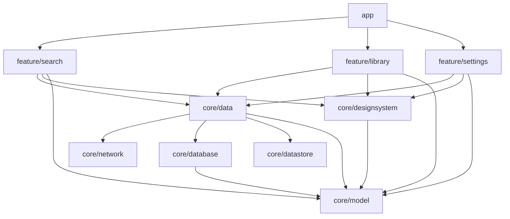

# iOS Add by DOI / arXiv ID / Link + Share Extension Implementation Plan

> **For agentic workers:** REQUIRED SUB-SKILL: Use superpowers:subagent-driven-development (recommended) or superpowers:executing-plans to implement this plan task-by-task. Steps use checkbox (`- [ ]`) syntax for tracking.

**Goal:** Complete iOS **Save** like Android sub-project 2: typing or pasting a DOI, arXiv ID or paper link into Search shows that paper's preview (with the arXiv title check that never presents OpenAlex's wrong match), the Library gets an **Add paper** button, and a Share Extension `HashiyaShare` looks up a page shared from Safari or any app and saves the paper inside the share sheet, into the App Group database the app refreshes from — in English and Arabic, light and dark.

**Architecture:** Builds on plan 1's `ios/` app and `HashiyaKit` package without new package targets. `HashiyaModel` gains the identifier parser (a port of Android's `PaperIdentifier.kt`, ICU patterns with ASCII-only digits and case folding) and `withoutArabicMarks`; `HashiyaNetwork` gains `OpenAlexLookupClient` (sharing the OpenAlex session, key handling and failure classification) and `ArxivTitleClient` (its own session, User-Agent, no key); `HashiyaData` gains `OpenAlexPaperLookupRepository` (arXiv DOI first, then a landing-page filter checked against arXiv's title) and cross-process refreshes of the shared GRDB pool; `FeatureSearch` gains ID mode in `SearchViewModel`/`SearchView` and the extension's `ShareLookupViewModel`/`ShareLookupView`; `FeatureLibrary` gains the floating Add paper button. The new XcodeGen target `HashiyaShare` (app extension, extension-safe API only) hosts `ShareLookupView` and builds its graph from `LiveDependencies`, like the app. A Debug-only App Group flag lets the XCUITest drive a real share sheet against a stub lookup.

**Tech Stack:** Swift 6 (language mode 6, strict concurrency), SwiftUI, iOS 17+, Swift Testing, XCTest (UI tests), GRDB.swift 7.11.1, swift-snapshot-testing 1.19.6, String Catalogs, XcodeGen 2.46.0, Share Extension (`com.apple.share-services`); local toolchain Xcode 27.0 with the iPhone 16 Pro iOS 18.2 simulator; CI `macos-15` with Xcode 16.4 and the iPhone 16 iOS 18.5 simulator.

**Spec:** docs/superpowers/specs/2026-09-28-ios-add-by-id-and-share-design.md

## Global Constraints

- Everything in plan 1's Global Constraints still applies: iOS 17 minimum and Swift 6 language mode with strict concurrency; code must also build with CI's Xcode 16.4 (Swift 6.1: no `Mutex`, no isolated `deinit`, no `@concurrent`, `OSAllocatedUnfairLock` for shared state, `TaskBag` for observation tasks); XcodeGen (`ios/project.yml` committed, `ios/Hashiya.xcodeproj` generated and git-ignored — run `xcodegen generate --spec ios/project.yml` after changing `project.yml` or adding files to `ios/Hashiya`, `ios/HashiyaShare`, `ios/Shared` or `ios/HashiyaUITests`); the package's target dependency rules (no new package targets in this plan; features still never import `HashiyaNetwork`, `HashiyaDatabase` or GRDB); exact dependency pins; the OpenAlex key rules; every user-visible string from a `Localizable.xcstrings` (`extractionState: manual`) through the target's `L10n`, shown with `Text(verbatim:)`; snapshot suites `@MainActor @Suite(.serialized)`; snapshot baselines only from CI.
- Identifiers: App Group `group.com.etatech.hashiya` (library at `<container>/Library/Application Support/hashiya.sqlite`); keychain access group `$(AppIdentifierPrefix)com.etatech.hashiya.shared`; app bundle ID `com.etatech.hashiya`; extension bundle ID `com.etatech.hashiya.share` (target `HashiyaShare`, display name "Hashiya" / "حاشية").
- `ArxivTitleClient` sends `User-Agent: Hashiya-iOS (https://github.com/FadyFouad/Hashiya)` verbatim, uses its own `URLSession` and never sends, logs or sees the OpenAlex key (it takes no key source at all).
- Code linked into `HashiyaShare` uses extension-safe API only (`APPLICATION_EXTENSION_API_ONLY: YES`): no `UIApplication.shared` in `FeatureSearch`, `HashiyaData`, `HashiyaDesignSystem`, `HashiyaModel` or `ios/HashiyaShare`. The app's Debug-only `UITestingShareSheet` is the only new `UIApplication.shared` use, and it lives in the app target.
- Strings: keys, English and Arabic verbatim from spec §9 (they match Android's `strings.xml`, including "…" U+2026 and the curly quotes). Add them with the Python snippets below, which rewrite a catalog exactly as Xcode formats it (`indent=2`, `" : "`, keys sorted, UTF-8, trailing newline); never hand-edit the JSON.
- Commands: run from the repository root of your worktree. Package tests: `(cd ios/HashiyaKit && xcodebuild test -scheme HashiyaKit-Package -destination 'platform=iOS Simulator,name=iPhone 16 Pro,OS=18.2' -only-testing:<Target>)`; app and UI tests: `xcodebuild test -project ios/Hashiya.xcodeproj -scheme Hashiya -destination 'platform=iOS Simulator,name=iPhone 16 Pro,OS=18.2' -collect-test-diagnostics never`. Every command pipes through `grep -E '(^/|^xcodebuild: ).*error:|^✘|✔ Test run|Executed [0-9]+ test|\*\* TEST'` (plan 1's filter, anchored so the simulator's `BSLogAddStateCaptureBlockWithTitle … format error:` noise is dropped). If `xcodebuild` has printed its result but does not exit within a minute, stop it with Ctrl-C; the printed result stands.
- Local snapshot images: a task that changes a screen deletes that suite's local images before its green run (the step says which folder), so the first run records them and fails with `No reference was found on disk. Automatically recorded snapshot: …`, and the second run passes. If those folders hold CI baselines committed by plan 1, deleting them shows as unstaged deletions: never stage them — Task 10 re-records every baseline on CI and commits the full set. Every `git add` below lists explicit paths and never `__Snapshots__`.
- Git: work on branch `feat/ios-add-by-id` in a worktree created from `main` once plan 1's `feat/ios-foundation` is merged (until then, from `feat/ios-foundation`): `git worktree add -b feat/ios-add-by-id ../Hashiya-ios-add-by-id main`. Never commit to `main`; never stage `.idea/`. Commit messages use `feat:`/`test:`/`docs:`/`ci:` and contain no AI or Claude attribution (no trailers, links or credits), nor do code comments, docs or PR text.

## Review Focus

1. **Pasting an arXiv ID whose only OpenAlex landing-page match is a different paper (BERT, `1810.04805`)** → "No paper found for this arXiv ID" with **Search for "BERT: …"**, never the wrong paper; and arXiv failing during that check shows "Search is unavailable right now", not the offline error (OpenAlex has just answered). Pinned by `OpenAlexPaperLookupRepositoryTests.aFallbackWithTheWrongTitleIsNotFound` and `aCrossCheckWhileArxivFailsIsUnavailable` (Task 3).
2. **Pasting real-world links: Wiley with `?af=R#section`, bioRxiv `v1.full.pdf`, a Markdown link from a notes app, a SICI DOI full of `<>;()`** → the right identifier, and IDs with `/`, `#`, `;`, `<`, `>` reach OpenAlex as one path segment. Pinned by `PaperIdentifierTests.publisherLinksDropPDFAndViewSuffixes`, `lenientFindsIDsInsideText` (Task 1) and `OpenAlexLookupClientTests.idsSurvivePathEncoding` (Task 2).
3. **Pasting a second ID while the first lookup is slow, re-typing the same ID with a version, or pasting a link with no ID** → only the newest lookup's result is shown; `arXiv:1706.03762v2` after `1706.03762` sends nothing; a link without an ID never becomes a keyword search of the URL. Pinned by `SearchLookupTests.aNewerLookupReplacesAnOlderOne`, `theSameIDAgainDoesNotLookUpAgain` and `aLinkWithoutAnIDSendsNothingThenKeywordsWorkAgain` (Task 4).
4. **Saving in the share sheet while Hashiya is open in the background, or while the app is writing** → the paper appears in the Library (and as "In library") on return without relaunching, and two processes writing never fail with "database is locked". Pinned by `GRDBLibraryRepositoryTests.refreshShowsPapersSavedThroughAnotherPool`, `SharedDatabaseTests.aWriteWaitsForAnotherPoolsWriteInsteadOfFailing` (Task 7) and `ShareFlowTests.testSharingAnArxivLinkSavesThePaperToTheLibrary` (Task 9).
5. **Arabic users** → `التَّعلُّم` searches `التعلم` and text of only tashkeel or tatweel stays idle; **Search for "English title"** stays left-to-right inside the Arabic sentence with exactly one isolate pair (Arabic formatting already isolates arguments). Pinned by `SearchLookupTests.textOfOnlyArabicMarksIsIdleAndMarksAreNotSent` (Task 4) and `SearchStringsTests.searchForShortensLongTitlesAndIsolatesThem` (Task 5).

---

## File Structure

```
ios/HashiyaKit/Sources/HashiyaModel/PaperIdentifier.swift, SearchableText.swift                        parser, withoutArabicMarks (Task 1)
ios/HashiyaKit/Sources/HashiyaNetwork/OpenAlexLookupService.swift, OpenAlexLookupClient.swift,
  ArxivTitleClient.swift                                                                              lookup clients (Task 2)
ios/HashiyaKit/Sources/HashiyaTesting/URLProtocolStub.swift (.stall), Resources/Fixtures/arxiv_*.xml     (Task 2)
ios/HashiyaKit/Sources/HashiyaData/PaperLookupRepository.swift, LiveDependencies.swift                  (Task 3)
ios/HashiyaKit/Sources/HashiyaTesting/FakeLookupServices.swift (Task 3), FakePaperLookupRepository.swift (Task 4)
ios/HashiyaKit/Sources/FeatureSearch/SearchViewModel.swift (Task 4), L10n.swift, LookupBody.swift,
  SearchView.swift, Resources/Localizable.xcstrings (Task 5)
ios/HashiyaKit/Sources/FeatureLibrary/LibraryView.swift, Resources/Localizable.xcstrings                (Task 6)
ios/HashiyaKit/Sources/HashiyaDatabase/HashiyaDatabase.swift, PaperStore.swift,
  HashiyaData/LibraryRepository.swift, HashiyaTesting/FakeLibraryRepository.swift                      (Task 7)
ios/HashiyaKit/Sources/FeatureSearch/ShareLookupInput.swift, ShareLookupViewModel.swift,
  ShareLookupView.swift                                                                               (Task 8)
ios/project.yml, ios/HashiyaShare/*, ios/Shared/UITestingFlags.swift, ios/Hashiya/UITestingShareSheet.swift (Task 9)
ios/Hashiya/UITestingStubs.swift (Tasks 3, 9), AppContainer.swift (Tasks 4, 9), RootView.swift (Tasks 6, 7, 9)
ios/HashiyaUITests/LibraryFlowTests.swift (Tasks 5, 6), ShareFlowTests.swift (Task 9)
ios/README.md, README.md                                                                              (Task 10)
```

## Where this plan departs from the spec (and why)

- **UI tests use their own App Group library file** (spec §8.5: the stubbed extension "still writes the real shared database"; plan 1: `-ui-testing` uses an in-memory library). The extension is another process, so it can't see the app's in-memory database, and writing the real library from tests would pollute it. A `-ui-testing` launch now deletes and opens `hashiya-ui-testing.sqlite` in the App Group (`GRDBLibraryRepository.shared(fileName:fresh:)`), and a stubbed Debug extension opens the same file. The app also writes the flag as `false` on every other Debug launch, so a stale flag never stubs a real share.
- **The share-flow XCUITest uses the app's own share sheet**: verified on the iOS 18.2 simulator that an app's own Share Extension is listed in its own `UIActivityViewController`, so the test does not drive Safari. The Debug share-sheet presenter also refreshes the Library when the sheet closes, because the app may stay active under the sheet. Sharing from Safari is a manual acceptance step (Task 10).
- **"Add paper calls `onAddPaper`" is pinned by a UI test** (`LibraryFlowTests.testAddPaperOpensSearchReadyForInput`), not by `FeatureLibraryTests`: hostless package tests can't tap a SwiftUI button (plan 1: no accessibility tree). The Library snapshots show the button in both layouts.
- **Search for "…" isolates once**: spec §5.2 wraps the title in U+2068 … U+2069; `String(format:locale:)` with the Arabic locale already wraps every argument in that pair, so `L10n.searchTitleButton` adds its own pair only when formatting didn't. For the same reason the Arabic "Looking up …" text carries the pair around the ID.
- **Patterns** are `NSRegularExpression` (ICU) matched against ASCII-lowercased text instead of ICU's case-insensitive mode, which would fold "K" (Kelvin) and "ſ" into ASCII; whole-string patterns are anchored with `\A…\z`. `SPACE_AFTER_PREFIX`'s word boundary is the lookbehind `(?<![\p{L}\p{Nd}_])`.
- **Extra API** the spec implies but doesn't name: `HashiyaDatabase.fileName`, `sharedDatabaseURL(appGroup:fileName:)`, `removeDatabase(at:)`, `suspend()`/`resume()` and `OpenError.coordinationFailed`; `PaperStore.shared(fileName:)`, `open(at:)`, `notifyExternalChanges()`; `GRDBLibraryRepository.shared(fileName:fresh:)`; `SharedLibraryDatabase.suspend()/resume()` in `HashiyaData` (the app and extension never import GRDB); `SearchViewModel.searchTitle(_:)`, `focusHandled()`; `LookupBody`, `LookupLookingView`, `SearchErrorView` (shared by Search and the sheet); `ArxivTitleClient(session:baseURL:)`; `URLProtocolStub.Reply.stall`; `FakeOpenAlexLookupService`, `FakeArxivTitleService`, `FakePaperLookupRepository` API as listed in Tasks 3–4.
- **GRDB sharing guide applied in full**: `openPool(at:)` opens under an `NSFileCoordinator` (`.forMerging`), sets `busyMode = .timeout(5)` and `observesSuspensionNotifications = true`; the app posts suspend on `.background` and resume on `.active`, the extension resumes on load and suspends before `completeRequest`. `Database.notifyChanges(in:)` (GRDB 7.11.1) implements `refreshAfterExternalChanges()`.
- **Icons the spec leaves open**: `link` for "No DOI or arXiv ID in this link/on this page", `doc.text.magnifyingglass` for Not found and "Couldn't find a paper in what you shared.".
- **The Share Extension crashes (`fatalError`) if the App Group database can't be opened**, like the app does in plan 1; the system then just closes the sheet.

---

### Task 1: `HashiyaModel` — the identifier parser and `withoutArabicMarks`

**Files:**
- Create: `ios/HashiyaKit/Sources/HashiyaModel/PaperIdentifier.swift`, `ios/HashiyaKit/Sources/HashiyaModel/SearchableText.swift`
- Test: `ios/HashiyaKit/Tests/HashiyaModelTests/PaperIdentifierTests.swift`, `ios/HashiyaKit/Tests/HashiyaModelTests/SearchableTextTests.swift`

**Interfaces:**
- Consumes: `normalizeDOI(_ raw: String) -> String?` (plan 1, Task 2).
- Produces (module `HashiyaModel`, all `public`):
  - `enum PaperIdentifier: Equatable, Hashable, Sendable { case doi(String); case arxiv(String) }`
  - `func parsePaperIdentifier(_ text: String) -> PaperIdentifier?` (strict, Search box)
  - `func extractPaperIdentifier(_ text: String) -> PaperIdentifier?` (lenient, shares; first 2,000 characters)
  - `func looksLikeLink(_ text: String) -> Bool`
  - `func withoutArabicMarks(_ text: String) -> String`

Every table in spec §3.4 and §3.5 is one parameterised test (each counts once). The parser is a line-by-line port of Android's `PaperIdentifier.kt`; the comments name the few places where Swift needs care (ASCII digits and case folding, UTF-16 offsets, the lenient percent-decoding).

- [ ] **Step 1: Write the failing tests**

`ios/HashiyaKit/Tests/HashiyaModelTests/PaperIdentifierTests.swift`:
```swift
import HashiyaModel
import Testing

/// Ported from Android's `PaperIdentifierTest.kt`; each Android `@Test` is one parameterised test.
struct PaperIdentifierTests {
    static let sici = "10.1002/(sici)1099-1212(199901/02)9:1<8::aid-oa453>3.0.co;2-z"

    @Test(arguments: [
        ("10.1038/nature14539", PaperIdentifier.doi("10.1038/nature14539")),
        ("  https://doi.org/10.1038/NATURE14539 ", .doi("10.1038/nature14539")),
        ("http://dx.doi.org/10.1038/nature14539", .doi("10.1038/nature14539")),
        ("doi:10.1038/nature14539", .doi("10.1038/nature14539")),
        ("DOI: 10.1038/nature14539", .doi("10.1038/nature14539")),
        ("https://onlinelibrary.wiley.com/doi/full/10.1002/anie.201915678?af=R#section", .doi("10.1002/anie.201915678")),
        ("https://dl.acm.org/doi/10.1145/3292500.3330701", .doi("10.1145/3292500.3330701")),
        ("https://link.springer.com/article/10.1007/s11263-015-0816-y", .doi("10.1007/s11263-015-0816-y")),
        ("https://doi.org/10.1002/(SICI)1099-1212(199901/02)9:1%3C8::AID-OA453%3E3.0.CO;2-Z", .doi(sici)),
        ("10.1038/nature14539.", .doi("10.1038/nature14539")),
    ])
    func strictRecognizesDOIs(input: String, expected: PaperIdentifier) {
        #expect(parsePaperIdentifier(input) == expected)
    }

    @Test(arguments: [
        ("https://link.springer.com/content/pdf/10.1007/s11263-015-0816-y.pdf", PaperIdentifier.doi("10.1007/s11263-015-0816-y")),
        ("https://onlinelibrary.wiley.com/doi/10.1002/anie.201915678/full", .doi("10.1002/anie.201915678")),
        ("https://onlinelibrary.wiley.com/doi/10.1002/anie.201915678/abstract", .doi("10.1002/anie.201915678")),
        ("https://onlinelibrary.wiley.com/doi/10.1002/anie.201915678/epdf", .doi("10.1002/anie.201915678")),
        ("https://example.org/10.1002/anie.201915678/PDF/", .doi("10.1002/anie.201915678")),
        ("https://www.biorxiv.org/content/10.1101/2020.01.01.123456v1", .doi("10.1101/2020.01.01.123456")),
        ("https://www.biorxiv.org/content/10.1101/2020.01.01.123456v2.full", .doi("10.1101/2020.01.01.123456")),
        ("https://www.medrxiv.org/content/10.1101/2020.01.01.123456v1.full.pdf", .doi("10.1101/2020.01.01.123456")),
    ])
    func publisherLinksDropPDFAndViewSuffixes(input: String, expected: PaperIdentifier) {
        #expect(parsePaperIdentifier(input) == expected)
    }

    @Test(arguments: [
        ("https://doi.org/10.1000/xyz.pdf", PaperIdentifier.doi("10.1000/xyz.pdf")),
        ("https://doi.org/10.1000/abc/full", .doi("10.1000/abc/full")),
        ("doi:10.1000/xyz.pdf", .doi("10.1000/xyz.pdf")),
        ("10.1101/2020.01.01.123456v1", .doi("10.1101/2020.01.01.123456v1")),
    ])
    func doiLinksAndPlainDOIsKeepTheirSuffixes(input: String, expected: PaperIdentifier) {
        #expect(parsePaperIdentifier(input) == expected)
    }

    @Test(arguments: [
        ("1706.03762", PaperIdentifier.arxiv("1706.03762")),
        ("2401.00001v2", .arxiv("2401.00001")),
        ("ARXIV:2401.00001", .arxiv("2401.00001")),
        ("arXiv: 2401.00001", .arxiv("2401.00001")),
        ("https://arxiv.org/abs/1706.03762v5", .arxiv("1706.03762")),
        ("arxiv.org/pdf/2401.00001v2.pdf", .arxiv("2401.00001")),
        ("https://arxiv.org/html/2401.00001v2", .arxiv("2401.00001")),
        ("https://www.arxiv.org/abs/2310.06825", .arxiv("2310.06825")),
        ("http://export.arxiv.org/abs/hep-th/9901001v2", .arxiv("hep-th/9901001")),
        ("hep-th/9901001", .arxiv("hep-th/9901001")),
        ("math.GT/0309136", .arxiv("math/0309136")),
        ("10.48550/ARXIV.1706.03762", .arxiv("1706.03762")),
        ("https://doi.org/10.48550/arXiv.2310.06825", .arxiv("2310.06825")),
        ("10.48550/arXiv.math/0309136", .arxiv("math/0309136")),
    ])
    func strictRecognizesArxivIDs(input: String, expected: PaperIdentifier) {
        #expect(parsePaperIdentifier(input) == expected)
    }

    @Test(arguments: [
        ("0704.0001", PaperIdentifier?.some(.arxiv("0704.0001"))),
        ("1412.6980", .arxiv("1412.6980")),
        ("2401.00001", .arxiv("2401.00001")),
        ("1706.0376", nil),
        ("2401.0001", nil),
        ("0612.0001", nil),
        ("1412.69801", nil),
    ])
    func strictAcceptsOnlyRealNewStyleArxivShapes(input: String, expected: PaperIdentifier?) {
        #expect(parsePaperIdentifier(input) == expected)
    }

    @Test(arguments: [
        "",
        "   ",
        "machine learning",
        "a study of 10.1038/nature14539",
        "https://example.com/2401.00001",
        "https://arxiv.org/list/cs.LG/recent",
        "10.1038",
        "2401.001",
        "2023.12345",
        "1234",
    ])
    func strictRejectsEverythingElse(input: String) {
        #expect(parsePaperIdentifier(input) == nil)
    }

    @Test(arguments: [
        ("https://www.nature.com/articles/d41586-026-02937-z", PaperIdentifier?.some(.doi("10.1038/d41586-026-02937-z"))),
        ("https://www.nature.com/articles/nature14539.pdf", .doi("10.1038/nature14539")),
        ("https://www.nature.com/articles/nature14539", .doi("10.1038/nature14539")),
        ("https://nature.com/articles/s41598-021-81234-5?error=cookies_not_supported", .doi("10.1038/s41598-021-81234-5")),
        ("https://www.nature.com/nature/volumes/620", nil),
        ("https://www.nature.com/subjects/physics", nil),
    ])
    func strictRecognizesNatureArticleLinksAsDOIs(input: String, expected: PaperIdentifier?) {
        #expect(parsePaperIdentifier(input) == expected)
    }

    @Test(arguments: [
        ("10.1000/abc(1)", PaperIdentifier.doi("10.1000/abc(1)")),
        ("(10.1000/abc)", .doi("10.1000/abc")),
        ("<https://arxiv.org/abs/1706.03762>", .arxiv("1706.03762")),
    ])
    func strictHandlesParentheses(input: String, expected: PaperIdentifier) {
        #expect(parsePaperIdentifier(input) == expected)
    }

    @Test(arguments: [
        ("Attention Is All You Need https://arxiv.org/abs/1706.03762", PaperIdentifier.arxiv("1706.03762")),
        ("a study of 10.1038/nature14539.", .doi("10.1038/nature14539")),
        ("(see doi: 10.1000/xyz123)", .doi("10.1000/xyz123")),
        ("Ref: 10.1000/abc(1), page 3", .doi("10.1000/abc(1)")),
        ("SICI \(sici) is old", .doi(sici)),
        ("see 2401.00001, it is good", .arxiv("2401.00001")),
        ("check https://example.com/page and 10.1000/xyz", .doi("10.1000/xyz")),
        ("Check this out: https://arxiv.org/abs/2401.00001v2", .arxiv("2401.00001")),
        ("Check this out: [Attention Is All You Need](https://arxiv.org/abs/1706.03762)", .arxiv("1706.03762")),
        ("[Deep learning](https://doi.org/10.1038/nature14539)", .doi("10.1038/nature14539")),
        ("Link:https://arxiv.org/abs/2401.00001", .arxiv("2401.00001")),
    ])
    func lenientFindsIDsInsideText(input: String, expected: PaperIdentifier) {
        #expect(extractPaperIdentifier(input) == expected)
    }

    @Test(arguments: [
        ("https://arxiv.org/abs/2401.00001 also 10.1038/nature14539", PaperIdentifier.arxiv("2401.00001")),
        ("10.1038/nature14539 then https://arxiv.org/abs/2401.00001", .arxiv("2401.00001")),
    ])
    func lenientPrefersTheFirstLink(input: String, expected: PaperIdentifier) {
        #expect(extractPaperIdentifier(input) == expected)
    }

    @Test func lenientRecognizesNatureArticleLinks() {
        #expect(extractPaperIdentifier("Read this https://www.nature.com/articles/nature14539 now") == .doi("10.1038/nature14539"))
    }

    @Test(arguments: ["https://example.com/2401.00001", "[x](https://example.com/2401.00001)", "nothing to see here", ""])
    func lenientRejectsTextWithoutIDs(input: String) {
        #expect(extractPaperIdentifier(input) == nil)
    }

    @Test(arguments: [
        ("https://example.com/some/article", true),
        ("  www.example.com  ", true),
        ("10.1038/x", false),
        ("hello world", false),
        ("https://a.b c", false),
    ])
    func looksLikeLinkRecognizesSingleURLTokens(input: String, expected: Bool) {
        #expect(looksLikeLink(input) == expected)
    }

    @Test func lenientIgnoresTextBeyondTwoThousandCharacters() {
        #expect(extractPaperIdentifier(String(repeating: "x", count: 2_000) + " 10.1038/nature14539") == nil)
        #expect(extractPaperIdentifier(String(repeating: "x", count: 1_900) + " 10.1038/nature14539") == .doi("10.1038/nature14539"))
    }

    /// iOS only: Swift's and ICU's `\d` match any Unicode digit; Android's patterns and ours match ASCII digits only.
    @Test func arabicIndicDigitsAreNotAnArxivID() {
        #expect(parsePaperIdentifier("١٧٠٦.٠٣٧٦٢") == nil)
        #expect(extractPaperIdentifier("١٧٠٦.٠٣٧٦٢") == nil)
    }
}
```

`ios/HashiyaKit/Tests/HashiyaModelTests/SearchableTextTests.swift`:
```swift
import HashiyaModel
import Testing

struct SearchableTextTests {
    @Test(arguments: [
        ("التَّعلُّم", "التعلم"),
        ("التّعلمُ", "التعلم"),
        ("ـالتعلمـ", "التعلم"),
        ("Schrödinger", "Schrödinger"),
        ("أإآ", "أإآ"),
        ("Deep Learning", "Deep Learning"),
        ("١٩", "١٩"),
        ("", ""),
    ])
    func withoutArabicMarksDropsOnlyTashkeelAndTatweel(input: String, expected: String) {
        #expect(withoutArabicMarks(input) == expected)
    }
}
```

- [ ] **Step 2: Run them to verify they fail**

Run: `(cd ios/HashiyaKit && xcodebuild test -scheme HashiyaKit-Package -destination 'platform=iOS Simulator,name=iPhone 16 Pro,OS=18.2' -only-testing:HashiyaModelTests) 2>&1 | grep -E '(^/|^xcodebuild: ).*error:|^✘|✔ Test run|Executed [0-9]+ test|\*\* TEST'`
Expected: FAIL — `PaperIdentifierTests.swift:9:33: error: cannot find 'PaperIdentifier' in scope` (and the same for the other tables), `SearchableTextTests.swift:16:17: error: cannot find 'withoutArabicMarks' in scope`, then `** TEST FAILED **`.

- [ ] **Step 3: Implement the parser and `withoutArabicMarks`**

`ios/HashiyaKit/Sources/HashiyaModel/PaperIdentifier.swift`:
```swift
import Foundation

/// A paper identifier recognized in text typed or shared by the user.
public enum PaperIdentifier: Equatable, Hashable, Sendable {
    /// Normalized by `normalizeDOI`, e.g. "10.1038/nature14539".
    case doi(String)
    /// No version, no subject class: "1706.03762", "hep-th/9901001", "math/0309136".
    case arxiv(String)
}

/// Strict, for the Search box: the whole trimmed text must be an identifier or a supported link.
public func parsePaperIdentifier(_ text: String) -> PaperIdentifier? {
    let input = joiningPrefixes(text.trimmingCharacters(in: .whitespacesAndNewlines))
    guard !input.isEmpty, !input.contains(where: \.isWhitespace) else { return nil }
    return parseToken(input)
}

/// Lenient, for shares: the first supported link in the text, otherwise the first bare identifier.
public func extractPaperIdentifier(_ text: String) -> PaperIdentifier? {
    let tokens = asciiWhitespaceTokens(joiningPrefixes(String(text.prefix(maxSharedText))))
    return tokens.lazy.filter(isURL).compactMap(parseToken).first
        ?? tokens.lazy.filter { !isURL($0) }.compactMap(parseToken).first
}

/// True when the trimmed text is a single link-shaped token.
public func looksLikeLink(_ text: String) -> Bool {
    let trimmed = text.trimmingCharacters(in: .whitespacesAndNewlines)
    return !trimmed.isEmpty && !trimmed.contains(where: \.isWhitespace) && isURL(trimmed)
}

// MARK: Patterns (ported from Android's PaperIdentifier.kt; digits are ASCII `[0-9]`, never `\d`)

private let maxSharedText = 2_000

// New style, optional version: YYMM.NNNN from 0704 (when it began) to 1412, YYMM.NNNNN from 1501 on.
private let month = #"(?:0[1-9]|1[0-2])"#
private let newArxiv4 = #"(?:07(?:0[4-9]|1[0-2])|(?:0[89]|1[0-4])"# + month + #")\.[0-9]{4}"#
private let newArxiv5 = #"(?:1[5-9]|[2-9][0-9])"# + month + #"\.[0-9]{5}"#
private let newArxiv = "(?:" + newArxiv4 + "|" + newArxiv5 + #")(?:v[0-9]+)?"#
// Old style: archive[.SUBJECT]/YYMMNNN, optional version.
private let oldArxiv = #"[a-z]+(?:-[a-z]+)?(?:\.[a-z]{2})?/[0-9]{7}(?:v[0-9]+)?"#
private let anyArxiv = "(?:" + newArxiv + "|" + oldArxiv + ")"
private let asciiWhitespaceClass = #"[ \t\n\x{0B}\f\r]"#

private let arxivURL = Pattern(
    whole: #"(?:https?://)?(?:www\.|export\.)?arxiv\.org/(?:abs|pdf|html)/("# + anyArxiv + #")(?:\.pdf)?/?"#,
    ignoringASCIICase: true
)
private let arxivPrefixed = Pattern(whole: "arxiv:(" + anyArxiv + ")", ignoringASCIICase: true)
private let bareArxiv = Pattern(whole: anyArxiv, ignoringASCIICase: true)
private let arxivDOI = Pattern(whole: #"10\.48550/arxiv\.("# + anyArxiv + ")", ignoringASCIICase: true)
private let bareDOI = Pattern(whole: #"10\.[0-9]{4,9}/[^ \t\n\x{0B}\f\r]+"#)
private let doiInPath = Pattern(#"10\.[0-9]{4,9}/.+"#)
private let viewSegment = Pattern(#"/(?:full|abstract|epdf|pdf|fulltext)\z"#, ignoringASCIICase: true)
private let pdfSuffix = Pattern(#"\.pdf\z"#, ignoringASCIICase: true)
private let preprintSuffix = Pattern(#"(?:v[0-9]+)?(?:\.full)?\z"#, ignoringASCIICase: true)
private let spaceAfterPrefix = Pattern(#"(?<![\p{L}\p{Nd}_])(arxiv:|doi:)"# + asciiWhitespaceClass + "+", ignoringASCIICase: true)
private let urlStart = Pattern(#"(https?://|www\.|(?:export\.)?arxiv\.org/|(?:dx\.)?doi\.org/)"#, ignoringASCIICase: true)
private let natureArticle = Pattern(whole: #"articles/([A-Za-z0-9][A-Za-z0-9.-]*)"#, ignoringASCIICase: true)
private let arxivVersion = Pattern(#"v[0-9]+\z"#)
private let arxivSubjectClass = Pattern(#"\A([a-z]+(?:-[a-z]+)?)\.[a-z]{2}/"#)

private let doiHosts: Set<String> = ["doi.org", "dx.doi.org", "www.doi.org"]
private let natureHosts: Set<String> = ["nature.com", "www.nature.com"]
private let leadingJunk: Set<Character> = ["(", "[", "\"", "'", "<"]
private let trailingJunk: Set<Character> = [".", ",", ";", ":", "!", "?", "\"", "'", ">", "]"]

// MARK: Algorithm

/// "arXiv: 2401.00001" → "arXiv:2401.00001", so the prefix and the ID form one token.
private func joiningPrefixes(_ text: String) -> String {
    spaceAfterPrefix.replacingMatches(in: text) { $0.groups[1] }
}

private func parseToken(_ rawToken: String) -> PaperIdentifier? {
    let token = trimTrailingJunk(String(rawToken.drop { leadingJunk.contains($0) }))
    guard !token.isEmpty else { return nil }
    if isURL(token) {
        let urlToken = urlStart.firstMatch(in: token).map { trimTrailingJunk(token.suffix(fromUTF16Offset: $0.start)) } ?? token
        return parseURL(urlToken)
    }
    if let match = arxivPrefixed.wholeMatch(token) { return .arxiv(canonicalArxiv(match.groups[1])) }
    if bareArxiv.wholeMatch(token) != nil { return .arxiv(canonicalArxiv(token)) }
    let doi = token.asciiLowercased().hasPrefix("doi:") ? String(token.dropFirst(4)) : token
    return bareDOI.wholeMatch(doi) != nil ? doiIdentifier(doi) : nil
}

private func isURL(_ token: String) -> Bool {
    let value = String(token.drop { leadingJunk.contains($0) }).asciiLowercased()
    return value.contains("://") || value.hasPrefix("www.") || value.hasPrefix("arxiv.org/")
        || value.hasPrefix("doi.org/") || value.hasPrefix("dx.doi.org/")
}

private func parseURL(_ url: String) -> PaperIdentifier? {
    let withoutFragment = url.prefix { $0 != "#" }
    let withoutQuery = String(withoutFragment.prefix { $0 != "?" })
    if let match = arxivURL.wholeMatch(withoutQuery) { return .arxiv(canonicalArxiv(match.groups[1])) }
    let withoutScheme = withoutQuery.range(of: "://").map { String(withoutQuery[$0.upperBound...]) } ?? withoutQuery
    let host = String(withoutScheme.prefix { $0 != "/" }).asciiLowercased()
    let path = withoutScheme.firstIndex(of: "/").map { percentDecoded(String(withoutScheme[withoutScheme.index(after: $0)...])) } ?? ""
    let doiPart: String? = if doiHosts.contains(host) {
        path
    } else if natureHosts.contains(host) {
        natureDOI(path)
    } else {
        doiInPath.firstMatch(in: path).map { dropPublisherSuffix($0.groups[0]) }
    }
    return doiPart.flatMap(doiIdentifier)
}

/// Nature Portfolio article pages map straight to a DOI: "articles/nature14539" → "10.1038/nature14539".
private func natureDOI(_ path: String) -> String? {
    let article = pdfSuffix.removingMatch(from: droppingTrailingSlashes(path))
    return natureArticle.wholeMatch(article).map { "10.1038/" + $0.groups[1] }
}

/// Publisher links put views after the DOI ("….pdf", "…/full", "…/epdf"), and bioRxiv/medRxiv add a version
/// ("…v1", "…v1.full.pdf"). Only for DOIs found in a publisher's path; doi.org links and typed DOIs keep them.
private func dropPublisherSuffix(_ doi: String) -> String {
    let withoutView = pdfSuffix.removingMatch(from: viewSegment.removingMatch(from: droppingTrailingSlashes(doi)))
    return withoutView.hasPrefix("10.1101/") ? preprintSuffix.removingMatch(from: withoutView) : withoutView
}

private func doiIdentifier(_ raw: String) -> PaperIdentifier? {
    guard let doi = normalizeDOI(trimTrailingJunk(droppingTrailingSlashes(raw))), bareDOI.wholeMatch(doi) != nil else {
        return nil
    }
    if let match = arxivDOI.wholeMatch(doi) { return .arxiv(canonicalArxiv(match.groups[1])) }
    return .doi(doi)
}

/// Removes the version, a ".pdf" suffix and an old-style subject class ("math.GT/0309136" → "math/0309136").
private func canonicalArxiv(_ raw: String) -> String {
    var value = raw.asciiLowercased()
    if value.hasSuffix(".pdf") { value.removeLast(4) }
    value = arxivVersion.removingMatch(from: value)
    return arxivSubjectClass.replacingMatches(in: value) { $0.groups[1] + "/" }
}

/// Drops trailing punctuation; a trailing ")" only when the parentheses are unbalanced.
private func trimTrailingJunk(_ value: String) -> String {
    var result = value
    while let last = result.last {
        let unbalancedParenthesis = last == ")" && result.count(where: { $0 == "(" }) < result.count(where: { $0 == ")" })
        guard trailingJunk.contains(last) || unbalancedParenthesis else { break }
        result.removeLast()
    }
    return result
}

private func droppingTrailingSlashes(_ value: String) -> String {
    var result = value
    while result.hasSuffix("/") { result.removeLast() }
    return result
}

/// Splits on runs of ASCII whitespace (space, tab, LF, VT, FF, CR), dropping empty tokens.
private func asciiWhitespaceTokens(_ text: String) -> [String] {
    var tokens: [String] = []
    var current = String.UnicodeScalarView()
    for scalar in text.unicodeScalars {
        if [0x20, 0x09, 0x0A, 0x0B, 0x0C, 0x0D].contains(scalar.value) {
            if !current.isEmpty { tokens.append(String(current)) }
            current = String.UnicodeScalarView()
        } else {
            current.append(scalar)
        }
    }
    if !current.isEmpty { tokens.append(String(current)) }
    return tokens
}

/// Each "%" followed by two hex digits becomes that byte; everything else is kept as its UTF-8 bytes.
/// Invalid UTF-8 becomes U+FFFD (`removingPercentEncoding` would return nil instead).
private func percentDecoded(_ value: String) -> String {
    guard value.contains("%") else { return value }
    let input = Array(value.utf8)
    var bytes: [UInt8] = []
    var index = 0
    while index < input.count {
        if input[index] == UInt8(ascii: "%"), index + 2 < input.count,
           let high = hexValue(input[index + 1]), let low = hexValue(input[index + 2]) {
            bytes.append(high << 4 | low)
            index += 3
        } else {
            bytes.append(input[index])
            index += 1
        }
    }
    return String(decoding: bytes, as: UTF8.self)
}

private func hexValue(_ byte: UInt8) -> UInt8? {
    switch byte {
    case UInt8(ascii: "0")...UInt8(ascii: "9"): byte - UInt8(ascii: "0")
    case UInt8(ascii: "a")...UInt8(ascii: "f"): byte - UInt8(ascii: "a") + 10
    case UInt8(ascii: "A")...UInt8(ascii: "F"): byte - UInt8(ascii: "A") + 10
    default: nil
    }
}

// MARK: Matching

extension String {
    /// Only A–Z become a–z; every other character is kept, so UTF-16 offsets are unchanged.
    fileprivate func asciiLowercased() -> String {
        String(String.UnicodeScalarView(unicodeScalars.map { scalar in
            (65...90).contains(scalar.value) ? Unicode.Scalar(scalar.value + 32)! : scalar
        }))
    }

    fileprivate func suffix(fromUTF16Offset offset: Int) -> String {
        (self as NSString).substring(from: offset)
    }
}

/// An ICU pattern. Case-insensitive patterns match the ASCII-lowercased text, so only ASCII letters fold
/// (ICU's own case-insensitive mode would also fold "K", the Kelvin sign, into "k").
private struct Pattern: @unchecked Sendable {  // NSRegularExpression is immutable and thread-safe.
    struct Match {
        /// Group 0 is the whole match; a group that did not take part is "".
        var groups: [String]
        /// UTF-16 offsets in the searched text.
        var start: Int
        var end: Int
    }

    private let regex: NSRegularExpression
    private let ignoringASCIICase: Bool

    init(_ pattern: String, ignoringASCIICase: Bool = false) {
        regex = try! NSRegularExpression(pattern: pattern)
        self.ignoringASCIICase = ignoringASCIICase
    }

    /// A pattern that must match the entire text.
    init(whole pattern: String, ignoringASCIICase: Bool = false) {
        self.init(#"\A(?:"# + pattern + #")\z"#, ignoringASCIICase: ignoringASCIICase)
    }

    func wholeMatch(_ text: String) -> Match? {
        firstMatch(in: text)
    }

    func firstMatch(in text: String) -> Match? {
        matches(in: text).first
    }

    /// Removes the first match (used for suffix patterns ending in `\z`).
    func removingMatch(from text: String) -> String {
        guard let match = firstMatch(in: text) else { return text }
        return replacing([match], in: text) { _ in "" }
    }

    /// Replaces every match with `replacement(match)`; groups come from the original text.
    func replacingMatches(in text: String, with replacement: (Match) -> String) -> String {
        replacing(matches(in: text), in: text, with: replacement)
    }

    private func matches(in text: String) -> [Match] {
        let subject = ignoringASCIICase ? text.asciiLowercased() : text
        let original = text as NSString
        return regex.matches(in: subject, range: NSRange(location: 0, length: original.length)).map { result in
            Match(
                groups: (0..<result.numberOfRanges).map { index in
                    let range = result.range(at: index)
                    return range.location == NSNotFound ? "" : original.substring(with: range)
                },
                start: result.range.location,
                end: result.range.location + result.range.length
            )
        }
    }

    private func replacing(_ matches: [Match], in text: String, with replacement: (Match) -> String) -> String {
        let result = NSMutableString(string: text)
        for match in matches.reversed() {
            result.replaceCharacters(in: NSRange(location: match.start, length: match.end - match.start), with: replacement(match))
        }
        return result as String
    }
}
```

`ios/HashiyaKit/Sources/HashiyaModel/SearchableText.swift`:
```swift
/// The text without Arabic diacritics and tatweel; everything else as typed.
public func withoutArabicMarks(_ text: String) -> String {
    // Scalars, not Characters: a mark combines with its letter into one Character.
    String(String.UnicodeScalarView(text.unicodeScalars.filter { !isArabicMark($0.value) }))
}

/// Tashkeel and Quranic marks (U+0610–U+061A, U+064B–U+065F, U+0670, U+06D6–U+06DC, U+06DF–U+06E4,
/// U+06E7–U+06E8, U+06EA–U+06ED) and tatweel (U+0640).
private func isArabicMark(_ value: UInt32) -> Bool {
    switch value {
    case 0x0610...0x061A, 0x064B...0x065F, 0x0670, 0x06D6...0x06DC, 0x06DF...0x06E4, 0x06E7...0x06E8, 0x06EA...0x06ED, 0x0640:
        true
    default:
        false
    }
}
```

- [ ] **Step 4: Run the tests to verify they pass**

Run: `(cd ios/HashiyaKit && xcodebuild test -scheme HashiyaKit-Package -destination 'platform=iOS Simulator,name=iPhone 16 Pro,OS=18.2' -only-testing:HashiyaModelTests) 2>&1 | grep -E '(^/|^xcodebuild: ).*error:|^✘|✔ Test run|Executed [0-9]+ test|\*\* TEST'`
Expected: `✔ Test run with 27 tests in 6 suites passed` (plan 1's 11 plus 16) and `** TEST SUCCEEDED **`.

- [ ] **Step 5: Commit**

```bash
git add ios/HashiyaKit/Sources/HashiyaModel/PaperIdentifier.swift ios/HashiyaKit/Sources/HashiyaModel/SearchableText.swift \
  ios/HashiyaKit/Tests/HashiyaModelTests/PaperIdentifierTests.swift ios/HashiyaKit/Tests/HashiyaModelTests/SearchableTextTests.swift
git commit -m "feat: parse DOIs, arXiv IDs and paper links on iOS"
```

---

### Task 2: `HashiyaNetwork` — `OpenAlexLookupClient` and `ArxivTitleClient`

**Files:**
- Create: `ios/HashiyaKit/Sources/HashiyaNetwork/OpenAlexLookupService.swift`, `OpenAlexLookupClient.swift`, `ArxivTitleClient.swift` (same directory)
- Modify: `ios/HashiyaKit/Sources/HashiyaTesting/URLProtocolStub.swift` (adds `Reply.stall`)
- Create (copied): `ios/HashiyaKit/Sources/HashiyaTesting/Resources/Fixtures/arxiv_bert.xml`, `arxiv_empty.xml`, `arxiv_error.xml`
- Test: `ios/HashiyaKit/Tests/HashiyaNetworkTests/OpenAlexLookupClientTests.swift`, `ArxivTitleClientTests.swift`

**Interfaces:**
- Consumes (plan 1, Task 3): `OpenAlexHTTP` (internal: `get(path:query:)`, `static func encode(_:)`), `OpenAlexSession.baseURL`, `OpenAlexSession.makeConfiguration()`, `OpenAlexSearchClient.selectFields`, `NetworkWork`, `NetworkWorksResponse`, `NetworkFailure`, `UserAPIKeySource`, `RequestLog.debug`; test support `URLProtocolStub.Server`, `Fixtures`, `FixedUserAPIKeySource`.
- Produces (module `HashiyaNetwork`, all `public`):
  - `protocol OpenAlexLookupService: Sendable { func work(id: String) async throws -> NetworkWork?; func works(filter: String, perPage: Int) async throws -> NetworkWorksResponse }`
  - `protocol ArxivTitleService: Sendable { func title(id: String) async throws -> String? }`
  - `final class OpenAlexLookupClient: OpenAlexLookupService`, `init(session: URLSession, builtInKey: String?, userKeySource: any UserAPIKeySource, baseURL: URL = OpenAlexSession.baseURL, log: @escaping @Sendable (String) -> Void = RequestLog.debug)`
  - `final class ArxivTitleClient: ArxivTitleService`, `static let baseURL: URL`, `static let userAgent: String`, `init(session: URLSession = URLSession(configuration: OpenAlexSession.makeConfiguration()), baseURL: URL = ArxivTitleClient.baseURL)`
  - `func parseArxivTitle(_ xml: String) throws -> String?`
  - Test support: `URLProtocolStub.Reply.stall` (never answers; the request ends when its task is cancelled)

Both classes are immutable (`let` properties of `Sendable` types), so they are `Sendable` like `OpenAlexSearchClient`.

- [ ] **Step 1: Write the failing tests, the fixtures and the stalling stub reply**

Copy Android's arXiv fixtures byte for byte (`work.json` is already there from plan 1):
```bash
cp core/network/src/test/resources/arxiv_bert.xml core/network/src/test/resources/arxiv_empty.xml \
  core/network/src/test/resources/arxiv_error.xml ios/HashiyaKit/Sources/HashiyaTesting/Resources/Fixtures/
```

`URLProtocolStub` gains `.stall` (full file):

`ios/HashiyaKit/Sources/HashiyaTesting/URLProtocolStub.swift`:
```swift
import Foundation
import os

/// Scripted HTTP for tests, without a live network. Each `URLProtocolStub.Server` has its own
/// URLSession and recorded requests, so tests that use different servers can run in parallel.
public final class URLProtocolStub: URLProtocol, @unchecked Sendable {
    public enum Reply: Sendable {
        /// A response with this status and body.
        case status(Int, body: Data = Data())
        /// A transport failure, as URLSession reports it.
        case failure(URLError.Code)
        /// No answer: the request ends only when its task is cancelled (or times out).
        case stall

        /// A 200 response with a UTF-8 body.
        public static func json(_ body: String) -> Reply { .status(200, body: Data(body.utf8)) }
    }

    public final class Server: Sendable {
        public let session: URLSession
        fileprivate let id = UUID().uuidString
        private let state: OSAllocatedUnfairLock<State>

        private struct State {
            var reply: @Sendable (URLRequest) -> Reply
            var requests: [URLRequest] = []
        }

        public init(reply: @escaping @Sendable (URLRequest) -> Reply) {
            state = OSAllocatedUnfairLock(initialState: State(reply: reply))
            let configuration = URLSessionConfiguration.ephemeral
            configuration.protocolClasses = [URLProtocolStub.self]
            configuration.httpAdditionalHeaders = [URLProtocolStub.serverHeader: id]
            session = URLSession(configuration: configuration)
            URLProtocolStub.servers.withLock { $0[id] = self }
        }

        /// Replies to every request with `reply`.
        public convenience init(always reply: Reply) {
            self.init { _ in reply }
        }

        /// Every request received so far, oldest first.
        public var requests: [URLRequest] { state.withLock { $0.requests } }

        /// The decoded query items of the last request, by name.
        public var lastQuery: [String: String] {
            guard let url = requests.last?.url,
                  let items = URLComponents(url: url, resolvingAgainstBaseURL: false)?.queryItems else { return [:] }
            return Dictionary(items.map { ($0.name, $0.value ?? "") }, uniquingKeysWith: { _, last in last })
        }

        public func setReply(_ reply: @escaping @Sendable (URLRequest) -> Reply) {
            state.withLock { $0.reply = reply }
        }

        /// Stops routing requests to this server.
        public func invalidate() {
            _ = URLProtocolStub.servers.withLock { $0.removeValue(forKey: id) }
            session.invalidateAndCancel()
        }

        fileprivate func receive(_ request: URLRequest) -> Reply {
            state.withLock { state in
                state.requests.append(request)
                return state.reply(request)
            }
        }
    }

    private static let serverHeader = "X-URLProtocolStub-Server"
    private static let servers = OSAllocatedUnfairLock<[String: Server]>(initialState: [:])

    override public class func canInit(with request: URLRequest) -> Bool {
        request.value(forHTTPHeaderField: serverHeader) != nil
    }

    override public class func canonicalRequest(for request: URLRequest) -> URLRequest { request }

    override public func startLoading() {
        guard let id = request.value(forHTTPHeaderField: Self.serverHeader),
              let server = Self.servers.withLock({ $0[id] }),
              let url = request.url else {
            client?.urlProtocol(self, didFailWithError: URLError(.unsupportedURL))
            return
        }
        switch server.receive(request) {
        case let .status(code, body):
            let response = HTTPURLResponse(url: url, statusCode: code, httpVersion: "HTTP/1.1", headerFields: nil)!
            client?.urlProtocol(self, didReceive: response, cacheStoragePolicy: .notAllowed)
            client?.urlProtocol(self, didLoad: body)
            client?.urlProtocolDidFinishLoading(self)
        case let .failure(code):
            client?.urlProtocol(self, didFailWithError: URLError(code, userInfo: [NSURLErrorFailingURLErrorKey: url]))
        case .stall:
            break
        }
    }

    override public func stopLoading() {}
}
```

`ios/HashiyaKit/Tests/HashiyaNetworkTests/OpenAlexLookupClientTests.swift`:
```swift
import Foundation
import HashiyaNetwork
import HashiyaTesting
import Testing

struct OpenAlexLookupClientTests {
    private func client(_ server: URLProtocolStub.Server) -> OpenAlexLookupClient {
        OpenAlexLookupClient(session: server.session, builtInKey: "built-in-key", userKeySource: FixedUserAPIKeySource(nil), log: { _ in })
    }

    /// The request's path segments, each percent-decoded (`URL.path` would decode "%2F" before splitting).
    private func pathSegments(_ server: URLProtocolStub.Server) -> [String] {
        guard let url = server.requests.last?.url,
              let path = URLComponents(url: url, resolvingAgainstBaseURL: false)?.percentEncodedPath else { return [] }
        return path.split(separator: "/").map { String($0).removingPercentEncoding ?? String($0) }
    }

    @Test func workRequestsTheWorkWithSelectedFields() async throws {
        let server = URLProtocolStub.Server(always: .json(Fixtures.string("work.json")))

        let work = try await client(server).work(id: "doi:10.1038/nature14539")

        #expect(pathSegments(server) == ["works", "doi:10.1038/nature14539"])
        #expect(server.lastQuery["select"] == OpenAlexSearchClient.selectFields)
        #expect(server.lastQuery["api_key"] == "built-in-key")
        #expect(work?.id == "https://openalex.org/W2919115771")
        #expect(work?.displayName == "Deep learning")
    }

    @Test(arguments: [404, 400])
    func notFoundAndBadRequestAreNil(code: Int) async throws {
        let server = URLProtocolStub.Server(always: .status(code, body: Data("{}".utf8)))
        #expect(try await client(server).work(id: "doi:10.9999/does-not-exist") == nil)
    }

    @Test func otherFailuresThrow() async {
        let server = URLProtocolStub.Server(always: .status(429))
        await #expect(throws: NetworkFailure.http(code: 429, usedUserKey: false)) {
            try await client(server).work(id: "doi:10.1038/nature14539")
        }
    }

    @Test(arguments: [
        "doi:10.1002/(sici)1099-1212(199901/02)9:1<8::aid-oa453>3.0.co;2-z",
        "doi:10.1234/abc#1",
    ])
    func idsSurvivePathEncoding(id: String) async throws {
        let server = URLProtocolStub.Server(always: .json(Fixtures.string("work.json")))

        _ = try await client(server).work(id: id)

        #expect(pathSegments(server) == ["works", id])
    }

    @Test func worksSendsTheFilterAndPageSize() async throws {
        let filter = "locations.landing_page_url:http://arxiv.org/abs/1810.04805|https://arxiv.org/abs/1810.04805"
        let server = URLProtocolStub.Server(always: .json(Fixtures.string("works_page.json")))

        let response = try await client(server).works(filter: filter, perPage: 2)

        #expect(server.requests.last?.url?.path() == "/works")
        #expect(server.lastQuery["filter"] == filter)
        #expect(server.lastQuery["per_page"] == "2")
        #expect(server.lastQuery["select"] == OpenAlexSearchClient.selectFields)
        #expect(server.lastQuery["api_key"] == "built-in-key")
        #expect(response.results.count == 2)
    }

    @Test func worksFailuresThrow() async {
        let server = URLProtocolStub.Server(always: .failure(.cannotConnectToHost))
        await #expect(throws: NetworkFailure.connectivity) {
            try await client(server).works(filter: "locations.landing_page_url:http://arxiv.org/abs/1", perPage: 2)
        }
    }
}
```

`ios/HashiyaKit/Tests/HashiyaNetworkTests/ArxivTitleClientTests.swift`:
```swift
import Foundation
import HashiyaNetwork
import HashiyaTesting
import Testing

struct ArxivTitleClientTests {
    private let bertTitle = "BERT: Pre-training of Deep Bidirectional Transformers for Language Understanding"

    private func client(_ server: URLProtocolStub.Server) -> ArxivTitleClient {
        ArxivTitleClient(session: server.session)
    }

    @Test func requestsTheIDWithTheUserAgentAndNoAPIKey() async throws {
        let server = URLProtocolStub.Server(always: .json(Fixtures.string("arxiv_bert.xml")))

        _ = try await client(server).title(id: "hep-th/9901001")

        let request = try #require(server.requests.last)
        #expect(request.url?.host() == "export.arxiv.org")
        #expect(request.url?.path() == "/api/query")
        #expect(server.lastQuery == ["id_list": "hep-th/9901001"])
        #expect(request.value(forHTTPHeaderField: "User-Agent") == "Hashiya-iOS (https://github.com/FadyFouad/Hashiya)")
    }

    @Test func readsTheEntryTitleWithCollapsedWhitespace() async throws {
        let server = URLProtocolStub.Server(always: .json(Fixtures.string("arxiv_bert.xml")))
        #expect(try await client(server).title(id: "1810.04805") == bertTitle)
    }

    @Test(arguments: ["arxiv_empty.xml", "arxiv_error.xml"])
    func anEmptyFeedOrAnErrorEntryMeansNoSuchPaper(fixture: String) async throws {
        let server = URLProtocolStub.Server(always: .json(Fixtures.string(fixture)))
        #expect(try await client(server).title(id: "2401.99999") == nil)
    }

    @Test func aServerErrorIsAnHTTPFailure() async {
        let server = URLProtocolStub.Server(always: .status(503, body: Data("down".utf8)))
        await #expect(throws: NetworkFailure.http(code: 503, usedUserKey: false)) {
            try await client(server).title(id: "1810.04805")
        }
    }

    @Test func unreachableIsAConnectivityFailure() async {
        let server = URLProtocolStub.Server(always: .failure(.cannotConnectToHost))
        await #expect(throws: NetworkFailure.connectivity) {
            try await client(server).title(id: "1810.04805")
        }
    }

    @Test func notAFeedIsMalformed() async {
        let server = URLProtocolStub.Server(always: .json("<html><body>maintenance</body></html>"))
        await #expect(throws: NetworkFailure.malformedResponse) {
            try await client(server).title(id: "1810.04805")
        }
    }

    @Test(.timeLimit(.minutes(1)))
    func cancellingTheCallingTaskStopsTheRequest() async {
        let server = URLProtocolStub.Server(always: .stall)
        let client = client(server)
        let lookup = Task { try await client.title(id: "1810.04805") }
        while server.requests.isEmpty {
            try? await Task.sleep(for: .milliseconds(5))
        }

        lookup.cancel()

        await #expect(throws: CancellationError.self) { try await lookup.value }
    }

    @Test func decodesXMLEntities() throws {
        let xml = """
            <feed xmlns="http://www.w3.org/2005/Atom"><entry><id>http://arxiv.org/abs/1</id>
            <title>Graphs &amp; Networks: &lt;A&gt; &#8211; &#x3B1; &quot;study&quot;</title></entry></feed>
            """
        #expect(try parseArxivTitle(xml) == "Graphs & Networks: <A> – α \"study\"")
    }

    @Test func anEntryWithoutATitleIsMalformed() {
        let xml = #"<feed xmlns="http://www.w3.org/2005/Atom"><entry><id>http://arxiv.org/abs/1</id></entry></feed>"#
        #expect(throws: NetworkFailure.malformedResponse) { try parseArxivTitle(xml) }
    }
}
```

- [ ] **Step 2: Run them to verify they fail**

Run: `(cd ios/HashiyaKit && xcodebuild test -scheme HashiyaKit-Package -destination 'platform=iOS Simulator,name=iPhone 16 Pro,OS=18.2' -only-testing:HashiyaNetworkTests) 2>&1 | grep -E '(^/|^xcodebuild: ).*error:|^✘|✔ Test run|Executed [0-9]+ test|\*\* TEST'`
Expected: FAIL — `ArxivTitleClientTests.swift:9:62: error: cannot find type 'ArxivTitleClient' in scope`, `OpenAlexLookupClientTests.swift:7:62: error: cannot find type 'OpenAlexLookupClient' in scope`, `cannot find 'parseArxivTitle' in scope`, then `** TEST FAILED **`.

- [ ] **Step 3: Implement the protocols and both clients**

`ios/HashiyaKit/Sources/HashiyaNetwork/OpenAlexLookupService.swift`:
```swift
/// Single-work lookups on OpenAlex. Throws `NetworkFailure` or `CancellationError`.
public protocol OpenAlexLookupService: Sendable {
    /// The work OpenAlex resolves `id` to (e.g. "doi:10.1038/nature14539"), or nil on HTTP 404 or 400.
    func work(id: String) async throws -> NetworkWork?
    func works(filter: String, perPage: Int) async throws -> NetworkWorksResponse
}

/// Paper titles from arXiv's API, used only to check OpenAlex matches. Throws `NetworkFailure` or `CancellationError`.
public protocol ArxivTitleService: Sendable {
    /// arXiv's title for `id` ("1810.04805", "hep-th/9901001"), or nil when arXiv has no such paper.
    func title(id: String) async throws -> String?
}
```

`ios/HashiyaKit/Sources/HashiyaNetwork/OpenAlexLookupClient.swift`:
```swift
import Foundation

/// `GET https://api.openalex.org/works/{id}` and `GET /works?filter=…`, with the search client's key
/// handling, logging and failure classification.
public final class OpenAlexLookupClient: OpenAlexLookupService {
    private let http: OpenAlexHTTP

    /// Pass the search client's session: both clients share one OpenAlex URLSession.
    public init(
        session: URLSession,
        builtInKey: String?,
        userKeySource: any UserAPIKeySource,
        baseURL: URL = OpenAlexSession.baseURL,
        log: @escaping @Sendable (String) -> Void = RequestLog.debug
    ) {
        http = OpenAlexHTTP(session: session, baseURL: baseURL, builtInKey: builtInKey, userKeySource: userKeySource, log: log)
    }

    public func work(id: String) async throws -> NetworkWork? {
        let data: Data
        do {
            data = try await http.get(path: "/works/" + Self.pathSegment(id), query: [(name: "select", value: OpenAlexSearchClient.selectFields)])
        } catch let NetworkFailure.http(code, _) where code == 404 || code == 400 {
            // Callers pass only well-formed IDs, so 400 also means OpenAlex has no such work.
            return nil
        }
        return try decode(NetworkWork.self, from: data)
    }

    public func works(filter: String, perPage: Int) async throws -> NetworkWorksResponse {
        let data = try await http.get(path: "/works", query: [
            (name: "filter", value: filter),
            (name: "per_page", value: String(perPage)),
            (name: "select", value: OpenAlexSearchClient.selectFields),
        ])
        return try decode(NetworkWorksResponse.self, from: data)
    }

    /// One path segment: everything but unreserved characters and ":" is percent-encoded, so "/", "#", ";",
    /// "<", ">", "(" and ")" reach OpenAlex inside the ID.
    static func pathSegment(_ id: String) -> String {
        id.addingPercentEncoding(withAllowedCharacters: segmentCharacters) ?? ""
    }

    private static let segmentCharacters = CharacterSet(
        charactersIn: "ABCDEFGHIJKLMNOPQRSTUVWXYZabcdefghijklmnopqrstuvwxyz0123456789-._~:"
    )

    private func decode<T: Decodable>(_ type: T.Type, from data: Data) throws -> T {
        do {
            return try JSONDecoder().decode(type, from: data)
        } catch is DecodingError {
            throw NetworkFailure.malformedResponse
        } catch {
            throw NetworkFailure.unknown
        }
    }
}
```

`ios/HashiyaKit/Sources/HashiyaNetwork/ArxivTitleClient.swift`:
```swift
import Foundation

/// Reads paper titles from arXiv's API (`GET https://export.arxiv.org/api/query?id_list=<id>`). It has its own
/// URLSession, never sends the OpenAlex key and logs nothing. Cancelling the calling task cancels the request.
public final class ArxivTitleClient: ArxivTitleService {
    public static let baseURL = URL(string: "https://export.arxiv.org")!
    public static let userAgent = "Hashiya-iOS (https://github.com/FadyFouad/Hashiya)"

    private let session: URLSession
    private let baseURL: URL

    /// - Parameter session: by default an ephemeral session with the OpenAlex session's timeouts.
    public init(session: URLSession = URLSession(configuration: OpenAlexSession.makeConfiguration()), baseURL: URL = ArxivTitleClient.baseURL) {
        self.session = session
        self.baseURL = baseURL
    }

    public func title(id: String) async throws -> String? {
        guard var components = URLComponents(url: baseURL, resolvingAgainstBaseURL: false) else { throw NetworkFailure.unknown }
        components.percentEncodedPath = "/api/query"
        components.percentEncodedQueryItems = [URLQueryItem(name: "id_list", value: OpenAlexHTTP.encode(id))]
        guard let url = components.url else { throw NetworkFailure.unknown }
        var request = URLRequest(url: url)
        request.setValue(Self.userAgent, forHTTPHeaderField: "User-Agent")

        let data: Data
        let response: URLResponse
        do {
            (data, response) = try await session.data(for: request)
        } catch let error as URLError where error.code == .cancelled {
            throw CancellationError()
        } catch is CancellationError {
            throw CancellationError()
        } catch is URLError {
            throw NetworkFailure.connectivity
        } catch {
            throw NetworkFailure.unknown
        }
        guard let http = response as? HTTPURLResponse else { throw NetworkFailure.unknown }
        guard (200...299).contains(http.statusCode) else {
            throw NetworkFailure.http(code: http.statusCode, usedUserKey: false)
        }
        guard let xml = String(data: data, encoding: .utf8) else { throw NetworkFailure.malformedResponse }
        return try parseArxivTitle(xml)
    }
}

/// The first entry's title with entities decoded and whitespace collapsed; nil for an empty feed or arXiv's
/// error entry. Throws `NetworkFailure.malformedResponse` when the text is not a feed or the entry has no title.
/// Regex-based like Android's, not a full XML parser.
public func parseArxivTitle(_ xml: String) throws -> String? {
    guard feedStart.firstMatch(in: xml, range: NSRange(location: 0, length: (xml as NSString).length)) != nil else {
        throw NetworkFailure.malformedResponse
    }
    guard let entry = firstGroup(entryElement, in: xml) else { return nil }
    if firstGroup(entryID, in: entry)?.contains("/api/errors") == true { return nil }
    guard let rawTitle = firstGroup(entryTitle, in: entry) else { throw NetworkFailure.malformedResponse }
    let title = decodingXMLEntities(rawTitle).split(whereSeparator: \.isWhitespace).joined(separator: " ")
    return title.isEmpty ? nil : title
}

private let feedStart = try! NSRegularExpression(pattern: #"<feed[ \t\n\x{0B}\f\r>]"#)
private let entryElement = try! NSRegularExpression(pattern: "<entry>(.*?)</entry>", options: .dotMatchesLineSeparators)
private let entryID = try! NSRegularExpression(pattern: "<id>(.*?)</id>", options: .dotMatchesLineSeparators)
private let entryTitle = try! NSRegularExpression(pattern: "<title[^>]*>(.*?)</title>", options: .dotMatchesLineSeparators)
private let numericEntity = try! NSRegularExpression(pattern: "&#(x[0-9a-fA-F]+|[0-9]+);")

/// Group 1 of the first match, or nil.
private func firstGroup(_ regex: NSRegularExpression, in text: String) -> String? {
    let string = text as NSString
    guard let match = regex.firstMatch(in: text, range: NSRange(location: 0, length: string.length)) else { return nil }
    return string.substring(with: match.range(at: 1))
}

/// Numeric entities first, then the named ones, `&amp;` last so "&amp;lt;" stays "&lt;".
private func decodingXMLEntities(_ value: String) -> String {
    let result = NSMutableString(string: value)
    for match in numericEntity.matches(in: value, range: NSRange(location: 0, length: result.length)).reversed() {
        let code = result.substring(with: match.range(at: 1))
        let number = code.hasPrefix("x") ? UInt32(code.dropFirst(), radix: 16) : UInt32(code)
        guard let scalar = number.flatMap(Unicode.Scalar.init) else { continue }
        result.replaceCharacters(in: match.range, with: String(Character(scalar)))
    }
    return (result as String)
        .replacingOccurrences(of: "&lt;", with: "<")
        .replacingOccurrences(of: "&gt;", with: ">")
        .replacingOccurrences(of: "&quot;", with: "\"")
        .replacingOccurrences(of: "&apos;", with: "'")
        .replacingOccurrences(of: "&amp;", with: "&")
}
```

- [ ] **Step 4: Run the tests to verify they pass**

Run: `(cd ios/HashiyaKit && xcodebuild test -scheme HashiyaKit-Package -destination 'platform=iOS Simulator,name=iPhone 16 Pro,OS=18.2' -only-testing:HashiyaNetworkTests) 2>&1 | grep -E '(^/|^xcodebuild: ).*error:|^✘|✔ Test run|Executed [0-9]+ test|\*\* TEST'`
Expected: `✔ Test run with 45 tests in 6 suites passed` (plan 1's 30 plus 15; `cancellingTheCallingTaskStopsTheRequest` finishes in milliseconds — if it runs into its one-minute limit, the request was not cancelled) and `** TEST SUCCEEDED **`.

- [ ] **Step 5: Commit**

```bash
git add ios/HashiyaKit/Sources/HashiyaNetwork/OpenAlexLookupService.swift ios/HashiyaKit/Sources/HashiyaNetwork/OpenAlexLookupClient.swift \
  ios/HashiyaKit/Sources/HashiyaNetwork/ArxivTitleClient.swift ios/HashiyaKit/Sources/HashiyaTesting/URLProtocolStub.swift \
  ios/HashiyaKit/Sources/HashiyaTesting/Resources/Fixtures/arxiv_bert.xml ios/HashiyaKit/Sources/HashiyaTesting/Resources/Fixtures/arxiv_empty.xml \
  ios/HashiyaKit/Sources/HashiyaTesting/Resources/Fixtures/arxiv_error.xml \
  ios/HashiyaKit/Tests/HashiyaNetworkTests/OpenAlexLookupClientTests.swift ios/HashiyaKit/Tests/HashiyaNetworkTests/ArxivTitleClientTests.swift
git commit -m "feat: add the iOS OpenAlex lookup client and the arXiv title client"
```

---

### Task 3: `HashiyaData` — `PaperLookupRepository` with the arXiv fallback and title check

**Files:**
- Create: `ios/HashiyaKit/Sources/HashiyaData/PaperLookupRepository.swift`, `ios/HashiyaKit/Sources/HashiyaTesting/FakeLookupServices.swift`
- Modify: `ios/HashiyaKit/Sources/HashiyaData/LiveDependencies.swift`, `ios/Hashiya/UITestingStubs.swift`
- Test: `ios/HashiyaKit/Tests/HashiyaDataTests/PaperLookupRepositoryTests.swift`

**Interfaces:**
- Consumes: Task 1's `PaperIdentifier`; Task 2's `OpenAlexLookupService`, `ArxivTitleService`, `OpenAlexLookupClient`, `ArxivTitleClient`; plan 1's `NetworkWork.asPaper()`, `NetworkFailure.asSearchError()`, `SearchError`, `LiveDependencies`, `OpenAlexSession.make()`, `GRDBLibraryRepository`, `KeychainUserPreferencesRepository`.
- Produces (module `HashiyaData`):
  - `public protocol PaperLookupRepository: Sendable { func lookup(_ identifier: PaperIdentifier) async -> LookupResult }`
  - `public enum LookupResult: Equatable, Sendable { case found(Paper); case notFound(arxivTitle: String?); case failed(SearchError) }`
  - `public struct OpenAlexPaperLookupRepository: PaperLookupRepository`, `init(openAlex: any OpenAlexLookupService, arxiv: any ArxivTitleService)`
  - internal `func arxivLandingPageFilter(_ id: String) -> String`, `func titlesMatch(_ a: String, _ b: String) -> Bool` (tested through `@testable import`)
  - `LiveDependencies` gains `public let lookupRepository: any PaperLookupRepository`; `init(libraryRepository:searchRepository:lookupRepository:preferences:)`
  - Test support (module `HashiyaTesting`): `FakeOpenAlexLookupService(works: [String: NetworkWork] = [:], found: [NetworkWork] = [])` with `workRequests: [String]`, `worksRequests: [WorksRequest]` (`WorksRequest(filter:perPage:)`), `setWorkFailure(_:)`, `setWorksFailure(_:)`; `FakeArxivTitleService(titles: [String: String] = [:])` with `requests: [String]`, `setFailure(_:)`

- [ ] **Step 1: Write the failing tests and the fakes**

`ios/HashiyaKit/Sources/HashiyaTesting/FakeLookupServices.swift`:
```swift
import HashiyaNetwork
import os

/// OpenAlex lookups from scripted works, recording every request.
public final class FakeOpenAlexLookupService: OpenAlexLookupService {
    public struct WorksRequest: Equatable, Sendable {
        public var filter: String
        public var perPage: Int

        public init(filter: String, perPage: Int) {
            self.filter = filter
            self.perPage = perPage
        }
    }

    private struct State {
        var works: [String: NetworkWork]
        var found: [NetworkWork]
        var workFailure: NetworkFailure?
        var worksFailure: NetworkFailure?
        var workRequests: [String] = []
        var worksRequests: [WorksRequest] = []
    }

    private let state: OSAllocatedUnfairLock<State>

    /// - Parameters:
    ///   - works: what `work(id:)` returns, by ID ("doi:…"); any other ID is not found.
    ///   - found: what every `works(filter:perPage:)` returns.
    public init(works: [String: NetworkWork] = [:], found: [NetworkWork] = []) {
        state = OSAllocatedUnfairLock(initialState: State(works: works, found: found))
    }

    public var workRequests: [String] { state.withLock { $0.workRequests } }
    public var worksRequests: [WorksRequest] { state.withLock { $0.worksRequests } }

    /// Every `work(id:)` throws `failure` (nil: answer normally).
    public func setWorkFailure(_ failure: NetworkFailure?) { state.withLock { $0.workFailure = failure } }
    /// Every `works(filter:perPage:)` throws `failure` (nil: answer normally).
    public func setWorksFailure(_ failure: NetworkFailure?) { state.withLock { $0.worksFailure = failure } }

    public func work(id: String) async throws -> NetworkWork? {
        try state.withLock { state in
            state.workRequests.append(id)
            if let failure = state.workFailure { throw failure }
            return state.works[id]
        }
    }

    public func works(filter: String, perPage: Int) async throws -> NetworkWorksResponse {
        try state.withLock { state in
            state.worksRequests.append(WorksRequest(filter: filter, perPage: perPage))
            if let failure = state.worksFailure { throw failure }
            return NetworkWorksResponse(meta: NetworkMeta(count: Int64(state.found.count), nextCursor: nil), results: state.found)
        }
    }
}

/// arXiv titles from a table, recording every request.
public final class FakeArxivTitleService: ArxivTitleService {
    private struct State {
        var titles: [String: String]
        var failure: NetworkFailure?
        var requests: [String] = []
    }

    private let state: OSAllocatedUnfairLock<State>

    /// - Parameter titles: arXiv's title by ID; any other ID has no paper.
    public init(titles: [String: String] = [:]) {
        state = OSAllocatedUnfairLock(initialState: State(titles: titles))
    }

    public var requests: [String] { state.withLock { $0.requests } }

    /// Every request throws `failure` (nil: answer normally).
    public func setFailure(_ failure: NetworkFailure?) { state.withLock { $0.failure = failure } }

    public func title(id: String) async throws -> String? {
        try state.withLock { state in
            state.requests.append(id)
            if let failure = state.failure { throw failure }
            return state.titles[id]
        }
    }
}
```

`ios/HashiyaKit/Tests/HashiyaDataTests/PaperLookupRepositoryTests.swift`:
```swift
@testable import HashiyaData
import HashiyaModel
import HashiyaNetwork
import HashiyaTesting
import Testing

struct ArxivLookupTests {
    @Test func theFilterCoversUnversionedVersionedAndDOILandingPages() {
        let pages = [
            "http://arxiv.org/abs/1810.04805",
            "http://arxiv.org/abs/1810.04805v1",
            "http://arxiv.org/abs/1810.04805v2",
            "http://arxiv.org/abs/1810.04805v3",
            "http://arxiv.org/abs/1810.04805v4",
            "http://arxiv.org/abs/1810.04805v5",
            "https://arxiv.org/abs/1810.04805",
            "https://arxiv.org/abs/1810.04805v1",
            "https://arxiv.org/abs/1810.04805v2",
            "https://arxiv.org/abs/1810.04805v3",
            "https://arxiv.org/abs/1810.04805v4",
            "https://arxiv.org/abs/1810.04805v5",
            "https://doi.org/10.48550/arxiv.1810.04805",
        ]
        #expect(arxivLandingPageFilter("1810.04805") == "locations.landing_page_url:" + pages.joined(separator: "|"))
    }

    @Test func oldStyleIDsKeepTheirSlash() {
        #expect(arxivLandingPageFilter("hep-th/9901001").contains("http://arxiv.org/abs/hep-th/9901001|"))
    }

    @Test func titlesMatchIgnoringCasePunctuationAndSpacing() {
        #expect(titlesMatch(
            "BERT: Pre-training of Deep  Bidirectional Transformers for Language Understanding.",
            "bert pre training of deep bidirectional transformers for language understanding"
        ))
    }

    @Test func titlesMatchIgnoringQuoteStyles() {
        #expect(titlesMatch("Don’t Stop Pretraining", "Don't stop pretraining"))
    }

    @Test func titlesMatchIgnoringAccentEncodingAndAccents() {
        let composed = "Schr\u{00F6}dinger Equations"
        let decomposed = "Schro\u{0308}dinger equations"
        #expect(titlesMatch(composed, decomposed))
        #expect(titlesMatch(composed, "Schrodinger equations"))
    }

    @Test func titlesMatchForNonLatinTitles() {
        #expect(titlesMatch("تعلم الآلة", "تعلم الآلة."))
    }

    @Test func differentTitlesDoNotMatch() {
        #expect(!titlesMatch(
            "AI-Assisted Pipeline for Dynamic Generation of Trustworthy Health Supplement Content at Scale",
            "BERT: Pre-training of Deep Bidirectional Transformers for Language Understanding"
        ))
    }

    @Test func emptyTitlesNeverMatch() {
        #expect(!titlesMatch("", ""))
        #expect(!titlesMatch("!!!", "..."))
    }
}

struct OpenAlexPaperLookupRepositoryTests {
    private let bertTitle = "BERT: Pre-training of Deep Bidirectional Transformers for Language Understanding"
    private let bert = PaperIdentifier.arxiv("1810.04805")
    private let attention = PaperIdentifier.arxiv("1706.03762")

    private func work(_ id: String, _ title: String) -> NetworkWork {
        NetworkWork(id: "https://openalex.org/" + id, displayName: title)
    }

    private func repository(_ openAlex: FakeOpenAlexLookupService, _ arxiv: FakeArxivTitleService = FakeArxivTitleService()) -> OpenAlexPaperLookupRepository {
        OpenAlexPaperLookupRepository(openAlex: openAlex, arxiv: arxiv)
    }

    private func foundID(_ result: LookupResult) -> String? {
        if case let .found(paper) = result { paper.openAlexID } else { nil }
    }

    @Test func aDOIIsLookedUpDirectly() async {
        let openAlex = FakeOpenAlexLookupService(works: ["doi:10.1038/nature14539": work("W2919115771", "Deep learning")])
        let arxiv = FakeArxivTitleService()

        let result = await repository(openAlex, arxiv).lookup(.doi("10.1038/nature14539"))

        #expect(foundID(result) == "W2919115771")
        #expect(openAlex.worksRequests.isEmpty)
        #expect(arxiv.requests.isEmpty)
    }

    @Test func anUnknownDOIIsNotFound() async {
        #expect(await repository(FakeOpenAlexLookupService()).lookup(.doi("10.9999/nothing")) == .notFound(arxivTitle: nil))
    }

    @Test func anOfflineDOILookupFails() async {
        let openAlex = FakeOpenAlexLookupService()
        openAlex.setWorkFailure(.connectivity)
        #expect(await repository(openAlex).lookup(.doi("10.1038/nature14539")) == .failed(.offline))
    }

    @Test func aRejectedUserKeyFails() async {
        let openAlex = FakeOpenAlexLookupService()
        openAlex.setWorkFailure(.http(code: 401, usedUserKey: true))
        #expect(await repository(openAlex).lookup(.doi("10.1038/nature14539")) == .failed(.invalidUserKey))
    }

    @Test func anArxivDOIMatchIsTrusted() async {
        let openAlex = FakeOpenAlexLookupService(works: ["doi:10.48550/arXiv.2310.06825": work("W4387561528", "Mistral 7B")])
        let arxiv = FakeArxivTitleService()

        let result = await repository(openAlex, arxiv).lookup(.arxiv("2310.06825"))

        #expect(foundID(result) == "W4387561528")
        #expect(openAlex.worksRequests.isEmpty)
        #expect(arxiv.requests.isEmpty)
    }

    @Test func theFallbackUsesTheLandingPageFilterAndChecksTheTitle() async {
        let openAlex = FakeOpenAlexLookupService(found: [work("W2626778328", "Attention Is All You Need")])
        let arxiv = FakeArxivTitleService(titles: ["1706.03762": "Attention Is All You Need"])

        let result = await repository(openAlex, arxiv).lookup(attention)

        #expect(foundID(result) == "W2626778328")
        #expect(openAlex.workRequests == ["doi:10.48550/arXiv.1706.03762"])
        #expect(openAlex.worksRequests == [.init(filter: arxivLandingPageFilter("1706.03762"), perPage: 2)])
        #expect(arxiv.requests == ["1706.03762"])
    }

    /// OpenAlex's only landing-page match for BERT's arXiv ID is another paper (seen live on 2026-09-28).
    @Test func aFallbackWithTheWrongTitleIsNotFound() async {
        let openAlex = FakeOpenAlexLookupService(found: [
            work("W2896457183", "AI-Assisted Pipeline for Dynamic Generation of Trustworthy Health Supplement Content"),
        ])
        let arxiv = FakeArxivTitleService(titles: ["1810.04805": bertTitle])

        #expect(await repository(openAlex, arxiv).lookup(bert) == .notFound(arxivTitle: bertTitle))
    }

    @Test func aFallbackWithoutMatchesOffersTheArxivTitle() async {
        let arxiv = FakeArxivTitleService(titles: ["1810.04805": bertTitle])
        #expect(await repository(FakeOpenAlexLookupService(), arxiv).lookup(bert) == .notFound(arxivTitle: bertTitle))
    }

    @Test func aFallbackWithoutMatchesAndArxivDownIsPlainNotFound() async {
        let arxiv = FakeArxivTitleService()
        arxiv.setFailure(.connectivity)
        #expect(await repository(FakeOpenAlexLookupService(), arxiv).lookup(bert) == .notFound(arxivTitle: nil))
    }

    @Test func twoDifferentWorksAreNotFound() async {
        let openAlex = FakeOpenAlexLookupService(found: [work("W1", bertTitle), work("W2", bertTitle)])
        let arxiv = FakeArxivTitleService(titles: ["1810.04805": bertTitle])

        #expect(await repository(openAlex, arxiv).lookup(bert) == .notFound(arxivTitle: bertTitle))
    }

    @Test func theSameWorkTwiceCountsAsOne() async {
        let openAlex = FakeOpenAlexLookupService(found: [work("W1", bertTitle), work("W1", bertTitle)])
        let arxiv = FakeArxivTitleService(titles: ["1810.04805": bertTitle])

        #expect(foundID(await repository(openAlex, arxiv).lookup(bert)) == "W1")
    }

    @Test(arguments: [NetworkFailure.connectivity, .http(code: 503, usedUserKey: false), .malformedResponse])
    func aCrossCheckWhileArxivFailsIsUnavailable(failure: NetworkFailure) async {
        let openAlex = FakeOpenAlexLookupService(found: [work("W1", bertTitle)])
        let arxiv = FakeArxivTitleService()
        arxiv.setFailure(failure)

        #expect(await repository(openAlex, arxiv).lookup(bert) == .failed(.serviceUnavailable))
    }

    @Test func aCrossCheckWhenArxivHasNoSuchPaperIsNotFound() async {
        let openAlex = FakeOpenAlexLookupService(found: [work("W1", bertTitle)])
        #expect(await repository(openAlex).lookup(bert) == .notFound(arxivTitle: nil))
    }

    @Test func aRateLimitDuringTheFallbackFails() async {
        let openAlex = FakeOpenAlexLookupService()
        openAlex.setWorksFailure(.http(code: 429, usedUserKey: false))
        #expect(await repository(openAlex).lookup(bert) == .failed(.rateLimited))
    }
}
```

- [ ] **Step 2: Run them to verify they fail**

Run: `(cd ios/HashiyaKit && xcodebuild test -scheme HashiyaKit-Package -destination 'platform=iOS Simulator,name=iPhone 16 Pro,OS=18.2' -only-testing:HashiyaDataTests) 2>&1 | grep -E '(^/|^xcodebuild: ).*error:|^✘|✔ Test run|Executed [0-9]+ test|\*\* TEST'`
Expected: FAIL — `PaperLookupRepositoryTests.swift:75:129: error: cannot find type 'OpenAlexPaperLookupRepository' in scope`, `PaperLookupRepositoryTests.swift:79:36: error: cannot find type 'LookupResult' in scope`, then `** TEST FAILED **`.

- [ ] **Step 3: Implement the repository**

`ios/HashiyaKit/Sources/HashiyaData/PaperLookupRepository.swift`:
```swift
import Foundation
import HashiyaModel
import HashiyaNetwork

public protocol PaperLookupRepository: Sendable {
    /// The paper `identifier` names. Cancelling the calling task ends the lookup; its result must not be used.
    func lookup(_ identifier: PaperIdentifier) async -> LookupResult
}

public enum LookupResult: Equatable, Sendable {
    case found(Paper)
    /// `arxivTitle`: arXiv's title for an arXiv ID OpenAlex couldn't match, when arXiv knows it.
    case notFound(arxivTitle: String?)
    case failed(SearchError)
}

/// DOIs resolve directly. arXiv IDs try the arXiv DOI first (trusted), then OpenAlex's landing-page filter, whose
/// single match is accepted only if its title matches arXiv's title — OpenAlex sometimes attaches the wrong work.
public struct OpenAlexPaperLookupRepository: PaperLookupRepository {
    private let openAlex: any OpenAlexLookupService
    private let arxiv: any ArxivTitleService

    public init(openAlex: any OpenAlexLookupService, arxiv: any ArxivTitleService) {
        self.openAlex = openAlex
        self.arxiv = arxiv
    }

    public func lookup(_ identifier: PaperIdentifier) async -> LookupResult {
        do {
            switch identifier {
            case let .doi(doi):
                return try await openAlex.work(id: "doi:" + doi).map { .found($0.asPaper()) } ?? .notFound(arxivTitle: nil)
            case let .arxiv(id):
                return try await lookupArxiv(id)
            }
        } catch let failure as NetworkFailure {
            return .failed(failure.asSearchError())
        } catch {
            // Cancelled: the caller ignores the result.
            return .failed(.unexpected)
        }
    }

    private func lookupArxiv(_ id: String) async throws -> LookupResult {
        if let work = try await openAlex.work(id: "doi:10.48550/arXiv." + id) {
            return .found(work.asPaper())
        }
        var seen = Set<String>()
        let matches = try await openAlex.works(filter: arxivLandingPageFilter(id), perPage: 2).results
            .filter { seen.insert($0.id).inserted }
        guard matches.count == 1 else {
            // The title only labels the "Search for …" button, so a failure here is not an error.
            return .notFound(arxivTitle: try? await arxiv.title(id: id))
        }
        let arxivTitle: String?
        do {
            arxivTitle = try await arxiv.title(id: id)
        } catch is CancellationError {
            throw CancellationError()
        } catch {
            // OpenAlex has just answered, so the device is online: arXiv trouble is the service being unavailable.
            return .failed(.serviceUnavailable)
        }
        guard let arxivTitle else { return .notFound(arxivTitle: nil) }
        let paper = matches[0].asPaper()
        return titlesMatch(paper.title, arxivTitle) ? .found(paper) : .notFound(arxivTitle: arxivTitle)
    }
}

/// OpenAlex filter matching any landing page OpenAlex stores for an arXiv paper: the abs page over http or https,
/// with no version or v1–v5, and the arXiv DOI page. `|` means "any of" and keeps this a single request.
func arxivLandingPageFilter(_ id: String) -> String {
    let versions = [""] + (1...5).map { "v\($0)" }
    let absPages = ["http", "https"].flatMap { scheme in versions.map { "\(scheme)://arxiv.org/abs/\(id)\($0)" } }
    return "locations.landing_page_url:" + (absPages + ["https://doi.org/10.48550/arxiv.\(id)"]).joined(separator: "|")
}

/// True when both titles have the same letters and digits in the same order, ignoring case, accents and punctuation.
func titlesMatch(_ a: String, _ b: String) -> Bool {
    let left = normalizedTitle(a)
    return !left.isEmpty && left == normalizedTitle(b)
}

/// Decomposes and drops accents first, so "ö" written as one character or as "o" + a mark (or plain "o") match.
private func normalizedTitle(_ title: String) -> String {
    let unmarked = title.decomposedStringWithCompatibilityMapping.unicodeScalars.filter { !isMark($0) }
    var result = ""
    var pendingSpace = false
    for scalar in String(String.UnicodeScalarView(unmarked)).lowercased().unicodeScalars {
        if isLetterOrNumber(scalar) {
            if pendingSpace, !result.isEmpty { result.append(" ") }
            pendingSpace = false
            result.unicodeScalars.append(scalar)
        } else {
            pendingSpace = true
        }
    }
    return result
}

private func isMark(_ scalar: Unicode.Scalar) -> Bool {
    switch scalar.properties.generalCategory {
    case .nonspacingMark, .spacingMark, .enclosingMark: true
    default: false
    }
}

private func isLetterOrNumber(_ scalar: Unicode.Scalar) -> Bool {
    switch scalar.properties.generalCategory {
    case .uppercaseLetter, .lowercaseLetter, .titlecaseLetter, .modifierLetter, .otherLetter,
         .decimalNumber, .letterNumber, .otherNumber:
        true
    default:
        false
    }
}
```

- [ ] **Step 4: Run the tests to verify they pass**

Run: `(cd ios/HashiyaKit && xcodebuild test -scheme HashiyaKit-Package -destination 'platform=iOS Simulator,name=iPhone 16 Pro,OS=18.2' -only-testing:HashiyaDataTests) 2>&1 | grep -E '(^/|^xcodebuild: ).*error:|^✘|✔ Test run|Executed [0-9]+ test|\*\* TEST'`
Expected: `✔ Test run with 54 tests in 9 suites passed` (plan 1's 32 plus 22) and `** TEST SUCCEEDED **`.

- [ ] **Step 5: Put the lookup into `LiveDependencies` and the UI-test stubs**

The live graph shares one OpenAlex session between search and lookup; arXiv gets its own client (full file):

`ios/HashiyaKit/Sources/HashiyaData/LiveDependencies.swift`:
```swift
import Foundation
import HashiyaDatabase
import HashiyaNetwork

/// The long-lived objects of the app (and, in spec 2, of the Share Extension), built one way.
public struct LiveDependencies: Sendable {
    public let libraryRepository: any LibraryRepository
    public let searchRepository: any SearchRepository
    public let lookupRepository: any PaperLookupRepository
    public let preferences: any UserPreferencesRepository

    public init(
        libraryRepository: any LibraryRepository,
        searchRepository: any SearchRepository,
        lookupRepository: any PaperLookupRepository,
        preferences: any UserPreferencesRepository
    ) {
        self.libraryRepository = libraryRepository
        self.searchRepository = searchRepository
        self.lookupRepository = lookupRepository
        self.preferences = preferences
    }

    /// The real graph: the App Group database, the Keychain, OpenAlex over one URLSession and arXiv over its own.
    /// Reads `OpenAlexAPIKey` and `KeychainAccessGroup` from `bundle`'s Info.plist.
    public static func live(bundle: Bundle = .main) throws -> LiveDependencies {
        let preferences = KeychainUserPreferencesRepository(
            keychain: SystemKeychainStore(accessGroup: infoValue(bundle.object(forInfoDictionaryKey: "KeychainAccessGroup")))
        )
        let session = OpenAlexSession.make()
        let builtInKey = builtInAPIKey(from: bundle.object(forInfoDictionaryKey: "OpenAlexAPIKey"))
        let searchClient = OpenAlexSearchClient(session: session, builtInKey: builtInKey, userKeySource: preferences)
        let lookupClient = OpenAlexLookupClient(session: session, builtInKey: builtInKey, userKeySource: preferences)
        return LiveDependencies(
            libraryRepository: GRDBLibraryRepository(store: try PaperStore.shared()),
            searchRepository: OpenAlexSearchRepository(service: searchClient),
            lookupRepository: OpenAlexPaperLookupRepository(openAlex: lookupClient, arxiv: ArxivTitleClient()),
            preferences: preferences
        )
    }

    /// The built-in key from Info.plist's `OpenAlexAPIKey`. Empty, or the unexpanded `$(OPENALEX_API_KEY)`
    /// when Secrets.xcconfig is missing, means there is none.
    public static func builtInAPIKey(from infoValue: Any?) -> String? {
        Self.infoValue(infoValue)
    }

    private static func infoValue(_ value: Any?) -> String? {
        guard let text = (value as? String)?.trimmingCharacters(in: .whitespacesAndNewlines),
              !text.isEmpty, !text.hasPrefix("$(") else { return nil }
        return text
    }
}
```

The app's `-ui-testing` graph gets a stub lookup that knows arXiv `1706.03762` (full file):

`ios/Hashiya/UITestingStubs.swift`:
```swift
#if DEBUG
import Foundation
import HashiyaData
import HashiyaModel
import os

/// Launched with `-ui-testing` (Debug only): an in-memory library, an in-memory key, a search that returns
/// the same three papers for any query and a lookup that knows arXiv 1706.03762. Nothing touches the network
/// or the real library.
enum UITestingStubs {
    static func dependencies() -> LiveDependencies {
        LiveDependencies(
            libraryRepository: try! GRDBLibraryRepository.inMemory(),
            searchRepository: StubSearchRepository(),
            lookupRepository: StubPaperLookupRepository(),
            preferences: KeychainUserPreferencesRepository(keychain: InMemoryKeychain())
        )
    }

    static let papers = [
        Paper(
            openAlexID: "W2626778328",
            doi: "10.48550/arxiv.1706.03762",
            title: "Attention Is All You Need",
            authors: [Author(name: "Ashish Vaswani", openAlexID: "A5103024730"), Author(name: "Noam Shazeer", openAlexID: "A5021878400")],
            year: 2017,
            venue: "Neural Information Processing Systems",
            abstract: "The dominant sequence transduction models are based on complex recurrent or convolutional neural networks.",
            citationCount: 128_412,
            isOpenAccess: true,
            openAccessPDFURL: "https://arxiv.org/pdf/1706.03762"
        ),
        Paper(
            openAlexID: "W2896457183",
            doi: "10.18653/v1/n19-1423",
            title: "BERT: Pre-training of Deep Bidirectional Transformers for Language Understanding",
            authors: [Author(name: "Jacob Devlin"), Author(name: "Ming-Wei Chang")],
            year: 2019,
            venue: "NAACL",
            citationCount: 94_112,
            isOpenAccess: true
        ),
        Paper(
            openAlexID: "W3094502228",
            title: "An Image Is Worth 16x16 Words: Transformers for Image Recognition at Scale",
            authors: [Author(name: "Alexey Dosovitskiy"), Author(name: "Lucas Beyer")],
            year: 2021,
            venue: "ICLR",
            citationCount: 41_230
        ),
    ]
}

private struct StubSearchRepository: SearchRepository {
    func searchPage(_ query: SearchQuery, cursor: String?) async throws -> SearchPage {
        SearchPage(papers: UITestingStubs.papers, totalCount: Int64(UITestingStubs.papers.count), nextCursor: nil)
    }
}

private struct StubPaperLookupRepository: PaperLookupRepository {
    func lookup(_ identifier: PaperIdentifier) async -> LookupResult {
        identifier == .arxiv("1706.03762") ? .found(UITestingStubs.papers[0]) : .notFound(arxivTitle: nil)
    }
}

private final class InMemoryKeychain: KeychainStore {
    private let items = OSAllocatedUnfairLock<[String: String]>(initialState: [:])

    func read(service: String, account: String) throws -> String? {
        items.withLock { $0[service + "/" + account] }
    }

    func write(_ value: String, service: String, account: String) throws {
        items.withLock { $0[service + "/" + account] = value }
    }

    func delete(service: String, account: String) throws {
        _ = items.withLock { $0.removeValue(forKey: service + "/" + account) }
    }
}
#endif
```

Run: `xcodegen generate --spec ios/project.yml && xcodebuild build -project ios/Hashiya.xcodeproj -scheme Hashiya -destination 'platform=iOS Simulator,name=iPhone 16 Pro,OS=18.2' 2>&1 | grep -E '(^/|^xcodebuild: ).*error:|\*\* BUILD'`
Expected: `** BUILD SUCCEEDED **` (`AppContainer` still ignores `lookupRepository` until Task 4).

- [ ] **Step 6: Commit**

```bash
git add ios/HashiyaKit/Sources/HashiyaData/PaperLookupRepository.swift ios/HashiyaKit/Sources/HashiyaData/LiveDependencies.swift \
  ios/HashiyaKit/Sources/HashiyaTesting/FakeLookupServices.swift ios/HashiyaKit/Tests/HashiyaDataTests/PaperLookupRepositoryTests.swift \
  ios/Hashiya/UITestingStubs.swift
git commit -m "feat: look up papers by DOI and arXiv ID with the arXiv title check on iOS"
```

---

### Task 4: `FeatureSearch` view model — ID mode, links without IDs, Arabic marks, Add paper's fresh start

**Files:**
- Modify: `ios/HashiyaKit/Sources/FeatureSearch/SearchViewModel.swift`, `ios/Hashiya/AppContainer.swift`
- Create: `ios/HashiyaKit/Sources/HashiyaTesting/FakePaperLookupRepository.swift`
- Test: `ios/HashiyaKit/Tests/FeatureSearchTests/SearchLookupTests.swift`; Modify: `SearchViewModelTests.swift`, `SearchSnapshotTests.swift` (same directory; the new `lookup:` argument)

**Interfaces:**
- Consumes: Tasks 1 and 3 (`parsePaperIdentifier`, `looksLikeLink`, `withoutArabicMarks`, `PaperLookupRepository`, `LookupResult`); plan 1's `SearchViewModel`, `ManualSleeper`, `AsyncGate`, `eventually`, `FakeSearchRepository`, `FakeLibraryRepository`, `FakeUserPreferencesRepository`, `SamplePapers`.
- Produces (module `FeatureSearch`):
  - `public enum LookupState: Equatable, Sendable { case looking(PaperIdentifier); case found(Paper); case notFound(PaperIdentifier, searchTitle: String?); case failed(SearchError); case noIDInLink }`
  - `SearchViewModel.init(repository: any SearchRepository, lookup: any PaperLookupRepository, library: any LibraryRepository, preferences: any UserPreferencesRepository, sleep: … = { try await Task.sleep(for: $0) })`
  - `public private(set) var lookup: LookupState?`, `public private(set) var focusRequested: Bool`
  - `public func searchTitle(_ title: String)`, `public func startFresh(focus: Bool)`, `public func focusHandled()`; `retry()` re-runs a lookup in ID mode
  - Test support: `FakePaperLookupRepository(results: [PaperIdentifier: LookupResult] = [:], otherwise: LookupResult = .notFound(arxivTitle: nil))` with `lookups: [PaperIdentifier]`, `setResult(_:for:)`, `hold()`, `release()`

Submitting text now goes three ways: an identifier looks it up (keyword search stops), a lone link without an identifier shows `.noIDInLink` and requests nothing, anything else is a keyword query sent without Arabic marks (only marks = idle). The same identifier again (say `arXiv:1706.03762v2` after `1706.03762`) keeps its result unless it failed.

- [ ] **Step 1: Write the failing tests and the fake**

`ios/HashiyaKit/Sources/HashiyaTesting/FakePaperLookupRepository.swift`:
```swift
import HashiyaData
import HashiyaModel
import os

/// Lookups with scripted results. Records every lookup, and can hold lookups until `release()`.
public final class FakePaperLookupRepository: PaperLookupRepository {
    private struct State {
        var results: [PaperIdentifier: LookupResult]
        var otherwise: LookupResult
        var lookups: [PaperIdentifier] = []
        var gate: AsyncGate?
    }

    private let state: OSAllocatedUnfairLock<State>

    /// - Parameters:
    ///   - results: the result for each identifier.
    ///   - otherwise: the result for any other identifier.
    public init(results: [PaperIdentifier: LookupResult] = [:], otherwise: LookupResult = .notFound(arxivTitle: nil)) {
        state = OSAllocatedUnfairLock(initialState: State(results: results, otherwise: otherwise))
    }

    /// Every lookup started so far, oldest first.
    public var lookups: [PaperIdentifier] { state.withLock { $0.lookups } }

    public func setResult(_ result: LookupResult, for identifier: PaperIdentifier) {
        state.withLock { $0.results[identifier] = result }
    }

    /// Lookups started from now on wait until `release()`; they answer with the result current at release.
    public func hold() {
        state.withLock { $0.gate = AsyncGate() }
    }

    /// Lets every held lookup finish.
    public func release() {
        let gate = state.withLock { state -> AsyncGate? in
            defer { state.gate = nil }
            return state.gate
        }
        gate?.open()
    }

    public func lookup(_ identifier: PaperIdentifier) async -> LookupResult {
        let gate = state.withLock { state -> AsyncGate? in
            state.lookups.append(identifier)
            return state.gate
        }
        await gate?.wait()
        return state.withLock { $0.results[identifier] ?? $0.otherwise }
    }
}
```

`ios/HashiyaKit/Tests/FeatureSearchTests/SearchLookupTests.swift`:
```swift
@testable import FeatureSearch
import HashiyaData
import HashiyaModel
import HashiyaTesting
import Testing

/// ID mode: DOIs, arXiv IDs and links typed or pasted into Search; and the Arabic-marks rule for keywords.
@MainActor
struct SearchLookupTests {
    private let sleeper = ManualSleeper()
    private let library = FakeLibraryRepository()
    private let preferences = FakeUserPreferencesRepository()
    private let search = FakeSearchRepository(page: .of(SamplePapers.all))
    private let bertTitle = "BERT: Pre-training of Deep Bidirectional Transformers for Language Understanding"

    private func makeViewModel(_ lookup: FakePaperLookupRepository) -> SearchViewModel {
        SearchViewModel(repository: search, lookup: lookup, library: library, preferences: preferences, sleep: sleeper.sleep)
    }

    /// Types `text` and lets the debounce elapse.
    private func type(_ text: String, into viewModel: SearchViewModel) async {
        viewModel.updateText(text)
        await sleeper.waitForSleeper()
        sleeper.advance(by: .milliseconds(300))
        await viewModel.waitForPendingWork()
    }

    @Test func textOfOnlyArabicMarksIsIdleAndMarksAreNotSent() async {
        let viewModel = makeViewModel(FakePaperLookupRepository())
        await type("ـــ", into: viewModel)
        #expect(viewModel.phase == .idle)
        await type("\u{064E}", into: viewModel)
        #expect(viewModel.phase == .idle)
        #expect(search.calls.isEmpty)

        await type("التَّعلُّم", into: viewModel)

        #expect(search.calls.map(\.query.text) == ["التعلم"])
        #expect(viewModel.text == "التَّعلُّم")
        #expect(viewModel.phase == .results)
    }

    @Test func aPastedDOILinkIsLookedUpNotSearched() async {
        let lookup = FakePaperLookupRepository(results: [.doi("10.1038/nature14539"): .found(SamplePapers.bert)])
        let viewModel = makeViewModel(lookup)

        await type("https://doi.org/10.1038/nature14539", into: viewModel)

        #expect(lookup.lookups == [.doi("10.1038/nature14539")])
        #expect(search.calls.isEmpty)
        #expect(viewModel.lookup == .found(SamplePapers.bert))
    }

    @Test func itShowsLookingUntilTheLookupFinishes() async {
        let lookup = FakePaperLookupRepository(results: [.arxiv("1706.03762"): .found(SamplePapers.attention)])
        lookup.hold()
        let viewModel = makeViewModel(lookup)
        viewModel.updateText("1706.03762")
        viewModel.submitNow()
        #expect(await eventually { lookup.lookups == [.arxiv("1706.03762")] })
        #expect(viewModel.lookup == .looking(.arxiv("1706.03762")))

        lookup.release()
        await viewModel.waitForPendingWork()

        #expect(viewModel.lookup == .found(SamplePapers.attention))
    }

    @Test func textContainingADOIIsAKeywordSearch() async {
        let lookup = FakePaperLookupRepository()
        let viewModel = makeViewModel(lookup)

        await type("a study of 10.1038/nature14539", into: viewModel)

        #expect(search.calls.map(\.query.text) == ["a study of 10.1038/nature14539"])
        #expect(lookup.lookups.isEmpty)
        #expect(viewModel.lookup == nil)
    }

    @Test func aLinkWithoutAnIDSendsNothingThenKeywordsWorkAgain() async {
        let lookup = FakePaperLookupRepository()
        let viewModel = makeViewModel(lookup)

        await type("https://ieeexplore.ieee.org/document/1234567", into: viewModel)

        #expect(viewModel.lookup == .noIDInLink)
        #expect(lookup.lookups.isEmpty)
        #expect(search.calls.isEmpty)

        await type("bert", into: viewModel)

        #expect(viewModel.lookup == nil)
        #expect(search.calls.map(\.query.text) == ["bert"])
        #expect(viewModel.phase == .results)
    }

    @Test func aNewerLookupReplacesAnOlderOne() async {
        let lookup = FakePaperLookupRepository(results: [
            .arxiv("1706.03762"): .found(SamplePapers.attention),
            .doi("10.18653/v1/n19-1423"): .found(SamplePapers.bert),
        ])
        lookup.hold()
        let viewModel = makeViewModel(lookup)
        viewModel.updateText("1706.03762")
        viewModel.submitNow()
        #expect(await eventually { lookup.lookups.count == 1 })
        viewModel.updateText("10.18653/v1/n19-1423")
        viewModel.submitNow()
        #expect(await eventually { lookup.lookups.count == 2 })

        lookup.release()
        await viewModel.waitForPendingWork()

        #expect(viewModel.lookup == .found(SamplePapers.bert))
    }

    @Test func retryRerunsTheLookup() async {
        let lookup = FakePaperLookupRepository(otherwise: .failed(.offline))
        let viewModel = makeViewModel(lookup)
        await type("1706.03762", into: viewModel)
        #expect(viewModel.lookup == .failed(.offline))

        lookup.setResult(.found(SamplePapers.attention), for: .arxiv("1706.03762"))
        viewModel.retry()
        await viewModel.waitForPendingWork()

        #expect(viewModel.lookup == .found(SamplePapers.attention))
        #expect(lookup.lookups == [.arxiv("1706.03762"), .arxiv("1706.03762")])
    }

    @Test func anAPIKeyChangeRerunsTheLookup() async throws {
        let lookup = FakePaperLookupRepository(otherwise: .failed(.invalidUserKey))
        let viewModel = makeViewModel(lookup)
        await type("10.1038/nature14539", into: viewModel)
        #expect(viewModel.lookup == .failed(.invalidUserKey))

        lookup.setResult(.found(SamplePapers.bert), for: .doi("10.1038/nature14539"))
        try await preferences.setUserAPIKey("fixed-key")

        #expect(await eventually { viewModel.lookup == .found(SamplePapers.bert) })
        #expect(lookup.lookups.count == 2)
        #expect(search.calls.isEmpty)
    }

    @Test func notFoundOffersArxivsTitleAndSearchForSubmitsIt() async {
        let lookup = FakePaperLookupRepository(results: [.arxiv("1810.04805"): .notFound(arxivTitle: bertTitle)])
        let viewModel = makeViewModel(lookup)
        await type("1810.04805", into: viewModel)
        #expect(viewModel.lookup == .notFound(.arxiv("1810.04805"), searchTitle: bertTitle))

        viewModel.searchTitle(bertTitle)
        await viewModel.waitForPendingWork()

        #expect(viewModel.text == bertTitle)
        #expect(viewModel.lookup == nil)
        #expect(search.calls.map(\.query.text) == [bertTitle])
        #expect(sleeper.pendingCount == 0)
    }

    @Test func theSameIDAgainDoesNotLookUpAgain() async {
        let lookup = FakePaperLookupRepository(results: [.arxiv("1706.03762"): .found(SamplePapers.attention)])
        let viewModel = makeViewModel(lookup)
        await type("1706.03762", into: viewModel)
        await type("arXiv:1706.03762v2", into: viewModel)

        #expect(lookup.lookups == [.arxiv("1706.03762")])
    }

    @Test func aRestoredIDIsLookedUpAtOnce() async {
        let lookup = FakePaperLookupRepository(results: [.arxiv("1706.03762"): .found(SamplePapers.attention)])
        let viewModel = makeViewModel(lookup)

        viewModel.restore(text: "1706.03762", query: SearchQuery(text: ""))
        await viewModel.waitForPendingWork()

        #expect(viewModel.lookup == .found(SamplePapers.attention))
        #expect(sleeper.pendingCount == 0)
    }

    @Test func startFreshClearsTextChipsAndLookupAndRequestsFocusOnce() async {
        let lookup = FakePaperLookupRepository(results: [.arxiv("1706.03762"): .found(SamplePapers.attention)])
        let viewModel = makeViewModel(lookup)
        viewModel.setSort(.newest)
        viewModel.setOpenAccessOnly(true)
        await type("1706.03762", into: viewModel)

        viewModel.startFresh(focus: true)

        #expect(viewModel.text == "")
        #expect(viewModel.query == SearchQuery(text: ""))
        #expect(viewModel.lookup == nil)
        #expect(viewModel.phase == .idle)
        #expect(viewModel.focusRequested)

        viewModel.focusHandled()
        #expect(!viewModel.focusRequested)
    }

    @Test func savingFromTheFoundPreviewUsesTheLibrary() async {
        let lookup = FakePaperLookupRepository(results: [.arxiv("1706.03762"): .found(SamplePapers.attention)])
        let viewModel = makeViewModel(lookup)
        await type("1706.03762", into: viewModel)

        await viewModel.toggleSave(SamplePapers.attention)

        #expect(await eventually { viewModel.isSaved(SamplePapers.attention) })
        #expect(library.savedPapers == [SamplePapers.attention])
    }
}
```

The existing tests pass the new argument (three call sites in `SearchViewModelTests.swift`, one in `SearchSnapshotTests.swift`):
```bash
perl -0pi -e 's/SearchViewModel\(repository: ([^,]+), library:/SearchViewModel(repository: $1, lookup: FakePaperLookupRepository(), library:/g' \
  ios/HashiyaKit/Tests/FeatureSearchTests/SearchViewModelTests.swift ios/HashiyaKit/Tests/FeatureSearchTests/SearchSnapshotTests.swift
git diff --stat
```
Expected: `SearchSnapshotTests.swift | 2 +-` and `SearchViewModelTests.swift | 6 +++---`.

- [ ] **Step 2: Run them to verify they fail**

Run: `(cd ios/HashiyaKit && xcodebuild test -scheme HashiyaKit-Package -destination 'platform=iOS Simulator,name=iPhone 16 Pro,OS=18.2' -only-testing:FeatureSearchTests) 2>&1 | grep -E '(^/|^xcodebuild: ).*error:|^✘|✔ Test run|Executed [0-9]+ test|\*\* TEST'`
Expected: FAIL — `SearchSnapshotTests.swift:14:57: error: extra argument 'lookup' in call` (the compiler stops at the first file; the other call sites fail the same way), then `** TEST FAILED **`.

- [ ] **Step 3: Implement ID mode (full file)**

`ios/HashiyaKit/Sources/FeatureSearch/SearchViewModel.swift`:
```swift
import Foundation
import HashiyaData
import HashiyaModel
import Observation
import os

public enum SearchPhase: Equatable, Sendable {
    case idle, loading, results, empty
    case failed(SearchError)
}

public enum AppendState: Equatable, Sendable {
    case idle, loading, endReached
    case failed(SearchError)
}

public enum SearchMessage: Equatable, Sendable {
    case saveFailed, removeFailed
}

/// ID mode: the text is a DOI, an arXiv ID or a link.
public enum LookupState: Equatable, Sendable {
    case looking(PaperIdentifier)
    case found(Paper)
    /// `searchTitle`: arXiv's title, offered as a keyword search.
    case notFound(PaperIdentifier, searchTitle: String?)
    case failed(SearchError)
    /// A link with no DOI or arXiv ID in it: nothing is requested.
    case noIDInLink
}

@Observable
@MainActor
public final class SearchViewModel {
    /// Exactly what is in the search field.
    public private(set) var text = ""
    /// The chips; `query.text` mirrors the submitted text.
    public private(set) var query = SearchQuery(text: "")
    public internal(set) var phase: SearchPhase = .idle
    /// Unique by OpenAlex ID, in arrival order.
    public internal(set) var papers: [Paper] = []
    /// Nil until the first page arrives.
    public internal(set) var totalCount: Int64?
    public internal(set) var append: AppendState = .idle
    public internal(set) var savedIDs: Set<String> = []
    /// Non-nil in ID mode, which replaces the keyword results.
    public private(set) var lookup: LookupState?
    /// Set by `startFresh(focus: true)`; the view activates the field and calls `focusHandled()`.
    public private(set) var focusRequested = false
    /// The paper in the preview sheet.
    public var selectedPaper: Paper?
    public var message: SearchMessage?

    public static let debounce: Duration = .milliseconds(300)

    @ObservationIgnored private let repository: any SearchRepository
    @ObservationIgnored private let lookupRepository: any PaperLookupRepository
    @ObservationIgnored private let library: any LibraryRepository
    @ObservationIgnored private let sleep: @Sendable (Duration) async throws -> Void
    @ObservationIgnored private var activeQuery: SearchQuery?
    @ObservationIgnored private var nextCursor: String?
    @ObservationIgnored private var seenIDs: Set<String> = []
    @ObservationIgnored private var debounceTask: Task<Void, Never>?
    @ObservationIgnored private var searchTask: Task<Void, Never>?
    @ObservationIgnored private var lookupTask: Task<Void, Never>?
    /// The identifier of the current lookup, while in ID mode.
    @ObservationIgnored private var lookupIdentifier: PaperIdentifier?
    @ObservationIgnored private var hasRestored = false
    @ObservationIgnored private let observations = TaskBag()

    public init(
        repository: any SearchRepository,
        lookup: any PaperLookupRepository,
        library: any LibraryRepository,
        preferences: any UserPreferencesRepository,
        sleep: @escaping @Sendable (Duration) async throws -> Void = { try await Task.sleep(for: $0) }
    ) {
        self.repository = repository
        self.lookupRepository = lookup
        self.library = library
        self.sleep = sleep

        observations.add(Task { [weak self] in
            for await ids in library.observeSavedIDs() {
                guard let self else { return }
                self.savedIDs = ids
            }
        })
        observations.add(Task { [weak self] in
            var isFirst = true
            for await _ in preferences.userAPIKeyUpdates() {
                guard let self else { return }
                if isFirst {
                    isFirst = false
                } else {
                    self.reloadAfterKeyChange()
                }
            }
        })
    }

    // MARK: Text and chips

    /// The field changed: (re)start the debounce; a blank field goes idle at once.
    public func updateText(_ newText: String) {
        guard newText != text else { return }
        text = newText
        debounceTask?.cancel()
        if newText.trimmingCharacters(in: .whitespacesAndNewlines).isEmpty {
            submit("")
            return
        }
        debounceTask = Task { [weak self, sleep] in
            do {
                try await sleep(Self.debounce)
            } catch {
                return
            }
            self?.submit(newText)
        }
    }

    /// The keyboard's Search key: submit without waiting.
    public func submitNow() {
        debounceTask?.cancel()
        submit(text)
    }

    /// A suggestion chip: fill the field and submit at once.
    public func applySuggestion(_ suggestion: String) {
        debounceTask?.cancel()
        text = suggestion
        submit(suggestion)
    }

    /// Not found's "Search for …": like a suggestion, with the full title.
    public func searchTitle(_ title: String) {
        applySuggestion(title)
    }

    /// The Library's Add paper: stop everything, clear the field and the chips, and ask for the keyboard.
    public func startFresh(focus: Bool) {
        debounceTask?.cancel()
        stopLookup()
        stopKeywordSearch()
        text = ""
        query = SearchQuery(text: "")
        focusRequested = focus
    }

    /// The view has activated the field.
    public func focusHandled() {
        focusRequested = false
    }

    public func setSort(_ sort: SearchSort) {
        query.sort = sort
        chipsChanged()
    }

    public func setYears(_ years: YearFilter) {
        query.years = years
        chipsChanged()
    }

    public func setOpenAccessOnly(_ openAccessOnly: Bool) {
        query.openAccessOnly = openAccessOnly
        chipsChanged()
    }

    /// Resets the year and open-access filters; keeps the sort.
    public func clearFilters() {
        query.years = .anyTime
        query.openAccessOnly = false
        chipsChanged()
    }

    /// Restores the field and chips saved with the scene, once, and submits the text at once.
    /// Nothing saved (blank text, default chips) changes nothing.
    public func restore(text restoredText: String, query restoredQuery: SearchQuery) {
        guard !hasRestored else { return }
        hasRestored = true
        guard !restoredText.isEmpty || restoredQuery != SearchQuery(text: "") else { return }
        debounceTask?.cancel()
        text = restoredText
        query = restoredQuery
        submit(restoredText)
    }

    // MARK: Paging

    /// Re-runs the lookup in ID mode, else the first page after a first-page error.
    public func retry() {
        if let identifier = lookupIdentifier {
            runLookup(identifier)
        } else {
            loadFirstPage()
        }
    }

    /// The last row appeared: load the next page if there is one and nothing is loading.
    public func loadMore() {
        guard phase == .results, append == .idle, nextCursor != nil else { return }
        loadNextPage()
    }

    /// The footer's Retry after a failed append: requests the same cursor again.
    public func retryAppend() {
        guard case .failed = append, nextCursor != nil else { return }
        loadNextPage()
    }

    // MARK: Library

    public func isSaved(_ paper: Paper) -> Bool {
        savedIDs.contains(paper.openAlexID)
    }

    /// Removes the paper when it is in the library, else saves it.
    public func toggleSave(_ paper: Paper) async {
        if isSaved(paper) {
            do {
                _ = try await library.remove(openAlexID: paper.openAlexID)
            } catch {
                message = .removeFailed
            }
        } else {
            do {
                try await library.save(paper)
            } catch {
                message = .saveFailed
            }
        }
    }

    // MARK: Private

    /// An identifier or a link switches to ID mode; anything else is a keyword query without Arabic marks
    /// (a query of only marks is idle).
    private func submit(_ submitted: String) {
        let trimmed = submitted.trimmingCharacters(in: .whitespacesAndNewlines)
        if let identifier = parsePaperIdentifier(submitted) {
            query.text = trimmed
            stopKeywordSearch()
            startLookup(identifier)
            return
        }
        if looksLikeLink(submitted) {
            query.text = trimmed
            stopKeywordSearch()
            stopLookup()
            lookup = .noIDInLink
            return
        }
        stopLookup()
        let keywords = withoutArabicMarks(trimmed).trimmingCharacters(in: .whitespacesAndNewlines)
        query.text = keywords
        guard !keywords.isEmpty else {
            stopKeywordSearch()
            return
        }
        activate(query)
    }

    private func stopKeywordSearch() {
        searchTask?.cancel()
        activeQuery = nil
        resetResults()
        phase = .idle
    }

    private func stopLookup() {
        lookupTask?.cancel()
        lookupIdentifier = nil
        lookup = nil
    }

    /// The same identifier again (e.g. with a version or a prefix) keeps its result unless it failed.
    private func startLookup(_ identifier: PaperIdentifier) {
        if identifier == lookupIdentifier, let lookup, !lookup.isFailure { return }
        runLookup(identifier)
    }

    private func runLookup(_ identifier: PaperIdentifier) {
        lookupTask?.cancel()
        lookupIdentifier = identifier
        lookup = .looking(identifier)
        lookupTask = Task { [weak self, lookupRepository] in
            // A lookup replaced before this task started never reaches the network.
            guard !Task.isCancelled else { return }
            let result = await lookupRepository.lookup(identifier)
            guard let self, !Task.isCancelled else { return }
            self.lookup = switch result {
            case let .found(paper): .found(paper)
            case let .notFound(arxivTitle): .notFound(identifier, searchTitle: arxivTitle)
            case let .failed(error): .failed(error)
            }
        }
    }

    private func chipsChanged() {
        guard activeQuery != nil else { return }
        activate(query)
    }

    private func activate(_ newQuery: SearchQuery) {
        guard newQuery != activeQuery else { return }
        activeQuery = newQuery
        loadFirstPage()
    }

    private func reloadAfterKeyChange() {
        if let identifier = lookupIdentifier {
            runLookup(identifier)
        } else if activeQuery != nil {
            loadFirstPage()
        }
    }

    private func resetResults() {
        papers = []
        totalCount = nil
        seenIDs = []
        nextCursor = nil
        append = .idle
    }

    private func loadFirstPage() {
        guard let active = activeQuery else { return }
        searchTask?.cancel()
        resetResults()
        phase = .loading
        searchTask = Task { [weak self, repository] in
            // A query replaced before this task started never reaches the network.
            guard !Task.isCancelled else { return }
            do {
                let page = try await repository.searchPage(active, cursor: nil)
                guard let self, !Task.isCancelled else { return }
                self.totalCount = page.totalCount
                self.add(page)
                self.phase = self.papers.isEmpty ? .empty : .results
            } catch is CancellationError {
                return
            } catch {
                guard let self, !Task.isCancelled else { return }
                self.phase = .failed(error as? SearchError ?? .unexpected)
            }
        }
    }

    private func loadNextPage() {
        guard let active = activeQuery, let cursor = nextCursor else { return }
        append = .loading
        searchTask = Task { [weak self, repository] in
            guard !Task.isCancelled else { return }
            do {
                let page = try await repository.searchPage(active, cursor: cursor)
                guard let self, !Task.isCancelled else { return }
                self.add(page)
            } catch is CancellationError {
                return
            } catch {
                guard let self, !Task.isCancelled else { return }
                self.append = .failed(error as? SearchError ?? .unexpected)
            }
        }
    }

    /// Appends the page's papers that were not shown yet for this query.
    private func add(_ page: SearchPage) {
        let new = page.papers.filter { seenIDs.insert($0.openAlexID).inserted }
        papers.append(contentsOf: new)
        nextCursor = page.nextCursor
        append = page.nextCursor == nil ? .endReached : .idle
    }

    // MARK: Tests

    /// Waits for the debounce, the search and the lookup in flight, including work they start.
    func waitForPendingWork() async {
        while true {
            let debounce = debounceTask
            let search = searchTask
            let lookup = lookupTask
            await debounce?.value
            await search?.value
            await lookup?.value
            if debounceTask == debounce, searchTask == search, lookupTask == lookup { return }
        }
    }
}

extension LookupState {
    fileprivate var isFailure: Bool {
        if case .failed = self { true } else { false }
    }
}
```

- [ ] **Step 4: Run the tests to verify they pass**

Run: `(cd ios/HashiyaKit && xcodebuild test -scheme HashiyaKit-Package -destination 'platform=iOS Simulator,name=iPhone 16 Pro,OS=18.2' -only-testing:FeatureSearchTests) 2>&1 | grep -E '(^/|^xcodebuild: ).*error:|^✘|✔ Test run|Executed [0-9]+ test|\*\* TEST'`
Expected: `✔ Test run with 54 tests in 5 suites passed` (plan 1's 41 plus 13; the snapshots are unchanged) and `** TEST SUCCEEDED **`.

- [ ] **Step 5: Pass the lookup to the app's view model (full file) and build**

`ios/Hashiya/AppContainer.swift`:
```swift
import FeatureLibrary
import FeatureSearch
import FeatureSettings
import Foundation
import HashiyaData

/// Owns the long-lived objects and creates the view models. Built once per app launch.
@MainActor
final class AppContainer {
    let libraryRepository: any LibraryRepository
    let searchRepository: any SearchRepository
    let lookupRepository: any PaperLookupRepository
    let preferences: any UserPreferencesRepository

    init(dependencies: LiveDependencies) {
        libraryRepository = dependencies.libraryRepository
        searchRepository = dependencies.searchRepository
        lookupRepository = dependencies.lookupRepository
        preferences = dependencies.preferences
    }

    /// The real graph, or — in Debug builds launched with `-ui-testing` — an in-memory library, stub search and lookup.
    static func make(arguments: [String] = ProcessInfo.processInfo.arguments) -> AppContainer {
        #if DEBUG
        if arguments.contains("-ui-testing") {
            return AppContainer(dependencies: UITestingStubs.dependencies())
        }
        #endif
        do {
            return AppContainer(dependencies: try LiveDependencies.live())
        } catch {
            fatalError("Could not open the library database: \(error)")
        }
    }

    func makeSearchViewModel() -> SearchViewModel {
        SearchViewModel(repository: searchRepository, lookup: lookupRepository, library: libraryRepository, preferences: preferences)
    }

    func makeLibraryViewModel() -> LibraryViewModel {
        LibraryViewModel(library: libraryRepository)
    }

    func makeSettingsViewModel() -> SettingsViewModel {
        SettingsViewModel(preferences: preferences)
    }
}
```

Run: `xcodebuild build -project ios/Hashiya.xcodeproj -scheme Hashiya -destination 'platform=iOS Simulator,name=iPhone 16 Pro,OS=18.2' 2>&1 | grep -E '(^/|^xcodebuild: ).*error:|\*\* BUILD'`
Expected: `** BUILD SUCCEEDED **`.

- [ ] **Step 6: Commit**

```bash
git add ios/HashiyaKit/Sources/FeatureSearch/SearchViewModel.swift ios/HashiyaKit/Sources/HashiyaTesting/FakePaperLookupRepository.swift \
  ios/HashiyaKit/Tests/FeatureSearchTests/SearchLookupTests.swift ios/HashiyaKit/Tests/FeatureSearchTests/SearchViewModelTests.swift \
  ios/HashiyaKit/Tests/FeatureSearchTests/SearchSnapshotTests.swift ios/Hashiya/AppContainer.swift
git commit -m "feat: look up DOIs, arXiv IDs and links typed into iOS Search"
```

---
### Task 5: Search screen in ID mode — lookup states, the new hint, focus, strings and snapshots

**Files:**
- Create: `ios/HashiyaKit/Sources/FeatureSearch/LookupBody.swift`
- Modify: `ios/HashiyaKit/Sources/FeatureSearch/SearchView.swift`, `L10n.swift`, `Resources/Localizable.xcstrings` (same directory)
- Test: Modify `ios/HashiyaKit/Tests/FeatureSearchTests/SearchStringsTests.swift`, `SearchSnapshotTests.swift`; Modify `ios/HashiyaUITests/LibraryFlowTests.swift`

**Interfaces:**
- Consumes: Task 4's `LookupState`, `SearchViewModel.lookup`, `focusRequested`, `focusHandled()`, `searchTitle(_:)`, `retry()`; plan 1's `PaperPreviewContent`, `EmptyStateView`, `ErrorStateView`, `LoadingSkeleton`, `DOILink`, `HashiyaStrings.format` (formats with the UI locale).
- Produces (module `FeatureSearch`, internal): `struct LookupBody: View` (`state`, `isSaved`, `onToggleSave`, `onOpenDOI`, `onSearchTitle`, `onRetry`, `onOpenSettings`); `struct LookupLookingView: View` (`identifier: PaperIdentifier?`); `struct SearchErrorView: View` (`error`, `onRetry`, `onOpenSettings: (() -> Void)?` — nil means Retry for every error); `L10n.lookupLooking(_:)`, `lookupNotFoundTitle(_:)`, `searchTitleButton(_:)`, `shortenedTitle(_:)`. Strings `search.placeholder` (changed), `search.lookupLookingDOI`, `lookupLookingArxiv`, `lookupNotFoundDOI`, `lookupNotFoundArxiv`, `lookupNotFoundMessage`, `lookupSearchTitle`, `linkNoIDTitle`, `linkNoIDMessage`.

In ID mode the chips and the result count are hidden and the body is `LookupBody`. `SearchView` passes `isPresented:` to `.searchable`; a `.task(id: viewModel.focusRequested)` activates the field when Add paper asks (also when the Search tab appears for the first time because of it).

- [ ] **Step 1: Write the failing string tests, the new snapshots and the UI-test changes**

In `SearchStringsTests.swift`, three tests join before `everyErrorHasATitleAndMessageInBothLanguages` (full file):

`ios/HashiyaKit/Tests/FeatureSearchTests/SearchStringsTests.swift`:
```swift
@testable import FeatureSearch
import HashiyaDesignSystem
import HashiyaModel
import Testing

@MainActor
struct SearchStringsTests {
    private func inLanguage<T>(_ language: String, _ body: () -> T) -> T {
        let previous = HashiyaLanguage.override
        HashiyaLanguage.override = language
        defer { HashiyaLanguage.override = previous }
        return body()
    }

    @Test func resultCountPicksThePluralAndShowsTheFormattedCount() {
        #expect(inLanguage("en") { L10n.resultCount(48_210) } == "About 48,210 results")
        #expect(inLanguage("en") { L10n.resultCount(1) } == "About 1 result")
    }

    @Test(arguments: [
        (Int64(0), "لا توجد نتائج"),
        (1, "نتيجة واحدة تقريبًا"),
        (2, "نتيجتان تقريبًا"),
        (3, "حوالي \u{2068}3\u{2069} نتائج"),
        (11, "حوالي \u{2068}11\u{2069} نتيجة"),
        (100, "حوالي \u{2068}100\u{2069} نتيجة"),
    ])
    func arabicResultCountUsesEveryPluralForm(count: Int64, expected: String) {
        #expect(inLanguage("ar") { L10n.resultCount(count) } == expected)
    }

    @Test func yearLabelsAreNeverGrouped() {
        #expect(inLanguage("en") { L10n.yearLabel(.since(2020)) } == "Since 2020")
        #expect(inLanguage("en") { L10n.yearLabel(.between(from: 2015, to: 2020)) } == "2015–2020")
        #expect(inLanguage("en") { L10n.yearLabel(.anyTime) } == "Any time")
    }

    @Test func suggestionsAreNotTranslated() {
        #expect(inLanguage("ar") { L10n.string("search.suggestionLLM") } == "large language models")
        #expect(inLanguage("ar") { L10n.string("search.suggestionCRISPR") } == "CRISPR")
        #expect(inLanguage("ar") { L10n.string("search.suggestionClimate") } == "climate adaptation")
    }

    @Test func lookupLabelsNameTheIdentifier() {
        #expect(inLanguage("en") { L10n.lookupLooking(.doi("10.1038/nature14539")) } == "Looking up DOI 10.1038/nature14539…")
        #expect(inLanguage("en") { L10n.lookupLooking(.arxiv("1706.03762")) } == "Looking up arXiv 1706.03762…")
        // Arabic formatting isolates the argument, so the ID stays left-to-right.
        #expect(inLanguage("ar") { L10n.lookupLooking(.arxiv("1706.03762")) } == "جارٍ البحث عن arXiv \u{2068}1706.03762\u{2069}…")
        #expect(inLanguage("en") { L10n.lookupNotFoundTitle(.doi("10.9999/x")) } == "No paper found for this DOI")
        #expect(inLanguage("en") { L10n.lookupNotFoundTitle(.arxiv("1810.04805")) } == "No paper found for this arXiv ID")
    }

    @Test func searchForShortensLongTitlesAndIsolatesThem() {
        let bert = "BERT: Pre-training of Deep Bidirectional Transformers for Language Understanding"
        #expect(inLanguage("en") { L10n.searchTitleButton(bert) }
            == "Search for “\u{2068}BERT: Pre-training of Deep Bidirectional Transformers for L…\u{2069}”")
        #expect(inLanguage("ar") { L10n.searchTitleButton(bert) }
            == "ابحث عن «\u{2068}BERT: Pre-training of Deep Bidirectional Transformers for L…\u{2069}»")
    }

    @Test(arguments: [
        (String(repeating: "a", count: 60), String(repeating: "a", count: 60)),
        (String(repeating: "a", count: 61), String(repeating: "a", count: 59) + "…"),
        (String(repeating: "a", count: 58) + "  bcd", String(repeating: "a", count: 58) + "…"),
    ])
    func titlesOver60CharactersAreCut(title: String, shown: String) {
        #expect(L10n.shortenedTitle(title) == shown)
    }

    @Test(arguments: [SearchError.offline, .invalidUserKey, .serviceUnavailable, .rateLimited, .unexpected])
    func everyErrorHasATitleAndMessageInBothLanguages(error: SearchError) {
        for language in ["en", "ar"] {
            let text = inLanguage(language) { L10n.error(error) }
            #expect(!text.title.hasPrefix("search."))
            #expect(!text.message.hasPrefix("search."))
        }
    }
}
```

`SearchSnapshotTests.swift` gains the five lookup states; `loading`'s Arabic check becomes the new hint (full file):

`ios/HashiyaKit/Tests/FeatureSearchTests/SearchSnapshotTests.swift`:
```swift
@testable import FeatureSearch
import HashiyaData
import HashiyaModel
import HashiyaTesting
import SwiftUI
import Testing

@MainActor
@Suite(.serialized)
struct SearchSnapshotTests {
    private let library = FakeLibraryRepository(saved: [SamplePapers.attention])

    private func makeViewModel(
        _ repository: FakeSearchRepository = FakeSearchRepository(page: .of([])),
        lookup: FakePaperLookupRepository = FakePaperLookupRepository()
    ) -> SearchViewModel {
        SearchViewModel(repository: repository, lookup: lookup, library: library, preferences: FakeUserPreferencesRepository())
    }

    private func screen(_ viewModel: SearchViewModel) -> some View {
        NavigationStack {
            SearchView(viewModel: viewModel, onOpenSettings: {})
        }
    }

    /// A view model showing results for "transformers", with Attention in the library. The page has no
    /// next cursor, so showing the last card never starts a load that could race the snapshot.
    private func resultsViewModel() async -> SearchViewModel {
        let page = SearchPage.of([SamplePapers.attention, SamplePapers.bert, SamplePapers.arabicTitled], total: 48_210, next: nil)
        let viewModel = makeViewModel(FakeSearchRepository(page: page))
        viewModel.updateText("transformers")
        viewModel.submitNow()
        await viewModel.waitForPendingWork()
        _ = await eventually { viewModel.savedIDs == [SamplePapers.attention.openAlexID] }
        return viewModel
    }

    /// A view model that has looked up `text` with `lookup`.
    private func lookupViewModel(_ text: String, _ lookup: FakePaperLookupRepository) async -> SearchViewModel {
        let viewModel = makeViewModel(lookup: lookup)
        viewModel.updateText(text)
        viewModel.submitNow()
        await viewModel.waitForPendingWork()
        _ = await eventually { viewModel.savedIDs == [SamplePapers.attention.openAlexID] }
        return viewModel
    }

    @Test func idle() {
        assertHashiyaSnapshots(of: screen(makeViewModel()), named: "idle", arabicText: "ابحث في OpenAlex")
    }

    @Test func loading() {
        let viewModel = makeViewModel()
        viewModel.phase = .loading
        assertHashiyaSnapshots(of: screen(viewModel), named: "loading", arabicText: "ابحث، أو الصق DOI أو معرّف arXiv أو رابطًا")
    }

    @Test func results() async {
        let viewModel = await resultsViewModel()
        assertHashiyaSnapshots(of: screen(viewModel), named: "results", arabicText: "في المكتبة")
    }

    @Test func emptyWithClearFilters() async {
        let viewModel = makeViewModel()
        viewModel.setOpenAccessOnly(true)
        viewModel.updateText("zzzz")
        viewModel.submitNow()
        await viewModel.waitForPendingWork()
        #expect(viewModel.phase == .empty)
        assertHashiyaSnapshots(of: screen(viewModel), named: "empty", arabicText: "مسح عوامل التصفية")
    }

    @Test func offlineError() async {
        let viewModel = makeViewModel(FakeSearchRepository { _, _ in throw SearchError.offline })
        viewModel.updateText("transformers")
        viewModel.submitNow()
        await viewModel.waitForPendingWork()
        #expect(viewModel.phase == .failed(.offline))
        assertHashiyaSnapshots(of: screen(viewModel), named: "offline", arabicText: "تعذّر الوصول إلى OpenAlex")
    }

    @Test func appendErrorFooter() async {
        let viewModel = await resultsViewModel()
        viewModel.append = .failed(.offline)
        assertHashiyaSnapshots(of: screen(viewModel), named: "appendError", arabicText: "تعذّر تحميل المزيد من النتائج")
    }

    @Test func filtersAndBanner() async {
        let viewModel = await resultsViewModel()
        viewModel.setSort(.mostCited)
        viewModel.setYears(.between(from: 2015, to: 2020))
        viewModel.setOpenAccessOnly(true)
        await viewModel.waitForPendingWork()
        viewModel.message = .saveFailed
        assertHashiyaSnapshots(of: screen(viewModel), named: "filtersAndBanner", arabicText: "تعذّر حفظ الورقة")
    }

    @Test func lookupLooking() async {
        let lookup = FakePaperLookupRepository()
        lookup.hold()
        let viewModel = makeViewModel(lookup: lookup)
        viewModel.updateText("10.18653/v1/n19-1423")
        viewModel.submitNow()
        _ = await eventually { lookup.lookups.count == 1 }
        #expect(viewModel.lookup == .looking(.doi("10.18653/v1/n19-1423")))
        assertHashiyaSnapshots(of: screen(viewModel), named: "lookupLooking", arabicText: "جارٍ البحث عن DOI \u{2068}10.18653/v1/n19-1423\u{2069}…")
        lookup.release()
        await viewModel.waitForPendingWork()
    }

    @Test func lookupFound() async {
        let lookup = FakePaperLookupRepository(results: [.doi("10.18653/v1/n19-1423"): .found(SamplePapers.bert)])
        let viewModel = await lookupViewModel("https://doi.org/10.18653/v1/N19-1423", lookup)
        #expect(viewModel.lookup == .found(SamplePapers.bert))
        assertHashiyaSnapshots(of: screen(viewModel), named: "lookupFound", arabicText: "حفظ في المكتبة")
    }

    @Test func lookupNotFoundWithTheSearchForButton() async {
        let bertTitle = "BERT: Pre-training of Deep Bidirectional Transformers for Language Understanding"
        let lookup = FakePaperLookupRepository(results: [.arxiv("1810.04805"): .notFound(arxivTitle: bertTitle)])
        let viewModel = await lookupViewModel("1810.04805", lookup)
        #expect(viewModel.lookup == .notFound(.arxiv("1810.04805"), searchTitle: bertTitle))
        assertHashiyaSnapshots(of: screen(viewModel), named: "lookupNotFound", arabicText: "لم يتم العثور على ورقة بمعرّف arXiv هذا")
    }

    @Test func lookupError() async {
        let lookup = FakePaperLookupRepository(otherwise: .failed(.offline))
        let viewModel = await lookupViewModel("arXiv:1706.03762", lookup)
        #expect(viewModel.lookup == .failed(.offline))
        assertHashiyaSnapshots(of: screen(viewModel), named: "lookupError", arabicText: "تعذّر الوصول إلى OpenAlex")
    }

    @Test func linkWithoutAnID() async {
        let viewModel = await lookupViewModel("https://ieeexplore.ieee.org/document/1234567", FakePaperLookupRepository())
        #expect(viewModel.lookup == .noIDInLink)
        assertHashiyaSnapshots(of: screen(viewModel), named: "linkWithoutID", arabicText: "لا يوجد DOI أو معرّف arXiv في هذا الرابط")
    }
}
```

`LibraryFlowTests.swift` finds the field by its new hint and gains a lookup test (full file):

`ios/HashiyaUITests/LibraryFlowTests.swift`:
```swift
import XCTest

/// End to end with `-ui-testing`: in-memory library, stub search, no network.
final class LibraryFlowTests: XCTestCase {
    private var app: XCUIApplication!

    override func setUp() {
        continueAfterFailure = false
        app = XCUIApplication()
        app.launchArguments += ["-ui-testing", "-AppleLanguages", "(en)", "-AppleLocale", "en_US"]
        app.launch()
    }

    @MainActor
    func testSaveFromSearchThenRemoveAndUndoInLibrary() {
        XCTAssertTrue(app.staticTexts["No saved papers yet"].waitForExistence(timeout: 10))
        app.buttons["Go to Search"].tap()

        let field = app.searchFields["Search, or paste a DOI, arXiv ID or link"]
        XCTAssertTrue(field.waitForExistence(timeout: 5))
        field.tap()
        field.typeText("attention\n")
        XCTAssertTrue(app.staticTexts["About 3 results"].waitForExistence(timeout: 5))
        app.buttons["Save"].firstMatch.tap()
        XCTAssertTrue(app.staticTexts["In library"].waitForExistence(timeout: 5))

        app.tabBars.buttons["Library"].tap()
        let row = app.cells.containing(NSPredicate(format: "label BEGINSWITH %@", "Attention Is All You Need")).firstMatch
        XCTAssertTrue(row.waitForExistence(timeout: 5))
        XCTAssertTrue(app.staticTexts["1 paper"].exists)

        row.swipeLeft()
        app.buttons["Remove"].tap()
        XCTAssertTrue(app.staticTexts["Removed from library"].waitForExistence(timeout: 5))
        XCTAssertTrue(app.staticTexts["No saved papers yet"].waitForExistence(timeout: 5))

        app.buttons["Undo"].tap()
        XCTAssertTrue(row.waitForExistence(timeout: 5))
    }

    @MainActor
    func testPastingAnArxivIDShowsThePaperToSave() {
        app.tabBars.buttons["Search"].tap()
        let field = app.searchFields["Search, or paste a DOI, arXiv ID or link"]
        XCTAssertTrue(field.waitForExistence(timeout: 5))
        field.tap()
        field.typeText("arXiv:1706.03762\n")

        XCTAssertTrue(app.staticTexts["Attention Is All You Need"].waitForExistence(timeout: 5))
        app.buttons["Save to library"].tap()
        XCTAssertTrue(app.buttons["Remove from library"].waitForExistence(timeout: 5))

        app.tabBars.buttons["Library"].tap()
        XCTAssertTrue(app.staticTexts["1 paper"].waitForExistence(timeout: 5))
    }

    @MainActor
    func testSettingsSavesAndResetsTheUserKey() {
        app.buttons["Settings"].firstMatch.tap()
        XCTAssertTrue(app.staticTexts["Using built-in key"].waitForExistence(timeout: 5))

        let field = app.secureTextFields["API key"]
        field.tap()
        field.typeText("my-key")
        app.buttons["Save"].tap()
        XCTAssertTrue(app.staticTexts["Using your key"].waitForExistence(timeout: 5))

        app.buttons["Reset to built-in"].tap()
        XCTAssertTrue(app.staticTexts["Using built-in key"].waitForExistence(timeout: 5))
        app.buttons["Done"].tap()
        XCTAssertTrue(app.tabBars.buttons["Library"].waitForExistence(timeout: 5))
    }
}
```

- [ ] **Step 2: Run them to verify they fail**

Run: `(cd ios/HashiyaKit && xcodebuild test -scheme HashiyaKit-Package -destination 'platform=iOS Simulator,name=iPhone 16 Pro,OS=18.2' -only-testing:FeatureSearchTests) 2>&1 | grep -E '(^/|^xcodebuild: ).*error:|^✘|✔ Test run|Executed [0-9]+ test|\*\* TEST'`
Expected: FAIL — `SearchStringsTests.swift:45:41: error: type 'L10n' has no member 'lookupLooking'`, `… no member 'lookupNotFoundTitle'`, `… no member 'searchTitleButton'`, `… no member 'shortenedTitle'`, then `** TEST FAILED **`.

- [ ] **Step 3: Add the strings**

```bash
python3 - <<'EOF'
import json, pathlib
path = pathlib.Path("ios/HashiyaKit/Sources/FeatureSearch/Resources/Localizable.xcstrings")
catalog = json.loads(path.read_text(encoding="utf-8"))
strings = {
    "search.placeholder": ("Search, or paste a DOI, arXiv ID or link", "ابحث، أو الصق DOI أو معرّف arXiv أو رابطًا"),
    "search.lookupLookingDOI": ("Looking up DOI %1$@…", "جارٍ البحث عن DOI %1$@…"),
    "search.lookupLookingArxiv": ("Looking up arXiv %1$@…", "جارٍ البحث عن arXiv %1$@…"),
    "search.lookupNotFoundDOI": ("No paper found for this DOI", "لم يتم العثور على ورقة بهذا الـ DOI"),
    "search.lookupNotFoundArxiv": ("No paper found for this arXiv ID", "لم يتم العثور على ورقة بمعرّف arXiv هذا"),
    "search.lookupNotFoundMessage": ("Check the ID, or search by the paper's title.", "تحقّق من المعرّف، أو ابحث بعنوان الورقة."),
    "search.lookupSearchTitle": ("Search for “%1$@”", "ابحث عن «%1$@»"),
    "search.linkNoIDTitle": ("No DOI or arXiv ID in this link", "لا يوجد DOI أو معرّف arXiv في هذا الرابط"),
    "search.linkNoIDMessage": ("Paste the paper's DOI or arXiv ID, or search by its title.", "الصق DOI الورقة أو معرّف arXiv، أو ابحث بعنوانها."),
}
for key, (english, arabic) in strings.items():
    catalog["strings"][key] = {
        "extractionState": "manual",
        "localizations": {
            "ar": {"stringUnit": {"state": "translated", "value": arabic}},
            "en": {"stringUnit": {"state": "translated", "value": english}},
        },
    }
path.write_text(json.dumps(catalog, indent=2, separators=(",", " : "), ensure_ascii=False, sort_keys=True) + "\n", encoding="utf-8")
EOF
python3 ios/scripts/check-translations.py
```
Expected: `All 6 String Catalogs have Arabic translations`.

- [ ] **Step 4: Implement the lookup body, the `L10n` helpers and the screen**

`ios/HashiyaKit/Sources/FeatureSearch/L10n.swift`:
```swift
import Foundation
import HashiyaDesignSystem
import HashiyaModel

/// This target's strings.
@MainActor
enum L10n {
    static func string(_ key: String) -> String {
        HashiyaStrings.string(key, bundle: .module)
    }

    static func format(_ key: String, _ arguments: any CVarArg...) -> String {
        HashiyaStrings.format(key, bundle: .module, arguments)
    }

    /// "About 48,210 results": the plural form follows `count`, the text shows it formatted for the locale.
    static func resultCount(_ count: Int64) -> String {
        format("search.resultCount", count, PaperFormat.number(count))
    }

    static func sortLabel(_ sort: SearchSort) -> String {
        switch sort {
        case .relevance: string("search.sortRelevance")
        case .mostCited: string("search.sortMostCited")
        case .newest: string("search.sortNewest")
        }
    }

    static func yearLabel(_ years: YearFilter) -> String {
        switch years {
        case .anyTime: string("search.yearAny")
        case let .since(year): format("search.yearSince", PaperFormat.year(year))
        case let .between(from, to): format("search.yearBetween", PaperFormat.year(from), PaperFormat.year(to))
        }
    }

    /// "Looking up DOI 10.1038/nature14539…" / "Looking up arXiv 1706.03762…".
    static func lookupLooking(_ identifier: PaperIdentifier) -> String {
        switch identifier {
        case let .doi(doi): format("search.lookupLookingDOI", doi)
        case let .arxiv(id): format("search.lookupLookingArxiv", id)
        }
    }

    static func lookupNotFoundTitle(_ identifier: PaperIdentifier) -> String {
        switch identifier {
        case .doi: string("search.lookupNotFoundDOI")
        case .arxiv: string("search.lookupNotFoundArxiv")
        }
    }

    /// "Search for “…”" with the title shortened and isolated (U+2068 … U+2069) exactly once, so an English title
    /// stays left-to-right in Arabic. Formatting with the Arabic locale already isolates each argument.
    static func searchTitleButton(_ title: String) -> String {
        let shortened = shortenedTitle(title)
        let formatted = format("search.lookupSearchTitle", shortened)
        let isolated = "\u{2068}" + shortened + "\u{2069}"
        return formatted.contains(isolated) ? formatted : format("search.lookupSearchTitle", isolated)
    }

    /// Up to 60 characters as they are; longer titles keep their first 59, without trailing spaces, then "…".
    static func shortenedTitle(_ title: String) -> String {
        guard title.count > 60 else { return title }
        var cut = String(title.prefix(59))
        while cut.last?.isWhitespace == true { cut.removeLast() }
        return cut + "…"
    }

    /// Title and message of a first-page error.
    static func error(_ error: SearchError) -> (title: String, message: String) {
        switch error {
        case .offline: (string("search.errorOfflineTitle"), string("search.errorOfflineMessage"))
        case .invalidUserKey: (string("search.errorKeyTitle"), string("search.errorKeyMessage"))
        case .serviceUnavailable: (string("search.errorUnavailableTitle"), string("search.errorUnavailableMessage"))
        case .rateLimited: (string("search.errorRateTitle"), string("search.errorRateMessage"))
        case .unexpected: (string("search.errorUnexpectedTitle"), string("search.errorUnexpectedMessage"))
        }
    }
}
```

`ios/HashiyaKit/Sources/FeatureSearch/LookupBody.swift`:
```swift
import HashiyaDesignSystem
import HashiyaModel
import SwiftUI

/// Search's body in ID mode: looking, the found paper, not found, an error, or a link without an ID.
struct LookupBody: View {
    let state: LookupState
    let isSaved: (Paper) -> Bool
    let onToggleSave: (Paper) -> Void
    let onOpenDOI: (String) -> Void
    let onSearchTitle: (String) -> Void
    let onRetry: () -> Void
    let onOpenSettings: () -> Void

    var body: some View {
        switch state {
        case let .looking(identifier):
            LookupLookingView(identifier: identifier)
        case let .found(paper):
            PaperPreviewContent(
                paper: paper,
                inLibrary: isSaved(paper),
                onToggleSave: { onToggleSave(paper) },
                onOpenDOI: onOpenDOI
            )
        case let .notFound(identifier, searchTitle):
            if let searchTitle {
                EmptyStateView(
                    icon: "doc.text.magnifyingglass",
                    title: L10n.lookupNotFoundTitle(identifier),
                    message: L10n.string("search.lookupNotFoundMessage"),
                    actionTitle: L10n.searchTitleButton(searchTitle),
                    action: { onSearchTitle(searchTitle) }
                )
            } else {
                EmptyStateView(
                    icon: "doc.text.magnifyingglass",
                    title: L10n.lookupNotFoundTitle(identifier),
                    message: L10n.string("search.lookupNotFoundMessage")
                )
            }
        case let .failed(error):
            SearchErrorView(error: error, onRetry: onRetry, onOpenSettings: onOpenSettings)
        case .noIDInLink:
            EmptyStateView(
                icon: "link",
                title: L10n.string("search.linkNoIDTitle"),
                message: L10n.string("search.linkNoIDMessage")
            )
        }
    }
}

/// "Looking up DOI …" (or "…arXiv…", or nothing while the ID is unknown) above one skeleton row.
struct LookupLookingView: View {
    let identifier: PaperIdentifier?

    var body: some View {
        VStack(spacing: 0) {
            if let identifier {
                Text(verbatim: L10n.lookupLooking(identifier))
                    .font(.hashiya(.body))
                    .foregroundStyle(HashiyaColors.onSurfaceVariant)
                    .frame(maxWidth: .infinity, alignment: .leading)
                    .padding(.horizontal, 16)
                    .padding(.vertical, 8)
            }
            LoadingSkeleton(rows: 1)
        }
    }
}

/// Spec 1's error state: Retry, or Open Settings for a rejected user key when `onOpenSettings` is given.
struct SearchErrorView: View {
    let error: SearchError
    let onRetry: () -> Void
    let onOpenSettings: (() -> Void)?

    var body: some View {
        let text = L10n.error(error)
        if error == .invalidUserKey, let onOpenSettings {
            ErrorStateView(title: text.title, message: text.message, actionTitle: L10n.string("search.openSettings"), action: onOpenSettings)
        } else {
            ErrorStateView(title: text.title, message: text.message, actionTitle: L10n.string("search.retry"), action: onRetry)
        }
    }
}
```

`ios/HashiyaKit/Sources/FeatureSearch/SearchView.swift`:
```swift
import HashiyaDesignSystem
import HashiyaModel
import SwiftUI

/// The Search tab's screen. Put it in a `NavigationStack`.
public struct SearchView: View {
    @Bindable private var viewModel: SearchViewModel
    private let onOpenSettings: () -> Void

    @SceneStorage(SearchSceneState.textKey) private var storedText = ""
    @SceneStorage(SearchSceneState.sortKey) private var storedSort = SearchSort.relevance.rawValue
    @SceneStorage(SearchSceneState.yearKindKey) private var storedYearKind: String?
    @SceneStorage(SearchSceneState.yearFromKey) private var storedYearFrom: Int?
    @SceneStorage(SearchSceneState.yearToKey) private var storedYearTo: Int?
    @SceneStorage(SearchSceneState.openAccessKey) private var storedOpenAccess = false

    @State private var showsYearRange = false
    @State private var isSearchActive = false
    @Environment(\.openURL) private var openURL

    public init(viewModel: SearchViewModel, onOpenSettings: @escaping () -> Void) {
        self.viewModel = viewModel
        self.onOpenSettings = onOpenSettings
    }

    public var body: some View {
        screen
            .navigationTitle(Text(verbatim: L10n.string("search.title")))
            .searchable(
                text: Binding(get: { viewModel.text }, set: { viewModel.updateText($0) }),
                isPresented: $isSearchActive,
                placement: .navigationBarDrawer(displayMode: .always),
                prompt: Text(verbatim: L10n.string("search.placeholder"))
            )
            .onSubmit(of: .search) { viewModel.submitNow() }
            .toolbar {
                ToolbarItem(placement: .topBarTrailing) {
                    Button(action: onOpenSettings) {
                        Image(systemName: "gearshape")
                    }
                    .accessibilityLabel(Text(verbatim: L10n.string("search.settings")))
                }
            }
            .sheet(item: $viewModel.selectedPaper) { paper in
                preview(paper)
            }
            .sheet(isPresented: $showsYearRange) {
                YearRangeSheet(current: viewModel.query.years) { viewModel.setYears($0) }
                    .presentationDetents([.medium])
            }
            .onAppear(perform: restore)
            .onChange(of: viewModel.text) { _, text in storedText = text }
            .onChange(of: viewModel.query) { _, query in store(query) }
            .task(id: viewModel.focusRequested) {
                // Add paper: activate the field (and the keyboard) once, also when this tab appears for it.
                guard viewModel.focusRequested else { return }
                isSearchActive = true
                viewModel.focusHandled()
            }
    }

    private var screen: some View {
        content
            .frame(maxWidth: .infinity, maxHeight: .infinity)
            .background(HashiyaColors.surface)
            .safeAreaInset(edge: .top, spacing: 0) {
                // ID mode has no chips.
                if viewModel.lookup == nil {
                    FilterChips(
                        query: viewModel.query,
                        onSort: { viewModel.setSort($0) },
                        onYears: { viewModel.setYears($0) },
                        onCustomRange: { showsYearRange = true },
                        onOpenAccess: { viewModel.setOpenAccessOnly($0) }
                    )
                    .background(HashiyaColors.surface)
                }
            }
            .overlay(alignment: .bottom) {
                if let message = viewModel.message {
                    HashiyaBanner(text: L10n.string(message == .saveFailed ? "search.saveFailed" : "search.removeFailed"))
                }
            }
            .animation(.default, value: viewModel.message)
            .task(id: viewModel.message) {
                // A newer message cancels this task: then it must not clear the new one.
                guard viewModel.message != nil, (try? await Task.sleep(for: HashiyaBanner.duration)) != nil else { return }
                viewModel.message = nil
            }
    }

    private func preview(_ paper: Paper) -> some View {
        PaperPreviewContent(
            paper: paper,
            inLibrary: viewModel.isSaved(paper),
            onToggleSave: { Task { await viewModel.toggleSave(paper) } },
            onOpenDOI: openDOI
        )
        .presentationDetents([.medium, .large])
        .presentationDragIndicator(.visible)
    }

    private func openDOI(_ doi: String) {
        if let url = DOILink.url(for: doi) { openURL(url) }
    }

    private func restore() {
        let chips = SearchSceneState(
            sort: storedSort,
            yearKind: storedYearKind,
            yearFrom: storedYearFrom,
            yearTo: storedYearTo,
            openAccess: storedOpenAccess
        )
        viewModel.restore(text: storedText, query: chips.query(text: ""))
    }

    private func store(_ query: SearchQuery) {
        let chips = SearchSceneState(query)
        storedSort = chips.sort
        storedYearKind = chips.yearKind
        storedYearFrom = chips.yearFrom
        storedYearTo = chips.yearTo
        storedOpenAccess = chips.openAccess
    }

    @ViewBuilder
    private var content: some View {
        if let lookup = viewModel.lookup {
            LookupBody(
                state: lookup,
                isSaved: { viewModel.isSaved($0) },
                onToggleSave: { paper in Task { await viewModel.toggleSave(paper) } },
                onOpenDOI: openDOI,
                onSearchTitle: { viewModel.searchTitle($0) },
                onRetry: { viewModel.retry() },
                onOpenSettings: onOpenSettings
            )
        } else {
            keywordContent
        }
    }

    @ViewBuilder
    private var keywordContent: some View {
        switch viewModel.phase {
        case .idle:
            IdleView { viewModel.applySuggestion($0) }
        case .loading:
            LoadingSkeleton(rows: 4)
        case .results:
            results
        case .empty:
            if viewModel.query.hasActiveFilters {
                EmptyStateView(
                    icon: "doc.text.magnifyingglass",
                    title: L10n.string("search.emptyTitle"),
                    message: L10n.string("search.emptyMessage"),
                    actionTitle: L10n.string("search.clearFilters"),
                    action: { viewModel.clearFilters() }
                )
            } else {
                EmptyStateView(
                    icon: "doc.text.magnifyingglass",
                    title: L10n.string("search.emptyTitle"),
                    message: L10n.string("search.emptyMessage")
                )
            }
        case let .failed(error):
            SearchErrorView(error: error, onRetry: { viewModel.retry() }, onOpenSettings: onOpenSettings)
        }
    }

    private var results: some View {
        ScrollView {
            LazyVStack(spacing: 0) {
                if let total = viewModel.totalCount {
                    Text(verbatim: L10n.resultCount(total))
                        .font(.hashiya(.label))
                        .foregroundStyle(HashiyaColors.onSurfaceVariant)
                        .frame(maxWidth: .infinity, alignment: .leading)
                        .padding(.horizontal, 16)
                        .padding(.top, 4)
                        .padding(.bottom, 2)
                }
                ForEach(viewModel.papers) { paper in
                    PaperCard(
                        paper: paper,
                        inLibrary: viewModel.isSaved(paper),
                        onOpen: { viewModel.selectedPaper = paper },
                        onSave: { Task { await viewModel.toggleSave(paper) } }
                    )
                    .onAppear {
                        if paper.id == viewModel.papers.last?.id { viewModel.loadMore() }
                    }
                }
                footer
            }
            .padding(.bottom, 16)
        }
        .scrollDismissesKeyboard(.immediately)
    }

    @ViewBuilder
    private var footer: some View {
        switch viewModel.append {
        case .loading:
            ProgressView().padding(16)
        case .failed:
            HStack(spacing: 12) {
                Text(verbatim: L10n.string("search.appendError"))
                    .font(.hashiya(.body))
                    .foregroundStyle(HashiyaColors.onSurfaceVariant)
                    .frame(maxWidth: .infinity, alignment: .leading)
                Button {
                    viewModel.retryAppend()
                } label: {
                    Text(verbatim: L10n.string("search.retry")).font(.hashiya(.label))
                }
                .buttonStyle(.bordered)
                .tint(HashiyaColors.primary)
            }
            .padding(.horizontal, 16)
            .padding(.vertical, 12)
        case .idle, .endReached:
            EmptyView()
        }
    }
}

/// No active query: an invitation and three suggestions (not translated: they are search terms).
private struct IdleView: View {
    let onSuggestion: (String) -> Void

    private let suggestions = ["search.suggestionLLM", "search.suggestionCRISPR", "search.suggestionClimate"]

    var body: some View {
        VStack(spacing: 12) {
            Image(systemName: "magnifyingglass")
                .font(.system(size: 40))
                .foregroundStyle(HashiyaColors.primary)
                .accessibilityHidden(true)
            Text(verbatim: L10n.string("search.idleTitle"))
                .font(.hashiya(.stateTitle))
                .foregroundStyle(HashiyaColors.onSurface)
            Text(verbatim: L10n.string("search.idleMessage"))
                .font(.hashiya(.body))
                .foregroundStyle(HashiyaColors.onSurfaceVariant)
            VStack(spacing: 8) {
                ForEach(suggestions, id: \.self) { key in
                    let suggestion = L10n.string(key)
                    Button {
                        onSuggestion(suggestion)
                    } label: {
                        ChipLabel(text: suggestion, isSelected: false)
                    }
                    .buttonStyle(.plain)
                    .environment(\.layoutDirection, .leftToRight)
                }
            }
            .padding(.top, 8)
        }
        .multilineTextAlignment(.center)
        .padding(.horizontal, 32)
        .padding(.vertical, 48)
        .frame(maxWidth: .infinity, maxHeight: .infinity)
    }
}
```

- [ ] **Step 5: Run the tests to verify they pass**

Every Search snapshot changes (the field shows the new hint), so drop the local images first:
```bash
rm -rf ios/HashiyaKit/Tests/FeatureSearchTests/__Snapshots__/SearchSnapshotTests
```

Run: `(cd ios/HashiyaKit && xcodebuild test -scheme HashiyaKit-Package -destination 'platform=iOS Simulator,name=iPhone 16 Pro,OS=18.2' -only-testing:FeatureSearchTests) 2>&1 | grep -E '(^/|^xcodebuild: ).*error:|^✘|✔ Test run|Executed [0-9]+ test|\*\* TEST'`
Expected on the first run: the view-model and strings tests pass; each of the 12 snapshot tests fails with 4 `No reference was found on disk. Automatically recorded snapshot: …` issues; `** TEST FAILED **`.

Run the same command again.
Expected: `✔ Test run with 62 tests in 5 suites passed` and `** TEST SUCCEEDED **`. Check `…/SearchSnapshotTests/lookupNotFoundWithTheSearchForButton.lookupNotFound-ArabicLight.png`: the Arabic title and message, and the button `ابحث عن «BERT: Pre-training of Deep Bidirectional Transformers for L…»` with the English title left-to-right; `lookupLooking.lookupLooking-ArabicLight.png`: "جارٍ البحث عن DOI 10.18653/v1/n19-1423…" above one skeleton row, no chips.

Run: `xcodegen generate --spec ios/project.yml && xcodebuild test -project ios/Hashiya.xcodeproj -scheme Hashiya -destination 'platform=iOS Simulator,name=iPhone 16 Pro,OS=18.2' -collect-test-diagnostics never -only-testing:HashiyaUITests 2>&1 | grep -E '(^/|^xcodebuild: ).*error:|^✘|✔ Test run|Executed [0-9]+ test|\*\* TEST'`
Expected: `Executed 4 tests, with 0 failures` (`LaunchTests` and the three `LibraryFlowTests`, including `testPastingAnArxivIDShowsThePaperToSave`) and `** TEST SUCCEEDED **`.

- [ ] **Step 6: Commit (without the local snapshot images)**

```bash
git add ios/HashiyaKit/Sources/FeatureSearch/Resources/Localizable.xcstrings ios/HashiyaKit/Sources/FeatureSearch/L10n.swift \
  ios/HashiyaKit/Sources/FeatureSearch/LookupBody.swift ios/HashiyaKit/Sources/FeatureSearch/SearchView.swift \
  ios/HashiyaKit/Tests/FeatureSearchTests/SearchStringsTests.swift ios/HashiyaKit/Tests/FeatureSearchTests/SearchSnapshotTests.swift \
  ios/HashiyaUITests/LibraryFlowTests.swift
git commit -m "feat: show iOS lookup states in Search with the new hint"
```

---

### Task 6: `FeatureLibrary` — the Add paper button

**Files:**
- Modify: `ios/HashiyaKit/Sources/FeatureLibrary/LibraryView.swift`, `ios/HashiyaKit/Sources/FeatureLibrary/Resources/Localizable.xcstrings`, `ios/Hashiya/RootView.swift`
- Test: Modify `ios/HashiyaKit/Tests/FeatureLibraryTests/LibrarySnapshotTests.swift`, `ios/HashiyaUITests/LibraryFlowTests.swift`

**Interfaces:**
- Consumes: Task 4's `SearchViewModel.startFresh(focus:)`; plan 1's `LibraryView`, `HashiyaBanner`, `HashiyaColors`.
- Produces: `LibraryView.init(viewModel: LibraryViewModel, onGoToSearch: @escaping () -> Void, onAddPaper: @escaping () -> Void, onOpenSettings: @escaping () -> Void)`; `LibraryView.addPaperClearance: CGFloat = 88`; string `library.addPaper`.

The capsule sits at the bottom trailing corner (bottom left in Arabic) of both the empty state and the list, once the library has loaded; the Undo banner stacks above it; the list's bottom content margin keeps the last row clear of it.

- [ ] **Step 1: Write the failing tests**

`LibrarySnapshotTests.swift` passes `onAddPaper:`, and the papers snapshot checks the button's Arabic label (full file):

`ios/HashiyaKit/Tests/FeatureLibraryTests/LibrarySnapshotTests.swift`:
```swift
@testable import FeatureLibrary
import HashiyaModel
import HashiyaTesting
import SwiftUI
import Testing

@MainActor
@Suite(.serialized)
struct LibrarySnapshotTests {
    private func screen(_ viewModel: LibraryViewModel) -> some View {
        NavigationStack {
            LibraryView(viewModel: viewModel, onGoToSearch: {}, onAddPaper: {}, onOpenSettings: {})
        }
    }

    @Test func empty() async {
        let viewModel = LibraryViewModel(library: FakeLibraryRepository())
        _ = await eventually { viewModel.isLoaded }
        assertHashiyaSnapshots(of: screen(viewModel), named: "empty", arabicText: "الذهاب إلى البحث")
    }

    @Test func papers() async {
        let saved = [SamplePapers.attention, SamplePapers.arabicTitled, SamplePapers.vit, SamplePapers.untitled]
        let viewModel = LibraryViewModel(library: FakeLibraryRepository(saved: saved))
        _ = await eventually { viewModel.papers.count == 4 }
        assertHashiyaSnapshots(of: screen(viewModel), named: "papers", arabicText: "إضافة ورقة")
    }

    @Test func undoBanner() async {
        let viewModel = LibraryViewModel(library: FakeLibraryRepository(saved: [SamplePapers.attention, SamplePapers.bert]))
        _ = await eventually { viewModel.papers.count == 2 }
        await viewModel.remove(SamplePapers.bert)
        _ = await eventually { viewModel.papers.count == 1 }
        assertHashiyaSnapshots(of: screen(viewModel), named: "undo", arabicText: "تمت الإزالة من المكتبة")
    }
}
```

`LibraryFlowTests.swift` gains `testAddPaperOpensSearchReadyForInput` (full file):

`ios/HashiyaUITests/LibraryFlowTests.swift`:
```swift
import XCTest

/// End to end with `-ui-testing`: in-memory library, stub search, no network.
final class LibraryFlowTests: XCTestCase {
    private var app: XCUIApplication!

    override func setUp() {
        continueAfterFailure = false
        app = XCUIApplication()
        app.launchArguments += ["-ui-testing", "-AppleLanguages", "(en)", "-AppleLocale", "en_US"]
        app.launch()
    }

    @MainActor
    func testSaveFromSearchThenRemoveAndUndoInLibrary() {
        XCTAssertTrue(app.staticTexts["No saved papers yet"].waitForExistence(timeout: 10))
        app.buttons["Go to Search"].tap()

        let field = app.searchFields["Search, or paste a DOI, arXiv ID or link"]
        XCTAssertTrue(field.waitForExistence(timeout: 5))
        field.tap()
        field.typeText("attention\n")
        XCTAssertTrue(app.staticTexts["About 3 results"].waitForExistence(timeout: 5))
        app.buttons["Save"].firstMatch.tap()
        XCTAssertTrue(app.staticTexts["In library"].waitForExistence(timeout: 5))

        app.tabBars.buttons["Library"].tap()
        let row = app.cells.containing(NSPredicate(format: "label BEGINSWITH %@", "Attention Is All You Need")).firstMatch
        XCTAssertTrue(row.waitForExistence(timeout: 5))
        XCTAssertTrue(app.staticTexts["1 paper"].exists)

        row.swipeLeft()
        app.buttons["Remove"].tap()
        XCTAssertTrue(app.staticTexts["Removed from library"].waitForExistence(timeout: 5))
        XCTAssertTrue(app.staticTexts["No saved papers yet"].waitForExistence(timeout: 5))

        app.buttons["Undo"].tap()
        XCTAssertTrue(row.waitForExistence(timeout: 5))
    }

    @MainActor
    func testPastingAnArxivIDShowsThePaperToSave() {
        app.tabBars.buttons["Search"].tap()
        let field = app.searchFields["Search, or paste a DOI, arXiv ID or link"]
        XCTAssertTrue(field.waitForExistence(timeout: 5))
        field.tap()
        field.typeText("arXiv:1706.03762\n")

        XCTAssertTrue(app.staticTexts["Attention Is All You Need"].waitForExistence(timeout: 5))
        app.buttons["Save to library"].tap()
        XCTAssertTrue(app.buttons["Remove from library"].waitForExistence(timeout: 5))

        app.tabBars.buttons["Library"].tap()
        XCTAssertTrue(app.staticTexts["1 paper"].waitForExistence(timeout: 5))
    }

    @MainActor
    func testAddPaperOpensSearchReadyForInput() {
        XCTAssertTrue(app.buttons["Add paper"].waitForExistence(timeout: 10))

        app.buttons["Add paper"].tap()

        XCTAssertTrue(app.tabBars.buttons["Search"].isSelected)
        let field = app.searchFields["Search, or paste a DOI, arXiv ID or link"]
        XCTAssertTrue(field.waitForExistence(timeout: 5))
        let focused = expectation(for: NSPredicate(format: "hasKeyboardFocus == true"), evaluatedWith: field)
        wait(for: [focused], timeout: 5)
        XCTAssertEqual(field.value as? String, "Search, or paste a DOI, arXiv ID or link")
    }

    @MainActor
    func testSettingsSavesAndResetsTheUserKey() {
        app.buttons["Settings"].firstMatch.tap()
        XCTAssertTrue(app.staticTexts["Using built-in key"].waitForExistence(timeout: 5))

        let field = app.secureTextFields["API key"]
        field.tap()
        field.typeText("my-key")
        app.buttons["Save"].tap()
        XCTAssertTrue(app.staticTexts["Using your key"].waitForExistence(timeout: 5))

        app.buttons["Reset to built-in"].tap()
        XCTAssertTrue(app.staticTexts["Using built-in key"].waitForExistence(timeout: 5))
        app.buttons["Done"].tap()
        XCTAssertTrue(app.tabBars.buttons["Library"].waitForExistence(timeout: 5))
    }
}
```

- [ ] **Step 2: Run them to verify they fail**

Run: `(cd ios/HashiyaKit && xcodebuild test -scheme HashiyaKit-Package -destination 'platform=iOS Simulator,name=iPhone 16 Pro,OS=18.2' -only-testing:FeatureLibraryTests) 2>&1 | grep -E '(^/|^xcodebuild: ).*error:|^✘|✔ Test run|Executed [0-9]+ test|\*\* TEST'`
Expected: FAIL — `LibrarySnapshotTests.swift:12:77: error: extra argument 'onAddPaper' in call`, then `** TEST FAILED **`.

- [ ] **Step 3: Implement the button, its string and the app's handler**

```bash
python3 - <<'EOF'
import json, pathlib
path = pathlib.Path("ios/HashiyaKit/Sources/FeatureLibrary/Resources/Localizable.xcstrings")
catalog = json.loads(path.read_text(encoding="utf-8"))
catalog["strings"]["library.addPaper"] = {
    "extractionState": "manual",
    "localizations": {
        "ar": {"stringUnit": {"state": "translated", "value": "إضافة ورقة"}},
        "en": {"stringUnit": {"state": "translated", "value": "Add paper"}},
    },
}
path.write_text(json.dumps(catalog, indent=2, separators=(",", " : "), ensure_ascii=False, sort_keys=True) + "\n", encoding="utf-8")
EOF
```

`ios/HashiyaKit/Sources/FeatureLibrary/LibraryView.swift`:
```swift
import HashiyaDesignSystem
import HashiyaModel
import SwiftUI

/// The Library tab's screen. Put it in a `NavigationStack`. Works offline.
public struct LibraryView: View {
    @Bindable private var viewModel: LibraryViewModel
    private let onGoToSearch: () -> Void
    private let onAddPaper: () -> Void
    private let onOpenSettings: () -> Void

    /// Space under the list's last row, so the Add paper button never covers it.
    static let addPaperClearance: CGFloat = 88

    @Environment(\.openURL) private var openURL

    /// - Parameter onAddPaper: the Add paper button; the app opens Search ready for input.
    public init(
        viewModel: LibraryViewModel,
        onGoToSearch: @escaping () -> Void,
        onAddPaper: @escaping () -> Void,
        onOpenSettings: @escaping () -> Void
    ) {
        self.viewModel = viewModel
        self.onGoToSearch = onGoToSearch
        self.onAddPaper = onAddPaper
        self.onOpenSettings = onOpenSettings
    }

    public var body: some View {
        content
            .frame(maxWidth: .infinity, maxHeight: .infinity)
            .background(HashiyaColors.surface)
            .overlay(alignment: .bottom) {
                // The Undo banner sits above the Add paper button (bottom trailing; bottom left in Arabic).
                VStack(alignment: .trailing, spacing: 0) {
                    if viewModel.pendingUndo != nil {
                        HashiyaBanner(text: L10n.string("library.removed"), actionTitle: L10n.string("library.undo")) {
                            Task { await viewModel.undo() }
                        }
                    }
                    if viewModel.isLoaded {
                        AddPaperButton(action: onAddPaper)
                            .padding(.horizontal, 16)
                            .padding(.bottom, 16)
                    }
                }
                .frame(maxWidth: .infinity, alignment: .trailing)
            }
            .animation(.default, value: viewModel.pendingUndo)
            .task(id: viewModel.pendingUndo) {
                // A newer removal cancels this task and restarts the 4 s.
                guard viewModel.pendingUndo != nil, (try? await Task.sleep(for: HashiyaBanner.duration)) != nil else { return }
                viewModel.undoExpired()
            }
            .navigationTitle(Text(verbatim: L10n.string("library.title")))
            .toolbar {
                ToolbarItem(placement: .topBarTrailing) {
                    Button(action: onOpenSettings) {
                        Image(systemName: "gearshape")
                    }
                    .accessibilityLabel(Text(verbatim: L10n.string("library.settings")))
                }
            }
            .sheet(item: Binding(get: { viewModel.selectedPaper }, set: { viewModel.selectedPaperID = $0?.openAlexID })) { paper in
                preview(paper)
            }
    }

    @ViewBuilder
    private var content: some View {
        if !viewModel.isLoaded {
            LoadingSkeleton(rows: 4)
        } else if viewModel.papers.isEmpty {
            EmptyStateView(
                icon: "books.vertical",
                title: L10n.string("library.emptyTitle"),
                message: L10n.string("library.emptyMessage"),
                actionTitle: L10n.string("library.goToSearch")
            ) {
                onGoToSearch()
            }
        } else {
            list
        }
    }

    private var list: some View {
        List {
            Text(verbatim: L10n.paperCount(viewModel.papers.count))
                .font(.hashiya(.label))
                .foregroundStyle(HashiyaColors.onSurfaceVariant)
                .listRowSeparator(.hidden)
                .listRowBackground(HashiyaColors.surface)
            ForEach(viewModel.papers) { paper in
                LibraryRow(paper: paper)
                    .contentShape(Rectangle())
                    .onTapGesture { viewModel.select(paper) }
                    .accessibilityAddTraits(.isButton)
                    .listRowBackground(HashiyaColors.surface)
                    .listRowSeparatorTint(HashiyaColors.outlineVariant)
                    .swipeActions(edge: .trailing, allowsFullSwipe: true) {
                        Button(role: .destructive) {
                            Task { await viewModel.remove(paper) }
                        } label: {
                            Label {
                                Text(verbatim: L10n.string("library.remove"))
                            } icon: {
                                Image(systemName: "trash")
                            }
                        }
                    }
            }
        }
        .listStyle(.plain)
        .scrollContentBackground(.hidden)
        .contentMargins(.bottom, Self.addPaperClearance, for: .scrollContent)
    }

    private func preview(_ paper: Paper) -> some View {
        PaperPreviewContent(
            paper: paper,
            inLibrary: true,
            onToggleSave: { Task { await viewModel.remove(paper) } },
            onOpenDOI: { doi in
                if let url = DOILink.url(for: doi) { openURL(url) }
            }
        )
        .presentationDetents([.medium, .large])
        .presentationDragIndicator(.visible)
    }
}

/// The floating "+ Add paper" capsule.
private struct AddPaperButton: View {
    let action: () -> Void

    var body: some View {
        Button(action: action) {
            Label {
                Text(verbatim: L10n.string("library.addPaper"))
            } icon: {
                Image(systemName: "plus")
            }
            .font(.hashiya(.label))
            .foregroundStyle(HashiyaColors.onPrimary)
            .padding(.horizontal, 8)
            .padding(.vertical, 6)
        }
        .buttonStyle(.borderedProminent)
        .buttonBorderShape(.capsule)
        .tint(HashiyaColors.primary)
        .shadow(color: .black.opacity(0.15), radius: 6, y: 2)
    }
}

/// Title (two lines at most) and one meta line.
private struct LibraryRow: View {
    let paper: Paper

    var body: some View {
        let meta = L10n.rowMeta(paper)
        VStack(alignment: .leading, spacing: 4) {
            PaperText(PaperFormat.title(paper), style: .cardTitle, lineLimit: 2)
            if !meta.isEmpty {
                PaperText(meta, style: .meta, color: HashiyaColors.onSurfaceVariant, lineLimit: 1)
            }
        }
        .padding(.vertical, 4)
        .accessibilityElement(children: .combine)
    }
}
```

`RootView` starts Search fresh and switches to it (full file):

`ios/Hashiya/RootView.swift`:
```swift
import FeatureLibrary
import FeatureSearch
import FeatureSettings
import HashiyaDesignSystem
import SwiftUI

/// Library and Search tabs, each in its own navigation stack; Settings as a sheet from either.
struct RootView: View {
    enum Tab: Hashable { case library, search }

    private let container: AppContainer
    @State private var selectedTab = Tab.library
    @State private var showsSettings = false
    @State private var libraryViewModel: LibraryViewModel
    @State private var searchViewModel: SearchViewModel

    init(container: AppContainer) {
        self.container = container
        _libraryViewModel = State(initialValue: container.makeLibraryViewModel())
        _searchViewModel = State(initialValue: container.makeSearchViewModel())
    }

    var body: some View {
        TabView(selection: $selectedTab) {
            NavigationStack {
                LibraryView(
                    viewModel: libraryViewModel,
                    onGoToSearch: { selectedTab = .search },
                    onAddPaper: {
                        searchViewModel.startFresh(focus: true)
                        selectedTab = .search
                    },
                    onOpenSettings: { showsSettings = true }
                )
            }
            .tabItem {
                Label {
                    Text(verbatim: AppStrings.string("nav.library"))
                } icon: {
                    Image(systemName: "books.vertical")
                }
            }
            .tag(Tab.library)

            NavigationStack {
                SearchView(viewModel: searchViewModel, onOpenSettings: { showsSettings = true })
            }
            .tabItem {
                Label {
                    Text(verbatim: AppStrings.string("nav.search"))
                } icon: {
                    Image(systemName: "magnifyingglass")
                }
            }
            .tag(Tab.search)
        }
        .tint(HashiyaColors.primary)
        .sheet(isPresented: $showsSettings) {
            SettingsView(viewModel: container.makeSettingsViewModel())
        }
    }
}
```

- [ ] **Step 4: Run the tests to verify they pass**

```bash
rm -rf ios/HashiyaKit/Tests/FeatureLibraryTests/__Snapshots__/LibrarySnapshotTests
```

Run: `(cd ios/HashiyaKit && xcodebuild test -scheme HashiyaKit-Package -destination 'platform=iOS Simulator,name=iPhone 16 Pro,OS=18.2' -only-testing:FeatureLibraryTests) 2>&1 | grep -E '(^/|^xcodebuild: ).*error:|^✘|✔ Test run|Executed [0-9]+ test|\*\* TEST'`
Expected on the first run: 12 tests pass; `empty()`, `papers()` and `undoBanner()` each fail with 4 `No reference was found on disk. Automatically recorded snapshot: …` issues; `** TEST FAILED **`.

Run the same command again.
Expected: `✔ Test run with 15 tests in 3 suites passed` and `** TEST SUCCEEDED **`. Check `…/LibrarySnapshotTests/empty.empty-ArabicDark.png` (the button at the bottom left) and `undoBanner.undo-EnglishLight.png` (the banner above the button).

Run: `xcodegen generate --spec ios/project.yml && xcodebuild test -project ios/Hashiya.xcodeproj -scheme Hashiya -destination 'platform=iOS Simulator,name=iPhone 16 Pro,OS=18.2' -collect-test-diagnostics never -only-testing:HashiyaUITests 2>&1 | grep -E '(^/|^xcodebuild: ).*error:|^✘|✔ Test run|Executed [0-9]+ test|\*\* TEST'`
Expected: `Executed 5 tests, with 0 failures` and `** TEST SUCCEEDED **` (`testAddPaperOpensSearchReadyForInput`: the Search tab selected and its field focused, showing the hint).

- [ ] **Step 5: Commit (without the local snapshot images)**

```bash
git add ios/HashiyaKit/Sources/FeatureLibrary/Resources/Localizable.xcstrings ios/HashiyaKit/Sources/FeatureLibrary/LibraryView.swift \
  ios/HashiyaKit/Tests/FeatureLibraryTests/LibrarySnapshotTests.swift ios/Hashiya/RootView.swift ios/HashiyaUITests/LibraryFlowTests.swift
git commit -m "feat: add the iOS Library's Add paper button"
```

---

### Task 7: Cross-process storage — the shared GRDB pool and `refreshAfterExternalChanges`

**Files:**
- Modify: `ios/HashiyaKit/Sources/HashiyaDatabase/HashiyaDatabase.swift`, `ios/HashiyaKit/Sources/HashiyaDatabase/PaperStore.swift`, `ios/HashiyaKit/Sources/HashiyaData/LibraryRepository.swift`, `ios/HashiyaKit/Sources/HashiyaTesting/FakeLibraryRepository.swift`, `ios/Hashiya/RootView.swift`
- Test: Create `ios/HashiyaKit/Tests/HashiyaDatabaseTests/SharedDatabaseTests.swift`; Modify `ios/HashiyaKit/Tests/HashiyaDataTests/GRDBLibraryRepositoryTests.swift`

**Interfaces:**
- Consumes: plan 1's `HashiyaDatabase` (`appGroup`, `migrator`, `openPool(at:)`, `configuration()`), `PaperStore`, `GRDBLibraryRepository`, `LibraryRepository`, `FakeLibraryRepository`.
- Produces:
  - `HashiyaDatabase`: `static let fileName = "hashiya.sqlite"`; `sharedDatabaseURL(appGroup: String = appGroup, fileName: String = fileName) throws -> URL`; `openPool(at:)` now coordinated, `busyMode = .timeout(5)`, `observesSuspensionNotifications = true`; `static func removeDatabase(at url: URL) throws`; `static func suspend()`, `static func resume()`; `OpenError.coordinationFailed`
  - `PaperStore`: `static func shared(fileName: String = HashiyaDatabase.fileName) throws -> PaperStore`, `static func open(at url: URL) throws -> PaperStore`, `func notifyExternalChanges() async throws`
  - `LibraryRepository` gains `func refreshAfterExternalChanges() async` (implemented by `GRDBLibraryRepository` and `FakeLibraryRepository`, which re-emits)
  - `GRDBLibraryRepository.shared(fileName: String = HashiyaDatabase.fileName, fresh: Bool = false) throws -> GRDBLibraryRepository`
  - `public enum SharedLibraryDatabase { static func suspend(); static func resume() }` (module `HashiyaData`)

GRDB's `ValueObservation` sees only writes made through its own pool, so a paper the Share Extension saved stays invisible until `refreshAfterExternalChanges()` calls `Database.notifyChanges(in:)` for `papers` and `paper_authors` inside a write; every live observation then fetches again. `RootView` refreshes (and resumes the pool) whenever the scene becomes active and suspends it in the background.

- [ ] **Step 1: Write the failing tests**

`ios/HashiyaKit/Tests/HashiyaDatabaseTests/SharedDatabaseTests.swift`:
```swift
import Foundation
import GRDB
import HashiyaDatabase
import Testing

/// The app and the Share Extension open the same file with their own pools, as two processes do.
struct SharedDatabaseTests {
    private func temporaryDatabase() throws -> (url: URL, directory: URL) {
        let directory = FileManager.default.temporaryDirectory.appending(path: UUID().uuidString, directoryHint: .isDirectory)
        try FileManager.default.createDirectory(at: directory, withIntermediateDirectories: true)
        return (directory.appending(path: "hashiya.sqlite"), directory)
    }

    private func insert(_ id: String, into db: Database) throws {
        try db.execute(
            sql: "INSERT INTO papers (id, title, citation_count, is_open_access, saved_at) VALUES (?, ?, 0, 0, 1)",
            arguments: [id, id]
        )
    }

    @Test func aWriteWaitsForAnotherPoolsWriteInsteadOfFailing() async throws {
        let (url, directory) = try temporaryDatabase()
        defer { try? FileManager.default.removeItem(at: directory) }
        let app = try HashiyaDatabase.openPool(at: url)
        let shareExtension = try HashiyaDatabase.openPool(at: url)

        async let slowWrite: Void = app.write { db in
            try insert("local-1", into: db)
            Thread.sleep(forTimeInterval: 0.3)
        }
        try await Task.sleep(for: .milliseconds(50))
        try await shareExtension.write { db in try insert("local-2", into: db) }
        try await slowWrite

        #expect(try await app.read { db in try Int.fetchOne(db, sql: "SELECT COUNT(*) FROM papers") } == 2)
    }

    @Test func removeDatabaseDeletesTheFileAndItsCompanions() throws {
        let (url, directory) = try temporaryDatabase()
        defer { try? FileManager.default.removeItem(at: directory) }
        let pool = try HashiyaDatabase.openPool(at: url)
        try pool.close()

        try HashiyaDatabase.removeDatabase(at: url)

        #expect(try FileManager.default.contentsOfDirectory(atPath: directory.path(percentEncoded: false)) == [])
        try HashiyaDatabase.removeDatabase(at: url)
    }
}
```

`GRDBLibraryRepositoryTests.swift` imports `Foundation` and `HashiyaDatabase` and gains `refreshShowsPapersSavedThroughAnotherPool` (full file):

`ios/HashiyaKit/Tests/HashiyaDataTests/GRDBLibraryRepositoryTests.swift`:
```swift
import Foundation
import HashiyaData
import HashiyaDatabase
import HashiyaModel
import HashiyaTesting
import os
import Testing

struct GRDBLibraryRepositoryTests {
    /// A repository on a fresh in-memory database whose clock advances 1 000 ms per save.
    private func makeRepository() throws -> GRDBLibraryRepository {
        let clock = OSAllocatedUnfairLock(initialState: Int64(0))
        let ids = OSAllocatedUnfairLock(initialState: 0)
        return try GRDBLibraryRepository.inMemory(
            now: { clock.withLock { $0 += 1_000; return $0 } },
            newID: { ids.withLock { $0 += 1; return "local-\($0)" } }
        )
    }

    private func value<T: Sendable>(of stream: AsyncStream<T>, where predicate: (T) -> Bool = { _ in true }) async -> T? {
        for await value in stream where predicate(value) {
            return value
        }
        return nil
    }

    @Test func savedPapersAreNewestFirstWithAuthorsInOrder() async throws {
        let repository = try makeRepository()
        try await repository.save(SamplePapers.attention)
        try await repository.save(SamplePapers.bert)

        let papers = await value(of: repository.observeSavedPapers())
        #expect(papers == [SamplePapers.bert, SamplePapers.attention])
    }

    @Test func savedIDsListTheLibrary() async throws {
        let repository = try makeRepository()
        #expect(await value(of: repository.observeSavedIDs()) == [])
        try await repository.save(SamplePapers.attention)
        try await repository.save(SamplePapers.vit)

        #expect(await value(of: repository.observeSavedIDs()) == ["W2626778328", "W3094502228"])
    }

    @Test func savingTwiceKeepsOne() async throws {
        let repository = try makeRepository()
        try await repository.save(SamplePapers.attention)
        try await repository.save(SamplePapers.attention)

        #expect(await value(of: repository.observeSavedPapers())?.count == 1)
    }

    @Test func removeThenRestoreReturnsThePaperToItsPosition() async throws {
        let repository = try makeRepository()
        for paper in [SamplePapers.attention, SamplePapers.bert, SamplePapers.vit] {
            try await repository.save(paper)
        }

        let removed = try #require(try await repository.remove(openAlexID: SamplePapers.bert.openAlexID))
        #expect(removed == RemovedPaper(paper: SamplePapers.bert, localID: "local-2", savedAt: 2_000))
        #expect(await value(of: repository.observeSavedPapers()) == [SamplePapers.vit, SamplePapers.attention])

        try await repository.restore(removed)
        #expect(await value(of: repository.observeSavedPapers()) == [SamplePapers.vit, SamplePapers.bert, SamplePapers.attention])
    }

    @Test func restoreAfterSavingAgainIsANoOp() async throws {
        let repository = try makeRepository()
        try await repository.save(SamplePapers.attention)
        try await repository.save(SamplePapers.bert)
        let removed = try #require(try await repository.remove(openAlexID: SamplePapers.attention.openAlexID))
        try await repository.save(SamplePapers.attention)

        try await repository.restore(removed)

        #expect(await value(of: repository.observeSavedPapers()) == [SamplePapers.attention, SamplePapers.bert])
    }

    @Test func removingAnUnknownPaperReturnsNil() async throws {
        let repository = try makeRepository()
        #expect(try await repository.remove(openAlexID: "W404") == nil)
    }

    @Test func observationsFollowChanges() async throws {
        let repository = try makeRepository()
        let stream = repository.observeSavedPapers()
        var iterator = stream.makeAsyncIterator()
        #expect(await iterator.next() == [])

        try await repository.save(SamplePapers.vit)
        var latest = await iterator.next()
        while latest?.isEmpty == true {
            latest = await iterator.next()
        }
        #expect(latest == [SamplePapers.vit])
    }

    /// A paper saved by the Share Extension (another pool on the same file) appears after a refresh.
    @Test func refreshShowsPapersSavedThroughAnotherPool() async throws {
        let directory = FileManager.default.temporaryDirectory.appending(path: UUID().uuidString, directoryHint: .isDirectory)
        try FileManager.default.createDirectory(at: directory, withIntermediateDirectories: true)
        defer { try? FileManager.default.removeItem(at: directory) }
        let url = directory.appending(path: "hashiya.sqlite")
        let app = GRDBLibraryRepository(store: try PaperStore.open(at: url))
        let shareExtension = GRDBLibraryRepository(store: try PaperStore.open(at: url))
        var papers = app.observeSavedPapers().makeAsyncIterator()
        #expect(await papers.next() == [])

        try await shareExtension.save(SamplePapers.attention)
        await app.refreshAfterExternalChanges()

        #expect(await papers.next() == [SamplePapers.attention])
    }
}
```

- [ ] **Step 2: Run them to verify they fail**

Run: `(cd ios/HashiyaKit && xcodebuild test -scheme HashiyaKit-Package -destination 'platform=iOS Simulator,name=iPhone 16 Pro,OS=18.2' -only-testing:HashiyaDatabaseTests -only-testing:HashiyaDataTests) 2>&1 | grep -E '(^/|^xcodebuild: ).*error:|^✘|✔ Test run|Executed [0-9]+ test|\*\* TEST'`
Expected: FAIL — `SharedDatabaseTests.swift:44:29: error: type 'HashiyaDatabase' has no member 'removeDatabase'` (and, once that target compiles, `GRDBLibraryRepositoryTests.swift:104:63: error: type 'PaperStore' has no member 'open'`), then `** TEST FAILED **`. (Without the busy timeout, `aWriteWaitsForAnotherPoolsWriteInsteadOfFailing` fails with `SQLite error 5: database is locked - while executing BEGIN IMMEDIATE TRANSACTION` — checked while writing this plan.)

- [ ] **Step 3: Implement the shared pool, the refresh and the lifecycle calls**

`ios/HashiyaKit/Sources/HashiyaDatabase/HashiyaDatabase.swift`:
```swift
import Foundation
import GRDB

/// Opens the library database and migrates it. There is no destructive fallback: a failing
/// migration throws and never deletes the user's library.
public enum HashiyaDatabase {
    /// The App Group shared with the Share Extension.
    public static let appGroup = "group.com.etatech.hashiya"
    /// The library's file name in the App Group container.
    public static let fileName = "hashiya.sqlite"

    public enum OpenError: Error {
        case appGroupUnavailable
        /// The file coordinator neither opened the file nor reported an error.
        case coordinationFailed
    }

    /// `v1`: Android's Room version 1 schema.
    public static var migrator: DatabaseMigrator {
        var migrator = DatabaseMigrator()
        migrator.registerMigration("v1") { db in
            try db.execute(sql: """
                CREATE TABLE papers (
                  id TEXT NOT NULL PRIMARY KEY,
                  open_alex_id TEXT,
                  doi TEXT,
                  title TEXT NOT NULL,
                  year INTEGER,
                  venue TEXT,
                  abstract TEXT,
                  citation_count INTEGER NOT NULL,
                  is_open_access INTEGER NOT NULL,
                  oa_pdf_url TEXT,
                  saved_at INTEGER NOT NULL
                );
                CREATE UNIQUE INDEX index_papers_open_alex_id ON papers(open_alex_id);
                CREATE INDEX index_papers_doi ON papers(doi);
                CREATE TABLE paper_authors (
                  paper_id TEXT NOT NULL REFERENCES papers(id) ON DELETE CASCADE,
                  position INTEGER NOT NULL,
                  name TEXT NOT NULL,
                  open_alex_author_id TEXT,
                  PRIMARY KEY (paper_id, position)
                );
                """)
        }
        return migrator
    }

    /// `<App Group container>/Library/Application Support/<fileName>`, creating the directory.
    public static func sharedDatabaseURL(appGroup: String = appGroup, fileName: String = fileName) throws -> URL {
        guard let container = FileManager.default.containerURL(forSecurityApplicationGroupIdentifier: appGroup) else {
            throw OpenError.appGroupUnavailable
        }
        let directory = container.appending(path: "Library/Application Support", directoryHint: .isDirectory)
        try FileManager.default.createDirectory(at: directory, withIntermediateDirectories: true)
        return directory.appending(path: fileName)
    }

    /// A WAL database pool at `url`, migrated to the latest version. The app and the Share Extension both open
    /// the App Group file this way (GRDB's "Sharing a Database" guide): the opening is coordinated with other
    /// processes, writes wait up to 5 s for another process's write, and the pool stops taking locks while
    /// the process is suspended (`suspend()`).
    public static func openPool(at url: URL) throws -> DatabasePool {
        var configuration = configuration()
        configuration.busyMode = .timeout(5)
        configuration.observesSuspensionNotifications = true

        var coordinationError: NSError?
        var result: Result<DatabasePool, any Error> = .failure(OpenError.coordinationFailed)
        NSFileCoordinator(filePresenter: nil).coordinate(writingItemAt: url, options: .forMerging, error: &coordinationError) { url in
            result = Result {
                let pool = try DatabasePool(path: url.path(percentEncoded: false), configuration: configuration)
                try migrator.migrate(pool)
                return pool
            }
        }
        if let coordinationError { throw coordinationError }
        return try result.get()
    }

    /// Deletes the database at `url` with its `-wal` and `-shm` files; missing files are fine. Close it first.
    public static func removeDatabase(at url: URL) throws {
        for suffix in ["", "-wal", "-shm"] {
            let file = URL(filePath: url.path(percentEncoded: false) + suffix)
            do {
                try FileManager.default.removeItem(at: file)
            } catch CocoaError.fileNoSuchFile {
                continue
            }
        }
    }

    /// Before the process is suspended: pools stop taking new locks, so iOS never kills it for holding one
    /// on a shared file (0xDEAD10CC). Writes fail until `resume()`.
    public static func suspend() {
        NotificationCenter.default.post(name: Database.suspendNotification, object: nil)
    }

    /// Back in the foreground: pools may take locks again.
    public static func resume() {
        NotificationCenter.default.post(name: Database.resumeNotification, object: nil)
    }

    /// A migrated in-memory database, for tests and UI-test launches.
    public static func openInMemory() throws -> DatabaseQueue {
        let queue = try DatabaseQueue(configuration: configuration())
        try migrator.migrate(queue)
        return queue
    }

    static func configuration() -> Configuration {
        var configuration = Configuration()
        configuration.foreignKeysEnabled = true
        return configuration
    }
}
```

`ios/HashiyaKit/Sources/HashiyaDatabase/PaperStore.swift`:
```swift
import Foundation
import GRDB
import os

/// The library's data access. Each operation is one transaction. Observations start with the
/// current value and are delivered as `AsyncStream`s, so callers never import GRDB.
public struct PaperStore: Sendable {
    private let writer: any DatabaseWriter

    public init(writer: any DatabaseWriter) {
        self.writer = writer
    }

    /// The store on the shared App Group database (`fileName` in its container).
    public static func shared(fileName: String = HashiyaDatabase.fileName) throws -> PaperStore {
        try open(at: HashiyaDatabase.sharedDatabaseURL(fileName: fileName))
    }

    /// The store on the database file at `url`.
    public static func open(at url: URL) throws -> PaperStore {
        PaperStore(writer: try HashiyaDatabase.openPool(at: url))
    }

    /// A store on a fresh in-memory database.
    public static func inMemory() throws -> PaperStore {
        PaperStore(writer: try HashiyaDatabase.openInMemory())
    }

    /// Saved papers, newest saved first. Each call starts its own observation.
    public func observeSavedPapers() -> AsyncStream<[PaperWithAuthors]> {
        stream(ValueObservation.tracking { db in
            let papers = try PaperRecord.order(Column("saved_at").desc).fetchAll(db)
            let authors = try PaperAuthorRecord.order(Column("paper_id"), Column("position")).fetchAll(db)
            let authorsByPaper = Dictionary(grouping: authors, by: \.paperID)
            return papers.map { PaperWithAuthors(paper: $0, authors: authorsByPaper[$0.id] ?? []) }
        })
    }

    /// The OpenAlex IDs of saved papers. Each call starts its own observation.
    public func observeSavedOpenAlexIDs() -> AsyncStream<Set<String>> {
        stream(ValueObservation.tracking { db in
            try String.fetchSet(db, sql: "SELECT open_alex_id FROM papers WHERE open_alex_id IS NOT NULL")
        })
    }

    /// Inserts the paper unless one with the same `id` or `open_alex_id` exists, then its authors.
    /// Returns false, writing nothing, when the paper already exists.
    @discardableResult
    public func insert(paper: PaperRecord, authors: [PaperAuthorRecord]) async throws -> Bool {
        try await writer.write { db in
            try paper.insert(db, onConflict: .ignore)
            guard db.changesCount > 0 else { return false }
            for author in authors {
                try author.insert(db)
            }
            return true
        }
    }

    /// Deletes the paper (its authors cascade) and returns what was deleted, or nil if it was not saved.
    public func deleteByOpenAlexID(_ openAlexID: String) async throws -> PaperWithAuthors? {
        try await writer.write { db in
            guard let paper = try PaperRecord.filter(Column("open_alex_id") == openAlexID).fetchOne(db) else {
                return nil
            }
            let authors = try PaperAuthorRecord
                .filter(Column("paper_id") == paper.id)
                .order(Column("position"))
                .fetchAll(db)
            try paper.delete(db)
            return PaperWithAuthors(paper: paper, authors: authors)
        }
    }

    /// Makes every observation fetch again. Observations only see writes made through this store's own
    /// database connection, not those of another process (the Share Extension).
    public func notifyExternalChanges() async throws {
        try await writer.write { db in
            try db.notifyChanges(in: Table(PaperRecord.databaseTableName))
            try db.notifyChanges(in: Table(PaperAuthorRecord.databaseTableName))
        }
    }

    private func stream<Value: Sendable>(_ observation: ValueObservation<ValueReducers.Fetch<Value>>) -> AsyncStream<Value> {
        let writer = self.writer
        return AsyncStream { continuation in
            let task = Task {
                do {
                    for try await value in observation.values(in: writer) {
                        continuation.yield(value)
                    }
                } catch {
                    #if DEBUG
                    Self.logger.error("Library observation failed: \(String(describing: error), privacy: .public)")
                    #endif
                }
                continuation.finish()
            }
            continuation.onTermination = { _ in task.cancel() }
        }
    }

    private static let logger = Logger(subsystem: "com.etatech.hashiya", category: "database")
}
```

`ios/HashiyaKit/Sources/HashiyaData/LibraryRepository.swift`:
```swift
import Foundation
import HashiyaDatabase
import HashiyaModel

public protocol LibraryRepository: Sendable {
    /// Saved papers, newest saved first. Each call returns a new stream starting with the current value.
    func observeSavedPapers() -> AsyncStream<[Paper]>
    /// The OpenAlex IDs in the library. Each call returns a new stream starting with the current value.
    func observeSavedIDs() -> AsyncStream<Set<String>>
    /// Already saved → no-op.
    func save(_ paper: Paper) async throws
    /// Nil if the paper was not saved.
    func remove(openAlexID: String) async throws -> RemovedPaper?
    /// Puts a removed paper back with the same local ID and saved time. No-op if it was saved again meanwhile.
    func restore(_ removed: RemovedPaper) async throws
    /// Makes every observation fetch again, so papers saved by the Share Extension appear. Failures are ignored.
    func refreshAfterExternalChanges() async
}

/// What `remove` deleted, so Undo can put it back in the same place.
public struct RemovedPaper: Equatable, Sendable {
    public var paper: Paper
    public var localID: String
    public var savedAt: Int64

    public init(paper: Paper, localID: String, savedAt: Int64) {
        self.paper = paper
        self.localID = localID
        self.savedAt = savedAt
    }
}

public struct GRDBLibraryRepository: LibraryRepository {
    private let store: PaperStore
    private let now: @Sendable () -> Int64
    private let newID: @Sendable () -> String

    /// - Parameters:
    ///   - now: epoch milliseconds.
    ///   - newID: a new lowercase UUID string.
    public init(
        store: PaperStore,
        now: @escaping @Sendable () -> Int64 = { Int64((Date().timeIntervalSince1970 * 1000).rounded()) },
        newID: @escaping @Sendable () -> String = { UUID().uuidString.lowercased() }
    ) {
        self.store = store
        self.now = now
        self.newID = newID
    }

    /// The library in the App Group database file `fileName`; `fresh` deletes that file first (UI tests only).
    public static func shared(fileName: String = HashiyaDatabase.fileName, fresh: Bool = false) throws -> GRDBLibraryRepository {
        let url = try HashiyaDatabase.sharedDatabaseURL(fileName: fileName)
        if fresh { try HashiyaDatabase.removeDatabase(at: url) }
        return GRDBLibraryRepository(store: try PaperStore.open(at: url))
    }

    /// A repository on a fresh in-memory database (tests and UI-test launches).
    public static func inMemory(
        now: @escaping @Sendable () -> Int64 = { Int64((Date().timeIntervalSince1970 * 1000).rounded()) },
        newID: @escaping @Sendable () -> String = { UUID().uuidString.lowercased() }
    ) throws -> GRDBLibraryRepository {
        GRDBLibraryRepository(store: try PaperStore.inMemory(), now: now, newID: newID)
    }

    public func observeSavedPapers() -> AsyncStream<[Paper]> {
        store.observeSavedPapers().mapped { rows in rows.map { $0.asPaper() } }
    }

    public func observeSavedIDs() -> AsyncStream<Set<String>> {
        store.observeSavedOpenAlexIDs()
    }

    public func save(_ paper: Paper) async throws {
        let records = paper.asRecords(localID: newID(), savedAt: now())
        try await store.insert(paper: records.paper, authors: records.authors)
    }

    public func remove(openAlexID: String) async throws -> RemovedPaper? {
        guard let deleted = try await store.deleteByOpenAlexID(openAlexID) else { return nil }
        return RemovedPaper(paper: deleted.asPaper(), localID: deleted.paper.id, savedAt: deleted.paper.savedAt)
    }

    public func restore(_ removed: RemovedPaper) async throws {
        let records = removed.paper.asRecords(localID: removed.localID, savedAt: removed.savedAt)
        try await store.insert(paper: records.paper, authors: records.authors)
    }

    public func refreshAfterExternalChanges() async {
        try? await store.notifyExternalChanges()
    }
}

/// The App Group database's lifecycle for the app and the Share Extension, which never import GRDB.
public enum SharedLibraryDatabase {
    /// Call before the process is suspended; see `HashiyaDatabase.suspend()`.
    public static func suspend() {
        HashiyaDatabase.suspend()
    }

    /// Call when the process is active again.
    public static func resume() {
        HashiyaDatabase.resume()
    }
}

extension AsyncStream where Element: Sendable {
    /// A stream of `transform(element)`; cancelling it cancels the iteration of `self`.
    func mapped<T: Sendable>(_ transform: @escaping @Sendable (Element) -> T) -> AsyncStream<T> {
        AsyncStream<T> { continuation in
            let task = Task {
                for await element in self {
                    continuation.yield(transform(element))
                }
                continuation.finish()
            }
            continuation.onTermination = { _ in task.cancel() }
        }
    }
}
```

The fake re-emits (full file):

`ios/HashiyaKit/Sources/HashiyaTesting/FakeLibraryRepository.swift`:
```swift
import Foundation
import HashiyaData
import HashiyaModel
import os

/// An in-memory library with live streams. Saves get increasing times, so the newest is first.
public final class FakeLibraryRepository: LibraryRepository {
    public struct Failure: Error {}

    private struct Entry {
        var paper: Paper
        var localID: String
        var savedAt: Int64
    }

    private struct State {
        var entries: [Entry] = []
        var clock: Int64 = 0
        var failSaves = false
        var failRemoves = false
        var paperContinuations: [UUID: AsyncStream<[Paper]>.Continuation] = [:]
        var idContinuations: [UUID: AsyncStream<Set<String>>.Continuation] = [:]

        var papers: [Paper] { entries.sorted { $0.savedAt > $1.savedAt }.map(\.paper) }
        var ids: Set<String> { Set(entries.map(\.paper.openAlexID)) }

        func publish() {
            let papers = papers
            let ids = ids
            paperContinuations.values.forEach { $0.yield(papers) }
            idContinuations.values.forEach { $0.yield(ids) }
        }
    }

    private let state = OSAllocatedUnfairLock(initialState: State())

    /// `saved` is the initial library, newest first.
    public init(saved: [Paper] = []) {
        state.withLock { state in
            for paper in saved.reversed() {
                state.clock += 1
                state.entries.append(Entry(paper: paper, localID: "local-\(paper.openAlexID)", savedAt: state.clock))
            }
        }
    }

    public var savedPapers: [Paper] { state.withLock { $0.papers } }

    /// When true, `save` and `restore` throw.
    public func setFailSaves(_ fail: Bool) { state.withLock { $0.failSaves = fail } }
    /// When true, `remove` throws.
    public func setFailRemoves(_ fail: Bool) { state.withLock { $0.failRemoves = fail } }

    public func observeSavedPapers() -> AsyncStream<[Paper]> {
        let id = UUID()
        return AsyncStream { continuation in
            state.withLock { state in
                state.paperContinuations[id] = continuation
                continuation.yield(state.papers)
            }
            continuation.onTermination = { [weak self] _ in
                _ = self?.state.withLock { $0.paperContinuations.removeValue(forKey: id) }
            }
        }
    }

    public func observeSavedIDs() -> AsyncStream<Set<String>> {
        let id = UUID()
        return AsyncStream { continuation in
            state.withLock { state in
                state.idContinuations[id] = continuation
                continuation.yield(state.ids)
            }
            continuation.onTermination = { [weak self] _ in
                _ = self?.state.withLock { $0.idContinuations.removeValue(forKey: id) }
            }
        }
    }

    public func save(_ paper: Paper) async throws {
        try state.withLock { state in
            if state.failSaves { throw Failure() }
            guard !state.ids.contains(paper.openAlexID) else { return }
            state.clock += 1
            state.entries.append(Entry(paper: paper, localID: "local-\(paper.openAlexID)", savedAt: state.clock))
            state.publish()
        }
    }

    public func remove(openAlexID: String) async throws -> RemovedPaper? {
        try state.withLock { state in
            if state.failRemoves { throw Failure() }
            guard let index = state.entries.firstIndex(where: { $0.paper.openAlexID == openAlexID }) else { return nil }
            let entry = state.entries.remove(at: index)
            state.publish()
            return RemovedPaper(paper: entry.paper, localID: entry.localID, savedAt: entry.savedAt)
        }
    }

    /// Emits the current values again.
    public func refreshAfterExternalChanges() async {
        state.withLock { $0.publish() }
    }

    public func restore(_ removed: RemovedPaper) async throws {
        try state.withLock { state in
            if state.failSaves { throw Failure() }
            guard !state.ids.contains(removed.paper.openAlexID) else { return }
            state.entries.append(Entry(paper: removed.paper, localID: removed.localID, savedAt: removed.savedAt))
            state.publish()
        }
    }
}
```

`RootView` resumes and refreshes on `.active`, suspends on `.background` (full file):

`ios/Hashiya/RootView.swift`:
```swift
import FeatureLibrary
import FeatureSearch
import FeatureSettings
import HashiyaData
import HashiyaDesignSystem
import SwiftUI

/// Library and Search tabs, each in its own navigation stack; Settings as a sheet from either.
struct RootView: View {
    enum Tab: Hashable { case library, search }

    private let container: AppContainer
    @State private var selectedTab = Tab.library
    @State private var showsSettings = false
    @State private var libraryViewModel: LibraryViewModel
    @State private var searchViewModel: SearchViewModel
    @Environment(\.scenePhase) private var scenePhase

    init(container: AppContainer) {
        self.container = container
        _libraryViewModel = State(initialValue: container.makeLibraryViewModel())
        _searchViewModel = State(initialValue: container.makeSearchViewModel())
    }

    var body: some View {
        TabView(selection: $selectedTab) {
            NavigationStack {
                LibraryView(
                    viewModel: libraryViewModel,
                    onGoToSearch: { selectedTab = .search },
                    onAddPaper: {
                        searchViewModel.startFresh(focus: true)
                        selectedTab = .search
                    },
                    onOpenSettings: { showsSettings = true }
                )
            }
            .tabItem {
                Label {
                    Text(verbatim: AppStrings.string("nav.library"))
                } icon: {
                    Image(systemName: "books.vertical")
                }
            }
            .tag(Tab.library)

            NavigationStack {
                SearchView(viewModel: searchViewModel, onOpenSettings: { showsSettings = true })
            }
            .tabItem {
                Label {
                    Text(verbatim: AppStrings.string("nav.search"))
                } icon: {
                    Image(systemName: "magnifyingglass")
                }
            }
            .tag(Tab.search)
        }
        .tint(HashiyaColors.primary)
        .sheet(isPresented: $showsSettings) {
            SettingsView(viewModel: container.makeSettingsViewModel())
        }
        .onChange(of: scenePhase, initial: true) { _, phase in
            switch phase {
            case .active:
                // Papers saved in the Share Extension appear in the Library and as "In library".
                SharedLibraryDatabase.resume()
                Task { await container.libraryRepository.refreshAfterExternalChanges() }
            case .background:
                SharedLibraryDatabase.suspend()
            default:
                break
            }
        }
    }
}
```

- [ ] **Step 4: Run the tests to verify they pass**

Run: `(cd ios/HashiyaKit && xcodebuild test -scheme HashiyaKit-Package -destination 'platform=iOS Simulator,name=iPhone 16 Pro,OS=18.2' -only-testing:HashiyaDatabaseTests -only-testing:HashiyaDataTests) 2>&1 | grep -E '(^/|^xcodebuild: ).*error:|^✘|✔ Test run|Executed [0-9]+ test|\*\* TEST'`
Expected: `✔ Test run with 14 tests in 3 suites passed` (database) and `✔ Test run with 55 tests in 9 suites passed` (data), `** TEST SUCCEEDED **`.

Run: `xcodegen generate --spec ios/project.yml && xcodebuild test -project ios/Hashiya.xcodeproj -scheme Hashiya -destination 'platform=iOS Simulator,name=iPhone 16 Pro,OS=18.2' -collect-test-diagnostics never -only-testing:HashiyaUITests 2>&1 | grep -E '(^/|^xcodebuild: ).*error:|^✘|✔ Test run|Executed [0-9]+ test|\*\* TEST'`
Expected: `Executed 5 tests, with 0 failures` (`LaunchTests` opens the live App Group pool with the new configuration) and `** TEST SUCCEEDED **`.

- [ ] **Step 5: Commit**

```bash
git add ios/HashiyaKit/Sources/HashiyaDatabase/HashiyaDatabase.swift ios/HashiyaKit/Sources/HashiyaDatabase/PaperStore.swift \
  ios/HashiyaKit/Sources/HashiyaData/LibraryRepository.swift ios/HashiyaKit/Sources/HashiyaTesting/FakeLibraryRepository.swift \
  ios/HashiyaKit/Tests/HashiyaDatabaseTests/SharedDatabaseTests.swift ios/HashiyaKit/Tests/HashiyaDataTests/GRDBLibraryRepositoryTests.swift \
  ios/Hashiya/RootView.swift
git commit -m "feat: share the iOS library database between the app and extensions"
```

---
### Task 8: `FeatureSearch` — `shareLookupInput`, `ShareLookupViewModel` and `ShareLookupView`

**Files:**
- Create: `ios/HashiyaKit/Sources/FeatureSearch/ShareLookupInput.swift`, `ShareLookupViewModel.swift`, `ShareLookupView.swift` (same directory)
- Modify: `ios/HashiyaKit/Sources/FeatureSearch/Resources/Localizable.xcstrings`
- Test: `ios/HashiyaKit/Tests/FeatureSearchTests/ShareLookupInputTests.swift`, `ShareLookupViewModelTests.swift`, `ShareSnapshotTests.swift`

**Interfaces:**
- Consumes: Task 1's `extractPaperIdentifier`, `looksLikeLink`; Task 3's `PaperLookupRepository`, `LookupResult`; Task 5's `LookupLookingView`, `SearchErrorView`, `L10n.lookupNotFoundTitle(_:)`; plan 1's `SearchMessage`, `TaskBag`, `PaperPreviewContent`, `EmptyStateView`, `HashiyaBanner`, `ContentDirection`.
- Produces (module `FeatureSearch`, all `public`):
  - `enum ShareLookupInput: Equatable, Sendable { case lookup(PaperIdentifier); case noIdentifier(pageTitle: String); case nothing }`
  - `func shareLookupInput(url: URL?, text: String?, title: String?) -> ShareLookupInput`
  - `@Observable @MainActor final class ShareLookupViewModel` with `enum State: Equatable, Sendable { case reading, looking(PaperIdentifier), found(Paper), notFound(PaperIdentifier), failed(SearchError), noIdentifier(pageTitle: String), nothing }`, `private(set) var state: State`, `private(set) var savedIDs: Set<String>`, `var message: SearchMessage?`, `init(lookup: any PaperLookupRepository, library: any LibraryRepository)`, `func start(_ input: ShareLookupInput) async`, `func retry() async`, `func isSaved(_ paper: Paper) -> Bool`, `func toggleSave(_ paper: Paper) async`
  - `struct ShareLookupView: View`, `init(viewModel: ShareLookupViewModel, readInput: @escaping @MainActor @Sendable () async -> ShareLookupInput, onDone: @escaping () -> Void)`
  - Strings `search.noteNothing`, `search.shareNoIDTitle`, `search.shareTitle`, `search.shareDone`

The lookup runs inside the view's `.task(id: attempt)`: closing the sheet cancels it (and the arXiv request with it), and Retry bumps `attempt`, so a retried lookup is cancelled the same way. `readInput` is called once, while the state is still `.reading`.

- [ ] **Step 1: Write the failing tests**

`ios/HashiyaKit/Tests/FeatureSearchTests/ShareLookupInputTests.swift`:
```swift
import FeatureSearch
import Foundation
import HashiyaModel
import Testing

/// Ported from Android's `ShareToSearchRouteTest.kt`.
struct ShareLookupInputTests {
    private static let longTitle = String(repeating: "A", count: 400)

    @Test(arguments: [
        ("https://arxiv.org/abs/1706.03762", nil, "Attention Is All You Need", ShareLookupInput.lookup(.arxiv("1706.03762"))),
        ("https://doi.org/10.1038/nature14539", nil, "Deep learning | Nature", .lookup(.doi("10.1038/nature14539"))),
        ("https://dl.acm.org/doi/10.1145/3292500.3330701", nil, nil, .lookup(.doi("10.1145/3292500.3330701"))),
        (nil, "Check this out: https://arxiv.org/abs/2401.00001v2", "  ", .lookup(.arxiv("2401.00001"))),
        ("https://ieeexplore.ieee.org/document/1234567", nil, " Deep learning ", .noIdentifier(pageTitle: "Deep learning")),
        ("https://www.nature.com/articles/nature14539", nil, "Deep learning | Nature", .lookup(.doi("10.1038/nature14539"))),
        (nil, nil, "Deep learning", .noIdentifier(pageTitle: "Deep learning")),
        (nil, "just some words", nil, .nothing),
        (nil, nil, "   ", .nothing),
        ("https://ieeexplore.ieee.org/document/9999999", nil, "https://ieeexplore.ieee.org/document/9999999", .nothing),
        (nil, nil, longTitle, .noIdentifier(pageTitle: String(repeating: "A", count: 300))),
        ("https://arxiv.org/abs/1706.03762", nil, longTitle, .lookup(.arxiv("1706.03762"))),
    ] as [(String?, String?, String?, ShareLookupInput)])
    func mapsWhatWasShared(url: String?, text: String?, title: String?, expected: ShareLookupInput) {
        #expect(shareLookupInput(url: url.flatMap(URL.init(string:)), text: text, title: title) == expected)
    }
}
```

`ios/HashiyaKit/Tests/FeatureSearchTests/ShareLookupViewModelTests.swift`:
```swift
@testable import FeatureSearch
import HashiyaData
import HashiyaModel
import HashiyaTesting
import Testing

@MainActor
struct ShareLookupViewModelTests {
    private let library = FakeLibraryRepository()
    private let attentionID = PaperIdentifier.arxiv("1706.03762")

    private func makeViewModel(_ lookup: FakePaperLookupRepository) -> ShareLookupViewModel {
        ShareLookupViewModel(lookup: lookup, library: library)
    }

    @Test func itIsReadingUntilItStarts() {
        #expect(makeViewModel(FakePaperLookupRepository()).state == .reading)
    }

    @Test func aFoundPaperIsShown() async {
        let lookup = FakePaperLookupRepository(results: [attentionID: .found(SamplePapers.attention)])
        let viewModel = makeViewModel(lookup)

        await viewModel.start(.lookup(attentionID))

        #expect(viewModel.state == .found(SamplePapers.attention))
        #expect(lookup.lookups == [attentionID])
    }

    @Test func itShowsLookingUntilTheLookupFinishes() async {
        let lookup = FakePaperLookupRepository(results: [attentionID: .found(SamplePapers.attention)])
        lookup.hold()
        let viewModel = makeViewModel(lookup)
        let start = Task { await viewModel.start(.lookup(attentionID)) }
        #expect(await eventually { lookup.lookups.count == 1 })
        #expect(viewModel.state == .looking(attentionID))

        lookup.release()
        await start.value

        #expect(viewModel.state == .found(SamplePapers.attention))
    }

    @Test(arguments: [LookupResult.notFound(arxivTitle: nil), .notFound(arxivTitle: "Attention Is All You Need")])
    func notFoundNeverOffersATitleSearch(result: LookupResult) async {
        let viewModel = makeViewModel(FakePaperLookupRepository(otherwise: result))
        await viewModel.start(.lookup(attentionID))
        #expect(viewModel.state == .notFound(attentionID))
    }

    @Test(arguments: [SearchError.offline, .invalidUserKey, .rateLimited, .serviceUnavailable, .unexpected])
    func failuresAreShown(error: SearchError) async {
        let viewModel = makeViewModel(FakePaperLookupRepository(otherwise: .failed(error)))
        await viewModel.start(.lookup(attentionID))
        #expect(viewModel.state == .failed(error))
    }

    @Test func aPageWithoutAnIDShowsItsTitleWithNoRequest() async {
        let lookup = FakePaperLookupRepository()
        let viewModel = makeViewModel(lookup)

        await viewModel.start(.noIdentifier(pageTitle: "Deep learning"))

        #expect(viewModel.state == .noIdentifier(pageTitle: "Deep learning"))
        #expect(lookup.lookups.isEmpty)
    }

    @Test func nothingUsableShowsNothingWithNoRequest() async {
        let lookup = FakePaperLookupRepository()
        let viewModel = makeViewModel(lookup)

        await viewModel.start(.nothing)

        #expect(viewModel.state == .nothing)
        #expect(lookup.lookups.isEmpty)
    }

    @Test func retryRerunsTheLookup() async {
        let lookup = FakePaperLookupRepository(otherwise: .failed(.offline))
        let viewModel = makeViewModel(lookup)
        await viewModel.start(.lookup(attentionID))

        lookup.setResult(.found(SamplePapers.attention), for: attentionID)
        await viewModel.retry()

        #expect(viewModel.state == .found(SamplePapers.attention))
        #expect(lookup.lookups == [attentionID, attentionID])
    }

    @Test func saveThenRemove() async {
        let viewModel = makeViewModel(FakePaperLookupRepository(results: [attentionID: .found(SamplePapers.attention)]))
        await viewModel.start(.lookup(attentionID))

        await viewModel.toggleSave(SamplePapers.attention)
        #expect(await eventually { viewModel.isSaved(SamplePapers.attention) })
        #expect(library.savedPapers == [SamplePapers.attention])

        await viewModel.toggleSave(SamplePapers.attention)
        #expect(await eventually { !viewModel.isSaved(SamplePapers.attention) })
        #expect(library.savedPapers.isEmpty)
    }

    @Test func aSaveFailureShowsItsMessage() async {
        library.setFailSaves(true)
        let viewModel = makeViewModel(FakePaperLookupRepository())

        await viewModel.toggleSave(SamplePapers.attention)

        #expect(viewModel.message == .saveFailed)
    }

    @Test func aRemoveFailureShowsItsMessage() async {
        let library = FakeLibraryRepository(saved: [SamplePapers.attention])
        library.setFailRemoves(true)
        let viewModel = ShareLookupViewModel(lookup: FakePaperLookupRepository(), library: library)
        #expect(await eventually { viewModel.isSaved(SamplePapers.attention) })

        await viewModel.toggleSave(SamplePapers.attention)

        #expect(viewModel.message == .removeFailed)
        #expect(library.savedPapers == [SamplePapers.attention])
    }

    /// Closing the sheet cancels the lookup: a late result must not change the state.
    @Test func aCancelledLookupLeavesTheStateAlone() async {
        let lookup = FakePaperLookupRepository(results: [attentionID: .found(SamplePapers.attention)])
        lookup.hold()
        let viewModel = makeViewModel(lookup)
        let start = Task { await viewModel.start(.lookup(attentionID)) }
        #expect(await eventually { lookup.lookups.count == 1 })

        start.cancel()
        lookup.release()
        await start.value

        #expect(viewModel.state == .looking(attentionID))
    }
}
```

`ios/HashiyaKit/Tests/FeatureSearchTests/ShareSnapshotTests.swift`:
```swift
@testable import FeatureSearch
import HashiyaData
import HashiyaModel
import HashiyaTesting
import SwiftUI
import Testing

/// The Share Extension's sheet in every state.
@MainActor
@Suite(.serialized)
struct ShareSnapshotTests {
    private let attentionID = PaperIdentifier.arxiv("1706.03762")

    private func sheet(_ viewModel: ShareLookupViewModel) -> some View {
        ShareLookupView(viewModel: viewModel, readInput: { .nothing }, onDone: {})
    }

    /// A view model that has handled `input` with `lookup`, over a library holding `saved`.
    private func viewModel(
        _ input: ShareLookupInput,
        _ lookup: FakePaperLookupRepository = FakePaperLookupRepository(),
        saved: [Paper] = []
    ) async -> ShareLookupViewModel {
        let viewModel = ShareLookupViewModel(lookup: lookup, library: FakeLibraryRepository(saved: saved))
        await viewModel.start(input)
        _ = await eventually { viewModel.savedIDs == Set(saved.map(\.openAlexID)) }
        return viewModel
    }

    @Test func looking() async {
        let lookup = FakePaperLookupRepository()
        lookup.hold()
        let viewModel = ShareLookupViewModel(lookup: lookup, library: FakeLibraryRepository())
        let start = Task { await viewModel.start(.lookup(attentionID)) }
        _ = await eventually { lookup.lookups.count == 1 }
        assertHashiyaSnapshots(of: sheet(viewModel), named: "looking", arabicText: "جارٍ البحث عن arXiv \u{2068}1706.03762\u{2069}…")
        lookup.release()
        await start.value
    }

    @Test func found() async {
        let lookup = FakePaperLookupRepository(results: [attentionID: .found(SamplePapers.attention)])
        let viewModel = await viewModel(.lookup(attentionID), lookup)
        assertHashiyaSnapshots(of: sheet(viewModel), named: "found", arabicText: "حفظ في المكتبة")
    }

    @Test func foundAndSaved() async {
        let lookup = FakePaperLookupRepository(results: [attentionID: .found(SamplePapers.attention)])
        let viewModel = await viewModel(.lookup(attentionID), lookup, saved: [SamplePapers.attention])
        assertHashiyaSnapshots(of: sheet(viewModel), named: "foundSaved", arabicText: "إزالة من المكتبة")
    }

    @Test func notFound() async {
        let viewModel = await viewModel(.lookup(.doi("10.9999/nothing")))
        assertHashiyaSnapshots(of: sheet(viewModel), named: "notFound", arabicText: "لم يتم العثور على ورقة بهذا الـ DOI")
    }

    @Test func error() async {
        let viewModel = await viewModel(.lookup(attentionID), FakePaperLookupRepository(otherwise: .failed(.invalidUserKey)))
        assertHashiyaSnapshots(of: sheet(viewModel), named: "error", arabicText: "إعادة المحاولة")
    }

    @Test func noIDWithAnEnglishPageTitle() async {
        let viewModel = await viewModel(.noIdentifier(pageTitle: "Deep Residual Learning for Image Recognition | IEEE Conference Publication"))
        assertHashiyaSnapshots(of: sheet(viewModel), named: "noIDEnglishTitle", arabicText: "لا يوجد DOI أو معرّف arXiv في هذه الصفحة")
    }

    @Test func noIDWithAnArabicPageTitle() async {
        let viewModel = await viewModel(.noIdentifier(pageTitle: "تطبيقات التعلم العميق في معالجة اللغة العربية (2022)"))
        assertHashiyaSnapshots(of: sheet(viewModel), named: "noIDArabicTitle", arabicText: "لا يوجد DOI أو معرّف arXiv في هذه الصفحة")
    }

    @Test func nothing() async {
        let viewModel = await viewModel(.nothing)
        assertHashiyaSnapshots(of: sheet(viewModel), named: "nothing", arabicText: "تعذّر العثور على ورقة فيما شاركته.")
    }
}
```

- [ ] **Step 2: Run them to verify they fail**

Run: `(cd ios/HashiyaKit && xcodebuild test -scheme HashiyaKit-Package -destination 'platform=iOS Simulator,name=iPhone 16 Pro,OS=18.2' -only-testing:FeatureSearchTests) 2>&1 | grep -E '(^/|^xcodebuild: ).*error:|^✘|✔ Test run|Executed [0-9]+ test|\*\* TEST'`
Expected: FAIL — `ShareLookupInputTests.swift:11:80: error: cannot find 'ShareLookupInput' in scope` (then follow-on `'nil' requires a contextual type` errors in the same table), then `** TEST FAILED **`.

- [ ] **Step 3: Add the strings**

```bash
python3 - <<'EOF'
import json, pathlib
path = pathlib.Path("ios/HashiyaKit/Sources/FeatureSearch/Resources/Localizable.xcstrings")
catalog = json.loads(path.read_text(encoding="utf-8"))
strings = {
    "search.noteNothing": ("Couldn't find a paper in what you shared.", "تعذّر العثور على ورقة فيما شاركته."),
    "search.shareNoIDTitle": ("No DOI or arXiv ID on this page", "لا يوجد DOI أو معرّف arXiv في هذه الصفحة"),
    "search.shareTitle": ("Hashiya", "حاشية"),
    "search.shareDone": ("Done", "تم"),
}
for key, (english, arabic) in strings.items():
    catalog["strings"][key] = {
        "extractionState": "manual",
        "localizations": {
            "ar": {"stringUnit": {"state": "translated", "value": arabic}},
            "en": {"stringUnit": {"state": "translated", "value": english}},
        },
    }
path.write_text(json.dumps(catalog, indent=2, separators=(",", " : "), ensure_ascii=False, sort_keys=True) + "\n", encoding="utf-8")
EOF
```

- [ ] **Step 4: Implement the input mapping, the view model and the sheet**

`ios/HashiyaKit/Sources/FeatureSearch/ShareLookupInput.swift`:
```swift
import Foundation
import HashiyaModel

/// What the Share Extension does with what was shared.
public enum ShareLookupInput: Equatable, Sendable {
    case lookup(PaperIdentifier)
    /// No identifier; the page title is shown, not searched.
    case noIdentifier(pageTitle: String)
    case nothing
}

/// The first identifier in the shared URL and text; else the page title (trimmed, at most 300 characters,
/// ignored when it is only a link); else nothing.
public func shareLookupInput(url: URL?, text: String?, title: String?) -> ShareLookupInput {
    let combined = [url?.absoluteString, text].compactMap { $0 }.filter { !$0.isEmpty }.joined(separator: "\n")
    let trimmedTitle = String((title ?? "").trimmingCharacters(in: .whitespacesAndNewlines).prefix(300))
    let pageTitle = trimmedTitle.isEmpty || looksLikeLink(trimmedTitle) ? nil : trimmedTitle
    if let identifier = extractPaperIdentifier(combined) {
        return .lookup(identifier)
    }
    if let pageTitle {
        return .noIdentifier(pageTitle: pageTitle)
    }
    return .nothing
}
```

`ios/HashiyaKit/Sources/FeatureSearch/ShareLookupViewModel.swift`:
```swift
import Foundation
import HashiyaData
import HashiyaModel
import Observation

/// The Share Extension's sheet: one lookup, then Save to library / Remove from library.
@Observable
@MainActor
public final class ShareLookupViewModel {
    public enum State: Equatable, Sendable {
        /// The shared items are still loading.
        case reading
        case looking(PaperIdentifier)
        case found(Paper)
        case notFound(PaperIdentifier)
        case failed(SearchError)
        case noIdentifier(pageTitle: String)
        case nothing
    }

    public private(set) var state: State = .reading
    public private(set) var savedIDs: Set<String> = []
    public var message: SearchMessage?

    @ObservationIgnored private let lookup: any PaperLookupRepository
    @ObservationIgnored private let library: any LibraryRepository
    @ObservationIgnored private var identifier: PaperIdentifier?
    @ObservationIgnored private let observations = TaskBag()

    public init(lookup: any PaperLookupRepository, library: any LibraryRepository) {
        self.lookup = lookup
        self.library = library
        observations.add(Task { [weak self] in
            for await ids in library.observeSavedIDs() {
                guard let self else { return }
                self.savedIDs = ids
            }
        })
    }

    /// Shows the input; an identifier is looked up. Cancelling the calling task leaves the state as it is.
    public func start(_ input: ShareLookupInput) async {
        switch input {
        case let .lookup(identifier):
            self.identifier = identifier
            await runLookup(identifier)
        case let .noIdentifier(pageTitle):
            state = .noIdentifier(pageTitle: pageTitle)
        case .nothing:
            state = .nothing
        }
    }

    /// Runs the last lookup again.
    public func retry() async {
        guard let identifier else { return }
        await runLookup(identifier)
    }

    public func isSaved(_ paper: Paper) -> Bool {
        savedIDs.contains(paper.openAlexID)
    }

    /// Removes the paper when it is in the library, else saves it.
    public func toggleSave(_ paper: Paper) async {
        if isSaved(paper) {
            do {
                _ = try await library.remove(openAlexID: paper.openAlexID)
            } catch {
                message = .removeFailed
            }
        } else {
            do {
                try await library.save(paper)
            } catch {
                message = .saveFailed
            }
        }
    }

    private func runLookup(_ identifier: PaperIdentifier) async {
        state = .looking(identifier)
        let result = await lookup.lookup(identifier)
        guard !Task.isCancelled else { return }
        state = switch result {
        case let .found(paper): .found(paper)
        case .notFound: .notFound(identifier)
        case let .failed(error): .failed(error)
        }
    }
}
```

`ios/HashiyaKit/Sources/FeatureSearch/ShareLookupView.swift`:
```swift
import HashiyaDesignSystem
import HashiyaModel
import SwiftUI

/// The Share Extension's sheet: "Hashiya" with Done, and one paper's lookup. It never opens URLs or Settings:
/// an extension can do neither.
public struct ShareLookupView: View {
    @Bindable private var viewModel: ShareLookupViewModel
    private let readInput: @MainActor @Sendable () async -> ShareLookupInput
    private let onDone: () -> Void

    /// Retry restarts the lookup task, so closing the sheet also cancels a retried lookup.
    @State private var attempt = 0

    /// - Parameters:
    ///   - readInput: loads what was shared; called once, while the sheet shows the Looking skeleton.
    ///   - onDone: closes the sheet (`completeRequest(returningItems:)`).
    public init(
        viewModel: ShareLookupViewModel,
        readInput: @escaping @MainActor @Sendable () async -> ShareLookupInput,
        onDone: @escaping () -> Void
    ) {
        self.viewModel = viewModel
        self.readInput = readInput
        self.onDone = onDone
    }

    public var body: some View {
        NavigationStack {
            content
                .frame(maxWidth: .infinity, maxHeight: .infinity)
                .background(HashiyaColors.surface)
                .navigationTitle(Text(verbatim: L10n.string("search.shareTitle")))
                .navigationBarTitleDisplayMode(.inline)
                .toolbar {
                    ToolbarItem(placement: .confirmationAction) {
                        Button(action: onDone) {
                            Text(verbatim: L10n.string("search.shareDone"))
                        }
                    }
                }
                .overlay(alignment: .bottom) {
                    if let message = viewModel.message {
                        HashiyaBanner(text: L10n.string(message == .saveFailed ? "search.saveFailed" : "search.removeFailed"))
                    }
                }
                .animation(.default, value: viewModel.message)
                .task(id: viewModel.message) {
                    guard viewModel.message != nil, (try? await Task.sleep(for: HashiyaBanner.duration)) != nil else { return }
                    viewModel.message = nil
                }
        }
        .task(id: attempt) {
            if attempt > 0 {
                await viewModel.retry()
                return
            }
            guard viewModel.state == .reading else { return }
            let input = await readInput()
            guard !Task.isCancelled else { return }
            await viewModel.start(input)
        }
    }

    @ViewBuilder
    private var content: some View {
        switch viewModel.state {
        case .reading:
            LookupLookingView(identifier: nil)
        case let .looking(identifier):
            LookupLookingView(identifier: identifier)
        case let .found(paper):
            PaperPreviewContent(
                paper: paper,
                inLibrary: viewModel.isSaved(paper),
                onToggleSave: { Task { await viewModel.toggleSave(paper) } },
                onOpenDOI: nil
            )
        case let .notFound(identifier):
            EmptyStateView(
                icon: "doc.text.magnifyingglass",
                title: L10n.lookupNotFoundTitle(identifier),
                message: L10n.string("search.lookupNotFoundMessage")
            )
        case let .failed(error):
            SearchErrorView(error: error, onRetry: { attempt += 1 }, onOpenSettings: nil)
        case let .noIdentifier(pageTitle):
            NoIdentifierView(pageTitle: pageTitle)
        case .nothing:
            EmptyStateView(icon: "doc.text.magnifyingglass", title: L10n.string("search.noteNothing"))
        }
    }
}

/// "No DOI or arXiv ID on this page" and the page title, laid out in the title's own direction.
private struct NoIdentifierView: View {
    let pageTitle: String

    @Environment(\.layoutDirection) private var uiDirection

    var body: some View {
        VStack(spacing: 12) {
            Image(systemName: "link")
                .font(.system(size: 40))
                .foregroundStyle(HashiyaColors.primary)
                .accessibilityHidden(true)
            Text(verbatim: L10n.string("search.shareNoIDTitle"))
                .font(.hashiya(.stateTitle))
                .foregroundStyle(HashiyaColors.onSurface)
                .accessibilityAddTraits(.isHeader)
            Text(verbatim: pageTitle)
                .font(.hashiya(.body))
                .foregroundStyle(HashiyaColors.onSurfaceVariant)
                .environment(\.layoutDirection, ContentDirection.of(pageTitle) ?? uiDirection)
        }
        .multilineTextAlignment(.center)
        .padding(.horizontal, 32)
        .padding(.vertical, 48)
        .frame(maxWidth: .infinity, maxHeight: .infinity)
    }
}
```

- [ ] **Step 5: Run the tests to verify they pass**

Run: `(cd ios/HashiyaKit && xcodebuild test -scheme HashiyaKit-Package -destination 'platform=iOS Simulator,name=iPhone 16 Pro,OS=18.2' -only-testing:FeatureSearchTests) 2>&1 | grep -E '(^/|^xcodebuild: ).*error:|^✘|✔ Test run|Executed [0-9]+ test|\*\* TEST'`
Expected on the first run: every non-snapshot test passes; the 8 `ShareSnapshotTests` each fail with 4 `No reference was found on disk. Automatically recorded snapshot: …` issues; `** TEST FAILED **`.

Run the same command again.
Expected: `✔ Test run with 83 tests in 8 suites passed` and `** TEST SUCCEEDED **`. Check `…/ShareSnapshotTests/noIDWithAnArabicPageTitle.noIDArabicTitle-EnglishLight.png` (the Arabic page title laid out right-to-left under the English heading, "(2022)" at its left end) and `foundAndSaved.foundSaved-ArabicDark.png` ("تم" and "حاشية" in the bar, **إزالة من المكتبة**, no Open DOI).

- [ ] **Step 6: Commit (without the local snapshot images)**

```bash
git add ios/HashiyaKit/Sources/FeatureSearch/ShareLookupInput.swift ios/HashiyaKit/Sources/FeatureSearch/ShareLookupViewModel.swift \
  ios/HashiyaKit/Sources/FeatureSearch/ShareLookupView.swift ios/HashiyaKit/Sources/FeatureSearch/Resources/Localizable.xcstrings \
  ios/HashiyaKit/Tests/FeatureSearchTests/ShareLookupInputTests.swift ios/HashiyaKit/Tests/FeatureSearchTests/ShareLookupViewModelTests.swift \
  ios/HashiyaKit/Tests/FeatureSearchTests/ShareSnapshotTests.swift
git commit -m "feat: add the iOS share sheet's lookup screen"
```

---

### Task 9: The `HashiyaShare` Share Extension, the UI-test hooks and the share-flow XCUITest

**Files:**
- Modify: `ios/project.yml`, `ios/Hashiya/AppContainer.swift`, `ios/Hashiya/UITestingStubs.swift`, `ios/Hashiya/RootView.swift`
- Create: `ios/HashiyaShare/ShareViewController.swift`, `ShareContainer.swift`, `SharedItems.swift`, `UITestingLookup.swift`, `Info.plist`, `HashiyaShare.entitlements`, `InfoPlist.xcstrings`, `Localizable.xcstrings` (same directory)
- Create: `ios/Shared/UITestingFlags.swift` (compiled into the app and the extension), `ios/Hashiya/UITestingShareSheet.swift`
- Test: `ios/HashiyaUITests/ShareFlowTests.swift`

**Interfaces:**
- Consumes: Task 8's `ShareLookupView`, `ShareLookupViewModel`, `shareLookupInput`; Task 7's `GRDBLibraryRepository.shared(fileName:fresh:)`, `SharedLibraryDatabase`, `refreshAfterExternalChanges()`; Task 3's `LiveDependencies.lookupRepository`; plan 1's `HashiyaFonts.register()`, `applyNavigationBarFonts()`.
- Produces:
  - Target `HashiyaShare` (`app-extension`, bundle `com.etatech.hashiya.share`, `APPLICATION_EXTENSION_API_ONLY: YES`, principal class `$(PRODUCT_MODULE_NAME).ShareViewController`, activation rule `NSExtensionActivationSupportsWebURLWithMaxCount = 1` and `NSExtensionActivationSupportsText = YES`, the App Group and keychain group entitlements, Info.plist keys `OpenAlexAPIKey` and `KeychainAccessGroup`), embedded in `Hashiya`
  - Debug only: `UITestingFlags.stubsEnabled: Bool` (App Group `UserDefaults` key `uiTestingStubs`) and `UITestingFlags.databaseFileName = "hashiya-ui-testing.sqlite"`; launch arguments `-ui-testing` (stubs; the app writes the flag on every launch) and `-ui-testing-share <url>` (the app presents `UIActivityViewController` for the URL)

`SharedItems` reads the first `NSExtensionItem` as spec §8.2 says: the first `public.url` attachment with an `http`/`https` scheme, the content text plus plain-text attachments (strings, or attributed strings reduced to their characters), and the title (`attributedTitle`, else the content text when a URL was shared). Verified while writing this plan: the app's own share sheet lists Hashiya, and the extension's SwiftUI elements are reachable from the app's `XCUIApplication`, so the test needs no Safari.

- [ ] **Step 1: Write the failing UI test**

`ios/HashiyaUITests/ShareFlowTests.swift`:
```swift
import XCTest

/// Sharing a link to the Share Extension from a real share sheet. The app presents the sheet for the URL
/// (`-ui-testing-share`); the Debug extension sees the App Group flag, uses the stub lookup and saves into the
/// UI tests' library file, which the app shows.
final class ShareFlowTests: XCTestCase {
    @MainActor
    func testSharingAnArxivLinkSavesThePaperToTheLibrary() {
        continueAfterFailure = false
        let app = XCUIApplication()
        app.launchArguments += [
            "-ui-testing", "-ui-testing-share", "https://arxiv.org/abs/1706.03762",
            "-AppleLanguages", "(en)", "-AppleLocale", "en_US",
        ]
        app.launch()

        let hashiya = app.cells["Hashiya"]
        XCTAssertTrue(hashiya.waitForExistence(timeout: 15))
        hashiya.tap()

        XCTAssertTrue(app.staticTexts["Attention Is All You Need"].waitForExistence(timeout: 10))
        app.buttons["Save to library"].tap()
        XCTAssertTrue(app.buttons["Remove from library"].waitForExistence(timeout: 5))
        app.buttons["Done"].tap()

        app.tabBars.buttons["Library"].tap()
        XCTAssertTrue(app.staticTexts["1 paper"].waitForExistence(timeout: 10))
        let row = app.cells.containing(NSPredicate(format: "label BEGINSWITH %@", "Attention Is All You Need")).firstMatch
        XCTAssertTrue(row.exists)
    }
}
```

- [ ] **Step 2: Run it to verify it fails**

Run: `xcodegen generate --spec ios/project.yml && xcodebuild test -project ios/Hashiya.xcodeproj -scheme Hashiya -destination 'platform=iOS Simulator,name=iPhone 16 Pro,OS=18.2' -collect-test-diagnostics never -only-testing:HashiyaUITests/ShareFlowTests 2>&1 | grep -E '(^/|^xcodebuild: ).*error:|^✘|✔ Test run|Executed [0-9]+ test|\*\* TEST'`
Expected: FAIL — `ShareFlowTests.swift:18: error: -[HashiyaUITests.ShareFlowTests testSharingAnArxivLinkSavesThePaperToTheLibrary] : XCTAssertTrue failed` (no share sheet yet), `Executed 1 test, with 1 failure`, `** TEST FAILED **`.

- [ ] **Step 3: Create the extension's resources, then implement the extension, the flag and the app's hooks**

The entitlements and the display-name catalog are the app's (same App Group, same keychain group, same name):
```bash
mkdir -p ios/HashiyaShare ios/Shared
cp ios/Hashiya/Hashiya.entitlements ios/HashiyaShare/HashiyaShare.entitlements
cp ios/Hashiya/InfoPlist.xcstrings ios/HashiyaShare/InfoPlist.xcstrings
```

`ios/HashiyaShare/Info.plist`:
```xml
<?xml version="1.0" encoding="UTF-8"?>
<!DOCTYPE plist PUBLIC "-//Apple//DTD PLIST 1.0//EN" "http://www.apple.com/DTDs/PropertyList-1.0.dtd">
<plist version="1.0">
<dict>
	<key>CFBundleDevelopmentRegion</key>
	<string>$(DEVELOPMENT_LANGUAGE)</string>
	<key>CFBundleDisplayName</key>
	<string>Hashiya</string>
	<key>CFBundleExecutable</key>
	<string>$(EXECUTABLE_NAME)</string>
	<key>CFBundleIdentifier</key>
	<string>$(PRODUCT_BUNDLE_IDENTIFIER)</string>
	<key>CFBundleInfoDictionaryVersion</key>
	<string>6.0</string>
	<key>CFBundleLocalizations</key>
	<array>
		<string>en</string>
		<string>ar</string>
	</array>
	<key>CFBundleName</key>
	<string>$(PRODUCT_NAME)</string>
	<key>CFBundlePackageType</key>
	<string>$(PRODUCT_BUNDLE_PACKAGE_TYPE)</string>
	<key>CFBundleShortVersionString</key>
	<string>$(MARKETING_VERSION)</string>
	<key>CFBundleVersion</key>
	<string>$(CURRENT_PROJECT_VERSION)</string>
	<key>KeychainAccessGroup</key>
	<string>$(AppIdentifierPrefix)com.etatech.hashiya.shared</string>
	<key>NSExtension</key>
	<dict>
		<key>NSExtensionAttributes</key>
		<dict>
			<key>NSExtensionActivationRule</key>
			<dict>
				<key>NSExtensionActivationSupportsText</key>
				<true/>
				<key>NSExtensionActivationSupportsWebURLWithMaxCount</key>
				<integer>1</integer>
			</dict>
		</dict>
		<key>NSExtensionPointIdentifier</key>
		<string>com.apple.share-services</string>
		<key>NSExtensionPrincipalClass</key>
		<string>$(PRODUCT_MODULE_NAME).ShareViewController</string>
	</dict>
	<key>OpenAlexAPIKey</key>
	<string>$(OPENALEX_API_KEY)</string>
</dict>
</plist>
```

The extension has no strings of its own yet (its UI's strings come from `FeatureSearch`):

`ios/HashiyaShare/Localizable.xcstrings`:
```json
{
  "sourceLanguage" : "en",
  "strings" : {

  },
  "version" : "1.0"
}
```

`ios/Shared/UITestingFlags.swift`:
```swift
#if DEBUG
import Foundation

/// Debug-only switches the UI tests pass from the app to the Share Extension through the App Group.
/// Compiled into both targets; Release builds contain none of it.
enum UITestingFlags {
    /// The app sets it at each launch: true with `-ui-testing`, false otherwise.
    static let stubsKey = "uiTestingStubs"
    /// The library file the app and the extension use while stubbed, so UI tests never touch the real library.
    static let databaseFileName = "hashiya-ui-testing.sqlite"

    private static var defaults: UserDefaults? { UserDefaults(suiteName: "group.com.etatech.hashiya") }

    static var stubsEnabled: Bool {
        get { defaults?.bool(forKey: stubsKey) ?? false }
        set { defaults?.set(newValue, forKey: stubsKey) }
    }
}
#endif
```

`ios/HashiyaShare/ShareViewController.swift`:
```swift
import FeatureSearch
import HashiyaData
import HashiyaDesignSystem
import SwiftUI
import UIKit

/// The Share Extension's principal class: hosts `ShareLookupView` for the first shared item.
final class ShareViewController: UIViewController {
    override func viewDidLoad() {
        super.viewDidLoad()
        HashiyaFonts.register()
        HashiyaFonts.applyNavigationBarFonts()
        SharedLibraryDatabase.resume()

        let items = SharedItems(extensionContext?.inputItems.first as? NSExtensionItem)
        let host = UIHostingController(rootView: ShareLookupView(
            viewModel: ShareContainer.makeViewModel(),
            readInput: { await items.read() },
            onDone: { [weak self] in self?.close() }
        ))
        addChild(host)
        host.view.frame = view.bounds
        host.view.autoresizingMask = [.flexibleWidth, .flexibleHeight]
        view.addSubview(host.view)
        host.didMove(toParent: self)
    }

    private func close() {
        // The extension is suspended next: stop taking database locks first.
        SharedLibraryDatabase.suspend()
        extensionContext?.completeRequest(returningItems: [], completionHandler: nil)
    }
}
```

`ios/HashiyaShare/ShareContainer.swift`:
```swift
import FeatureSearch
import Foundation
import HashiyaData

/// Builds the extension's view model from `LiveDependencies`, like the app's `AppContainer`.
@MainActor
enum ShareContainer {
    /// The real graph, or — in a Debug build while the UI tests have set the App Group flag — a stub lookup and
    /// the UI tests' library file.
    static func makeViewModel() -> ShareLookupViewModel {
        #if DEBUG
        if UITestingFlags.stubsEnabled {
            do {
                let library = try GRDBLibraryRepository.shared(fileName: UITestingFlags.databaseFileName)
                return ShareLookupViewModel(lookup: UITestingLookup(), library: library)
            } catch {
                fatalError("Could not open the UI-testing library: \(error)")
            }
        }
        #endif
        do {
            let dependencies = try LiveDependencies.live()
            return ShareLookupViewModel(lookup: dependencies.lookupRepository, library: dependencies.libraryRepository)
        } catch {
            fatalError("Could not open the library database: \(error)")
        }
    }
}
```

`ios/HashiyaShare/SharedItems.swift`:
```swift
import FeatureSearch
import Foundation
import UniformTypeIdentifiers

/// What was shared: the first http(s) URL attachment, the text (content text and plain-text attachments) and the
/// page title (the item's title, or — when a URL was shared — its content text, where browsers often put it).
@MainActor
final class SharedItems {
    private let item: NSExtensionItem?

    init(_ item: NSExtensionItem?) {
        self.item = item
    }

    func read() async -> ShareLookupInput {
        guard let item else { return .nothing }
        let providers = item.attachments ?? []
        var url: URL?
        for provider in providers where provider.hasItemConformingToTypeIdentifier(UTType.url.identifier) {
            if let candidate = await Self.loadURL(provider), ["http", "https"].contains(candidate.scheme?.lowercased()) {
                url = candidate
                break
            }
        }
        let contentText = item.attributedContentText?.string ?? ""
        var texts = [contentText]
        for provider in providers where provider.hasItemConformingToTypeIdentifier(UTType.plainText.identifier) {
            if let text = await Self.loadText(provider) { texts.append(text) }
        }
        var title = item.attributedTitle?.string ?? ""
        if title.trimmingCharacters(in: .whitespacesAndNewlines).isEmpty, url != nil {
            title = contentText
        }
        return shareLookupInput(url: url, text: texts.filter { !$0.isEmpty }.joined(separator: "\n"), title: title)
    }

    private static func loadURL(_ provider: NSItemProvider) async -> URL? {
        await withCheckedContinuation { continuation in
            _ = provider.loadObject(ofClass: URL.self) { url, _ in continuation.resume(returning: url) }
        }
    }

    /// A plain string, or an attributed string reduced to its characters.
    private static func loadText(_ provider: NSItemProvider) async -> String? {
        if provider.canLoadObject(ofClass: NSAttributedString.self), !provider.canLoadObject(ofClass: String.self) {
            return await withCheckedContinuation { continuation in
                _ = provider.loadObject(ofClass: NSAttributedString.self) { text, _ in
                    continuation.resume(returning: (text as? NSAttributedString)?.string)
                }
            }
        }
        return await withCheckedContinuation { continuation in
            _ = provider.loadObject(ofClass: String.self) { text, _ in continuation.resume(returning: text) }
        }
    }
}
```

`ios/HashiyaShare/UITestingLookup.swift`:
```swift
#if DEBUG
import HashiyaData
import HashiyaModel

/// The UI tests' lookup (Debug only): arXiv 1706.03762 is "Attention Is All You Need", anything else is not found.
/// Its own copy of the sample paper: the extension never links HashiyaTesting.
struct UITestingLookup: PaperLookupRepository {
    static let attention = Paper(
        openAlexID: "W2626778328",
        doi: "10.48550/arxiv.1706.03762",
        title: "Attention Is All You Need",
        authors: [Author(name: "Ashish Vaswani", openAlexID: "A5103024730"), Author(name: "Noam Shazeer", openAlexID: "A5021878400")],
        year: 2017,
        venue: "Neural Information Processing Systems",
        abstract: "The dominant sequence transduction models are based on complex recurrent or convolutional neural networks.",
        citationCount: 128_412,
        isOpenAccess: true,
        openAccessPDFURL: "https://arxiv.org/pdf/1706.03762"
    )

    func lookup(_ identifier: PaperIdentifier) async -> LookupResult {
        identifier == .arxiv("1706.03762") ? .found(Self.attention) : .notFound(arxivTitle: nil)
    }
}
#endif
```

The target, and `Shared` in the app's sources (full file):

`ios/project.yml`:
```yaml
name: Hashiya
options:
  bundleIdPrefix: com.etatech
  developmentLanguage: en
  deploymentTarget:
    iOS: "17.0"
settings:
  base:
    SWIFT_VERSION: "6.0"
    MARKETING_VERSION: "1.0"
    CURRENT_PROJECT_VERSION: "1"
packages:
  HashiyaKit:
    path: HashiyaKit
targets:
  Hashiya:
    type: application
    platform: iOS
    sources:
      - Hashiya
      - Shared
    configFiles:
      Debug: Config/Base.xcconfig
      Release: Config/Base.xcconfig
    settings:
      base:
        PRODUCT_BUNDLE_IDENTIFIER: com.etatech.hashiya
        INFOPLIST_FILE: Hashiya/Info.plist
        GENERATE_INFOPLIST_FILE: NO
        CODE_SIGN_ENTITLEMENTS: Hashiya/Hashiya.entitlements
        ASSETCATALOG_COMPILER_APPICON_NAME: AppIcon
        ASSETCATALOG_COMPILER_GLOBAL_ACCENT_COLOR_NAME: AccentColor
        TARGETED_DEVICE_FAMILY: "1,2"
        SWIFT_EMIT_LOC_STRINGS: NO
        LOCALIZATION_PREFERS_STRING_CATALOGS: YES
    dependencies:
      - package: HashiyaKit
        products:
          - HashiyaData
          - HashiyaDesignSystem
          - HashiyaModel
          - FeatureSearch
          - FeatureLibrary
          - FeatureSettings
      - target: HashiyaShare
  HashiyaShare:
    type: app-extension
    platform: iOS
    sources:
      - HashiyaShare
      - Shared
    configFiles:
      Debug: Config/Base.xcconfig
      Release: Config/Base.xcconfig
    settings:
      base:
        PRODUCT_BUNDLE_IDENTIFIER: com.etatech.hashiya.share
        INFOPLIST_FILE: HashiyaShare/Info.plist
        GENERATE_INFOPLIST_FILE: NO
        CODE_SIGN_ENTITLEMENTS: HashiyaShare/HashiyaShare.entitlements
        APPLICATION_EXTENSION_API_ONLY: YES
        TARGETED_DEVICE_FAMILY: "1,2"
        SWIFT_EMIT_LOC_STRINGS: NO
        LOCALIZATION_PREFERS_STRING_CATALOGS: YES
    dependencies:
      - package: HashiyaKit
        products:
          - FeatureSearch
          - HashiyaData
          - HashiyaDesignSystem
          - HashiyaModel
  HashiyaUITests:
    type: bundle.ui-testing
    platform: iOS
    sources:
      - HashiyaUITests
    settings:
      base:
        PRODUCT_BUNDLE_IDENTIFIER: com.etatech.hashiya.uitests
        GENERATE_INFOPLIST_FILE: YES
    dependencies:
      - target: Hashiya
schemes:
  Hashiya:
    build:
      targets:
        Hashiya: all
        HashiyaUITests: [test]
    test:
      targets:
        - package: HashiyaKit/HashiyaModelTests
        - package: HashiyaKit/HashiyaNetworkTests
        - package: HashiyaKit/HashiyaDatabaseTests
        - package: HashiyaKit/HashiyaDataTests
        - package: HashiyaKit/HashiyaDesignSystemTests
        - package: HashiyaKit/FeatureSearchTests
        - package: HashiyaKit/FeatureLibraryTests
        - package: HashiyaKit/FeatureSettingsTests
        - HashiyaUITests
```

The app writes the flag and opens the UI tests' library file (full files):

`ios/Hashiya/AppContainer.swift`:
```swift
import FeatureLibrary
import FeatureSearch
import FeatureSettings
import Foundation
import HashiyaData

/// Owns the long-lived objects and creates the view models. Built once per app launch.
@MainActor
final class AppContainer {
    let libraryRepository: any LibraryRepository
    let searchRepository: any SearchRepository
    let lookupRepository: any PaperLookupRepository
    let preferences: any UserPreferencesRepository

    init(dependencies: LiveDependencies) {
        libraryRepository = dependencies.libraryRepository
        searchRepository = dependencies.searchRepository
        lookupRepository = dependencies.lookupRepository
        preferences = dependencies.preferences
    }

    /// The real graph, or — in Debug builds launched with `-ui-testing` — the UI tests' library file, stub search and lookup.
    static func make(arguments: [String] = ProcessInfo.processInfo.arguments) -> AppContainer {
        #if DEBUG
        // Tells a Debug Share Extension whether to use the UI tests' stubs; reset on every other launch.
        UITestingFlags.stubsEnabled = arguments.contains("-ui-testing")
        if arguments.contains("-ui-testing") {
            return AppContainer(dependencies: UITestingStubs.dependencies())
        }
        #endif
        do {
            return AppContainer(dependencies: try LiveDependencies.live())
        } catch {
            fatalError("Could not open the library database: \(error)")
        }
    }

    func makeSearchViewModel() -> SearchViewModel {
        SearchViewModel(repository: searchRepository, lookup: lookupRepository, library: libraryRepository, preferences: preferences)
    }

    func makeLibraryViewModel() -> LibraryViewModel {
        LibraryViewModel(library: libraryRepository)
    }

    func makeSettingsViewModel() -> SettingsViewModel {
        SettingsViewModel(preferences: preferences)
    }
}
```

`ios/Hashiya/UITestingStubs.swift`:
```swift
#if DEBUG
import Foundation
import HashiyaData
import HashiyaModel
import os

/// Launched with `-ui-testing` (Debug only): an empty library in its own App Group file (which the Share
/// Extension also uses while stubbed), an in-memory key, a search that returns the same three papers for any
/// query and a lookup that knows arXiv 1706.03762. Nothing touches the network or the real library.
enum UITestingStubs {
    static func dependencies() -> LiveDependencies {
        LiveDependencies(
            libraryRepository: try! GRDBLibraryRepository.shared(fileName: UITestingFlags.databaseFileName, fresh: true),
            searchRepository: StubSearchRepository(),
            lookupRepository: StubPaperLookupRepository(),
            preferences: KeychainUserPreferencesRepository(keychain: InMemoryKeychain())
        )
    }

    static let papers = [
        Paper(
            openAlexID: "W2626778328",
            doi: "10.48550/arxiv.1706.03762",
            title: "Attention Is All You Need",
            authors: [Author(name: "Ashish Vaswani", openAlexID: "A5103024730"), Author(name: "Noam Shazeer", openAlexID: "A5021878400")],
            year: 2017,
            venue: "Neural Information Processing Systems",
            abstract: "The dominant sequence transduction models are based on complex recurrent or convolutional neural networks.",
            citationCount: 128_412,
            isOpenAccess: true,
            openAccessPDFURL: "https://arxiv.org/pdf/1706.03762"
        ),
        Paper(
            openAlexID: "W2896457183",
            doi: "10.18653/v1/n19-1423",
            title: "BERT: Pre-training of Deep Bidirectional Transformers for Language Understanding",
            authors: [Author(name: "Jacob Devlin"), Author(name: "Ming-Wei Chang")],
            year: 2019,
            venue: "NAACL",
            citationCount: 94_112,
            isOpenAccess: true
        ),
        Paper(
            openAlexID: "W3094502228",
            title: "An Image Is Worth 16x16 Words: Transformers for Image Recognition at Scale",
            authors: [Author(name: "Alexey Dosovitskiy"), Author(name: "Lucas Beyer")],
            year: 2021,
            venue: "ICLR",
            citationCount: 41_230
        ),
    ]
}

private struct StubSearchRepository: SearchRepository {
    func searchPage(_ query: SearchQuery, cursor: String?) async throws -> SearchPage {
        SearchPage(papers: UITestingStubs.papers, totalCount: Int64(UITestingStubs.papers.count), nextCursor: nil)
    }
}

private struct StubPaperLookupRepository: PaperLookupRepository {
    func lookup(_ identifier: PaperIdentifier) async -> LookupResult {
        identifier == .arxiv("1706.03762") ? .found(UITestingStubs.papers[0]) : .notFound(arxivTitle: nil)
    }
}

private final class InMemoryKeychain: KeychainStore {
    private let items = OSAllocatedUnfairLock<[String: String]>(initialState: [:])

    func read(service: String, account: String) throws -> String? {
        items.withLock { $0[service + "/" + account] }
    }

    func write(_ value: String, service: String, account: String) throws {
        items.withLock { $0[service + "/" + account] = value }
    }

    func delete(service: String, account: String) throws {
        _ = items.withLock { $0.removeValue(forKey: service + "/" + account) }
    }
}
#endif
```

`ios/Hashiya/UITestingShareSheet.swift`:
```swift
#if DEBUG
import UIKit

/// Launched with `-ui-testing-share <url>` (Debug only): presents the system share sheet for that URL, so a UI
/// test can pick Hashiya in a real share sheet.
@MainActor
enum UITestingShareSheet {
    /// - Parameter onFinish: called when the share sheet closes.
    static func presentIfRequested(arguments: [String] = ProcessInfo.processInfo.arguments, onFinish: @escaping () -> Void) async {
        guard let index = arguments.firstIndex(of: "-ui-testing-share"), index + 1 < arguments.count,
              let url = URL(string: arguments[index + 1]) else { return }
        // Wait for the window to be on screen.
        var root: UIViewController?
        while root == nil {
            root = UIApplication.shared.connectedScenes
                .compactMap { $0 as? UIWindowScene }
                .flatMap(\.windows)
                .first(where: \.isKeyWindow)?
                .rootViewController
            if root == nil { try? await Task.sleep(for: .milliseconds(100)) }
        }
        let sheet = UIActivityViewController(activityItems: [url], applicationActivities: nil)
        sheet.completionWithItemsHandler = { _, _, _, _ in onFinish() }
        root?.present(sheet, animated: true)
    }
}
#endif
```

`ios/Hashiya/RootView.swift`:
```swift
import FeatureLibrary
import FeatureSearch
import FeatureSettings
import HashiyaData
import HashiyaDesignSystem
import SwiftUI

/// Library and Search tabs, each in its own navigation stack; Settings as a sheet from either.
struct RootView: View {
    enum Tab: Hashable { case library, search }

    private let container: AppContainer
    @State private var selectedTab = Tab.library
    @State private var showsSettings = false
    @State private var libraryViewModel: LibraryViewModel
    @State private var searchViewModel: SearchViewModel
    @Environment(\.scenePhase) private var scenePhase

    init(container: AppContainer) {
        self.container = container
        _libraryViewModel = State(initialValue: container.makeLibraryViewModel())
        _searchViewModel = State(initialValue: container.makeSearchViewModel())
    }

    var body: some View {
        TabView(selection: $selectedTab) {
            NavigationStack {
                LibraryView(
                    viewModel: libraryViewModel,
                    onGoToSearch: { selectedTab = .search },
                    onAddPaper: {
                        searchViewModel.startFresh(focus: true)
                        selectedTab = .search
                    },
                    onOpenSettings: { showsSettings = true }
                )
            }
            .tabItem {
                Label {
                    Text(verbatim: AppStrings.string("nav.library"))
                } icon: {
                    Image(systemName: "books.vertical")
                }
            }
            .tag(Tab.library)

            NavigationStack {
                SearchView(viewModel: searchViewModel, onOpenSettings: { showsSettings = true })
            }
            .tabItem {
                Label {
                    Text(verbatim: AppStrings.string("nav.search"))
                } icon: {
                    Image(systemName: "magnifyingglass")
                }
            }
            .tag(Tab.search)
        }
        .tint(HashiyaColors.primary)
        .sheet(isPresented: $showsSettings) {
            SettingsView(viewModel: container.makeSettingsViewModel())
        }
        .task { await presentUITestingShareSheetIfRequested() }
        .onChange(of: scenePhase, initial: true) { _, phase in
            switch phase {
            case .active:
                // Papers saved in the Share Extension appear in the Library and as "In library".
                SharedLibraryDatabase.resume()
                Task { await container.libraryRepository.refreshAfterExternalChanges() }
            case .background:
                SharedLibraryDatabase.suspend()
            default:
                break
            }
        }
    }

    /// Debug UI tests only (`-ui-testing-share <url>`); a Release build does nothing.
    private func presentUITestingShareSheetIfRequested() async {
        #if DEBUG
        await UITestingShareSheet.presentIfRequested {
            Task { await container.libraryRepository.refreshAfterExternalChanges() }
        }
        #endif
    }
}
```

- [ ] **Step 4: Build, check the embedded extension, and run the UI tests**

Run: `xcodegen generate --spec ios/project.yml && xcodebuild clean build -project ios/Hashiya.xcodeproj -scheme Hashiya -destination 'platform=iOS Simulator,name=iPhone 16 Pro,OS=18.2' 2>&1 | grep -E 'warning:|error:|\*\* BUILD' | grep -v appintents`
Expected: `** BUILD SUCCEEDED **` and no warnings (in particular none about API unavailable in application extensions).

Run: `ls "$(xcodebuild -project ios/Hashiya.xcodeproj -scheme Hashiya -destination 'platform=iOS Simulator,name=iPhone 16 Pro,OS=18.2' -showBuildSettings 2>/dev/null | awk -F' = ' '/ CODESIGNING_FOLDER_PATH /{print $2; exit}')/PlugIns/HashiyaShare.appex"`
Expected: `HashiyaShare`, `Info.plist`, `ar.lproj`, `en.lproj`, `HashiyaKit_FeatureSearch.bundle`, `HashiyaKit_HashiyaDesignSystem.bundle` and `GRDB_GRDB.bundle` among the entries.

Run: `xcodebuild test -project ios/Hashiya.xcodeproj -scheme Hashiya -destination 'platform=iOS Simulator,name=iPhone 16 Pro,OS=18.2' -collect-test-diagnostics never -only-testing:HashiyaUITests 2>&1 | grep -E '(^/|^xcodebuild: ).*error:|^✘|✔ Test run|Executed [0-9]+ test|\*\* TEST'`
Expected: `Executed 6 tests, with 0 failures` (`LaunchTests`, four `LibraryFlowTests`, `ShareFlowTests`) and `** TEST SUCCEEDED **`. The share test takes about 10 s: the share sheet shows "Attention Is All You Need / arxiv.org" (the system fetches the page's metadata when online), the row of apps includes Hashiya, the sheet shows the paper, Save turns into Remove, Done closes it, and the Library shows "1 paper".

- [ ] **Step 5: Commit**

```bash
git add ios/project.yml ios/HashiyaShare ios/Shared ios/Hashiya/AppContainer.swift ios/Hashiya/RootView.swift \
  ios/Hashiya/UITestingStubs.swift ios/Hashiya/UITestingShareSheet.swift ios/HashiyaUITests/ShareFlowTests.swift
git commit -m "feat: add the iOS Share Extension that saves shared papers"
```

---

### Task 10: READMEs, full verification, CI baselines and device checks

**Files:**
- Modify: `ios/README.md`, `README.md`
- Create (from CI, Step 4): `ios/HashiyaKit/Tests/*/__Snapshots__/**.png`

**Interfaces:**
- Consumes: everything above; plan 1's `ios/scripts/check-translations.py`, `ios/scripts/record-snapshots-on-ci.sh`, `.github/workflows/ios.yml`, `ios-record-snapshots.yml`.
- Produces: documentation only. The workflows need no change: `ios.yml` already runs every test of the `Hashiya` scheme (now including the extension's build and `ShareFlowTests`) on any change under `ios/`, and the recording workflow already skips the UI tests.

- [ ] **Step 1: Update the READMEs (full files)**

`ios/README.md`:
````markdown
# Hashiya for iOS

The iOS app: SwiftUI, iOS 17 or later, English and Arabic with full right-to-left layouts. It behaves like the Android app — OpenAlex search with filters, adding a paper by DOI, arXiv ID or link (in Search, or with the Library's **Add paper** button), a preview sheet, an offline Library and Settings. The Share Extension `HashiyaShare` looks up a page shared from Safari or any app and saves the paper from the share sheet.

## Opening the project

The Xcode project is generated from `project.yml` with [XcodeGen](https://github.com/yonaskolb/XcodeGen) and is not committed.

```bash
brew install xcodegen
xcodegen generate --spec ios/project.yml
open ios/Hashiya.xcodeproj
```

Run `xcodegen generate` again after pulling changes to `project.yml` or adding files to the app, Share Extension (`ios/HashiyaShare`), shared (`ios/Shared`) or UI-test targets. Everything else lives in the local Swift package `ios/HashiyaKit` (targets `HashiyaModel`, `HashiyaNetwork`, `HashiyaDatabase`, `HashiyaData`, `HashiyaDesignSystem`, `FeatureSearch`, `FeatureLibrary`, `FeatureSettings`, and `HashiyaTesting` for tests); features see only `HashiyaData`, `HashiyaModel` and `HashiyaDesignSystem`, and the manifest enforces it. The app and the Share Extension share the library database (`group.com.etatech.hashiya`) and the user's key (Keychain group `com.etatech.hashiya.shared`); the app refreshes its Library whenever it comes to the foreground.

## OpenAlex API key (optional)

```bash
cp ios/Config/Secrets.example.xcconfig ios/Config/Secrets.xcconfig
```

Put your key after `OPENALEX_API_KEY =` in `ios/Config/Secrets.xcconfig` (git-ignored). Without it the app sends requests without a key, at OpenAlex's lower free limits. Users can enter their own key in Settings; it is stored in the Keychain and never logged.

## Tests

```bash
# Everything CI runs: package unit and snapshot tests, and the UI tests
xcodebuild test -project ios/Hashiya.xcodeproj -scheme Hashiya -destination 'platform=iOS Simulator,name=iPhone 16 Pro,OS=18.2'

# Package tests only (faster), from the package directory
cd ios/HashiyaKit && xcodebuild test -scheme HashiyaKit-Package -destination 'platform=iOS Simulator,name=iPhone 16 Pro,OS=18.2'

# Every String Catalog key has an Arabic translation
python3 ios/scripts/check-translations.py
```

The UI tests include sharing a link through a real share sheet: launched with `-ui-testing -ui-testing-share <url>`, a Debug app presents the share sheet for the URL and tells a Debug Share Extension (through the App Group) to use a stub lookup and the UI tests' own library file. Release builds contain none of these hooks.

## Snapshot baselines

Snapshot tests render every screen in English and Arabic, light and dark. The baselines under `ios/HashiyaKit/Tests/*/__Snapshots__/` are recorded only on CI (`macos-15`, Xcode 16.4, iPhone 16 on iOS 18.5), which is the source of truth; images recorded on your Mac are for inspection only and are not committed. After an intended UI change:

```bash
bash ios/scripts/record-snapshots-on-ci.sh   # 15–25 minutes; needs `gh` logged in
git add -- ':(glob)ios/**/__Snapshots__/**'
```
````

`README.md`:
````markdown
# Hashiya · حاشية

Hashiya helps master's and PhD students manage their research, from finding a paper to writing the literature review. The name is the Arabic *ḥāshiya*: the commentary scholars wrote in the margins of books.

**Discover → Save → Read → Extract → Compare → Cite**

## Screenshots

| English | English (dark) | العربية | العربية (داكن) |
|---|---|---|---|
|  |  |  |  |
|  |  |  |  |

These images are the app's screenshot-test baselines, so they always match the code.

## Features

- Search the [OpenAlex](https://openalex.org) catalog of scholarly works with sort (relevance, most cited, newest), year and open-access filters.
- Add a specific paper by pasting a DOI, arXiv ID or link into Search, with the "Add paper" button, or by sharing a page from the browser; the paper's preview opens before you save it.
- Preview a paper's abstract, authors and citations, then save it to an offline library.
- Search your library offline by words from a paper's title, authors, abstract or venue (Arabic search ignores tashkeel and letter variants), and track each paper as To read, Reading or Read with status filters and counts.
- Swipe to remove from the library, with Undo.
- Full English and Arabic support, including right-to-left layouts and per-app language.
- Light and dark themes; navigation rail on tablets and foldables.

## Architecture



- **Features** see only repository interfaces from `core/data`, so every ViewModel is tested with fakes.
- **Leaf modules** (`network`, `database`, `datastore`) never see each other; `core/data` maps their types to `core/model`.
- **Convention plugins** in `build-logic` keep each module's build file to a few lines.

Kotlin · Jetpack Compose · Material 3 · Navigation (type-safe) · Hilt · Room · Paging 3 · DataStore · Retrofit + kotlinx.serialization · Coroutines/Flow

## Getting started

1. Open the project in Android Studio (JDK 21, Android SDK Platform 37).
2. Optional: add an OpenAlex API key to `local.properties`:
   ```properties
   OPENALEX_API_KEY=your-key-here
   ```
   Without it, requests are sent without a key at OpenAlex's lower free limits. Users can also enter their own key in Settings.
3. Run the `app` configuration.

## Testing

```bash
./gradlew testDebugUnitTest :core:model:test   # unit, Robolectric UI and screenshot tests
./gradlew spotlessCheck lintDebug               # formatting and lint
bash scripts/record-screenshots-on-linux.sh     # re-record screenshot baselines after an intended UI change
```

Screenshot baselines are recorded on CI's Linux runners, which are the source of truth; CI verifies every push against them.

## iOS

A native SwiftUI app with the features of sub-projects 1 and 2 lives in [`ios/`](ios/README.md): OpenAlex search with filters, adding a paper by DOI, arXiv ID or link, a Share Extension that saves the paper of a shared page, the preview sheet, the offline Library and Settings, in English and Arabic. Its Xcode project is generated with XcodeGen; see [`ios/README.md`](ios/README.md) for setup, tests and snapshot baselines.

## Roadmap

1. ✅ Foundation + OpenAlex search
2. ✅ Add by DOI / arXiv ID and Android Share
3. ✅ Library: full-text search and reading status
4. Paper details and structured notes
5. Collections and BibTeX export
6. PDFs: attach or download open-access versions
````

- [ ] **Step 2: Run the full verification**

Run: `python3 ios/scripts/check-translations.py && xcodegen generate --spec ios/project.yml && xcodebuild test -project ios/Hashiya.xcodeproj -scheme Hashiya -destination 'platform=iOS Simulator,name=iPhone 16 Pro,OS=18.2' -collect-test-diagnostics never 2>&1 | grep -E '(^/|^xcodebuild: ).*error:|^✘|✔ Test run|Executed [0-9]+ test|\*\* TEST'`
Expected: `All 8 String Catalogs have Arabic translations`; then eight Swift Testing runs — `✔ Test run with 27 tests in 6 suites` (model), `45 tests in 6 suites` (network), `14 tests in 3 suites` (database), `55 tests in 9 suites` (data), `16 tests in 4 suites` (design system), `83 tests in 8 suites` (search), `15 tests in 3 suites` (library), `7 tests in 2 suites` (settings), 262 tests in all — then `Executed 6 tests, with 0 failures` (UI) and `** TEST SUCCEEDED **`. About two minutes on a warm build.

- [ ] **Step 3: Commit**

```bash
git add ios/README.md README.md
git commit -m "docs: describe adding papers and the Share Extension in the iOS READMEs"
```

- [ ] **Step 4: Record the baselines on CI and let CI verify them**

Local images are not baselines. Delete them all (including plan 1's committed baselines, which the new hint and the Add paper button change), push, and record on the pinned runner (15–25 minutes; run it in the background):
```bash
rm -rf ios/HashiyaKit/Tests/*/__Snapshots__
git push -u origin feat/ios-add-by-id
bash ios/scripts/record-snapshots-on-ci.sh
git status --short
```
Expected: `Baselines copied from run <id>: 120 images` — `HashiyaDesignSystemTests` 20, `FeatureSearchTests` 80 (48 `SearchSnapshotTests` + 32 `ShareSnapshotTests`), `FeatureLibraryTests` 12, `FeatureSettingsTests` 8. Open a few (e.g. `FeatureSearchTests/__Snapshots__/SearchSnapshotTests/lookupNotFoundWithTheSearchForButton.lookupNotFound-ArabicDark.png`, `ShareSnapshotTests/found.found-EnglishLight.png`, `FeatureLibraryTests/__Snapshots__/LibrarySnapshotTests/papers.papers-ArabicLight.png`) before committing.

```bash
git add -A -- ':(glob)ios/HashiyaKit/Tests/*/__Snapshots__/**'
git commit -m "test: record the iOS snapshot baselines for adding papers and sharing on CI"
git push
run_id=$(gh run list --branch feat/ios-add-by-id --workflow ios.yml --limit 1 --json databaseId --jq '.[0].databaseId')
gh run watch "$run_id" --exit-status
```
Expected: the `iOS` workflow's `test` job succeeds (translations check, 262 package tests with every snapshot verified against the CI baselines, 6 UI tests including the share flow on iPhone 16 / iOS 18.5). If only snapshots fail, download `ios-snapshot-diffs` (`gh run download "$run_id" --name ios-snapshot-diffs`) and report; re-record only after an intended change. If `ShareFlowTests` alone fails on CI, download the run's `.xcresult` and check whether Hashiya is missing from the share sheet's app row there; report it instead of skipping the test.

- [ ] **Step 5: Acceptance checks on a simulator or device** (spec §12; with a key in `ios/Config/Secrets.xcconfig` for realistic limits)

1. Paste `10.1038/nature14539` into Search → the "Deep learning" preview; **Save to library** → it is in the Library.
2. Paste `1706.03762`, `arXiv:2401.00001` and `https://arxiv.org/pdf/2005.14165v4` → the right papers (live check while writing this plan: `1706.03762` → W2626778328, `2005.14165` → W3030163527 "Language Models are Few-Shot Learners", `2310.06825` → "Mistral 7B").
3. Paste `1810.04805` → "No paper found for this arXiv ID" with **Search for "BERT: Pre-training of Deep Bidirectional Transformers for L…"**; tap it → a keyword search for the full title (live: OpenAlex's only landing-page match is still another paper, so the title check rejects it).
4. Type `a study of 10.1038/nature14539` → a normal keyword search with chips and a result count.
5. **Not automated — sharing from Safari:** in Safari open an arXiv `abs` page, an arXiv PDF, `https://doi.org/10.1038/nature14539`, a Wiley article and an ACM article; Share → Hashiya (on first use it may sit under **More**/**Edit Actions…**) → the right paper in the sheet; **Save to library**, **Done** → back in Safari; open Hashiya → the paper is in the Library without relaunching (the refresh on becoming active).
6. Share a nature.com article → the paper; share an IEEE Xplore article → "No DOI or arXiv ID on this page" with the page title (confirms which field Safari fills with the title, spec §8.2).
7. Airplane mode: a lookup in Search and in the share sheet → "Can't reach OpenAlex" with **Retry**; reconnect, Retry → the paper.
8. Library → **Add paper** → Search with the keyboard up and the hint "Search, or paste a DOI, arXiv ID or link"; with more papers than fit, scroll to the end → the last row sits above the button. **Not automated on iOS 17:** repeat the keyboard check on an iOS 17 simulator or device (only iOS 18 runtimes were available while writing this plan; spec §5.2 asks for it).
9. Paste `https://example.com/page` → "No DOI or arXiv ID in this link", no search.
10. Search `التَّعلُّم` → the same results as `التعلم`; only `َ` → idle.
11. Switch the app to Arabic (Settings → Language) and repeat 1, 3, 5 and 8: mirrored layouts, the Add paper button at the bottom left, English titles (and the one in **ابحث عن «…»**) left-to-right.
12. While the app is open on the Library, share a paper from Safari and save it, then return to Hashiya → the paper appears at once; leave Hashiya in the background during a save in the sheet → no crash report (`0xdead10cc`) in Settings → Privacy & Security → Analytics Data.
