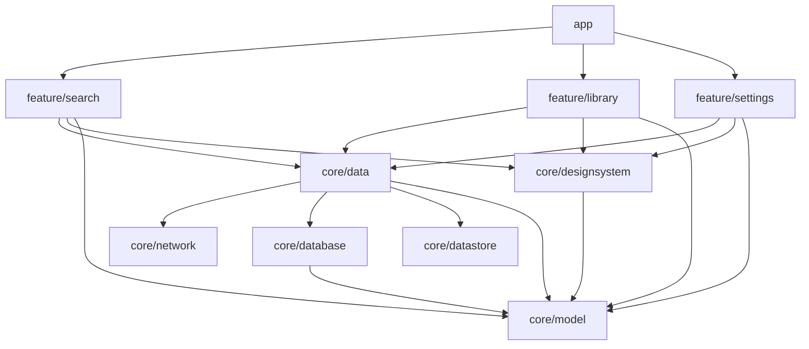

# iOS Foundation + OpenAlex Search Implementation Plan

> **For agentic workers:** REQUIRED SUB-SKILL: Use superpowers:subagent-driven-development (recommended) or superpowers:executing-plans to implement this plan task-by-task. Steps use checkbox (`- [ ]`) syntax for tracking.

**Goal:** Build the iOS app's foundation and its first feature set so it behaves exactly like Android sub-project 1: OpenAlex keyword search with sort, year and open-access filters and cursor paging, a preview sheet, saving to an offline library (GRDB in the App Group container), a basic Library list with swipe-to-remove and Undo, and Settings for the user's API key and the app language — in English and Arabic with full right-to-left layouts, light and dark.

**Architecture:** A native SwiftUI app under `ios/`: the app target `Hashiya` (XcodeGen spec `ios/project.yml`; the `.xcodeproj` is generated and git-ignored) and the local Swift package `ios/HashiyaKit` with one library per layer — `HashiyaModel` (pure Swift), the leaves `HashiyaNetwork` (URLSession + Codable OpenAlex client, `NetworkFailure`) and `HashiyaDatabase` (GRDB, migration `v1`, `PaperStore`), `HashiyaData` (repositories, mapping, error mapping, Keychain key store, `LiveDependencies`), `HashiyaDesignSystem` (colors, fonts, strings helper, shared components), the features `FeatureSearch`, `FeatureLibrary`, `FeatureSettings`, and `HashiyaTesting` (fakes, fixtures, `URLProtocolStub`, `ManualSleeper`, the snapshot helper) for tests only. The manifest grows one layer per task and enforces the dependency rules; features see only repository protocols. `@Observable @MainActor` view models are built by a manual `AppContainer`; observations are `AsyncStream`s; timing is injected so the 300 ms debounce is tested with a manual clock. Every screen is snapshot-tested in four variants (English/Arabic × light/dark) rendered in one run.

**Tech Stack:** Swift 6 (language mode 6, strict concurrency), SwiftUI, iOS 17+, Swift Testing, XCTest (UI tests), GRDB.swift 7.11.1, pointfreeco swift-snapshot-testing 1.19.6, String Catalogs, XcodeGen 2.46.0; local toolchain Xcode 27.0 with the iPhone 16 Pro iOS 18.2 simulator; CI `macos-15` with Xcode 16.4 and the iPhone 16 iOS 18.5 simulator.

**Spec:** docs/superpowers/specs/2026-09-28-ios-foundation-openalex-search-design.md

## Global Constraints

- iOS 17 minimum (`platforms: [.iOS(.v17)]`, `deploymentTarget: iOS: "17.0"`); Swift 6 language mode (`// swift-tools-version: 6.0`, `SWIFT_VERSION: "6.0"`) with strict concurrency: view models `@Observable @MainActor`, repositories, clients and stores `Sendable`.
- Code must also build with CI's Xcode 16.4 (Swift 6.1): no `Mutex` (iOS 18), no isolated `deinit`, no `@concurrent`, no default-MainActor-isolation settings. Use `OSAllocatedUnfairLock` for shared state and `TaskBag` (Task 7) to cancel observation tasks when their owner goes away.
- XcodeGen: `ios/project.yml` is committed; `ios/Hashiya.xcodeproj` is generated with `xcodegen generate --spec ios/project.yml` and git-ignored. Change targets, settings and schemes only in `project.yml`; regenerate after changing it or adding files to `ios/Hashiya` or `ios/HashiyaUITests`. CI installs it with `brew install xcodegen`.
- Package `ios/HashiyaKit`, library targets and dependencies exactly: `HashiyaModel` → none; `HashiyaNetwork` → none; `HashiyaDatabase` → GRDB; `HashiyaData` → `HashiyaModel`, `HashiyaNetwork`, `HashiyaDatabase`; `HashiyaDesignSystem` → `HashiyaModel`; `FeatureSearch`, `FeatureLibrary`, `FeatureSettings` → `HashiyaData`, `HashiyaModel`, `HashiyaDesignSystem` only (never each other, never `HashiyaNetwork`, `HashiyaDatabase` or GRDB); `HashiyaTesting` → `HashiyaData`, `HashiyaModel`, `HashiyaNetwork`, `HashiyaDesignSystem`, SnapshotTesting, used only by test targets. The app target links the three features, `HashiyaData`, `HashiyaDesignSystem` and `HashiyaModel`; its `-ui-testing` stubs live in the app under `#if DEBUG`.
- External dependencies pinned exactly: `https://github.com/groue/GRDB.swift.git` `exact: "7.11.1"`, `https://github.com/pointfreeco/swift-snapshot-testing.git` `exact: "1.19.6"`; commit `ios/HashiyaKit/Package.resolved` (it also pins swift-custom-dump 1.7.3, swift-issue-reporting 2.1.1 and swift-syntax 604.0.0).
- Identifiers: bundle ID `com.etatech.hashiya`; App Group `group.com.etatech.hashiya` (database at `<container>/Library/Application Support/hashiya.sqlite`); Keychain generic password service `com.etatech.hashiya.openalex`, account `user_api_key`, access group `$(AppIdentifierPrefix)com.etatech.hashiya.shared`, accessible after first unlock.
- Database: one `DatabaseMigrator` migration named `"v1"` creating exactly spec §5's schema; GRDB `DatabasePool` (WAL) in the App Group container, in-memory `DatabaseQueue` for tests and `-ui-testing`; foreign keys on; never `eraseDatabaseOnSchemaChange` or any destructive fallback.
- Strings: every user-visible string comes from a `Localizable.xcstrings` (`extractionState: manual`) through the target's `L10n` (built on `HashiyaStrings`) and is shown with `Text(verbatim:)`; no literal UI text in views. Keys, English and Arabic are verbatim from spec §10's tables; `search.suggestion*` are `shouldTranslate: false`. Numbers are formatted with the UI locale (`PaperFormat.number`/`.year`, years never grouped) and passed as `%@`; plurals use the `%#@count@` substitution on `%1$lld` and show `%2$@`.
- The OpenAlex key is added only by the OpenAlex client, never logged (Debug logs replace the `api_key` value with `██`, Release logs nothing), never in an error or message (`NetworkFailure` carries no underlying error and describes itself by case name). `ios/Config/Secrets.xcconfig` is git-ignored; `Secrets.example.xcconfig` is committed.
- Snapshot baselines come only from CI macOS (`macos-15`, Xcode 16.4, iPhone 16 iOS 18.5) through `.github/workflows/ios-record-snapshots.yml` driven by `bash ios/scripts/record-snapshots-on-ci.sh`. Locally, a snapshot test's first run records the missing images and fails ("No reference was found on disk. Automatically recorded snapshot: …"), the second run compares and passes; those local PNGs are for inspection only and are never committed — every `git add` below lists explicit paths and never `__Snapshots__`.
- Snapshot suites are `@MainActor @Suite(.serialized)`; any test that sets `HashiyaLanguage.override` restores the previous value (rendering spins the run loop, so other tests' work can run inside it).
- Run every command from the repository root of your worktree. Package tests use the package's own scheme (`HashiyaKit` while the package has one product in Tasks 1–2, `HashiyaKit-Package` from Task 3) on `-destination 'platform=iOS Simulator,name=iPhone 16 Pro,OS=18.2'`. If `xcodebuild` has printed `** TEST SUCCEEDED **`/`** TEST FAILED **` but does not exit within a minute (seen occasionally with Xcode 27 and the iOS 18.2 runtime), stop it with Ctrl-C; the printed result stands.
- Git: work on branch `feat/ios-foundation` in a worktree (`git worktree add -b feat/ios-foundation ../Hashiya-ios-foundation main`); never commit to `main`; never stage `.idea/`. Commit messages use `build:`/`feat:`/`test:`/`ci:`/`docs:` and contain no AI or Claude attribution (no trailers, links or credits), nor do code comments or docs.

## Review Focus

1. **Typing fast or changing chips while a slow search is still in flight** → a late answer for an older query must never replace newer results or the count, and a query replaced before its task starts never reaches the network. Pinned by `SearchViewModelTests.aSlowEarlierSearchNeverOverwritesANewerOne` and `chipChangesApplyAtOnce` (Task 7).
2. **Search text that is URL syntax — `C++`, `a=b&c=d`, `x+y z`, or Arabic with `:`, `"`, `%` and `&`** → OpenAlex receives exactly what was typed (`+` never becomes a space, `&` never splits the query). Pinned by `OpenAlexSearchClientTests.searchTextRoundTripsExactly` and `plusAndAmpersandArePercentEncoded` (Task 3).
3. **OpenAlex returning the same work on two pages, or an empty page that still carries a cursor, or sparse works (null title, null `cited_by_count`, nameless authors)** → no duplicate rows (SwiftUI list identity), no endless "loading more", "Untitled" instead of a blank card. Pinned by `SearchViewModelTests.duplicatesAcrossPagesAreDropped` (Task 7), `OpenAlexSearchRepositoryTests.endsWhenAPageIsEmptyEvenWithACursor` and `PaperMappingTests.mapsASparseWork` (Task 5), `PaperFormatTests.untitledPapersShowUntitled` (Task 6).
4. **A rejected key** → 401/403 with the user's key shows "Your API key was rejected" with Open Settings, with the built-in key "Search is unavailable right now"; saving a fixed key in Settings re-runs the search at once; the key never reaches a log line or an error description. Pinned by `ErrorMappingTests.mapsEveryFailure` (Task 5), `SearchViewModelTests.anAPIKeyChangeRerunsTheActiveSearch` (Task 7), `OpenAlexSearchClientTests.theKeyNeverAppearsInLogsOrErrors` (Task 3).
5. **Remove, then Undo in the Library** → the paper comes back in its original position with its authors; Undo after the same paper was saved again is a quiet no-op (never a unique-index error); only the latest removal can be undone. Pinned by `PaperStoreTests.reinsertingADeletedRowKeepsItsIDAndSavedAt` (Task 4), `GRDBLibraryRepositoryTests.removeThenRestoreReturnsThePaperToItsPosition` and `restoreAfterSavingAgainIsANoOp` (Task 5), `LibraryViewModelTests.twoQuickRemovalsKeepOnlyTheLatest` (Task 9).

---

## File Structure

```
ios/project.yml, ios/Config/*, ios/Hashiya/*, ios/HashiyaUITests/LaunchTests.swift, .gitignore       skeleton (Task 1); wiring (Task 11)
ios/HashiyaKit/Package.swift                                                                        grows one layer per task (Tasks 1–10)
ios/HashiyaKit/Sources/HashiyaModel/*                                                               Paper, SearchQuery, SearchError, normalizeDOI (Tasks 1–2)
ios/HashiyaKit/Sources/HashiyaNetwork/*                                                             DTOs, client, failures, logging (Task 3)
ios/HashiyaKit/Sources/HashiyaDatabase/*                                                            migrator, records, PaperStore (Task 4)
ios/HashiyaKit/Sources/HashiyaData/*                                                                mapping, repositories, Keychain, LiveDependencies (Task 5); TaskBag (Task 7)
ios/HashiyaKit/Sources/HashiyaDesignSystem/*                                                        language, strings, colors, fonts, components (Task 6)
ios/HashiyaKit/Sources/HashiyaTesting/*                                                             URLProtocolStub, fixtures (Task 3); samples (Task 5); snapshots (Task 6); fakes (Task 7)
ios/HashiyaKit/Sources/FeatureSearch/*                                                              view model (Task 7); UI and strings (Task 8)
ios/HashiyaKit/Sources/FeatureLibrary/*, FeatureSettings/*                                          (Tasks 9, 10)
ios/Hashiya/AppContainer.swift, UITestingStubs.swift, ios/HashiyaUITests/LibraryFlowTests.swift     (Task 11)
ios/scripts/*, .github/workflows/ios*.yml, .github/workflows/ci.yml, ios/README.md, README.md       (Task 12)
```

## Where this plan departs from the spec (and why)

- **Manifest grows per task** instead of declaring every target in Task 1: SwiftPM refuses a target without sources, so each task adds its own targets; the final manifest (Task 10) is exactly §3.2.
- **`PaperStore` returns `AsyncStream`s and `GRDBLibraryRepository` takes a `PaperStore`** (spec: `ValueObservation`, `writer:`): `HashiyaData` doesn't list GRDB, so it must never name GRDB types; the stream conversion lives next to the observations.
- **Colors in code**: 16 dynamic `UIColor`s with spec §8.7's exact values in `HashiyaColors.swift` instead of asset-catalog color sets (one testable file, `ThemeTests` checks every value); plus `inversePrimary` (Primary with light/dark swapped) for the banner's action. The app keeps an `AccentColor` asset.
- **One snapshot run renders all four variants** (spec: a test plan with English/Arabic configurations): `HashiyaLanguage.override` switches strings (the language's `.lproj`) and number formatting, the helper sets layout direction and color scheme. The "Arabic text on screen" check uses the strings looked up while rendering (`HashiyaStrings.recordedLookups`) because hostless package tests expose no SwiftUI accessibility tree. There is no `.xctestplan`: the `Hashiya` scheme in `project.yml` lists every package test target and the UI tests.
- **The custom year range sheet has no snapshot**: `UIPickerView` wheels render with mask artifacts in layer snapshots; its order check is covered by the Task 12 acceptance check.
- **The real Keychain is exercised by the app, not by package tests** (hostless tests get `errSecMissingEntitlement`, -34018): the repository is unit-tested through `KeychainStore`, `LaunchTests` runs the live graph, and Task 11 checks saving a key by hand.
- **`openLanguageSettings()` lives in `SettingsView`**, which owns `openURL`; the view model has no UIKit dependency.
- **Recording artifact is a tar** (`ios-snapshot-baselines.tar`) so each PNG keeps its `ios/HashiyaKit/Tests/<Target>/__Snapshots__/` path; the script is spec §12.2's `ios/scripts/record-snapshots-on-ci.sh`.
- **Pinned CI toolchain**: `macos-15` has Xcode 16.4 as default and iPhone 16 on iOS 18.5 (runner image checked 2026-09-28); local commands use the iPhone 16 Pro iOS 18.2 simulator, the only iPhone 16 Pro installed with Xcode 27.

---

### Task 1: `ios/` skeleton — XcodeGen project, package manifest, API-key config, launching app

**Files:**
- Modify: `.gitignore`
- Create: `ios/project.yml`, `ios/Config/Base.xcconfig`, `ios/Config/Secrets.example.xcconfig`
- Create: `ios/HashiyaKit/Package.swift`, `ios/HashiyaKit/Sources/HashiyaModel/SearchError.swift`
- Create: `ios/Hashiya/Info.plist`, `ios/Hashiya/Hashiya.entitlements`, `ios/Hashiya/Assets.xcassets/Contents.json`, `ios/Hashiya/Assets.xcassets/AppIcon.appiconset/Contents.json`, `ios/Hashiya/Assets.xcassets/AccentColor.colorset/Contents.json`, `ios/Hashiya/Localizable.xcstrings`, `ios/Hashiya/InfoPlist.xcstrings`, `ios/Hashiya/HashiyaApp.swift`, `ios/Hashiya/RootView.swift`, `ios/Hashiya/AppStrings.swift`
- Test: `ios/HashiyaUITests/LaunchTests.swift`, `ios/HashiyaKit/Tests/HashiyaModelTests/SearchErrorTests.swift`

**Interfaces:**
- Consumes: nothing (first iOS task).
- Produces:
  - `public enum SearchError: Error, Equatable, Sendable { case offline, invalidUserKey, rateLimited, serviceUnavailable, unexpected }` (module `HashiyaModel`)
  - Xcode targets `Hashiya` (bundle `com.etatech.hashiya`, App Group and keychain-group entitlements, Info.plist keys `OpenAlexAPIKey = $(OPENALEX_API_KEY)` and `KeychainAccessGroup = $(AppIdentifierPrefix)com.etatech.hashiya.shared`) and `HashiyaUITests`; scheme `Hashiya`
  - `enum AppStrings { static func string(_ key: String) -> String }` (app target; Task 11 moves it onto `HashiyaStrings`)
  - `struct RootView: View` with a `TabView` of Library (selected) and Search

The Android app is untouched. The app shows two empty tabs for now; the smoke tests prove the XcodeGen project builds, signs for the simulator with its entitlements and launches, and that the package's test pipeline runs.

- [ ] **Step 1: Write the configuration and the failing smoke tests**

In `.gitignore`, the block from `# iOS` down is new (full file):

`.gitignore`:
```gitignore
*.iml
.gradle
/local.properties
/.idea/caches
/.idea/libraries
/.idea/modules.xml
/.idea/workspace.xml
/.idea/navEditor.xml
/.idea/assetWizardSettings.xml
.DS_Store
build/
/captures
.externalNativeBuild
.cxx
local.properties

.superpowers/
.kotlin/

# iOS
ios/Config/Secrets.xcconfig
ios/Hashiya.xcodeproj/
ios/HashiyaKit/.build/
ios/HashiyaKit/.swiftpm/
xcuserdata/
```

`ios/project.yml`:
```yaml
name: Hashiya
options:
  bundleIdPrefix: com.etatech
  developmentLanguage: en
  deploymentTarget:
    iOS: "17.0"
settings:
  base:
    SWIFT_VERSION: "6.0"
    MARKETING_VERSION: "1.0"
    CURRENT_PROJECT_VERSION: "1"
packages:
  HashiyaKit:
    path: HashiyaKit
targets:
  Hashiya:
    type: application
    platform: iOS
    sources:
      - Hashiya
    configFiles:
      Debug: Config/Base.xcconfig
      Release: Config/Base.xcconfig
    settings:
      base:
        PRODUCT_BUNDLE_IDENTIFIER: com.etatech.hashiya
        INFOPLIST_FILE: Hashiya/Info.plist
        GENERATE_INFOPLIST_FILE: NO
        CODE_SIGN_ENTITLEMENTS: Hashiya/Hashiya.entitlements
        ASSETCATALOG_COMPILER_APPICON_NAME: AppIcon
        ASSETCATALOG_COMPILER_GLOBAL_ACCENT_COLOR_NAME: AccentColor
        TARGETED_DEVICE_FAMILY: "1,2"
        SWIFT_EMIT_LOC_STRINGS: NO
        LOCALIZATION_PREFERS_STRING_CATALOGS: YES
  HashiyaUITests:
    type: bundle.ui-testing
    platform: iOS
    sources:
      - HashiyaUITests
    settings:
      base:
        PRODUCT_BUNDLE_IDENTIFIER: com.etatech.hashiya.uitests
        GENERATE_INFOPLIST_FILE: YES
    dependencies:
      - target: Hashiya
schemes:
  Hashiya:
    build:
      targets:
        Hashiya: all
        HashiyaUITests: [test]
    test:
      targets:
        - HashiyaUITests
```

`ios/Config/Base.xcconfig`:
```text
// Shared build settings for the Hashiya targets.
// The OpenAlex key lives in the git-ignored Secrets.xcconfig (copy Secrets.example.xcconfig).
// Without it, OPENALEX_API_KEY is empty and the app sends requests without a key.
OPENALEX_API_KEY =

#include? "Secrets.xcconfig"
```

`ios/Config/Secrets.example.xcconfig`:
```text
// Copy this file to Secrets.xcconfig (git-ignored) and put your OpenAlex API key after the "=".
// The key is built into the app; the user can override it in Settings.
OPENALEX_API_KEY = your-openalex-api-key
```

`ios/HashiyaKit/Package.swift`:
```swift
// swift-tools-version: 6.0
import PackageDescription

let package = Package(
    name: "HashiyaKit",
    defaultLocalization: "en",
    platforms: [.iOS(.v17)],
    products: [
        .library(name: "HashiyaModel", targets: ["HashiyaModel"]),
    ],
    targets: [
        .target(name: "HashiyaModel"),
        .testTarget(name: "HashiyaModelTests", dependencies: ["HashiyaModel"]),
    ]
)
```

`ios/HashiyaUITests/LaunchTests.swift`:
```swift
import XCTest

final class LaunchTests: XCTestCase {
    @MainActor
    func testLaunchShowsLibraryAndSearchTabs() {
        let app = XCUIApplication()
        app.launchArguments += ["-AppleLanguages", "(en)", "-AppleLocale", "en_US"]
        app.launch()

        XCTAssertTrue(app.tabBars.buttons["Library"].waitForExistence(timeout: 10))
        XCTAssertTrue(app.tabBars.buttons["Search"].exists)
        XCTAssertTrue(app.tabBars.buttons["Library"].isSelected)
    }
}
```

`ios/HashiyaKit/Tests/HashiyaModelTests/SearchErrorTests.swift`:
```swift
import HashiyaModel
import Testing

struct SearchErrorTests {
    @Test func casesAreDistinct() {
        let all: [SearchError] = [.offline, .invalidUserKey, .rateLimited, .serviceUnavailable, .unexpected]
        #expect(Set(all.map { "\($0)" }).count == 5)
    }
}
```

- [ ] **Step 2: Run the smoke tests to verify they fail**

Run: `(cd ios/HashiyaKit && xcodebuild test -scheme HashiyaKit -destination 'platform=iOS Simulator,name=iPhone 16 Pro,OS=18.2' -only-testing:HashiyaModelTests) 2>&1 | grep -E 'error:|referenced in product|✘|✔ Test run|Executed [0-9]+ test|\*\* TEST'`
Expected: FAIL before compiling — `xcodebuild: error: Could not resolve package dependencies:` and `target 'HashiyaModel' referenced in product 'HashiyaModel' is empty` (no sources yet).

Run: `xcodegen generate --spec ios/project.yml`
Expected: FAIL — `Spec validation error: Target "Hashiya" has a missing source directory "…/ios/Hashiya"` (the app sources don't exist yet).

- [ ] **Step 3: Implement the model smoke type and the app skeleton**

`ios/HashiyaKit/Sources/HashiyaModel/SearchError.swift`:
```swift
/// Why a search failed, as the UI tells the user.
public enum SearchError: Error, Equatable, Sendable {
    case offline
    case invalidUserKey
    case rateLimited
    case serviceUnavailable
    case unexpected
}
```

`ios/Hashiya/Info.plist`:
```xml
<?xml version="1.0" encoding="UTF-8"?>
<!DOCTYPE plist PUBLIC "-//Apple//DTD PLIST 1.0//EN" "http://www.apple.com/DTDs/PropertyList-1.0.dtd">
<plist version="1.0">
<dict>
	<key>CFBundleDevelopmentRegion</key>
	<string>$(DEVELOPMENT_LANGUAGE)</string>
	<key>CFBundleDisplayName</key>
	<string>Hashiya</string>
	<key>CFBundleExecutable</key>
	<string>$(EXECUTABLE_NAME)</string>
	<key>CFBundleIdentifier</key>
	<string>$(PRODUCT_BUNDLE_IDENTIFIER)</string>
	<key>CFBundleInfoDictionaryVersion</key>
	<string>6.0</string>
	<key>CFBundleLocalizations</key>
	<array>
		<string>en</string>
		<string>ar</string>
	</array>
	<key>CFBundleName</key>
	<string>$(PRODUCT_NAME)</string>
	<key>CFBundlePackageType</key>
	<string>$(PRODUCT_BUNDLE_PACKAGE_TYPE)</string>
	<key>CFBundleShortVersionString</key>
	<string>$(MARKETING_VERSION)</string>
	<key>CFBundleVersion</key>
	<string>$(CURRENT_PROJECT_VERSION)</string>
	<key>KeychainAccessGroup</key>
	<string>$(AppIdentifierPrefix)com.etatech.hashiya.shared</string>
	<key>LSRequiresIPhoneOS</key>
	<true/>
	<key>OpenAlexAPIKey</key>
	<string>$(OPENALEX_API_KEY)</string>
	<key>UILaunchScreen</key>
	<dict/>
	<key>UISupportedInterfaceOrientations</key>
	<array>
		<string>UIInterfaceOrientationPortrait</string>
		<string>UIInterfaceOrientationLandscapeLeft</string>
		<string>UIInterfaceOrientationLandscapeRight</string>
	</array>
	<key>UISupportedInterfaceOrientations~ipad</key>
	<array>
		<string>UIInterfaceOrientationPortrait</string>
		<string>UIInterfaceOrientationPortraitUpsideDown</string>
		<string>UIInterfaceOrientationLandscapeLeft</string>
		<string>UIInterfaceOrientationLandscapeRight</string>
	</array>
</dict>
</plist>
```

`ios/Hashiya/Hashiya.entitlements`:
```xml
<?xml version="1.0" encoding="UTF-8"?>
<!DOCTYPE plist PUBLIC "-//Apple//DTD PLIST 1.0//EN" "http://www.apple.com/DTDs/PropertyList-1.0.dtd">
<plist version="1.0">
<dict>
	<key>com.apple.security.application-groups</key>
	<array>
		<string>group.com.etatech.hashiya</string>
	</array>
	<key>keychain-access-groups</key>
	<array>
		<string>$(AppIdentifierPrefix)com.etatech.hashiya.shared</string>
	</array>
</dict>
</plist>
```

`ios/Hashiya/Assets.xcassets/Contents.json`:
```json
{
  "info" : {
    "author" : "xcode",
    "version" : 1
  }
}
```

`ios/Hashiya/Assets.xcassets/AppIcon.appiconset/Contents.json`:
```json
{
  "images" : [
    {
      "idiom" : "universal",
      "platform" : "ios",
      "size" : "1024x1024"
    }
  ],
  "info" : {
    "author" : "xcode",
    "version" : 1
  }
}
```

`ios/Hashiya/Assets.xcassets/AccentColor.colorset/Contents.json`:
```json
{
  "colors" : [
    {
      "color" : {
        "color-space" : "srgb",
        "components" : { "alpha" : "1.000", "blue" : "0x6E", "green" : "0x6E", "red" : "0x0B" }
      },
      "idiom" : "universal"
    },
    {
      "appearances" : [ { "appearance" : "luminosity", "value" : "dark" } ],
      "color" : {
        "color-space" : "srgb",
        "components" : { "alpha" : "1.000", "blue" : "0xD2", "green" : "0xD4", "red" : "0x7F" }
      },
      "idiom" : "universal"
    }
  ],
  "info" : {
    "author" : "xcode",
    "version" : 1
  }
}
```

`ios/Hashiya/Localizable.xcstrings`:
```json
{
  "sourceLanguage" : "en",
  "strings" : {
    "nav.library" : {
      "extractionState" : "manual",
      "localizations" : {
        "ar" : {
          "stringUnit" : {
            "state" : "translated",
            "value" : "المكتبة"
          }
        },
        "en" : {
          "stringUnit" : {
            "state" : "translated",
            "value" : "Library"
          }
        }
      }
    },
    "nav.search" : {
      "extractionState" : "manual",
      "localizations" : {
        "ar" : {
          "stringUnit" : {
            "state" : "translated",
            "value" : "البحث"
          }
        },
        "en" : {
          "stringUnit" : {
            "state" : "translated",
            "value" : "Search"
          }
        }
      }
    }
  },
  "version" : "1.0"
}
```

`ios/Hashiya/InfoPlist.xcstrings`:
```json
{
  "sourceLanguage" : "en",
  "strings" : {
    "CFBundleDisplayName" : {
      "extractionState" : "manual",
      "localizations" : {
        "ar" : {
          "stringUnit" : {
            "state" : "translated",
            "value" : "حاشية"
          }
        },
        "en" : {
          "stringUnit" : {
            "state" : "translated",
            "value" : "Hashiya"
          }
        }
      }
    }
  },
  "version" : "1.0"
}
```

`ios/Hashiya/HashiyaApp.swift`:
```swift
import SwiftUI

@main
struct HashiyaApp: App {
    var body: some Scene {
        WindowGroup {
            RootView()
        }
    }
}
```

`ios/Hashiya/RootView.swift`:
```swift
import SwiftUI

/// Library and Search tabs, each in its own navigation stack. Library is selected at launch.
struct RootView: View {
    enum Tab: Hashable { case library, search }

    @State private var selectedTab = Tab.library

    var body: some View {
        TabView(selection: $selectedTab) {
            NavigationStack {
                Color.clear
            }
            .tabItem {
                Label {
                    Text(verbatim: AppStrings.string("nav.library"))
                } icon: {
                    Image(systemName: "books.vertical")
                }
            }
            .tag(Tab.library)

            NavigationStack {
                Color.clear
            }
            .tabItem {
                Label {
                    Text(verbatim: AppStrings.string("nav.search"))
                } icon: {
                    Image(systemName: "magnifyingglass")
                }
            }
            .tag(Tab.search)
        }
    }
}
```

`ios/Hashiya/AppStrings.swift`:
```swift
import Foundation

/// The app target's own strings, from its Localizable.xcstrings.
enum AppStrings {
    static func string(_ key: String) -> String {
        Bundle.main.localizedString(forKey: key, value: nil, table: nil)
    }
}
```

- [ ] **Step 4: Run the smoke tests to verify they pass**

Run: `(cd ios/HashiyaKit && xcodebuild test -scheme HashiyaKit -destination 'platform=iOS Simulator,name=iPhone 16 Pro,OS=18.2' -only-testing:HashiyaModelTests) 2>&1 | grep -E 'error:|referenced in product|✘|✔ Test run|Executed [0-9]+ test|\*\* TEST'`
Expected: `✔ Test run with 1 test in 1 suite passed` and `** TEST SUCCEEDED **`.

Run: `xcodegen generate --spec ios/project.yml && xcodebuild test -project ios/Hashiya.xcodeproj -scheme Hashiya -destination 'platform=iOS Simulator,name=iPhone 16 Pro,OS=18.2' -collect-test-diagnostics never 2>&1 | grep -E 'error:|referenced in product|✘|✔ Test run|Executed [0-9]+ test|\*\* TEST'`
Expected: `Executed 1 test, with 0 failures` (`LaunchTests.testLaunchShowsLibraryAndSearchTabs`) and `** TEST SUCCEEDED **`.

Check the optional key include (the value is temporary; the file is git-ignored and deleted again):
```bash
printf 'OPENALEX_API_KEY = check-123\n' > ios/Config/Secrets.xcconfig
xcodebuild -project ios/Hashiya.xcodeproj -target Hashiya -showBuildSettings 2>/dev/null | grep ' OPENALEX_API_KEY'
rm ios/Config/Secrets.xcconfig
git check-ignore ios/Hashiya.xcodeproj ios/Config/Secrets.xcconfig
```
Expected: `    OPENALEX_API_KEY = check-123`, then `ios/Hashiya.xcodeproj` and `ios/Config/Secrets.xcconfig` (both ignored). With the file removed the key is empty and the app sends no `api_key`.

- [ ] **Step 5: Commit**

```bash
git add .gitignore ios/project.yml ios/Config/Base.xcconfig ios/Config/Secrets.example.xcconfig \
  ios/HashiyaKit/Package.swift ios/HashiyaKit/Sources/HashiyaModel/SearchError.swift \
  ios/HashiyaKit/Tests/HashiyaModelTests/SearchErrorTests.swift ios/Hashiya ios/HashiyaUITests/LaunchTests.swift
git commit -m "build: add the iOS app skeleton with an XcodeGen project and the HashiyaKit package"
```

---

### Task 2: `HashiyaModel` — papers, queries, year filters and `normalizeDOI`

**Files:**
- Create: `ios/HashiyaKit/Sources/HashiyaModel/Paper.swift`, `SearchQuery.swift`, `NormalizeDOI.swift` (same directory)
- Test: `ios/HashiyaKit/Tests/HashiyaModelTests/NormalizeDOITests.swift`, `SearchQueryTests.swift`, `PaperTests.swift`

**Interfaces:**
- Consumes: `SearchError` (Task 1).
- Produces (all `public`, module `HashiyaModel`):
  - `struct Paper: Equatable, Hashable, Sendable, Identifiable { var openAlexID: String; var doi: String?; var title: String; var authors: [Author]; var year: Int?; var venue: String?; var abstract: String?; var citationCount: Int; var isOpenAccess: Bool; var openAccessPDFURL: String?; var id: String { get } }` with `init(openAlexID:doi:title:authors:year:venue:abstract:citationCount:isOpenAccess:openAccessPDFURL:)` (everything but `openAlexID` and `title` defaulted)
  - `struct Author: Equatable, Hashable, Sendable { var name: String; var openAlexID: String? }`, `init(name:openAlexID: = nil)`
  - `struct SearchQuery: Equatable, Hashable, Sendable { var text: String; var sort: SearchSort; var years: YearFilter; var openAccessOnly: Bool; var hasActiveFilters: Bool { get } }`, `init(text:sort: = .relevance, years: = .anyTime, openAccessOnly: = false)`
  - `enum SearchSort: String, CaseIterable, Sendable { case relevance, mostCited, newest }`
  - `enum YearFilter: Equatable, Hashable, Sendable { case anyTime; case since(Int); case between(from: Int, to: Int); static func between(_ from: Int, _ to: Int) -> YearFilter? }`
  - `func normalizeDOI(_ raw: String) -> String?`

- [ ] **Step 1: Write the failing tests**

`ios/HashiyaKit/Tests/HashiyaModelTests/NormalizeDOITests.swift`:
```swift
import HashiyaModel
import Testing

struct NormalizeDOITests {
    @Test(arguments: [
        ("https://doi.org/10.48550/arXiv.1706.03762", "10.48550/arxiv.1706.03762"),
        ("http://doi.org/10.1000/xyz", "10.1000/xyz"),
        ("https://dx.doi.org/10.1000/xyz", "10.1000/xyz"),
        ("http://dx.doi.org/10.1000/XYZ", "10.1000/xyz"),
        ("doi:10.1000/XYZ", "10.1000/xyz"),
        ("DOI: 10.1000/xyz", "10.1000/xyz"),
        ("  10.1000/xyz \n", "10.1000/xyz"),
        ("10.1000/xyz", "10.1000/xyz"),
    ])
    func normalizes(raw: String, expected: String) {
        #expect(normalizeDOI(raw) == expected)
    }

    @Test(arguments: ["", "   ", "https://example.com/paper", "10.1000", "not-a-doi", "11.1000/xyz"])
    func rejects(raw: String) {
        #expect(normalizeDOI(raw) == nil)
    }
}
```

`ios/HashiyaKit/Tests/HashiyaModelTests/SearchQueryTests.swift`:
```swift
import HashiyaModel
import Testing

struct SearchQueryTests {
    @Test func aPlainQueryHasNoActiveFilters() {
        #expect(!SearchQuery(text: "bert").hasActiveFilters)
    }

    @Test(arguments: SearchSort.allCases)
    func sortIsNotAFilter(sort: SearchSort) {
        #expect(!SearchQuery(text: "bert", sort: sort).hasActiveFilters)
    }

    @Test func yearsAndOpenAccessAreFilters() {
        #expect(SearchQuery(text: "bert", years: .since(2020)).hasActiveFilters)
        #expect(SearchQuery(text: "bert", years: .between(from: 2015, to: 2020)).hasActiveFilters)
        #expect(SearchQuery(text: "bert", openAccessOnly: true).hasActiveFilters)
    }

    @Test func betweenRejectsAStartAfterTheEnd() {
        #expect(YearFilter.between(2021, 2020) == nil)
    }

    @Test func betweenAcceptsOrderedAndEqualYears() {
        #expect(YearFilter.between(2015, 2020) == .between(from: 2015, to: 2020))
        #expect(YearFilter.between(2020, 2020) == .between(from: 2020, to: 2020))
    }

    @Test func defaultsAreRelevanceAnyTimeAndAllAccess() {
        let query = SearchQuery(text: "bert")
        #expect(query.sort == .relevance)
        #expect(query.years == .anyTime)
        #expect(!query.openAccessOnly)
    }
}
```

`ios/HashiyaKit/Tests/HashiyaModelTests/PaperTests.swift`:
```swift
import HashiyaModel
import Testing

struct PaperTests {
    @Test func identityIsTheOpenAlexID() {
        let paper = Paper(openAlexID: "W2626778328", title: "Attention Is All You Need")
        #expect(paper.id == "W2626778328")
    }

    @Test func anUntitledPaperKeepsAnEmptyTitle() {
        let paper = Paper(openAlexID: "W4000000002", title: "")
        #expect(paper.title.isEmpty)
        #expect(paper.authors.isEmpty)
        #expect(paper.citationCount == 0)
        #expect(!paper.isOpenAccess)
    }
}
```

- [ ] **Step 2: Run the tests to verify they fail**

Run: `(cd ios/HashiyaKit && xcodebuild test -scheme HashiyaKit -destination 'platform=iOS Simulator,name=iPhone 16 Pro,OS=18.2' -only-testing:HashiyaModelTests) 2>&1 | grep -E 'error:|referenced in product|✘|✔ Test run|Executed [0-9]+ test|\*\* TEST'`
Expected: FAIL — `error: cannot find 'normalizeDOI' in scope`, `error: cannot find 'SearchQuery' in scope`, `error: cannot find 'Paper' in scope`, then `** TEST FAILED **`.

- [ ] **Step 3: Implement the model**

`ios/HashiyaKit/Sources/HashiyaModel/Paper.swift`:
```swift
/// A scholarly work, as shown in search results and stored in the library.
public struct Paper: Equatable, Hashable, Sendable, Identifiable {
    /// The short OpenAlex ID, e.g. "W2741809807", without the URL prefix.
    public var openAlexID: String
    /// Normalized by `normalizeDOI`: lowercase, no prefix.
    public var doi: String?
    /// "" when OpenAlex has no title; the UI shows "Untitled".
    public var title: String
    /// In authorship order.
    public var authors: [Author]
    public var year: Int?
    public var venue: String?
    public var abstract: String?
    public var citationCount: Int
    public var isOpenAccess: Bool
    public var openAccessPDFURL: String?

    public var id: String { openAlexID }

    public init(
        openAlexID: String,
        doi: String? = nil,
        title: String,
        authors: [Author] = [],
        year: Int? = nil,
        venue: String? = nil,
        abstract: String? = nil,
        citationCount: Int = 0,
        isOpenAccess: Bool = false,
        openAccessPDFURL: String? = nil
    ) {
        self.openAlexID = openAlexID
        self.doi = doi
        self.title = title
        self.authors = authors
        self.year = year
        self.venue = venue
        self.abstract = abstract
        self.citationCount = citationCount
        self.isOpenAccess = isOpenAccess
        self.openAccessPDFURL = openAccessPDFURL
    }
}

public struct Author: Equatable, Hashable, Sendable {
    public var name: String
    /// The short OpenAlex author ID, e.g. "A5103024730", when known.
    public var openAlexID: String?

    public init(name: String, openAlexID: String? = nil) {
        self.name = name
        self.openAlexID = openAlexID
    }
}
```

`ios/HashiyaKit/Sources/HashiyaModel/SearchQuery.swift`:
```swift
/// A keyword search with its sort and filters.
public struct SearchQuery: Equatable, Hashable, Sendable {
    public var text: String
    public var sort: SearchSort
    public var years: YearFilter
    public var openAccessOnly: Bool

    public init(text: String, sort: SearchSort = .relevance, years: YearFilter = .anyTime, openAccessOnly: Bool = false) {
        self.text = text
        self.sort = sort
        self.years = years
        self.openAccessOnly = openAccessOnly
    }

    /// True when a year or open-access filter is set. The sort is not a filter.
    public var hasActiveFilters: Bool { years != .anyTime || openAccessOnly }
}

public enum SearchSort: String, CaseIterable, Sendable {
    case relevance, mostCited, newest
}

public enum YearFilter: Equatable, Hashable, Sendable {
    case anyTime
    /// Papers published in this year or later. Presets: 2024, 2020, 2015.
    case since(Int)
    /// Papers published from `from` through `to`, with `from <= to`. Build it with `YearFilter.between(_:_:)`.
    case between(from: Int, to: Int)

    /// A range filter, or nil when `from` is after `to`.
    public static func between(_ from: Int, _ to: Int) -> YearFilter? {
        from <= to ? .between(from: from, to: to) : nil
    }
}
```

`ios/HashiyaKit/Sources/HashiyaModel/NormalizeDOI.swift`:
```swift
import Foundation


private let doiPrefixes = [
    "https://doi.org/",
    "http://doi.org/",
    "https://dx.doi.org/",
    "http://dx.doi.org/",
    "doi:",
]

/// A DOI in canonical form ("10.1000/xyz": lowercase, no prefix), or nil when `raw` is not a DOI.
public func normalizeDOI(_ raw: String) -> String? {
    var value = raw.trimmingCharacters(in: .whitespacesAndNewlines).lowercased()
    if let prefix = doiPrefixes.first(where: { value.hasPrefix($0) }) {
        value = String(value.dropFirst(prefix.count)).trimmingCharacters(in: .whitespacesAndNewlines)
    }
    return value.hasPrefix("10.") && value.contains("/") ? value : nil
}
```

- [ ] **Step 4: Run the tests to verify they pass**

Run: `(cd ios/HashiyaKit && xcodebuild test -scheme HashiyaKit -destination 'platform=iOS Simulator,name=iPhone 16 Pro,OS=18.2' -only-testing:HashiyaModelTests) 2>&1 | grep -E 'error:|referenced in product|✘|✔ Test run|Executed [0-9]+ test|\*\* TEST'`
Expected: `✔ Test run with 11 tests in 4 suites passed` (parameterised tables count once) and `** TEST SUCCEEDED **`.

- [ ] **Step 5: Commit**

```bash
git add ios/HashiyaKit/Sources/HashiyaModel ios/HashiyaKit/Tests/HashiyaModelTests
git commit -m "feat: add the iOS paper and search query model with DOI normalization"
```

---

### Task 3: `HashiyaNetwork` — OpenAlex search client, parsing, failures, key handling, and `URLProtocolStub`

**Files:**
- Modify: `ios/HashiyaKit/Package.swift` (adds `HashiyaNetwork`, `HashiyaTesting`, `HashiyaNetworkTests`)
- Create: `ios/HashiyaKit/Sources/HashiyaNetwork/{NetworkModels.swift, RebuildAbstract.swift, NetworkFailure.swift, UserAPIKeySource.swift, OpenAlexSearchService.swift, OpenAlexSession.swift, RequestLog.swift, OpenAlexHTTP.swift, OpenAlexSearchClient.swift}`
- Create: `ios/HashiyaKit/Sources/HashiyaTesting/{URLProtocolStub.swift, Fixtures.swift, FixedUserAPIKeySource.swift}`, `ios/HashiyaKit/Sources/HashiyaTesting/Resources/Fixtures/works_page.json`, `work.json` (copied byte-for-byte from `core/network/src/test/resources/`)
- Test: `ios/HashiyaKit/Tests/HashiyaNetworkTests/OpenAlexSearchClientTests.swift`, `NetworkModelsTests.swift`, `RebuildAbstractTests.swift`, `OpenAlexSessionTests.swift`

**Interfaces:**
- Consumes: nothing from other targets (`HashiyaNetwork` is a leaf and never imports `HashiyaModel`).
- Produces (module `HashiyaNetwork`, all `public`):
  - DTOs `struct NetworkWorksResponse: Decodable, Equatable, Sendable { let meta: NetworkMeta; let results: [NetworkWork] }`, `NetworkMeta { let count: Int64; let nextCursor: String? }`, `NetworkWork { let id: String; let doi: String?; let displayName: String?; let publicationYear: Int?; let primaryLocation: NetworkLocation?; let authorships: [NetworkAuthorship]; let citedByCount: Int; let openAccess: NetworkOpenAccess?; let bestOALocation: NetworkLocation?; let abstractInvertedIndex: [String: [Int]]? }`, `NetworkLocation { let pdfURL: String?; let source: NetworkSource? }`, `NetworkSource { let displayName: String? }`, `NetworkAuthorship { let author: NetworkAuthor }`, `NetworkAuthor { let id: String?; let displayName: String? }`, `NetworkOpenAccess { let isOA: Bool }`, each with a memberwise `public init`
  - `func rebuildAbstract(_ invertedIndex: [String: [Int]]?) -> String?`
  - `enum NetworkFailure: Error, Equatable, Sendable, CustomStringConvertible { case connectivity; case http(code: Int, usedUserKey: Bool); case malformedResponse; case unknown }`
  - `protocol UserAPIKeySource: Sendable { var userKey: String? { get } }`
  - `struct WorksSearchRequest: Equatable, Sendable { var search: String; var filter: String?; var sort: String?; var cursor: String; var perPage: Int }`
  - `protocol OpenAlexSearchService: Sendable { func searchWorks(_ request: WorksSearchRequest) async throws -> NetworkWorksResponse }`
  - `final class OpenAlexSearchClient: OpenAlexSearchService`, `init(session: URLSession, builtInKey: String?, userKeySource: any UserAPIKeySource, baseURL: URL = OpenAlexSession.baseURL, log: @escaping @Sendable (String) -> Void = RequestLog.debug)`, `static let selectFields: String`
  - `enum OpenAlexSession { static let baseURL: URL; static func makeConfiguration() -> URLSessionConfiguration; static func make() -> URLSession }`
  - `enum RequestLog { static let redactedKey: String; static let debug: @Sendable (String) -> Void; static func line(method: String, url: URL, outcome: String) -> String }`
  - Internal `struct OpenAlexHTTP` (`get(path:query:) async throws -> Data`): key choice, RFC 3986 encoding, logging and failure classification, reused by spec 2's lookup client.
- Produces (module `HashiyaTesting`): `final class URLProtocolStub: URLProtocol` with `enum Reply { case status(Int, body: Data = Data()); case failure(URLError.Code); static func json(_: String) -> Reply }` and `final class Server: Sendable { let session: URLSession; init(reply: @escaping @Sendable (URLRequest) -> Reply); convenience init(always: Reply); var requests: [URLRequest]; var lastQuery: [String: String]; func setReply(_:); func invalidate() }`; `enum Fixtures { static func data(_ name: String) -> Data; static func string(_ name: String) -> String }`; `struct FixedUserAPIKeySource: UserAPIKeySource { init(_ userKey: String?) }`.

Each `URLProtocolStub.Server` has its own session (it tags requests with a header), so Swift Testing can run the network tests in parallel.

- [ ] **Step 1: Add the targets and write the failing tests**

`ios/HashiyaKit/Package.swift` (full replacement):
```swift
// swift-tools-version: 6.0
import PackageDescription

let package = Package(
    name: "HashiyaKit",
    defaultLocalization: "en",
    platforms: [.iOS(.v17)],
    products: [
        .library(name: "HashiyaModel", targets: ["HashiyaModel"]),
        .library(name: "HashiyaNetwork", targets: ["HashiyaNetwork"]),
        .library(name: "HashiyaTesting", targets: ["HashiyaTesting"]),
    ],
    targets: [
        .target(name: "HashiyaModel"),
        .target(name: "HashiyaNetwork"),
        .target(
            name: "HashiyaTesting",
            dependencies: ["HashiyaNetwork"],
            resources: [.copy("Resources/Fixtures")]
        ),
        .testTarget(name: "HashiyaModelTests", dependencies: ["HashiyaModel"]),
        .testTarget(name: "HashiyaNetworkTests", dependencies: ["HashiyaNetwork", "HashiyaTesting"]),
    ]
)
```

Copy the Android fixtures (byte-for-byte):
```bash
mkdir -p ios/HashiyaKit/Sources/HashiyaTesting/Resources/Fixtures
cp core/network/src/test/resources/works_page.json core/network/src/test/resources/work.json ios/HashiyaKit/Sources/HashiyaTesting/Resources/Fixtures/
```

`ios/HashiyaKit/Tests/HashiyaNetworkTests/OpenAlexSearchClientTests.swift`:
```swift
import Foundation
import HashiyaNetwork
import HashiyaTesting
import os
import Testing

struct OpenAlexSearchClientTests {
    private let page = Fixtures.string("works_page.json")

    private func request(
        search: String = "bert",
        filter: String? = nil,
        sort: String? = nil,
        cursor: String = "*"
    ) -> WorksSearchRequest {
        WorksSearchRequest(search: search, filter: filter, sort: sort, cursor: cursor, perPage: 25)
    }

    private func client(
        _ server: URLProtocolStub.Server,
        builtInKey: String? = nil,
        userKey: String? = nil,
        log: @escaping @Sendable (String) -> Void = { _ in }
    ) -> OpenAlexSearchClient {
        OpenAlexSearchClient(session: server.session, builtInKey: builtInKey, userKeySource: FixedUserAPIKeySource(userKey), log: log)
    }

    @Test func sendsEveryQueryParameterToWorks() async throws {
        let server = URLProtocolStub.Server(always: .json(page))
        _ = try await client(server).searchWorks(
            request(search: "bert", filter: "publication_year:>2019,is_oa:true", sort: "cited_by_count:desc")
        )

        let url = try #require(server.requests.last?.url)
        #expect(url.scheme == "https")
        #expect(url.host() == "api.openalex.org")
        #expect(url.path() == "/works")
        #expect(server.lastQuery == [
            "search": "bert",
            "filter": "publication_year:>2019,is_oa:true",
            "sort": "cited_by_count:desc",
            "per_page": "25",
            "cursor": "*",
            "select": "id,doi,display_name,publication_year,primary_location,authorships,cited_by_count,open_access,best_oa_location,abstract_inverted_index",
        ])
    }

    @Test func omitsFilterAndSortWhenNil() async throws {
        let server = URLProtocolStub.Server(always: .json(page))
        _ = try await client(server).searchWorks(request())

        #expect(server.lastQuery["filter"] == nil)
        #expect(server.lastQuery["sort"] == nil)
        #expect(server.lastQuery.keys.sorted() == ["cursor", "per_page", "search", "select"])
    }

    @Test func passesTheCursorThrough() async throws {
        let server = URLProtocolStub.Server(always: .json(page))
        _ = try await client(server).searchWorks(request(cursor: "IlsxMDAuMCwgJ1czMTc3ODI4OTA5J10i"))

        #expect(server.lastQuery["cursor"] == "IlsxMDAuMCwgJ1czMTc3ODI4OTA5J10i")
    }

    @Test(arguments: ["تعلم الآلة: \"deep\", 100% & more", "C++", "a=b&c=d", "x+y z"])
    func searchTextRoundTripsExactly(text: String) async throws {
        let server = URLProtocolStub.Server(always: .json(page))
        _ = try await client(server).searchWorks(request(search: text))

        #expect(server.lastQuery["search"] == text)
    }

    @Test func plusAndAmpersandArePercentEncoded() async throws {
        let server = URLProtocolStub.Server(always: .json(page))
        _ = try await client(server).searchWorks(request(search: "C++ & more"))

        let query = try #require(server.requests.last?.url?.query(percentEncoded: true))
        #expect(query.contains("search=C%2B%2B%20%26%20more"))
    }

    @Test func usesTheBuiltInKey() async throws {
        let server = URLProtocolStub.Server(always: .json(page))
        _ = try await client(server, builtInKey: "built-in-key").searchWorks(request())

        #expect(server.lastQuery["api_key"] == "built-in-key")
    }

    @Test func theUserKeyOverridesTheBuiltInKey() async throws {
        let server = URLProtocolStub.Server(always: .json(page))
        _ = try await client(server, builtInKey: "built-in-key", userKey: "user-key").searchWorks(request())

        #expect(server.lastQuery["api_key"] == "user-key")
    }

    @Test func aBlankUserKeyFallsBackToTheBuiltInKey() async throws {
        let server = URLProtocolStub.Server(always: .json(page))
        _ = try await client(server, builtInKey: "built-in-key", userKey: "   ").searchWorks(request())

        #expect(server.lastQuery["api_key"] == "built-in-key")
    }

    @Test(arguments: [nil, "", "  "] as [String?])
    func sendsNoKeyWhenThereIsNone(builtInKey: String?) async throws {
        let server = URLProtocolStub.Server(always: .json(page))
        _ = try await client(server, builtInKey: builtInKey).searchWorks(request())

        #expect(server.lastQuery["api_key"] == nil)
    }

    @Test func parsesTheResponse() async throws {
        let server = URLProtocolStub.Server(always: .json(page))
        let response = try await client(server).searchWorks(request())

        #expect(response.meta.count == 48210)
        #expect(response.results.count == 2)
    }

    @Test func rejectedUserKeyReportsThatTheUserKeyWasUsed() async {
        let server = URLProtocolStub.Server(always: .status(401))
        await #expect(throws: NetworkFailure.http(code: 401, usedUserKey: true)) {
            try await client(server, builtInKey: "built-in-key", userKey: "user-key").searchWorks(request())
        }
    }

    @Test func rejectedBuiltInKeyReportsThatTheUserKeyWasNotUsed() async {
        let server = URLProtocolStub.Server(always: .status(403))
        await #expect(throws: NetworkFailure.http(code: 403, usedUserKey: false)) {
            try await client(server, builtInKey: "built-in-key").searchWorks(request())
        }
    }

    @Test(arguments: [429, 400, 500, 503])
    func otherStatusesKeepTheirCode(code: Int) async {
        let server = URLProtocolStub.Server(always: .status(code))
        await #expect(throws: NetworkFailure.http(code: code, usedUserKey: false)) {
            try await client(server).searchWorks(request())
        }
    }

    @Test(arguments: ["{\"unexpected\": true}", "not json", "{\"meta\": {\"count\": 1}, \"results\": [{\"doi\": null}]}"])
    func anUnreadableBodyIsMalformed(body: String) async {
        let server = URLProtocolStub.Server(always: .json(body))
        await #expect(throws: NetworkFailure.malformedResponse) {
            try await client(server).searchWorks(request())
        }
    }

    @Test(arguments: [URLError.Code.notConnectedToInternet, .timedOut, .cannotFindHost, .networkConnectionLost])
    func transportFailuresAreConnectivity(code: URLError.Code) async {
        let server = URLProtocolStub.Server(always: .failure(code))
        await #expect(throws: NetworkFailure.connectivity) {
            try await client(server).searchWorks(request())
        }
    }

    @Test func aCancelledTaskThrowsCancellationError() async {
        let server = URLProtocolStub.Server(always: .failure(.cancelled))
        await #expect(throws: CancellationError.self) {
            try await client(server).searchWorks(request())
        }
    }

    @Test func theKeyNeverAppearsInLogsOrErrors() async {
        let key = "secret-key-1234"
        let lines = OSAllocatedUnfairLock<[String]>(initialState: [])
        let log: @Sendable (String) -> Void = { line in lines.withLock { $0.append(line) } }
        var descriptions: [String] = []

        for reply in [URLProtocolStub.Reply.json(page), .status(401), .status(500), .json("{}"), .failure(.notConnectedToInternet)] {
            let server = URLProtocolStub.Server(always: reply)
            do {
                _ = try await client(server, userKey: key, log: log).searchWorks(request())
            } catch {
                descriptions += [String(describing: error), String(reflecting: error), error.localizedDescription]
            }
        }

        let logged = lines.withLock { $0 }
        #expect(logged.count == 5)
        #expect(logged.allSatisfy { $0.contains("api_key=██") })
        #expect(logged.first == "GET /works?search=bert&per_page=25&cursor=%2A&select=id%2Cdoi%2Cdisplay_name%2Cpublication_year%2Cprimary_location%2Cauthorships%2Ccited_by_count%2Copen_access%2Cbest_oa_location%2Cabstract_inverted_index&api_key=██ → 200")
        #expect(descriptions.count == 12)
        for text in logged + descriptions {
            #expect(!text.contains(key))
        }
    }
}
```

`ios/HashiyaKit/Tests/HashiyaNetworkTests/NetworkModelsTests.swift`:
```swift
import Foundation
import HashiyaNetwork
import HashiyaTesting
import Testing

struct NetworkModelsTests {
    private func decodePage() throws -> NetworkWorksResponse {
        try JSONDecoder().decode(NetworkWorksResponse.self, from: Fixtures.data("works_page.json"))
    }

    @Test func parsesMeta() throws {
        let page = try decodePage()
        #expect(page.meta.count == 48210)
        #expect(page.meta.nextCursor == "IlsxMDAuMCwgJ1czMTc3ODI4OTA5J10i")
        #expect(page.results.count == 2)
    }

    @Test func parsesACompleteWork() throws {
        let work = try decodePage().results[0]
        #expect(work.id == "https://openalex.org/W2626778328")
        #expect(work.doi == "https://doi.org/10.48550/arXiv.1706.03762")
        #expect(work.displayName == "Attention Is All You Need")
        #expect(work.publicationYear == 2017)
        #expect(work.primaryLocation?.source?.displayName == "Neural Information Processing Systems")
        #expect(work.authorships.map(\.author.displayName) == ["Ashish Vaswani", "Noam Shazeer", "Illia Polosukhin"])
        #expect(work.authorships.map(\.author.id) == ["https://openalex.org/A5103024730", "https://openalex.org/A5021878400", nil])
        #expect(work.citedByCount == 128412)
        #expect(work.openAccess?.isOA == true)
        #expect(work.bestOALocation?.pdfURL == "https://arxiv.org/pdf/1706.03762")
        #expect(work.abstractInvertedIndex?["dominant"] == [1])
    }

    @Test func parsesASparseWork() throws {
        let work = try decodePage().results[1]
        #expect(work.id == "https://openalex.org/W4385245566")
        #expect(work.doi == nil)
        #expect(work.displayName == nil)
        #expect(work.publicationYear == nil)
        #expect(work.primaryLocation?.source == nil)
        #expect(work.authorships.isEmpty)
        #expect(work.citedByCount == 0)
        #expect(work.openAccess?.isOA == false)
        #expect(work.bestOALocation == nil)
        #expect(work.abstractInvertedIndex == nil)
    }

    @Test func parsesASingleWork() throws {
        let work = try JSONDecoder().decode(NetworkWork.self, from: Fixtures.data("work.json"))
        #expect(work.id == "https://openalex.org/W2919115771")
        #expect(work.primaryLocation?.source?.displayName == "Nature")
        #expect(work.authorships.count == 3)
    }

    @Test func missingFieldsTakeTheirDefaults() throws {
        let json = #"{"meta": {"next_cursor": null}, "results": [{"id": "https://openalex.org/W1", "open_access": {}}]}"#
        let page = try JSONDecoder().decode(NetworkWorksResponse.self, from: Data(json.utf8))
        #expect(page.meta.count == 0)
        #expect(page.meta.nextCursor == nil)
        #expect(page.results[0].authorships.isEmpty)
        #expect(page.results[0].citedByCount == 0)
        #expect(page.results[0].openAccess?.isOA == false)
    }

    @Test func missingResultsIsAnEmptyPage() throws {
        let page = try JSONDecoder().decode(NetworkWorksResponse.self, from: Data(#"{"meta": {"count": 0}}"#.utf8))
        #expect(page.results.isEmpty)
    }

    @Test func aBodyWithoutMetaIsMalformed() {
        #expect(throws: DecodingError.self) {
            try JSONDecoder().decode(NetworkWorksResponse.self, from: Data(#"{"unexpected": true}"#.utf8))
        }
    }
}
```

`ios/HashiyaKit/Tests/HashiyaNetworkTests/RebuildAbstractTests.swift`:
```swift
import HashiyaNetwork
import Testing

struct RebuildAbstractTests {
    @Test func ordersWordsByPosition() {
        #expect(rebuildAbstract(["world": [1], "Hello": [0]]) == "Hello world")
    }

    @Test func repeatsWordsAtEveryPosition() {
        #expect(rebuildAbstract(["the": [0, 3], "cat": [1], "saw": [2], "dog": [4]]) == "the cat saw the dog")
    }

    @Test func missingOrEmptyIsNil() {
        #expect(rebuildAbstract(nil) == nil)
        #expect(rebuildAbstract([:]) == nil)
    }

    @Test func blankTextIsNil() {
        #expect(rebuildAbstract([" ": [0], "": [1]]) == nil)
        #expect(rebuildAbstract(["word": []]) == nil)
    }
}
```

`ios/HashiyaKit/Tests/HashiyaNetworkTests/OpenAlexSessionTests.swift`:
```swift
import HashiyaNetwork
import Testing

struct OpenAlexSessionTests {
    @Test func failsFastOfflineWithTheSpecTimeouts() {
        let configuration = OpenAlexSession.makeConfiguration()
        #expect(configuration.waitsForConnectivity == false)
        #expect(configuration.timeoutIntervalForRequest == 10)
        #expect(configuration.timeoutIntervalForResource == 20)
    }

    @Test func networkFailureDescriptionIsTheCaseNameOnly() {
        #expect(String(describing: NetworkFailure.http(code: 401, usedUserKey: true)) == "http")
        #expect(String(describing: NetworkFailure.connectivity) == "connectivity")
        #expect(String(describing: NetworkFailure.malformedResponse) == "malformedResponse")
        #expect(String(describing: NetworkFailure.unknown) == "unknown")
    }
}
```

- [ ] **Step 2: Run the tests to verify they fail**

Run: `(cd ios/HashiyaKit && xcodebuild test -scheme HashiyaKit-Package -destination 'platform=iOS Simulator,name=iPhone 16 Pro,OS=18.2' -only-testing:HashiyaNetworkTests) 2>&1 | grep -E 'error:|referenced in product|✘|✔ Test run|Executed [0-9]+ test|\*\* TEST'`
Expected: FAIL before compiling — `xcodebuild: error: Could not resolve package dependencies:` because `HashiyaNetwork` has no sources yet (`xcodebuild -list` in `ios/HashiyaKit` prints the detail, e.g. `Source files for target HashiyaNetwork should be located under 'Sources/HashiyaNetwork'`).

- [ ] **Step 3: Implement the client and the stub**

`ios/HashiyaKit/Sources/HashiyaNetwork/NetworkModels.swift`:
```swift
/// A page of `GET /works`. Tolerant: unknown keys are ignored and every field except `id`, `meta`
/// and `authorships[].author` may be missing or null.
public struct NetworkWorksResponse: Decodable, Equatable, Sendable {
    public let meta: NetworkMeta
    public let results: [NetworkWork]

    public init(meta: NetworkMeta, results: [NetworkWork]) {
        self.meta = meta
        self.results = results
    }

    enum CodingKeys: String, CodingKey { case meta, results }

    public init(from decoder: any Decoder) throws {
        let container = try decoder.container(keyedBy: CodingKeys.self)
        meta = try container.decode(NetworkMeta.self, forKey: .meta)
        results = try container.decodeIfPresent([NetworkWork].self, forKey: .results) ?? []
    }
}

public struct NetworkMeta: Decodable, Equatable, Sendable {
    public let count: Int64
    public let nextCursor: String?

    public init(count: Int64, nextCursor: String?) {
        self.count = count
        self.nextCursor = nextCursor
    }

    enum CodingKeys: String, CodingKey {
        case count
        case nextCursor = "next_cursor"
    }

    public init(from decoder: any Decoder) throws {
        let container = try decoder.container(keyedBy: CodingKeys.self)
        count = try container.decodeIfPresent(Int64.self, forKey: .count) ?? 0
        nextCursor = try container.decodeIfPresent(String.self, forKey: .nextCursor)
    }
}

public struct NetworkWork: Decodable, Equatable, Sendable {
    public let id: String
    public let doi: String?
    public let displayName: String?
    public let publicationYear: Int?
    public let primaryLocation: NetworkLocation?
    public let authorships: [NetworkAuthorship]
    public let citedByCount: Int
    public let openAccess: NetworkOpenAccess?
    public let bestOALocation: NetworkLocation?
    public let abstractInvertedIndex: [String: [Int]]?

    public init(
        id: String,
        doi: String? = nil,
        displayName: String? = nil,
        publicationYear: Int? = nil,
        primaryLocation: NetworkLocation? = nil,
        authorships: [NetworkAuthorship] = [],
        citedByCount: Int = 0,
        openAccess: NetworkOpenAccess? = nil,
        bestOALocation: NetworkLocation? = nil,
        abstractInvertedIndex: [String: [Int]]? = nil
    ) {
        self.id = id
        self.doi = doi
        self.displayName = displayName
        self.publicationYear = publicationYear
        self.primaryLocation = primaryLocation
        self.authorships = authorships
        self.citedByCount = citedByCount
        self.openAccess = openAccess
        self.bestOALocation = bestOALocation
        self.abstractInvertedIndex = abstractInvertedIndex
    }

    enum CodingKeys: String, CodingKey {
        case id, doi, authorships
        case displayName = "display_name"
        case publicationYear = "publication_year"
        case primaryLocation = "primary_location"
        case citedByCount = "cited_by_count"
        case openAccess = "open_access"
        case bestOALocation = "best_oa_location"
        case abstractInvertedIndex = "abstract_inverted_index"
    }

    public init(from decoder: any Decoder) throws {
        let container = try decoder.container(keyedBy: CodingKeys.self)
        id = try container.decode(String.self, forKey: .id)
        doi = try container.decodeIfPresent(String.self, forKey: .doi)
        displayName = try container.decodeIfPresent(String.self, forKey: .displayName)
        publicationYear = try container.decodeIfPresent(Int.self, forKey: .publicationYear)
        primaryLocation = try container.decodeIfPresent(NetworkLocation.self, forKey: .primaryLocation)
        authorships = try container.decodeIfPresent([NetworkAuthorship].self, forKey: .authorships) ?? []
        citedByCount = try container.decodeIfPresent(Int.self, forKey: .citedByCount) ?? 0
        openAccess = try container.decodeIfPresent(NetworkOpenAccess.self, forKey: .openAccess)
        bestOALocation = try container.decodeIfPresent(NetworkLocation.self, forKey: .bestOALocation)
        abstractInvertedIndex = try container.decodeIfPresent([String: [Int]].self, forKey: .abstractInvertedIndex)
    }
}

public struct NetworkLocation: Decodable, Equatable, Sendable {
    public let pdfURL: String?
    public let source: NetworkSource?

    public init(pdfURL: String? = nil, source: NetworkSource? = nil) {
        self.pdfURL = pdfURL
        self.source = source
    }

    enum CodingKeys: String, CodingKey {
        case source
        case pdfURL = "pdf_url"
    }
}

public struct NetworkSource: Decodable, Equatable, Sendable {
    public let displayName: String?

    public init(displayName: String?) {
        self.displayName = displayName
    }

    enum CodingKeys: String, CodingKey {
        case displayName = "display_name"
    }
}

public struct NetworkAuthorship: Decodable, Equatable, Sendable {
    public let author: NetworkAuthor

    public init(author: NetworkAuthor) {
        self.author = author
    }
}

public struct NetworkAuthor: Decodable, Equatable, Sendable {
    public let id: String?
    public let displayName: String?

    public init(id: String?, displayName: String?) {
        self.id = id
        self.displayName = displayName
    }

    enum CodingKeys: String, CodingKey {
        case id
        case displayName = "display_name"
    }
}

public struct NetworkOpenAccess: Decodable, Equatable, Sendable {
    public let isOA: Bool

    public init(isOA: Bool) {
        self.isOA = isOA
    }

    enum CodingKeys: String, CodingKey {
        case isOA = "is_oa"
    }

    public init(from decoder: any Decoder) throws {
        let container = try decoder.container(keyedBy: CodingKeys.self)
        isOA = try container.decodeIfPresent(Bool.self, forKey: .isOA) ?? false
    }
}
```

`ios/HashiyaKit/Sources/HashiyaNetwork/RebuildAbstract.swift`:
```swift
/// Rebuilds an abstract from OpenAlex's inverted index: every (word, position) pair, ordered by
/// position and joined with single spaces. Nil when the index is missing or empty, or the text is blank.
public func rebuildAbstract(_ invertedIndex: [String: [Int]]?) -> String? {
    guard let invertedIndex, !invertedIndex.isEmpty else { return nil }
    let placed = invertedIndex.flatMap { word, positions in positions.map { (position: $0, word: word) } }
    let text = placed
        .sorted { ($0.position, $0.word) < ($1.position, $1.word) }
        .map(\.word)
        .joined(separator: " ")
    return text.allSatisfy(\.isWhitespace) ? nil : text
}
```

`ios/HashiyaKit/Sources/HashiyaNetwork/NetworkFailure.swift`:
```swift
/// Why a request to OpenAlex failed. It never carries the underlying error: a `URLError`'s
/// `failingURL` would contain the `api_key` query item.
public enum NetworkFailure: Error, Equatable, Sendable, CustomStringConvertible {
    /// Any transport error: offline, timeout, DNS, TLS.
    case connectivity
    /// A status outside 200–299. `usedUserKey` tells a rejected user key from a rejected built-in key.
    case http(code: Int, usedUserKey: Bool)
    /// The body could not be decoded.
    case malformedResponse
    case unknown

    /// The case name only, so the key can never reach a log or a message through it.
    public var description: String {
        switch self {
        case .connectivity: "connectivity"
        case .http: "http"
        case .malformedResponse: "malformedResponse"
        case .unknown: "unknown"
        }
    }
}
```

`ios/HashiyaKit/Sources/HashiyaNetwork/UserAPIKeySource.swift`:
```swift
/// The user's own OpenAlex key, read on every request. Nil or blank means "use the built-in key".
public protocol UserAPIKeySource: Sendable {
    var userKey: String? { get }
}
```

`ios/HashiyaKit/Sources/HashiyaNetwork/OpenAlexSearchService.swift`:
```swift
/// The parameters of `GET /works` that callers choose. `select`, `per_page` defaults and `api_key`
/// are the client's business.
public struct WorksSearchRequest: Equatable, Sendable {
    public var search: String
    public var filter: String?
    public var sort: String?
    public var cursor: String
    public var perPage: Int

    public init(search: String, filter: String?, sort: String?, cursor: String, perPage: Int) {
        self.search = search
        self.filter = filter
        self.sort = sort
        self.cursor = cursor
        self.perPage = perPage
    }
}

/// Keyword search on OpenAlex. Throws `NetworkFailure` or `CancellationError`.
public protocol OpenAlexSearchService: Sendable {
    func searchWorks(_ request: WorksSearchRequest) async throws -> NetworkWorksResponse
}
```

`ios/HashiyaKit/Sources/HashiyaNetwork/OpenAlexSession.swift`:
```swift
import Foundation

/// The one URLSession used for OpenAlex.
public enum OpenAlexSession {
    public static let baseURL = URL(string: "https://api.openalex.org")!

    /// Ephemeral; fails at once when offline; 10 s idle limit (connecting and waiting for the first byte);
    /// 20 s for the whole request.
    public static func makeConfiguration() -> URLSessionConfiguration {
        let configuration = URLSessionConfiguration.ephemeral
        configuration.waitsForConnectivity = false
        configuration.timeoutIntervalForRequest = 10
        configuration.timeoutIntervalForResource = 20
        return configuration
    }

    public static func make() -> URLSession {
        URLSession(configuration: makeConfiguration())
    }
}
```

`ios/HashiyaKit/Sources/HashiyaNetwork/RequestLog.swift`:
```swift
import Foundation
import os

/// Debug-only request logging. The `api_key` value is always replaced by "██".
public enum RequestLog {
    public static let redactedKey = "██"

    /// Logs through `os.Logger` in Debug builds; does nothing in Release builds.
    public static let debug: @Sendable (String) -> Void = { line in
        #if DEBUG
        logger.debug("\(line, privacy: .public)")
        #endif
    }

    /// "GET /works?search=bert&api_key=██ → 200": method, path and query, with the key redacted.
    public static func line(method: String, url: URL, outcome: String) -> String {
        "\(method) \(redactedPathAndQuery(url)) → \(outcome)"
    }

    static func redactedPathAndQuery(_ url: URL) -> String {
        guard let components = URLComponents(url: url, resolvingAgainstBaseURL: false) else { return "?" }
        let query = components.percentEncodedQueryItems?
            .map { item in "\(item.name)=\(item.name == "api_key" ? redactedKey : item.value ?? "")" }
            .joined(separator: "&")
        return components.percentEncodedPath + (query.map { "?\($0)" } ?? "")
    }

    private static let logger = Logger(subsystem: "com.etatech.hashiya", category: "network")
}
```

`ios/HashiyaKit/Sources/HashiyaNetwork/OpenAlexHTTP.swift`:
```swift
import Foundation

/// Sends GET requests to OpenAlex: adds the API key, encodes the query, logs (Debug only, key redacted)
/// and classifies failures. Shared by the OpenAlex clients.
struct OpenAlexHTTP: Sendable {
    let session: URLSession
    let baseURL: URL
    let builtInKey: String?
    let userKeySource: any UserAPIKeySource
    let log: @Sendable (String) -> Void

    /// The response body of a 2xx response. Throws `NetworkFailure` or `CancellationError`.
    func get(path: String, query: [(name: String, value: String)]) async throws -> Data {
        let userKey = userKeySource.userKey.flatMap(nonBlank)
        let key = userKey ?? builtInKey.flatMap(nonBlank)
        var items = query
        if let key { items.append((name: "api_key", value: key)) }

        guard var components = URLComponents(url: baseURL, resolvingAgainstBaseURL: false) else {
            throw NetworkFailure.unknown
        }
        components.percentEncodedPath = components.percentEncodedPath + path
        components.percentEncodedQueryItems = items.map { URLQueryItem(name: $0.name, value: Self.encode($0.value)) }
        guard let url = components.url else { throw NetworkFailure.unknown }

        let data: Data
        let response: URLResponse
        do {
            (data, response) = try await session.data(from: url)
        } catch let error as URLError where error.code == .cancelled {
            throw CancellationError()
        } catch is CancellationError {
            throw CancellationError()
        } catch is URLError {
            log(RequestLog.line(method: "GET", url: url, outcome: "\(NetworkFailure.connectivity)"))
            throw NetworkFailure.connectivity
        } catch {
            throw NetworkFailure.unknown
        }

        guard let http = response as? HTTPURLResponse else { throw NetworkFailure.unknown }
        log(RequestLog.line(method: "GET", url: url, outcome: "\(http.statusCode)"))
        guard (200...299).contains(http.statusCode) else {
            throw NetworkFailure.http(code: http.statusCode, usedUserKey: userKey != nil)
        }
        return data
    }

    /// Percent-encodes everything outside the RFC 3986 unreserved set, so "+", "&", "=" and "%" survive.
    static func encode(_ value: String) -> String {
        value.addingPercentEncoding(withAllowedCharacters: unreserved) ?? ""
    }

    private static let unreserved = CharacterSet(
        charactersIn: "ABCDEFGHIJKLMNOPQRSTUVWXYZabcdefghijklmnopqrstuvwxyz0123456789-._~"
    )

    private func nonBlank(_ value: String) -> String? {
        let trimmed = value.trimmingCharacters(in: .whitespacesAndNewlines)
        return trimmed.isEmpty ? nil : trimmed
    }
}
```

`ios/HashiyaKit/Sources/HashiyaNetwork/OpenAlexSearchClient.swift`:
```swift
import Foundation

/// `GET https://api.openalex.org/works` keyword search.
public final class OpenAlexSearchClient: OpenAlexSearchService {
    public static let selectFields =
        "id,doi,display_name,publication_year,primary_location,authorships,cited_by_count,open_access,best_oa_location,abstract_inverted_index"

    private let http: OpenAlexHTTP

    /// - Parameters:
    ///   - builtInKey: the key built into the app, or nil; used when the user has none.
    ///   - userKeySource: the user's override, read on every request.
    ///   - log: Debug request logging; receives lines with the key redacted.
    public init(
        session: URLSession,
        builtInKey: String?,
        userKeySource: any UserAPIKeySource,
        baseURL: URL = OpenAlexSession.baseURL,
        log: @escaping @Sendable (String) -> Void = RequestLog.debug
    ) {
        http = OpenAlexHTTP(session: session, baseURL: baseURL, builtInKey: builtInKey, userKeySource: userKeySource, log: log)
    }

    public func searchWorks(_ request: WorksSearchRequest) async throws -> NetworkWorksResponse {
        var query: [(name: String, value: String)] = [(name: "search", value: request.search)]
        if let filter = request.filter { query.append((name: "filter", value: filter)) }
        if let sort = request.sort { query.append((name: "sort", value: sort)) }
        query.append((name: "per_page", value: String(request.perPage)))
        query.append((name: "cursor", value: request.cursor))
        query.append((name: "select", value: Self.selectFields))

        let data = try await http.get(path: "/works", query: query)
        do {
            return try JSONDecoder().decode(NetworkWorksResponse.self, from: data)
        } catch is DecodingError {
            throw NetworkFailure.malformedResponse
        } catch {
            throw NetworkFailure.unknown
        }
    }
}
```

`ios/HashiyaKit/Sources/HashiyaTesting/URLProtocolStub.swift`:
```swift
import Foundation
import os

/// Scripted HTTP for tests, without a live network. Each `URLProtocolStub.Server` has its own
/// URLSession and recorded requests, so tests that use different servers can run in parallel.
public final class URLProtocolStub: URLProtocol, @unchecked Sendable {
    public enum Reply: Sendable {
        /// A response with this status and body.
        case status(Int, body: Data = Data())
        /// A transport failure, as URLSession reports it.
        case failure(URLError.Code)

        /// A 200 response with a UTF-8 body.
        public static func json(_ body: String) -> Reply { .status(200, body: Data(body.utf8)) }
    }

    public final class Server: Sendable {
        public let session: URLSession
        fileprivate let id = UUID().uuidString
        private let state: OSAllocatedUnfairLock<State>

        private struct State {
            var reply: @Sendable (URLRequest) -> Reply
            var requests: [URLRequest] = []
        }

        public init(reply: @escaping @Sendable (URLRequest) -> Reply) {
            state = OSAllocatedUnfairLock(initialState: State(reply: reply))
            let configuration = URLSessionConfiguration.ephemeral
            configuration.protocolClasses = [URLProtocolStub.self]
            configuration.httpAdditionalHeaders = [URLProtocolStub.serverHeader: id]
            session = URLSession(configuration: configuration)
            URLProtocolStub.servers.withLock { $0[id] = self }
        }

        /// Replies to every request with `reply`.
        public convenience init(always reply: Reply) {
            self.init { _ in reply }
        }

        /// Every request received so far, oldest first.
        public var requests: [URLRequest] { state.withLock { $0.requests } }

        /// The decoded query items of the last request, by name.
        public var lastQuery: [String: String] {
            guard let url = requests.last?.url,
                  let items = URLComponents(url: url, resolvingAgainstBaseURL: false)?.queryItems else { return [:] }
            return Dictionary(items.map { ($0.name, $0.value ?? "") }, uniquingKeysWith: { _, last in last })
        }

        public func setReply(_ reply: @escaping @Sendable (URLRequest) -> Reply) {
            state.withLock { $0.reply = reply }
        }

        /// Stops routing requests to this server.
        public func invalidate() {
            _ = URLProtocolStub.servers.withLock { $0.removeValue(forKey: id) }
            session.invalidateAndCancel()
        }

        fileprivate func receive(_ request: URLRequest) -> Reply {
            state.withLock { state in
                state.requests.append(request)
                return state.reply(request)
            }
        }
    }

    private static let serverHeader = "X-URLProtocolStub-Server"
    private static let servers = OSAllocatedUnfairLock<[String: Server]>(initialState: [:])

    override public class func canInit(with request: URLRequest) -> Bool {
        request.value(forHTTPHeaderField: serverHeader) != nil
    }

    override public class func canonicalRequest(for request: URLRequest) -> URLRequest { request }

    override public func startLoading() {
        guard let id = request.value(forHTTPHeaderField: Self.serverHeader),
              let server = Self.servers.withLock({ $0[id] }),
              let url = request.url else {
            client?.urlProtocol(self, didFailWithError: URLError(.unsupportedURL))
            return
        }
        switch server.receive(request) {
        case let .status(code, body):
            let response = HTTPURLResponse(url: url, statusCode: code, httpVersion: "HTTP/1.1", headerFields: nil)!
            client?.urlProtocol(self, didReceive: response, cacheStoragePolicy: .notAllowed)
            client?.urlProtocol(self, didLoad: body)
            client?.urlProtocolDidFinishLoading(self)
        case let .failure(code):
            client?.urlProtocol(self, didFailWithError: URLError(code, userInfo: [NSURLErrorFailingURLErrorKey: url]))
        }
    }

    override public func stopLoading() {}
}
```

`ios/HashiyaKit/Sources/HashiyaTesting/Fixtures.swift`:
```swift
import Foundation

/// JSON fixtures copied byte-for-byte from the Android tests (`core/network/src/test/resources`).
public enum Fixtures {
    /// The contents of `Resources/Fixtures/<name>`, e.g. "works_page.json".
    public static func data(_ name: String) -> Data {
        let url = Bundle.module.url(forResource: name, withExtension: nil, subdirectory: "Fixtures")!
        return try! Data(contentsOf: url)
    }

    public static func string(_ name: String) -> String {
        String(decoding: data(name), as: UTF8.self)
    }
}
```

`ios/HashiyaKit/Sources/HashiyaTesting/FixedUserAPIKeySource.swift`:
```swift
import HashiyaNetwork

/// A user key that never changes.
public struct FixedUserAPIKeySource: UserAPIKeySource {
    public let userKey: String?

    public init(_ userKey: String?) {
        self.userKey = userKey
    }
}
```

- [ ] **Step 4: Run the tests to verify they pass**

Run: `(cd ios/HashiyaKit && xcodebuild test -scheme HashiyaKit-Package -destination 'platform=iOS Simulator,name=iPhone 16 Pro,OS=18.2' -only-testing:HashiyaNetworkTests) 2>&1 | grep -E 'error:|referenced in product|✘|✔ Test run|Executed [0-9]+ test|\*\* TEST'`
Expected: `✔ Test run with 30 tests in 4 suites passed` and `** TEST SUCCEEDED **`.

Run: `(cd ios/HashiyaKit && xcodebuild test -scheme HashiyaKit-Package -destination 'platform=iOS Simulator,name=iPhone 16 Pro,OS=18.2') 2>&1 | grep -E 'error:|referenced in product|✘|✔ Test run|Executed [0-9]+ test|\*\* TEST'`
Expected: two `✔ Test run with …` lines (11 model tests, 30 network tests) and `** TEST SUCCEEDED **`.

- [ ] **Step 5: Commit**

```bash
git add ios/HashiyaKit/Package.swift ios/HashiyaKit/Sources/HashiyaNetwork ios/HashiyaKit/Sources/HashiyaTesting \
  ios/HashiyaKit/Tests/HashiyaNetworkTests
git commit -m "feat: add the iOS OpenAlex search client with failure classification and key redaction"
```

---

### Task 4: `HashiyaDatabase` — GRDB migration `v1` in the App Group container and `PaperStore`

**Files:**
- Modify: `ios/HashiyaKit/Package.swift` (adds GRDB 7.11.1, `HashiyaDatabase`, `HashiyaDatabaseTests`)
- Create: `ios/HashiyaKit/Sources/HashiyaDatabase/HashiyaDatabase.swift`, `Records.swift`, `PaperStore.swift`
- Create (generated by the first build): `ios/HashiyaKit/Package.resolved`
- Test: `ios/HashiyaKit/Tests/HashiyaDatabaseTests/MigrationTests.swift`, `PaperStoreTests.swift`

**Interfaces:**
- Consumes: GRDB only (`HashiyaDatabase` is a leaf; it gains `HashiyaModel` only in spec 3).
- Produces (module `HashiyaDatabase`, all `public`):
  - `enum HashiyaDatabase { static let appGroup: String; enum OpenError: Error { case appGroupUnavailable }; static var migrator: DatabaseMigrator; static func sharedDatabaseURL(appGroup: String = appGroup) throws -> URL; static func openPool(at url: URL) throws -> DatabasePool; static func openInMemory() throws -> DatabaseQueue }`
  - `struct PaperRecord: Codable, Equatable, Sendable, FetchableRecord, PersistableRecord` (table `papers`; `id, openAlexID, doi, title, year, venue, abstract, citationCount, isOpenAccess, oaPDFURL, savedAt: Int64`) and `struct PaperAuthorRecord` (table `paper_authors`; `paperID, position, name, openAlexAuthorID`), snake_case columns via `CodingKeys`, memberwise inits
  - `struct PaperWithAuthors: Equatable, Sendable { var paper: PaperRecord; var authors: [PaperAuthorRecord] }`
  - `struct PaperStore: Sendable { init(writer: any DatabaseWriter); static func shared() throws -> PaperStore; static func inMemory() throws -> PaperStore; func observeSavedPapers() -> AsyncStream<[PaperWithAuthors]>; func observeSavedOpenAlexIDs() -> AsyncStream<Set<String>>; @discardableResult func insert(paper: PaperRecord, authors: [PaperAuthorRecord]) async throws -> Bool; func deleteByOpenAlexID(_ openAlexID: String) async throws -> PaperWithAuthors? }`

`PaperStore` turns each `ValueObservation` into an `AsyncStream` (one observation per call, starting with the current value, finishing — and logging in Debug — if the observation fails), so `HashiyaData` never has to import GRDB.

- [ ] **Step 1: Add the target and write the failing tests**

`ios/HashiyaKit/Package.swift` (full replacement):
```swift
// swift-tools-version: 6.0
import PackageDescription

let grdb: Target.Dependency = .product(name: "GRDB", package: "GRDB.swift")

let package = Package(
    name: "HashiyaKit",
    defaultLocalization: "en",
    platforms: [.iOS(.v17)],
    products: [
        .library(name: "HashiyaModel", targets: ["HashiyaModel"]),
        .library(name: "HashiyaNetwork", targets: ["HashiyaNetwork"]),
        .library(name: "HashiyaDatabase", targets: ["HashiyaDatabase"]),
        .library(name: "HashiyaTesting", targets: ["HashiyaTesting"]),
    ],
    dependencies: [
        .package(url: "https://github.com/groue/GRDB.swift.git", exact: "7.11.1"),
    ],
    targets: [
        .target(name: "HashiyaModel"),
        .target(name: "HashiyaNetwork"),
        .target(name: "HashiyaDatabase", dependencies: [grdb]),
        .target(
            name: "HashiyaTesting",
            dependencies: ["HashiyaNetwork"],
            resources: [.copy("Resources/Fixtures")]
        ),
        .testTarget(name: "HashiyaModelTests", dependencies: ["HashiyaModel"]),
        .testTarget(name: "HashiyaNetworkTests", dependencies: ["HashiyaNetwork", "HashiyaTesting"]),
        .testTarget(name: "HashiyaDatabaseTests", dependencies: ["HashiyaDatabase", grdb]),
    ]
)
```

`ios/HashiyaKit/Tests/HashiyaDatabaseTests/MigrationTests.swift`:
```swift
import Foundation
import GRDB
import HashiyaDatabase
import Testing

struct MigrationTests {
    @Test func v1IsTheOnlyMigration() {
        #expect(HashiyaDatabase.migrator.migrations == ["v1"])
    }

    @Test func v1CreatesAndroidsVersion1Schema() throws {
        let db = try HashiyaDatabase.openInMemory()
        try db.read { db in
            let papers = try db.columns(in: "papers")
            #expect(papers.map(\.name) == [
                "id", "open_alex_id", "doi", "title", "year", "venue", "abstract",
                "citation_count", "is_open_access", "oa_pdf_url", "saved_at",
            ])
            #expect(papers.map(\.type) == [
                "TEXT", "TEXT", "TEXT", "TEXT", "INTEGER", "TEXT", "TEXT", "INTEGER", "INTEGER", "TEXT", "INTEGER",
            ])
            #expect(papers.filter(\.isNotNull).map(\.name) == ["id", "title", "citation_count", "is_open_access", "saved_at"])
            #expect(try db.primaryKey("papers").columns == ["id"])

            let indexes = try db.indexes(on: "papers").filter { $0.name.hasPrefix("index_") }.sorted { $0.name < $1.name }
            #expect(indexes.map(\.name) == ["index_papers_doi", "index_papers_open_alex_id"])
            #expect(indexes.map(\.isUnique) == [false, true])

            let authors = try db.columns(in: "paper_authors")
            #expect(authors.map(\.name) == ["paper_id", "position", "name", "open_alex_author_id"])
            #expect(authors.filter(\.isNotNull).map(\.name) == ["paper_id", "position", "name"])
            #expect(try db.primaryKey("paper_authors").columns == ["paper_id", "position"])

            let foreignKeys = try db.foreignKeys(on: "paper_authors")
            #expect(foreignKeys.map(\.destinationTable) == ["papers"])
            #expect(foreignKeys.first?.mapping.map(\.origin) == ["paper_id"])
            let onDelete = try String.fetchOne(db, sql: "SELECT on_delete FROM pragma_foreign_key_list('paper_authors')")
            #expect(onDelete == "CASCADE")
        }
    }

    @Test func foreignKeysAreEnforced() throws {
        let db = try HashiyaDatabase.openInMemory()
        let enabled = try db.read { db in try Bool.fetchOne(db, sql: "PRAGMA foreign_keys") }
        #expect(enabled == true)
    }

    @Test func reopeningAFileKeepsTheLibrary() async throws {
        let directory = FileManager.default.temporaryDirectory.appending(path: UUID().uuidString, directoryHint: .isDirectory)
        try FileManager.default.createDirectory(at: directory, withIntermediateDirectories: true)
        defer { try? FileManager.default.removeItem(at: directory) }
        let url = directory.appending(path: "hashiya.sqlite")

        let first = try HashiyaDatabase.openPool(at: url)
        try await first.write { db in
            try db.execute(sql: """
                INSERT INTO papers (id, title, citation_count, is_open_access, saved_at)
                VALUES ('local-1', 'Kept', 0, 0, 1)
                """)
        }
        try first.close()

        let second = try HashiyaDatabase.openPool(at: url)
        let titles = try await second.read { db in try String.fetchAll(db, sql: "SELECT title FROM papers") }
        #expect(titles == ["Kept"])
        #expect(try await second.read { db in try HashiyaDatabase.migrator.appliedMigrations(db) } == ["v1"])
        let journalMode = try await second.read { db in try String.fetchOne(db, sql: "PRAGMA journal_mode") }
        #expect(journalMode == "wal")
    }
}
```

`ios/HashiyaKit/Tests/HashiyaDatabaseTests/PaperStoreTests.swift`:
```swift
import HashiyaDatabase
import Testing

struct PaperStoreTests {
    private func paper(_ n: Int, openAlexID: String? = nil, doi: String? = nil, savedAt: Int64) -> PaperRecord {
        PaperRecord(
            id: "local-\(n)",
            openAlexID: openAlexID ?? "W\(n)",
            doi: doi,
            title: "Paper \(n)",
            year: 2020,
            venue: "Venue",
            abstract: nil,
            citationCount: n,
            isOpenAccess: n.isMultiple(of: 2),
            oaPDFURL: nil,
            savedAt: savedAt
        )
    }

    private func authors(of paper: PaperRecord, _ names: String...) -> [PaperAuthorRecord] {
        names.enumerated().map { PaperAuthorRecord(paperID: paper.id, position: $0.offset, name: $0.element, openAlexAuthorID: nil) }
    }

    /// The first value of `stream` that satisfies `predicate`.
    private func value<T: Sendable>(of stream: AsyncStream<T>, where predicate: (T) -> Bool = { _ in true }) async -> T? {
        for await value in stream where predicate(value) {
            return value
        }
        return nil
    }

    @Test func savedPapersAreNewestFirstWithAuthorsInOrder() async throws {
        let store = try PaperStore.inMemory()
        let old = paper(1, savedAt: 1_000)
        let new = paper(2, savedAt: 2_000)
        try await store.insert(paper: old, authors: authors(of: old, "Ada", "Grace"))
        try await store.insert(paper: new, authors: authors(of: new, "Zed", "Amy", "Bob"))

        let saved = await value(of: store.observeSavedPapers())
        #expect(saved?.map(\.paper.id) == ["local-2", "local-1"])
        #expect(saved?.first?.authors.map(\.name) == ["Zed", "Amy", "Bob"])
        #expect(saved?.first?.authors.map(\.position) == [0, 1, 2])
        #expect(saved?.last?.authors.map(\.name) == ["Ada", "Grace"])
    }

    @Test func savedPapersRoundTripEveryColumn() async throws {
        let store = try PaperStore.inMemory()
        let record = PaperRecord(
            id: "local-9", openAlexID: "W9", doi: "10.1000/xyz", title: "Full", year: 2017, venue: "NeurIPS",
            abstract: "Text", citationCount: 128_412, isOpenAccess: true, oaPDFURL: "https://arxiv.org/pdf/1706.03762",
            savedAt: 1_727_000_000_000
        )
        try await store.insert(paper: record, authors: [])

        #expect(await value(of: store.observeSavedPapers())?.first?.paper == record)
    }

    @Test func savingAgainIsANoOp() async throws {
        let store = try PaperStore.inMemory()
        let first = paper(1, savedAt: 1_000)
        #expect(try await store.insert(paper: first, authors: authors(of: first, "Ada")))

        var sameWork = paper(2, openAlexID: "W1", savedAt: 2_000)
        sameWork.title = "Changed"
        #expect(try await store.insert(paper: sameWork, authors: authors(of: sameWork, "Someone")) == false)

        var sameID = paper(1, openAlexID: "W3", savedAt: 3_000)
        sameID.title = "Changed"
        #expect(try await store.insert(paper: sameID, authors: []) == false)

        let saved = await value(of: store.observeSavedPapers())
        #expect(saved?.map(\.paper.title) == ["Paper 1"])
        #expect(saved?.first?.authors.map(\.name) == ["Ada"])
    }

    @Test func twoWorksWithOneDOIBothSave() async throws {
        let store = try PaperStore.inMemory()
        #expect(try await store.insert(paper: paper(1, doi: "10.1000/xyz", savedAt: 1), authors: []))
        #expect(try await store.insert(paper: paper(2, doi: "10.1000/xyz", savedAt: 2), authors: []))

        #expect(await value(of: store.observeSavedPapers())?.count == 2)
    }

    @Test func deleteReturnsTheRowAndCascadesAuthors() async throws {
        let store = try PaperStore.inMemory()
        let record = paper(1, savedAt: 1_000)
        try await store.insert(paper: record, authors: authors(of: record, "Ada", "Grace"))

        let deleted = try await store.deleteByOpenAlexID("W1")
        #expect(deleted?.paper == record)
        #expect(deleted?.authors.map(\.name) == ["Ada", "Grace"])
        #expect(await value(of: store.observeSavedPapers())?.isEmpty == true)

        // No orphaned authors: re-inserting the same paper with no authors finds none.
        try await store.insert(paper: record, authors: [])
        #expect(await value(of: store.observeSavedPapers())?.first?.authors.isEmpty == true)
    }

    @Test func reinsertingADeletedRowKeepsItsIDAndSavedAt() async throws {
        let store = try PaperStore.inMemory()
        for (n, savedAt) in [(1, 1_000), (2, 2_000), (3, 3_000)] {
            let record = paper(n, savedAt: Int64(savedAt))
            try await store.insert(paper: record, authors: authors(of: record, "Author \(n)"))
        }

        let deleted = try #require(try await store.deleteByOpenAlexID("W2"))
        try await store.insert(paper: deleted.paper, authors: deleted.authors)

        let saved = await value(of: store.observeSavedPapers())
        #expect(saved?.map(\.paper.id) == ["local-3", "local-2", "local-1"])
        #expect(saved?[1].paper.savedAt == 2_000)
        #expect(saved?[1].authors.map(\.name) == ["Author 2"])
    }

    @Test func deletingAnUnknownPaperReturnsNil() async throws {
        let store = try PaperStore.inMemory()
        #expect(try await store.deleteByOpenAlexID("W404") == nil)
    }

    @Test func savedIDsFollowSavesAndDeletes() async throws {
        let store = try PaperStore.inMemory()
        let ids = store.observeSavedOpenAlexIDs()
        var iterator = ids.makeAsyncIterator()
        #expect(await iterator.next() == [])

        try await store.insert(paper: paper(1, savedAt: 1), authors: [])
        var noOpenAlexID = paper(2, savedAt: 2)
        noOpenAlexID.openAlexID = nil
        try await store.insert(paper: noOpenAlexID, authors: [])
        #expect(await value(of: store.observeSavedOpenAlexIDs(), where: { $0.count == 1 }) == ["W1"])

        _ = try await store.deleteByOpenAlexID("W1")
        #expect(await value(of: store.observeSavedOpenAlexIDs(), where: { $0.isEmpty }) == [])
    }
}
```

- [ ] **Step 2: Run the tests to verify they fail**

Run: `(cd ios/HashiyaKit && xcodebuild test -scheme HashiyaKit-Package -destination 'platform=iOS Simulator,name=iPhone 16 Pro,OS=18.2' -only-testing:HashiyaDatabaseTests) 2>&1 | grep -E 'error:|referenced in product|✘|✔ Test run|Executed [0-9]+ test|\*\* TEST'`
Expected: FAIL before compiling — `xcodebuild: error: Could not resolve package dependencies:` because `HashiyaDatabase` has no sources yet (GRDB is fetched from GitHub first, so network access is needed) (`xcodebuild -list` in `ios/HashiyaKit` prints the detail, e.g. `Source files for target HashiyaDatabase should be located under 'Sources/HashiyaDatabase'`).

- [ ] **Step 3: Implement the database**

`ios/HashiyaKit/Sources/HashiyaDatabase/HashiyaDatabase.swift`:
```swift
import Foundation
import GRDB

/// Opens the library database and migrates it. There is no destructive fallback: a failing
/// migration throws and never deletes the user's library.
public enum HashiyaDatabase {
    /// The App Group shared with the Share Extension.
    public static let appGroup = "group.com.etatech.hashiya"

    public enum OpenError: Error {
        case appGroupUnavailable
    }

    /// `v1`: Android's Room version 1 schema.
    public static var migrator: DatabaseMigrator {
        var migrator = DatabaseMigrator()
        migrator.registerMigration("v1") { db in
            try db.execute(sql: """
                CREATE TABLE papers (
                  id TEXT NOT NULL PRIMARY KEY,
                  open_alex_id TEXT,
                  doi TEXT,
                  title TEXT NOT NULL,
                  year INTEGER,
                  venue TEXT,
                  abstract TEXT,
                  citation_count INTEGER NOT NULL,
                  is_open_access INTEGER NOT NULL,
                  oa_pdf_url TEXT,
                  saved_at INTEGER NOT NULL
                );
                CREATE UNIQUE INDEX index_papers_open_alex_id ON papers(open_alex_id);
                CREATE INDEX index_papers_doi ON papers(doi);
                CREATE TABLE paper_authors (
                  paper_id TEXT NOT NULL REFERENCES papers(id) ON DELETE CASCADE,
                  position INTEGER NOT NULL,
                  name TEXT NOT NULL,
                  open_alex_author_id TEXT,
                  PRIMARY KEY (paper_id, position)
                );
                """)
        }
        return migrator
    }

    /// `<App Group container>/Library/Application Support/hashiya.sqlite`, creating the directory.
    public static func sharedDatabaseURL(appGroup: String = appGroup) throws -> URL {
        guard let container = FileManager.default.containerURL(forSecurityApplicationGroupIdentifier: appGroup) else {
            throw OpenError.appGroupUnavailable
        }
        let directory = container.appending(path: "Library/Application Support", directoryHint: .isDirectory)
        try FileManager.default.createDirectory(at: directory, withIntermediateDirectories: true)
        return directory.appending(path: "hashiya.sqlite")
    }

    /// A WAL database pool at `url`, migrated to the latest version.
    public static func openPool(at url: URL) throws -> DatabasePool {
        let pool = try DatabasePool(path: url.path(percentEncoded: false), configuration: configuration())
        try migrator.migrate(pool)
        return pool
    }

    /// A migrated in-memory database, for tests and UI-test launches.
    public static func openInMemory() throws -> DatabaseQueue {
        let queue = try DatabaseQueue(configuration: configuration())
        try migrator.migrate(queue)
        return queue
    }

    static func configuration() -> Configuration {
        var configuration = Configuration()
        configuration.foreignKeysEnabled = true
        return configuration
    }
}
```

`ios/HashiyaKit/Sources/HashiyaDatabase/Records.swift`:
```swift
import GRDB

/// A row of `papers`.
public struct PaperRecord: Codable, Equatable, Sendable, FetchableRecord, PersistableRecord {
    public static let databaseTableName = "papers"

    /// Local UUID, lowercase.
    public var id: String
    public var openAlexID: String?
    public var doi: String?
    public var title: String
    public var year: Int?
    public var venue: String?
    public var abstract: String?
    public var citationCount: Int
    public var isOpenAccess: Bool
    public var oaPDFURL: String?
    /// Epoch milliseconds; the library's sort key.
    public var savedAt: Int64

    public init(
        id: String,
        openAlexID: String?,
        doi: String?,
        title: String,
        year: Int?,
        venue: String?,
        abstract: String?,
        citationCount: Int,
        isOpenAccess: Bool,
        oaPDFURL: String?,
        savedAt: Int64
    ) {
        self.id = id
        self.openAlexID = openAlexID
        self.doi = doi
        self.title = title
        self.year = year
        self.venue = venue
        self.abstract = abstract
        self.citationCount = citationCount
        self.isOpenAccess = isOpenAccess
        self.oaPDFURL = oaPDFURL
        self.savedAt = savedAt
    }

    enum CodingKeys: String, CodingKey {
        case id, doi, title, year, venue, abstract
        case openAlexID = "open_alex_id"
        case citationCount = "citation_count"
        case isOpenAccess = "is_open_access"
        case oaPDFURL = "oa_pdf_url"
        case savedAt = "saved_at"
    }
}

/// A row of `paper_authors`.
public struct PaperAuthorRecord: Codable, Equatable, Sendable, FetchableRecord, PersistableRecord {
    public static let databaseTableName = "paper_authors"

    public var paperID: String
    /// Authorship order, from 0.
    public var position: Int
    public var name: String
    public var openAlexAuthorID: String?

    public init(paperID: String, position: Int, name: String, openAlexAuthorID: String?) {
        self.paperID = paperID
        self.position = position
        self.name = name
        self.openAlexAuthorID = openAlexAuthorID
    }

    enum CodingKeys: String, CodingKey {
        case position, name
        case paperID = "paper_id"
        case openAlexAuthorID = "open_alex_author_id"
    }
}

/// A saved paper with its authors, sorted by position.
public struct PaperWithAuthors: Equatable, Sendable {
    public var paper: PaperRecord
    public var authors: [PaperAuthorRecord]

    public init(paper: PaperRecord, authors: [PaperAuthorRecord]) {
        self.paper = paper
        self.authors = authors
    }
}
```

`ios/HashiyaKit/Sources/HashiyaDatabase/PaperStore.swift`:
```swift
import GRDB
import os

/// The library's data access. Each operation is one transaction. Observations start with the
/// current value and are delivered as `AsyncStream`s, so callers never import GRDB.
public struct PaperStore: Sendable {
    private let writer: any DatabaseWriter

    public init(writer: any DatabaseWriter) {
        self.writer = writer
    }

    /// The store on the shared App Group database.
    public static func shared() throws -> PaperStore {
        PaperStore(writer: try HashiyaDatabase.openPool(at: HashiyaDatabase.sharedDatabaseURL()))
    }

    /// A store on a fresh in-memory database.
    public static func inMemory() throws -> PaperStore {
        PaperStore(writer: try HashiyaDatabase.openInMemory())
    }

    /// Saved papers, newest saved first. Each call starts its own observation.
    public func observeSavedPapers() -> AsyncStream<[PaperWithAuthors]> {
        stream(ValueObservation.tracking { db in
            let papers = try PaperRecord.order(Column("saved_at").desc).fetchAll(db)
            let authors = try PaperAuthorRecord.order(Column("paper_id"), Column("position")).fetchAll(db)
            let authorsByPaper = Dictionary(grouping: authors, by: \.paperID)
            return papers.map { PaperWithAuthors(paper: $0, authors: authorsByPaper[$0.id] ?? []) }
        })
    }

    /// The OpenAlex IDs of saved papers. Each call starts its own observation.
    public func observeSavedOpenAlexIDs() -> AsyncStream<Set<String>> {
        stream(ValueObservation.tracking { db in
            try String.fetchSet(db, sql: "SELECT open_alex_id FROM papers WHERE open_alex_id IS NOT NULL")
        })
    }

    /// Inserts the paper unless one with the same `id` or `open_alex_id` exists, then its authors.
    /// Returns false, writing nothing, when the paper already exists.
    @discardableResult
    public func insert(paper: PaperRecord, authors: [PaperAuthorRecord]) async throws -> Bool {
        try await writer.write { db in
            try paper.insert(db, onConflict: .ignore)
            guard db.changesCount > 0 else { return false }
            for author in authors {
                try author.insert(db)
            }
            return true
        }
    }

    /// Deletes the paper (its authors cascade) and returns what was deleted, or nil if it was not saved.
    public func deleteByOpenAlexID(_ openAlexID: String) async throws -> PaperWithAuthors? {
        try await writer.write { db in
            guard let paper = try PaperRecord.filter(Column("open_alex_id") == openAlexID).fetchOne(db) else {
                return nil
            }
            let authors = try PaperAuthorRecord
                .filter(Column("paper_id") == paper.id)
                .order(Column("position"))
                .fetchAll(db)
            try paper.delete(db)
            return PaperWithAuthors(paper: paper, authors: authors)
        }
    }

    private func stream<Value: Sendable>(_ observation: ValueObservation<ValueReducers.Fetch<Value>>) -> AsyncStream<Value> {
        let writer = self.writer
        return AsyncStream { continuation in
            let task = Task {
                do {
                    for try await value in observation.values(in: writer) {
                        continuation.yield(value)
                    }
                } catch {
                    #if DEBUG
                    Self.logger.error("Library observation failed: \(String(describing: error), privacy: .public)")
                    #endif
                }
                continuation.finish()
            }
            continuation.onTermination = { _ in task.cancel() }
        }
    }

    private static let logger = Logger(subsystem: "com.etatech.hashiya", category: "database")
}
```

- [ ] **Step 4: Run the tests to verify they pass**

Run: `(cd ios/HashiyaKit && xcodebuild test -scheme HashiyaKit-Package -destination 'platform=iOS Simulator,name=iPhone 16 Pro,OS=18.2' -only-testing:HashiyaDatabaseTests) 2>&1 | grep -E 'error:|referenced in product|✘|✔ Test run|Executed [0-9]+ test|\*\* TEST'`
Expected: `✔ Test run with 12 tests in 2 suites passed` and `** TEST SUCCEEDED **`. The run writes `ios/HashiyaKit/Package.resolved` with GRDB at `7.11.1`:
```bash
grep -A6 '"grdb.swift"' ios/HashiyaKit/Package.resolved
```
Expected: `"version" : "7.11.1"`.

- [ ] **Step 5: Commit**

```bash
git add ios/HashiyaKit/Package.swift ios/HashiyaKit/Package.resolved ios/HashiyaKit/Sources/HashiyaDatabase ios/HashiyaKit/Tests/HashiyaDatabaseTests
git commit -m "feat: add the iOS library database with GRDB migration v1 in the App Group container"
```

---

### Task 5: `HashiyaData` — request and paper mapping, error mapping, search paging, library repository, Keychain key store

**Files:**
- Modify: `ios/HashiyaKit/Package.swift` (adds `HashiyaData`, `HashiyaDataTests`; `HashiyaTesting` now depends on `HashiyaData`, `HashiyaModel`, `HashiyaNetwork`)
- Create: `ios/HashiyaKit/Sources/HashiyaData/WorksSearchRequestMapping.swift`, `PaperMapping.swift`, `ErrorMapping.swift`, `SearchRepository.swift`, `LibraryRepository.swift`, `UserPreferencesRepository.swift`, `LiveDependencies.swift`
- Create: `ios/HashiyaKit/Sources/HashiyaTesting/SamplePapers.swift`, `FakeOpenAlexSearchService.swift`
- Test: `ios/HashiyaKit/Tests/HashiyaDataTests/WorksSearchRequestTests.swift`, `PaperMappingTests.swift`, `ErrorMappingTests.swift`, `OpenAlexSearchRepositoryTests.swift`, `GRDBLibraryRepositoryTests.swift`, `KeychainUserPreferencesRepositoryTests.swift` (with its in-memory `KeychainStore` fake), `LiveDependenciesTests.swift`

**Interfaces:**
- Consumes: `Paper`, `Author`, `SearchQuery`, `SearchError`, `normalizeDOI` (Tasks 1–2); `NetworkWork`…, `WorksSearchRequest`, `OpenAlexSearchService`, `OpenAlexSearchClient`, `OpenAlexSession`, `NetworkFailure`, `UserAPIKeySource`, `rebuildAbstract` (Task 3); `PaperStore`, `PaperRecord`, `PaperAuthorRecord`, `PaperWithAuthors` (Task 4).
- Produces (module `HashiyaData`, all `public`):
  - `extension SearchQuery { static let pageSize: Int /* 25 */; func worksSearchRequest(cursor: String?) -> WorksSearchRequest }`
  - `extension NetworkWork { func asPaper() -> Paper }`, `extension PaperWithAuthors { func asPaper() -> Paper }`, `extension Paper { func asRecords(localID: String, savedAt: Int64) -> PaperWithAuthors }`
  - `extension NetworkFailure { func asSearchError() -> SearchError }`
  - `protocol SearchRepository: Sendable { func searchPage(_ query: SearchQuery, cursor: String?) async throws -> SearchPage }`, `struct SearchPage: Equatable, Sendable { var papers: [Paper]; var totalCount: Int64; var nextCursor: String? }`, `struct OpenAlexSearchRepository: SearchRepository { init(service: any OpenAlexSearchService) }`
  - `protocol LibraryRepository: Sendable { func observeSavedPapers() -> AsyncStream<[Paper]>; func observeSavedIDs() -> AsyncStream<Set<String>>; func save(_ paper: Paper) async throws; func remove(openAlexID: String) async throws -> RemovedPaper?; func restore(_ removed: RemovedPaper) async throws }`, `struct RemovedPaper: Equatable, Sendable { var paper: Paper; var localID: String; var savedAt: Int64 }`
  - `struct GRDBLibraryRepository: LibraryRepository { init(store: PaperStore, now: @escaping @Sendable () -> Int64 = …, newID: @escaping @Sendable () -> String = …); static func inMemory(now:newID:) throws -> GRDBLibraryRepository }`
  - `protocol UserPreferencesRepository: Sendable { func userAPIKeyUpdates() -> AsyncStream<String?>; func setUserAPIKey(_ key: String) async throws }`
  - `protocol KeychainStore: Sendable { func read(service: String, account: String) throws -> String?; func write(_ value: String, service: String, account: String) throws; func delete(service: String, account: String) throws }`, `struct SystemKeychainStore: KeychainStore { init(accessGroup: String?) }`
  - `final class KeychainUserPreferencesRepository: UserPreferencesRepository, UserAPIKeySource { static let service, account: String; init(keychain: any KeychainStore); var userKey: String? { get } }`
  - `struct LiveDependencies: Sendable { let libraryRepository: any LibraryRepository; let searchRepository: any SearchRepository; let preferences: any UserPreferencesRepository; init(libraryRepository:searchRepository:preferences:); static func live(bundle: Bundle = .main) throws -> LiveDependencies; static func builtInAPIKey(from infoValue: Any?) -> String? }`
- Produces (module `HashiyaTesting`): `enum SamplePapers { static let attention, bert, vit, arabicTitled, untitled: Paper; static let all: [Paper] }` (Android's data); `final class FakeOpenAlexSearchService: OpenAlexSearchService { init(replies: [Result<NetworkWorksResponse, any Error>] = []); var requests: [WorksSearchRequest]; func enqueue(_:) }`.

`GRDBLibraryRepository` takes a `PaperStore` rather than spec §6.7's `writer:` so this target never names GRDB types (it doesn't list GRDB). The real Keychain can't be reached from hostless package tests (`errSecMissingEntitlement`, -34018), so the repository is tested through the in-memory `KeychainStore` and `SystemKeychainStore` is exercised by the app in Task 11.

- [ ] **Step 1: Add the target and write the failing tests**

`ios/HashiyaKit/Package.swift` (full replacement):
```swift
// swift-tools-version: 6.0
import PackageDescription

let grdb: Target.Dependency = .product(name: "GRDB", package: "GRDB.swift")

let package = Package(
    name: "HashiyaKit",
    defaultLocalization: "en",
    platforms: [.iOS(.v17)],
    products: [
        .library(name: "HashiyaModel", targets: ["HashiyaModel"]),
        .library(name: "HashiyaNetwork", targets: ["HashiyaNetwork"]),
        .library(name: "HashiyaDatabase", targets: ["HashiyaDatabase"]),
        .library(name: "HashiyaData", targets: ["HashiyaData"]),
        .library(name: "HashiyaTesting", targets: ["HashiyaTesting"]),
    ],
    dependencies: [
        .package(url: "https://github.com/groue/GRDB.swift.git", exact: "7.11.1"),
    ],
    targets: [
        .target(name: "HashiyaModel"),
        .target(name: "HashiyaNetwork"),
        .target(name: "HashiyaDatabase", dependencies: [grdb]),
        .target(name: "HashiyaData", dependencies: ["HashiyaModel", "HashiyaNetwork", "HashiyaDatabase"]),
        .target(
            name: "HashiyaTesting",
            dependencies: ["HashiyaData", "HashiyaModel", "HashiyaNetwork"],
            resources: [.copy("Resources/Fixtures")]
        ),
        .testTarget(name: "HashiyaModelTests", dependencies: ["HashiyaModel"]),
        .testTarget(name: "HashiyaNetworkTests", dependencies: ["HashiyaNetwork", "HashiyaTesting"]),
        .testTarget(name: "HashiyaDatabaseTests", dependencies: ["HashiyaDatabase", grdb]),
        .testTarget(
            name: "HashiyaDataTests",
            dependencies: ["HashiyaData", "HashiyaDatabase", "HashiyaModel", "HashiyaNetwork", "HashiyaTesting"]
        ),
    ]
)
```

`ios/HashiyaKit/Tests/HashiyaDataTests/WorksSearchRequestTests.swift`:
```swift
import HashiyaData
import HashiyaModel
import HashiyaNetwork
import Testing

struct WorksSearchRequestTests {
    @Test func aPlainQueryIsTrimmedWithNoFilterOrSort() {
        let request = SearchQuery(text: "  bert ").worksSearchRequest(cursor: nil)
        #expect(request == WorksSearchRequest(search: "bert", filter: nil, sort: nil, cursor: "*", perPage: 25))
    }

    @Test(arguments: [
        (SearchSort.relevance, nil),
        (.mostCited, "cited_by_count:desc"),
        (.newest, "publication_date:desc"),
    ] as [(SearchSort, String?)])
    func mapsEachSort(sort: SearchSort, expected: String?) {
        #expect(SearchQuery(text: "bert", sort: sort).worksSearchRequest(cursor: nil).sort == expected)
    }

    @Test(arguments: [
        (YearFilter.anyTime, false, nil),
        (.since(2020), false, "publication_year:>2019"),
        (.since(2024), false, "publication_year:>2023"),
        (.between(from: 2015, to: 2020), false, "publication_year:2015-2020"),
        (.between(from: 2020, to: 2020), false, "publication_year:2020-2020"),
        (.since(2020), true, "publication_year:>2019,is_oa:true"),
        (.between(from: 2015, to: 2020), true, "publication_year:2015-2020,is_oa:true"),
        (.anyTime, true, "is_oa:true"),
    ] as [(YearFilter, Bool, String?)])
    func mapsYearsAndOpenAccess(years: YearFilter, openAccessOnly: Bool, expected: String?) {
        let query = SearchQuery(text: "bert", years: years, openAccessOnly: openAccessOnly)
        #expect(query.worksSearchRequest(cursor: nil).filter == expected)
    }

    @Test func passesTheCursorThrough() {
        let request = SearchQuery(text: "bert").worksSearchRequest(cursor: "IlsxMDAuMCwgJ1czMTc3ODI4OTA5J10i")
        #expect(request.cursor == "IlsxMDAuMCwgJ1czMTc3ODI4OTA5J10i")
    }
}
```

`ios/HashiyaKit/Tests/HashiyaDataTests/PaperMappingTests.swift`:
```swift
import Foundation
import HashiyaData
import HashiyaModel
import HashiyaNetwork
import HashiyaTesting
import Testing

struct PaperMappingTests {
    private func pageWorks() throws -> [NetworkWork] {
        try JSONDecoder().decode(NetworkWorksResponse.self, from: Fixtures.data("works_page.json")).results
    }

    @Test func mapsACompleteWork() throws {
        let paper = try pageWorks()[0].asPaper()
        #expect(paper == Paper(
            openAlexID: "W2626778328",
            doi: "10.48550/arxiv.1706.03762",
            title: "Attention Is All You Need",
            authors: [
                Author(name: "Ashish Vaswani", openAlexID: "A5103024730"),
                Author(name: "Noam Shazeer", openAlexID: "A5021878400"),
                Author(name: "Illia Polosukhin", openAlexID: nil),
            ],
            year: 2017,
            venue: "Neural Information Processing Systems",
            abstract: "The dominant sequence transduction models are based on attention.",
            citationCount: 128_412,
            isOpenAccess: true,
            openAccessPDFURL: "https://arxiv.org/pdf/1706.03762"
        ))
    }

    @Test func mapsASparseWork() throws {
        let paper = try pageWorks()[1].asPaper()
        #expect(paper == Paper(openAlexID: "W4385245566", title: ""))
    }

    @Test func dropsNamelessAuthorsAndTrimsTheTitle() {
        let work = NetworkWork(
            id: "https://openalex.org/W1",
            displayName: "  Spaced title \n",
            authorships: [
                NetworkAuthorship(author: NetworkAuthor(id: "https://openalex.org/A1", displayName: nil)),
                NetworkAuthorship(author: NetworkAuthor(id: nil, displayName: "   ")),
                NetworkAuthorship(author: NetworkAuthor(id: "https://openalex.org/A3", displayName: "Kept Name")),
            ]
        )
        let paper = work.asPaper()
        #expect(paper.title == "Spaced title")
        #expect(paper.authors == [Author(name: "Kept Name", openAlexID: "A3")])
    }

    @Test func dropsAnInvalidDOI() {
        #expect(NetworkWork(id: "https://openalex.org/W1", doi: "not-a-doi").asPaper().doi == nil)
    }

    @Test func missingOpenAccessIsFalse() {
        #expect(NetworkWork(id: "https://openalex.org/W1", openAccess: nil).asPaper().isOpenAccess == false)
    }

    @Test func recordsRoundTripAPaperWithAuthorsInOrder() {
        let records = SamplePapers.attention.asRecords(localID: "local-1", savedAt: 42)
        #expect(records.paper.id == "local-1")
        #expect(records.paper.savedAt == 42)
        #expect(records.authors.map(\.position) == [0, 1, 2, 3, 4])
        #expect(records.authors.allSatisfy { $0.paperID == "local-1" })
        #expect(records.asPaper() == SamplePapers.attention)
    }
}
```

`ios/HashiyaKit/Tests/HashiyaDataTests/ErrorMappingTests.swift`:
```swift
import HashiyaData
import HashiyaModel
import HashiyaNetwork
import Testing

struct ErrorMappingTests {
    @Test(arguments: [
        (NetworkFailure.connectivity, SearchError.offline),
        (.http(code: 401, usedUserKey: true), .invalidUserKey),
        (.http(code: 403, usedUserKey: true), .invalidUserKey),
        (.http(code: 401, usedUserKey: false), .serviceUnavailable),
        (.http(code: 403, usedUserKey: false), .serviceUnavailable),
        (.http(code: 429, usedUserKey: true), .rateLimited),
        (.http(code: 429, usedUserKey: false), .rateLimited),
        (.http(code: 500, usedUserKey: false), .serviceUnavailable),
        (.http(code: 503, usedUserKey: true), .serviceUnavailable),
        (.http(code: 599, usedUserKey: false), .serviceUnavailable),
        (.http(code: 400, usedUserKey: false), .unexpected),
        (.http(code: 404, usedUserKey: true), .unexpected),
        (.http(code: 302, usedUserKey: false), .unexpected),
        (.malformedResponse, .unexpected),
        (.unknown, .unexpected),
    ])
    func mapsEveryFailure(failure: NetworkFailure, expected: SearchError) {
        #expect(failure.asSearchError() == expected)
    }
}
```

`ios/HashiyaKit/Tests/HashiyaDataTests/OpenAlexSearchRepositoryTests.swift`:
```swift
import HashiyaData
import HashiyaModel
import HashiyaNetwork
import HashiyaTesting
import Testing

struct OpenAlexSearchRepositoryTests {
    private func response(ids: [String], count: Int64 = 48_210, next: String?) -> NetworkWorksResponse {
        NetworkWorksResponse(
            meta: NetworkMeta(count: count, nextCursor: next),
            results: ids.map { NetworkWork(id: "https://openalex.org/\($0)", displayName: "Title \($0)") }
        )
    }

    @Test func theFirstPageReportsTheTotalAndTheNextCursor() async throws {
        let service = FakeOpenAlexSearchService(replies: [.success(response(ids: ["W1", "W2"], next: "c2"))])
        let page = try await OpenAlexSearchRepository(service: service).searchPage(SearchQuery(text: "bert"), cursor: nil)

        #expect(page.papers.map(\.openAlexID) == ["W1", "W2"])
        #expect(page.totalCount == 48_210)
        #expect(page.nextCursor == "c2")
        #expect(service.requests.map(\.cursor) == ["*"])
    }

    @Test func theNextPageUsesThePreviousCursor() async throws {
        let service = FakeOpenAlexSearchService(replies: [
            .success(response(ids: ["W1"], next: "c2")),
            .success(response(ids: ["W2"], next: "c3")),
        ])
        let repository = OpenAlexSearchRepository(service: service)
        let first = try await repository.searchPage(SearchQuery(text: "bert"), cursor: nil)
        _ = try await repository.searchPage(SearchQuery(text: "bert"), cursor: first.nextCursor)

        #expect(service.requests.map(\.cursor) == ["*", "c2"])
        #expect(service.requests.map(\.search) == ["bert", "bert"])
    }

    @Test func endsWhenThereIsNoNextCursor() async throws {
        let service = FakeOpenAlexSearchService(replies: [.success(response(ids: ["W1"], next: nil))])
        let page = try await OpenAlexSearchRepository(service: service).searchPage(SearchQuery(text: "bert"), cursor: nil)
        #expect(page.nextCursor == nil)
    }

    @Test func endsWhenAPageIsEmptyEvenWithACursor() async throws {
        let service = FakeOpenAlexSearchService(replies: [.success(response(ids: [], count: 0, next: "c2"))])
        let page = try await OpenAlexSearchRepository(service: service).searchPage(SearchQuery(text: "bert"), cursor: nil)
        #expect(page.papers.isEmpty)
        #expect(page.nextCursor == nil)
    }

    @Test(arguments: [
        (NetworkFailure.connectivity, SearchError.offline),
        (.http(code: 401, usedUserKey: true), .invalidUserKey),
        (.malformedResponse, .unexpected),
    ])
    func networkFailuresBecomeSearchErrors(failure: NetworkFailure, expected: SearchError) async {
        let service = FakeOpenAlexSearchService(replies: [.failure(failure)])
        await #expect(throws: expected) {
            try await OpenAlexSearchRepository(service: service).searchPage(SearchQuery(text: "bert"), cursor: nil)
        }
    }

    @Test func cancellationPassesThrough() async {
        let service = FakeOpenAlexSearchService(replies: [.failure(CancellationError())])
        await #expect(throws: CancellationError.self) {
            try await OpenAlexSearchRepository(service: service).searchPage(SearchQuery(text: "bert"), cursor: nil)
        }
    }
}
```

`ios/HashiyaKit/Tests/HashiyaDataTests/GRDBLibraryRepositoryTests.swift`:
```swift
import HashiyaData
import HashiyaModel
import HashiyaTesting
import os
import Testing

struct GRDBLibraryRepositoryTests {
    /// A repository on a fresh in-memory database whose clock advances 1 000 ms per save.
    private func makeRepository() throws -> GRDBLibraryRepository {
        let clock = OSAllocatedUnfairLock(initialState: Int64(0))
        let ids = OSAllocatedUnfairLock(initialState: 0)
        return try GRDBLibraryRepository.inMemory(
            now: { clock.withLock { $0 += 1_000; return $0 } },
            newID: { ids.withLock { $0 += 1; return "local-\($0)" } }
        )
    }

    private func value<T: Sendable>(of stream: AsyncStream<T>, where predicate: (T) -> Bool = { _ in true }) async -> T? {
        for await value in stream where predicate(value) {
            return value
        }
        return nil
    }

    @Test func savedPapersAreNewestFirstWithAuthorsInOrder() async throws {
        let repository = try makeRepository()
        try await repository.save(SamplePapers.attention)
        try await repository.save(SamplePapers.bert)

        let papers = await value(of: repository.observeSavedPapers())
        #expect(papers == [SamplePapers.bert, SamplePapers.attention])
    }

    @Test func savedIDsListTheLibrary() async throws {
        let repository = try makeRepository()
        #expect(await value(of: repository.observeSavedIDs()) == [])
        try await repository.save(SamplePapers.attention)
        try await repository.save(SamplePapers.vit)

        #expect(await value(of: repository.observeSavedIDs()) == ["W2626778328", "W3094502228"])
    }

    @Test func savingTwiceKeepsOne() async throws {
        let repository = try makeRepository()
        try await repository.save(SamplePapers.attention)
        try await repository.save(SamplePapers.attention)

        #expect(await value(of: repository.observeSavedPapers())?.count == 1)
    }

    @Test func removeThenRestoreReturnsThePaperToItsPosition() async throws {
        let repository = try makeRepository()
        for paper in [SamplePapers.attention, SamplePapers.bert, SamplePapers.vit] {
            try await repository.save(paper)
        }

        let removed = try #require(try await repository.remove(openAlexID: SamplePapers.bert.openAlexID))
        #expect(removed == RemovedPaper(paper: SamplePapers.bert, localID: "local-2", savedAt: 2_000))
        #expect(await value(of: repository.observeSavedPapers()) == [SamplePapers.vit, SamplePapers.attention])

        try await repository.restore(removed)
        #expect(await value(of: repository.observeSavedPapers()) == [SamplePapers.vit, SamplePapers.bert, SamplePapers.attention])
    }

    @Test func restoreAfterSavingAgainIsANoOp() async throws {
        let repository = try makeRepository()
        try await repository.save(SamplePapers.attention)
        try await repository.save(SamplePapers.bert)
        let removed = try #require(try await repository.remove(openAlexID: SamplePapers.attention.openAlexID))
        try await repository.save(SamplePapers.attention)

        try await repository.restore(removed)

        #expect(await value(of: repository.observeSavedPapers()) == [SamplePapers.attention, SamplePapers.bert])
    }

    @Test func removingAnUnknownPaperReturnsNil() async throws {
        let repository = try makeRepository()
        #expect(try await repository.remove(openAlexID: "W404") == nil)
    }

    @Test func observationsFollowChanges() async throws {
        let repository = try makeRepository()
        let stream = repository.observeSavedPapers()
        var iterator = stream.makeAsyncIterator()
        #expect(await iterator.next() == [])

        try await repository.save(SamplePapers.vit)
        var latest = await iterator.next()
        while latest?.isEmpty == true {
            latest = await iterator.next()
        }
        #expect(latest == [SamplePapers.vit])
    }
}
```

`ios/HashiyaKit/Tests/HashiyaDataTests/KeychainUserPreferencesRepositoryTests.swift`:
```swift
import HashiyaData
import os
import Testing

/// An in-memory Keychain.
final class InMemoryKeychainStore: KeychainStore {
    private let items = OSAllocatedUnfairLock<[String: String]>(initialState: [:])

    init(_ items: [String: String] = [:]) {
        self.items.withLock { $0 = items }
    }

    var contents: [String: String] { items.withLock { $0 } }

    func read(service: String, account: String) throws -> String? {
        items.withLock { $0["\(service)/\(account)"] }
    }

    func write(_ value: String, service: String, account: String) throws {
        items.withLock { $0["\(service)/\(account)"] = value }
    }

    func delete(service: String, account: String) throws {
        _ = items.withLock { $0.removeValue(forKey: "\(service)/\(account)") }
    }
}

struct KeychainUserPreferencesRepositoryTests {
    private let itemKey = "com.etatech.hashiya.openalex/user_api_key"

    @Test func loadsTheStoredKeyAtInit() {
        let repository = KeychainUserPreferencesRepository(keychain: InMemoryKeychainStore([itemKey: "stored"]))
        #expect(repository.userKey == "stored")
    }

    @Test func startsWithNoKey() {
        #expect(KeychainUserPreferencesRepository(keychain: InMemoryKeychainStore()).userKey == nil)
    }

    @Test func savesTheKeyTrimmed() async throws {
        let keychain = InMemoryKeychainStore()
        let repository = KeychainUserPreferencesRepository(keychain: keychain)
        try await repository.setUserAPIKey("  my-key \n")

        #expect(repository.userKey == "my-key")
        #expect(keychain.contents == [itemKey: "my-key"])
    }

    @Test func aBlankKeyDeletesTheItem() async throws {
        let keychain = InMemoryKeychainStore([itemKey: "stored"])
        let repository = KeychainUserPreferencesRepository(keychain: keychain)
        try await repository.setUserAPIKey("   ")

        #expect(repository.userKey == nil)
        #expect(keychain.contents.isEmpty)
    }

    @Test func updatesYieldTheCurrentValueThenEachChange() async throws {
        let repository = KeychainUserPreferencesRepository(keychain: InMemoryKeychainStore([itemKey: "first"]))
        var updates = repository.userAPIKeyUpdates().makeAsyncIterator()
        #expect(await updates.next() == "first")

        try await repository.setUserAPIKey("second")
        #expect(await updates.next() == "second")

        try await repository.setUserAPIKey("second")
        try await repository.setUserAPIKey("")
        #expect(await updates.next() == .some(nil))
    }

    @Test func everySubscriberGetsChanges() async throws {
        let repository = KeychainUserPreferencesRepository(keychain: InMemoryKeychainStore())
        var first = repository.userAPIKeyUpdates().makeAsyncIterator()
        var second = repository.userAPIKeyUpdates().makeAsyncIterator()
        #expect(await first.next() == .some(nil))
        #expect(await second.next() == .some(nil))

        try await repository.setUserAPIKey("key")
        #expect(await first.next() == "key")
        #expect(await second.next() == "key")
    }
}
```

`ios/HashiyaKit/Tests/HashiyaDataTests/LiveDependenciesTests.swift`:
```swift
import HashiyaData
import Testing

struct LiveDependenciesTests {
    @Test func readsTheBuiltInKey() {
        #expect(LiveDependencies.builtInAPIKey(from: "abc123") == "abc123")
        #expect(LiveDependencies.builtInAPIKey(from: " abc123 ") == "abc123")
    }

    @Test func missingEmptyOrUnexpandedMeansNoKey() {
        #expect(LiveDependencies.builtInAPIKey(from: nil) == nil)
        #expect(LiveDependencies.builtInAPIKey(from: "") == nil)
        #expect(LiveDependencies.builtInAPIKey(from: "   ") == nil)
        #expect(LiveDependencies.builtInAPIKey(from: "$(OPENALEX_API_KEY)") == nil)
        #expect(LiveDependencies.builtInAPIKey(from: 42) == nil)
    }
}
```

- [ ] **Step 2: Run the tests to verify they fail**

Run: `(cd ios/HashiyaKit && xcodebuild test -scheme HashiyaKit-Package -destination 'platform=iOS Simulator,name=iPhone 16 Pro,OS=18.2' -only-testing:HashiyaDataTests) 2>&1 | grep -E 'error:|referenced in product|✘|✔ Test run|Executed [0-9]+ test|\*\* TEST'`
Expected: FAIL before compiling — `xcodebuild: error: Could not resolve package dependencies:` because `HashiyaData` has no sources yet (`xcodebuild -list` in `ios/HashiyaKit` prints the detail, e.g. `Source files for target HashiyaData should be located under 'Sources/HashiyaData'`).

- [ ] **Step 3: Implement the data layer and the test samples**

`ios/HashiyaKit/Sources/HashiyaData/WorksSearchRequestMapping.swift`:
```swift
import Foundation
import HashiyaModel
import HashiyaNetwork

extension SearchQuery {
    /// OpenAlex's page size for keyword search.
    public static let pageSize = 25

    /// The `GET /works` parameters for this query. `cursor` nil is the first page ("*").
    public func worksSearchRequest(cursor: String?) -> WorksSearchRequest {
        WorksSearchRequest(
            search: text.trimmingCharacters(in: .whitespacesAndNewlines),
            filter: openAlexFilter,
            sort: openAlexSort,
            cursor: cursor ?? "*",
            perPage: Self.pageSize
        )
    }

    private var openAlexFilter: String? {
        var filters: [String] = []
        switch years {
        case .anyTime:
            break
        case let .since(year):
            filters.append("publication_year:>\(year - 1)")
        case let .between(from, to):
            filters.append("publication_year:\(from)-\(to)")
        }
        if openAccessOnly {
            filters.append("is_oa:true")
        }
        return filters.isEmpty ? nil : filters.joined(separator: ",")
    }

    private var openAlexSort: String? {
        switch sort {
        case .relevance: nil
        case .mostCited: "cited_by_count:desc"
        case .newest: "publication_date:desc"
        }
    }
}
```

`ios/HashiyaKit/Sources/HashiyaData/PaperMapping.swift`:
```swift
import Foundation
import HashiyaDatabase
import HashiyaModel
import HashiyaNetwork

private let openAlexPrefix = "https://openalex.org/"

private func shortOpenAlexID(_ id: String) -> String {
    id.hasPrefix(openAlexPrefix) ? String(id.dropFirst(openAlexPrefix.count)) : id
}

extension NetworkWork {
    public func asPaper() -> Paper {
        Paper(
            openAlexID: shortOpenAlexID(id),
            doi: doi.flatMap(normalizeDOI),
            title: displayName?.trimmingCharacters(in: .whitespacesAndNewlines) ?? "",
            authors: authorships.compactMap { authorship in
                guard let name = authorship.author.displayName,
                      !name.trimmingCharacters(in: .whitespacesAndNewlines).isEmpty else { return nil }
                return Author(name: name, openAlexID: authorship.author.id.map(shortOpenAlexID))
            },
            year: publicationYear,
            venue: primaryLocation?.source?.displayName,
            abstract: rebuildAbstract(abstractInvertedIndex),
            citationCount: citedByCount,
            isOpenAccess: openAccess?.isOA ?? false,
            openAccessPDFURL: bestOALocation?.pdfURL
        )
    }
}

extension PaperWithAuthors {
    public func asPaper() -> Paper {
        Paper(
            // Every paper saved by this version has an OpenAlex ID.
            openAlexID: paper.openAlexID ?? "",
            doi: paper.doi,
            title: paper.title,
            authors: authors.sorted { $0.position < $1.position }.map { Author(name: $0.name, openAlexID: $0.openAlexAuthorID) },
            year: paper.year,
            venue: paper.venue,
            abstract: paper.abstract,
            citationCount: paper.citationCount,
            isOpenAccess: paper.isOpenAccess,
            openAccessPDFURL: paper.oaPDFURL
        )
    }
}

extension Paper {
    public func asRecords(localID: String, savedAt: Int64) -> PaperWithAuthors {
        PaperWithAuthors(
            paper: PaperRecord(
                id: localID,
                openAlexID: openAlexID,
                doi: doi,
                title: title,
                year: year,
                venue: venue,
                abstract: abstract,
                citationCount: citationCount,
                isOpenAccess: isOpenAccess,
                oaPDFURL: openAccessPDFURL,
                savedAt: savedAt
            ),
            authors: authors.enumerated().map { index, author in
                PaperAuthorRecord(paperID: localID, position: index, name: author.name, openAlexAuthorID: author.openAlexID)
            }
        )
    }
}
```

`ios/HashiyaKit/Sources/HashiyaData/ErrorMapping.swift`:
```swift
import HashiyaModel
import HashiyaNetwork

extension NetworkFailure {
    public func asSearchError() -> SearchError {
        switch self {
        case .connectivity:
            .offline
        case let .http(code, usedUserKey) where code == 401 || code == 403:
            usedUserKey ? .invalidUserKey : .serviceUnavailable
        case .http(429, _):
            .rateLimited
        case let .http(code, _) where (500...599).contains(code):
            .serviceUnavailable
        case .http, .malformedResponse, .unknown:
            .unexpected
        }
    }
}
```

`ios/HashiyaKit/Sources/HashiyaData/SearchRepository.swift`:
```swift
import HashiyaModel
import HashiyaNetwork

public protocol SearchRepository: Sendable {
    /// One page. `cursor` nil = first page. Throws `SearchError` or `CancellationError`.
    func searchPage(_ query: SearchQuery, cursor: String?) async throws -> SearchPage
}

public struct SearchPage: Equatable, Sendable {
    public var papers: [Paper]
    /// OpenAlex's `meta.count`.
    public var totalCount: Int64
    /// Nil when `meta.next_cursor` is null or the page has no results.
    public var nextCursor: String?

    public init(papers: [Paper], totalCount: Int64, nextCursor: String?) {
        self.papers = papers
        self.totalCount = totalCount
        self.nextCursor = nextCursor
    }
}

public struct OpenAlexSearchRepository: SearchRepository {
    private let service: any OpenAlexSearchService

    public init(service: any OpenAlexSearchService) {
        self.service = service
    }

    public func searchPage(_ query: SearchQuery, cursor: String?) async throws -> SearchPage {
        let response: NetworkWorksResponse
        do {
            response = try await service.searchWorks(query.worksSearchRequest(cursor: cursor))
        } catch let failure as NetworkFailure {
            throw failure.asSearchError()
        } catch is CancellationError {
            throw CancellationError()
        } catch {
            throw SearchError.unexpected
        }
        return SearchPage(
            papers: response.results.map { $0.asPaper() },
            totalCount: response.meta.count,
            nextCursor: response.results.isEmpty ? nil : response.meta.nextCursor
        )
    }
}
```

`ios/HashiyaKit/Sources/HashiyaData/LibraryRepository.swift`:
```swift
import Foundation
import HashiyaDatabase
import HashiyaModel

public protocol LibraryRepository: Sendable {
    /// Saved papers, newest saved first. Each call returns a new stream starting with the current value.
    func observeSavedPapers() -> AsyncStream<[Paper]>
    /// The OpenAlex IDs in the library. Each call returns a new stream starting with the current value.
    func observeSavedIDs() -> AsyncStream<Set<String>>
    /// Already saved → no-op.
    func save(_ paper: Paper) async throws
    /// Nil if the paper was not saved.
    func remove(openAlexID: String) async throws -> RemovedPaper?
    /// Puts a removed paper back with the same local ID and saved time. No-op if it was saved again meanwhile.
    func restore(_ removed: RemovedPaper) async throws
}

/// What `remove` deleted, so Undo can put it back in the same place.
public struct RemovedPaper: Equatable, Sendable {
    public var paper: Paper
    public var localID: String
    public var savedAt: Int64

    public init(paper: Paper, localID: String, savedAt: Int64) {
        self.paper = paper
        self.localID = localID
        self.savedAt = savedAt
    }
}

public struct GRDBLibraryRepository: LibraryRepository {
    private let store: PaperStore
    private let now: @Sendable () -> Int64
    private let newID: @Sendable () -> String

    /// - Parameters:
    ///   - now: epoch milliseconds.
    ///   - newID: a new lowercase UUID string.
    public init(
        store: PaperStore,
        now: @escaping @Sendable () -> Int64 = { Int64((Date().timeIntervalSince1970 * 1000).rounded()) },
        newID: @escaping @Sendable () -> String = { UUID().uuidString.lowercased() }
    ) {
        self.store = store
        self.now = now
        self.newID = newID
    }

    /// A repository on a fresh in-memory database (tests and UI-test launches).
    public static func inMemory(
        now: @escaping @Sendable () -> Int64 = { Int64((Date().timeIntervalSince1970 * 1000).rounded()) },
        newID: @escaping @Sendable () -> String = { UUID().uuidString.lowercased() }
    ) throws -> GRDBLibraryRepository {
        GRDBLibraryRepository(store: try PaperStore.inMemory(), now: now, newID: newID)
    }

    public func observeSavedPapers() -> AsyncStream<[Paper]> {
        store.observeSavedPapers().mapped { rows in rows.map { $0.asPaper() } }
    }

    public func observeSavedIDs() -> AsyncStream<Set<String>> {
        store.observeSavedOpenAlexIDs()
    }

    public func save(_ paper: Paper) async throws {
        let records = paper.asRecords(localID: newID(), savedAt: now())
        try await store.insert(paper: records.paper, authors: records.authors)
    }

    public func remove(openAlexID: String) async throws -> RemovedPaper? {
        guard let deleted = try await store.deleteByOpenAlexID(openAlexID) else { return nil }
        return RemovedPaper(paper: deleted.asPaper(), localID: deleted.paper.id, savedAt: deleted.paper.savedAt)
    }

    public func restore(_ removed: RemovedPaper) async throws {
        let records = removed.paper.asRecords(localID: removed.localID, savedAt: removed.savedAt)
        try await store.insert(paper: records.paper, authors: records.authors)
    }
}

extension AsyncStream where Element: Sendable {
    /// A stream of `transform(element)`; cancelling it cancels the iteration of `self`.
    func mapped<T: Sendable>(_ transform: @escaping @Sendable (Element) -> T) -> AsyncStream<T> {
        AsyncStream<T> { continuation in
            let task = Task {
                for await element in self {
                    continuation.yield(transform(element))
                }
                continuation.finish()
            }
            continuation.onTermination = { _ in task.cancel() }
        }
    }
}
```

`ios/HashiyaKit/Sources/HashiyaData/UserPreferencesRepository.swift`:
```swift
import Foundation
import HashiyaNetwork
import os
import Security

public protocol UserPreferencesRepository: Sendable {
    /// The stored user key (nil = none, the built-in key is used), then each change.
    func userAPIKeyUpdates() -> AsyncStream<String?>
    /// Stores the key, trimmed. A blank key removes it.
    func setUserAPIKey(_ key: String) async throws
}

/// A small Keychain interface, so the repository can be tested with an in-memory fake.
public protocol KeychainStore: Sendable {
    func read(service: String, account: String) throws -> String?
    func write(_ value: String, service: String, account: String) throws
    func delete(service: String, account: String) throws
}

/// The user's OpenAlex key in the Keychain. The current value is kept in memory (loaded at init),
/// so the OpenAlex client reads it without touching the Keychain on every request. Never logged.
public final class KeychainUserPreferencesRepository: UserPreferencesRepository, UserAPIKeySource {
    public static let service = "com.etatech.hashiya.openalex"
    public static let account = "user_api_key"

    private struct State {
        var key: String?
        var continuations: [UUID: AsyncStream<String?>.Continuation] = [:]
    }

    private let keychain: any KeychainStore
    private let state: OSAllocatedUnfairLock<State>

    public init(keychain: any KeychainStore) {
        self.keychain = keychain
        let stored = (try? keychain.read(service: Self.service, account: Self.account)) ?? nil
        state = OSAllocatedUnfairLock(initialState: State(key: stored))
    }

    public var userKey: String? {
        state.withLock { $0.key }
    }

    public func userAPIKeyUpdates() -> AsyncStream<String?> {
        let id = UUID()
        return AsyncStream { continuation in
            state.withLock { state in
                state.continuations[id] = continuation
                continuation.yield(state.key)
            }
            continuation.onTermination = { [weak self] _ in
                _ = self?.state.withLock { $0.continuations.removeValue(forKey: id) }
            }
        }
    }

    public func setUserAPIKey(_ key: String) async throws {
        let trimmed = key.trimmingCharacters(in: .whitespacesAndNewlines)
        if trimmed.isEmpty {
            try keychain.delete(service: Self.service, account: Self.account)
        } else {
            try keychain.write(trimmed, service: Self.service, account: Self.account)
        }
        let newKey: String? = trimmed.isEmpty ? nil : trimmed
        state.withLock { state in
            guard state.key != newKey else { return }
            state.key = newKey
            for continuation in state.continuations.values {
                continuation.yield(newKey)
            }
        }
    }
}

/// A generic-password Keychain item, accessible after first unlock, in `accessGroup` when given.
public struct SystemKeychainStore: KeychainStore {
    public struct Failure: Error, Equatable {
        public let status: OSStatus
    }

    public let accessGroup: String?

    public init(accessGroup: String?) {
        self.accessGroup = accessGroup
    }

    public func read(service: String, account: String) throws -> String? {
        var query = baseQuery(service: service, account: account)
        query[kSecReturnData as String] = true
        query[kSecMatchLimit as String] = kSecMatchLimitOne
        var result: CFTypeRef?
        let status = SecItemCopyMatching(query as CFDictionary, &result)
        if status == errSecItemNotFound { return nil }
        guard status == errSecSuccess, let data = result as? Data else { throw Failure(status: status) }
        return String(decoding: data, as: UTF8.self)
    }

    public func write(_ value: String, service: String, account: String) throws {
        let data = Data(value.utf8)
        let query = baseQuery(service: service, account: account)
        let update = SecItemUpdate(query as CFDictionary, [kSecValueData as String: data] as CFDictionary)
        if update == errSecSuccess { return }
        guard update == errSecItemNotFound else { throw Failure(status: update) }
        var item = query
        item[kSecValueData as String] = data
        item[kSecAttrAccessible as String] = kSecAttrAccessibleAfterFirstUnlock
        let add = SecItemAdd(item as CFDictionary, nil)
        guard add == errSecSuccess else { throw Failure(status: add) }
    }

    public func delete(service: String, account: String) throws {
        let status = SecItemDelete(baseQuery(service: service, account: account) as CFDictionary)
        guard status == errSecSuccess || status == errSecItemNotFound else { throw Failure(status: status) }
    }

    private func baseQuery(service: String, account: String) -> [String: Any] {
        var query: [String: Any] = [
            kSecClass as String: kSecClassGenericPassword,
            kSecAttrService as String: service,
            kSecAttrAccount as String: account,
        ]
        if let accessGroup {
            query[kSecAttrAccessGroup as String] = accessGroup
        }
        return query
    }
}
```

`ios/HashiyaKit/Sources/HashiyaData/LiveDependencies.swift`:
```swift
import Foundation
import HashiyaDatabase
import HashiyaNetwork

/// The long-lived objects of the app (and, in spec 2, of the Share Extension), built one way.
public struct LiveDependencies: Sendable {
    public let libraryRepository: any LibraryRepository
    public let searchRepository: any SearchRepository
    public let preferences: any UserPreferencesRepository

    public init(
        libraryRepository: any LibraryRepository,
        searchRepository: any SearchRepository,
        preferences: any UserPreferencesRepository
    ) {
        self.libraryRepository = libraryRepository
        self.searchRepository = searchRepository
        self.preferences = preferences
    }

    /// The real graph: the App Group database, the Keychain and OpenAlex over URLSession.
    /// Reads `OpenAlexAPIKey` and `KeychainAccessGroup` from `bundle`'s Info.plist.
    public static func live(bundle: Bundle = .main) throws -> LiveDependencies {
        let preferences = KeychainUserPreferencesRepository(
            keychain: SystemKeychainStore(accessGroup: infoValue(bundle.object(forInfoDictionaryKey: "KeychainAccessGroup")))
        )
        let client = OpenAlexSearchClient(
            session: OpenAlexSession.make(),
            builtInKey: builtInAPIKey(from: bundle.object(forInfoDictionaryKey: "OpenAlexAPIKey")),
            userKeySource: preferences
        )
        return LiveDependencies(
            libraryRepository: GRDBLibraryRepository(store: try PaperStore.shared()),
            searchRepository: OpenAlexSearchRepository(service: client),
            preferences: preferences
        )
    }

    /// The built-in key from Info.plist's `OpenAlexAPIKey`. Empty, or the unexpanded `$(OPENALEX_API_KEY)`
    /// when Secrets.xcconfig is missing, means there is none.
    public static func builtInAPIKey(from infoValue: Any?) -> String? {
        Self.infoValue(infoValue)
    }

    private static func infoValue(_ value: Any?) -> String? {
        guard let text = (value as? String)?.trimmingCharacters(in: .whitespacesAndNewlines),
              !text.isEmpty, !text.hasPrefix("$(") else { return nil }
        return text
    }
}
```

`ios/HashiyaKit/Sources/HashiyaTesting/SamplePapers.swift`:
```swift
import HashiyaModel

/// The same papers as Android's `SamplePapers`.
public enum SamplePapers {
    public static let attention = Paper(
        openAlexID: "W2626778328",
        doi: "10.48550/arxiv.1706.03762",
        title: "Attention Is All You Need",
        authors: [
            Author(name: "Ashish Vaswani", openAlexID: "A5103024730"),
            Author(name: "Noam Shazeer", openAlexID: "A5021878400"),
            Author(name: "Niki Parmar"),
            Author(name: "Jakob Uszkoreit"),
            Author(name: "Llion Jones"),
        ],
        year: 2017,
        venue: "Neural Information Processing Systems",
        abstract: "The dominant sequence transduction models are based on complex recurrent or convolutional "
            + "neural networks that include an encoder and a decoder. We propose a new simple network "
            + "architecture, the Transformer, based solely on attention mechanisms.",
        citationCount: 128_412,
        isOpenAccess: true,
        openAccessPDFURL: "https://arxiv.org/pdf/1706.03762"
    )

    public static let bert = Paper(
        openAlexID: "W2896457183",
        doi: "10.18653/v1/n19-1423",
        title: "BERT: Pre-training of Deep Bidirectional Transformers for Language Understanding",
        authors: [
            Author(name: "Jacob Devlin"),
            Author(name: "Ming-Wei Chang"),
            Author(name: "Kenton Lee"),
            Author(name: "Kristina Toutanova"),
        ],
        year: 2019,
        venue: "NAACL",
        abstract: "We introduce a new language representation model called BERT, which stands for Bidirectional "
            + "Encoder Representations from Transformers.",
        citationCount: 94_112,
        isOpenAccess: true,
        openAccessPDFURL: nil
    )

    public static let vit = Paper(
        openAlexID: "W3094502228",
        doi: nil,
        title: "An Image Is Worth 16x16 Words: Transformers for Image Recognition at Scale",
        authors: [Author(name: "Alexey Dosovitskiy"), Author(name: "Lucas Beyer")],
        year: 2021,
        venue: "ICLR",
        abstract: nil,
        citationCount: 41_230,
        isOpenAccess: false,
        openAccessPDFURL: nil
    )

    /// Right-to-left paper content, to check mixed-direction layouts.
    public static let arabicTitled = Paper(
        openAlexID: "W4000000001",
        doi: nil,
        title: "تطبيقات التعلم العميق في معالجة اللغة العربية",
        authors: [Author(name: "محمد علي")],
        year: 2022,
        venue: nil,
        abstract: nil,
        citationCount: 12,
        isOpenAccess: false,
        openAccessPDFURL: nil
    )

    /// A work with no title in OpenAlex.
    public static let untitled = Paper(
        openAlexID: "W4000000002",
        doi: nil,
        title: "",
        authors: [],
        year: nil,
        venue: nil,
        abstract: nil,
        citationCount: 0,
        isOpenAccess: false,
        openAccessPDFURL: nil
    )

    public static let all = [attention, bert, vit]
}
```

`ios/HashiyaKit/Sources/HashiyaTesting/FakeOpenAlexSearchService.swift`:
```swift
import HashiyaNetwork
import os

/// Returns scripted responses in order and records every request.
public final class FakeOpenAlexSearchService: OpenAlexSearchService {
    private struct State {
        var replies: [Result<NetworkWorksResponse, any Error>]
        var requests: [WorksSearchRequest] = []
    }

    private let state: OSAllocatedUnfairLock<State>

    public init(replies: [Result<NetworkWorksResponse, any Error>] = []) {
        state = OSAllocatedUnfairLock(initialState: State(replies: replies))
    }

    public var requests: [WorksSearchRequest] {
        state.withLock { $0.requests }
    }

    public func enqueue(_ reply: Result<NetworkWorksResponse, any Error>) {
        state.withLock { $0.replies.append(reply) }
    }

    /// Throws `NetworkFailure.unknown` when nothing is scripted.
    public func searchWorks(_ request: WorksSearchRequest) async throws -> NetworkWorksResponse {
        let reply = state.withLock { state -> Result<NetworkWorksResponse, any Error> in
            state.requests.append(request)
            return state.replies.isEmpty ? .failure(NetworkFailure.unknown) : state.replies.removeFirst()
        }
        return try reply.get()
    }
}
```

- [ ] **Step 4: Run the tests to verify they pass**

Run: `(cd ios/HashiyaKit && xcodebuild test -scheme HashiyaKit-Package -destination 'platform=iOS Simulator,name=iPhone 16 Pro,OS=18.2' -only-testing:HashiyaDataTests) 2>&1 | grep -E 'error:|referenced in product|✘|✔ Test run|Executed [0-9]+ test|\*\* TEST'`
Expected: `✔ Test run with 32 tests in 7 suites passed` and `** TEST SUCCEEDED **`.

- [ ] **Step 5: Commit**

```bash
git add ios/HashiyaKit/Package.swift ios/HashiyaKit/Sources/HashiyaData ios/HashiyaKit/Sources/HashiyaTesting ios/HashiyaKit/Tests/HashiyaDataTests
git commit -m "feat: add the iOS data layer with search paging, the library repository and the Keychain key store"
```

---

### Task 6: `HashiyaDesignSystem` — language and strings, colors, fonts, components, and the snapshot helper

**Files:**
- Modify: `ios/HashiyaKit/Package.swift` (adds swift-snapshot-testing 1.19.6, `HashiyaDesignSystem` with `resources: [.process("Resources")]`, `HashiyaDesignSystemTests`; `HashiyaTesting` gains `HashiyaDesignSystem` and SnapshotTesting)
- Create: `ios/HashiyaKit/Sources/HashiyaDesignSystem/HashiyaLanguage.swift`, `HashiyaColors.swift`, `HashiyaFonts.swift`, `ContentDirection.swift`, `PaperFormat.swift`
- Create: `ios/HashiyaKit/Sources/HashiyaDesignSystem/Components/StatusBadge.swift`, `Buttons.swift`, `PaperCard.swift`, `MessageStates.swift`, `LoadingSkeleton.swift`, `HashiyaBanner.swift`, `PaperPreviewContent.swift`
- Create: `ios/HashiyaKit/Sources/HashiyaDesignSystem/Resources/Localizable.xcstrings`; `Resources/Fonts/` with the six `.ttf` files and both OFL licences (copied from `core/designsystem`)
- Create: `ios/HashiyaKit/Sources/HashiyaTesting/HashiyaSnapshots.swift`
- Modify (regenerated): `ios/HashiyaKit/Package.resolved`
- Test: `ios/HashiyaKit/Tests/HashiyaDesignSystemTests/ContentDirectionTests.swift`, `PaperFormatTests.swift`, `ThemeTests.swift`, `DesignSystemSnapshotTests.swift`

**Interfaces:**
- Consumes: `Paper`, `Author` (Task 2); `SamplePapers` (Task 5, tests only).
- Produces (module `HashiyaDesignSystem`, all `public`):
  - `@MainActor enum HashiyaLanguage { static var override: String?; static var code: String; static var isArabic: Bool; static var locale: Locale; static var layoutDirection: LayoutDirection }`
  - `@MainActor enum HashiyaStrings { static var recordedLookups: [String]?; static func string(_ key: String, bundle: Bundle) -> String; static func format(_ key: String, bundle: Bundle, _ arguments: [any CVarArg]) -> String }` — the base of every target's internal `L10n` (`string(_:)`, `format(_:_:)`); untranslated (`shouldTranslate: false`) keys fall back to English
  - `enum HashiyaColors` (SwiftUI `Color`s) and `enum HashiyaPalette` (dynamic `UIColor`s): `primary, onPrimary, primaryContainer, onPrimaryContainer, secondaryContainer, onSecondaryContainer, surface, onSurface, onSurfaceVariant, outline, outlineVariant, surfaceContainerHigh, surfaceContainerHighest, error, errorContainer, onErrorContainer, inversePrimary`
  - `enum HashiyaFonts { enum Weight { regular, medium, semiBold }; static func register(); @MainActor static func applyNavigationBarFonts(); static func postScriptName(_ weight: Weight, arabic: Bool) -> String }`, `enum HashiyaTextStyle { previewTitle, stateTitle, cardTitle, body, meta, label, badge }`, `extension Font { @MainActor static func hashiya(_ style: HashiyaTextStyle) -> Font }`
  - `enum ContentDirection { static func of(_ text: String) -> LayoutDirection? }`, `struct PaperText: View { init(_ text: String, style: HashiyaTextStyle, color: Color = HashiyaColors.onSurface, lineLimit: Int? = nil) }`
  - `@MainActor enum PaperFormat { title(_: Paper), number(_: some BinaryInteger), year(_: Int), authorsLine(_: [Author]) -> String?, cardMeta(_: Paper), previewMeta(_: Paper), compactCitations(_: Int), citations(_: Int) }`, `enum DOILink { static func url(for doi: String) -> URL? }`
  - Views: `StatusBadge(text:kind:)` (`.openAccess`, `.inLibrary`), `TonalButtonStyle()`, `PaperCard(paper:inLibrary:onOpen:onSave:)`, `EmptyStateView(icon:title:message:actionTitle:action:)`, `ErrorStateView(title:message:actionTitle:action:)`, `LoadingSkeleton(rows:)`, `HashiyaBanner(text:actionTitle:action:)` with `static let duration: Duration` (4 s), `PaperPreviewContent(paper:inLibrary:onToggleSave:onOpenDOI:)`
- Produces (module `HashiyaTesting`): `@MainActor func assertHashiyaSnapshots(of view: some View, named state: String, arabicText: String, fileID:file:testName:line:column:)`.

Two resolutions of spec points (see "Where this plan departs from the spec"): the palette is defined in code as dynamic `UIColor`s with the exact values of spec §8.7 (plus `inversePrimary`, Primary with light/dark swapped, for the banner's action) instead of 16 asset-catalog color sets — same colors, one testable file; the app's `AccentColor` asset (Task 1) stays. The snapshot helper renders all four variants in one run by setting `HashiyaLanguage.override` (strings come from that language's `.lproj`, numbers from its locale) plus the layout direction and color scheme, instead of an English/Arabic pair of test-plan configurations; each Arabic image must have looked up `arabicText` while rendering (`HashiyaStrings.recordedLookups`), so a silently English render fails.

- [ ] **Step 1: Add the target, copy the fonts and write the failing tests**

`ios/HashiyaKit/Package.swift` (full replacement):
```swift
// swift-tools-version: 6.0
import PackageDescription

let grdb: Target.Dependency = .product(name: "GRDB", package: "GRDB.swift")
let snapshotTesting: Target.Dependency = .product(name: "SnapshotTesting", package: "swift-snapshot-testing")

let package = Package(
    name: "HashiyaKit",
    defaultLocalization: "en",
    platforms: [.iOS(.v17)],
    products: [
        .library(name: "HashiyaModel", targets: ["HashiyaModel"]),
        .library(name: "HashiyaNetwork", targets: ["HashiyaNetwork"]),
        .library(name: "HashiyaDatabase", targets: ["HashiyaDatabase"]),
        .library(name: "HashiyaData", targets: ["HashiyaData"]),
        .library(name: "HashiyaDesignSystem", targets: ["HashiyaDesignSystem"]),
        .library(name: "HashiyaTesting", targets: ["HashiyaTesting"]),
    ],
    dependencies: [
        .package(url: "https://github.com/groue/GRDB.swift.git", exact: "7.11.1"),
        .package(url: "https://github.com/pointfreeco/swift-snapshot-testing.git", exact: "1.19.6"),
    ],
    targets: [
        .target(name: "HashiyaModel"),
        .target(name: "HashiyaNetwork"),
        .target(name: "HashiyaDatabase", dependencies: [grdb]),
        .target(name: "HashiyaData", dependencies: ["HashiyaModel", "HashiyaNetwork", "HashiyaDatabase"]),
        .target(name: "HashiyaDesignSystem", dependencies: ["HashiyaModel"], resources: [.process("Resources")]),
        .target(
            name: "HashiyaTesting",
            dependencies: ["HashiyaData", "HashiyaModel", "HashiyaNetwork", "HashiyaDesignSystem", snapshotTesting],
            resources: [.copy("Resources/Fixtures")]
        ),
        .testTarget(name: "HashiyaModelTests", dependencies: ["HashiyaModel"]),
        .testTarget(name: "HashiyaNetworkTests", dependencies: ["HashiyaNetwork", "HashiyaTesting"]),
        .testTarget(name: "HashiyaDatabaseTests", dependencies: ["HashiyaDatabase", grdb]),
        .testTarget(
            name: "HashiyaDataTests",
            dependencies: ["HashiyaData", "HashiyaDatabase", "HashiyaModel", "HashiyaNetwork", "HashiyaTesting"]
        ),
        .testTarget(
            name: "HashiyaDesignSystemTests",
            dependencies: ["HashiyaDesignSystem", "HashiyaModel", "HashiyaTesting"],
            exclude: ["__Snapshots__"]
        ),
    ]
)
```

Copy the fonts (renamed to their PostScript names) and their licences:
```bash
F=core/designsystem/src/main/res/font
R=ios/HashiyaKit/Sources/HashiyaDesignSystem/Resources/Fonts
mkdir -p "$R"
cp "$F/inter_regular.ttf" "$R/Inter-Regular.ttf"
cp "$F/inter_medium.ttf" "$R/Inter-Medium.ttf"
cp "$F/inter_semibold.ttf" "$R/Inter-SemiBold.ttf"
cp "$F/ibm_plex_sans_arabic_regular.ttf" "$R/IBMPlexSansArabic-Regular.ttf"
cp "$F/ibm_plex_sans_arabic_medium.ttf" "$R/IBMPlexSansArabic-Medium.ttf"
cp "$F/ibm_plex_sans_arabic_semibold.ttf" "$R/IBMPlexSansArabic-SemiBold.ttf"
cp core/designsystem/licenses/Inter-OFL.txt core/designsystem/licenses/IBMPlexSansArabic-OFL.txt "$R/"
```

`ios/HashiyaKit/Tests/HashiyaDesignSystemTests/ContentDirectionTests.swift`:
```swift
import HashiyaDesignSystem
import SwiftUI
import Testing

struct ContentDirectionTests {
    @Test(arguments: [
        ("Attention Is All You Need", LayoutDirection.leftToRight),
        ("تطبيقات التعلم العميق", .rightToLeft),
        ("עברית", .rightToLeft),
        ("2024: تعلم الآلة", .rightToLeft),
        ("«BERT» والنماذج", .leftToRight),
        ("ﻻ", .rightToLeft),
        ("Ωmega", .leftToRight),
    ])
    func followsTheFirstStrongCharacter(text: String, expected: LayoutDirection) {
        #expect(ContentDirection.of(text) == expected)
    }

    @Test(arguments: ["", "2024", "  -- 12 ()"])
    func hasNoDirectionWithoutALetter(text: String) {
        #expect(ContentDirection.of(text) == nil)
    }
}
```

`ios/HashiyaKit/Tests/HashiyaDesignSystemTests/PaperFormatTests.swift`:
```swift
import HashiyaDesignSystem
import HashiyaModel
import HashiyaTesting
import Testing

@MainActor
struct PaperFormatTests {
    /// Runs `body` with the UI language forced to `language`.
    private func inLanguage<T>(_ language: String, _ body: () -> T) -> T {
        let previous = HashiyaLanguage.override
        HashiyaLanguage.override = language
        defer { HashiyaLanguage.override = previous }
        return body()
    }

    @Test func untitledPapersShowUntitled() {
        #expect(inLanguage("en") { PaperFormat.title(SamplePapers.untitled) } == "Untitled")
        #expect(inLanguage("ar") { PaperFormat.title(SamplePapers.untitled) } == "بدون عنوان")
        #expect(inLanguage("en") { PaperFormat.title(SamplePapers.bert) } == SamplePapers.bert.title)
    }

    @Test func authorsLineShowsThreeNamesAndTheRestAsACount() {
        #expect(inLanguage("en") { PaperFormat.authorsLine(SamplePapers.attention.authors) }
            == "Ashish Vaswani, Noam Shazeer, Niki Parmar +2")
        #expect(inLanguage("en") { PaperFormat.authorsLine(Array(SamplePapers.attention.authors.prefix(3))) }
            == "Ashish Vaswani, Noam Shazeer, Niki Parmar")
        #expect(inLanguage("en") { PaperFormat.authorsLine([]) } == nil)
    }

    @Test func cardMetaJoinsAuthorsYearAndVenue() {
        #expect(inLanguage("en") { PaperFormat.cardMeta(SamplePapers.vit) } == "Alexey Dosovitskiy, Lucas Beyer · 2021 · ICLR")
        #expect(inLanguage("en") { PaperFormat.cardMeta(SamplePapers.untitled) } == "")
    }

    @Test func previewMetaJoinsVenueYearAndCitations() {
        #expect(inLanguage("en") { PaperFormat.previewMeta(SamplePapers.attention) }
            == "Neural Information Processing Systems · 2017 · 128,412 citations")
        #expect(inLanguage("en") { PaperFormat.previewMeta(SamplePapers.untitled) } == "0 citations")
    }

    @Test func yearsAreNeverGrouped() {
        #expect(inLanguage("en") { PaperFormat.year(2024) } == "2024")
    }

    @Test func citationsUseCompactAndFullNumbers() {
        #expect(inLanguage("en") { PaperFormat.compactCitations(128_412) } == "128K cited")
        #expect(inLanguage("en") { PaperFormat.citations(128_412) } == "128,412 citations")
        // Arabic formatting isolates each argument (U+2068 … U+2069) so numbers keep their direction.
        #expect(inLanguage("ar") { PaperFormat.citations(12) } == "\u{2068}12\u{2069} استشهاد")
    }

    @Test func doiLinksKeepSlashesAndEncodeTheRest() {
        #expect(DOILink.url(for: "10.1000/xyz")?.absoluteString == "https://doi.org/10.1000/xyz")
        #expect(DOILink.url(for: "10.1002/(sici)1097<3>#1 x")?.absoluteString
            == "https://doi.org/10.1002/(sici)1097%3C3%3E%231%20x")
    }
}
```

`ios/HashiyaKit/Tests/HashiyaDesignSystemTests/ThemeTests.swift`:
```swift
import HashiyaDesignSystem
import Testing
import UIKit

struct ThemeTests {
    private func hex(_ color: UIColor, _ style: UIUserInterfaceStyle) -> String {
        var red: CGFloat = 0, green: CGFloat = 0, blue: CGFloat = 0, alpha: CGFloat = 0
        color.resolvedColor(with: UITraitCollection(userInterfaceStyle: style)).getRed(&red, green: &green, blue: &blue, alpha: &alpha)
        return String(format: "#%02X%02X%02X", Int((red * 255).rounded()), Int((green * 255).rounded()), Int((blue * 255).rounded()))
    }

    @Test(arguments: [
        (HashiyaPalette.primary, "#0B6E6E", "#7FD4D2"),
        (HashiyaPalette.onPrimary, "#FFFFFF", "#003737"),
        (HashiyaPalette.primaryContainer, "#D7ECEA", "#004F4F"),
        (HashiyaPalette.onPrimaryContainer, "#002020", "#9CF1EE"),
        (HashiyaPalette.secondaryContainer, "#E0F2EF", "#1F3F3D"),
        (HashiyaPalette.onSecondaryContainer, "#0B3B3A", "#CCE8E6"),
        (HashiyaPalette.surface, "#FFFFFF", "#0E1417"),
        (HashiyaPalette.onSurface, "#0F1720", "#DEE3E6"),
        (HashiyaPalette.onSurfaceVariant, "#5B6770", "#BEC8CC"),
        (HashiyaPalette.outline, "#D5DBDF", "#3A4448"),
        (HashiyaPalette.outlineVariant, "#E3E8EB", "#2A3236"),
        (HashiyaPalette.surfaceContainerHigh, "#EBEEF0", "#242B2E"),
        (HashiyaPalette.surfaceContainerHighest, "#E3E8EB", "#2F3639"),
        (HashiyaPalette.error, "#BA1A1A", "#FFB4AB"),
        (HashiyaPalette.errorContainer, "#FFDAD6", "#93000A"),
        (HashiyaPalette.onErrorContainer, "#410002", "#FFDAD6"),
        (HashiyaPalette.inversePrimary, "#7FD4D2", "#0B6E6E"),
    ])
    func colorsMatchTheAndroidTheme(color: UIColor, light: String, dark: String) {
        #expect(hex(color, .light) == light)
        #expect(hex(color, .dark) == dark)
    }

    @Test func bundledFontsRegister() {
        HashiyaFonts.register()
        for weight in [HashiyaFonts.Weight.regular, .medium, .semiBold] {
            for arabic in [false, true] {
                let name = HashiyaFonts.postScriptName(weight, arabic: arabic)
                #expect(UIFont(name: name, size: 14) != nil, "\(name) is not registered")
            }
        }
    }
}
```

`ios/HashiyaKit/Tests/HashiyaDesignSystemTests/DesignSystemSnapshotTests.swift`:
```swift
import HashiyaDesignSystem
import HashiyaModel
import HashiyaTesting
import SwiftUI
import Testing

@MainActor
@Suite(.serialized)
struct DesignSystemSnapshotTests {
    @Test func paperCards() {
        let cards = ScrollView {
            VStack(spacing: 0) {
                PaperCard(paper: SamplePapers.attention, inLibrary: true, onOpen: {}, onSave: {})
                PaperCard(paper: SamplePapers.bert, inLibrary: false, onOpen: {}, onSave: {})
                PaperCard(paper: SamplePapers.arabicTitled, inLibrary: false, onOpen: {}, onSave: {})
                PaperCard(paper: SamplePapers.untitled, inLibrary: false, onOpen: {}, onSave: {})
            }
        }
        .background(HashiyaColors.surface)
        assertHashiyaSnapshots(of: cards, named: "cards", arabicText: "في المكتبة")
    }

    @Test func previewOpenAccessWithPDF() {
        let preview = PaperPreviewContent(paper: SamplePapers.attention, inLibrary: false, onToggleSave: {}, onOpenDOI: { _ in })
        assertHashiyaSnapshots(of: preview, named: "previewOpenAccessPDF", arabicText: "وصول مفتوح · ملف PDF متاح")
    }

    @Test func previewWithoutAbstractInLibrary() {
        let preview = PaperPreviewContent(paper: SamplePapers.vit, inLibrary: true, onToggleSave: {}, onOpenDOI: { _ in })
        assertHashiyaSnapshots(of: preview, named: "previewNoAbstract", arabicText: "لا يوجد ملخص")
    }

    @Test func previewWithoutDOI() {
        let preview = PaperPreviewContent(paper: SamplePapers.arabicTitled, inLibrary: false, onToggleSave: {}, onOpenDOI: { _ in })
        assertHashiyaSnapshots(of: preview, named: "previewNoDOI", arabicText: "حفظ في المكتبة")
    }

    @Test func messageStatesAndBanner() {
        let states = VStack(spacing: 0) {
            EmptyStateView(icon: "books.vertical", title: "Empty", message: "Message", actionTitle: "Action", action: {})
            LoadingSkeleton(rows: 2)
            HashiyaBanner(text: "Banner", actionTitle: "Undo", action: {})
            PaperCard(paper: SamplePapers.untitled, inLibrary: true, onOpen: {}, onSave: {})
        }
        .background(HashiyaColors.surface)
        assertHashiyaSnapshots(of: states, named: "components", arabicText: "بدون عنوان")
    }
}
```

- [ ] **Step 2: Run the tests to verify they fail**

Run: `(cd ios/HashiyaKit && xcodebuild test -scheme HashiyaKit-Package -destination 'platform=iOS Simulator,name=iPhone 16 Pro,OS=18.2' -only-testing:HashiyaDesignSystemTests) 2>&1 | grep -E 'error:|referenced in product|✘|✔ Test run|Executed [0-9]+ test|\*\* TEST'`
Expected: FAIL before compiling — `xcodebuild: error: Could not resolve package dependencies:` because `HashiyaDesignSystem` has no sources yet (swift-snapshot-testing and its dependencies are fetched first) (`xcodebuild -list` in `ios/HashiyaKit` prints the detail, e.g. `Source files for target HashiyaDesignSystem should be located under 'Sources/HashiyaDesignSystem'`).

- [ ] **Step 3: Implement the design system and the snapshot helper**

`ios/HashiyaKit/Sources/HashiyaDesignSystem/HashiyaLanguage.swift`:
```swift
import SwiftUI

/// The UI language: English or Arabic. Follows the app's language (iOS Settings); snapshot tests
/// set `override` to render both languages in one run.
@MainActor
public enum HashiyaLanguage {
    /// "en" or "ar" to force a language (tests only); nil follows the system.
    public static var override: String?

    /// "ar" when the UI language is Arabic, else "en".
    public static var code: String {
        if let override { return override }
        return Locale.current.language.languageCode?.identifier == "ar" ? "ar" : "en"
    }

    public static var isArabic: Bool { code == "ar" }

    /// The locale used to format numbers.
    public static var locale: Locale {
        override.map { Locale(identifier: $0) } ?? .current
    }

    public static var layoutDirection: LayoutDirection {
        isArabic ? .rightToLeft : .leftToRight
    }
}

/// Looks up a target's `Localizable.xcstrings` in the UI language.
@MainActor
public enum HashiyaStrings {
    /// Tests only: while non-nil, every string looked up or formatted is appended, so a snapshot
    /// can check that it was rendered with Arabic strings.
    public static var recordedLookups: [String]?

    /// The string for `key`. A key with no translation (`shouldTranslate: false`) falls back to English.
    public static func string(_ key: String, bundle: Bundle) -> String {
        var value = localized(bundle).localizedString(forKey: key, value: nil, table: nil)
        if value == key, let english = lproj("en", in: bundle) {
            value = english.localizedString(forKey: key, value: nil, table: nil)
        }
        recordedLookups?.append(value)
        return value
    }

    /// Formats with the UI locale, which also picks the plural form.
    public static func format(_ key: String, bundle: Bundle, _ arguments: [any CVarArg]) -> String {
        let value = String(format: string(key, bundle: bundle), locale: HashiyaLanguage.locale, arguments: arguments)
        recordedLookups?.append(value)
        return value
    }

    private static func localized(_ bundle: Bundle) -> Bundle {
        HashiyaLanguage.override.flatMap { lproj($0, in: bundle) } ?? bundle
    }

    private static func lproj(_ language: String, in bundle: Bundle) -> Bundle? {
        bundle.path(forResource: language, ofType: "lproj").flatMap(Bundle.init(path:))
    }
}

/// This target's strings.
@MainActor
enum L10n {
    static func string(_ key: String) -> String {
        HashiyaStrings.string(key, bundle: .module)
    }

    static func format(_ key: String, _ arguments: any CVarArg...) -> String {
        HashiyaStrings.format(key, bundle: .module, arguments)
    }
}
```

`ios/HashiyaKit/Sources/HashiyaDesignSystem/HashiyaColors.swift`:
```swift
import SwiftUI
import UIKit

/// The palette, from the Android theme. Each color resolves to its light or dark value from the trait collection.
public enum HashiyaColors {
    public static let primary = Color(uiColor: HashiyaPalette.primary)
    public static let onPrimary = Color(uiColor: HashiyaPalette.onPrimary)
    public static let primaryContainer = Color(uiColor: HashiyaPalette.primaryContainer)
    public static let onPrimaryContainer = Color(uiColor: HashiyaPalette.onPrimaryContainer)
    public static let secondaryContainer = Color(uiColor: HashiyaPalette.secondaryContainer)
    public static let onSecondaryContainer = Color(uiColor: HashiyaPalette.onSecondaryContainer)
    public static let surface = Color(uiColor: HashiyaPalette.surface)
    public static let onSurface = Color(uiColor: HashiyaPalette.onSurface)
    public static let onSurfaceVariant = Color(uiColor: HashiyaPalette.onSurfaceVariant)
    public static let outline = Color(uiColor: HashiyaPalette.outline)
    public static let outlineVariant = Color(uiColor: HashiyaPalette.outlineVariant)
    public static let surfaceContainerHigh = Color(uiColor: HashiyaPalette.surfaceContainerHigh)
    public static let surfaceContainerHighest = Color(uiColor: HashiyaPalette.surfaceContainerHighest)
    public static let error = Color(uiColor: HashiyaPalette.error)
    public static let errorContainer = Color(uiColor: HashiyaPalette.errorContainer)
    public static let onErrorContainer = Color(uiColor: HashiyaPalette.onErrorContainer)
    /// Primary with light and dark swapped: actions on the inverted banner.
    public static let inversePrimary = Color(uiColor: HashiyaPalette.inversePrimary)
}

/// The same palette as dynamic `UIColor`s, for UIKit appearance APIs and tests.
public enum HashiyaPalette {
    public static let primary = dynamic(light: 0x0B6E6E, dark: 0x7FD4D2)
    public static let onPrimary = dynamic(light: 0xFFFFFF, dark: 0x003737)
    public static let primaryContainer = dynamic(light: 0xD7ECEA, dark: 0x004F4F)
    public static let onPrimaryContainer = dynamic(light: 0x002020, dark: 0x9CF1EE)
    public static let secondaryContainer = dynamic(light: 0xE0F2EF, dark: 0x1F3F3D)
    public static let onSecondaryContainer = dynamic(light: 0x0B3B3A, dark: 0xCCE8E6)
    public static let surface = dynamic(light: 0xFFFFFF, dark: 0x0E1417)
    public static let onSurface = dynamic(light: 0x0F1720, dark: 0xDEE3E6)
    public static let onSurfaceVariant = dynamic(light: 0x5B6770, dark: 0xBEC8CC)
    public static let outline = dynamic(light: 0xD5DBDF, dark: 0x3A4448)
    public static let outlineVariant = dynamic(light: 0xE3E8EB, dark: 0x2A3236)
    public static let surfaceContainerHigh = dynamic(light: 0xEBEEF0, dark: 0x242B2E)
    public static let surfaceContainerHighest = dynamic(light: 0xE3E8EB, dark: 0x2F3639)
    public static let error = dynamic(light: 0xBA1A1A, dark: 0xFFB4AB)
    public static let errorContainer = dynamic(light: 0xFFDAD6, dark: 0x93000A)
    public static let onErrorContainer = dynamic(light: 0x410002, dark: 0xFFDAD6)
    public static let inversePrimary = dynamic(light: 0x7FD4D2, dark: 0x0B6E6E)

    private static func dynamic(light: UInt32, dark: UInt32) -> UIColor {
        UIColor { traits in rgb(traits.userInterfaceStyle == .dark ? dark : light) }
    }

    private static func rgb(_ hex: UInt32) -> UIColor {
        UIColor(
            red: CGFloat((hex >> 16) & 0xFF) / 255,
            green: CGFloat((hex >> 8) & 0xFF) / 255,
            blue: CGFloat(hex & 0xFF) / 255,
            alpha: 1
        )
    }
}
```

`ios/HashiyaKit/Sources/HashiyaDesignSystem/HashiyaFonts.swift`:
```swift
import CoreText
import SwiftUI
import UIKit

/// Inter for English, IBM Plex Sans Arabic for Arabic (it has Latin glyphs, so mixed text uses one family).
public enum HashiyaFonts {
    public enum Weight: String, Sendable {
        case regular = "Regular"
        case medium = "Medium"
        case semiBold = "SemiBold"
    }

    private static let files = [
        "Inter-Regular", "Inter-Medium", "Inter-SemiBold",
        "IBMPlexSansArabic-Regular", "IBMPlexSansArabic-Medium", "IBMPlexSansArabic-SemiBold",
    ]

    private static let registration: Void = {
        for name in files {
            guard let url = Bundle.module.url(forResource: name, withExtension: "ttf") else { continue }
            CTFontManagerRegisterFontsForURL(url as CFURL, .process, nil)
        }
    }()

    /// Registers the bundled fonts with Core Text. Safe to call more than once.
    public static func register() {
        _ = registration
    }

    /// Navigation bar titles in the Hashiya font of the current UI language, scaled with Dynamic Type.
    /// Affects navigation bars created afterwards.
    @MainActor
    public static func applyNavigationBarFonts() {
        let name = postScriptName(.semiBold, arabic: HashiyaLanguage.isArabic)
        guard let title = UIFont(name: name, size: 17), let largeTitle = UIFont(name: name, size: 34) else { return }
        let appearance = UINavigationBar.appearance()
        appearance.titleTextAttributes = [.font: UIFontMetrics(forTextStyle: .headline).scaledFont(for: title)]
        appearance.largeTitleTextAttributes = [.font: UIFontMetrics(forTextStyle: .largeTitle).scaledFont(for: largeTitle)]
    }

    /// The PostScript name, e.g. "Inter-SemiBold" or "IBMPlexSansArabic-SemiBold".
    public static func postScriptName(_ weight: Weight, arabic: Bool) -> String {
        (arabic ? "IBMPlexSansArabic-" : "Inter-") + weight.rawValue
    }
}

/// The type roles. Sizes scale with Dynamic Type relative to the given text style.
public enum HashiyaTextStyle: CaseIterable, Sendable {
    case previewTitle, stateTitle, cardTitle, body, meta, label, badge

    var size: CGFloat {
        switch self {
        case .previewTitle: 22
        case .stateTitle: 16
        case .cardTitle, .body: 14
        case .meta, .label: 12
        case .badge: 11
        }
    }

    var weight: HashiyaFonts.Weight {
        switch self {
        case .previewTitle, .stateTitle, .cardTitle: .semiBold
        case .body, .meta: .regular
        case .label, .badge: .medium
        }
    }

    var relativeTo: Font.TextStyle {
        switch self {
        case .previewTitle: .title2
        case .stateTitle: .headline
        case .cardTitle, .body: .subheadline
        case .meta, .label: .caption
        case .badge: .caption2
        }
    }
}

extension Font {
    /// The Hashiya font for `style` in the current UI language.
    @MainActor
    public static func hashiya(_ style: HashiyaTextStyle) -> Font {
        .custom(
            HashiyaFonts.postScriptName(style.weight, arabic: HashiyaLanguage.isArabic),
            size: style.size,
            relativeTo: style.relativeTo
        )
    }
}
```

`ios/HashiyaKit/Sources/HashiyaDesignSystem/ContentDirection.swift`:
```swift
import SwiftUI

/// The writing direction of paper content (titles, authors, venues, abstracts), independent of the UI language.
public enum ContentDirection {
    /// Right-to-left when the first strong character is Arabic or Hebrew, left-to-right when it is any
    /// other letter, nil when there is no letter (use the UI direction).
    public static func of(_ text: String) -> LayoutDirection? {
        for scalar in text.unicodeScalars {
            if isRightToLeft(scalar.value) { return .rightToLeft }
            if scalar.properties.isAlphabetic { return .leftToRight }
        }
        return nil
    }

    private static func isRightToLeft(_ value: UInt32) -> Bool {
        (0x0590...0x08FF).contains(value) || (0xFB1D...0xFDFF).contains(value) || (0xFE70...0xFEFF).contains(value)
    }
}

/// Paper text laid out in its own direction: full width, aligned to its own leading edge.
public struct PaperText: View {
    private let text: String
    private let style: HashiyaTextStyle
    private let color: Color
    private let lineLimit: Int?

    @Environment(\.layoutDirection) private var uiDirection

    public init(_ text: String, style: HashiyaTextStyle, color: Color = HashiyaColors.onSurface, lineLimit: Int? = nil) {
        self.text = text
        self.style = style
        self.color = color
        self.lineLimit = lineLimit
    }

    public var body: some View {
        Text(verbatim: text)
            .font(.hashiya(style))
            .foregroundStyle(color)
            .lineLimit(lineLimit)
            .multilineTextAlignment(.leading)
            .frame(maxWidth: .infinity, alignment: .leading)
            .environment(\.layoutDirection, ContentDirection.of(text) ?? uiDirection)
    }
}
```

`ios/HashiyaKit/Sources/HashiyaDesignSystem/PaperFormat.swift`:
```swift
import Foundation
import HashiyaModel

/// How paper data is written in the UI, in the current UI language.
@MainActor
public enum PaperFormat {
    /// The title, or "Untitled" when OpenAlex has none.
    public static func title(_ paper: Paper) -> String {
        paper.title.isEmpty ? L10n.string("designsystem.untitled") : paper.title
    }

    /// A number with the locale's grouping and digits: "128,412", "١٢٨٬٤١٢".
    public static func number(_ value: some BinaryInteger) -> String {
        Int64(value).formatted(.number.locale(HashiyaLanguage.locale))
    }

    /// A year without grouping: "2024", never "2,024".
    public static func year(_ year: Int) -> String {
        year.formatted(.number.grouping(.never).locale(HashiyaLanguage.locale))
    }

    /// The first three names joined with ", ", plus "+N" when there are more. Nil when there are none.
    public static func authorsLine(_ authors: [Author]) -> String? {
        guard !authors.isEmpty else { return nil }
        let names = authors.prefix(3).map(\.name).joined(separator: ", ")
        guard authors.count > 3 else { return names }
        return L10n.format("designsystem.authorsMore", names, number(authors.count - 3))
    }

    /// Authors · year · venue, skipping what is missing.
    public static func cardMeta(_ paper: Paper) -> String {
        [authorsLine(paper.authors), paper.year.map(year), paper.venue].compactMap { $0 }.joined(separator: " · ")
    }

    /// Venue · year · "128,412 citations", for the preview.
    public static func previewMeta(_ paper: Paper) -> String {
        [paper.venue, paper.year.map(year), citations(paper.citationCount)].compactMap { $0 }.joined(separator: " · ")
    }

    /// "128K cited".
    public static func compactCitations(_ count: Int) -> String {
        L10n.format("designsystem.citedCount", count.formatted(.number.notation(.compactName).locale(HashiyaLanguage.locale)))
    }

    /// "128,412 citations".
    public static func citations(_ count: Int) -> String {
        L10n.format("designsystem.citations", number(count))
    }
}

/// The address of a DOI.
public enum DOILink {
    /// `https://doi.org/{doi}` with the DOI percent-encoded for a URL path ("/" kept); nil if no valid URL results.
    public static func url(for doi: String) -> URL? {
        guard let path = doi.addingPercentEncoding(withAllowedCharacters: .urlPathAllowed) else { return nil }
        return URL(string: "https://doi.org/" + path)
    }
}
```

`ios/HashiyaKit/Sources/HashiyaDesignSystem/Components/StatusBadge.swift`:
```swift
import SwiftUI

/// A small label: "Open access" or "In library".
public struct StatusBadge: View {
    public enum Kind: Sendable {
        case openAccess, inLibrary
    }

    private let text: String
    private let kind: Kind

    public init(text: String, kind: Kind) {
        self.text = text
        self.kind = kind
    }

    public var body: some View {
        Text(verbatim: text)
            .font(.hashiya(.badge))
            .foregroundStyle(kind == .openAccess ? HashiyaColors.onSecondaryContainer : HashiyaColors.onSurface)
            .padding(.horizontal, 7)
            .padding(.vertical, 2)
            .background(
                RoundedRectangle(cornerRadius: 6)
                    .fill(kind == .openAccess ? HashiyaColors.secondaryContainer : HashiyaColors.surfaceContainerHigh)
            )
    }
}
```

`ios/HashiyaKit/Sources/HashiyaDesignSystem/Components/Buttons.swift`:
```swift
import SwiftUI

/// The tonal button used for Save on a card: secondary container fill.
public struct TonalButtonStyle: ButtonStyle {
    public init() {}

    public func makeBody(configuration: Configuration) -> some View {
        configuration.label
            .font(.hashiya(.label))
            .foregroundStyle(HashiyaColors.onSecondaryContainer)
            .padding(.horizontal, 14)
            .padding(.vertical, 6)
            .background(Capsule().fill(HashiyaColors.secondaryContainer))
            .opacity(configuration.isPressed ? 0.7 : 1)
    }
}
```

`ios/HashiyaKit/Sources/HashiyaDesignSystem/Components/PaperCard.swift`:
```swift
import HashiyaModel
import SwiftUI

/// A search result: title, meta line, badges, compact citations and Save.
public struct PaperCard: View {
    private let paper: Paper
    private let inLibrary: Bool
    private let onOpen: () -> Void
    private let onSave: () -> Void

    public init(paper: Paper, inLibrary: Bool, onOpen: @escaping () -> Void, onSave: @escaping () -> Void) {
        self.paper = paper
        self.inLibrary = inLibrary
        self.onOpen = onOpen
        self.onSave = onSave
    }

    public var body: some View {
        let title = PaperFormat.title(paper)
        let meta = PaperFormat.cardMeta(paper)
        let citations = PaperFormat.compactCitations(paper.citationCount)
        let openAccess = L10n.string("designsystem.openAccess")
        let inLibraryText = L10n.string("designsystem.inLibrary")

        VStack(alignment: .leading, spacing: 6) {
            // VoiceOver reads the card's text as one element (on the title); Save stays a separate button.
            PaperText(title, style: .cardTitle, lineLimit: 3)
                .accessibilityLabel(
                    [title, meta, paper.isOpenAccess ? openAccess : nil, inLibrary ? inLibraryText : nil, citations]
                        .compactMap { $0 }
                        .filter { !$0.isEmpty }
                        .joined(separator: ", ")
                )
                .accessibilityAddTraits(.isButton)
                .accessibilityAction { onOpen() }
            if !meta.isEmpty {
                PaperText(meta, style: .meta, color: HashiyaColors.onSurfaceVariant, lineLimit: 2)
                    .accessibilityHidden(true)
            }
            HStack(spacing: 6) {
                Group {
                    if paper.isOpenAccess {
                        StatusBadge(text: openAccess, kind: .openAccess)
                    }
                    if inLibrary {
                        StatusBadge(text: inLibraryText, kind: .inLibrary)
                    }
                    Text(verbatim: citations)
                        .font(.hashiya(.badge))
                        .foregroundStyle(HashiyaColors.onSurfaceVariant)
                }
                .accessibilityHidden(true)
                Spacer(minLength: 8)
                if !inLibrary {
                    Button(action: onSave) {
                        Text(verbatim: L10n.string("designsystem.save"))
                    }
                    .buttonStyle(TonalButtonStyle())
                }
            }
        }
        .padding(.horizontal, 12)
        .padding(.vertical, 10)
        .background(RoundedRectangle(cornerRadius: 10).fill(HashiyaColors.surface))
        .overlay(RoundedRectangle(cornerRadius: 10).strokeBorder(HashiyaColors.outlineVariant, lineWidth: 1))
        .contentShape(RoundedRectangle(cornerRadius: 10))
        .onTapGesture(perform: onOpen)
        .padding(.horizontal, 12)
        .padding(.vertical, 5)
    }
}
```

`ios/HashiyaKit/Sources/HashiyaDesignSystem/Components/MessageStates.swift`:
```swift
import SwiftUI

/// A centred icon, title, optional message and optional action.
public struct EmptyStateView: View {
    private let icon: String
    private let title: String
    private let message: String?
    private let actionTitle: String?
    private let action: (() -> Void)?

    public init(icon: String, title: String, message: String? = nil, actionTitle: String? = nil, action: (() -> Void)? = nil) {
        self.icon = icon
        self.title = title
        self.message = message
        self.actionTitle = actionTitle
        self.action = action
    }

    public var body: some View {
        VStack(spacing: 12) {
            Image(systemName: icon)
                .font(.system(size: 40))
                .foregroundStyle(HashiyaColors.primary)
                .accessibilityHidden(true)
            Text(verbatim: title)
                .font(.hashiya(.stateTitle))
                .foregroundStyle(HashiyaColors.onSurface)
                .accessibilityAddTraits(.isHeader)
            if let message {
                Text(verbatim: message)
                    .font(.hashiya(.body))
                    .foregroundStyle(HashiyaColors.onSurfaceVariant)
            }
            if let actionTitle, let action {
                Button(action: action) {
                    Text(verbatim: actionTitle)
                        .font(.hashiya(.label))
                        .foregroundStyle(HashiyaColors.onPrimary)
                }
                .buttonStyle(.borderedProminent)
                .tint(HashiyaColors.primary)
                .padding(.top, 4)
            }
        }
        .multilineTextAlignment(.center)
        .padding(.horizontal, 32)
        .padding(.vertical, 48)
        .frame(maxWidth: .infinity, maxHeight: .infinity)
    }
}

/// A first-page error: icon, title, message and one action (Retry or Open Settings).
public struct ErrorStateView: View {
    private let title: String
    private let message: String
    private let actionTitle: String
    private let action: () -> Void

    public init(title: String, message: String, actionTitle: String, action: @escaping () -> Void) {
        self.title = title
        self.message = message
        self.actionTitle = actionTitle
        self.action = action
    }

    public var body: some View {
        EmptyStateView(icon: "exclamationmark.circle", title: title, message: message, actionTitle: actionTitle, action: action)
    }
}
```

`ios/HashiyaKit/Sources/HashiyaDesignSystem/Components/LoadingSkeleton.swift`:
```swift
import SwiftUI

/// Static card-shaped placeholder rows (not animated, so snapshots are stable).
public struct LoadingSkeleton: View {
    private let rows: Int

    public init(rows: Int = 4) {
        self.rows = rows
    }

    public var body: some View {
        VStack(spacing: 0) {
            ForEach(0..<rows, id: \.self) { _ in
                VStack(alignment: .leading, spacing: 8) {
                    bar(0.85)
                    bar(0.6)
                    bar(0.35)
                }
                .padding(.horizontal, 12)
                .padding(.vertical, 12)
                .overlay(RoundedRectangle(cornerRadius: 10).strokeBorder(HashiyaColors.outlineVariant, lineWidth: 1))
                .padding(.horizontal, 12)
                .padding(.vertical, 5)
            }
            Spacer(minLength: 0)
        }
        .accessibilityHidden(true)
    }

    private func bar(_ fraction: CGFloat) -> some View {
        Color.clear
            .frame(height: 10)
            .frame(maxWidth: .infinity)
            .overlay(alignment: .leading) {
                GeometryReader { proxy in
                    RoundedRectangle(cornerRadius: 4)
                        .fill(HashiyaColors.surfaceContainerHigh)
                        .frame(width: proxy.size.width * fraction)
                }
            }
    }
}
```

`ios/HashiyaKit/Sources/HashiyaDesignSystem/Components/HashiyaBanner.swift`:
```swift
import SwiftUI

/// A message at the bottom of the screen, with an optional action. Screens remove it after 4 s.
public struct HashiyaBanner: View {
    /// How long a banner stays on screen.
    public static let duration: Duration = .seconds(4)

    private let text: String
    private let actionTitle: String?
    private let action: (() -> Void)?

    public init(text: String, actionTitle: String? = nil, action: (() -> Void)? = nil) {
        self.text = text
        self.actionTitle = actionTitle
        self.action = action
    }

    public var body: some View {
        HStack(spacing: 12) {
            Text(verbatim: text)
                .font(.hashiya(.body))
                .foregroundStyle(HashiyaColors.surface)
                .frame(maxWidth: .infinity, alignment: .leading)
            if let actionTitle, let action {
                Button(action: action) {
                    Text(verbatim: actionTitle).font(.hashiya(.label))
                }
                .foregroundStyle(HashiyaColors.inversePrimary)
            }
        }
        .padding(.horizontal, 16)
        .padding(.vertical, 12)
        .background(RoundedRectangle(cornerRadius: 12).fill(HashiyaColors.onSurface))
        .padding(.horizontal, 12)
        .padding(.bottom, 8)
        .transition(.move(edge: .bottom).combined(with: .opacity))
    }
}
```

`ios/HashiyaKit/Sources/HashiyaDesignSystem/Components/PaperPreviewContent.swift`:
```swift
import HashiyaModel
import SwiftUI

/// The preview sheet's body: the full paper, then Open DOI and Save/Remove.
public struct PaperPreviewContent: View {
    private let paper: Paper
    private let inLibrary: Bool
    private let onToggleSave: () -> Void
    private let onOpenDOI: ((String) -> Void)?

    /// - Parameter onOpenDOI: nil hides Open DOI.
    public init(paper: Paper, inLibrary: Bool, onToggleSave: @escaping () -> Void, onOpenDOI: ((String) -> Void)?) {
        self.paper = paper
        self.inLibrary = inLibrary
        self.onToggleSave = onToggleSave
        self.onOpenDOI = onOpenDOI
    }

    public var body: some View {
        VStack(spacing: 0) {
            ScrollView {
                VStack(alignment: .leading, spacing: 12) {
                    PaperText(PaperFormat.title(paper), style: .previewTitle)
                        .accessibilityAddTraits(.isHeader)
                    if !paper.authors.isEmpty {
                        PaperText(paper.authors.map(\.name).joined(separator: ", "), style: .body, color: HashiyaColors.onSurfaceVariant)
                    }
                    Text(verbatim: PaperFormat.previewMeta(paper))
                        .font(.hashiya(.meta))
                        .foregroundStyle(HashiyaColors.onSurfaceVariant)
                        .frame(maxWidth: .infinity, alignment: .leading)
                    if paper.isOpenAccess {
                        StatusBadge(
                            text: L10n.string(paper.openAccessPDFURL == nil ? "designsystem.openAccess" : "designsystem.openAccessPDF"),
                            kind: .openAccess
                        )
                    }
                    Text(verbatim: L10n.string("designsystem.abstract"))
                        .font(.hashiya(.label))
                        .foregroundStyle(HashiyaColors.onSurfaceVariant)
                        .padding(.top, 4)
                    if let abstract = paper.abstract {
                        PaperText(abstract, style: .body)
                    } else {
                        Text(verbatim: L10n.string("designsystem.noAbstract"))
                            .font(.hashiya(.body))
                            .foregroundStyle(HashiyaColors.onSurfaceVariant)
                            .frame(maxWidth: .infinity, alignment: .leading)
                    }
                }
                .padding(.horizontal, 16)
                .padding(.top, 24)
                .padding(.bottom, 16)
            }
            HStack(spacing: 12) {
                if let doi = paper.doi, let onOpenDOI {
                    Button {
                        onOpenDOI(doi)
                    } label: {
                        Label {
                            Text(verbatim: L10n.string("designsystem.openDOI"))
                        } icon: {
                            Image(systemName: "arrow.up.forward.square")
                        }
                        .font(.hashiya(.label))
                        .frame(maxWidth: .infinity)
                    }
                    .buttonStyle(.bordered)
                    .tint(HashiyaColors.primary)
                }
                Button(action: onToggleSave) {
                    Text(verbatim: L10n.string(inLibrary ? "designsystem.removeFromLibrary" : "designsystem.saveToLibrary"))
                        .font(.hashiya(.label))
                        .foregroundStyle(HashiyaColors.onPrimary)
                        .frame(maxWidth: .infinity)
                }
                .buttonStyle(.borderedProminent)
                .tint(HashiyaColors.primary)
            }
            .controlSize(.large)
            .padding(.horizontal, 16)
            .padding(.vertical, 12)
        }
        .background(HashiyaColors.surface)
    }
}
```

`ios/HashiyaKit/Sources/HashiyaDesignSystem/Resources/Localizable.xcstrings`:
```json
{
  "sourceLanguage" : "en",
  "strings" : {
    "designsystem.abstract" : {
      "extractionState" : "manual",
      "localizations" : {
        "ar" : {
          "stringUnit" : {
            "state" : "translated",
            "value" : "الملخص"
          }
        },
        "en" : {
          "stringUnit" : {
            "state" : "translated",
            "value" : "Abstract"
          }
        }
      }
    },
    "designsystem.authorsMore" : {
      "extractionState" : "manual",
      "localizations" : {
        "ar" : {
          "stringUnit" : {
            "state" : "translated",
            "value" : "%1$@ +%2$@"
          }
        },
        "en" : {
          "stringUnit" : {
            "state" : "translated",
            "value" : "%1$@ +%2$@"
          }
        }
      }
    },
    "designsystem.citations" : {
      "extractionState" : "manual",
      "localizations" : {
        "ar" : {
          "stringUnit" : {
            "state" : "translated",
            "value" : "%1$@ استشهاد"
          }
        },
        "en" : {
          "stringUnit" : {
            "state" : "translated",
            "value" : "%1$@ citations"
          }
        }
      }
    },
    "designsystem.citedCount" : {
      "extractionState" : "manual",
      "localizations" : {
        "ar" : {
          "stringUnit" : {
            "state" : "translated",
            "value" : "%1$@ استشهاد"
          }
        },
        "en" : {
          "stringUnit" : {
            "state" : "translated",
            "value" : "%1$@ cited"
          }
        }
      }
    },
    "designsystem.inLibrary" : {
      "extractionState" : "manual",
      "localizations" : {
        "ar" : {
          "stringUnit" : {
            "state" : "translated",
            "value" : "في المكتبة"
          }
        },
        "en" : {
          "stringUnit" : {
            "state" : "translated",
            "value" : "In library"
          }
        }
      }
    },
    "designsystem.noAbstract" : {
      "extractionState" : "manual",
      "localizations" : {
        "ar" : {
          "stringUnit" : {
            "state" : "translated",
            "value" : "لا يوجد ملخص"
          }
        },
        "en" : {
          "stringUnit" : {
            "state" : "translated",
            "value" : "No abstract available"
          }
        }
      }
    },
    "designsystem.openAccess" : {
      "extractionState" : "manual",
      "localizations" : {
        "ar" : {
          "stringUnit" : {
            "state" : "translated",
            "value" : "وصول مفتوح"
          }
        },
        "en" : {
          "stringUnit" : {
            "state" : "translated",
            "value" : "Open access"
          }
        }
      }
    },
    "designsystem.openAccessPDF" : {
      "extractionState" : "manual",
      "localizations" : {
        "ar" : {
          "stringUnit" : {
            "state" : "translated",
            "value" : "وصول مفتوح · ملف PDF متاح"
          }
        },
        "en" : {
          "stringUnit" : {
            "state" : "translated",
            "value" : "Open access · PDF available"
          }
        }
      }
    },
    "designsystem.openDOI" : {
      "extractionState" : "manual",
      "localizations" : {
        "ar" : {
          "stringUnit" : {
            "state" : "translated",
            "value" : "فتح DOI"
          }
        },
        "en" : {
          "stringUnit" : {
            "state" : "translated",
            "value" : "Open DOI"
          }
        }
      }
    },
    "designsystem.removeFromLibrary" : {
      "extractionState" : "manual",
      "localizations" : {
        "ar" : {
          "stringUnit" : {
            "state" : "translated",
            "value" : "إزالة من المكتبة"
          }
        },
        "en" : {
          "stringUnit" : {
            "state" : "translated",
            "value" : "Remove from library"
          }
        }
      }
    },
    "designsystem.save" : {
      "extractionState" : "manual",
      "localizations" : {
        "ar" : {
          "stringUnit" : {
            "state" : "translated",
            "value" : "حفظ"
          }
        },
        "en" : {
          "stringUnit" : {
            "state" : "translated",
            "value" : "Save"
          }
        }
      }
    },
    "designsystem.saveToLibrary" : {
      "extractionState" : "manual",
      "localizations" : {
        "ar" : {
          "stringUnit" : {
            "state" : "translated",
            "value" : "حفظ في المكتبة"
          }
        },
        "en" : {
          "stringUnit" : {
            "state" : "translated",
            "value" : "Save to library"
          }
        }
      }
    },
    "designsystem.untitled" : {
      "extractionState" : "manual",
      "localizations" : {
        "ar" : {
          "stringUnit" : {
            "state" : "translated",
            "value" : "بدون عنوان"
          }
        },
        "en" : {
          "stringUnit" : {
            "state" : "translated",
            "value" : "Untitled"
          }
        }
      }
    }
  },
  "version" : "1.0"
}
```

`ios/HashiyaKit/Sources/HashiyaTesting/HashiyaSnapshots.swift`:
```swift
import Foundation
import HashiyaDesignSystem
import SnapshotTesting
import SwiftUI
import Testing
import UIKit

/// Snapshots `view` four times — English and Arabic, light and dark — as `<state>-EnglishLight`,
/// `-EnglishDark`, `-ArabicLight` and `-ArabicDark` on an iPhone 13-sized screen.
///
/// Each Arabic image must have rendered `arabicText` (a string from the app's Arabic catalogs, not
/// paper content, as the target's `L10n` returns it), so a silently English render fails. With `SNAPSHOT_RECORD=1` in the environment every
/// image is re-recorded (and the test fails, as recording always does); otherwise only missing
/// images are recorded.
@MainActor
public func assertHashiyaSnapshots(
    of view: some View,
    named state: String,
    arabicText: String,
    fileID: StaticString = #fileID,
    file: StaticString = #filePath,
    testName: String = #function,
    line: UInt = #line,
    column: UInt = #column
) {
    HashiyaFonts.register()
    let record: SnapshotTestingConfiguration.Record =
        ProcessInfo.processInfo.environment["SNAPSHOT_RECORD"] == "1" ? .all : .missing

    for language in ["en", "ar"] {
        for style in [UIUserInterfaceStyle.light, .dark] {
            // Restore what was there: rendering spins the run loop, so other tests' work can run inside it.
            let previousLanguage = HashiyaLanguage.override
            let previousLookups = HashiyaStrings.recordedLookups
            HashiyaLanguage.override = language
            HashiyaStrings.recordedLookups = []
            HashiyaFonts.applyNavigationBarFonts()
            defer {
                HashiyaLanguage.override = previousLanguage
                HashiyaStrings.recordedLookups = previousLookups
            }

            let direction: LayoutDirection = language == "ar" ? .rightToLeft : .leftToRight
            let host = UIHostingController(
                rootView: view
                    .tint(HashiyaColors.primary)
                    .environment(\.locale, Locale(identifier: language))
                    .environment(\.layoutDirection, direction)
                    .environment(\.colorScheme, style == .dark ? .dark : .light)
            )
            host.overrideUserInterfaceStyle = style
            let traits = UITraitCollection { traits in
                traits.userInterfaceStyle = style
                traits.layoutDirection = language == "ar" ? .rightToLeft : .leftToRight
                traits.preferredContentSizeCategory = .large
            }
            let variant = (language == "ar" ? "Arabic" : "English") + (style == .dark ? "Dark" : "Light")

            assertSnapshot(
                of: host,
                as: .image(on: .iPhone13, perceptualPrecision: 0.98, traits: traits),
                named: "\(state)-\(variant)",
                record: record,
                fileID: fileID,
                file: file,
                testName: testName,
                line: line,
                column: column
            )

            if language == "ar" {
                let rendered = HashiyaStrings.recordedLookups ?? []
                #expect(
                    rendered.contains(arabicText),
                    "\(state)-\(variant) did not render \"\(arabicText)\"; it rendered \(rendered)",
                    sourceLocation: SourceLocation(
                        fileID: String(describing: fileID),
                        filePath: String(describing: file),
                        line: Int(line),
                        column: Int(column)
                    )
                )
            }
        }
    }
}
```

- [ ] **Step 4: Run the tests to verify they pass**

Run: `(cd ios/HashiyaKit && xcodebuild test -scheme HashiyaKit-Package -destination 'platform=iOS Simulator,name=iPhone 16 Pro,OS=18.2' -only-testing:HashiyaDesignSystemTests) 2>&1 | grep -E 'error:|referenced in product|✘|✔ Test run|Executed [0-9]+ test|\*\* TEST'`
Expected on the first run: the 11 unit tests pass and each of the 5 snapshot tests fails with 4 issues `No reference was found on disk. Automatically recorded snapshot: …` (local images under `ios/HashiyaKit/Tests/HashiyaDesignSystemTests/__Snapshots__/`, for inspection only); `** TEST FAILED **`.

Run the same command again.
Expected: `✔ Test run with 16 tests in 4 suites passed` and `** TEST SUCCEEDED **`. Open `…/__Snapshots__/DesignSystemSnapshotTests/paperCards.cards-ArabicLight.png`: Arabic badges and buttons, the English titles left-aligned, the Arabic title right-aligned, "بدون عنوان" for the untitled paper.

Run: `(cd ios/HashiyaKit && xcodebuild test -scheme HashiyaKit-Package -destination 'platform=iOS Simulator,name=iPhone 16 Pro,OS=18.2') 2>&1 | grep -E 'error:|referenced in product|✘|✔ Test run|Executed [0-9]+ test|\*\* TEST'`
Expected: every suite passes (`✔ Test run with …` for model 11, network 30, database 12, data 32, design system 16) and `** TEST SUCCEEDED **`.

- [ ] **Step 5: Commit (without the local snapshot images)**

```bash
git add ios/HashiyaKit/Package.swift ios/HashiyaKit/Package.resolved ios/HashiyaKit/Sources/HashiyaDesignSystem \
  ios/HashiyaKit/Sources/HashiyaTesting/HashiyaSnapshots.swift \
  ios/HashiyaKit/Tests/HashiyaDesignSystemTests/ContentDirectionTests.swift ios/HashiyaKit/Tests/HashiyaDesignSystemTests/PaperFormatTests.swift \
  ios/HashiyaKit/Tests/HashiyaDesignSystemTests/ThemeTests.swift ios/HashiyaKit/Tests/HashiyaDesignSystemTests/DesignSystemSnapshotTests.swift
git status --short ios
git commit -m "feat: add the iOS design system with bundled fonts, components and a four-variant snapshot helper"
```
Expected from `git status --short ios`: only `?? ios/HashiyaKit/Tests/HashiyaDesignSystemTests/__Snapshots__/` remains untracked.

---

### Task 7: `FeatureSearch` view model — debounce, paging, chips, saved IDs, key changes, restoration

**Files:**
- Modify: `ios/HashiyaKit/Package.swift` (adds `FeatureSearch` without resources yet, `FeatureSearchTests`)
- Create: `ios/HashiyaKit/Sources/HashiyaData/TaskBag.swift`
- Create: `ios/HashiyaKit/Sources/FeatureSearch/SearchViewModel.swift`, `SearchSceneState.swift`
- Create: `ios/HashiyaKit/Sources/HashiyaTesting/ManualSleeper.swift`, `Eventually.swift`, `FakeSearchRepository.swift` (with `AsyncGate`), `FakeLibraryRepository.swift`, `FakeUserPreferencesRepository.swift`
- Test: `ios/HashiyaKit/Tests/FeatureSearchTests/SearchViewModelTests.swift` (also holds `SearchSceneStateTests`)

**Interfaces:**
- Consumes: `SearchRepository`, `SearchPage`, `LibraryRepository`, `RemovedPaper`, `UserPreferencesRepository` (Task 5); `Paper`, `SearchQuery`, `SearchSort`, `YearFilter`, `SearchError` (Task 2); `SamplePapers` (Task 5).
- Produces (module `HashiyaData`): `final class TaskBag: Sendable { init(); func add(_ task: Task<Void, Never>) }` — cancels its tasks on `deinit`.
- Produces (module `FeatureSearch`, `public`):
  - `enum SearchPhase: Equatable, Sendable { case idle, loading, results, empty; case failed(SearchError) }`, `enum AppendState { case idle, loading, endReached; case failed(SearchError) }`, `enum SearchMessage { case saveFailed, removeFailed }`
  - `@Observable @MainActor final class SearchViewModel { private(set) var text: String; private(set) var query: SearchQuery; internal(set) var phase: SearchPhase; internal(set) var papers: [Paper]; internal(set) var totalCount: Int64?; internal(set) var append: AppendState; internal(set) var savedIDs: Set<String>; var selectedPaper: Paper?; var message: SearchMessage?; static let debounce: Duration }` with `init(repository:library:preferences:sleep: = Task.sleep)`, `updateText(_:)`, `submitNow()`, `applySuggestion(_:)`, `setSort(_:)`, `setYears(_:)`, `setOpenAccessOnly(_:)`, `clearFilters()`, `restore(text:query:)`, `retry()`, `loadMore()`, `retryAppend()`, `isSaved(_:) -> Bool`, `toggleSave(_:) async`, and internal `waitForPendingWork() async` for tests
  - `struct SearchSceneState: Equatable, Sendable` with the Android keys (`textKey = "search_text"`, `sortKey = "search_sort"`, `yearKindKey = "search_year_kind"`, `yearFromKey = "search_year_from"`, `yearToKey = "search_year_to"`, `openAccessKey = "search_oa"`), `init(sort:yearKind:yearFrom:yearTo:openAccess:)`, `init(_ query: SearchQuery)`, `func query(text: String) -> SearchQuery`
- Produces (module `HashiyaTesting`): `ManualSleeper { func sleep(_: Duration) async throws; func waitForSleeper() async; func advance(by: Duration); var pendingCount: Int }`; `@MainActor func eventually(timeout: Duration = .seconds(3), _ condition: @MainActor () -> Bool) async -> Bool`; `FakeSearchRepository { init(handler:); convenience init(page:); var calls: [Call]; func setHandler(_:) }` with `SearchPage.of(_:total:next:)` and `AsyncGate { func wait() async; func open() }`; `FakeLibraryRepository { init(saved: [Paper] = []); var savedPapers: [Paper]; func setFailSaves(_:); func setFailRemoves(_:) }`; `FakeUserPreferencesRepository { init(key: String? = nil); var key: String? }`.

Rules from spec §7.1 as implemented: a new active query cancels the previous search task, and a task that was cancelled before it started never calls the repository; after every `await` a cancelled task changes nothing, so a late answer never overwrites a newer query. `restore(text:query:)` acts once and does nothing when nothing was stored (blank text, default chips).

- [ ] **Step 1: Add the target, the test fakes and the failing tests**

`ios/HashiyaKit/Package.swift` (full replacement):
```swift
// swift-tools-version: 6.0
import PackageDescription

let grdb: Target.Dependency = .product(name: "GRDB", package: "GRDB.swift")
let snapshotTesting: Target.Dependency = .product(name: "SnapshotTesting", package: "swift-snapshot-testing")

let package = Package(
    name: "HashiyaKit",
    defaultLocalization: "en",
    platforms: [.iOS(.v17)],
    products: [
        .library(name: "HashiyaModel", targets: ["HashiyaModel"]),
        .library(name: "HashiyaNetwork", targets: ["HashiyaNetwork"]),
        .library(name: "HashiyaDatabase", targets: ["HashiyaDatabase"]),
        .library(name: "HashiyaData", targets: ["HashiyaData"]),
        .library(name: "HashiyaDesignSystem", targets: ["HashiyaDesignSystem"]),
        .library(name: "HashiyaTesting", targets: ["HashiyaTesting"]),
        .library(name: "FeatureSearch", targets: ["FeatureSearch"]),
    ],
    dependencies: [
        .package(url: "https://github.com/groue/GRDB.swift.git", exact: "7.11.1"),
        .package(url: "https://github.com/pointfreeco/swift-snapshot-testing.git", exact: "1.19.6"),
    ],
    targets: [
        .target(name: "HashiyaModel"),
        .target(name: "HashiyaNetwork"),
        .target(name: "HashiyaDatabase", dependencies: [grdb]),
        .target(name: "HashiyaData", dependencies: ["HashiyaModel", "HashiyaNetwork", "HashiyaDatabase"]),
        .target(name: "HashiyaDesignSystem", dependencies: ["HashiyaModel"], resources: [.process("Resources")]),
        .target(name: "FeatureSearch", dependencies: ["HashiyaData", "HashiyaModel", "HashiyaDesignSystem"]),
        .target(
            name: "HashiyaTesting",
            dependencies: ["HashiyaData", "HashiyaModel", "HashiyaNetwork", "HashiyaDesignSystem", snapshotTesting],
            resources: [.copy("Resources/Fixtures")]
        ),
        .testTarget(name: "HashiyaModelTests", dependencies: ["HashiyaModel"]),
        .testTarget(name: "HashiyaNetworkTests", dependencies: ["HashiyaNetwork", "HashiyaTesting"]),
        .testTarget(name: "HashiyaDatabaseTests", dependencies: ["HashiyaDatabase", grdb]),
        .testTarget(
            name: "HashiyaDataTests",
            dependencies: ["HashiyaData", "HashiyaDatabase", "HashiyaModel", "HashiyaNetwork", "HashiyaTesting"]
        ),
        .testTarget(
            name: "HashiyaDesignSystemTests",
            dependencies: ["HashiyaDesignSystem", "HashiyaModel", "HashiyaTesting"],
            exclude: ["__Snapshots__"]
        ),
        .testTarget(
            name: "FeatureSearchTests",
            dependencies: ["FeatureSearch", "HashiyaData", "HashiyaDesignSystem", "HashiyaModel", "HashiyaTesting"],
            exclude: ["__Snapshots__"]
        ),
    ]
)
```

`ios/HashiyaKit/Sources/HashiyaTesting/ManualSleeper.swift`:
```swift
import os

/// A clock for tests: `sleep` suspends until `advance(by:)` moves virtual time past its deadline.
/// Pass `sleeper.sleep` where a view model takes `sleep: @Sendable (Duration) async throws -> Void`.
public final class ManualSleeper: Sendable {
    private struct Sleeper {
        let id: Int
        let deadline: Duration
        let continuation: CheckedContinuation<Void, any Error>
    }

    private struct State {
        var now: Duration = .zero
        var nextID = 0
        var sleepers: [Sleeper] = []
        var cancelledIDs: Set<Int> = []
        var waiters: [CheckedContinuation<Void, Never>] = []
    }

    private let state = OSAllocatedUnfairLock(initialState: State())

    public init() {}

    /// The number of sleeps in progress.
    public var pendingCount: Int { state.withLock { $0.sleepers.count } }

    public func sleep(_ duration: Duration) async throws {
        let id = state.withLock { state -> Int in
            state.nextID += 1
            return state.nextID
        }
        try await withTaskCancellationHandler {
            try await withCheckedThrowingContinuation { (continuation: CheckedContinuation<Void, any Error>) in
                let waiters = state.withLock { state -> [CheckedContinuation<Void, Never>]? in
                    if state.cancelledIDs.remove(id) != nil {
                        continuation.resume(throwing: CancellationError())
                        return nil
                    }
                    state.sleepers.append(Sleeper(id: id, deadline: state.now + duration, continuation: continuation))
                    defer { state.waiters = [] }
                    return state.waiters
                }
                waiters?.forEach { $0.resume() }
            }
        } onCancel: {
            let sleeper = state.withLock { state -> Sleeper? in
                if let index = state.sleepers.firstIndex(where: { $0.id == id }) {
                    return state.sleepers.remove(at: index)
                }
                state.cancelledIDs.insert(id)
                return nil
            }
            sleeper?.continuation.resume(throwing: CancellationError())
        }
    }

    /// Suspends until at least one sleep is in progress.
    public func waitForSleeper() async {
        await withCheckedContinuation { (continuation: CheckedContinuation<Void, Never>) in
            let ready = state.withLock { state -> Bool in
                if !state.sleepers.isEmpty { return true }
                state.waiters.append(continuation)
                return false
            }
            if ready { continuation.resume() }
        }
    }

    /// Moves virtual time forward and wakes every sleep whose deadline has passed.
    public func advance(by duration: Duration) {
        let due = state.withLock { state -> [Sleeper] in
            state.now += duration
            let due = state.sleepers.filter { $0.deadline <= state.now }
            state.sleepers.removeAll { $0.deadline <= state.now }
            return due
        }
        due.forEach { $0.continuation.resume() }
    }
}
```

`ios/HashiyaKit/Sources/HashiyaTesting/Eventually.swift`:
```swift
/// Waits (up to `timeout`) until `condition` holds; returns whether it did. For state that arrives
/// through an observation stream.
@MainActor
public func eventually(timeout: Duration = .seconds(3), _ condition: @MainActor () -> Bool) async -> Bool {
    let clock = ContinuousClock()
    let deadline = clock.now + timeout
    while !condition() {
        if clock.now >= deadline { return false }
        try? await Task.sleep(for: .milliseconds(2))
    }
    return true
}
```

`ios/HashiyaKit/Sources/HashiyaTesting/FakeSearchRepository.swift`:
```swift
import HashiyaData
import HashiyaModel
import os

/// Answers each search with `handler` and records the queries and cursors it was asked for.
public final class FakeSearchRepository: SearchRepository {
    public struct Call: Equatable, Sendable {
        public var query: SearchQuery
        public var cursor: String?

        public init(query: SearchQuery, cursor: String?) {
            self.query = query
            self.cursor = cursor
        }
    }

    public typealias Handler = @Sendable (SearchQuery, String?) async throws -> SearchPage

    private struct State {
        var handler: Handler
        var calls: [Call] = []
    }

    private let state: OSAllocatedUnfairLock<State>

    public init(handler: @escaping Handler) {
        state = OSAllocatedUnfairLock(initialState: State(handler: handler))
    }

    /// Every search returns `page`.
    public convenience init(page: SearchPage) {
        self.init { _, _ in page }
    }

    public var calls: [Call] { state.withLock { $0.calls } }

    public func setHandler(_ handler: @escaping Handler) {
        state.withLock { $0.handler = handler }
    }

    public func searchPage(_ query: SearchQuery, cursor: String?) async throws -> SearchPage {
        let handler = state.withLock { state -> Handler in
            state.calls.append(Call(query: query, cursor: cursor))
            return state.handler
        }
        return try await handler(query, cursor)
    }
}

extension SearchPage {
    /// A page of `papers` with OpenAlex's total and the cursor of the next page.
    public static func of(_ papers: [Paper], total: Int64? = nil, next: String? = nil) -> SearchPage {
        SearchPage(papers: papers, totalCount: total ?? Int64(papers.count), nextCursor: next)
    }
}

/// A gate that suspends callers of `wait()` until `open()`.
public final class AsyncGate: Sendable {
    private struct State {
        var isOpen = false
        var waiters: [CheckedContinuation<Void, Never>] = []
    }

    private let state = OSAllocatedUnfairLock(initialState: State())

    public init() {}

    public func wait() async {
        await withCheckedContinuation { (continuation: CheckedContinuation<Void, Never>) in
            let open = state.withLock { state -> Bool in
                if state.isOpen { return true }
                state.waiters.append(continuation)
                return false
            }
            if open { continuation.resume() }
        }
    }

    public func open() {
        let waiters = state.withLock { state -> [CheckedContinuation<Void, Never>] in
            state.isOpen = true
            defer { state.waiters = [] }
            return state.waiters
        }
        waiters.forEach { $0.resume() }
    }
}
```

`ios/HashiyaKit/Sources/HashiyaTesting/FakeLibraryRepository.swift`:
```swift
import Foundation
import HashiyaData
import HashiyaModel
import os

/// An in-memory library with live streams. Saves get increasing times, so the newest is first.
public final class FakeLibraryRepository: LibraryRepository {
    public struct Failure: Error {}

    private struct Entry {
        var paper: Paper
        var localID: String
        var savedAt: Int64
    }

    private struct State {
        var entries: [Entry] = []
        var clock: Int64 = 0
        var failSaves = false
        var failRemoves = false
        var paperContinuations: [UUID: AsyncStream<[Paper]>.Continuation] = [:]
        var idContinuations: [UUID: AsyncStream<Set<String>>.Continuation] = [:]

        var papers: [Paper] { entries.sorted { $0.savedAt > $1.savedAt }.map(\.paper) }
        var ids: Set<String> { Set(entries.map(\.paper.openAlexID)) }

        func publish() {
            let papers = papers
            let ids = ids
            paperContinuations.values.forEach { $0.yield(papers) }
            idContinuations.values.forEach { $0.yield(ids) }
        }
    }

    private let state = OSAllocatedUnfairLock(initialState: State())

    /// `saved` is the initial library, newest first.
    public init(saved: [Paper] = []) {
        state.withLock { state in
            for paper in saved.reversed() {
                state.clock += 1
                state.entries.append(Entry(paper: paper, localID: "local-\(paper.openAlexID)", savedAt: state.clock))
            }
        }
    }

    public var savedPapers: [Paper] { state.withLock { $0.papers } }

    /// When true, `save` and `restore` throw.
    public func setFailSaves(_ fail: Bool) { state.withLock { $0.failSaves = fail } }
    /// When true, `remove` throws.
    public func setFailRemoves(_ fail: Bool) { state.withLock { $0.failRemoves = fail } }

    public func observeSavedPapers() -> AsyncStream<[Paper]> {
        let id = UUID()
        return AsyncStream { continuation in
            state.withLock { state in
                state.paperContinuations[id] = continuation
                continuation.yield(state.papers)
            }
            continuation.onTermination = { [weak self] _ in
                _ = self?.state.withLock { $0.paperContinuations.removeValue(forKey: id) }
            }
        }
    }

    public func observeSavedIDs() -> AsyncStream<Set<String>> {
        let id = UUID()
        return AsyncStream { continuation in
            state.withLock { state in
                state.idContinuations[id] = continuation
                continuation.yield(state.ids)
            }
            continuation.onTermination = { [weak self] _ in
                _ = self?.state.withLock { $0.idContinuations.removeValue(forKey: id) }
            }
        }
    }

    public func save(_ paper: Paper) async throws {
        try state.withLock { state in
            if state.failSaves { throw Failure() }
            guard !state.ids.contains(paper.openAlexID) else { return }
            state.clock += 1
            state.entries.append(Entry(paper: paper, localID: "local-\(paper.openAlexID)", savedAt: state.clock))
            state.publish()
        }
    }

    public func remove(openAlexID: String) async throws -> RemovedPaper? {
        try state.withLock { state in
            if state.failRemoves { throw Failure() }
            guard let index = state.entries.firstIndex(where: { $0.paper.openAlexID == openAlexID }) else { return nil }
            let entry = state.entries.remove(at: index)
            state.publish()
            return RemovedPaper(paper: entry.paper, localID: entry.localID, savedAt: entry.savedAt)
        }
    }

    public func restore(_ removed: RemovedPaper) async throws {
        try state.withLock { state in
            if state.failSaves { throw Failure() }
            guard !state.ids.contains(removed.paper.openAlexID) else { return }
            state.entries.append(Entry(paper: removed.paper, localID: removed.localID, savedAt: removed.savedAt))
            state.publish()
        }
    }
}
```

`ios/HashiyaKit/Sources/HashiyaTesting/FakeUserPreferencesRepository.swift`:
```swift
import Foundation
import HashiyaData
import os

/// An in-memory user key with the real repository's rules: trimmed, blank removes it.
public final class FakeUserPreferencesRepository: UserPreferencesRepository {
    private struct State {
        var key: String?
        var continuations: [UUID: AsyncStream<String?>.Continuation] = [:]
    }

    private let state: OSAllocatedUnfairLock<State>

    public init(key: String? = nil) {
        state = OSAllocatedUnfairLock(initialState: State(key: key))
    }

    public var key: String? { state.withLock { $0.key } }

    public func userAPIKeyUpdates() -> AsyncStream<String?> {
        let id = UUID()
        return AsyncStream { continuation in
            state.withLock { state in
                state.continuations[id] = continuation
                continuation.yield(state.key)
            }
            continuation.onTermination = { [weak self] _ in
                _ = self?.state.withLock { $0.continuations.removeValue(forKey: id) }
            }
        }
    }

    public func setUserAPIKey(_ key: String) async throws {
        let trimmed = key.trimmingCharacters(in: .whitespacesAndNewlines)
        let newKey: String? = trimmed.isEmpty ? nil : trimmed
        state.withLock { state in
            guard state.key != newKey else { return }
            state.key = newKey
            state.continuations.values.forEach { $0.yield(newKey) }
        }
    }
}
```

`ios/HashiyaKit/Tests/FeatureSearchTests/SearchViewModelTests.swift`:
```swift
@testable import FeatureSearch
import HashiyaData
import HashiyaModel
import HashiyaTesting
import Testing

@MainActor
struct SearchViewModelTests {
    private let sleeper = ManualSleeper()
    private let library = FakeLibraryRepository()
    private let preferences = FakeUserPreferencesRepository()

    private func makeViewModel(_ repository: FakeSearchRepository) -> SearchViewModel {
        SearchViewModel(repository: repository, library: library, preferences: preferences, sleep: sleeper.sleep)
    }

    /// Answers every first page with `papers` and no next page.
    private func repository(_ papers: [Paper] = SamplePapers.all, total: Int64 = 48_210) -> FakeSearchRepository {
        FakeSearchRepository(page: .of(papers, total: total))
    }

    /// Types `text` and lets the debounce elapse.
    private func type(_ text: String, into viewModel: SearchViewModel) async {
        viewModel.updateText(text)
        await sleeper.waitForSleeper()
        sleeper.advance(by: .milliseconds(300))
        await viewModel.waitForPendingWork()
    }

    @Test func aBlankQueryIsIdleWithNoRequest() async {
        let repository = repository()
        let viewModel = makeViewModel(repository)
        viewModel.updateText("   ")
        viewModel.submitNow()
        await viewModel.waitForPendingWork()

        #expect(viewModel.phase == .idle)
        #expect(repository.calls.isEmpty)
    }

    @Test func typingWaitsForThePauseThenSearchesOnce() async {
        let repository = repository()
        let viewModel = makeViewModel(repository)
        viewModel.updateText("b")
        await sleeper.waitForSleeper()
        sleeper.advance(by: .milliseconds(200))
        viewModel.updateText("bert")
        await sleeper.waitForSleeper()
        sleeper.advance(by: .milliseconds(299))
        #expect(repository.calls.isEmpty)
        #expect(viewModel.phase == .idle)

        sleeper.advance(by: .milliseconds(1))
        await viewModel.waitForPendingWork()

        #expect(repository.calls == [.init(query: SearchQuery(text: "bert"), cursor: nil)])
        #expect(viewModel.phase == .results)
        #expect(viewModel.papers == SamplePapers.all)
    }

    @Test func theSearchKeySkipsTheDebounce() async {
        let repository = repository()
        let viewModel = makeViewModel(repository)
        viewModel.updateText("bert")
        viewModel.submitNow()
        await viewModel.waitForPendingWork()

        #expect(repository.calls.map(\.query.text) == ["bert"])
        #expect(sleeper.pendingCount == 0)
    }

    @Test func aSuggestionFillsTheFieldAndSubmitsAtOnce() async {
        let repository = repository()
        let viewModel = makeViewModel(repository)
        viewModel.applySuggestion("CRISPR")
        await viewModel.waitForPendingWork()

        #expect(viewModel.text == "CRISPR")
        #expect(repository.calls.map(\.query.text) == ["CRISPR"])
    }

    @Test func theSubmittedTextIsTrimmed() async {
        let repository = repository()
        let viewModel = makeViewModel(repository)
        await type("  bert \n", into: viewModel)

        #expect(viewModel.text == "  bert \n")
        #expect(viewModel.query.text == "bert")
        #expect(repository.calls.map(\.query.text) == ["bert"])
    }

    @Test func theSameQueryAgainDoesNothing() async {
        let repository = repository()
        let viewModel = makeViewModel(repository)
        await type("bert", into: viewModel)
        await type("bert ", into: viewModel)

        #expect(repository.calls.count == 1)
    }

    @Test func chipChangesApplyAtOnce() async {
        let repository = repository()
        let viewModel = makeViewModel(repository)
        await type("bert", into: viewModel)

        viewModel.setSort(.mostCited)
        await viewModel.waitForPendingWork()
        viewModel.setYears(.since(2020))
        await viewModel.waitForPendingWork()
        viewModel.setOpenAccessOnly(true)
        await viewModel.waitForPendingWork()

        #expect(repository.calls.map(\.query) == [
            SearchQuery(text: "bert"),
            SearchQuery(text: "bert", sort: .mostCited),
            SearchQuery(text: "bert", sort: .mostCited, years: .since(2020)),
            SearchQuery(text: "bert", sort: .mostCited, years: .since(2020), openAccessOnly: true),
        ])
        #expect(sleeper.pendingCount == 0)
    }

    @Test func chipChangesWhileIdleOnlyChangeTheChips() async {
        let repository = repository()
        let viewModel = makeViewModel(repository)
        viewModel.setSort(.newest)
        await viewModel.waitForPendingWork()

        #expect(viewModel.query.sort == .newest)
        #expect(repository.calls.isEmpty)
        #expect(viewModel.phase == .idle)
    }

    @Test func clearFiltersKeepsTheSort() async {
        let repository = repository()
        let viewModel = makeViewModel(repository)
        await type("bert", into: viewModel)
        viewModel.setSort(.newest)
        viewModel.setYears(.between(from: 2015, to: 2020))
        viewModel.setOpenAccessOnly(true)
        viewModel.clearFilters()
        await viewModel.waitForPendingWork()

        #expect(viewModel.query == SearchQuery(text: "bert", sort: .newest))
        #expect(repository.calls.last?.query == SearchQuery(text: "bert", sort: .newest))
    }

    @Test func clearingTheTextIsIdleAtOnce() async {
        let repository = repository()
        let viewModel = makeViewModel(repository)
        await type("bert", into: viewModel)
        viewModel.updateText("")

        #expect(viewModel.phase == .idle)
        #expect(viewModel.papers.isEmpty)
        #expect(viewModel.totalCount == nil)
        #expect(sleeper.pendingCount == 0)
    }

    @Test func exposesTheTotalCount() async {
        let viewModel = makeViewModel(repository(total: 48_210))
        #expect(viewModel.totalCount == nil)
        await type("bert", into: viewModel)

        #expect(viewModel.totalCount == 48_210)
    }

    @Test func aPageWithNoPapersIsEmpty() async {
        let viewModel = makeViewModel(repository([], total: 0))
        await type("zzzz", into: viewModel)

        #expect(viewModel.phase == .empty)
    }

    @Test func aFirstPageErrorFailsAndRetryReruns() async {
        let repository = FakeSearchRepository { _, _ in throw SearchError.offline }
        let viewModel = makeViewModel(repository)
        await type("bert", into: viewModel)
        #expect(viewModel.phase == .failed(.offline))

        repository.setHandler { _, _ in .of(SamplePapers.all) }
        viewModel.retry()
        await viewModel.waitForPendingWork()

        #expect(viewModel.phase == .results)
        #expect(repository.calls.count == 2)
    }

    @Test func aSlowEarlierSearchNeverOverwritesANewerOne() async {
        let slow = AsyncGate()
        let repository = FakeSearchRepository { query, _ in
            if query.text == "bert" {
                await slow.wait()
                return .of([SamplePapers.bert], total: 1)
            }
            return .of([SamplePapers.vit], total: 7)
        }
        let viewModel = makeViewModel(repository)
        viewModel.updateText("bert")
        viewModel.submitNow()
        viewModel.updateText("vit")
        viewModel.submitNow()
        await viewModel.waitForPendingWork()
        slow.open()
        await Task.yield()
        await viewModel.waitForPendingWork()

        #expect(viewModel.papers == [SamplePapers.vit])
        #expect(viewModel.totalCount == 7)
        #expect(viewModel.phase == .results)
    }

    @Test func nextPagesAppendUntilTheEnd() async {
        let repository = FakeSearchRepository { _, cursor in
            switch cursor {
            case nil: .of([SamplePapers.attention], total: 3, next: "c2")
            case "c2": .of([SamplePapers.bert], total: 3, next: "c3")
            default: .of([SamplePapers.vit], total: 3, next: nil)
            }
        }
        let viewModel = makeViewModel(repository)
        await type("transformers", into: viewModel)
        #expect(viewModel.append == .idle)

        viewModel.loadMore()
        await viewModel.waitForPendingWork()
        viewModel.loadMore()
        await viewModel.waitForPendingWork()
        viewModel.loadMore()
        await viewModel.waitForPendingWork()

        #expect(viewModel.papers == SamplePapers.all)
        #expect(repository.calls.map(\.cursor) == [nil, "c2", "c3"])
        #expect(viewModel.append == .endReached)
    }

    @Test func duplicatesAcrossPagesAreDropped() async {
        let repository = FakeSearchRepository { _, cursor in
            cursor == nil
                ? .of([SamplePapers.attention, SamplePapers.bert], total: 3, next: "c2")
                : .of([SamplePapers.bert, SamplePapers.vit, SamplePapers.vit], total: 3, next: nil)
        }
        let viewModel = makeViewModel(repository)
        await type("transformers", into: viewModel)
        viewModel.loadMore()
        await viewModel.waitForPendingWork()

        #expect(viewModel.papers.map(\.openAlexID) == SamplePapers.all.map(\.openAlexID))
    }

    @Test func anAppendFailureKeepsResultsAndRetryReloadsTheSameCursor() async {
        let repository = FakeSearchRepository { _, cursor in
            if cursor == "c2" { throw SearchError.rateLimited }
            return .of([SamplePapers.attention], total: 2, next: "c2")
        }
        let viewModel = makeViewModel(repository)
        await type("attention", into: viewModel)
        viewModel.loadMore()
        await viewModel.waitForPendingWork()

        #expect(viewModel.append == .failed(.rateLimited))
        #expect(viewModel.papers == [SamplePapers.attention])
        #expect(viewModel.phase == .results)

        viewModel.loadMore()
        await viewModel.waitForPendingWork()
        #expect(repository.calls.count == 2)

        repository.setHandler { _, _ in .of([SamplePapers.bert], total: 2, next: nil) }
        viewModel.retryAppend()
        await viewModel.waitForPendingWork()

        #expect(repository.calls.map(\.cursor) == [nil, "c2", "c2"])
        #expect(viewModel.papers == [SamplePapers.attention, SamplePapers.bert])
        #expect(viewModel.append == .endReached)
    }

    @Test func anAPIKeyChangeRerunsTheActiveSearch() async throws {
        let repository = FakeSearchRepository { _, _ in throw SearchError.invalidUserKey }
        let viewModel = makeViewModel(repository)
        await type("bert", into: viewModel)
        #expect(viewModel.phase == .failed(.invalidUserKey))

        repository.setHandler { _, _ in .of(SamplePapers.all) }
        try await preferences.setUserAPIKey("fixed-key")

        #expect(await eventually { viewModel.phase == .results })
        #expect(repository.calls.count == 2)
    }

    @Test func anAPIKeyChangeWhileIdleDoesNothing() async throws {
        let repository = repository()
        let viewModel = makeViewModel(repository)
        try await preferences.setUserAPIKey("new-key")
        try await preferences.setUserAPIKey("")
        await viewModel.waitForPendingWork()
        try await Task.sleep(for: .milliseconds(50))

        #expect(repository.calls.isEmpty)
        #expect(viewModel.phase == .idle)
    }

    @Test func savedIDsComeFromTheLibraryNotThePapers() async throws {
        let library = FakeLibraryRepository(saved: [SamplePapers.bert])
        let repository = repository()
        let viewModel = SearchViewModel(repository: repository, library: library, preferences: preferences, sleep: sleeper.sleep)
        await type("transformers", into: viewModel)

        #expect(await eventually { viewModel.savedIDs == [SamplePapers.bert.openAlexID] })
        #expect(viewModel.isSaved(SamplePapers.bert))
        #expect(!viewModel.isSaved(SamplePapers.attention))
        #expect(viewModel.papers == SamplePapers.all)
    }

    @Test func savingUpdatesTheBadgeWithoutANewSearch() async {
        let repository = repository()
        let viewModel = makeViewModel(repository)
        await type("transformers", into: viewModel)
        await viewModel.toggleSave(SamplePapers.vit)

        #expect(await eventually { viewModel.isSaved(SamplePapers.vit) })
        #expect(library.savedPapers == [SamplePapers.vit])
        #expect(repository.calls.count == 1)
    }

    @Test func toggleSaveThenRemove() async {
        let viewModel = makeViewModel(repository())
        await viewModel.toggleSave(SamplePapers.attention)
        #expect(await eventually { viewModel.isSaved(SamplePapers.attention) })

        await viewModel.toggleSave(SamplePapers.attention)
        #expect(await eventually { !viewModel.isSaved(SamplePapers.attention) })
        #expect(library.savedPapers.isEmpty)
    }

    @Test func aSaveFailureShowsItsMessageOnce() async {
        library.setFailSaves(true)
        let viewModel = makeViewModel(repository())
        await viewModel.toggleSave(SamplePapers.attention)
        #expect(viewModel.message == .saveFailed)

        viewModel.message = nil
        try? await Task.sleep(for: .milliseconds(20))
        #expect(viewModel.message == nil)
        #expect(!viewModel.isSaved(SamplePapers.attention))
    }

    @Test func aRemoveFailureShowsItsMessage() async {
        let library = FakeLibraryRepository(saved: [SamplePapers.attention])
        library.setFailRemoves(true)
        let viewModel = SearchViewModel(repository: repository(), library: library, preferences: preferences, sleep: sleeper.sleep)
        #expect(await eventually { viewModel.isSaved(SamplePapers.attention) })

        await viewModel.toggleSave(SamplePapers.attention)

        #expect(viewModel.message == .removeFailed)
        #expect(library.savedPapers == [SamplePapers.attention])
    }

    @Test func restoringSubmitsTheTextAndChipsAtOnce() async {
        let repository = repository()
        let viewModel = makeViewModel(repository)
        let chips = SearchSceneState(sort: "mostCited", yearKind: "since", yearFrom: 2020, yearTo: nil, openAccess: true)
        viewModel.restore(text: "bert", query: chips.query(text: ""))
        await viewModel.waitForPendingWork()

        let expected = SearchQuery(text: "bert", sort: .mostCited, years: .since(2020), openAccessOnly: true)
        #expect(viewModel.text == "bert")
        #expect(viewModel.query == expected)
        #expect(repository.calls.map(\.query) == [expected])
        #expect(sleeper.pendingCount == 0)

        viewModel.restore(text: "other", query: SearchQuery(text: ""))
        #expect(viewModel.text == "bert")
    }

    @Test func restoringNothingKeepsTheCurrentState() async {
        let repository = repository()
        let viewModel = makeViewModel(repository)
        await type("bert", into: viewModel)
        viewModel.restore(text: "", query: SearchQuery(text: ""))
        await viewModel.waitForPendingWork()

        #expect(viewModel.phase == .results)
        #expect(viewModel.text == "bert")
        #expect(repository.calls.count == 1)
    }
}

struct SearchSceneStateTests {
    @Test(arguments: [
        SearchQuery(text: "bert"),
        SearchQuery(text: "bert", sort: .mostCited, years: .since(2020), openAccessOnly: true),
        SearchQuery(text: "bert", sort: .newest, years: .between(from: 2015, to: 2020)),
    ])
    func roundTripsTheChips(query: SearchQuery) {
        #expect(SearchSceneState(query).query(text: "bert") == query)
    }

    @Test func storesTheAndroidValues() {
        let state = SearchSceneState(SearchQuery(text: "", sort: .mostCited, years: .between(from: 2015, to: 2020), openAccessOnly: true))
        #expect(state == SearchSceneState(sort: "mostCited", yearKind: "between", yearFrom: 2015, yearTo: 2020, openAccess: true))
        #expect(SearchSceneState(SearchQuery(text: "", years: .since(2024))).yearFrom == 2024)
        #expect(SearchSceneState(SearchQuery(text: "")).yearKind == nil)
    }

    @Test func invalidValuesFallBackToDefaults() {
        let unknownSort = SearchSceneState(sort: "MostCited", yearKind: nil, yearFrom: nil, yearTo: nil, openAccess: false)
        #expect(unknownSort.query(text: "") == SearchQuery(text: ""))

        let reversed = SearchSceneState(sort: "newest", yearKind: "between", yearFrom: 2021, yearTo: 2020, openAccess: false)
        #expect(reversed.query(text: "").years == .anyTime)

        let missingYear = SearchSceneState(sort: "relevance", yearKind: "since", yearFrom: nil, yearTo: nil, openAccess: false)
        #expect(missingYear.query(text: "").years == .anyTime)

        let unknownKind = SearchSceneState(sort: "relevance", yearKind: "decade", yearFrom: 2010, yearTo: 2019, openAccess: false)
        #expect(unknownKind.query(text: "").years == .anyTime)
    }
}
```

- [ ] **Step 2: Run the tests to verify they fail**

Run: `(cd ios/HashiyaKit && xcodebuild test -scheme HashiyaKit-Package -destination 'platform=iOS Simulator,name=iPhone 16 Pro,OS=18.2' -only-testing:FeatureSearchTests) 2>&1 | grep -E 'error:|referenced in product|✘|✔ Test run|Executed [0-9]+ test|\*\* TEST'`
Expected: FAIL before compiling — `xcodebuild: error: Could not resolve package dependencies:` because `FeatureSearch` has no sources yet (`xcodebuild -list` in `ios/HashiyaKit` prints the detail, e.g. `Source files for target FeatureSearch should be located under 'Sources/FeatureSearch'`).

- [ ] **Step 3: Implement the view model**

`ios/HashiyaKit/Sources/HashiyaData/TaskBag.swift`:
```swift
import os

/// Holds long-running tasks (such as observations) and cancels them when it is released, so an
/// object that owns a bag stops its observations when it goes away.
public final class TaskBag: Sendable {
    private let tasks = OSAllocatedUnfairLock<[Task<Void, Never>]>(initialState: [])

    public init() {}

    public func add(_ task: Task<Void, Never>) {
        tasks.withLock { $0.append(task) }
    }

    deinit {
        tasks.withLock { tasks in tasks.forEach { $0.cancel() } }
    }
}
```

`ios/HashiyaKit/Sources/FeatureSearch/SearchViewModel.swift`:
```swift
import Foundation
import HashiyaData
import HashiyaModel
import Observation
import os

public enum SearchPhase: Equatable, Sendable {
    case idle, loading, results, empty
    case failed(SearchError)
}

public enum AppendState: Equatable, Sendable {
    case idle, loading, endReached
    case failed(SearchError)
}

public enum SearchMessage: Equatable, Sendable {
    case saveFailed, removeFailed
}

@Observable
@MainActor
public final class SearchViewModel {
    /// Exactly what is in the search field.
    public private(set) var text = ""
    /// The chips; `query.text` mirrors the submitted text.
    public private(set) var query = SearchQuery(text: "")
    public internal(set) var phase: SearchPhase = .idle
    /// Unique by OpenAlex ID, in arrival order.
    public internal(set) var papers: [Paper] = []
    /// Nil until the first page arrives.
    public internal(set) var totalCount: Int64?
    public internal(set) var append: AppendState = .idle
    public internal(set) var savedIDs: Set<String> = []
    /// The paper in the preview sheet.
    public var selectedPaper: Paper?
    public var message: SearchMessage?

    public static let debounce: Duration = .milliseconds(300)

    @ObservationIgnored private let repository: any SearchRepository
    @ObservationIgnored private let library: any LibraryRepository
    @ObservationIgnored private let sleep: @Sendable (Duration) async throws -> Void
    @ObservationIgnored private var activeQuery: SearchQuery?
    @ObservationIgnored private var nextCursor: String?
    @ObservationIgnored private var seenIDs: Set<String> = []
    @ObservationIgnored private var debounceTask: Task<Void, Never>?
    @ObservationIgnored private var searchTask: Task<Void, Never>?
    @ObservationIgnored private var hasRestored = false
    @ObservationIgnored private let observations = TaskBag()

    public init(
        repository: any SearchRepository,
        library: any LibraryRepository,
        preferences: any UserPreferencesRepository,
        sleep: @escaping @Sendable (Duration) async throws -> Void = { try await Task.sleep(for: $0) }
    ) {
        self.repository = repository
        self.library = library
        self.sleep = sleep

        observations.add(Task { [weak self] in
            for await ids in library.observeSavedIDs() {
                guard let self else { return }
                self.savedIDs = ids
            }
        })
        observations.add(Task { [weak self] in
            var isFirst = true
            for await _ in preferences.userAPIKeyUpdates() {
                guard let self else { return }
                if isFirst {
                    isFirst = false
                } else {
                    self.reloadAfterKeyChange()
                }
            }
        })
    }

    // MARK: Text and chips

    /// The field changed: (re)start the debounce; a blank field goes idle at once.
    public func updateText(_ newText: String) {
        guard newText != text else { return }
        text = newText
        debounceTask?.cancel()
        if newText.trimmingCharacters(in: .whitespacesAndNewlines).isEmpty {
            submit("")
            return
        }
        debounceTask = Task { [weak self, sleep] in
            do {
                try await sleep(Self.debounce)
            } catch {
                return
            }
            self?.submit(newText)
        }
    }

    /// The keyboard's Search key: submit without waiting.
    public func submitNow() {
        debounceTask?.cancel()
        submit(text)
    }

    /// A suggestion chip: fill the field and submit at once.
    public func applySuggestion(_ suggestion: String) {
        debounceTask?.cancel()
        text = suggestion
        submit(suggestion)
    }

    public func setSort(_ sort: SearchSort) {
        query.sort = sort
        chipsChanged()
    }

    public func setYears(_ years: YearFilter) {
        query.years = years
        chipsChanged()
    }

    public func setOpenAccessOnly(_ openAccessOnly: Bool) {
        query.openAccessOnly = openAccessOnly
        chipsChanged()
    }

    /// Resets the year and open-access filters; keeps the sort.
    public func clearFilters() {
        query.years = .anyTime
        query.openAccessOnly = false
        chipsChanged()
    }

    /// Restores the field and chips saved with the scene, once, and submits the text at once.
    /// Nothing saved (blank text, default chips) changes nothing.
    public func restore(text restoredText: String, query restoredQuery: SearchQuery) {
        guard !hasRestored else { return }
        hasRestored = true
        guard !restoredText.isEmpty || restoredQuery != SearchQuery(text: "") else { return }
        debounceTask?.cancel()
        text = restoredText
        query = restoredQuery
        submit(restoredText)
    }

    // MARK: Paging

    /// Re-runs the first page after a first-page error.
    public func retry() {
        loadFirstPage()
    }

    /// The last row appeared: load the next page if there is one and nothing is loading.
    public func loadMore() {
        guard phase == .results, append == .idle, nextCursor != nil else { return }
        loadNextPage()
    }

    /// The footer's Retry after a failed append: requests the same cursor again.
    public func retryAppend() {
        guard case .failed = append, nextCursor != nil else { return }
        loadNextPage()
    }

    // MARK: Library

    public func isSaved(_ paper: Paper) -> Bool {
        savedIDs.contains(paper.openAlexID)
    }

    /// Removes the paper when it is in the library, else saves it.
    public func toggleSave(_ paper: Paper) async {
        if isSaved(paper) {
            do {
                _ = try await library.remove(openAlexID: paper.openAlexID)
            } catch {
                message = .removeFailed
            }
        } else {
            do {
                try await library.save(paper)
            } catch {
                message = .saveFailed
            }
        }
    }

    // MARK: Private

    private func submit(_ submitted: String) {
        let trimmed = submitted.trimmingCharacters(in: .whitespacesAndNewlines)
        query.text = trimmed
        guard !trimmed.isEmpty else {
            searchTask?.cancel()
            activeQuery = nil
            resetResults()
            phase = .idle
            return
        }
        activate(query)
    }

    private func chipsChanged() {
        guard activeQuery != nil else { return }
        activate(query)
    }

    private func activate(_ newQuery: SearchQuery) {
        guard newQuery != activeQuery else { return }
        activeQuery = newQuery
        loadFirstPage()
    }

    private func reloadAfterKeyChange() {
        guard activeQuery != nil else { return }
        loadFirstPage()
    }

    private func resetResults() {
        papers = []
        totalCount = nil
        seenIDs = []
        nextCursor = nil
        append = .idle
    }

    private func loadFirstPage() {
        guard let active = activeQuery else { return }
        searchTask?.cancel()
        resetResults()
        phase = .loading
        searchTask = Task { [weak self, repository] in
            // A query replaced before this task started never reaches the network.
            guard !Task.isCancelled else { return }
            do {
                let page = try await repository.searchPage(active, cursor: nil)
                guard let self, !Task.isCancelled else { return }
                self.totalCount = page.totalCount
                self.add(page)
                self.phase = self.papers.isEmpty ? .empty : .results
            } catch is CancellationError {
                return
            } catch {
                guard let self, !Task.isCancelled else { return }
                self.phase = .failed(error as? SearchError ?? .unexpected)
            }
        }
    }

    private func loadNextPage() {
        guard let active = activeQuery, let cursor = nextCursor else { return }
        append = .loading
        searchTask = Task { [weak self, repository] in
            guard !Task.isCancelled else { return }
            do {
                let page = try await repository.searchPage(active, cursor: cursor)
                guard let self, !Task.isCancelled else { return }
                self.add(page)
            } catch is CancellationError {
                return
            } catch {
                guard let self, !Task.isCancelled else { return }
                self.append = .failed(error as? SearchError ?? .unexpected)
            }
        }
    }

    /// Appends the page's papers that were not shown yet for this query.
    private func add(_ page: SearchPage) {
        let new = page.papers.filter { seenIDs.insert($0.openAlexID).inserted }
        papers.append(contentsOf: new)
        nextCursor = page.nextCursor
        append = page.nextCursor == nil ? .endReached : .idle
    }

    // MARK: Tests

    /// Waits for the debounce and the search in flight, including work they start.
    func waitForPendingWork() async {
        while true {
            let debounce = debounceTask
            let search = searchTask
            await debounce?.value
            await search?.value
            if debounceTask == debounce, searchTask == search { return }
        }
    }
}
```

`ios/HashiyaKit/Sources/FeatureSearch/SearchSceneState.swift`:
```swift
import HashiyaModel

/// The chips as `@SceneStorage` values, under the Android `SavedStateHandle` keys.
public struct SearchSceneState: Equatable, Sendable {
    public static let textKey = "search_text"
    public static let sortKey = "search_sort"
    public static let yearKindKey = "search_year_kind"
    public static let yearFromKey = "search_year_from"
    public static let yearToKey = "search_year_to"
    public static let openAccessKey = "search_oa"

    /// `relevance`, `mostCited` or `newest`.
    public var sort: String
    /// `since`, `between`, or nil for any time.
    public var yearKind: String?
    public var yearFrom: Int?
    public var yearTo: Int?
    public var openAccess: Bool

    public init(sort: String, yearKind: String?, yearFrom: Int?, yearTo: Int?, openAccess: Bool) {
        self.sort = sort
        self.yearKind = yearKind
        self.yearFrom = yearFrom
        self.yearTo = yearTo
        self.openAccess = openAccess
    }

    /// The values that store `query`'s chips.
    public init(_ query: SearchQuery) {
        sort = query.sort.rawValue
        openAccess = query.openAccessOnly
        switch query.years {
        case .anyTime:
            yearKind = nil
            yearFrom = nil
            yearTo = nil
        case let .since(year):
            yearKind = "since"
            yearFrom = year
            yearTo = nil
        case let .between(from, to):
            yearKind = "between"
            yearFrom = from
            yearTo = to
        }
    }

    /// The chips these values describe, with `text`. Missing or invalid values fall back to the defaults.
    public func query(text: String) -> SearchQuery {
        SearchQuery(text: text, sort: SearchSort(rawValue: sort) ?? .relevance, years: years, openAccessOnly: openAccess)
    }

    private var years: YearFilter {
        switch (yearKind, yearFrom, yearTo) {
        case let ("since", from?, _):
            .since(from)
        case let ("between", from?, to?):
            YearFilter.between(from, to) ?? .anyTime
        default:
            .anyTime
        }
    }
}
```

- [ ] **Step 4: Run the tests to verify they pass**

Run: `(cd ios/HashiyaKit && xcodebuild test -scheme HashiyaKit-Package -destination 'platform=iOS Simulator,name=iPhone 16 Pro,OS=18.2' -only-testing:FeatureSearchTests) 2>&1 | grep -E 'error:|referenced in product|✘|✔ Test run|Executed [0-9]+ test|\*\* TEST'`
Expected: `✔ Test run with 29 tests in 2 suites passed` and `** TEST SUCCEEDED **`.

- [ ] **Step 5: Commit**

```bash
git add ios/HashiyaKit/Package.swift ios/HashiyaKit/Sources/HashiyaData/TaskBag.swift ios/HashiyaKit/Sources/FeatureSearch \
  ios/HashiyaKit/Sources/HashiyaTesting ios/HashiyaKit/Tests/FeatureSearchTests/SearchViewModelTests.swift
git commit -m "feat: add the iOS search view model with debounce, cursor paging and library badges"
```

---

### Task 8: Search screen — field, chips, year range sheet, states, preview sheet, strings

**Files:**
- Modify: `ios/HashiyaKit/Package.swift` (`FeatureSearch` gains `resources: [.process("Resources")]`)
- Create: `ios/HashiyaKit/Sources/FeatureSearch/Resources/Localizable.xcstrings`, `L10n.swift`, `FilterChips.swift`, `YearRangeSheet.swift`, `SearchView.swift`
- Test: `ios/HashiyaKit/Tests/FeatureSearchTests/SearchStringsTests.swift`, `SearchSnapshotTests.swift`

**Interfaces:**
- Consumes: `SearchViewModel`, `SearchSceneState` (Task 7); design-system views, `PaperFormat`, `DOILink`, `HashiyaStrings`, `HashiyaColors`, `HashiyaBanner.duration` (Task 6).
- Produces (module `FeatureSearch`): `public struct SearchView: View { public init(viewModel: SearchViewModel, onOpenSettings: @escaping () -> Void) }` — put it in a `NavigationStack`; internal `L10n { string, format, resultCount(_: Int64), sortLabel(_:), yearLabel(_:), error(_:) -> (title, message) }`, `FilterChips`, `ChipLabel`, `YearRangeSheet(current:currentYear:onApply:)`.

The plural `search.resultCount` uses a `%#@count@` substitution on `%1$lld` whose variants show `%2$@` (the count formatted for the locale) — spec §8.6's open question; `SearchStringsTests` proves it for English and every Arabic form. The banner's 4-second timer ignores its own cancellation, so a newer message is never cleared early.

- [ ] **Step 1: Write the failing tests**

`ios/HashiyaKit/Tests/FeatureSearchTests/SearchStringsTests.swift`:
```swift
@testable import FeatureSearch
import HashiyaDesignSystem
import HashiyaModel
import Testing

@MainActor
struct SearchStringsTests {
    private func inLanguage<T>(_ language: String, _ body: () -> T) -> T {
        let previous = HashiyaLanguage.override
        HashiyaLanguage.override = language
        defer { HashiyaLanguage.override = previous }
        return body()
    }

    @Test func resultCountPicksThePluralAndShowsTheFormattedCount() {
        #expect(inLanguage("en") { L10n.resultCount(48_210) } == "About 48,210 results")
        #expect(inLanguage("en") { L10n.resultCount(1) } == "About 1 result")
    }

    @Test(arguments: [
        (Int64(0), "لا توجد نتائج"),
        (1, "نتيجة واحدة تقريبًا"),
        (2, "نتيجتان تقريبًا"),
        (3, "حوالي \u{2068}3\u{2069} نتائج"),
        (11, "حوالي \u{2068}11\u{2069} نتيجة"),
        (100, "حوالي \u{2068}100\u{2069} نتيجة"),
    ])
    func arabicResultCountUsesEveryPluralForm(count: Int64, expected: String) {
        #expect(inLanguage("ar") { L10n.resultCount(count) } == expected)
    }

    @Test func yearLabelsAreNeverGrouped() {
        #expect(inLanguage("en") { L10n.yearLabel(.since(2020)) } == "Since 2020")
        #expect(inLanguage("en") { L10n.yearLabel(.between(from: 2015, to: 2020)) } == "2015–2020")
        #expect(inLanguage("en") { L10n.yearLabel(.anyTime) } == "Any time")
    }

    @Test func suggestionsAreNotTranslated() {
        #expect(inLanguage("ar") { L10n.string("search.suggestionLLM") } == "large language models")
        #expect(inLanguage("ar") { L10n.string("search.suggestionCRISPR") } == "CRISPR")
        #expect(inLanguage("ar") { L10n.string("search.suggestionClimate") } == "climate adaptation")
    }

    @Test(arguments: [SearchError.offline, .invalidUserKey, .serviceUnavailable, .rateLimited, .unexpected])
    func everyErrorHasATitleAndMessageInBothLanguages(error: SearchError) {
        for language in ["en", "ar"] {
            let text = inLanguage(language) { L10n.error(error) }
            #expect(!text.title.hasPrefix("search."))
            #expect(!text.message.hasPrefix("search."))
        }
    }
}
```

`ios/HashiyaKit/Tests/FeatureSearchTests/SearchSnapshotTests.swift`:
```swift
@testable import FeatureSearch
import HashiyaData
import HashiyaModel
import HashiyaTesting
import SwiftUI
import Testing

@MainActor
@Suite(.serialized)
struct SearchSnapshotTests {
    private let library = FakeLibraryRepository(saved: [SamplePapers.attention])

    private func makeViewModel(_ repository: FakeSearchRepository = FakeSearchRepository(page: .of([]))) -> SearchViewModel {
        SearchViewModel(repository: repository, library: library, preferences: FakeUserPreferencesRepository())
    }

    private func screen(_ viewModel: SearchViewModel) -> some View {
        NavigationStack {
            SearchView(viewModel: viewModel, onOpenSettings: {})
        }
    }

    /// A view model showing results for "transformers", with Attention in the library. The page has no
    /// next cursor, so showing the last card never starts a load that could race the snapshot.
    private func resultsViewModel() async -> SearchViewModel {
        let page = SearchPage.of([SamplePapers.attention, SamplePapers.bert, SamplePapers.arabicTitled], total: 48_210, next: nil)
        let viewModel = makeViewModel(FakeSearchRepository(page: page))
        viewModel.updateText("transformers")
        viewModel.submitNow()
        await viewModel.waitForPendingWork()
        _ = await eventually { viewModel.savedIDs == [SamplePapers.attention.openAlexID] }
        return viewModel
    }

    @Test func idle() {
        assertHashiyaSnapshots(of: screen(makeViewModel()), named: "idle", arabicText: "ابحث في OpenAlex")
    }

    @Test func loading() {
        let viewModel = makeViewModel()
        viewModel.phase = .loading
        assertHashiyaSnapshots(of: screen(viewModel), named: "loading", arabicText: "ابحث عن أوراق")
    }

    @Test func results() async {
        let viewModel = await resultsViewModel()
        assertHashiyaSnapshots(of: screen(viewModel), named: "results", arabicText: "في المكتبة")
    }

    @Test func emptyWithClearFilters() async {
        let viewModel = makeViewModel()
        viewModel.setOpenAccessOnly(true)
        viewModel.updateText("zzzz")
        viewModel.submitNow()
        await viewModel.waitForPendingWork()
        #expect(viewModel.phase == .empty)
        assertHashiyaSnapshots(of: screen(viewModel), named: "empty", arabicText: "مسح عوامل التصفية")
    }

    @Test func offlineError() async {
        let viewModel = makeViewModel(FakeSearchRepository { _, _ in throw SearchError.offline })
        viewModel.updateText("transformers")
        viewModel.submitNow()
        await viewModel.waitForPendingWork()
        #expect(viewModel.phase == .failed(.offline))
        assertHashiyaSnapshots(of: screen(viewModel), named: "offline", arabicText: "تعذّر الوصول إلى OpenAlex")
    }

    @Test func appendErrorFooter() async {
        let viewModel = await resultsViewModel()
        viewModel.append = .failed(.offline)
        assertHashiyaSnapshots(of: screen(viewModel), named: "appendError", arabicText: "تعذّر تحميل المزيد من النتائج")
    }

    @Test func filtersAndBanner() async {
        let viewModel = await resultsViewModel()
        viewModel.setSort(.mostCited)
        viewModel.setYears(.between(from: 2015, to: 2020))
        viewModel.setOpenAccessOnly(true)
        await viewModel.waitForPendingWork()
        viewModel.message = .saveFailed
        assertHashiyaSnapshots(of: screen(viewModel), named: "filtersAndBanner", arabicText: "تعذّر حفظ الورقة")
    }
}
```

- [ ] **Step 2: Run the tests to verify they fail**

Run: `(cd ios/HashiyaKit && xcodebuild test -scheme HashiyaKit-Package -destination 'platform=iOS Simulator,name=iPhone 16 Pro,OS=18.2' -only-testing:FeatureSearchTests) 2>&1 | grep -E 'error:|referenced in product|✘|✔ Test run|Executed [0-9]+ test|\*\* TEST'`
Expected: FAIL — `SearchStringsTests.swift:16:36: error: cannot find 'L10n' in scope` (and the same for the other `L10n` uses; the compiler may also report `cannot find 'SearchView' in scope` from `SearchSnapshotTests.swift`), then `** TEST FAILED **`.

- [ ] **Step 3: Implement the screen**

`ios/HashiyaKit/Package.swift` (full replacement):
```swift
// swift-tools-version: 6.0
import PackageDescription

let grdb: Target.Dependency = .product(name: "GRDB", package: "GRDB.swift")
let snapshotTesting: Target.Dependency = .product(name: "SnapshotTesting", package: "swift-snapshot-testing")

let package = Package(
    name: "HashiyaKit",
    defaultLocalization: "en",
    platforms: [.iOS(.v17)],
    products: [
        .library(name: "HashiyaModel", targets: ["HashiyaModel"]),
        .library(name: "HashiyaNetwork", targets: ["HashiyaNetwork"]),
        .library(name: "HashiyaDatabase", targets: ["HashiyaDatabase"]),
        .library(name: "HashiyaData", targets: ["HashiyaData"]),
        .library(name: "HashiyaDesignSystem", targets: ["HashiyaDesignSystem"]),
        .library(name: "HashiyaTesting", targets: ["HashiyaTesting"]),
        .library(name: "FeatureSearch", targets: ["FeatureSearch"]),
    ],
    dependencies: [
        .package(url: "https://github.com/groue/GRDB.swift.git", exact: "7.11.1"),
        .package(url: "https://github.com/pointfreeco/swift-snapshot-testing.git", exact: "1.19.6"),
    ],
    targets: [
        .target(name: "HashiyaModel"),
        .target(name: "HashiyaNetwork"),
        .target(name: "HashiyaDatabase", dependencies: [grdb]),
        .target(name: "HashiyaData", dependencies: ["HashiyaModel", "HashiyaNetwork", "HashiyaDatabase"]),
        .target(name: "HashiyaDesignSystem", dependencies: ["HashiyaModel"], resources: [.process("Resources")]),
        .target(
            name: "FeatureSearch",
            dependencies: ["HashiyaData", "HashiyaModel", "HashiyaDesignSystem"],
            resources: [.process("Resources")]
        ),
        .target(
            name: "HashiyaTesting",
            dependencies: ["HashiyaData", "HashiyaModel", "HashiyaNetwork", "HashiyaDesignSystem", snapshotTesting],
            resources: [.copy("Resources/Fixtures")]
        ),
        .testTarget(name: "HashiyaModelTests", dependencies: ["HashiyaModel"]),
        .testTarget(name: "HashiyaNetworkTests", dependencies: ["HashiyaNetwork", "HashiyaTesting"]),
        .testTarget(name: "HashiyaDatabaseTests", dependencies: ["HashiyaDatabase", grdb]),
        .testTarget(
            name: "HashiyaDataTests",
            dependencies: ["HashiyaData", "HashiyaDatabase", "HashiyaModel", "HashiyaNetwork", "HashiyaTesting"]
        ),
        .testTarget(
            name: "HashiyaDesignSystemTests",
            dependencies: ["HashiyaDesignSystem", "HashiyaModel", "HashiyaTesting"],
            exclude: ["__Snapshots__"]
        ),
        .testTarget(
            name: "FeatureSearchTests",
            dependencies: ["FeatureSearch", "HashiyaData", "HashiyaDesignSystem", "HashiyaModel", "HashiyaTesting"],
            exclude: ["__Snapshots__"]
        ),
    ]
)
```

`ios/HashiyaKit/Sources/FeatureSearch/Resources/Localizable.xcstrings`:
```json
{
  "sourceLanguage" : "en",
  "strings" : {
    "search.appendError" : {
      "extractionState" : "manual",
      "localizations" : {
        "ar" : {
          "stringUnit" : {
            "state" : "translated",
            "value" : "تعذّر تحميل المزيد من النتائج"
          }
        },
        "en" : {
          "stringUnit" : {
            "state" : "translated",
            "value" : "Couldn't load more results"
          }
        }
      }
    },
    "search.apply" : {
      "extractionState" : "manual",
      "localizations" : {
        "ar" : {
          "stringUnit" : {
            "state" : "translated",
            "value" : "تطبيق"
          }
        },
        "en" : {
          "stringUnit" : {
            "state" : "translated",
            "value" : "Apply"
          }
        }
      }
    },
    "search.cancel" : {
      "extractionState" : "manual",
      "localizations" : {
        "ar" : {
          "stringUnit" : {
            "state" : "translated",
            "value" : "إلغاء"
          }
        },
        "en" : {
          "stringUnit" : {
            "state" : "translated",
            "value" : "Cancel"
          }
        }
      }
    },
    "search.clearFilters" : {
      "extractionState" : "manual",
      "localizations" : {
        "ar" : {
          "stringUnit" : {
            "state" : "translated",
            "value" : "مسح عوامل التصفية"
          }
        },
        "en" : {
          "stringUnit" : {
            "state" : "translated",
            "value" : "Clear filters"
          }
        }
      }
    },
    "search.emptyMessage" : {
      "extractionState" : "manual",
      "localizations" : {
        "ar" : {
          "stringUnit" : {
            "state" : "translated",
            "value" : "جرّب كلمات أقل أو أوقف عوامل التصفية"
          }
        },
        "en" : {
          "stringUnit" : {
            "state" : "translated",
            "value" : "Try fewer words or turn off filters"
          }
        }
      }
    },
    "search.emptyTitle" : {
      "extractionState" : "manual",
      "localizations" : {
        "ar" : {
          "stringUnit" : {
            "state" : "translated",
            "value" : "لا توجد أوراق مطابقة"
          }
        },
        "en" : {
          "stringUnit" : {
            "state" : "translated",
            "value" : "No papers match"
          }
        }
      }
    },
    "search.errorKeyMessage" : {
      "extractionState" : "manual",
      "localizations" : {
        "ar" : {
          "stringUnit" : {
            "state" : "translated",
            "value" : "تحقق من المفتاح في الإعدادات، أو ارجع إلى المفتاح المدمج."
          }
        },
        "en" : {
          "stringUnit" : {
            "state" : "translated",
            "value" : "Check the key in Settings, or reset to the built-in key."
          }
        }
      }
    },
    "search.errorKeyTitle" : {
      "extractionState" : "manual",
      "localizations" : {
        "ar" : {
          "stringUnit" : {
            "state" : "translated",
            "value" : "تم رفض مفتاح API الخاص بك"
          }
        },
        "en" : {
          "stringUnit" : {
            "state" : "translated",
            "value" : "Your API key was rejected"
          }
        }
      }
    },
    "search.errorOfflineMessage" : {
      "extractionState" : "manual",
      "localizations" : {
        "ar" : {
          "stringUnit" : {
            "state" : "translated",
            "value" : "تحقق من اتصالك. مكتبتك لا تزال تعمل دون اتصال."
          }
        },
        "en" : {
          "stringUnit" : {
            "state" : "translated",
            "value" : "Check your connection. Your library still works offline."
          }
        }
      }
    },
    "search.errorOfflineTitle" : {
      "extractionState" : "manual",
      "localizations" : {
        "ar" : {
          "stringUnit" : {
            "state" : "translated",
            "value" : "تعذّر الوصول إلى OpenAlex"
          }
        },
        "en" : {
          "stringUnit" : {
            "state" : "translated",
            "value" : "Can't reach OpenAlex"
          }
        }
      }
    },
    "search.errorRateMessage" : {
      "extractionState" : "manual",
      "localizations" : {
        "ar" : {
          "stringUnit" : {
            "state" : "translated",
            "value" : "حاول مرة أخرى بعد قليل."
          }
        },
        "en" : {
          "stringUnit" : {
            "state" : "translated",
            "value" : "Try again in a moment."
          }
        }
      }
    },
    "search.errorRateTitle" : {
      "extractionState" : "manual",
      "localizations" : {
        "ar" : {
          "stringUnit" : {
            "state" : "translated",
            "value" : "طلبات كثيرة جدًا"
          }
        },
        "en" : {
          "stringUnit" : {
            "state" : "translated",
            "value" : "Too many requests"
          }
        }
      }
    },
    "search.errorUnavailableMessage" : {
      "extractionState" : "manual",
      "localizations" : {
        "ar" : {
          "stringUnit" : {
            "state" : "translated",
            "value" : "يُرجى المحاولة مرة أخرى بعد قليل."
          }
        },
        "en" : {
          "stringUnit" : {
            "state" : "translated",
            "value" : "Please try again in a moment."
          }
        }
      }
    },
    "search.errorUnavailableTitle" : {
      "extractionState" : "manual",
      "localizations" : {
        "ar" : {
          "stringUnit" : {
            "state" : "translated",
            "value" : "البحث غير متاح الآن"
          }
        },
        "en" : {
          "stringUnit" : {
            "state" : "translated",
            "value" : "Search is unavailable right now"
          }
        }
      }
    },
    "search.errorUnexpectedMessage" : {
      "extractionState" : "manual",
      "localizations" : {
        "ar" : {
          "stringUnit" : {
            "state" : "translated",
            "value" : "يُرجى المحاولة مرة أخرى."
          }
        },
        "en" : {
          "stringUnit" : {
            "state" : "translated",
            "value" : "Please try again."
          }
        }
      }
    },
    "search.errorUnexpectedTitle" : {
      "extractionState" : "manual",
      "localizations" : {
        "ar" : {
          "stringUnit" : {
            "state" : "translated",
            "value" : "حدث خطأ ما"
          }
        },
        "en" : {
          "stringUnit" : {
            "state" : "translated",
            "value" : "Something went wrong"
          }
        }
      }
    },
    "search.idleMessage" : {
      "extractionState" : "manual",
      "localizations" : {
        "ar" : {
          "stringUnit" : {
            "state" : "translated",
            "value" : "اعثر على الأوراق بالعنوان أو الكلمة المفتاحية أو المؤلف"
          }
        },
        "en" : {
          "stringUnit" : {
            "state" : "translated",
            "value" : "Find papers by title, keyword or author"
          }
        }
      }
    },
    "search.idleTitle" : {
      "extractionState" : "manual",
      "localizations" : {
        "ar" : {
          "stringUnit" : {
            "state" : "translated",
            "value" : "ابحث في OpenAlex"
          }
        },
        "en" : {
          "stringUnit" : {
            "state" : "translated",
            "value" : "Search OpenAlex"
          }
        }
      }
    },
    "search.openAccess" : {
      "extractionState" : "manual",
      "localizations" : {
        "ar" : {
          "stringUnit" : {
            "state" : "translated",
            "value" : "وصول مفتوح"
          }
        },
        "en" : {
          "stringUnit" : {
            "state" : "translated",
            "value" : "Open access"
          }
        }
      }
    },
    "search.openSettings" : {
      "extractionState" : "manual",
      "localizations" : {
        "ar" : {
          "stringUnit" : {
            "state" : "translated",
            "value" : "فتح الإعدادات"
          }
        },
        "en" : {
          "stringUnit" : {
            "state" : "translated",
            "value" : "Open Settings"
          }
        }
      }
    },
    "search.placeholder" : {
      "extractionState" : "manual",
      "localizations" : {
        "ar" : {
          "stringUnit" : {
            "state" : "translated",
            "value" : "ابحث عن أوراق"
          }
        },
        "en" : {
          "stringUnit" : {
            "state" : "translated",
            "value" : "Search papers"
          }
        }
      }
    },
    "search.removeFailed" : {
      "extractionState" : "manual",
      "localizations" : {
        "ar" : {
          "stringUnit" : {
            "state" : "translated",
            "value" : "تعذّرت إزالة الورقة"
          }
        },
        "en" : {
          "stringUnit" : {
            "state" : "translated",
            "value" : "Couldn't remove the paper"
          }
        }
      }
    },
    "search.resultCount" : {
      "extractionState" : "manual",
      "localizations" : {
        "ar" : {
          "stringUnit" : {
            "state" : "translated",
            "value" : "%#@count@"
          },
          "substitutions" : {
            "count" : {
              "argNum" : 1,
              "formatSpecifier" : "lld",
              "variations" : {
                "plural" : {
                  "few" : {
                    "stringUnit" : {
                      "state" : "translated",
                      "value" : "حوالي %2$@ نتائج"
                    }
                  },
                  "many" : {
                    "stringUnit" : {
                      "state" : "translated",
                      "value" : "حوالي %2$@ نتيجة"
                    }
                  },
                  "one" : {
                    "stringUnit" : {
                      "state" : "translated",
                      "value" : "نتيجة واحدة تقريبًا"
                    }
                  },
                  "other" : {
                    "stringUnit" : {
                      "state" : "translated",
                      "value" : "حوالي %2$@ نتيجة"
                    }
                  },
                  "two" : {
                    "stringUnit" : {
                      "state" : "translated",
                      "value" : "نتيجتان تقريبًا"
                    }
                  },
                  "zero" : {
                    "stringUnit" : {
                      "state" : "translated",
                      "value" : "لا توجد نتائج"
                    }
                  }
                }
              }
            }
          }
        },
        "en" : {
          "stringUnit" : {
            "state" : "translated",
            "value" : "%#@count@"
          },
          "substitutions" : {
            "count" : {
              "argNum" : 1,
              "formatSpecifier" : "lld",
              "variations" : {
                "plural" : {
                  "one" : {
                    "stringUnit" : {
                      "state" : "translated",
                      "value" : "About %2$@ result"
                    }
                  },
                  "other" : {
                    "stringUnit" : {
                      "state" : "translated",
                      "value" : "About %2$@ results"
                    }
                  }
                }
              }
            }
          }
        }
      }
    },
    "search.retry" : {
      "extractionState" : "manual",
      "localizations" : {
        "ar" : {
          "stringUnit" : {
            "state" : "translated",
            "value" : "إعادة المحاولة"
          }
        },
        "en" : {
          "stringUnit" : {
            "state" : "translated",
            "value" : "Retry"
          }
        }
      }
    },
    "search.saveFailed" : {
      "extractionState" : "manual",
      "localizations" : {
        "ar" : {
          "stringUnit" : {
            "state" : "translated",
            "value" : "تعذّر حفظ الورقة"
          }
        },
        "en" : {
          "stringUnit" : {
            "state" : "translated",
            "value" : "Couldn't save the paper"
          }
        }
      }
    },
    "search.settings" : {
      "extractionState" : "manual",
      "localizations" : {
        "ar" : {
          "stringUnit" : {
            "state" : "translated",
            "value" : "الإعدادات"
          }
        },
        "en" : {
          "stringUnit" : {
            "state" : "translated",
            "value" : "Settings"
          }
        }
      }
    },
    "search.sortMostCited" : {
      "extractionState" : "manual",
      "localizations" : {
        "ar" : {
          "stringUnit" : {
            "state" : "translated",
            "value" : "الأكثر استشهادًا"
          }
        },
        "en" : {
          "stringUnit" : {
            "state" : "translated",
            "value" : "Most cited"
          }
        }
      }
    },
    "search.sortNewest" : {
      "extractionState" : "manual",
      "localizations" : {
        "ar" : {
          "stringUnit" : {
            "state" : "translated",
            "value" : "الأحدث"
          }
        },
        "en" : {
          "stringUnit" : {
            "state" : "translated",
            "value" : "Newest"
          }
        }
      }
    },
    "search.sortRelevance" : {
      "extractionState" : "manual",
      "localizations" : {
        "ar" : {
          "stringUnit" : {
            "state" : "translated",
            "value" : "الأكثر صلة"
          }
        },
        "en" : {
          "stringUnit" : {
            "state" : "translated",
            "value" : "Relevance"
          }
        }
      }
    },
    "search.suggestionCRISPR" : {
      "extractionState" : "manual",
      "localizations" : {
        "en" : {
          "stringUnit" : {
            "state" : "translated",
            "value" : "CRISPR"
          }
        }
      },
      "shouldTranslate" : false
    },
    "search.suggestionClimate" : {
      "extractionState" : "manual",
      "localizations" : {
        "en" : {
          "stringUnit" : {
            "state" : "translated",
            "value" : "climate adaptation"
          }
        }
      },
      "shouldTranslate" : false
    },
    "search.suggestionLLM" : {
      "extractionState" : "manual",
      "localizations" : {
        "en" : {
          "stringUnit" : {
            "state" : "translated",
            "value" : "large language models"
          }
        }
      },
      "shouldTranslate" : false
    },
    "search.title" : {
      "extractionState" : "manual",
      "localizations" : {
        "ar" : {
          "stringUnit" : {
            "state" : "translated",
            "value" : "البحث"
          }
        },
        "en" : {
          "stringUnit" : {
            "state" : "translated",
            "value" : "Search"
          }
        }
      }
    },
    "search.yearAny" : {
      "extractionState" : "manual",
      "localizations" : {
        "ar" : {
          "stringUnit" : {
            "state" : "translated",
            "value" : "أي وقت"
          }
        },
        "en" : {
          "stringUnit" : {
            "state" : "translated",
            "value" : "Any time"
          }
        }
      }
    },
    "search.yearBetween" : {
      "extractionState" : "manual",
      "localizations" : {
        "ar" : {
          "stringUnit" : {
            "state" : "translated",
            "value" : "%1$@–%2$@"
          }
        },
        "en" : {
          "stringUnit" : {
            "state" : "translated",
            "value" : "%1$@–%2$@"
          }
        }
      }
    },
    "search.yearCustom" : {
      "extractionState" : "manual",
      "localizations" : {
        "ar" : {
          "stringUnit" : {
            "state" : "translated",
            "value" : "نطاق مخصص…"
          }
        },
        "en" : {
          "stringUnit" : {
            "state" : "translated",
            "value" : "Custom range…"
          }
        }
      }
    },
    "search.yearDialogTitle" : {
      "extractionState" : "manual",
      "localizations" : {
        "ar" : {
          "stringUnit" : {
            "state" : "translated",
            "value" : "نطاق سنوات مخصص"
          }
        },
        "en" : {
          "stringUnit" : {
            "state" : "translated",
            "value" : "Custom year range"
          }
        }
      }
    },
    "search.yearErrorOrder" : {
      "extractionState" : "manual",
      "localizations" : {
        "ar" : {
          "stringUnit" : {
            "state" : "translated",
            "value" : "يجب ألا تكون سنة البداية بعد سنة النهاية"
          }
        },
        "en" : {
          "stringUnit" : {
            "state" : "translated",
            "value" : "The start year must not be after the end year"
          }
        }
      }
    },
    "search.yearFrom" : {
      "extractionState" : "manual",
      "localizations" : {
        "ar" : {
          "stringUnit" : {
            "state" : "translated",
            "value" : "من"
          }
        },
        "en" : {
          "stringUnit" : {
            "state" : "translated",
            "value" : "From"
          }
        }
      }
    },
    "search.yearSince" : {
      "extractionState" : "manual",
      "localizations" : {
        "ar" : {
          "stringUnit" : {
            "state" : "translated",
            "value" : "منذ %1$@"
          }
        },
        "en" : {
          "stringUnit" : {
            "state" : "translated",
            "value" : "Since %1$@"
          }
        }
      }
    },
    "search.yearTo" : {
      "extractionState" : "manual",
      "localizations" : {
        "ar" : {
          "stringUnit" : {
            "state" : "translated",
            "value" : "إلى"
          }
        },
        "en" : {
          "stringUnit" : {
            "state" : "translated",
            "value" : "To"
          }
        }
      }
    }
  },
  "version" : "1.0"
}
```

`ios/HashiyaKit/Sources/FeatureSearch/L10n.swift`:
```swift
import Foundation
import HashiyaDesignSystem
import HashiyaModel

/// This target's strings.
@MainActor
enum L10n {
    static func string(_ key: String) -> String {
        HashiyaStrings.string(key, bundle: .module)
    }

    static func format(_ key: String, _ arguments: any CVarArg...) -> String {
        HashiyaStrings.format(key, bundle: .module, arguments)
    }

    /// "About 48,210 results": the plural form follows `count`, the text shows it formatted for the locale.
    static func resultCount(_ count: Int64) -> String {
        format("search.resultCount", count, PaperFormat.number(count))
    }

    static func sortLabel(_ sort: SearchSort) -> String {
        switch sort {
        case .relevance: string("search.sortRelevance")
        case .mostCited: string("search.sortMostCited")
        case .newest: string("search.sortNewest")
        }
    }

    static func yearLabel(_ years: YearFilter) -> String {
        switch years {
        case .anyTime: string("search.yearAny")
        case let .since(year): format("search.yearSince", PaperFormat.year(year))
        case let .between(from, to): format("search.yearBetween", PaperFormat.year(from), PaperFormat.year(to))
        }
    }

    /// Title and message of a first-page error.
    static func error(_ error: SearchError) -> (title: String, message: String) {
        switch error {
        case .offline: (string("search.errorOfflineTitle"), string("search.errorOfflineMessage"))
        case .invalidUserKey: (string("search.errorKeyTitle"), string("search.errorKeyMessage"))
        case .serviceUnavailable: (string("search.errorUnavailableTitle"), string("search.errorUnavailableMessage"))
        case .rateLimited: (string("search.errorRateTitle"), string("search.errorRateMessage"))
        case .unexpected: (string("search.errorUnexpectedTitle"), string("search.errorUnexpectedMessage"))
        }
    }
}
```

`ios/HashiyaKit/Sources/FeatureSearch/FilterChips.swift`:
```swift
import HashiyaDesignSystem
import HashiyaModel
import SwiftUI

/// Sort, Year and Open access, in a horizontally scrolling row.
struct FilterChips: View {
    let query: SearchQuery
    let onSort: (SearchSort) -> Void
    let onYears: (YearFilter) -> Void
    let onCustomRange: () -> Void
    let onOpenAccess: (Bool) -> Void

    static let yearPresets = [2024, 2020, 2015]

    var body: some View {
        ScrollView(.horizontal, showsIndicators: false) {
            HStack(spacing: 8) {
                Menu {
                    ForEach(SearchSort.allCases, id: \.self) { sort in
                        Button {
                            onSort(sort)
                        } label: {
                            menuLabel(L10n.sortLabel(sort), checked: query.sort == sort)
                        }
                    }
                } label: {
                    ChipLabel(text: L10n.sortLabel(query.sort), isSelected: query.sort != .relevance, trailingChevron: true)
                }
                Menu {
                    Button {
                        onYears(.anyTime)
                    } label: {
                        menuLabel(L10n.string("search.yearAny"), checked: query.years == .anyTime)
                    }
                    ForEach(Self.yearPresets, id: \.self) { year in
                        Button {
                            onYears(.since(year))
                        } label: {
                            menuLabel(L10n.yearLabel(.since(year)), checked: query.years == .since(year))
                        }
                    }
                    Button(action: onCustomRange) {
                        menuLabel(L10n.string("search.yearCustom"), checked: isCustomRange)
                    }
                } label: {
                    ChipLabel(text: L10n.yearLabel(query.years), isSelected: query.years != .anyTime, trailingChevron: true)
                }
                Button {
                    onOpenAccess(!query.openAccessOnly)
                } label: {
                    ChipLabel(text: L10n.string("search.openAccess"), isSelected: query.openAccessOnly, leadingCheckmark: query.openAccessOnly)
                }
                .buttonStyle(.plain)
                .accessibilityAddTraits(query.openAccessOnly ? .isSelected : [])
            }
            .padding(.horizontal, 12)
            .padding(.vertical, 6)
        }
    }

    private var isCustomRange: Bool {
        if case .between = query.years { return true }
        return false
    }

    @ViewBuilder
    private func menuLabel(_ text: String, checked: Bool) -> some View {
        if checked {
            Label {
                Text(verbatim: text)
            } icon: {
                Image(systemName: "checkmark")
            }
        } else {
            Text(verbatim: text)
        }
    }
}

/// A chip: outlined, or filled with the primary container colour when selected.
struct ChipLabel: View {
    let text: String
    let isSelected: Bool
    var leadingCheckmark = false
    var trailingChevron = false

    var body: some View {
        HStack(spacing: 4) {
            if leadingCheckmark {
                Image(systemName: "checkmark").font(.system(size: 11, weight: .semibold))
            }
            Text(verbatim: text).font(.hashiya(.label))
            if trailingChevron {
                Image(systemName: "chevron.down").font(.system(size: 10, weight: .semibold))
            }
        }
        .foregroundStyle(isSelected ? HashiyaColors.onPrimaryContainer : HashiyaColors.onSurface)
        .padding(.horizontal, 12)
        .padding(.vertical, 7)
        .background(RoundedRectangle(cornerRadius: 8).fill(isSelected ? HashiyaColors.primaryContainer : Color.clear))
        .overlay(RoundedRectangle(cornerRadius: 8).strokeBorder(isSelected ? Color.clear : HashiyaColors.outline, lineWidth: 1))
        .contentShape(RoundedRectangle(cornerRadius: 8))
        .accessibilityElement(children: .combine)
        .accessibilityAddTraits(isSelected ? .isSelected : [])
    }
}
```

`ios/HashiyaKit/Sources/FeatureSearch/YearRangeSheet.swift`:
```swift
import HashiyaDesignSystem
import HashiyaModel
import SwiftUI

/// Custom range: two year wheels (1900 through the current year). Apply is disabled while From is after To.
struct YearRangeSheet: View {
    let onApply: (YearFilter) -> Void
    let years: [Int]

    @State private var from: Int
    @State private var to: Int
    @Environment(\.dismiss) private var dismiss

    init(current: YearFilter, currentYear: Int = Calendar.current.component(.year, from: Date()), onApply: @escaping (YearFilter) -> Void) {
        self.onApply = onApply
        years = Array(1900...currentYear)
        if case let .between(from, to) = current {
            _from = State(initialValue: from)
            _to = State(initialValue: to)
        } else {
            _from = State(initialValue: currentYear)
            _to = State(initialValue: currentYear)
        }
    }

    var body: some View {
        NavigationStack {
            VStack(spacing: 8) {
                HStack(spacing: 16) {
                    wheel(L10n.string("search.yearFrom"), selection: $from)
                    wheel(L10n.string("search.yearTo"), selection: $to)
                }
                if from > to {
                    Text(verbatim: L10n.string("search.yearErrorOrder"))
                        .font(.hashiya(.meta))
                        .foregroundStyle(HashiyaColors.error)
                        .multilineTextAlignment(.center)
                }
                Spacer(minLength: 0)
            }
            .padding(.horizontal, 16)
            .frame(maxWidth: .infinity, maxHeight: .infinity)
            .background(HashiyaColors.surface)
            .navigationTitle(Text(verbatim: L10n.string("search.yearDialogTitle")))
            .navigationBarTitleDisplayMode(.inline)
            .toolbar {
                ToolbarItem(placement: .cancellationAction) {
                    Button {
                        dismiss()
                    } label: {
                        Text(verbatim: L10n.string("search.cancel"))
                    }
                }
                ToolbarItem(placement: .confirmationAction) {
                    Button {
                        if let range = YearFilter.between(from, to) {
                            onApply(range)
                            dismiss()
                        }
                    } label: {
                        Text(verbatim: L10n.string("search.apply"))
                    }
                    .disabled(from > to)
                }
            }
        }
    }

    private func wheel(_ label: String, selection: Binding<Int>) -> some View {
        VStack(spacing: 4) {
            Text(verbatim: label)
                .font(.hashiya(.label))
                .foregroundStyle(HashiyaColors.onSurfaceVariant)
            Picker(selection: selection) {
                ForEach(years, id: \.self) { year in
                    Text(verbatim: PaperFormat.year(year)).tag(year)
                }
            } label: {
                Text(verbatim: label)
            }
            .pickerStyle(.wheel)
        }
        .frame(maxWidth: .infinity)
    }
}
```

`ios/HashiyaKit/Sources/FeatureSearch/SearchView.swift`:
```swift
import HashiyaDesignSystem
import HashiyaModel
import SwiftUI

/// The Search tab's screen. Put it in a `NavigationStack`.
public struct SearchView: View {
    @Bindable private var viewModel: SearchViewModel
    private let onOpenSettings: () -> Void

    @SceneStorage(SearchSceneState.textKey) private var storedText = ""
    @SceneStorage(SearchSceneState.sortKey) private var storedSort = SearchSort.relevance.rawValue
    @SceneStorage(SearchSceneState.yearKindKey) private var storedYearKind: String?
    @SceneStorage(SearchSceneState.yearFromKey) private var storedYearFrom: Int?
    @SceneStorage(SearchSceneState.yearToKey) private var storedYearTo: Int?
    @SceneStorage(SearchSceneState.openAccessKey) private var storedOpenAccess = false

    @State private var showsYearRange = false
    @Environment(\.openURL) private var openURL

    public init(viewModel: SearchViewModel, onOpenSettings: @escaping () -> Void) {
        self.viewModel = viewModel
        self.onOpenSettings = onOpenSettings
    }

    public var body: some View {
        screen
            .navigationTitle(Text(verbatim: L10n.string("search.title")))
            .searchable(
                text: Binding(get: { viewModel.text }, set: { viewModel.updateText($0) }),
                placement: .navigationBarDrawer(displayMode: .always),
                prompt: Text(verbatim: L10n.string("search.placeholder"))
            )
            .onSubmit(of: .search) { viewModel.submitNow() }
            .toolbar {
                ToolbarItem(placement: .topBarTrailing) {
                    Button(action: onOpenSettings) {
                        Image(systemName: "gearshape")
                    }
                    .accessibilityLabel(Text(verbatim: L10n.string("search.settings")))
                }
            }
            .sheet(item: $viewModel.selectedPaper) { paper in
                preview(paper)
            }
            .sheet(isPresented: $showsYearRange) {
                YearRangeSheet(current: viewModel.query.years) { viewModel.setYears($0) }
                    .presentationDetents([.medium])
            }
            .onAppear(perform: restore)
            .onChange(of: viewModel.text) { _, text in storedText = text }
            .onChange(of: viewModel.query) { _, query in store(query) }
    }

    private var screen: some View {
        content
            .frame(maxWidth: .infinity, maxHeight: .infinity)
            .background(HashiyaColors.surface)
            .safeAreaInset(edge: .top, spacing: 0) {
                FilterChips(
                    query: viewModel.query,
                    onSort: { viewModel.setSort($0) },
                    onYears: { viewModel.setYears($0) },
                    onCustomRange: { showsYearRange = true },
                    onOpenAccess: { viewModel.setOpenAccessOnly($0) }
                )
                .background(HashiyaColors.surface)
            }
            .overlay(alignment: .bottom) {
                if let message = viewModel.message {
                    HashiyaBanner(text: L10n.string(message == .saveFailed ? "search.saveFailed" : "search.removeFailed"))
                }
            }
            .animation(.default, value: viewModel.message)
            .task(id: viewModel.message) {
                // A newer message cancels this task: then it must not clear the new one.
                guard viewModel.message != nil, (try? await Task.sleep(for: HashiyaBanner.duration)) != nil else { return }
                viewModel.message = nil
            }
    }

    private func preview(_ paper: Paper) -> some View {
        PaperPreviewContent(
            paper: paper,
            inLibrary: viewModel.isSaved(paper),
            onToggleSave: { Task { await viewModel.toggleSave(paper) } },
            onOpenDOI: { doi in
                if let url = DOILink.url(for: doi) { openURL(url) }
            }
        )
        .presentationDetents([.medium, .large])
        .presentationDragIndicator(.visible)
    }

    private func restore() {
        let chips = SearchSceneState(
            sort: storedSort,
            yearKind: storedYearKind,
            yearFrom: storedYearFrom,
            yearTo: storedYearTo,
            openAccess: storedOpenAccess
        )
        viewModel.restore(text: storedText, query: chips.query(text: ""))
    }

    private func store(_ query: SearchQuery) {
        let chips = SearchSceneState(query)
        storedSort = chips.sort
        storedYearKind = chips.yearKind
        storedYearFrom = chips.yearFrom
        storedYearTo = chips.yearTo
        storedOpenAccess = chips.openAccess
    }

    @ViewBuilder
    private var content: some View {
        switch viewModel.phase {
        case .idle:
            IdleView { viewModel.applySuggestion($0) }
        case .loading:
            LoadingSkeleton(rows: 4)
        case .results:
            results
        case .empty:
            if viewModel.query.hasActiveFilters {
                EmptyStateView(
                    icon: "doc.text.magnifyingglass",
                    title: L10n.string("search.emptyTitle"),
                    message: L10n.string("search.emptyMessage"),
                    actionTitle: L10n.string("search.clearFilters"),
                    action: { viewModel.clearFilters() }
                )
            } else {
                EmptyStateView(
                    icon: "doc.text.magnifyingglass",
                    title: L10n.string("search.emptyTitle"),
                    message: L10n.string("search.emptyMessage")
                )
            }
        case let .failed(error):
            let text = L10n.error(error)
            if error == .invalidUserKey {
                ErrorStateView(title: text.title, message: text.message, actionTitle: L10n.string("search.openSettings")) {
                    onOpenSettings()
                }
            } else {
                ErrorStateView(title: text.title, message: text.message, actionTitle: L10n.string("search.retry")) {
                    viewModel.retry()
                }
            }
        }
    }

    private var results: some View {
        ScrollView {
            LazyVStack(spacing: 0) {
                if let total = viewModel.totalCount {
                    Text(verbatim: L10n.resultCount(total))
                        .font(.hashiya(.label))
                        .foregroundStyle(HashiyaColors.onSurfaceVariant)
                        .frame(maxWidth: .infinity, alignment: .leading)
                        .padding(.horizontal, 16)
                        .padding(.top, 4)
                        .padding(.bottom, 2)
                }
                ForEach(viewModel.papers) { paper in
                    PaperCard(
                        paper: paper,
                        inLibrary: viewModel.isSaved(paper),
                        onOpen: { viewModel.selectedPaper = paper },
                        onSave: { Task { await viewModel.toggleSave(paper) } }
                    )
                    .onAppear {
                        if paper.id == viewModel.papers.last?.id { viewModel.loadMore() }
                    }
                }
                footer
            }
            .padding(.bottom, 16)
        }
        .scrollDismissesKeyboard(.immediately)
    }

    @ViewBuilder
    private var footer: some View {
        switch viewModel.append {
        case .loading:
            ProgressView().padding(16)
        case .failed:
            HStack(spacing: 12) {
                Text(verbatim: L10n.string("search.appendError"))
                    .font(.hashiya(.body))
                    .foregroundStyle(HashiyaColors.onSurfaceVariant)
                    .frame(maxWidth: .infinity, alignment: .leading)
                Button {
                    viewModel.retryAppend()
                } label: {
                    Text(verbatim: L10n.string("search.retry")).font(.hashiya(.label))
                }
                .buttonStyle(.bordered)
                .tint(HashiyaColors.primary)
            }
            .padding(.horizontal, 16)
            .padding(.vertical, 12)
        case .idle, .endReached:
            EmptyView()
        }
    }
}

/// No active query: an invitation and three suggestions (not translated: they are search terms).
private struct IdleView: View {
    let onSuggestion: (String) -> Void

    private let suggestions = ["search.suggestionLLM", "search.suggestionCRISPR", "search.suggestionClimate"]

    var body: some View {
        VStack(spacing: 12) {
            Image(systemName: "magnifyingglass")
                .font(.system(size: 40))
                .foregroundStyle(HashiyaColors.primary)
                .accessibilityHidden(true)
            Text(verbatim: L10n.string("search.idleTitle"))
                .font(.hashiya(.stateTitle))
                .foregroundStyle(HashiyaColors.onSurface)
            Text(verbatim: L10n.string("search.idleMessage"))
                .font(.hashiya(.body))
                .foregroundStyle(HashiyaColors.onSurfaceVariant)
            VStack(spacing: 8) {
                ForEach(suggestions, id: \.self) { key in
                    let suggestion = L10n.string(key)
                    Button {
                        onSuggestion(suggestion)
                    } label: {
                        ChipLabel(text: suggestion, isSelected: false)
                    }
                    .buttonStyle(.plain)
                    .environment(\.layoutDirection, .leftToRight)
                }
            }
            .padding(.top, 8)
        }
        .multilineTextAlignment(.center)
        .padding(.horizontal, 32)
        .padding(.vertical, 48)
        .frame(maxWidth: .infinity, maxHeight: .infinity)
    }
}
```

- [ ] **Step 4: Run the tests to verify they pass**

Run: `(cd ios/HashiyaKit && xcodebuild test -scheme HashiyaKit-Package -destination 'platform=iOS Simulator,name=iPhone 16 Pro,OS=18.2' -only-testing:FeatureSearchTests) 2>&1 | grep -E 'error:|referenced in product|✘|✔ Test run|Executed [0-9]+ test|\*\* TEST'`
Expected on the first run: the view-model and strings tests pass and each of the 7 snapshot tests fails with 4 `No reference was found on disk. Automatically recorded snapshot: …` issues; `** TEST FAILED **`.

Run the same command again.
Expected: `✔ Test run with 41 tests in 4 suites passed` and `** TEST SUCCEEDED **`. Check `…/FeatureSearchTests/__Snapshots__/SearchSnapshotTests/results.results-EnglishLight.png` shows "About 48,210 results", the In library badge on Attention and a right-to-left Arabic title, and `results.results-ArabicLight.png` the mirrored layout with the English titles still left-aligned.

- [ ] **Step 5: Commit (without the local snapshot images)**

```bash
git add ios/HashiyaKit/Package.swift ios/HashiyaKit/Sources/FeatureSearch \
  ios/HashiyaKit/Tests/FeatureSearchTests/SearchStringsTests.swift ios/HashiyaKit/Tests/FeatureSearchTests/SearchSnapshotTests.swift
git commit -m "feat: add the iOS search screen with filter chips, states and the preview sheet"
```

---

### Task 9: `FeatureLibrary` — saved papers, preview, swipe to remove with Undo

**Files:**
- Modify: `ios/HashiyaKit/Package.swift` (adds `FeatureLibrary` with resources, `FeatureLibraryTests`)
- Create: `ios/HashiyaKit/Sources/FeatureLibrary/Resources/Localizable.xcstrings`, `LibraryViewModel.swift`, `L10n.swift`, `LibraryView.swift`
- Test: `ios/HashiyaKit/Tests/FeatureLibraryTests/LibraryViewModelTests.swift`, `LibraryStringsTests.swift`, `LibrarySnapshotTests.swift`

**Interfaces:**
- Consumes: `LibraryRepository`, `RemovedPaper`, `TaskBag` (Tasks 5, 7); design-system views and `PaperFormat` (Task 6); `FakeLibraryRepository`, `eventually`, `SamplePapers`, `assertHashiyaSnapshots` (tests).
- Produces (module `FeatureLibrary`, `public`):
  - `@Observable @MainActor final class LibraryViewModel { internal(set) var papers: [Paper]; internal(set) var isLoaded: Bool; var selectedPaperID: String?; internal(set) var pendingUndo: RemovedPaper?; var selectedPaper: Paper? { get }; init(library: any LibraryRepository); func select(_: Paper); func remove(_: Paper) async; func undo() async; func undoExpired() }`
  - `struct LibraryView: View { init(viewModel: LibraryViewModel, onGoToSearch: @escaping () -> Void, onOpenSettings: @escaping () -> Void) }`
  - internal `L10n { paperCount(_: Int) -> String; rowMeta(_: Paper) -> String }`

The preview sheet is bound to the library's current copy of the selected paper, so it closes itself when the paper disappears. A failed remove or restore changes nothing on screen and is logged in Debug. The swipe action is the system destructive (red) button with the `trash` icon.

- [ ] **Step 1: Add the target and write the failing tests**

`ios/HashiyaKit/Package.swift` (full replacement):
```swift
// swift-tools-version: 6.0
import PackageDescription

let grdb: Target.Dependency = .product(name: "GRDB", package: "GRDB.swift")
let snapshotTesting: Target.Dependency = .product(name: "SnapshotTesting", package: "swift-snapshot-testing")

let package = Package(
    name: "HashiyaKit",
    defaultLocalization: "en",
    platforms: [.iOS(.v17)],
    products: [
        .library(name: "HashiyaModel", targets: ["HashiyaModel"]),
        .library(name: "HashiyaNetwork", targets: ["HashiyaNetwork"]),
        .library(name: "HashiyaDatabase", targets: ["HashiyaDatabase"]),
        .library(name: "HashiyaData", targets: ["HashiyaData"]),
        .library(name: "HashiyaDesignSystem", targets: ["HashiyaDesignSystem"]),
        .library(name: "HashiyaTesting", targets: ["HashiyaTesting"]),
        .library(name: "FeatureSearch", targets: ["FeatureSearch"]),
        .library(name: "FeatureLibrary", targets: ["FeatureLibrary"]),
    ],
    dependencies: [
        .package(url: "https://github.com/groue/GRDB.swift.git", exact: "7.11.1"),
        .package(url: "https://github.com/pointfreeco/swift-snapshot-testing.git", exact: "1.19.6"),
    ],
    targets: [
        .target(name: "HashiyaModel"),
        .target(name: "HashiyaNetwork"),
        .target(name: "HashiyaDatabase", dependencies: [grdb]),
        .target(name: "HashiyaData", dependencies: ["HashiyaModel", "HashiyaNetwork", "HashiyaDatabase"]),
        .target(name: "HashiyaDesignSystem", dependencies: ["HashiyaModel"], resources: [.process("Resources")]),
        .target(
            name: "FeatureSearch",
            dependencies: ["HashiyaData", "HashiyaModel", "HashiyaDesignSystem"],
            resources: [.process("Resources")]
        ),
        .target(
            name: "FeatureLibrary",
            dependencies: ["HashiyaData", "HashiyaModel", "HashiyaDesignSystem"],
            resources: [.process("Resources")]
        ),
        .target(
            name: "HashiyaTesting",
            dependencies: ["HashiyaData", "HashiyaModel", "HashiyaNetwork", "HashiyaDesignSystem", snapshotTesting],
            resources: [.copy("Resources/Fixtures")]
        ),
        .testTarget(name: "HashiyaModelTests", dependencies: ["HashiyaModel"]),
        .testTarget(name: "HashiyaNetworkTests", dependencies: ["HashiyaNetwork", "HashiyaTesting"]),
        .testTarget(name: "HashiyaDatabaseTests", dependencies: ["HashiyaDatabase", grdb]),
        .testTarget(
            name: "HashiyaDataTests",
            dependencies: ["HashiyaData", "HashiyaDatabase", "HashiyaModel", "HashiyaNetwork", "HashiyaTesting"]
        ),
        .testTarget(
            name: "HashiyaDesignSystemTests",
            dependencies: ["HashiyaDesignSystem", "HashiyaModel", "HashiyaTesting"],
            exclude: ["__Snapshots__"]
        ),
        .testTarget(
            name: "FeatureSearchTests",
            dependencies: ["FeatureSearch", "HashiyaData", "HashiyaDesignSystem", "HashiyaModel", "HashiyaTesting"],
            exclude: ["__Snapshots__"]
        ),
        .testTarget(
            name: "FeatureLibraryTests",
            dependencies: ["FeatureLibrary", "HashiyaData", "HashiyaDesignSystem", "HashiyaModel", "HashiyaTesting"],
            exclude: ["__Snapshots__"]
        ),
    ]
)
```

`ios/HashiyaKit/Tests/FeatureLibraryTests/LibraryViewModelTests.swift`:
```swift
@testable import FeatureLibrary
import HashiyaData
import HashiyaModel
import HashiyaTesting
import Testing

@MainActor
struct LibraryViewModelTests {
    @Test func anEmptyLibraryLoadsEmpty() async {
        let viewModel = LibraryViewModel(library: FakeLibraryRepository())
        #expect(await eventually { viewModel.isLoaded })
        #expect(viewModel.papers.isEmpty)
    }

    @Test func papersAreNewestFirst() async {
        let viewModel = LibraryViewModel(library: FakeLibraryRepository(saved: [SamplePapers.vit, SamplePapers.bert, SamplePapers.attention]))
        #expect(await eventually { viewModel.papers == [SamplePapers.vit, SamplePapers.bert, SamplePapers.attention] })
    }

    @Test func newSavesAppearAtTheTop() async throws {
        let library = FakeLibraryRepository(saved: [SamplePapers.attention])
        let viewModel = LibraryViewModel(library: library)
        #expect(await eventually { viewModel.isLoaded })

        try await library.save(SamplePapers.bert)
        #expect(await eventually { viewModel.papers == [SamplePapers.bert, SamplePapers.attention] })
    }

    @Test func selectingOpensThePreviewAndDismissingClosesIt() async {
        let viewModel = LibraryViewModel(library: FakeLibraryRepository(saved: [SamplePapers.attention]))
        #expect(await eventually { viewModel.isLoaded })

        viewModel.select(SamplePapers.attention)
        #expect(viewModel.selectedPaper == SamplePapers.attention)
        viewModel.selectedPaperID = nil
        #expect(viewModel.selectedPaper == nil)
    }

    @Test func removingOffersUndoAndClosesThePreview() async {
        let library = FakeLibraryRepository(saved: [SamplePapers.bert, SamplePapers.attention])
        let viewModel = LibraryViewModel(library: library)
        #expect(await eventually { viewModel.isLoaded })
        viewModel.select(SamplePapers.attention)

        await viewModel.remove(SamplePapers.attention)

        #expect(viewModel.selectedPaperID == nil)
        #expect(viewModel.pendingUndo?.paper == SamplePapers.attention)
        #expect(await eventually { viewModel.papers == [SamplePapers.bert] })
    }

    @Test func theSheetClosesWhenThePaperDisappears() async throws {
        let library = FakeLibraryRepository(saved: [SamplePapers.attention])
        let viewModel = LibraryViewModel(library: library)
        #expect(await eventually { viewModel.isLoaded })
        viewModel.select(SamplePapers.attention)

        _ = try await library.remove(openAlexID: SamplePapers.attention.openAlexID)

        #expect(await eventually { viewModel.selectedPaperID == nil })
        #expect(viewModel.selectedPaper == nil)
    }

    @Test func undoRestoresThePaperInPlace() async {
        let library = FakeLibraryRepository(saved: [SamplePapers.vit, SamplePapers.bert, SamplePapers.attention])
        let viewModel = LibraryViewModel(library: library)
        #expect(await eventually { viewModel.papers.count == 3 })

        await viewModel.remove(SamplePapers.bert)
        #expect(await eventually { viewModel.papers == [SamplePapers.vit, SamplePapers.attention] })
        await viewModel.undo()

        #expect(viewModel.pendingUndo == nil)
        #expect(await eventually { viewModel.papers == [SamplePapers.vit, SamplePapers.bert, SamplePapers.attention] })
    }

    @Test func twoQuickRemovalsKeepOnlyTheLatest() async {
        let library = FakeLibraryRepository(saved: [SamplePapers.vit, SamplePapers.bert, SamplePapers.attention])
        let viewModel = LibraryViewModel(library: library)
        #expect(await eventually { viewModel.papers.count == 3 })

        await viewModel.remove(SamplePapers.bert)
        await viewModel.remove(SamplePapers.vit)
        #expect(viewModel.pendingUndo?.paper == SamplePapers.vit)

        await viewModel.undo()
        #expect(await eventually { viewModel.papers == [SamplePapers.vit, SamplePapers.attention] })
    }

    @Test func anExpiredUndoForgetsThePaper() async {
        let library = FakeLibraryRepository(saved: [SamplePapers.attention])
        let viewModel = LibraryViewModel(library: library)
        #expect(await eventually { viewModel.isLoaded })

        await viewModel.remove(SamplePapers.attention)
        viewModel.undoExpired()
        await viewModel.undo()

        #expect(viewModel.pendingUndo == nil)
        #expect(library.savedPapers.isEmpty)
    }

    @Test func aFailedRemoveChangesNothing() async {
        let library = FakeLibraryRepository(saved: [SamplePapers.attention])
        library.setFailRemoves(true)
        let viewModel = LibraryViewModel(library: library)
        #expect(await eventually { viewModel.isLoaded })

        await viewModel.remove(SamplePapers.attention)

        #expect(viewModel.pendingUndo == nil)
        #expect(viewModel.papers == [SamplePapers.attention])
    }
}
```

`ios/HashiyaKit/Tests/FeatureLibraryTests/LibraryStringsTests.swift`:
```swift
@testable import FeatureLibrary
import HashiyaDesignSystem
import HashiyaModel
import HashiyaTesting
import Testing

@MainActor
struct LibraryStringsTests {
    private func inLanguage<T>(_ language: String, _ body: () -> T) -> T {
        let previous = HashiyaLanguage.override
        HashiyaLanguage.override = language
        defer { HashiyaLanguage.override = previous }
        return body()
    }

    @Test func paperCountIsPlural() {
        #expect(inLanguage("en") { L10n.paperCount(1) } == "1 paper")
        #expect(inLanguage("en") { L10n.paperCount(3) } == "3 papers")
        #expect(inLanguage("ar") { L10n.paperCount(0) } == "لا توجد أوراق")
        #expect(inLanguage("ar") { L10n.paperCount(2) } == "ورقتان")
        #expect(inLanguage("ar") { L10n.paperCount(3) } == "\u{2068}3\u{2069} أوراق")
    }

    @Test func rowMetaShowsTheFirstAuthorYearAndVenue() {
        #expect(inLanguage("en") { L10n.rowMeta(SamplePapers.attention) } == "Ashish Vaswani et al. · 2017 · Neural Information Processing Systems")
        #expect(inLanguage("en") { L10n.rowMeta(SamplePapers.arabicTitled) } == "محمد علي · 2022")
        #expect(inLanguage("en") { L10n.rowMeta(SamplePapers.untitled) } == "")
    }
}
```

`ios/HashiyaKit/Tests/FeatureLibraryTests/LibrarySnapshotTests.swift`:
```swift
@testable import FeatureLibrary
import HashiyaModel
import HashiyaTesting
import SwiftUI
import Testing

@MainActor
@Suite(.serialized)
struct LibrarySnapshotTests {
    private func screen(_ viewModel: LibraryViewModel) -> some View {
        NavigationStack {
            LibraryView(viewModel: viewModel, onGoToSearch: {}, onOpenSettings: {})
        }
    }

    @Test func empty() async {
        let viewModel = LibraryViewModel(library: FakeLibraryRepository())
        _ = await eventually { viewModel.isLoaded }
        assertHashiyaSnapshots(of: screen(viewModel), named: "empty", arabicText: "الذهاب إلى البحث")
    }

    @Test func papers() async {
        let saved = [SamplePapers.attention, SamplePapers.arabicTitled, SamplePapers.vit, SamplePapers.untitled]
        let viewModel = LibraryViewModel(library: FakeLibraryRepository(saved: saved))
        _ = await eventually { viewModel.papers.count == 4 }
        assertHashiyaSnapshots(of: screen(viewModel), named: "papers", arabicText: "\u{2068}4\u{2069} أوراق")
    }

    @Test func undoBanner() async {
        let viewModel = LibraryViewModel(library: FakeLibraryRepository(saved: [SamplePapers.attention, SamplePapers.bert]))
        _ = await eventually { viewModel.papers.count == 2 }
        await viewModel.remove(SamplePapers.bert)
        _ = await eventually { viewModel.papers.count == 1 }
        assertHashiyaSnapshots(of: screen(viewModel), named: "undo", arabicText: "تمت الإزالة من المكتبة")
    }
}
```

- [ ] **Step 2: Run the tests to verify they fail**

Run: `(cd ios/HashiyaKit && xcodebuild test -scheme HashiyaKit-Package -destination 'platform=iOS Simulator,name=iPhone 16 Pro,OS=18.2' -only-testing:FeatureLibraryTests) 2>&1 | grep -E 'error:|referenced in product|✘|✔ Test run|Executed [0-9]+ test|\*\* TEST'`
Expected: FAIL before compiling — `xcodebuild: error: Could not resolve package dependencies:` because `FeatureLibrary` has no sources yet (`xcodebuild -list` in `ios/HashiyaKit` prints the detail, e.g. `Source files for target FeatureLibrary should be located under 'Sources/FeatureLibrary'`).

- [ ] **Step 3: Implement the Library**

`ios/HashiyaKit/Sources/FeatureLibrary/Resources/Localizable.xcstrings`:
```json
{
  "sourceLanguage" : "en",
  "strings" : {
    "library.emptyMessage" : {
      "extractionState" : "manual",
      "localizations" : {
        "ar" : {
          "stringUnit" : {
            "state" : "translated",
            "value" : "ستظهر هنا الأوراق التي تحفظها من البحث"
          }
        },
        "en" : {
          "stringUnit" : {
            "state" : "translated",
            "value" : "Papers you save from Search will appear here"
          }
        }
      }
    },
    "library.emptyTitle" : {
      "extractionState" : "manual",
      "localizations" : {
        "ar" : {
          "stringUnit" : {
            "state" : "translated",
            "value" : "لا توجد أوراق محفوظة بعد"
          }
        },
        "en" : {
          "stringUnit" : {
            "state" : "translated",
            "value" : "No saved papers yet"
          }
        }
      }
    },
    "library.etAl" : {
      "extractionState" : "manual",
      "localizations" : {
        "ar" : {
          "stringUnit" : {
            "state" : "translated",
            "value" : "%1$@ وآخرون"
          }
        },
        "en" : {
          "stringUnit" : {
            "state" : "translated",
            "value" : "%1$@ et al."
          }
        }
      }
    },
    "library.goToSearch" : {
      "extractionState" : "manual",
      "localizations" : {
        "ar" : {
          "stringUnit" : {
            "state" : "translated",
            "value" : "الذهاب إلى البحث"
          }
        },
        "en" : {
          "stringUnit" : {
            "state" : "translated",
            "value" : "Go to Search"
          }
        }
      }
    },
    "library.paperCount" : {
      "extractionState" : "manual",
      "localizations" : {
        "ar" : {
          "stringUnit" : {
            "state" : "translated",
            "value" : "%#@count@"
          },
          "substitutions" : {
            "count" : {
              "argNum" : 1,
              "formatSpecifier" : "lld",
              "variations" : {
                "plural" : {
                  "few" : {
                    "stringUnit" : {
                      "state" : "translated",
                      "value" : "%2$@ أوراق"
                    }
                  },
                  "many" : {
                    "stringUnit" : {
                      "state" : "translated",
                      "value" : "%2$@ ورقة"
                    }
                  },
                  "one" : {
                    "stringUnit" : {
                      "state" : "translated",
                      "value" : "ورقة واحدة"
                    }
                  },
                  "other" : {
                    "stringUnit" : {
                      "state" : "translated",
                      "value" : "%2$@ ورقة"
                    }
                  },
                  "two" : {
                    "stringUnit" : {
                      "state" : "translated",
                      "value" : "ورقتان"
                    }
                  },
                  "zero" : {
                    "stringUnit" : {
                      "state" : "translated",
                      "value" : "لا توجد أوراق"
                    }
                  }
                }
              }
            }
          }
        },
        "en" : {
          "stringUnit" : {
            "state" : "translated",
            "value" : "%#@count@"
          },
          "substitutions" : {
            "count" : {
              "argNum" : 1,
              "formatSpecifier" : "lld",
              "variations" : {
                "plural" : {
                  "one" : {
                    "stringUnit" : {
                      "state" : "translated",
                      "value" : "%2$@ paper"
                    }
                  },
                  "other" : {
                    "stringUnit" : {
                      "state" : "translated",
                      "value" : "%2$@ papers"
                    }
                  }
                }
              }
            }
          }
        }
      }
    },
    "library.remove" : {
      "extractionState" : "manual",
      "localizations" : {
        "ar" : {
          "stringUnit" : {
            "state" : "translated",
            "value" : "إزالة"
          }
        },
        "en" : {
          "stringUnit" : {
            "state" : "translated",
            "value" : "Remove"
          }
        }
      }
    },
    "library.removed" : {
      "extractionState" : "manual",
      "localizations" : {
        "ar" : {
          "stringUnit" : {
            "state" : "translated",
            "value" : "تمت الإزالة من المكتبة"
          }
        },
        "en" : {
          "stringUnit" : {
            "state" : "translated",
            "value" : "Removed from library"
          }
        }
      }
    },
    "library.settings" : {
      "extractionState" : "manual",
      "localizations" : {
        "ar" : {
          "stringUnit" : {
            "state" : "translated",
            "value" : "الإعدادات"
          }
        },
        "en" : {
          "stringUnit" : {
            "state" : "translated",
            "value" : "Settings"
          }
        }
      }
    },
    "library.title" : {
      "extractionState" : "manual",
      "localizations" : {
        "ar" : {
          "stringUnit" : {
            "state" : "translated",
            "value" : "المكتبة"
          }
        },
        "en" : {
          "stringUnit" : {
            "state" : "translated",
            "value" : "Library"
          }
        }
      }
    },
    "library.undo" : {
      "extractionState" : "manual",
      "localizations" : {
        "ar" : {
          "stringUnit" : {
            "state" : "translated",
            "value" : "تراجع"
          }
        },
        "en" : {
          "stringUnit" : {
            "state" : "translated",
            "value" : "Undo"
          }
        }
      }
    }
  },
  "version" : "1.0"
}
```

`ios/HashiyaKit/Sources/FeatureLibrary/LibraryViewModel.swift`:
```swift
import Foundation
import HashiyaData
import HashiyaModel
import Observation
import os

@Observable
@MainActor
public final class LibraryViewModel {
    /// Saved papers, newest saved first.
    public internal(set) var papers: [Paper] = []
    /// False until the library's first value arrives.
    public internal(set) var isLoaded = false
    /// The paper in the preview sheet.
    public var selectedPaperID: String?
    /// The latest removal, which Undo can put back.
    public internal(set) var pendingUndo: RemovedPaper?

    @ObservationIgnored private let library: any LibraryRepository
    @ObservationIgnored private let observations = TaskBag()

    public init(library: any LibraryRepository) {
        self.library = library
        observations.add(Task { [weak self] in
            for await papers in library.observeSavedPapers() {
                guard let self else { return }
                self.papers = papers
                self.isLoaded = true
                if let id = self.selectedPaperID, !papers.contains(where: { $0.openAlexID == id }) {
                    self.selectedPaperID = nil
                }
            }
        })
    }

    /// The library's current copy of the selected paper; nil once it is gone.
    public var selectedPaper: Paper? {
        guard let id = selectedPaperID else { return nil }
        return papers.first { $0.openAlexID == id }
    }

    public func select(_ paper: Paper) {
        selectedPaperID = paper.openAlexID
    }

    /// Closes the preview and removes the paper; only the latest removal can be undone.
    public func remove(_ paper: Paper) async {
        selectedPaperID = nil
        do {
            if let removed = try await library.remove(openAlexID: paper.openAlexID) {
                pendingUndo = removed
            }
        } catch {
            Self.log("remove failed")
        }
    }

    /// Puts the latest removed paper back in its place.
    public func undo() async {
        guard let removed = pendingUndo else { return }
        pendingUndo = nil
        do {
            try await library.restore(removed)
        } catch {
            Self.log("restore failed")
        }
    }

    /// The Undo banner timed out.
    public func undoExpired() {
        pendingUndo = nil
    }

    private static func log(_ message: StaticString) {
        #if DEBUG
        Logger(subsystem: "com.etatech.hashiya", category: "library").error("\(message)")
        #endif
    }
}
```

`ios/HashiyaKit/Sources/FeatureLibrary/L10n.swift`:
```swift
import Foundation
import HashiyaDesignSystem
import HashiyaModel

/// This target's strings.
@MainActor
enum L10n {
    static func string(_ key: String) -> String {
        HashiyaStrings.string(key, bundle: .module)
    }

    static func format(_ key: String, _ arguments: any CVarArg...) -> String {
        HashiyaStrings.format(key, bundle: .module, arguments)
    }

    /// "3 papers".
    static func paperCount(_ count: Int) -> String {
        format("library.paperCount", Int64(count), PaperFormat.number(count))
    }

    /// First author (alone when there is exactly one, else "et al."), year and venue.
    static func rowMeta(_ paper: Paper) -> String {
        let author: String? = switch paper.authors.count {
        case 0: nil
        case 1: paper.authors[0].name
        default: format("library.etAl", paper.authors[0].name)
        }
        return [author, paper.year.map(PaperFormat.year), paper.venue].compactMap { $0 }.joined(separator: " · ")
    }
}
```

`ios/HashiyaKit/Sources/FeatureLibrary/LibraryView.swift`:
```swift
import HashiyaDesignSystem
import HashiyaModel
import SwiftUI

/// The Library tab's screen. Put it in a `NavigationStack`. Works offline.
public struct LibraryView: View {
    @Bindable private var viewModel: LibraryViewModel
    private let onGoToSearch: () -> Void
    private let onOpenSettings: () -> Void

    @Environment(\.openURL) private var openURL

    public init(viewModel: LibraryViewModel, onGoToSearch: @escaping () -> Void, onOpenSettings: @escaping () -> Void) {
        self.viewModel = viewModel
        self.onGoToSearch = onGoToSearch
        self.onOpenSettings = onOpenSettings
    }

    public var body: some View {
        content
            .frame(maxWidth: .infinity, maxHeight: .infinity)
            .background(HashiyaColors.surface)
            .overlay(alignment: .bottom) {
                if viewModel.pendingUndo != nil {
                    HashiyaBanner(text: L10n.string("library.removed"), actionTitle: L10n.string("library.undo")) {
                        Task { await viewModel.undo() }
                    }
                }
            }
            .animation(.default, value: viewModel.pendingUndo)
            .task(id: viewModel.pendingUndo) {
                // A newer removal cancels this task and restarts the 4 s.
                guard viewModel.pendingUndo != nil, (try? await Task.sleep(for: HashiyaBanner.duration)) != nil else { return }
                viewModel.undoExpired()
            }
            .navigationTitle(Text(verbatim: L10n.string("library.title")))
            .toolbar {
                ToolbarItem(placement: .topBarTrailing) {
                    Button(action: onOpenSettings) {
                        Image(systemName: "gearshape")
                    }
                    .accessibilityLabel(Text(verbatim: L10n.string("library.settings")))
                }
            }
            .sheet(item: Binding(get: { viewModel.selectedPaper }, set: { viewModel.selectedPaperID = $0?.openAlexID })) { paper in
                preview(paper)
            }
    }

    @ViewBuilder
    private var content: some View {
        if !viewModel.isLoaded {
            LoadingSkeleton(rows: 4)
        } else if viewModel.papers.isEmpty {
            EmptyStateView(
                icon: "books.vertical",
                title: L10n.string("library.emptyTitle"),
                message: L10n.string("library.emptyMessage"),
                actionTitle: L10n.string("library.goToSearch")
            ) {
                onGoToSearch()
            }
        } else {
            list
        }
    }

    private var list: some View {
        List {
            Text(verbatim: L10n.paperCount(viewModel.papers.count))
                .font(.hashiya(.label))
                .foregroundStyle(HashiyaColors.onSurfaceVariant)
                .listRowSeparator(.hidden)
                .listRowBackground(HashiyaColors.surface)
            ForEach(viewModel.papers) { paper in
                LibraryRow(paper: paper)
                    .contentShape(Rectangle())
                    .onTapGesture { viewModel.select(paper) }
                    .accessibilityAddTraits(.isButton)
                    .listRowBackground(HashiyaColors.surface)
                    .listRowSeparatorTint(HashiyaColors.outlineVariant)
                    .swipeActions(edge: .trailing, allowsFullSwipe: true) {
                        Button(role: .destructive) {
                            Task { await viewModel.remove(paper) }
                        } label: {
                            Label {
                                Text(verbatim: L10n.string("library.remove"))
                            } icon: {
                                Image(systemName: "trash")
                            }
                        }
                    }
            }
        }
        .listStyle(.plain)
        .scrollContentBackground(.hidden)
    }

    private func preview(_ paper: Paper) -> some View {
        PaperPreviewContent(
            paper: paper,
            inLibrary: true,
            onToggleSave: { Task { await viewModel.remove(paper) } },
            onOpenDOI: { doi in
                if let url = DOILink.url(for: doi) { openURL(url) }
            }
        )
        .presentationDetents([.medium, .large])
        .presentationDragIndicator(.visible)
    }
}

/// Title (two lines at most) and one meta line.
private struct LibraryRow: View {
    let paper: Paper

    var body: some View {
        let meta = L10n.rowMeta(paper)
        VStack(alignment: .leading, spacing: 4) {
            PaperText(PaperFormat.title(paper), style: .cardTitle, lineLimit: 2)
            if !meta.isEmpty {
                PaperText(meta, style: .meta, color: HashiyaColors.onSurfaceVariant, lineLimit: 1)
            }
        }
        .padding(.vertical, 4)
        .accessibilityElement(children: .combine)
    }
}
```

- [ ] **Step 4: Run the tests to verify they pass**

Run: `(cd ios/HashiyaKit && xcodebuild test -scheme HashiyaKit-Package -destination 'platform=iOS Simulator,name=iPhone 16 Pro,OS=18.2' -only-testing:FeatureLibraryTests) 2>&1 | grep -E 'error:|referenced in product|✘|✔ Test run|Executed [0-9]+ test|\*\* TEST'`
Expected on the first run: 12 tests pass; `empty()`, `papers()` and `undoBanner()` each fail with 4 `No reference was found on disk. Automatically recorded snapshot: …` issues; `** TEST FAILED **`.

Run the same command again.
Expected: `✔ Test run with 15 tests in 3 suites passed` and `** TEST SUCCEEDED **`.

- [ ] **Step 5: Commit (without the local snapshot images)**

```bash
git add ios/HashiyaKit/Package.swift ios/HashiyaKit/Sources/FeatureLibrary \
  ios/HashiyaKit/Tests/FeatureLibraryTests/LibraryViewModelTests.swift ios/HashiyaKit/Tests/FeatureLibraryTests/LibraryStringsTests.swift \
  ios/HashiyaKit/Tests/FeatureLibraryTests/LibrarySnapshotTests.swift
git commit -m "feat: add the iOS library screen with swipe to remove and Undo"
```

---

### Task 10: `FeatureSettings` — the user's API key and the Language row

**Files:**
- Modify: `ios/HashiyaKit/Package.swift` (adds `FeatureSettings` with resources, `FeatureSettingsTests`; this is the final manifest)
- Create: `ios/HashiyaKit/Sources/FeatureSettings/Resources/Localizable.xcstrings`, `SettingsViewModel.swift`, `SettingsView.swift`
- Test: `ios/HashiyaKit/Tests/FeatureSettingsTests/SettingsViewModelTests.swift`, `SettingsSnapshotTests.swift`

**Interfaces:**
- Consumes: `UserPreferencesRepository`, `TaskBag` (Tasks 5, 7); `HashiyaStrings`, `HashiyaLanguage`, `HashiyaColors`, fonts (Task 6); `FakeUserPreferencesRepository`, `eventually` (tests).
- Produces (module `FeatureSettings`, `public`):
  - `@Observable @MainActor final class SettingsViewModel { internal(set) var usingUserKey: Bool; var keyInput: String { get set }; init(preferences: any UserPreferencesRepository); func save() async; func reset() async }`
  - `struct SettingsView: View { init(viewModel: SettingsViewModel) }` — its own `NavigationStack` with **Done** (dismiss); the Language row opens `UIApplication.openSettingsURLString` through `openURL` (spec §7.3's `openLanguageSettings()` lives in the view, which owns `openURL`).

- [ ] **Step 1: Add the target and write the failing tests**

`ios/HashiyaKit/Package.swift` (full replacement):
```swift
// swift-tools-version: 6.0
import PackageDescription

let grdb: Target.Dependency = .product(name: "GRDB", package: "GRDB.swift")
let snapshotTesting: Target.Dependency = .product(name: "SnapshotTesting", package: "swift-snapshot-testing")

let package = Package(
    name: "HashiyaKit",
    defaultLocalization: "en",
    platforms: [.iOS(.v17)],
    products: [
        .library(name: "HashiyaModel", targets: ["HashiyaModel"]),
        .library(name: "HashiyaNetwork", targets: ["HashiyaNetwork"]),
        .library(name: "HashiyaDatabase", targets: ["HashiyaDatabase"]),
        .library(name: "HashiyaData", targets: ["HashiyaData"]),
        .library(name: "HashiyaDesignSystem", targets: ["HashiyaDesignSystem"]),
        .library(name: "HashiyaTesting", targets: ["HashiyaTesting"]),
        .library(name: "FeatureSearch", targets: ["FeatureSearch"]),
        .library(name: "FeatureLibrary", targets: ["FeatureLibrary"]),
        .library(name: "FeatureSettings", targets: ["FeatureSettings"]),
    ],
    dependencies: [
        .package(url: "https://github.com/groue/GRDB.swift.git", exact: "7.11.1"),
        .package(url: "https://github.com/pointfreeco/swift-snapshot-testing.git", exact: "1.19.6"),
    ],
    targets: [
        .target(name: "HashiyaModel"),
        .target(name: "HashiyaNetwork"),
        .target(name: "HashiyaDatabase", dependencies: [grdb]),
        .target(name: "HashiyaData", dependencies: ["HashiyaModel", "HashiyaNetwork", "HashiyaDatabase"]),
        .target(name: "HashiyaDesignSystem", dependencies: ["HashiyaModel"], resources: [.process("Resources")]),
        .target(
            name: "FeatureSearch",
            dependencies: ["HashiyaData", "HashiyaModel", "HashiyaDesignSystem"],
            resources: [.process("Resources")]
        ),
        .target(
            name: "FeatureLibrary",
            dependencies: ["HashiyaData", "HashiyaModel", "HashiyaDesignSystem"],
            resources: [.process("Resources")]
        ),
        .target(
            name: "FeatureSettings",
            dependencies: ["HashiyaData", "HashiyaModel", "HashiyaDesignSystem"],
            resources: [.process("Resources")]
        ),
        .target(
            name: "HashiyaTesting",
            dependencies: ["HashiyaData", "HashiyaModel", "HashiyaNetwork", "HashiyaDesignSystem", snapshotTesting],
            resources: [.copy("Resources/Fixtures")]
        ),
        .testTarget(name: "HashiyaModelTests", dependencies: ["HashiyaModel"]),
        .testTarget(name: "HashiyaNetworkTests", dependencies: ["HashiyaNetwork", "HashiyaTesting"]),
        .testTarget(name: "HashiyaDatabaseTests", dependencies: ["HashiyaDatabase", grdb]),
        .testTarget(
            name: "HashiyaDataTests",
            dependencies: ["HashiyaData", "HashiyaDatabase", "HashiyaModel", "HashiyaNetwork", "HashiyaTesting"]
        ),
        .testTarget(
            name: "HashiyaDesignSystemTests",
            dependencies: ["HashiyaDesignSystem", "HashiyaModel", "HashiyaTesting"],
            exclude: ["__Snapshots__"]
        ),
        .testTarget(
            name: "FeatureSearchTests",
            dependencies: ["FeatureSearch", "HashiyaData", "HashiyaDesignSystem", "HashiyaModel", "HashiyaTesting"],
            exclude: ["__Snapshots__"]
        ),
        .testTarget(
            name: "FeatureLibraryTests",
            dependencies: ["FeatureLibrary", "HashiyaData", "HashiyaDesignSystem", "HashiyaModel", "HashiyaTesting"],
            exclude: ["__Snapshots__"]
        ),
        .testTarget(
            name: "FeatureSettingsTests",
            dependencies: ["FeatureSettings", "HashiyaData", "HashiyaDesignSystem", "HashiyaModel", "HashiyaTesting"],
            exclude: ["__Snapshots__"]
        ),
    ]
)
```

`ios/HashiyaKit/Tests/FeatureSettingsTests/SettingsViewModelTests.swift`:
```swift
@testable import FeatureSettings
import HashiyaTesting
import Testing

@MainActor
struct SettingsViewModelTests {
    @Test func startsOnTheBuiltInKey() async {
        let viewModel = SettingsViewModel(preferences: FakeUserPreferencesRepository())
        try? await Task.sleep(for: .milliseconds(20))
        #expect(!viewModel.usingUserKey)
        #expect(viewModel.keyInput == "")
    }

    @Test func showsTheStoredKey() async {
        let viewModel = SettingsViewModel(preferences: FakeUserPreferencesRepository(key: "stored-key"))
        #expect(await eventually { viewModel.usingUserKey })
        #expect(viewModel.keyInput == "stored-key")
    }

    @Test func savesTheKeyTrimmed() async {
        let preferences = FakeUserPreferencesRepository()
        let viewModel = SettingsViewModel(preferences: preferences)
        viewModel.keyInput = "  my-key  "
        await viewModel.save()

        #expect(preferences.key == "my-key")
        #expect(await eventually { viewModel.usingUserKey })
        #expect(viewModel.keyInput == "my-key")
    }

    @Test func savingBlankRevertsToTheBuiltInKey() async {
        let preferences = FakeUserPreferencesRepository(key: "stored-key")
        let viewModel = SettingsViewModel(preferences: preferences)
        #expect(await eventually { viewModel.usingUserKey })
        viewModel.keyInput = "   "
        await viewModel.save()

        #expect(preferences.key == nil)
        #expect(await eventually { !viewModel.usingUserKey })
        #expect(viewModel.keyInput == "")
    }

    @Test func resetRevertsToTheBuiltInKey() async {
        let preferences = FakeUserPreferencesRepository(key: "stored-key")
        let viewModel = SettingsViewModel(preferences: preferences)
        #expect(await eventually { viewModel.usingUserKey })
        viewModel.keyInput = "half-typed"
        await viewModel.reset()

        #expect(preferences.key == nil)
        #expect(await eventually { !viewModel.usingUserKey })
        #expect(viewModel.keyInput == "")
    }
}
```

`ios/HashiyaKit/Tests/FeatureSettingsTests/SettingsSnapshotTests.swift`:
```swift
@testable import FeatureSettings
import HashiyaTesting
import SwiftUI
import Testing

@MainActor
@Suite(.serialized)
struct SettingsSnapshotTests {
    @Test func builtInKey() async {
        let viewModel = SettingsViewModel(preferences: FakeUserPreferencesRepository())
        try? await Task.sleep(for: .milliseconds(20))
        assertHashiyaSnapshots(of: SettingsView(viewModel: viewModel), named: "builtIn", arabicText: "يتم استخدام المفتاح المدمج")
    }

    @Test func userKey() async {
        let viewModel = SettingsViewModel(preferences: FakeUserPreferencesRepository(key: "my-openalex-key"))
        _ = await eventually { viewModel.usingUserKey }
        assertHashiyaSnapshots(of: SettingsView(viewModel: viewModel), named: "userKey", arabicText: "يتم استخدام مفتاحك")
    }
}
```

- [ ] **Step 2: Run the tests to verify they fail**

Run: `(cd ios/HashiyaKit && xcodebuild test -scheme HashiyaKit-Package -destination 'platform=iOS Simulator,name=iPhone 16 Pro,OS=18.2' -only-testing:FeatureSettingsTests) 2>&1 | grep -E 'error:|referenced in product|✘|✔ Test run|Executed [0-9]+ test|\*\* TEST'`
Expected: FAIL before compiling — `xcodebuild: error: Could not resolve package dependencies:` because `FeatureSettings` has no sources yet (`xcodebuild -list` in `ios/HashiyaKit` prints the detail, e.g. `Source files for target FeatureSettings should be located under 'Sources/FeatureSettings'`).

- [ ] **Step 3: Implement Settings**

`ios/HashiyaKit/Sources/FeatureSettings/Resources/Localizable.xcstrings`:
```json
{
  "sourceLanguage" : "en",
  "strings" : {
    "settings.apiKeyHide" : {
      "extractionState" : "manual",
      "localizations" : {
        "ar" : {
          "stringUnit" : {
            "state" : "translated",
            "value" : "إخفاء المفتاح"
          }
        },
        "en" : {
          "stringUnit" : {
            "state" : "translated",
            "value" : "Hide key"
          }
        }
      }
    },
    "settings.apiKeyLabel" : {
      "extractionState" : "manual",
      "localizations" : {
        "ar" : {
          "stringUnit" : {
            "state" : "translated",
            "value" : "مفتاح API"
          }
        },
        "en" : {
          "stringUnit" : {
            "state" : "translated",
            "value" : "API key"
          }
        }
      }
    },
    "settings.apiKeySection" : {
      "extractionState" : "manual",
      "localizations" : {
        "ar" : {
          "stringUnit" : {
            "state" : "translated",
            "value" : "مفتاح OpenAlex API"
          }
        },
        "en" : {
          "stringUnit" : {
            "state" : "translated",
            "value" : "OpenAlex API key"
          }
        }
      }
    },
    "settings.apiKeyShow" : {
      "extractionState" : "manual",
      "localizations" : {
        "ar" : {
          "stringUnit" : {
            "state" : "translated",
            "value" : "إظهار المفتاح"
          }
        },
        "en" : {
          "stringUnit" : {
            "state" : "translated",
            "value" : "Show key"
          }
        }
      }
    },
    "settings.apiKeyUsingBuiltIn" : {
      "extractionState" : "manual",
      "localizations" : {
        "ar" : {
          "stringUnit" : {
            "state" : "translated",
            "value" : "يتم استخدام المفتاح المدمج"
          }
        },
        "en" : {
          "stringUnit" : {
            "state" : "translated",
            "value" : "Using built-in key"
          }
        }
      }
    },
    "settings.apiKeyUsingYours" : {
      "extractionState" : "manual",
      "localizations" : {
        "ar" : {
          "stringUnit" : {
            "state" : "translated",
            "value" : "يتم استخدام مفتاحك"
          }
        },
        "en" : {
          "stringUnit" : {
            "state" : "translated",
            "value" : "Using your key"
          }
        }
      }
    },
    "settings.done" : {
      "extractionState" : "manual",
      "localizations" : {
        "ar" : {
          "stringUnit" : {
            "state" : "translated",
            "value" : "تم"
          }
        },
        "en" : {
          "stringUnit" : {
            "state" : "translated",
            "value" : "Done"
          }
        }
      }
    },
    "settings.languageFooter" : {
      "extractionState" : "manual",
      "localizations" : {
        "ar" : {
          "stringUnit" : {
            "state" : "translated",
            "value" : "يفتح إعدادات iOS، حيث يمكنك اختيار لغة التطبيق."
          }
        },
        "en" : {
          "stringUnit" : {
            "state" : "translated",
            "value" : "Opens iOS Settings, where you can choose the app's language."
          }
        }
      }
    },
    "settings.languageSection" : {
      "extractionState" : "manual",
      "localizations" : {
        "ar" : {
          "stringUnit" : {
            "state" : "translated",
            "value" : "اللغة"
          }
        },
        "en" : {
          "stringUnit" : {
            "state" : "translated",
            "value" : "Language"
          }
        }
      }
    },
    "settings.reset" : {
      "extractionState" : "manual",
      "localizations" : {
        "ar" : {
          "stringUnit" : {
            "state" : "translated",
            "value" : "الرجوع إلى المفتاح المدمج"
          }
        },
        "en" : {
          "stringUnit" : {
            "state" : "translated",
            "value" : "Reset to built-in"
          }
        }
      }
    },
    "settings.save" : {
      "extractionState" : "manual",
      "localizations" : {
        "ar" : {
          "stringUnit" : {
            "state" : "translated",
            "value" : "حفظ"
          }
        },
        "en" : {
          "stringUnit" : {
            "state" : "translated",
            "value" : "Save"
          }
        }
      }
    },
    "settings.title" : {
      "extractionState" : "manual",
      "localizations" : {
        "ar" : {
          "stringUnit" : {
            "state" : "translated",
            "value" : "الإعدادات"
          }
        },
        "en" : {
          "stringUnit" : {
            "state" : "translated",
            "value" : "Settings"
          }
        }
      }
    }
  },
  "version" : "1.0"
}
```

`ios/HashiyaKit/Sources/FeatureSettings/SettingsViewModel.swift`:
```swift
import Foundation
import HashiyaData
import Observation
import os

@Observable
@MainActor
public final class SettingsViewModel {
    /// True while a key of the user's own is stored.
    public internal(set) var usingUserKey = false

    @ObservationIgnored private let preferences: any UserPreferencesRepository
    @ObservationIgnored private let observations = TaskBag()
    private var storedKey: String?
    private var editedKey: String?

    public init(preferences: any UserPreferencesRepository) {
        self.preferences = preferences
        observations.add(Task { [weak self] in
            for await key in preferences.userAPIKeyUpdates() {
                guard let self else { return }
                self.storedKey = key
                self.usingUserKey = key != nil
            }
        })
    }

    /// The stored key until the user edits the field, then the edited text.
    public var keyInput: String {
        get { editedKey ?? storedKey ?? "" }
        set { editedKey = newValue }
    }

    /// Stores the field (trimmed; blank goes back to the built-in key) and ends the edit.
    public func save() async {
        await store(keyInput)
    }

    /// Removes the stored key and ends the edit.
    public func reset() async {
        await store("")
    }

    private func store(_ key: String) async {
        do {
            try await preferences.setUserAPIKey(key)
            editedKey = nil
        } catch {
            #if DEBUG
            Logger(subsystem: "com.etatech.hashiya", category: "settings").error("Saving the API key failed")
            #endif
        }
    }
}
```

`ios/HashiyaKit/Sources/FeatureSettings/SettingsView.swift`:
```swift
import HashiyaDesignSystem
import SwiftUI
import UIKit

/// The Settings sheet: the OpenAlex key and a Language row that opens iOS Settings.
public struct SettingsView: View {
    @Bindable private var viewModel: SettingsViewModel
    @State private var showsKey = false
    @Environment(\.dismiss) private var dismiss
    @Environment(\.openURL) private var openURL

    public init(viewModel: SettingsViewModel) {
        self.viewModel = viewModel
    }

    public var body: some View {
        NavigationStack {
            Form {
                apiKeySection
                languageSection
            }
            .scrollContentBackground(.hidden)
            .background(HashiyaColors.surface)
            .navigationTitle(Text(verbatim: L10n.string("settings.title")))
            .navigationBarTitleDisplayMode(.inline)
            .toolbar {
                ToolbarItem(placement: .confirmationAction) {
                    Button {
                        dismiss()
                    } label: {
                        Text(verbatim: L10n.string("settings.done"))
                    }
                }
            }
        }
    }

    private var apiKeySection: some View {
        Section {
            Text(verbatim: L10n.string(viewModel.usingUserKey ? "settings.apiKeyUsingYours" : "settings.apiKeyUsingBuiltIn"))
                .font(.hashiya(.body))
                .foregroundStyle(HashiyaColors.onSurfaceVariant)
            HStack {
                Group {
                    if showsKey {
                        TextField(text: $viewModel.keyInput) { Text(verbatim: L10n.string("settings.apiKeyLabel")) }
                    } else {
                        SecureField(text: $viewModel.keyInput) { Text(verbatim: L10n.string("settings.apiKeyLabel")) }
                    }
                }
                .font(.hashiya(.body))
                .textInputAutocapitalization(.never)
                .autocorrectionDisabled()
                .environment(\.layoutDirection, .leftToRight)
                Button {
                    showsKey.toggle()
                } label: {
                    Image(systemName: showsKey ? "eye.slash" : "eye")
                }
                .buttonStyle(.borderless)
                .accessibilityLabel(Text(verbatim: L10n.string(showsKey ? "settings.apiKeyHide" : "settings.apiKeyShow")))
            }
            HStack(spacing: 12) {
                Button {
                    Task { await viewModel.save() }
                } label: {
                    Text(verbatim: L10n.string("settings.save"))
                        .font(.hashiya(.label))
                        .foregroundStyle(HashiyaColors.onPrimary)
                }
                .buttonStyle(.borderedProminent)
                Button {
                    Task { await viewModel.reset() }
                } label: {
                    Text(verbatim: L10n.string("settings.reset")).font(.hashiya(.label))
                }
                .buttonStyle(.bordered)
                .disabled(!viewModel.usingUserKey)
            }
            .tint(HashiyaColors.primary)
        } header: {
            Text(verbatim: L10n.string("settings.apiKeySection"))
                .font(.hashiya(.stateTitle))
                .foregroundStyle(HashiyaColors.onSurface)
                .textCase(nil)
        }
    }

    private var languageSection: some View {
        Section {
            Button {
                if let url = URL(string: UIApplication.openSettingsURLString) { openURL(url) }
            } label: {
                HStack {
                    Text(verbatim: languageName)
                        .font(.hashiya(.body))
                        .foregroundStyle(HashiyaColors.onSurface)
                    Spacer()
                    Image(systemName: "arrow.up.forward.app")
                        .foregroundStyle(HashiyaColors.primary)
                }
            }
        } header: {
            Text(verbatim: L10n.string("settings.languageSection"))
                .font(.hashiya(.stateTitle))
                .foregroundStyle(HashiyaColors.onSurface)
                .textCase(nil)
        } footer: {
            Text(verbatim: L10n.string("settings.languageFooter"))
                .font(.hashiya(.meta))
        }
    }

    /// The app language's own name: "English", "العربية".
    private var languageName: String {
        let code = HashiyaLanguage.code
        return Locale(identifier: code).localizedString(forLanguageCode: code) ?? code
    }
}

/// This target's strings.
@MainActor
enum L10n {
    static func string(_ key: String) -> String {
        HashiyaStrings.string(key, bundle: .module)
    }
}
```

- [ ] **Step 4: Run the tests to verify they pass**

Run: `(cd ios/HashiyaKit && xcodebuild test -scheme HashiyaKit-Package -destination 'platform=iOS Simulator,name=iPhone 16 Pro,OS=18.2' -only-testing:FeatureSettingsTests) 2>&1 | grep -E 'error:|referenced in product|✘|✔ Test run|Executed [0-9]+ test|\*\* TEST'`
Expected on the first run: the 5 view-model tests pass; `builtInKey()` and `userKey()` each fail with 4 `No reference was found on disk. Automatically recorded snapshot: …` issues; `** TEST FAILED **`.

Run the same command again.
Expected: `✔ Test run with 7 tests in 2 suites passed` and `** TEST SUCCEEDED **`.

- [ ] **Step 5: Commit (without the local snapshot images)**

```bash
git add ios/HashiyaKit/Package.swift ios/HashiyaKit/Sources/FeatureSettings \
  ios/HashiyaKit/Tests/FeatureSettingsTests/SettingsViewModelTests.swift ios/HashiyaKit/Tests/FeatureSettingsTests/SettingsSnapshotTests.swift
git commit -m "feat: add iOS settings for the OpenAlex key and the app language"
```

---

### Task 11: App wiring — `AppContainer`, tabs, Settings sheet, `-ui-testing` stubs and the end-to-end UI tests

**Files:**
- Modify: `ios/project.yml` (the app links the package products; the `Hashiya` scheme tests every package test target and the UI tests)
- Modify: `ios/Hashiya/HashiyaApp.swift`, `ios/Hashiya/RootView.swift`, `ios/Hashiya/AppStrings.swift`
- Create: `ios/Hashiya/AppContainer.swift`, `ios/Hashiya/UITestingStubs.swift`
- Test: `ios/HashiyaUITests/LibraryFlowTests.swift`

**Interfaces:**
- Consumes: `LiveDependencies`, `GRDBLibraryRepository.inMemory()`, `KeychainUserPreferencesRepository`, `KeychainStore`, `SearchRepository`, `SearchPage` (Task 5); `HashiyaFonts`, `HashiyaStrings`, `HashiyaColors` (Task 6); `SearchView`/`SearchViewModel` (Tasks 7–8), `LibraryView`/`LibraryViewModel` (Task 9), `SettingsView`/`SettingsViewModel` (Task 10).
- Produces (app target):
  - `@MainActor final class AppContainer { let libraryRepository: any LibraryRepository; let searchRepository: any SearchRepository; let preferences: any UserPreferencesRepository; init(dependencies: LiveDependencies); static func make(arguments: [String] = ProcessInfo.processInfo.arguments) -> AppContainer; func makeSearchViewModel() -> SearchViewModel; func makeLibraryViewModel() -> LibraryViewModel; func makeSettingsViewModel() -> SettingsViewModel }`
  - `RootView(container:)`: `TabView` (Library selected, then Search), each tab a `NavigationStack`; both gears present `SettingsView` as a sheet; Go to Search switches the tab; view models held in `@State` so switching tabs keeps each tab's state
  - `#if DEBUG enum UITestingStubs { static func dependencies() -> LiveDependencies; static let papers: [Paper] }` — launched with `-ui-testing`: in-memory library, in-memory key, search that returns the same three papers
  - `HashiyaApp` registers the fonts, sets the navigation-bar title fonts and builds one `AppContainer`

- [ ] **Step 1: Point the scheme at every test target and write the failing UI tests**

`ios/project.yml`:
```yaml
name: Hashiya
options:
  bundleIdPrefix: com.etatech
  developmentLanguage: en
  deploymentTarget:
    iOS: "17.0"
settings:
  base:
    SWIFT_VERSION: "6.0"
    MARKETING_VERSION: "1.0"
    CURRENT_PROJECT_VERSION: "1"
packages:
  HashiyaKit:
    path: HashiyaKit
targets:
  Hashiya:
    type: application
    platform: iOS
    sources:
      - Hashiya
    configFiles:
      Debug: Config/Base.xcconfig
      Release: Config/Base.xcconfig
    settings:
      base:
        PRODUCT_BUNDLE_IDENTIFIER: com.etatech.hashiya
        INFOPLIST_FILE: Hashiya/Info.plist
        GENERATE_INFOPLIST_FILE: NO
        CODE_SIGN_ENTITLEMENTS: Hashiya/Hashiya.entitlements
        ASSETCATALOG_COMPILER_APPICON_NAME: AppIcon
        ASSETCATALOG_COMPILER_GLOBAL_ACCENT_COLOR_NAME: AccentColor
        TARGETED_DEVICE_FAMILY: "1,2"
        SWIFT_EMIT_LOC_STRINGS: NO
        LOCALIZATION_PREFERS_STRING_CATALOGS: YES
    dependencies:
      - package: HashiyaKit
        products:
          - HashiyaData
          - HashiyaDesignSystem
          - HashiyaModel
          - FeatureSearch
          - FeatureLibrary
          - FeatureSettings
  HashiyaUITests:
    type: bundle.ui-testing
    platform: iOS
    sources:
      - HashiyaUITests
    settings:
      base:
        PRODUCT_BUNDLE_IDENTIFIER: com.etatech.hashiya.uitests
        GENERATE_INFOPLIST_FILE: YES
    dependencies:
      - target: Hashiya
schemes:
  Hashiya:
    build:
      targets:
        Hashiya: all
        HashiyaUITests: [test]
    test:
      targets:
        - package: HashiyaKit/HashiyaModelTests
        - package: HashiyaKit/HashiyaNetworkTests
        - package: HashiyaKit/HashiyaDatabaseTests
        - package: HashiyaKit/HashiyaDataTests
        - package: HashiyaKit/HashiyaDesignSystemTests
        - package: HashiyaKit/FeatureSearchTests
        - package: HashiyaKit/FeatureLibraryTests
        - package: HashiyaKit/FeatureSettingsTests
        - HashiyaUITests
```

`ios/HashiyaUITests/LibraryFlowTests.swift`:
```swift
import XCTest

/// End to end with `-ui-testing`: in-memory library, stub search, no network.
final class LibraryFlowTests: XCTestCase {
    private var app: XCUIApplication!

    override func setUp() {
        continueAfterFailure = false
        app = XCUIApplication()
        app.launchArguments += ["-ui-testing", "-AppleLanguages", "(en)", "-AppleLocale", "en_US"]
        app.launch()
    }

    @MainActor
    func testSaveFromSearchThenRemoveAndUndoInLibrary() {
        XCTAssertTrue(app.staticTexts["No saved papers yet"].waitForExistence(timeout: 10))
        app.buttons["Go to Search"].tap()

        let field = app.searchFields["Search papers"]
        XCTAssertTrue(field.waitForExistence(timeout: 5))
        field.tap()
        field.typeText("attention\n")
        XCTAssertTrue(app.staticTexts["About 3 results"].waitForExistence(timeout: 5))
        app.buttons["Save"].firstMatch.tap()
        XCTAssertTrue(app.staticTexts["In library"].waitForExistence(timeout: 5))

        app.tabBars.buttons["Library"].tap()
        let row = app.cells.containing(NSPredicate(format: "label BEGINSWITH %@", "Attention Is All You Need")).firstMatch
        XCTAssertTrue(row.waitForExistence(timeout: 5))
        XCTAssertTrue(app.staticTexts["1 paper"].exists)

        row.swipeLeft()
        app.buttons["Remove"].tap()
        XCTAssertTrue(app.staticTexts["Removed from library"].waitForExistence(timeout: 5))
        XCTAssertTrue(app.staticTexts["No saved papers yet"].waitForExistence(timeout: 5))

        app.buttons["Undo"].tap()
        XCTAssertTrue(row.waitForExistence(timeout: 5))
    }

    @MainActor
    func testSettingsSavesAndResetsTheUserKey() {
        app.buttons["Settings"].firstMatch.tap()
        XCTAssertTrue(app.staticTexts["Using built-in key"].waitForExistence(timeout: 5))

        let field = app.secureTextFields["API key"]
        field.tap()
        field.typeText("my-key")
        app.buttons["Save"].tap()
        XCTAssertTrue(app.staticTexts["Using your key"].waitForExistence(timeout: 5))

        app.buttons["Reset to built-in"].tap()
        XCTAssertTrue(app.staticTexts["Using built-in key"].waitForExistence(timeout: 5))
        app.buttons["Done"].tap()
        XCTAssertTrue(app.tabBars.buttons["Library"].waitForExistence(timeout: 5))
    }
}
```

- [ ] **Step 2: Run the UI tests to verify they fail**

Run: `xcodegen generate --spec ios/project.yml && xcodebuild test -project ios/Hashiya.xcodeproj -scheme Hashiya -destination 'platform=iOS Simulator,name=iPhone 16 Pro,OS=18.2' -collect-test-diagnostics never -only-testing:HashiyaUITests/LibraryFlowTests 2>&1 | grep -E 'error:|referenced in product|✘|✔ Test run|Executed [0-9]+ test|\*\* TEST'`
Expected: FAIL — `LibraryFlowTests.swift:16: error: -[HashiyaUITests.LibraryFlowTests testSaveFromSearchThenRemoveAndUndoInLibrary] : XCTAssertTrue failed` (the tabs are still empty) and `LibraryFlowTests.swift:43: error: -[HashiyaUITests.LibraryFlowTests testSettingsSavesAndResetsTheUserKey] : Failed to tap "Settings" Button: No matches found …` (no gear yet), `Executed 2 tests, with 2 failures`, `** TEST FAILED **`. The first build of the app with every package target takes a few minutes and prints nothing through the filter.

- [ ] **Step 3: Wire the app**

`ios/Hashiya/HashiyaApp.swift`:
```swift
import HashiyaDesignSystem
import SwiftUI

@main
struct HashiyaApp: App {
    @State private var container: AppContainer

    init() {
        HashiyaFonts.register()
        HashiyaFonts.applyNavigationBarFonts()
        _container = State(initialValue: AppContainer.make())
    }

    var body: some Scene {
        WindowGroup {
            RootView(container: container)
        }
    }
}
```

`ios/Hashiya/AppContainer.swift`:
```swift
import FeatureLibrary
import FeatureSearch
import FeatureSettings
import Foundation
import HashiyaData

/// Owns the long-lived objects and creates the view models. Built once per app launch.
@MainActor
final class AppContainer {
    let libraryRepository: any LibraryRepository
    let searchRepository: any SearchRepository
    let preferences: any UserPreferencesRepository

    init(dependencies: LiveDependencies) {
        libraryRepository = dependencies.libraryRepository
        searchRepository = dependencies.searchRepository
        preferences = dependencies.preferences
    }

    /// The real graph, or — in Debug builds launched with `-ui-testing` — an in-memory library and stub search.
    static func make(arguments: [String] = ProcessInfo.processInfo.arguments) -> AppContainer {
        #if DEBUG
        if arguments.contains("-ui-testing") {
            return AppContainer(dependencies: UITestingStubs.dependencies())
        }
        #endif
        do {
            return AppContainer(dependencies: try LiveDependencies.live())
        } catch {
            fatalError("Could not open the library database: \(error)")
        }
    }

    func makeSearchViewModel() -> SearchViewModel {
        SearchViewModel(repository: searchRepository, library: libraryRepository, preferences: preferences)
    }

    func makeLibraryViewModel() -> LibraryViewModel {
        LibraryViewModel(library: libraryRepository)
    }

    func makeSettingsViewModel() -> SettingsViewModel {
        SettingsViewModel(preferences: preferences)
    }
}
```

`ios/Hashiya/RootView.swift`:
```swift
import FeatureLibrary
import FeatureSearch
import FeatureSettings
import HashiyaDesignSystem
import SwiftUI

/// Library and Search tabs, each in its own navigation stack; Settings as a sheet from either.
struct RootView: View {
    enum Tab: Hashable { case library, search }

    private let container: AppContainer
    @State private var selectedTab = Tab.library
    @State private var showsSettings = false
    @State private var libraryViewModel: LibraryViewModel
    @State private var searchViewModel: SearchViewModel

    init(container: AppContainer) {
        self.container = container
        _libraryViewModel = State(initialValue: container.makeLibraryViewModel())
        _searchViewModel = State(initialValue: container.makeSearchViewModel())
    }

    var body: some View {
        TabView(selection: $selectedTab) {
            NavigationStack {
                LibraryView(
                    viewModel: libraryViewModel,
                    onGoToSearch: { selectedTab = .search },
                    onOpenSettings: { showsSettings = true }
                )
            }
            .tabItem {
                Label {
                    Text(verbatim: AppStrings.string("nav.library"))
                } icon: {
                    Image(systemName: "books.vertical")
                }
            }
            .tag(Tab.library)

            NavigationStack {
                SearchView(viewModel: searchViewModel, onOpenSettings: { showsSettings = true })
            }
            .tabItem {
                Label {
                    Text(verbatim: AppStrings.string("nav.search"))
                } icon: {
                    Image(systemName: "magnifyingglass")
                }
            }
            .tag(Tab.search)
        }
        .tint(HashiyaColors.primary)
        .sheet(isPresented: $showsSettings) {
            SettingsView(viewModel: container.makeSettingsViewModel())
        }
    }
}
```

`ios/Hashiya/AppStrings.swift`:
```swift
import Foundation
import HashiyaDesignSystem

/// The app target's own strings, from its Localizable.xcstrings.
@MainActor
enum AppStrings {
    static func string(_ key: String) -> String {
        HashiyaStrings.string(key, bundle: .main)
    }
}
```

`ios/Hashiya/UITestingStubs.swift`:
```swift
#if DEBUG
import Foundation
import HashiyaData
import HashiyaModel
import os

/// Launched with `-ui-testing` (Debug only): an in-memory library, an in-memory key and a search
/// that returns the same three papers for any query. Nothing touches the network or the real library.
enum UITestingStubs {
    static func dependencies() -> LiveDependencies {
        LiveDependencies(
            libraryRepository: try! GRDBLibraryRepository.inMemory(),
            searchRepository: StubSearchRepository(),
            preferences: KeychainUserPreferencesRepository(keychain: InMemoryKeychain())
        )
    }

    static let papers = [
        Paper(
            openAlexID: "W2626778328",
            doi: "10.48550/arxiv.1706.03762",
            title: "Attention Is All You Need",
            authors: [Author(name: "Ashish Vaswani", openAlexID: "A5103024730"), Author(name: "Noam Shazeer", openAlexID: "A5021878400")],
            year: 2017,
            venue: "Neural Information Processing Systems",
            abstract: "The dominant sequence transduction models are based on complex recurrent or convolutional neural networks.",
            citationCount: 128_412,
            isOpenAccess: true,
            openAccessPDFURL: "https://arxiv.org/pdf/1706.03762"
        ),
        Paper(
            openAlexID: "W2896457183",
            doi: "10.18653/v1/n19-1423",
            title: "BERT: Pre-training of Deep Bidirectional Transformers for Language Understanding",
            authors: [Author(name: "Jacob Devlin"), Author(name: "Ming-Wei Chang")],
            year: 2019,
            venue: "NAACL",
            citationCount: 94_112,
            isOpenAccess: true
        ),
        Paper(
            openAlexID: "W3094502228",
            title: "An Image Is Worth 16x16 Words: Transformers for Image Recognition at Scale",
            authors: [Author(name: "Alexey Dosovitskiy"), Author(name: "Lucas Beyer")],
            year: 2021,
            venue: "ICLR",
            citationCount: 41_230
        ),
    ]
}

private struct StubSearchRepository: SearchRepository {
    func searchPage(_ query: SearchQuery, cursor: String?) async throws -> SearchPage {
        SearchPage(papers: UITestingStubs.papers, totalCount: Int64(UITestingStubs.papers.count), nextCursor: nil)
    }
}

private final class InMemoryKeychain: KeychainStore {
    private let items = OSAllocatedUnfairLock<[String: String]>(initialState: [:])

    func read(service: String, account: String) throws -> String? {
        items.withLock { $0[service + "/" + account] }
    }

    func write(_ value: String, service: String, account: String) throws {
        items.withLock { $0[service + "/" + account] = value }
    }

    func delete(service: String, account: String) throws {
        _ = items.withLock { $0.removeValue(forKey: service + "/" + account) }
    }
}
#endif
```

- [ ] **Step 4: Run the UI tests to verify they pass**

Run: `xcodegen generate --spec ios/project.yml && xcodebuild test -project ios/Hashiya.xcodeproj -scheme Hashiya -destination 'platform=iOS Simulator,name=iPhone 16 Pro,OS=18.2' -collect-test-diagnostics never -only-testing:HashiyaUITests 2>&1 | grep -E 'error:|referenced in product|✘|✔ Test run|Executed [0-9]+ test|\*\* TEST'`
Expected: `Executed 3 tests, with 0 failures` (`LaunchTests` on the live App Group database and Keychain, and both `LibraryFlowTests`) and `** TEST SUCCEEDED **`.

Launch the app once on the live graph to see that the real Keychain works in the simulator:
```bash
xcrun simctl boot 'iPhone 16 Pro' 2>/dev/null || true
xcodebuild build -project ios/Hashiya.xcodeproj -scheme Hashiya -destination 'platform=iOS Simulator,name=iPhone 16 Pro,OS=18.2' -derivedDataPath build/ios -quiet
xcrun simctl install booted build/ios/Build/Products/Debug-iphonesimulator/Hashiya.app
xcrun simctl launch booted com.etatech.hashiya
```
Show the simulator window (Xcode ▸ Open Developer Tool ▸ Simulator). Expected: the app opens on the empty Library. Tap the gear, type any key, Save → "Using your key"; quit (swipe away) and relaunch → Settings still shows "Using your key"; Reset to built-in → "Using built-in key".

- [ ] **Step 5: Commit**

```bash
git add ios/project.yml ios/Hashiya ios/HashiyaUITests/LibraryFlowTests.swift
git status --short
git commit -m "feat: wire the iOS app with tabs, the settings sheet and end-to-end UI tests"
```
Expected from `git status --short`: nothing staged under `build/` (it is git-ignored) and only local `__Snapshots__/` folders untracked.

---

### Task 12: Translations check, CI and snapshot-recording workflows, READMEs, full verification and device checks

**Files:**
- Create: `ios/scripts/check-translations.py`, `ios/scripts/record-snapshots-on-ci.sh`
- Create: `.github/workflows/ios.yml`, `.github/workflows/ios-record-snapshots.yml`
- Modify: `.github/workflows/ci.yml` (the Android `build` job also skips `record-snapshots-ios/` branches)
- Create: `ios/README.md`; Modify: `README.md` (iOS section)
- Create (from CI, Step 6): `ios/HashiyaKit/Tests/*/__Snapshots__/**.png`

**Interfaces:**
- Consumes: every String Catalog (Tasks 1, 6, 8–10) and the `Hashiya` scheme (Task 11).
- Produces: `python3 ios/scripts/check-translations.py [root]` (exit 1 and one line per missing Arabic translation or Arabic plural form); workflow `iOS` (job `test`) and `iOS snapshot baselines` (job `record`, artifact `ios-snapshot-baselines` = `ios-snapshot-baselines.tar` holding every `__Snapshots__` PNG with its path); `bash ios/scripts/record-snapshots-on-ci.sh`.

The recording workflow packs the PNGs into a tar so each keeps its full `ios/HashiyaKit/Tests/<Target>/__Snapshots__/…` path (an upload of a glob would strip the common prefix). It skips the UI tests, which record nothing.

- [ ] **Step 1: Write the failing translations check**

Create a catalog with the three kinds of mistakes the check must catch:
```bash
mkdir -p build/translations-check
cat > build/translations-check/Broken.xcstrings <<'JSON'
{
  "sourceLanguage" : "en",
  "strings" : {
    "demo.missing" : { "localizations" : { "en" : { "stringUnit" : { "state" : "translated", "value" : "Hello" } } } },
    "demo.review" : { "localizations" : { "ar" : { "stringUnit" : { "state" : "needs_review", "value" : "مرحبا" } } } },
    "demo.plural" : { "localizations" : { "ar" : { "variations" : { "plural" : { "one" : { "stringUnit" : { "state" : "translated", "value" : "ورقة" } }, "other" : { "stringUnit" : { "state" : "translated", "value" : "أوراق" } } } } } } },
    "demo.skip" : { "shouldTranslate" : false, "localizations" : { "en" : { "stringUnit" : { "state" : "translated", "value" : "CRISPR" } } } }
  },
  "version" : "1.0"
}
JSON
```

- [ ] **Step 2: Run it to verify it fails**

Run: `python3 ios/scripts/check-translations.py build/translations-check; echo "exit=$?"`
Expected: FAIL — `…: can't open file '…/ios/scripts/check-translations.py': [Errno 2] No such file or directory` and `exit=2`.

- [ ] **Step 3: Implement the check, the workflows, the recording script and the READMEs**

`ios/scripts/check-translations.py`:
```python
#!/usr/bin/env python3
"""Fails when an iOS String Catalog lacks an Arabic translation.

For every *.xcstrings under the given directory (default: the ios/ directory holding this script),
every key not marked "shouldTranslate": false needs an "ar" localization in state "translated", and
a plural key needs the Arabic forms zero, one, two, few, many and other. Prints each problem and
exits non-zero if there is one.
"""
import json
import pathlib
import sys

ARABIC_PLURAL_FORMS = {"zero", "one", "two", "few", "many", "other"}


def plural_variations(localization):
    """Every plural variation in a localization: top level and inside substitutions."""
    found = []
    plural = localization.get("variations", {}).get("plural")
    if plural is not None:
        found.append(("", plural))
    for name, substitution in localization.get("substitutions", {}).items():
        plural = substitution.get("variations", {}).get("plural")
        if plural is not None:
            found.append((f" (substitution {name})", plural))
    return found


def translated(unit_holder):
    unit = unit_holder.get("stringUnit")
    return unit is not None and unit.get("state") == "translated" and unit.get("value", "") != ""


def problems_in(path):
    catalog = json.loads(path.read_text(encoding="utf-8"))
    problems = []
    for key, entry in sorted(catalog.get("strings", {}).items()):
        if entry.get("shouldTranslate") is False:
            continue
        arabic = entry.get("localizations", {}).get("ar")
        if arabic is None:
            problems.append(f"{path}: {key}: no Arabic translation")
            continue
        plurals = plural_variations(arabic)
        if not plurals and not translated(arabic):
            problems.append(f"{path}: {key}: Arabic translation is not in state 'translated'")
        for where, forms in plurals:
            missing = sorted(ARABIC_PLURAL_FORMS - set(forms))
            if missing:
                problems.append(f"{path}: {key}{where}: Arabic plural forms missing: {', '.join(missing)}")
            for form, holder in sorted(forms.items()):
                if not translated(holder):
                    problems.append(f"{path}: {key}{where}: Arabic plural form '{form}' is not translated")
    return problems


def main():
    root = pathlib.Path(sys.argv[1]) if len(sys.argv) > 1 else pathlib.Path(__file__).resolve().parent.parent
    catalogs = sorted(p for p in root.rglob("*.xcstrings") if ".build" not in p.parts)
    problems = [problem for path in catalogs for problem in problems_in(path)]
    for problem in problems:
        print(problem)
    if problems:
        print(f"{len(problems)} missing Arabic translation(s)")
        return 1
    print(f"All {len(catalogs)} String Catalogs have Arabic translations")
    return 0


if __name__ == "__main__":
    sys.exit(main())
```

`ios/scripts/record-snapshots-on-ci.sh`:
```bash
#!/usr/bin/env bash
# Records the iOS snapshot baselines on GitHub's macOS runner (the source of truth) for the current
# commit and copies them into this checkout. Needs `gh` logged in and the `origin` remote.
set -euo pipefail

cd "$(git rev-parse --show-toplevel)"
branch="record-snapshots-ios/$(git rev-parse --short HEAD)"

git push --force --quiet origin "HEAD:refs/heads/$branch"
trap 'git push --quiet origin --delete "$branch" || true' EXIT

run_id=""
for _ in $(seq 1 60); do
  run_id=$(gh run list --branch "$branch" --workflow ios-record-snapshots.yml --limit 1 --json databaseId --jq '.[0].databaseId // empty' || true)
  [ -n "$run_id" ] && break
  sleep 5
done
[ -n "$run_id" ] || { echo "No recording run started for $branch" >&2; exit 1; }

gh run watch "$run_id" --exit-status --interval 30 > /dev/null

download_dir=$(mktemp -d)
gh run download "$run_id" --name ios-snapshot-baselines --dir "$download_dir"
tar -xf "$download_dir/ios-snapshot-baselines.tar"
echo "Baselines copied from run $run_id: $(tar -tf "$download_dir/ios-snapshot-baselines.tar" | wc -l | tr -d ' ') images"
```

`.github/workflows/ios.yml`:
```yaml
name: iOS

on:
  push:
    branches-ignore: ['record-snapshots-ios/**']
    paths: ['ios/**', '.github/workflows/ios.yml']
  pull_request:
    paths: ['ios/**', '.github/workflows/ios.yml']

concurrency:
  group: ios-${{ github.ref }}
  cancel-in-progress: true

jobs:
  test:
    runs-on: macos-15
    timeout-minutes: 60
    steps:
      - uses: actions/checkout@v7
      - name: Select Xcode 16.4
        run: sudo xcode-select -s /Applications/Xcode_16.4.app
      - name: Check Arabic translations
        run: python3 ios/scripts/check-translations.py
      - name: Generate the Xcode project
        run: |
          brew install xcodegen
          xcodegen generate --spec ios/project.yml
      - name: Unit, snapshot and UI tests (no API key, no live network)
        env:
          TEST_RUNNER_SNAPSHOT_ARTIFACTS: ${{ runner.temp }}/snapshot-diffs
        run: >-
          xcodebuild test -project ios/Hashiya.xcodeproj -scheme Hashiya
          -destination 'platform=iOS Simulator,name=iPhone 16,OS=18.5'
          -collect-test-diagnostics never
      - name: Upload snapshot diffs
        if: failure()
        uses: actions/upload-artifact@v7
        with:
          name: ios-snapshot-diffs
          path: ${{ runner.temp }}/snapshot-diffs
          if-no-files-found: ignore
```

`.github/workflows/ios-record-snapshots.yml`:
```yaml
name: iOS snapshot baselines

# A push to record-snapshots-ios/<anything> records every iOS snapshot on this pinned runner, Xcode
# and simulator (the source of truth). ios/scripts/record-snapshots-on-ci.sh drives it and copies
# the result into the checkout.
on:
  push:
    branches: ['record-snapshots-ios/**']

jobs:
  record:
    runs-on: macos-15
    timeout-minutes: 60
    steps:
      - uses: actions/checkout@v7
      - name: Select Xcode 16.4
        run: sudo xcode-select -s /Applications/Xcode_16.4.app
      - name: Generate the Xcode project
        run: |
          brew install xcodegen
          xcodegen generate --spec ios/project.yml
      - name: Record snapshots (recording fails the tests by design)
        env:
          TEST_RUNNER_SNAPSHOT_RECORD: "1"
        run: >-
          xcodebuild test -project ios/Hashiya.xcodeproj -scheme Hashiya
          -destination 'platform=iOS Simulator,name=iPhone 16,OS=18.5'
          -collect-test-diagnostics never
          -skip-testing:HashiyaUITests || true
      - name: Pack the baselines with their paths
        run: find ios -path '*/__Snapshots__/*' -type f -name '*.png' | tar -cf ios-snapshot-baselines.tar -T -
      - uses: actions/upload-artifact@v7
        with:
          name: ios-snapshot-baselines
          path: ios-snapshot-baselines.tar
```

In `.github/workflows/ci.yml`, only the `build` job's `if` changes (full file):

`.github/workflows/ci.yml`:
```yaml
name: CI

on:
  push:
  pull_request:

concurrency:
  group: ci-${{ github.ref }}
  cancel-in-progress: true

jobs:
  build:
    if: ${{ !startsWith(github.ref_name, 'record-screenshots/') && !startsWith(github.ref_name, 'record-snapshots-ios/') }}
    runs-on: ubuntu-latest
    timeout-minutes: 45
    steps:
      - uses: actions/checkout@v7
      - uses: actions/setup-java@v6
        with:
          distribution: temurin
          java-version: 21
      - uses: gradle/actions/setup-gradle@v6
      - name: Check, build and test (screenshots verified against the Linux baselines)
        run: >-
          ./gradlew spotlessCheck assembleDebug testDebugUnitTest :core:model:test lintDebug
          -Proborazzi.test.verify=true --continue
      - name: Upload screenshot diffs
        if: failure()
        uses: actions/upload-artifact@v7
        with:
          name: screenshot-diffs
          path: "**/build/outputs/roborazzi"
          if-no-files-found: ignore

  # A push to record-screenshots/<anything> records the Roborazzi baselines on Linux, the source of truth.
  # scripts/record-screenshots-on-linux.sh (Task 10) drives this job and copies the result into the checkout.
  record-screenshots:
    if: ${{ startsWith(github.ref_name, 'record-screenshots/') }}
    runs-on: ubuntu-latest
    timeout-minutes: 45
    steps:
      - uses: actions/checkout@v7
      - uses: actions/setup-java@v6
        with:
          distribution: temurin
          java-version: 21
      - uses: gradle/actions/setup-gradle@v6
      - run: ./gradlew recordRoborazziDebug
      - uses: actions/upload-artifact@v7
        with:
          name: screenshot-baselines
          path: "**/src/test/screenshots"
```

`ios/README.md`:
````markdown
# Hashiya for iOS

The iOS app: SwiftUI, iOS 17 or later, English and Arabic with full right-to-left layouts. It behaves like the Android app — OpenAlex search with filters, a preview sheet, an offline Library and Settings.

## Opening the project

The Xcode project is generated from `project.yml` with [XcodeGen](https://github.com/yonaskolb/XcodeGen) and is not committed.

```bash
brew install xcodegen
xcodegen generate --spec ios/project.yml
open ios/Hashiya.xcodeproj
```

Run `xcodegen generate` again after pulling changes to `project.yml` or adding files to the app or UI-test targets. Everything else lives in the local Swift package `ios/HashiyaKit` (targets `HashiyaModel`, `HashiyaNetwork`, `HashiyaDatabase`, `HashiyaData`, `HashiyaDesignSystem`, `FeatureSearch`, `FeatureLibrary`, `FeatureSettings`, and `HashiyaTesting` for tests); features see only `HashiyaData`, `HashiyaModel` and `HashiyaDesignSystem`, and the manifest enforces it.

## OpenAlex API key (optional)

```bash
cp ios/Config/Secrets.example.xcconfig ios/Config/Secrets.xcconfig
```

Put your key after `OPENALEX_API_KEY =` in `ios/Config/Secrets.xcconfig` (git-ignored). Without it the app sends requests without a key, at OpenAlex's lower free limits. Users can enter their own key in Settings; it is stored in the Keychain and never logged.

## Tests

```bash
# Everything CI runs: package unit and snapshot tests, and the UI tests
xcodebuild test -project ios/Hashiya.xcodeproj -scheme Hashiya -destination 'platform=iOS Simulator,name=iPhone 16 Pro,OS=18.2'

# Package tests only (faster), from the package directory
cd ios/HashiyaKit && xcodebuild test -scheme HashiyaKit-Package -destination 'platform=iOS Simulator,name=iPhone 16 Pro,OS=18.2'

# Every String Catalog key has an Arabic translation
python3 ios/scripts/check-translations.py
```

## Snapshot baselines

Snapshot tests render every screen in English and Arabic, light and dark. The baselines under `ios/HashiyaKit/Tests/*/__Snapshots__/` are recorded only on CI (`macos-15`, Xcode 16.4, iPhone 16 on iOS 18.5), which is the source of truth; images recorded on your Mac are for inspection only and are not committed. After an intended UI change:

```bash
bash ios/scripts/record-snapshots-on-ci.sh   # 15–25 minutes; needs `gh` logged in
git add -- ':(glob)ios/**/__Snapshots__/**'
```
````

In `README.md`, the `## iOS` section before `## Roadmap` is new (full file):

`README.md`:
````markdown
# Hashiya · حاشية

Hashiya helps master's and PhD students manage their research, from finding a paper to writing the literature review. The name is the Arabic *ḥāshiya*: the commentary scholars wrote in the margins of books.

**Discover → Save → Read → Extract → Compare → Cite**

## Screenshots

| English | English (dark) | العربية | العربية (داكن) |
|---|---|---|---|
|  |  |  |  |
|  |  |  |  |

These images are the app's screenshot-test baselines, so they always match the code.

## Features

- Search the [OpenAlex](https://openalex.org) catalog of scholarly works with sort (relevance, most cited, newest), year and open-access filters.
- Add a specific paper by pasting a DOI, arXiv ID or link into Search, with the "Add paper" button, or by sharing a page from the browser; the paper's preview opens before you save it.
- Preview a paper's abstract, authors and citations, then save it to an offline library.
- Search your library offline by words from a paper's title, authors, abstract or venue (Arabic search ignores tashkeel and letter variants), and track each paper as To read, Reading or Read with status filters and counts.
- Swipe to remove from the library, with Undo.
- Full English and Arabic support, including right-to-left layouts and per-app language.
- Light and dark themes; navigation rail on tablets and foldables.

## Architecture



- **Features** see only repository interfaces from `core/data`, so every ViewModel is tested with fakes.
- **Leaf modules** (`network`, `database`, `datastore`) never see each other; `core/data` maps their types to `core/model`.
- **Convention plugins** in `build-logic` keep each module's build file to a few lines.

Kotlin · Jetpack Compose · Material 3 · Navigation (type-safe) · Hilt · Room · Paging 3 · DataStore · Retrofit + kotlinx.serialization · Coroutines/Flow

## Getting started

1. Open the project in Android Studio (JDK 21, Android SDK Platform 37).
2. Optional: add an OpenAlex API key to `local.properties`:
   ```properties
   OPENALEX_API_KEY=your-key-here
   ```
   Without it, requests are sent without a key at OpenAlex's lower free limits. Users can also enter their own key in Settings.
3. Run the `app` configuration.

## Testing

```bash
./gradlew testDebugUnitTest :core:model:test   # unit, Robolectric UI and screenshot tests
./gradlew spotlessCheck lintDebug               # formatting and lint
bash scripts/record-screenshots-on-linux.sh     # re-record screenshot baselines after an intended UI change
```

Screenshot baselines are recorded on CI's Linux runners, which are the source of truth; CI verifies every push against them.

## iOS

A native SwiftUI app with the same features as sub-project 1 lives in [`ios/`](ios/README.md): OpenAlex search with filters, the preview sheet, the offline Library and Settings, in English and Arabic. Its Xcode project is generated with XcodeGen; see [`ios/README.md`](ios/README.md) for setup, tests and snapshot baselines.

## Roadmap

1. ✅ Foundation + OpenAlex search
2. ✅ Add by DOI / arXiv ID and Android Share
3. ✅ Library: full-text search and reading status
4. Paper details and structured notes
5. Collections and BibTeX export
6. PDFs: attach or download open-access versions
````

```bash
chmod +x ios/scripts/check-translations.py ios/scripts/record-snapshots-on-ci.sh
```

- [ ] **Step 4: Run the checks to verify they pass**

Run: `python3 ios/scripts/check-translations.py build/translations-check; echo "exit=$?"`
Expected: the three problems, then `3 missing Arabic translation(s)` and `exit=1`:
```
build/translations-check/Broken.xcstrings: demo.missing: no Arabic translation
build/translations-check/Broken.xcstrings: demo.plural: Arabic plural forms missing: few, many, two, zero
build/translations-check/Broken.xcstrings: demo.review: Arabic translation is not in state 'translated'
```

Run: `python3 ios/scripts/check-translations.py; echo "exit=$?"`
Expected: `All 6 String Catalogs have Arabic translations` and `exit=0`.

Run: `bash -n ios/scripts/record-snapshots-on-ci.sh && ruby -ryaml -e 'ARGV.each { |f| YAML.load_file(f); puts "ok #{f}" }' .github/workflows/ios.yml .github/workflows/ios-record-snapshots.yml .github/workflows/ci.yml`
Expected: `ok .github/workflows/ios.yml`, `ok .github/workflows/ios-record-snapshots.yml`, `ok .github/workflows/ci.yml`.

- [ ] **Step 5: Run the full verification and commit**

Run: `python3 ios/scripts/check-translations.py && xcodegen generate --spec ios/project.yml && xcodebuild test -project ios/Hashiya.xcodeproj -scheme Hashiya -destination 'platform=iOS Simulator,name=iPhone 16 Pro,OS=18.2' -collect-test-diagnostics never 2>&1 | grep -E 'error:|referenced in product|✘|✔ Test run|Executed [0-9]+ test|\*\* TEST'`
Expected: `All 6 String Catalogs have Arabic translations`; then eight Swift Testing runs — `✔ Test run with 11 tests in 4 suites` (model), `30 tests in 4 suites` (network), `12 tests in 2 suites` (database), `32 tests in 7 suites` (data), `16 tests in 4 suites` (design system), `41 tests in 4 suites` (search), `15 tests in 3 suites` (library), `7 tests in 2 suites` (settings), 164 tests in all — then `Executed 3 tests, with 0 failures` (UI) and `** TEST SUCCEEDED **`. (Snapshot tests compare against the local images recorded in Tasks 6–10; if a snapshot folder is missing, run the command a second time.)

```bash
rm -rf build/translations-check
git add ios/scripts .github/workflows/ios.yml .github/workflows/ios-record-snapshots.yml .github/workflows/ci.yml ios/README.md README.md
git commit -m "ci: check iOS translations, run iOS tests and record snapshot baselines on macOS"
```

- [ ] **Step 6: Record the baselines on CI and let CI verify them**

The local images are not baselines. Delete them, push, and record the real ones on the pinned CI runner (15–25 minutes; run it in the background):
```bash
rm -rf ios/HashiyaKit/Tests/*/__Snapshots__
git push -u origin feat/ios-foundation
bash ios/scripts/record-snapshots-on-ci.sh
git status --short
```
Expected: `Baselines copied from run <id>: 68 images`; `git status` lists `?? ios/HashiyaKit/Tests/HashiyaDesignSystemTests/__Snapshots__/`, `FeatureSearchTests/__Snapshots__/`, `FeatureLibraryTests/__Snapshots__/`, `FeatureSettingsTests/__Snapshots__/` (20 + 28 + 12 + 8 images, each named `<test>.<state>-<EnglishLight|EnglishDark|ArabicLight|ArabicDark>.png`). Open a few (e.g. `FeatureSearchTests/__Snapshots__/SearchSnapshotTests/results.results-ArabicDark.png`) before committing.

```bash
git add -- ':(glob)ios/HashiyaKit/Tests/*/__Snapshots__/**'
git commit -m "test: record the iOS snapshot baselines on CI"
git push
run_id=$(gh run list --branch feat/ios-foundation --workflow ios.yml --limit 1 --json databaseId --jq '.[0].databaseId')
gh run watch "$run_id" --exit-status
```
Expected: the `iOS` workflow's `test` job succeeds (translations check, 164 package tests including every snapshot verified against the CI baselines, 3 UI tests). The Android `CI` workflow also runs for the push and stays green. If only snapshots fail, download `ios-snapshot-diffs` from the run (`gh run download "$run_id" --name ios-snapshot-diffs`) and report; re-record only after an intended change.

- [ ] **Step 7: Acceptance checks on a simulator or device** (spec §13; with a key in `ios/Config/Secrets.xcconfig` for realistic limits)

1. Delete the app, run it: it opens on the empty Library; **Go to Search** switches to the Search tab.
2. Type "transformers" → results appear after the pause with "About … results"; scroll → more pages load until the end.
3. Most cited, Newest, Since 2020 and Open access change the results; **Custom range…** with From 2021 and To 2019 shows "The start year must not be after the end year" and disables Apply.
4. Tap a result → the preview sheet; **Save to library** → the card shows "In library" and the Library lists the paper; turn on airplane mode → the Library still shows it and saving another result still works.
5. In the Library swipe a row → **Remove** → "Removed from library" → **Undo** within 4 s → the paper is back in its original position.
6. Airplane mode + search → "Can't reach OpenAlex" with Retry; in Settings save a wrong key and search → "Your API key was rejected" with **Open Settings**; fix it (or Reset to built-in) → the search re-runs by itself.
7. Settings: save a key → "Using your key"; **Reset to built-in** → "Using built-in key".
8. Settings → Language row → iOS Settings → Hashiya → Language → العربية: the whole UI is mirrored and in Arabic ("حاشية" on the home screen), English titles stay left-to-right, the gear and chips sit on the mirrored side.
